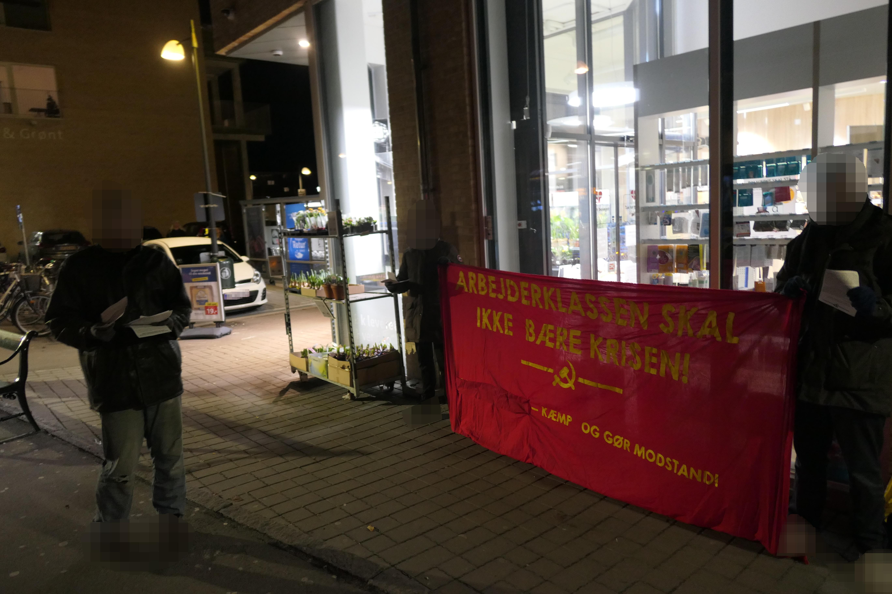
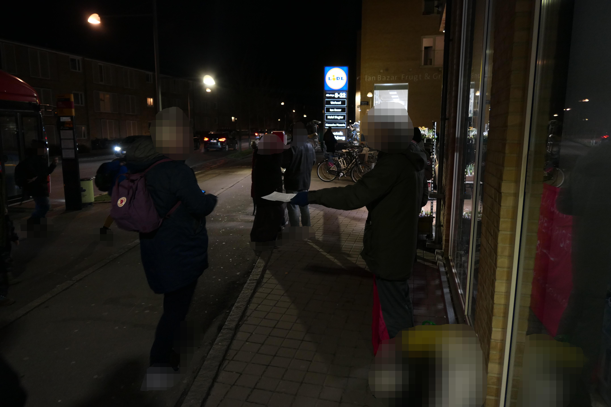
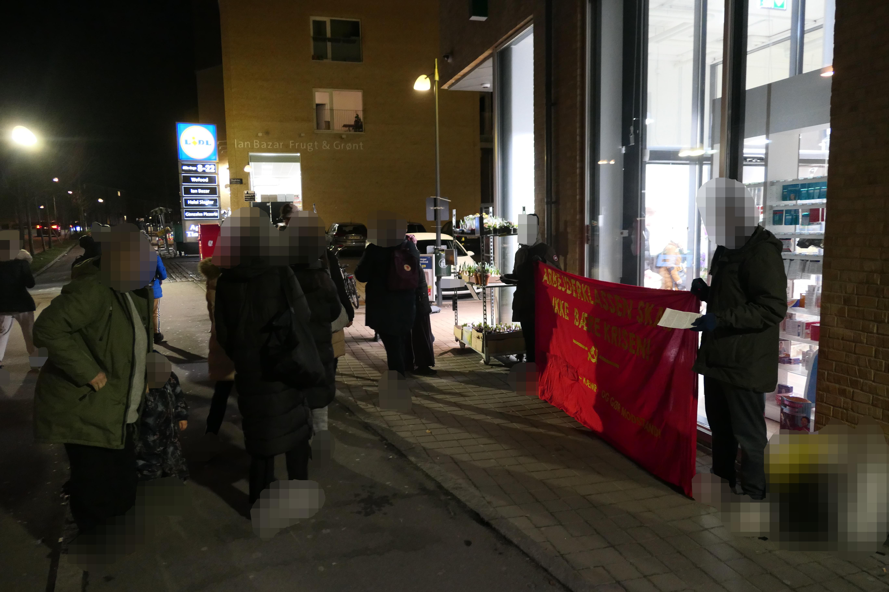

# København: Aktion imod militariseringen

Author: socialistiskrevolution

Publish Time: 2023-01-29T04:00:00+00:00

Modified Time: 2023-01-27T19:20:12+00:00

Description: Vi har modtaget dokumentation af at aktivister fra Antiimperialistisk Kollektiv har afholdt en aktion i et proletarisk nabolag imod militariseringen, afskaffelsen af vores fridag og den krigsmageri…

Images: ['[1-4.jpg](https://socialistiskrevolution.files.wordpress.com/2023/01/1-4.jpg)', '[2-5.jpg](https://socialistiskrevolution.files.wordpress.com/2023/01/2-5.jpg)', '[3-4.jpg](https://socialistiskrevolution.files.wordpress.com/2023/01/3-4.jpg)']

Type: article

Categories: ['Uncategorized']

<!--METADATA-->

Vi har modtaget dokumentation af at aktivister fra Antiimperialistisk
Kollektiv har afholdt en aktion i et proletarisk nabolag imod
militariseringen, afskaffelsen af vores fridag og den krigsmageriske regering.

Aktivisterne stod med et rødt banner med parolen »Arbejderklassen skal ikke
bære krisen! Kæmp og gør modstand!« med at hammer segl. Løbesedler blev også
delt ud.

Source: [https://socialistiskrevolution.wordpress.com/2023/01/29/kobenhavn-aktion-imod-militariseringen/](https://socialistiskrevolution.wordpress.com/2023/01/29/kobenhavn-aktion-imod-militariseringen/)