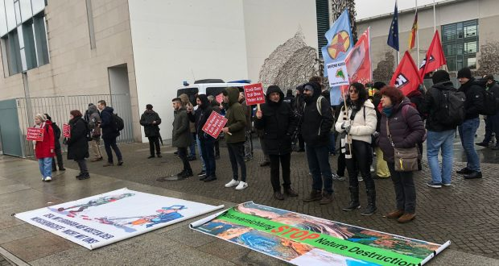
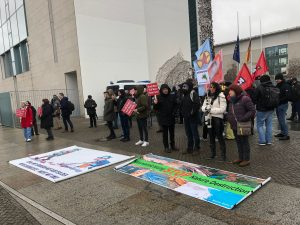

# Berlin Erdoğan ,, Not Welcome&#8222; Eylemi

Author: ['muhabirhasan']

Time: 2023-01-29T98:00:00

Description: HABER MERKEZİ|29.01.2023| Türkiye Cumhurbașkanı Recep Tayyip Erdoğan`ın Almanya Bașbakanı Olaf Schol...

Images: ['[BERLIN-3-620x330.jpg](https://www.atik-online.net/wp-content/uploads/2023/01/BERLIN-3-620x330.jpg)', '[BERLIN-2-300x225.jpg](https://www.atik-online.net/wp-content/uploads/2023/01/BERLIN-2-300x225.jpg)', '[BERLIN-4-225x300.jpg](https://www.atik-online.net/wp-content/uploads/2023/01/BERLIN-4-225x300.jpg)', '[BERLIN-3-300x225.jpg](https://www.atik-online.net/wp-content/uploads/2023/01/BERLIN-3-300x225.jpg)', '[BERLIN-1-300x225.jpg](https://www.atik-online.net/wp-content/uploads/2023/01/BERLIN-1-300x225.jpg)']

Categories: ['Avrupa', 'Haberler', 'Manset']

Type: article

<!--METADATA-->

HABER MERKEZİ|29.01.2023| Türkiye Cumhurbașkanı Recep Tayyip Erdoğan`ın
Almanya Bașbakanı Olaf Scholz ile gerçekleștireceği görüșme açıklamasının
ardından ,, Erdoğan Not Welcome İnisyatifi” öncülüğünde 27 Ocak günü Berlin’de
Bașbakanlık binası önünde gösteri ve yürüyüș protesto eylemi
gerçekleștirilmesi kararı alınmıștı. Bu görüșmenin Almanya devleti tarafından
iptal edilmesinin ardından, Erdoğan Not Welcome İnisiyatifi`nin çağrısını
yaptığı ve „Erdoğan Almanya’da can güvenliğimizi tehdit ediyor” çağrısıyla
Berlin’de eylemin yapılması kararı alındı.  
Miting șeklinde gerçekleștirilen protesto eylemi Berlin Bașbakanlık Binası
önünde 27.01.2023 tarihinde saat 13:00`da gerçekleștirildi. Eyleme Kürt ulusal
özgürlük hareketi ve devrimci, demokrat, ilerici birçok kurum ve kiși katıldı.
Ayrıca bir Yapılan mitingde, Alman hükümetinin fașist, işgalci Türk devleti
ile kirli ilişkilerine derhal son verilmesi talep edildi. Protesto eylemine
devrim ve demokrasi yolunda șehit düșenlerin adına yapılan bir dakikalık saygı
durușu ile bașlandı.  
Protesto eyleminde FED-KURD Eşbaşkanı Kerem Gök, Erdoğan Not Welcome
İnisiyatifi, , Ararat Kolektifi adına Ben Garabedian, HDP Almanya Eş Sözcüsü
Leyla İmret, Die Linke Berlin Eyalet Parlamenteri Ferat Koçak, Almanya
Türkiyeli İşçiler Konfederasyonu (ATIK) adına Süleyman Gürcan söz alarak,
yaptıkları konușmalar ile Diktatör Erdoğan ve unun șürekası önderliğinde
fașist TC devletinin Türkiye sınırları içinde ve dıșında bașta Kürtler ve
onların temsilcileri olan siyasetçiler , aynı zamanda ilerici, devrimci tüm
muhalif kesime uyguladığı baskıcı, katliamcı politikalar teșhir edilerek
mahküm edildi. Türk ve Alman ilișkilerinin fașist Türk devletinin sınır
tanımayan saldırgan tutumunda dur durak bilmeyen siyasetine ve pratiğine
verdiği katkı hep bir ağızdan lanetlendi.  
Fașist AKP-MHP iktidarının ülke içinde muhalif kiși ve kurumlara uygladığı
imha etme politikası ile yetinmeyip, sınır ötesinde de bu politikaların
hedefine Kürt siyasetçiler, devrimci, demokratlar ve muhalif kesimler koyması,
bunun en somut örneğinin en son Paris`te üç kürdün öldürülmesi ile sonuçlanan
ve yine AKP milletvekili Mehmet Açıkgöz`ün Kürtlere, devrimcilere ve
muhaliflere yönelik tehditleri ile bariz olarak ortada olduğu vurgusu yapıldı.

  

  

Source: [https://www.atik-online.net/blog/berlin-erdogan-not-welcome-eylemi](https://www.atik-online.net/blog/berlin-erdogan-not-welcome-eylemi)