# No Brasil, ações celebram fundação da Liga Comunista Internacional (atualizado 30/01)

Author: Redação de AND

Time: 2023-01-30T11:00:00-03:00

Images: ['[Via_do_Minrio_anel_rodoviario_BH_5.jpg](https://anovademocracia.com.br/images/Via_do_Minrio_anel_rodoviario_BH_5.jpg)', '[Via_do_Minrio_anel_rodoviario_BH_3.jpg](https://anovademocracia.com.br/images/Via_do_Minrio_anel_rodoviario_BH_3.jpg)', '[Shopping_Del_Rey_anel_rodovirio_3_2.jpg](https://anovademocracia.com.br/images/Shopping_Del_Rey_anel_rodovirio_3_2.jpg)', '[Shopping_Del_Rey_anel_rodoviario_BH_2.jpg](https://anovademocracia.com.br/images/Shopping_Del_Rey_anel_rodoviario_BH_2.jpg)', '[Viaduto_sao_francisco_anel_rodoviario_BH_3_2.jpg](https://anovademocracia.com.br/images/Viaduto_sao_francisco_anel_rodoviario_BH_3_2.jpg)', '[Via_do_Minrio_anel_rodoviario_BH_6.jpg](https://anovademocracia.com.br/images/Via_do_Minrio_anel_rodoviario_BH_6.jpg)', '[Viaduto_So_Francisco_anel_rodovirio_BH_5.jpg](https://anovademocracia.com.br/images/Viaduto_So_Francisco_anel_rodovirio_BH_5.jpg)', '[1366x768_10_1.jpg](https://anovademocracia.com.br/images/1366x768_10_1.jpg)', '[1366x768_9_1.jpg](https://anovademocracia.com.br/images/1366x768_9_1.jpg)', '[1366x768_8_1.jpg](https://anovademocracia.com.br/images/1366x768_8_1.jpg)', '[1366x768_7_1.jpg](https://anovademocracia.com.br/images/1366x768_7_1.jpg)', '[6a_2.jpg](https://anovademocracia.com.br/images/6a_2.jpg)', '[1366x768_13_1.jpg](https://anovademocracia.com.br/images/1366x768_13_1.jpg)', '[1366x768_12_1.jpg](https://anovademocracia.com.br/images/1366x768_12_1.jpg)', '[1366x768_11_1.jpg](https://anovademocracia.com.br/images/1366x768_11_1.jpg)', '[anel_rodoviario_1.jpg](https://anovademocracia.com.br/images/anel_rodoviario_1.jpg)', '[vila_oeste_2_1.jpg](https://anovademocracia.com.br/images/vila_oeste_2_1.jpg)', '[vila_oeste_1_2.jpg](https://anovademocracia.com.br/images/vila_oeste_1_2.jpg)', '[Lci_nort_3.jpg](https://anovademocracia.com.br/images/Lci_nort_3.jpg)', '[Lci_nort_1.jpg](https://anovademocracia.com.br/images/Lci_nort_1.jpg)', '[Lci_nort_4.jpg](https://anovademocracia.com.br/images/Lci_nort_4.jpg)', '[Lci_nort_5.jpg](https://anovademocracia.com.br/images/Lci_nort_5.jpg)', '[Lci_nort_2.jpg](https://anovademocracia.com.br/images/Lci_nort_2.jpg)', '[divulgacao1.jpg](https://anovademocracia.com.br/images/divulgacao1.jpg)', '[Pichacao2.jpg](https://anovademocracia.com.br/images/Pichacao2.jpg)', '[Pichao_encontrada_ZO_SP.jpg](https://anovademocracia.com.br/images/Pichao_encontrada_ZO_SP.jpg)', '[Guarulhos_3.jpg](https://anovademocracia.com.br/images/Guarulhos_3.jpg)', '[Guarulhos_1.jpg](https://anovademocracia.com.br/images/Guarulhos_1.jpg)', '[Foto.jpg](https://anovademocracia.com.br/images/Foto.jpg)', '[Bandeiras_LCI_-_SP_Guarulhos_Campinas_3_1.jpg](https://anovademocracia.com.br/images/Bandeiras_LCI_-_SP_Guarulhos_Campinas_3_1.jpg)', '[Bandeiras_LCI_-_SP_Guarulhos_Campinas_2_1.jpg](https://anovademocracia.com.br/images/Bandeiras_LCI_-_SP_Guarulhos_Campinas_2_1.jpg)', '[Bandeiras_LCI_-_SP_Guarulhos_Campinas_1_2.jpg](https://anovademocracia.com.br/images/Bandeiras_LCI_-_SP_Guarulhos_Campinas_1_2.jpg)', '[passarela_trem_SC_Av_Pelcleaned.jpg](https://anovademocracia.com.br/images/passarela_trem_SC_Av_Pelcleaned.jpg)', '[Passarela_metro_SCcleaned.jpg](https://anovademocracia.com.br/images/Passarela_metro_SCcleaned.jpg)', '[Passeio-pblico-Lapa-RJ.jpg](https://anovademocracia.com.br/images/Passeio-pblico-Lapa-RJ.jpg)', '[Passeio-pblico-pontos-de-onibus-RJ.jpg](https://anovademocracia.com.br/images/Passeio-pblico-pontos-de-onibus-RJ.jpg)', '[Passarela-Radial-Oeste-RJ.jpg](https://anovademocracia.com.br/images/Passarela-Radial-Oeste-RJ.jpg)', '[Lapa-proximo-hospital-RJ.jpg](https://anovademocracia.com.br/images/Lapa-proximo-hospital-RJ.jpg)', '[Cinelandia2-RJ.jpg](https://anovademocracia.com.br/images/Cinelandia2-RJ.jpg)', '[Cinelandia1-RJ.jpg](https://anovademocracia.com.br/images/Cinelandia1-RJ.jpg)', '[Estao_de_Metro_Thomz_Coelho_na_entrada_da_Favela_do_Juramento_1.jpg](https://anovademocracia.com.br/images/Estao_de_Metro_Thomz_Coelho_na_entrada_da_Favela_do_Juramento_1.jpg)', '[19-1-LCI-2.jpg](https://anovademocracia.com.br/images/19-1-LCI-2.jpg)', '[19-1-LCI-3.jpg](https://anovademocracia.com.br/images/19-1-LCI-3.jpg)', '[19-1-LCI-Metr-SFX.jpg](https://anovademocracia.com.br/images/19-1-LCI-Metr-SFX.jpg)', '[Favela_do_Jacarezinho.jpg](https://anovademocracia.com.br/images/Favela_do_Jacarezinho.jpg)', '[Passarela_13_Avenida_Brasil.jpg](https://anovademocracia.com.br/images/Passarela_13_Avenida_Brasil.jpg)', '[Passarela_12_Avenida_Brasil.jpg](https://anovademocracia.com.br/images/Passarela_12_Avenida_Brasil.jpg)', '[Passarela_14_Avenida_Brasil.jpg](https://anovademocracia.com.br/images/Passarela_14_Avenida_Brasil.jpg)', '[Estao_do_Mier.jpg](https://anovademocracia.com.br/images/Estao_do_Mier.jpg)', '[Estao_do_Nova_Amrica.jpg](https://anovademocracia.com.br/images/Estao_do_Nova_Amrica.jpg)', '[Metro_de_Maria_da_Graa.jpg](https://anovademocracia.com.br/images/Metro_de_Maria_da_Graa.jpg)', '[Passarela_do_trem_de_Olaria.jpg](https://anovademocracia.com.br/images/Passarela_do_trem_de_Olaria.jpg)', '[Quadra_do_Cefet_de_Maria_da_Graa.jpg](https://anovademocracia.com.br/images/Quadra_do_Cefet_de_Maria_da_Graa.jpg)', '[1IMG_1509_Rua_Joao_Paulo_Primeiro.jpg](https://anovademocracia.com.br/images/1IMG_1509_Rua_Joao_Paulo_Primeiro.jpg)', '[2IMG_1509_Avenida_Paulo_de_Frontin1.jpg](https://anovademocracia.com.br/images/2IMG_1509_Avenida_Paulo_de_Frontin1.jpg)', '[IMG_20230118_090539052.jpg](https://anovademocracia.com.br/images/IMG_20230118_090539052.jpg)', '[IMG_20230118_090500779.jpg](https://anovademocracia.com.br/images/IMG_20230118_090500779.jpg)', '[rua_imaculada_conceicao_1.jpg](https://anovademocracia.com.br/images/rua_imaculada_conceicao_1.jpg)', '[estacao_puc_-_linha_verde_2.jpg](https://anovademocracia.com.br/images/estacao_puc_-_linha_verde_2.jpg)', '[col_estadual_Manuel_Ribas_1.jpg](https://anovademocracia.com.br/images/col_estadual_Manuel_Ribas_1.jpg)', '[av_das_torres_1.jpg](https://anovademocracia.com.br/images/av_das_torres_1.jpg)', '[viaduto_av_comendador_franco_com_linha_verde_1.jpg](https://anovademocracia.com.br/images/viaduto_av_comendador_franco_com_linha_verde_1.jpg)', '[01_Bairro_Alto_1.jpg](https://anovademocracia.com.br/images/01_Bairro_Alto_1.jpg)', '[02_Estrada_da_ribeira_atuba_1_1.jpg](https://anovademocracia.com.br/images/02_Estrada_da_ribeira_atuba_1_1.jpg)', '[03_Linha_verde_2.jpg](https://anovademocracia.com.br/images/03_Linha_verde_2.jpg)', '[04_Linha_verde_4.jpg](https://anovademocracia.com.br/images/04_Linha_verde_4.jpg)', '[05_Linha_verde_5.jpg](https://anovademocracia.com.br/images/05_Linha_verde_5.jpg)', '[06_Linha_Verde_1_1.jpg](https://anovademocracia.com.br/images/06_Linha_Verde_1_1.jpg)', '[07_Rgis_bittencourt_atuba.jpg](https://anovademocracia.com.br/images/07_Rgis_bittencourt_atuba.jpg)', '[08_Rgis_bittencourt_atuba_2_1.jpg](https://anovademocracia.com.br/images/08_Rgis_bittencourt_atuba_2_1.jpg)', '[09_Rgis_bittencourt_atuba_4.jpg](https://anovademocracia.com.br/images/09_Rgis_bittencourt_atuba_4.jpg)', '[10_Viaduto_atuba_1.jpg](https://anovademocracia.com.br/images/10_Viaduto_atuba_1.jpg)', '[11_Viaduto_atuba_2.jpg](https://anovademocracia.com.br/images/11_Viaduto_atuba_2.jpg)', '[12_viaduto_bairro_alto_4.jpg](https://anovademocracia.com.br/images/12_viaduto_bairro_alto_4.jpg)', '[13_Viaduto_bairro_alto_3.jpg](https://anovademocracia.com.br/images/13_Viaduto_bairro_alto_3.jpg)', '[14_Viaduto_Bairro_alto_1.jpg](https://anovademocracia.com.br/images/14_Viaduto_Bairro_alto_1.jpg)', '[15_Viaduto_bairro_alto_2.jpg](https://anovademocracia.com.br/images/15_Viaduto_bairro_alto_2.jpg)', '[112_4406cleaned.jpg](https://anovademocracia.com.br/images/112_4406cleaned.jpg)', '[112_4414cleaned.jpg](https://anovademocracia.com.br/images/112_4414cleaned.jpg)', '[112_4420cleaned.jpg](https://anovademocracia.com.br/images/112_4420cleaned.jpg)', '[112_4425cleaned.jpg](https://anovademocracia.com.br/images/112_4425cleaned.jpg)', '[112_4437cleaned.jpg](https://anovademocracia.com.br/images/112_4437cleaned.jpg)', '[112_4451cleaned.jpg](https://anovademocracia.com.br/images/112_4451cleaned.jpg)', '[112_4457cleaned.jpg](https://anovademocracia.com.br/images/112_4457cleaned.jpg)', '[1-18-LCI-Maring-PR-1.jpg](https://anovademocracia.com.br/images/1-18-LCI-Maring-PR-1.jpg)', '[1-18-LCI-Maring-PR-2.jpg](https://anovademocracia.com.br/images/1-18-LCI-Maring-PR-2.jpg)', '[1-18-LCI-Maring-PR-4.jpg](https://anovademocracia.com.br/images/1-18-LCI-Maring-PR-4.jpg)', '[1-18-LCI-Maring-PR-3.jpg](https://anovademocracia.com.br/images/1-18-LCI-Maring-PR-3.jpg)', '[Pinhais_20.jpg](https://anovademocracia.com.br/images/Pinhais_20.jpg)', '[Pinhais_19.jpg](https://anovademocracia.com.br/images/Pinhais_19.jpg)', '[Pinhais_18.jpg](https://anovademocracia.com.br/images/Pinhais_18.jpg)', '[Pinhais_11.jpg](https://anovademocracia.com.br/images/Pinhais_11.jpg)', '[Pinhais_16.jpg](https://anovademocracia.com.br/images/Pinhais_16.jpg)', '[Pinhais_14.jpg](https://anovademocracia.com.br/images/Pinhais_14.jpg)', '[Pinhais_15.jpg](https://anovademocracia.com.br/images/Pinhais_15.jpg)', '[Pinhais_12.jpg](https://anovademocracia.com.br/images/Pinhais_12.jpg)', '[Pinhais_13.jpg](https://anovademocracia.com.br/images/Pinhais_13.jpg)', '[Pinhais_17.jpg](https://anovademocracia.com.br/images/Pinhais_17.jpg)', '[Pinhais_01.jpg](https://anovademocracia.com.br/images/Pinhais_01.jpg)', '[Pinhais_02.jpg](https://anovademocracia.com.br/images/Pinhais_02.jpg)', '[Pinhais_04.jpg](https://anovademocracia.com.br/images/Pinhais_04.jpg)', '[Pinhais_09.jpg](https://anovademocracia.com.br/images/Pinhais_09.jpg)', '[Pinhais_07.jpg](https://anovademocracia.com.br/images/Pinhais_07.jpg)', '[Pinhais_08.jpg](https://anovademocracia.com.br/images/Pinhais_08.jpg)', '[Pinhais_05.jpg](https://anovademocracia.com.br/images/Pinhais_05.jpg)', '[Pinhais_10.jpg](https://anovademocracia.com.br/images/Pinhais_10.jpg)', '[Pinhais_0601.jpg](https://anovademocracia.com.br/images/Pinhais_0601.jpg)', '[Pinhais_03_12.jpg](https://anovademocracia.com.br/images/Pinhais_03_12.jpg)', '[ufrgs_campu_centro.jpg](https://anovademocracia.com.br/images/ufrgs_campu_centro.jpg)', '[zona_sul.jpg](https://anovademocracia.com.br/images/zona_sul.jpg)', '[zona_leste_ufrgs_2.jpg](https://anovademocracia.com.br/images/zona_leste_ufrgs_2.jpg)', '[consulado_zona_norte.jpg](https://anovademocracia.com.br/images/consulado_zona_norte.jpg)', '[001MSDOURADOS_1.jpg](https://anovademocracia.com.br/images/001MSDOURADOS_1.jpg)', '[003MSDOURADOS.jpg](https://anovademocracia.com.br/images/003MSDOURADOS.jpg)', '[002MSDOURADOS.jpg](https://anovademocracia.com.br/images/002MSDOURADOS.jpg)', '[2MSDOURADOS_1.jpg](https://anovademocracia.com.br/images/2MSDOURADOS_1.jpg)', '[1MSDOURADOS_1.jpg](https://anovademocracia.com.br/images/1MSDOURADOS_1.jpg)', '[5adwawdawdawd.jpg](https://anovademocracia.com.br/images/5adwawdawdawd.jpg)', '[1-18-Dourados2-LCI.jpg](https://anovademocracia.com.br/images/1-18-Dourados2-LCI.jpg)', '[1-18-Dourados1-LCI.jpg](https://anovademocracia.com.br/images/1-18-Dourados1-LCI.jpg)', '[015_Universidade_Federal_do_Ama.jpg](https://anovademocracia.com.br/images/015_Universidade_Federal_do_Ama.jpg)', '[IMG_8903limpo.jpg](https://anovademocracia.com.br/images/IMG_8903limpo.jpg)', '[009_Universidade_Estadual_do_Am.jpg](https://anovademocracia.com.br/images/009_Universidade_Estadual_do_Am.jpg)', '[006_Colgio_D_Pedro_IIcleaned_1.jpg](https://anovademocracia.com.br/images/006_Colgio_D_Pedro_IIcleaned_1.jpg)', '[007_ifam_1.jpg](https://anovademocracia.com.br/images/007_ifam_1.jpg)', '[002_Carrefour_Av_Djalma_Batist.jpg](https://anovademocracia.com.br/images/002_Carrefour_Av_Djalma_Batist.jpg)', '[003_Praa_da_Matrizcleaned.jpg](https://anovademocracia.com.br/images/003_Praa_da_Matrizcleaned.jpg)', '[019_-_Estdio_Arena_da_Amaznia_1.jpg](https://anovademocracia.com.br/images/019_-_Estdio_Arena_da_Amaznia_1.jpg)', '[Goiania-City-Goias-State-Brazil-coutry.jpg](https://anovademocracia.com.br/images/Goiania-City-Goias-State-Brazil-coutry.jpg)']

<!--METADATA-->

Uma série de imagens retratando ações em celebração pela fundação da Liga
Comunista Internacional (LCI) no Brasil foram enviadas à redação de **AND**.

As fotos registram içamento de bandeiras da LCI e pichações com as palavras de
ordem: **Viva a Liga Comunista Internacional!** , **Unir-se sob o maoismo!
Abaixo o revisionismo! Abaixo a guerra imperialista! Viva a Revolução
Proletária Mundial!** , com o símbolo foice e martelo. Segundo informações
publicadas pelo jornal [Internacional Comunista](https://ci-ic.org/), a LCI
foi fundada ao término da Conferência Internacional Maoista Unificada.

**MINAS GERAIS**

****

Bandeiras içadas na Via do Minério, no Anel Rodoviário, Belo Horizonte (MG).
Foto: Banco de Dados AND

>
> [#Nacional](https://twitter.com/hashtag/Nacional?src=hash&ref_src=twsrc%5Etfw)
> | Recebemos em nosso correio eletrônico filmagem de bandeiras içadas em
> celebração a fundação da Liga Comunista Internacional (LCI). Informações
> apontam que o local dos embandeiramentos é Belo Horizonte (MG).
> [pic.twitter.com/wRYnjIxwjZ](https://t.co/wRYnjIxwjZ)
>
> — A Nova Democracia (@jornaland) [January 30,
> 2023](https://twitter.com/jornaland/status/1620078629773512704?ref_src=twsrc%5Etfw)

****

****

Bandeiras içadas na Via do Minério, no Anel Rodoviário, Belo Horizonte (MG).
Foto: Banco de Dados AND

****

Bandeiras içadas na passarela do Shopping Del Rey, no Anel Rodoviário, Belo
Horizonte (MG). Foto: Banco de Dados AND

****

Bandeiras içadas na passarela do Shopping Del Rey, no Anel Rodoviário, Belo
Horizonte (MG). Foto: Banco de Dados AND

****

Bandeiras içadas no viaduto São Francisco, no Anel Rodoviário, Belo Horizonte
(MG). Foto: Banco de Dados AND

****

Bandeiras içadas na Via do Minério, no Anel Rodoviário, Belo Horizonte (MG).
Foto: Banco de Dados AND

****

Bandeiras içadas no viaduto São Francisco, no Anel Rodoviário, Belo Horizonte
(MG). Foto: Banco de Dados AND

**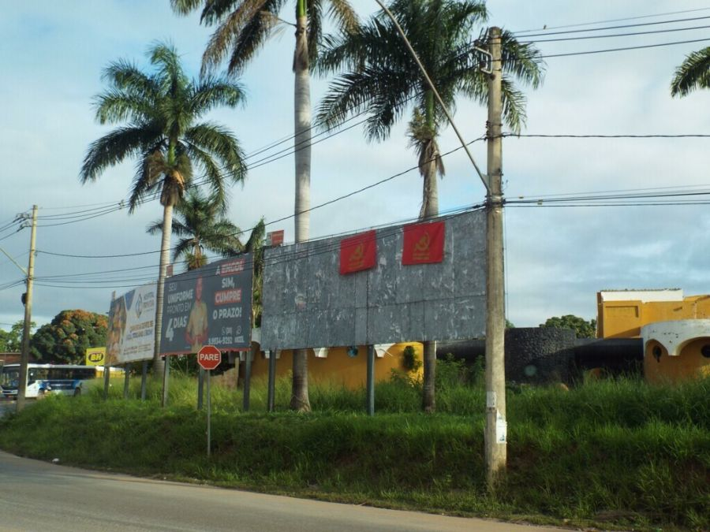**

****Bandeira içada em Montes Claros (MG). Foto: Banco de Dados AND

**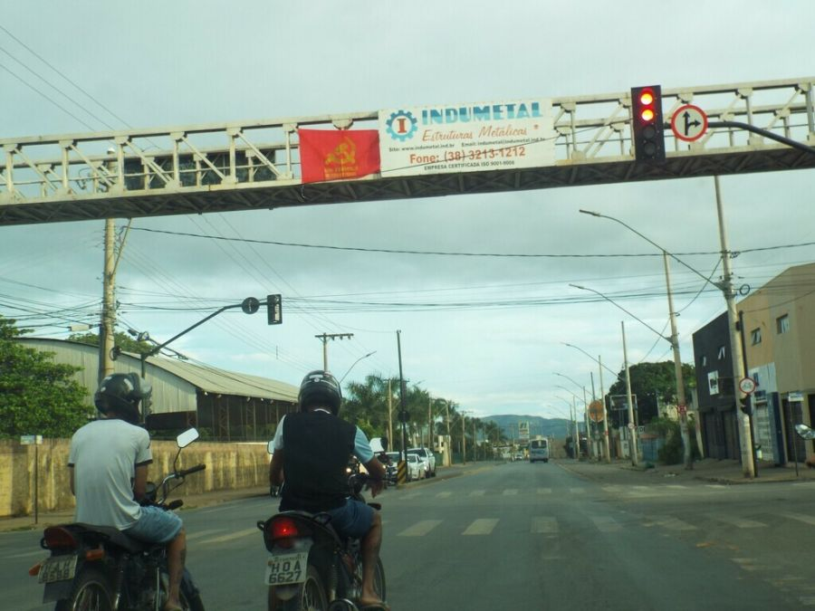**

Bandeira içada em Montes Claros (MG). Foto: Banco de Dados AND

Bandeira içada em Montes Claros (MG). Foto: Banco de Dados AND

****

****Bandeira içada em Montes Claros (MG). Foto: Banco de Dados AND

****

****Bandeira içada em Montes Claros (MG). Foto: Banco de Dados AND

****

****Bandeira içada em Montes Claros (MG). Foto: Banco de Dados AND

**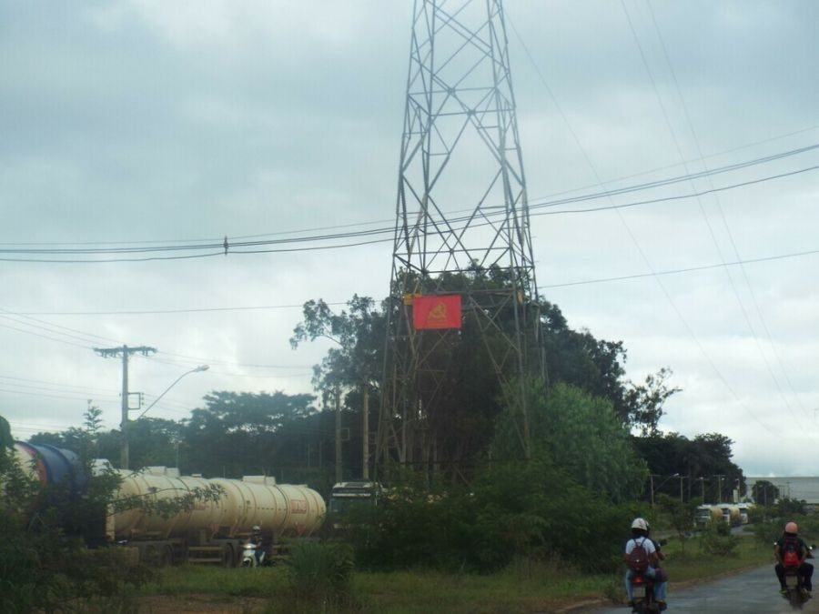**

Bandeira içada em Montes Claros (MG). Foto: Banco de Dados AND

****

Bandeira içada em Montes Claros (MG). Foto: Banco de Dados AND

****

Pichação encontrada no Anel Rodoviário, em Belo Horizonte (MG). Foto: Banco de
Dados AND

Pichação encontrada na Vila Oeste, em Belo Horizonte (MG). Foto: Banco de
Dados AND

Pichação encontrada na Vila Oeste, em Belo Horizonte (MG). Foto: Banco de
Dados AND

  
Bandeira içada em torre elétrica no Norte de Minas. Foto: Banco de Dados AND

  
Bandeira içada no Norte de Minas. Foto: Banco de Dados AND

  
Bandeira içada em fio urbano, Norte de Minas. Foto: Banco de Dados AND

  
Foto içada em ponte no Norte de Minas. Foto: Banco de Dados AND

  
Torre elétrica com bandeira içada, Norte de Minas. Foto: Banco de Dados AND

**SÃO PAULO**

**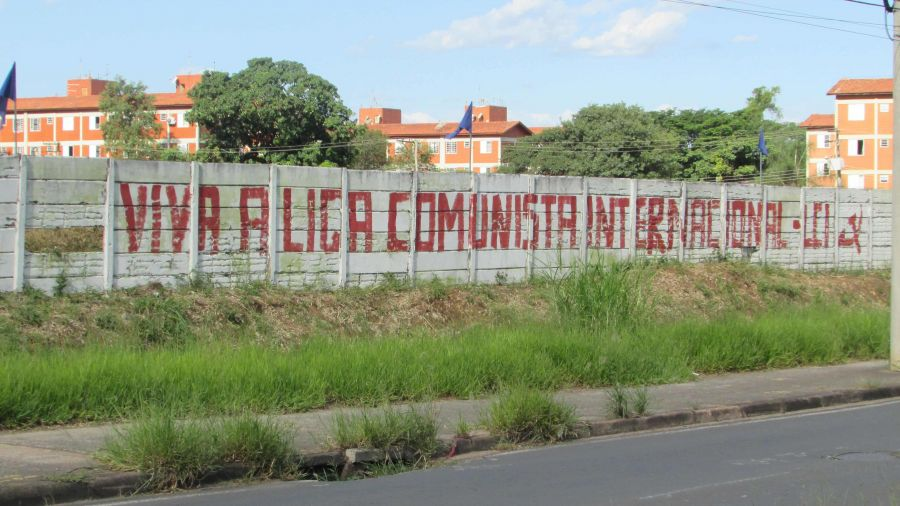**

Pichação encontrada em periferia de Campinas (SP). Foto: Banco de Dados AND

**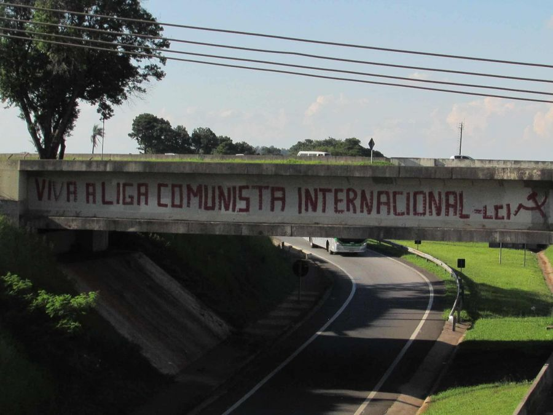**

Pichação encontrada na rodovia Anhanguera, em Campinas (SP). Foto: Banco de
Dados AND

****

Pichação encontrada na Zona Oeste de São Paulo (SP). Foto: Banco de Dados AND

****

Pichação encontrada em Guarulhos (SP). Foto: Banco de Dados AND

****

Pichação encontrada em Guarulhos (SP). Foto: Banco de Dados AND

****

Pichação avistada em Campinas (SP), próxima a uma periferia da cidade, em uma
avenida de grande circulação de operários. Foto: Banco de Dados AND

Bandeira içada em Campinas (SP). Foto: Banco de Dados AND

Bandeira içada em Guarulhos (SP). Foto: Banco de Dados AND

Bandeira içada em Guarulhos (SP). Foto: Banco de Dados AND

> Vídeo enviado à redação de AND: na virada do ano, à meia-noite do dia 31/12,
> a bandeira da Liga Comunista Internacional foi colocada no Viaduto do Chá,
> centro de São Paulo, ao lado da prefeitura.
> [pic.twitter.com/Bd4lhm0jzN](https://t.co/Bd4lhm0jzN)
>
> — A Nova Democracia (@jornaland) [January 9,
> 2023](https://twitter.com/jornaland/status/1612522186450866177?ref_src=twsrc%5Etfw)

RIO DE JANEIRO

>
> [#Nacional](https://twitter.com/hashtag/Nacional?src=hash&ref_src=twsrc%5Etfw)
> | Bandeiras e pichações celebrando a fundação da Liga Comunista
> Internacional (LCI) foram registradas e enviadas à redação de AND. Segundo
> informações, o local das filmagens é a Zona Norte do Rio de Janeiro.
> [pic.twitter.com/yl0UgULY35](https://t.co/yl0UgULY35)
>
> — A Nova Democracia (@jornaland) [January 23,
> 2023](https://twitter.com/jornaland/status/1617602519261392898?ref_src=twsrc%5Etfw)

Bandeira içada em passarela na Av Pelé, em São Cristóvão, Rio de Janeiro (RJ).
Foto: Banco de Dados AND

Bandeira içada em passarela em São Cristóvão, Rio de Janeiro (RJ). Foto: Banco
de Dados AND

Bandeira içada no Passeio Público, centro do RIo de Janeiro (RJ). Foto: Banco
de Dados AND

Bandeira içada no Passeio Público, centro do RIo de Janeiro (RJ). Foto: Banco
de Dados AND

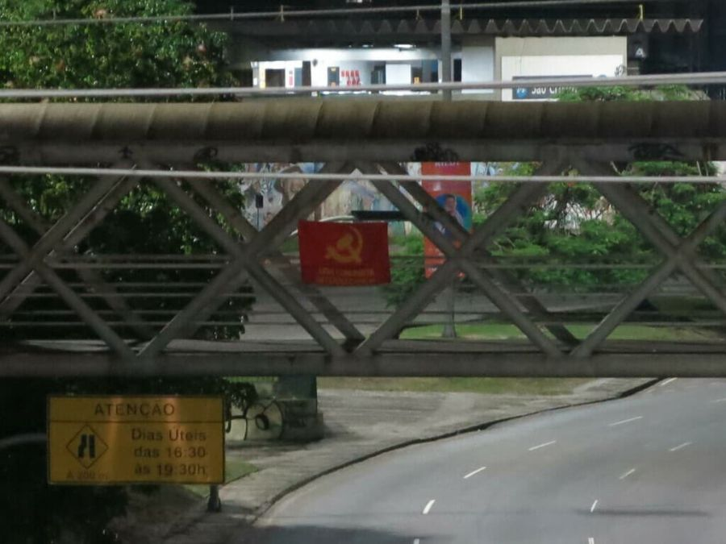

Bandeira içada na Passarela Radial Oeste, no RIo de Janeiro (RJ). Foto: Banco
de Dados AND

Bandeira içada na Lapa, centro do RIo de Janeiro (RJ). Foto: Banco de Dados
AND

Bandeira içada na Cinelândia, centro do RIo de Janeiro (RJ). Foto: Banco de
Dados AND

Bandeira içada na Cinelândia, centro do RIo de Janeiro (RJ). Foto: Banco de
Dados AND

Pichação encontrada na Estação de Metro Thomáz Coelho na entrada da Favela do
Juramento, no Rio de Janeiro (RJ). Foto: Banco de Dados AND

Bandeira da Liga Comunista Internacional na zona norte do Rio de Janeiro.
Foto: Banco de Dados AND

Bandeira da Liga Comunista Internacional no Rio de Janeiro. Foto: Banco de
Dados AND

Bandeira da Liga Comunista Internacional em posto do Metrô da São Francisco
Xavier. Foto: Banco de Dados AND

Bandeira içada na Favela do Jacarezinho, no Rio de Janeiro. Foto: Banco de
dados AND

Bandeira na passarela 13 na AV. Brasil. Foto: Banco de dados AND

Bandeira na Passarela 12 da Avenida Brasil, na capital. Foto: Banco de dados
AND

Bandeira na passarela 14 da Avenida Brasil. Foto: Banco de dados AND

Bandeira içada na Estação do Meier, na Capital. Foto: Banco de dados AND

Estação Nova América, na Capital do estado. Foto: Banco de dados AND

Estação de metro Maria da Graça, na Capital do estado. Foto: Banco de Dados
AND

Bandeira na passarela do trem do bairro de Olaria, na Capital. Foto: Banco de
dados AND

Quadra do CEFET de Maria da Graça, na Capital. Foto: Banco de dados AND

Pichação na rua João Paulo Primeiro, Estácio, Rio de Janeiro. Foto: Banco de
Dados AND

Pichação em viaduto próximo ao viaduto Paulo de Frontin, que liga zonas norte
e sul do Rio de Janeiro. Foto: Banco de Dados AND

SANTA CATARINA

Bandeiras com a foice e martelo junto da inscrição "Liga Comunista
Internacional" na passarela do terminal Rita Maria, no centro de
Florianópolis. Foto: Banco de Dados AND

Bandeiras com a foice e martelo junto da inscrição "Liga Comunista
Internacional" na passarela do terminal Rita Maria, no centro de
Florianópolis. Foto: Banco de Dados AND

**PARANÁ**

**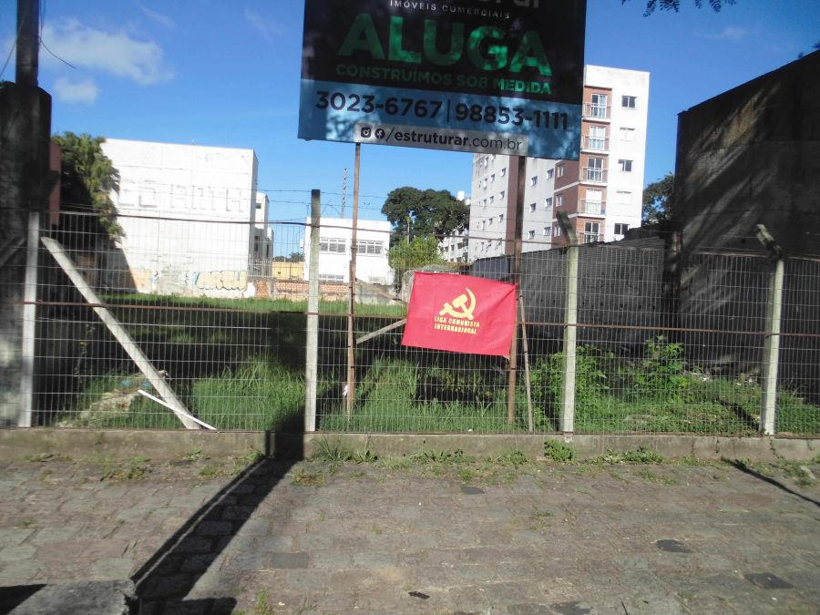**

Bandeira içada na rua Imaculada Conceição, em Curitiba (PR). Foto: Banco de
Dados AND

****

Bandeiras içadas na estação da Pontifícia Universidade Católica (PUC), em
Curitiba (PR). Foto: Banco de Dados AND

****

Bandeiras içadas no colégio estadual Manuel Ribas em Curitiba (PR). Foto:
Banco de Dados AND

Bandeiras içadas na Avenida das Torres, em Curitiba (PR). Foto: Banco de Dados
AND

****

Bandeiras içadas no viaduto da Avenida Comendador Franco, em Curitiba (PR).
Foto: Banco de Dados AND

****

Bandeira içada próximo ao Terminal do Bairro Alto, Curitiba (PR). Foto: Banco
de Dados AND

Bandeira içada na Estrada da Ribeira, bairro Atuba, Curitiba (PR). Foto: Banco
de Dados AND

Bandeira içada próx. à Estação Fagundes Varela, Av. Linha Verde, Curitiba
(PR). Foto: Banco de Dados AND

Bandeira içada próx. à Estação Fagundes Varela, Av. Linha Verde, Curitiba
(PR). Foto: Banco de Dados AND

Bandeira içada próx. à Estação Fagundes Varela, Av. Linha Verde, Curitiba
(PR). Foto: Banco de Dados AND

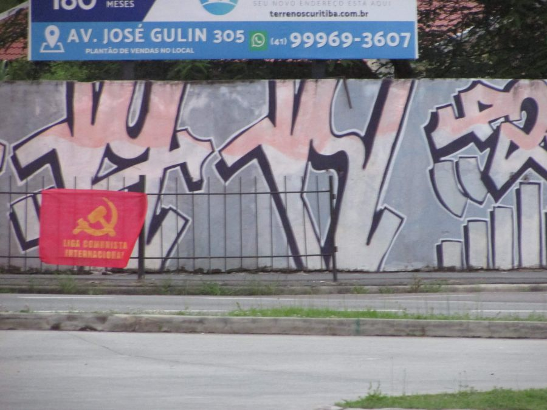

Bandeira içada próx. à Estação Fagundes Varela, Av. Linha Verde, Curitiba
(PR). Foto: Banco de Dados AND

Bandeira içada na Rodovia Régis Bitencourt, Bairro Atuba, Curitiba (PR). Foto:
Banco de Dados AND

Bandeira içada na Rodovia Régis Bitencourt, Bairro Atuba, Curitiba (PR). Foto:
Banco de Dados AND

Bandeiras içadas na Rodovia Régis Bitencourt, Bairro Atuba, Curitiba (PR).
Foto: Banco de Dados AND

Bandeira Içada na Av. Mal. Mascarenhas de Morais sentido Colombo, Bairro
Atuba, Curitiba (PR). Foto: Banco de Dados AND

Bandeira Içada na Av. Mal. Mascarenhas de Morais sentido Colombo, Bairro
Atuba, Curitiba (PR). Foto: Banco de Dados AND

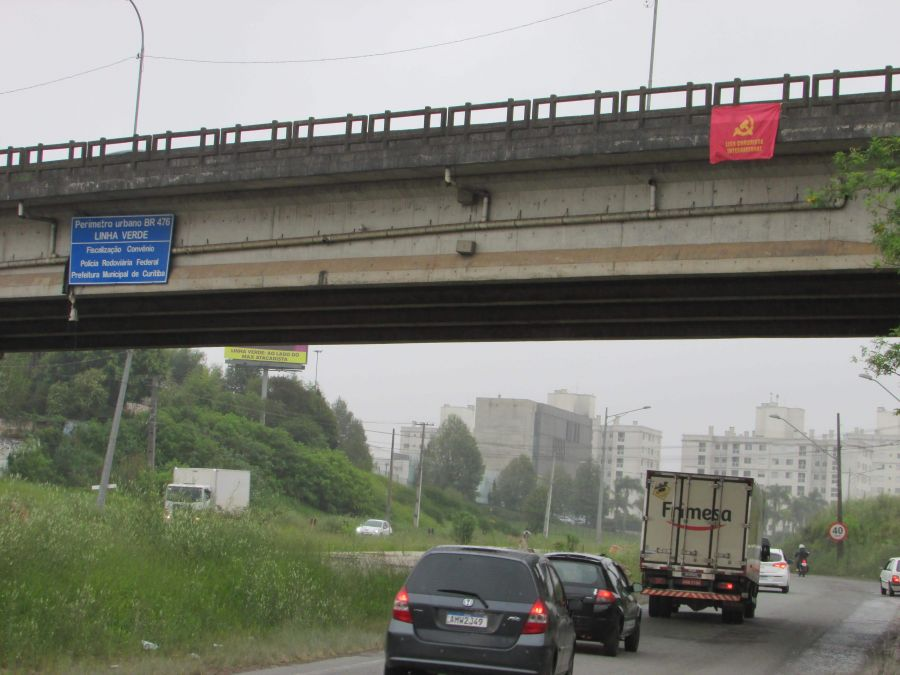

Bandeira Içada na Linha Verde, viaduto do Bairro Alto, Bairro Atuba, Curitiba
(PR). Foto: Banco de Dados AND

Bandeira Içada na Linha Verde, viaduto do Bairro Alto, Bairro Atuba, Curitiba
(PR). Foto: Banco de Dados AND

Bandeira Içada na Av. Monteiro Tourinho, Bairro Atuba, Curitiba (PR). Foto:
Banco de Dados AND

Bandeira Içada na Av. Monteiro Tourinho, Bairro Atuba, Curitiba (PR). Foto:
Banco de Dados AND

****

Bandeira içada no Viaduto Estaiado, bairro Guabirotuba, em Curitiba. Foto:
Banco de Dados AND  

Bandeira içada no Centro Politécnico da UFPR, bairro Jardim das Américas, em
Curitiba. Foto: Banco de Dados AND  

Bandeira içada no Centro Politécnico da UFPR, bairro Jardim das Américas, em
Curitiba. Foto: Banco de Dados AND  

Bandeira içada no Centro Politécnico da UFPR, bairro Jardim das Américas, em
Curitiba. Foto: Banco de Dados AND  

Bandeira içada no Centro Politécnico da UFPR, bairro Jardim das Américas, em
Curitiba. Foto: Banco de Dados AND  

Bandeira içada nas proximidades do Shopping Jardim das Américas, em Curitiba.
Foto: Banco de Dados AND  

Bandeira içada na trincheira da BR 277 acima da Rua Rodolpho Senff, entre os
bairros Cajuru e Jardim das Américas, em Curitiba. Foto: Banco de Dados AND

Pichação em Maringá, município do Paraná. Foto: Banco de Dados AND

Pichação em Maringá, município do Paraná. Foto: Banco de Dados AND

Pichação em Maringá, município do Paraná. Foto: Banco de Dados AND

Pichação em Maringá, município do Paraná. Foto: Banco de Dados AND

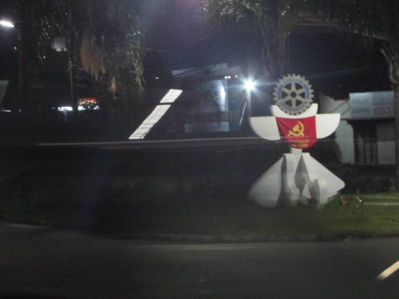

Bandeiras içadas na Avenida Leopoldo Jacomel, Centro de Pinhais. Foto: Banco
de dados AND

Bandeiras içadas em Rua Jacarezinho, bairro Pineville, cidade de Pinhais.
Foto: Banco de dados AND

Bandeiras içadas em Rua Alto Paraná, bairro Emiliano Perneta, em Pinhais.
Foto: Banco de dados AND

Bandeiras içadas na Avenida Maringá, bairro Emiliano Perneta, em Pinhais.
Foto: Banco de dados AND

Bandeiras içadas na Rua Jacarezinho, bairro Alto Tarumã, em Pinhais. Foto:
Banco de dados AND

Bandeiras içadas em Avenida Jacob Macanhan, bairro Centro, em Pinhais. Foto:
Banco de dados AND

Bandeiras içadas na Avenida Maringá, bairro Emiliano Perneta, em Pinhais.
Foto: Banco de dados AND

Bandeiras içadas na Avenida Maringá, bairro Atuba, em Pinhais. Foto: Banco de
dados AND

Bandeiras içadas na Avenida Maringá, esq. com a Avenida Leopoldo Jacomel, em
Pinhais. Foto: Banco de dados AND

Bandeiras içadas na Avenida Maringá, bairro Emiliano Perneta, em Pinhais.
Foto: Banco de dados AND

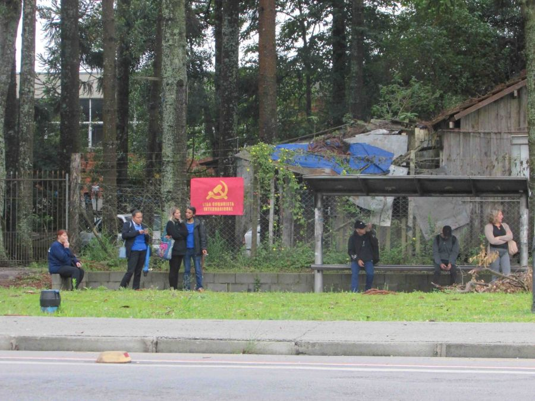

Bandeiras içadas na Avenida Maringá, bairro Emiliano Perneta, em Pinhais.
Foto: Banco de dados AND

Bandeiras içadas Avenida Leopoldo Jacomel, divisa com Curitiba, em Pinhais.
Foto: Banco de dados AND

Bandeiras içadas na Rua Jacarezinho, bairro Pineville em Pinhais. Foto: Banco
de dados AND

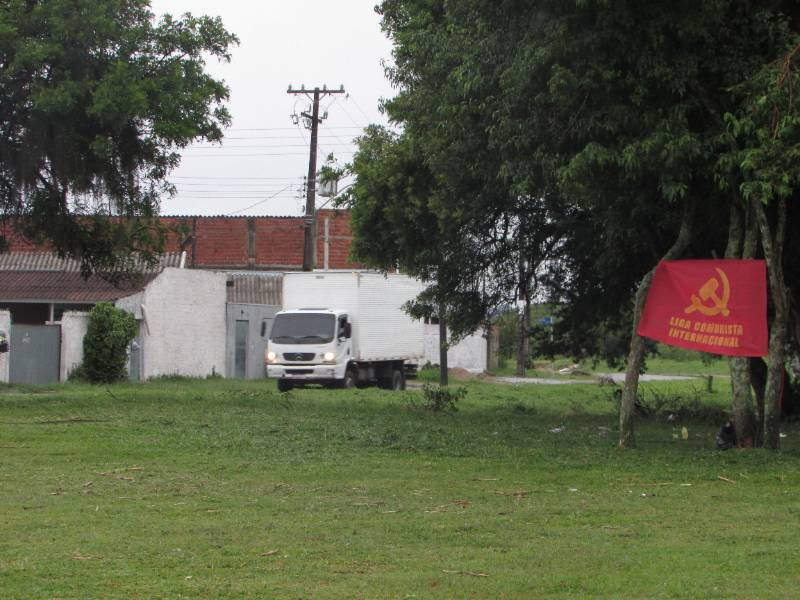

Bandeiras içadas na Rua Floral, bairro Alto Tarumã, em Pinhais. Foto: Banco de
dados AND

Bandeiras içadas Rua Jacarezinho, bairro Alto Tarumã, em Pinhais. Foto: Banco
de dados AND

Bandeiras içadas no Centro cultural e esportivo Arizona, bairro Alto Tarumã em
Pinhais. Foto: Banco de dados AND

Bandeiras içadas na Avenida Maringá, bairro Emiliano Perneta em Pinhais. Foto:
Banco de dados AND

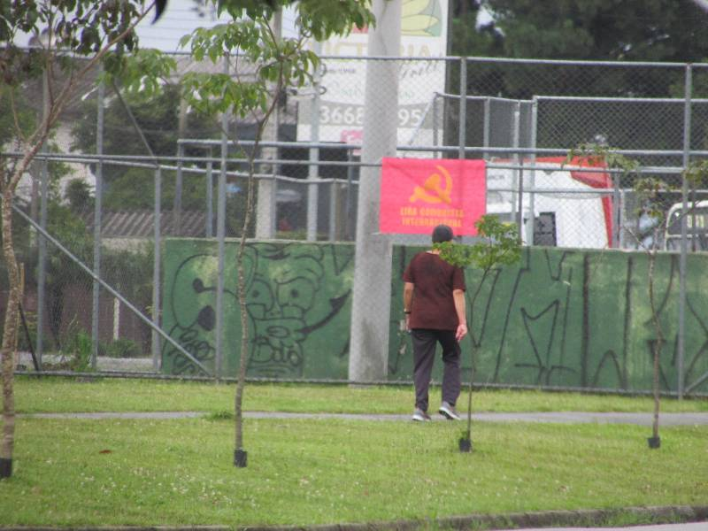

Bandeiras içadas na Avenida Maringá, bairro Emiliano Perneta, em Pinhais.
Foto: Banco de dados AND

Bandeiras içadas no Bosque Municipal Bordignon, bairro Pineville, em Pinhais.
Foto: Banco de dados AND

Bandeira içada em Avenida Jacoob Macanhan, bairro Pineville em Pinhais. Foto:
Banco de dados AND

****RIO GRANDE DO SUL

Bandeiras içadas na Universidade Federal do Rio Grande do Sul, no centro de
Porto Alegre (RS). Foto: Banco de Dados AND

Bandeira içada na Zona Sul de Porto Alegre (RS). Foto: Banco de Dados AND

Bandeiras içadas na Universidade Federal do Rio Grande do Sul (UFRGS), na Zona
Leste de Porto Alegre (RS). Foto: Banco de Dados AND

Bandeiras içadas em Porto Alegre (RS). Foto: Banco de Dados AND

MATO GROSSO DO SUL

Bandeira da LCI içada em Dourados (MS). Foto: Banco de Dados AND

Pichação em Dourados (MS). Foto: Banco de Dados AND

Bandeira da LCI içada em Dourados (MS). Foto: Banco de Dados AND

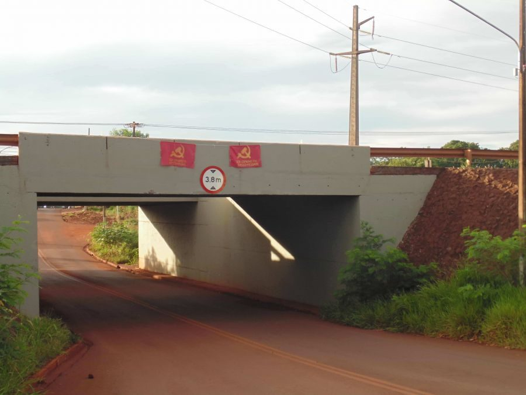

Bandeiras da LCI içadas em Dourados (MS). Foto: Banco de Dados AND

Bandeira da LCI içada em Dourados (MS). Foto: Banco de Dados AND

Bandeira da LCI içada em Dourados (MS). Foto: Banco de Dados AND

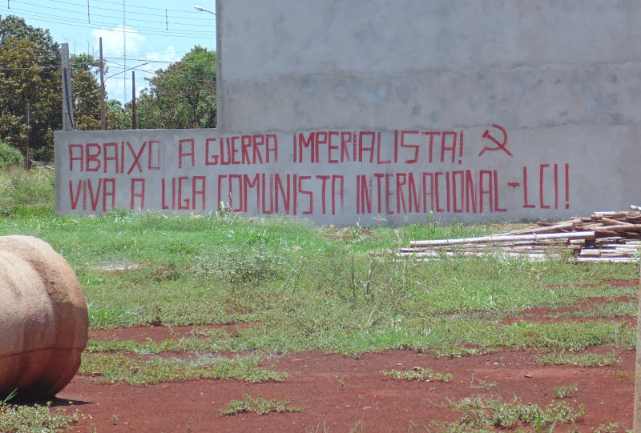

Pichação em Dourados, Mato Grosso do Sul. Foto: Banco de Dados AND

Pichação em Dourados, Mato Grosso do Sul. Foto: Banco de Dados AND

****

**Amazonas**

Bandeiras colocadas na Universidade Federal do Amazonas. Foto: Banco de dados
AND

Pichação encontrada em Manaus, capital do estado. Foto: Banco de dados AND

Bandeiras na Universidade Estadual do Amazonas. Foto: Banco de dados AND

Bandeiras no Colégio Pedro II, em Manaus. Foto: Banco de dados AND

Bandeiras no Instituto Federal do Amazonas em Manaus. Foto: Banco de dados AND

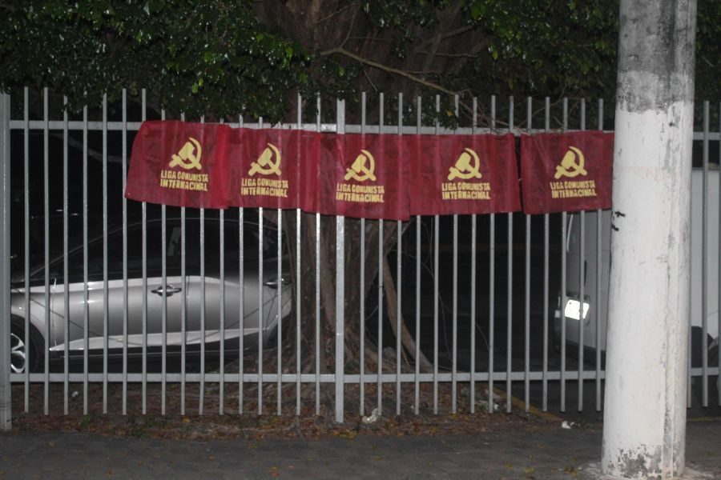

Bandeiras no mercado Carrefour da Av. Djalma Batista em Manaus. Foto: Banco de
dados AND

Bandeiras na Praça da Matriz em Manaus. Foto: Banco de dados AND

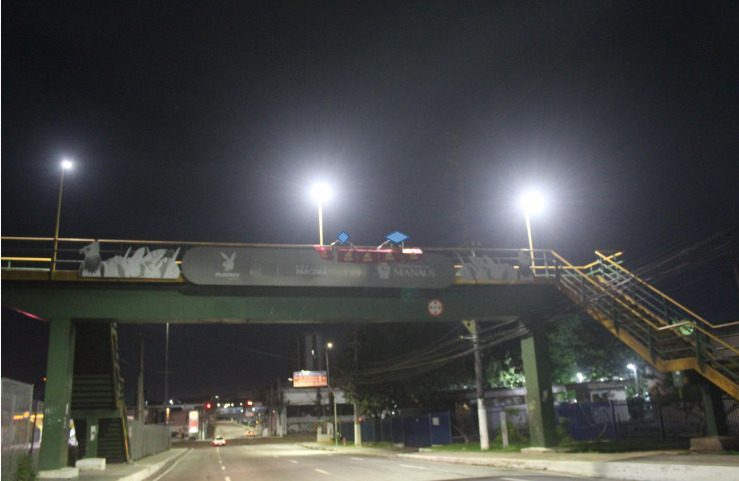

Bandeiras no Estádio Arena da Amazônia. Foto: Banco de dados AND

**GoiÁS**

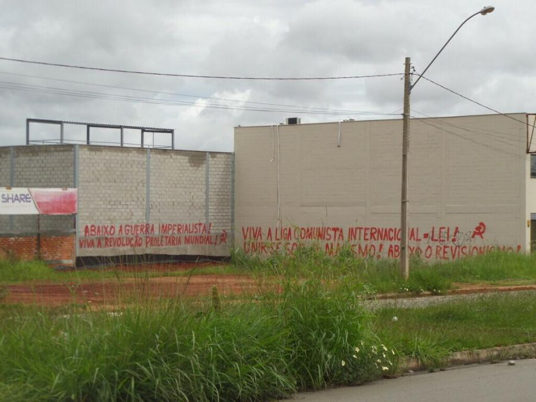

Pichação encontrada na cidade de Goiânia, em Goiás. Foto: Reprodução/ CI-IC

****

Source: [https://anovademocracia.com.br/noticias/18567-acoes-celebram-fundacao-da-lci-no-brasil](https://anovademocracia.com.br/noticias/18567-acoes-celebram-fundacao-da-lci-no-brasil)