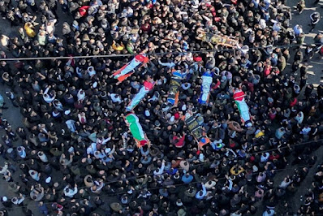
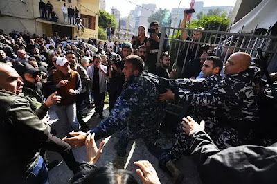

# Breves iniciando semana

Author: SolRojista (Person)

Publisher: Blogger (Organization)

Description: Imagen tomada de France 24  Ucrania. En el curso de la guerra de ocupación del
imperialismo ruso en Ucrania, las manos sanguinarias del i...

Publish Time: 2023-01-30T12:20:00-08:00

Modified Time: 2023-01-30T12:24:04-08:00

Images: ['[maxresdefault.jpg](https://blogger.googleusercontent.com/img/b/R29vZ2xl/AVvXsEgDPcfmDJIlPU71fLgfwJYjDut_VzOoqpBsHWibSmOo0xqptLSDQwHj4U6TeVremmElavXHImbo1eK6gOT1815b-ABfhm5mfbkouehcNsOYefnr8ozacvNIhRhJrzvRC2tQ-xmp1rVq0K33_SozkZ_OcegVOmVakL_X-RThtdqtc8Mfs0eqjBY2w_0_/w400-h225/maxresdefault.jpg)', '[pal-2-850x567.jpg](https://blogger.googleusercontent.com/img/b/R29vZ2xl/AVvXsEgIvWXIH1s9kKfmR8rU_8q775yfW_zBtcixK3eBaN1auCZuU_RxAySxHZrCK8q1vkkghteD5NzMcn2ce6xnpg3NXg_Z0676QLcRivDFQ52N-uofujjHM3zGgyEpK15gc9YAo17-Zw2eSB3pquSwePf-Fc7jvm9CM9_tSIbHyUnLLVaJin7nSHlC4U63/w400-h266/pal-2-850x567.jpg)', '[ca-times.brightspotcdn.webp](https://blogger.googleusercontent.com/img/b/R29vZ2xl/AVvXsEjLXUWuYMPsQj55nd3hUotV6hkEaZNH0xLYa7VUDUfj8ibQs6qCUQZNLIbO6kJ4Mb7_ASJwyRHN89pXe8xCuDwJmsKRaCu5EBrAg7_MxceJmhGdCI-vFXHLRqW-SxVz8nVgT13Ox-6kiwqEZ6aB0cEtWm_ZYPcvWRte2SKIzq3Pw3SJp6J1PqItU4gJ/w400-h266/ca-times.brightspotcdn.webp)', '[collage%20agresiones%20istmo.jpeg](https://blogger.googleusercontent.com/img/b/R29vZ2xl/AVvXsEij3bUBFXAksSvJu0QtbCrZWwXMMNunWeJEpCqlx-gu_n8VEYgNlJXg6T3Zc2O4Wbg0Xso3rrg8xfnx-etHYqrU6llprFyhL2LecRHujsZsHr3-gXIwsyUazkChF9l6LlELKN0pXN1b6L-J_2w9iLE8u5Fn0qOqGSneEvPWCH0KfkI9Zf75WUv2bISQ/w400-h266/collage%20agresiones%20istmo.jpeg)']

<!--METADATA-->

  
---  
Imagen tomada de France 24  
  

**Ucrania.** En el curso de la guerra de ocupación del imperialismo ruso en
Ucrania, las manos sanguinarias del imperialismo yanqui y alemán continúan
apoyando al gobierno nazi de Kiev prolongando la carnicería, donde las únicas
víctimas son los trabajadores y los pueblos. Los gobiernos reaccionarios de
EE.UU. y Alemania han anunciado el envío de tanques de guerra para apoyar el
títere Zelensky. Se trata de 14 tanques Leopard-2 (Alemania) y 31 tanques
Abrams (EE.UU.) los cuales se sumarían a los 14 tanques Challenger
(Inglaterra) que se habían anunciado previamente. Este conflicto bélico por el
nuevo reparto de las zonas de influencia en Europa busca despresurizar la
crisis general del imperialismo y su efecto es justamente el contrario, pues
además de las evidentes penurias de la guerra imperialista sobre los
territorios en disputa, el nivel de vida de las masas en otros países se
deteriora aún más con el alza del costo de la vida, la especulación, la
explotación y la miseria. Debemos recordar que no existen los imperialismos
buenos, todas las potencias y súper potencias tienen las manos manchadas de
sangre de la clase obrera y los pueblos oprimidos. ¡Abajo los imperialismos
yanqui y ruso! ¡Abajo el gobierno nazi de Kiev! ¡Abajo la guerra imperialista!

****

**  
 **

**Palestina.** Una nueva masacre se registró en la Cisjordania ocupada en un
campamento de refugiados en Jenin. El ejército fascista-sionista de ocupación
irrumpió el pasado 26 de enero lanzando una enorme cantidad de gases
lacrimógenos contra un hospital pediátrico -lo que obligó a la evacuación de
los niños-, mientras que realizó una innumerable cantidad de disparos de armas
de fuego contra la población. Israel justificó esta incursión diciendo que se
trató de "un operativo antiterrorista". Al menos 9 palestinos fueron
asesinados por el ejército israelí, entre las víctimas mortales se encuentra
Magda Obaid, una mujer de 61 años quien murió de un disparo en el cuello.
Decenas de palestinos fueron lesionados o intoxicados con los gases.
Paralelamente en Jerusalén un décimo palestino fue asesinado por el ejército
sionista. Como resultado de esto, diversas facciones de la resistencia
palestina han jurado que vengarán a los mártires. Al momento Israel lleva más
de 30 palestinos asesinados en este inicio de 2023.

****

**  
 **

**Líbano.** El 4 de agosto de 2020 una explosión sacudió Beirut, el puerto y
capital de ese país; [desde
entonces](https://solrojista.blogspot.com/2020/08/breves-iniciando-
semana_17.html) las masas han tomado las calles en diversos momentos
denunciando la corrupción y burocracia campante que derivaron en aquella
tragedia. Luego de mantener la investigación durante 13 meses en suspenso, el
lunes pasado el juez de causa retomó la instrucción acusando al fiscal general
y a otros altos funcionarios de Estado por obstruir las investigaciones; en
respuesta la Fiscalía ha iniciado una investigación contra el juez por
"rebelión contra la justicia" y "usurpación", además de ordenar la liberación
de todos los funcionarios detenidos por la explosión. Entre los detenidos ya
liberados se encuentra Ziad Auf, funcionario portuario con doble nacionalidad
(libanesa-estadounidense) y por el cual el gobierno imperialista de EE.UU.
ejerció demasiada presión sobre Beirut para ser liberado y repatriado. El
jueves mismo las masas han vuelto a tomar las calles y los juzgados, ahí se
registraron algunos enfrentamientos entre familiares de las víctimas y la
policía antimotines.

  

**México.** La guerra contra el pueblo se profundiza, y las operaciones del
viejo Estado terrateniente-burocrático se están concentrando contra los
trabajadores y los pueblos en resistencia. A pesar de toda la parafernalia de
la autoproclamada "cuarta transformación" luego de la captura de Ovidio
Guzmán, el juicio contra Genaro García Luna o los incidentes en el metro de la
CDMx, lo cierto es que los esfuerzos principales del régimen están centrados
en cercar, aislar, contener, criminalizar y exterminar al movimiento popular,
especialmente a las izquierdas anticapitalistas. Si vemos rápidamente los
últimos acontecimientos en el país, además de la reciente militarización del
metro con la Guardia Nacional, podemos tener una idea más clara. En Michoacán
fueron desaparecidos los compañeros Ricardo Lagunes Gasca y Antonio Díaz
Valencia, el primero de ellos abogado democrático y el segundo dirigente
comunitario que han estado visiblemente a la cabeza de la resistencia contra
el proyecto minero "Las Encinas". Mientras tanto en el Istmo de Tehuantepec en
menos de 15 días se han registrado distintas agresiones; la primera fue la
detención arbitraria de David Hernández Salazar, de la comunidad Binniza´ de
Puente Madera, Municipio de San Blas Atempa; el pasado 17 de enero David fue
detenido por agentes de investigación en Tehuantepec y trasladado al
reclusorio de Tanivet donde horas después fue puesto en libertad vinculado a
proceso por oponerse a la imposición de un polígono industrial del Corredor
Interoceánico del Istmo de Tehuantepec (CIIT); la segunda ha sido el
hostigamiento contra ejidatarios y comuneros de la zona norte del Istmo
quienes realizaban un bloqueo a las vías de ferrocarril tras expulsar a
trabajadores de la empresa que realiza las obras del CIIT, en represalia desde
el día 26 de enero arribaron elementos de la Secretaría de Marina Armada de
México para tratar de intimidar a la población, lo que derivó en nuevas
protestas y la llegada de más campesinos a reforzar la lucha. Por último el
día de ayer, 29 de enero sujetos armados a bordo de 10 camionetas arribaron a
la comunidad de Rincón Tagolaba, Tehuantepec, derrumbando las cadenas de
acceso a la comunidad, los postes y cercos de las viviendas, realizando
detonaciones al aire e incendiando pertenencias de la población. Al mando de
estos iba el mercenario "Tacho" Canasta y su hermano Sergio Gutiérrez quien se
ostenta indebidamente como "comisariado" de Santa Cruz Tagolaba; su objetivo
es intimidar a la población para adueñarse de las tierras de la comunidad y
negociarlas con el CIIT. Muchas horas después arribó un operativo de la
Guardia Nacional tras las denuncias ante organismos públicos de derechos
humanos, pero los agresores ya se habían retirado llevándose consigo la
evidencia de la agresión armada.

Source: [http://solrojista.blogspot.com/2023/01/breves-iniciando-semana_30.html](http://solrojista.blogspot.com/2023/01/breves-iniciando-semana_30.html)