# pc 30 gennaio: Continua il nostro centrale lavoro nelle grandi fabbriche. Mirafiori: le voci degli operai e le nostre indicazioni e proposte: Assemblea proletaria anticapitalista a Roma 18 febbraio, assemblea delle operaie a Torino nella settimana dell'8 marzo

Author: fannyhill

Time: 2023-01-30T10:43:00+01:00

Images: ['[fiat.jpg](https://blogger.googleusercontent.com/img/b/R29vZ2xl/AVvXsEiYTMIJTtyCVUPd65lq9bzFTwfeybfD5JYp-emjf5FSOw61hNQVVzhMp_rigcIlLbcogDmWJpRkD8h8FsfFEmbTvj3Apf3zgDsQuOkjED68w2wnWWs2Za2qYxrmXknrH5OJHX5GbCMIdgWIUN0kJtxNcEMKeZTCFfPdCxoZcwWJOvY7o19VoPkkyecvNg/s320/fiat.jpg)']

<!--METADATA-->

Iniziativa a Mirafiori alla portineria, con affissione cartelloni con le
nostre indicazioni e bandiere dello Slai Cobas a fianco. Si sono diffusi
volantini, distribuiti anche per un contatto diretto e uno scambio con le
operaie e gli operai che entrano ed escono dalla portineria per il primo e
secondo turno.

Appreso che quel giorno al lavoro c'erano anche gli operai del turno centrale
della Maserati, siamo tornati alle 16.00 per l'uscita. Ciò ha permesso di
parlare anche con gli operai di questo reparto sulla situazione generale e sul
contratto aziendale dove manca informazione e prospettiva.

Nel corso della mattinata si era diffusa la notizia che a maggio chiudono gli
incentivi per la Lear (sedili) per mandar via e che ci saranno operai in mezzo
alla strada, e c'era malumore.

I cartelloni, visti e letti in diversi casi in modo evidente, sono diventati
occasione per iniziare a parlare "non è più vita, guerra e carovita, il
contratto unico per tutto il gruppo"; le bandiere hanno attirato l'attenzione,
è stata infatti, come qualcuno diceva "la giornata dei cobas".

Questo è stato chiaro fin dal primo operaio che quando ci ha visto preparare i
cartelloni, un pò sorpreso, si ha detto "non pensavo ce ne fossero ancora di
queste iniziative, non hanno più possibilità queste iniziative a Mirafiori";
abbiamo spiegato che il nostro intervento c'è proprio perchè non abbiamo
alternative.

Altri, vedendo le bandiere hanno detto: "anch'io ero dei cobas… c'erano anche
i cobas al tempo degli scioperi per la panda (2002 circa) ma poi con i
contratti di solidarietà non li hanno più fatti entrare…"; "c'erano anche i
cobas quando c'erano i cortei, i cobas adesso sono la' a schiattare quelli
rimasti, c'è gente eliminata, messi fuori...".

Diversi altri operai hanno parlato di questa presenza passata in vario modo
"anch'io ero dei cobas, avete ragione, adesso leggo con attenzione...
Arrabbiati e rassegnati non va bene, bisogna essere combattivi... no non mi
arrendo".

Molto evidenti i guardiani, che come al solito osservano il movimento degli
operai attorno a noi, e davanti alla portineria i lavoratori erano più
sfuggenti, e un paio di operaie lo hanno detto esplicitamente.

In generale gli operai avevano voglia di parlare, e alcuni sono stati
nettamente critici verso i sindacati confederali, i delegati "che se ne stanno
la' seduti a non fare niente" rispetto a quello che succede in fabbrica; "noi
abbiamo già detto ai sindacati dentro i nostri problemi, ma più di tanto non
possono fare.

Di fronte alla ristrutturazione del gruppo, al carovita, alla guerra, al
governo Meloni, la proposta dell'assemblea operaia è quella necessaria per
unire, organizzare, dare prospettiva agli operai che nelle fabbriche vogliono
opporsi. Per questo abbiamo portato nei cartelli e nel volantino l'indicazione
della nuova **Assemblea proletaria anticapitalista che si terra' a Roma il 18
febbraio.**

[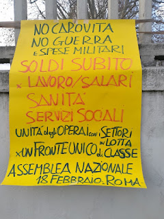](https://blogger.googleusercontent.com/img/b/R29vZ2xl/AVvXsEiYTMIJTtyCVUPd65lq9bzFTwfeybfD5JYp-
emjf5FSOw61hNQVVzhMp_rigcIlLbcogDmWJpRkD8h8FsfFEmbTvj3Apf3zgDsQuOkjED68w2wnWWs2Za2qYxrmXknrH5OJHX5GbCMIdgWIUN0kJtxNcEMKeZTCFfPdCxoZcwWJOvY7o19VoPkkyecvNg/s640/fiat.jpg)

Operaie raccontano di una situazione in fabbrica molto seria, è d'accordo che
senza la lotta degli operai non ci possono essere risultati, ma che c'è paura,
individualismo, si pensa che 'non c'è più niente da fare'; "Il problema di
fondo, sai, è la paura, non si fa più lo sciopero. Se qua dentro facciamo gli
scioperi, ne paghi le conseguenze. Vieni messa a fare i lavori peggiori, a
parte che di belli qua dentro non c'è né, però bisogna ribellarsi tutti quanti
assieme... fuori da qua abbiamo una vita, una casa".

Altri operai e operaie confermano: "Si' sempre di più, lavoro da 30 anni,
arrivo da Grugliasco che hanno chiuso, mi sono rovinata la schiena in linea,
non tengono in considerazione le problematiche, ma a fine mese devi pagare
l'affitto..."; "dopo 30 anni di lavoro non hai nemmeno la sanità che ti cura.
Se non hai i soldi fai in tempo a morire..."; "non mandano noi in pensione e
dentro i giovani, ho 30 anni di lavoro ma non ho mai lavorato come adesso,
sulla linea di montaggio", "...non è che siamo poi così giovani da poter stare
sulle linee di montaggio; io guido il carrello, scarico camion dalla mattina
alla sera, a 56 anni penso di aver già dato"; "Troppo lavoro, troppo carichi
di lavoro, prima 10 pezzi, ora 15. Ma ci sono tanti operai a casa! Se
dividessero il lavoro sarebbe meglio, tutto il carico a noi, moriremo prima";
"Ritmi più alti si', ma anche carichi mirati per obbligarti ad

accettare le dimissioni"; "io lavoro tre giorni la settimana, ma non ce la
faccio più. Io vedo che altri in altre fabbriche stanno peggio di noi, ritmi
di lavoro, alla Amazon, Pirkinton... Arrivati ad una certa età bisogna
rallentare. Dobbiamo uscire da qui. "Sinistra" e destra ci hanno ridotto in
questo stato...".

A loro diciamo: Dobbiamo mettere tutte le nostre energie per costruire
un'alternativa, non siamo qui a dire agli operai fate, ma a lavorare assieme
per costruire la via d'uscita.

Parliamo di preparare un'assemblea per unire le operaie che non ci stanno a
questa vita, ma la dobbiamo costruire assieme. Le operaie non c'è la fanno più
per come si lavora in fabbrica, ma lamentarsi o protestare una per una non va,
lavoriamo assieme per **una assemblea delle operaie nella settimana dell '8
marzo. **

Altre operaie rafforzano la denuncia delle condizioni in fabbrica e di come si
viene trattate: "É uno schifo, ho la bambina di 7 anni non mi danno neanche i
giorni, mi fanno le proposte: se mi vieni un sabato o due io ti vengo
incontro. Loro vogliono che io vada per 18 sabati obbligatori, fino a
settembre… Incontro? Io ho la bambina di 7 anni e devo lavorare, io un giorno
vengo qua e la bambina la lascio al gabbiotto e entro a lavorare! E' giusto?"

Rispondiamo: "Come ti trattano no, fai bene a ribellarti, ma è giusto che la
protesta tu la faccia da sola? E le altre operaie? Perché non lo fate assieme,
e la tua bambina diventa la nostra lotta? Ci sono le possibilità se le
cerchiamo... dobbiamo ribaltare questa situazione, perché anche ad ubbidire
non ti salvi lo stesso, ritmi e carichi mirati, è una fabbrica che ti
schiaccia". Lei riflette sulla dimensione collettiva della protesta "Si è
vero, si può fare, e per l'assemblea parlo con le colleghe in reparto".

Altre voci sulla lotta: "Io sono arrivata da Rivalta, ho fatto uno sciopero,
erano li tutti che piangevano, sono uscita da sola... si andava fuori a fare i
cortei ma non è cambiato nulla"; "Nessuno è più disposto a fare sciopero, o se
ne fai uno poi non vanno più avanti, le bollette sono aumentate, le persone
qui dentro non sono disposte a perdere dei soldi. Io ne ho viste di lotte ma
non è cambiato nulla. Grugliasco, Rivalta, Maserati… hanno chiuso"; "ma le
pensioni, sanità le hanno portate gli operai con la lotta…".

Non basta fare solo l'elenco delle disgrazie, prima quando gli operai avevano
nelle loro mani la lotta, il movimento operaio riempiva questi viali, dobbiamo
riprovarci. La forza degli operai è quando si organizzano per i propri
interessi. Per questo dobbiamo costruire una assemblea autonoma.

Source: [https://proletaricomunisti.blogspot.com/2023/01/pc-30-gennaio-continua-il-nostro.html](https://proletaricomunisti.blogspot.com/2023/01/pc-30-gennaio-continua-il-nostro.html)

<!--NEWS-->

# AND entrevista mãe e esposa de Samuel e Willian, assassinados pela PM em 2021

Author: Giovanna Maria

Time: 2023-01-30T11:13:03-03:00

Images: ['[IMG_1530.jpg](https://anovademocracia.com.br/images/IMG_1530.jpg)']

<!--METADATA-->

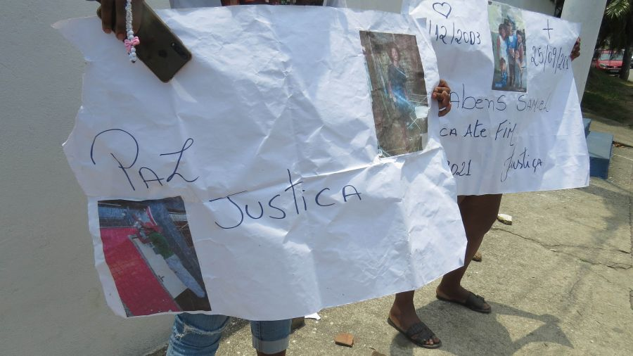

Mãe e esposa de estudante e trabalhador assassinados pela polícia realiza
manifestação em 25 de janeiro na Zona Norte do Rio de Janeiro. Foto: Banco de
dados AND

No dia 25 de janeiro, Sonia Bonfim, mãe vítima de violência do velho Estado, e
os familiares vítimas da violência policial realizaram uma manifestação em
frente à 31° Delegacia de Polícia de Ricardo de Albuquerque, exigindo a
investigação e punição dos policiais envolvidos no assassinato de seu filho,
Samuel Vicente, de 17 anos, e seu marido, Willian Vasconcellos, de 38 anos.

Eles foram assassinados no dia 25 de setembro de 2021, por policiais militares
do 41° Batalhão da Polícia Militar (PM), no Complexo do Chapadão, Zona Norte
do Rio. Na ocasião, Samuel e Willian retornavam de uma comemoração da
aprovação de Samuel para o Exército quando foram fuzilados.

#### [Leia também: RJ: Mãe organiza manifestação pela punição dos policiais
assassinos de seus familiares](https://anovademocracia.com.br/noticias/18471-rj-ocorrera-amanha-mae-
organiza-manifestacao-pela-punicao-dos-policiais-assassinos-de-seus-
familiares)

Confira o vídeo de **AND** da manifestação:

Source: [https://anovademocracia.com.br/noticias/18626-and-entrevista-mae-e-esposa-de-samuel-e-willian-assassinados-pela-pm-em-2021](https://anovademocracia.com.br/noticias/18626-and-entrevista-mae-e-esposa-de-samuel-e-willian-assassinados-pela-pm-em-2021)

<!--NEWS-->

# Alemanha: Bandeiras da Liga Comunista Internacional são empunhadas em manifestação ‘LLL’ (Confira o vídeo)

Author: Ângelo de Carvalho

Time: 2023-01-30T12:00:05-03:00

Images: ['[LLL_Demonstration_2023_Internationaler_Kommunistischer_Bund_-_header.jpg](https://anovademocracia.com.br/images/LLL_Demonstration_2023_Internationaler_Kommunistischer_Bund_-_header.jpg)', '[LLL_Demonstration_2023_Internationaler_Kommunistischer_Bund_-_2.jpg](https://anovademocracia.com.br/images/LLL_Demonstration_2023_Internationaler_Kommunistischer_Bund_-_2.jpg)', '[LLL_Demonstration_2023_Internationaler_Kommunistischer_Bund_-_1.jpg](https://anovademocracia.com.br/images/LLL_Demonstration_2023_Internationaler_Kommunistischer_Bund_-_1.jpg)']

<!--METADATA-->

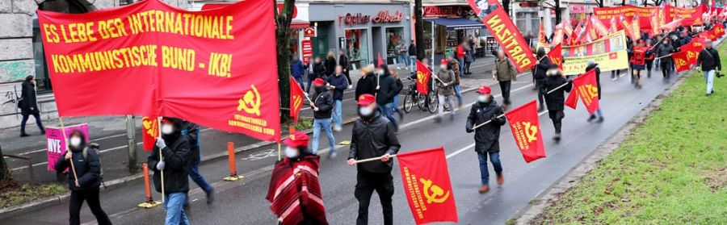

Manifestantes ergueram faixa celebrando a fundação da LCI. Foto: _Dem Volke
Dienen_

Revolucionários internacionalistas divulgaram a fundação da Liga Comunista
Internacional (LCI) em uma manifestação massiva em homenagem a Vladimir Lenin,
Rosa Luxemburgo e Karl Liebknecht (conhecida como LLL), em Berlim, no centro
da Alemanha. A manifestação ocorreu no dia 15 de janeiro e percorreu as ruas
da cidade até chegar no cemitério onde Luxemburgo e Liebknecht estão
enterrados.

A manifestação foi iniciada em torno de 10h da manhã, quando milhares de
pessoas iniciaram a marcha por importantes avenidas da capital.

O portal revolucionário Dem Volke Dienem publicou um vídeo da manifestação:

Uma faixa com a consigna **Vida longa à Liga Comunista Internacional!** foi
erguida pelos revolucionários alemães e turcos que compuseram um extenso bloco
na manifestação. Cerrados em fileiras, os revolucionários carregaram bandeiras
da LCI, da organização _Partizan_ e uma grande faixa em homenagem ao Partido
Comunista da Turquia/Marxista-Leninista (https://anovademocracia.com.brTKP/ML), que atualmente dirige a
Guerra Popular naquele país.

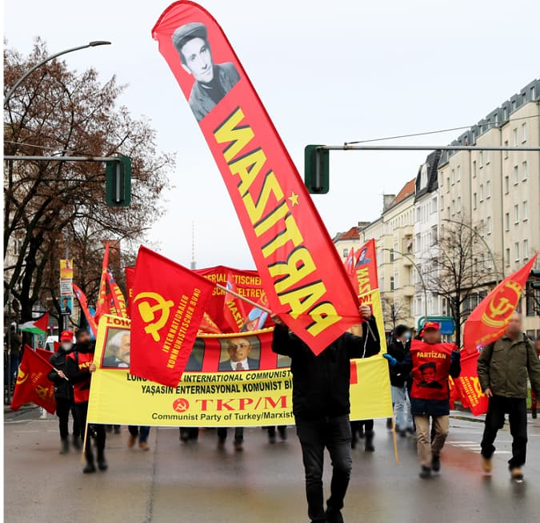

Organização _Partizan_ prestou homenagem ao Partido Comunista da Turquia
(https://anovademocracia.com.brTKP/ML). Foto: _Dem Volke Dienen_

Além das faixas e bandeiras, panfletos com trechos da **Divulgação Política e
Princípios da Liga Comunista Internacional** e brochuras completas do
documento foram entregues pelos revolucionários às massas que assistiram e se
integraram à manifestação.

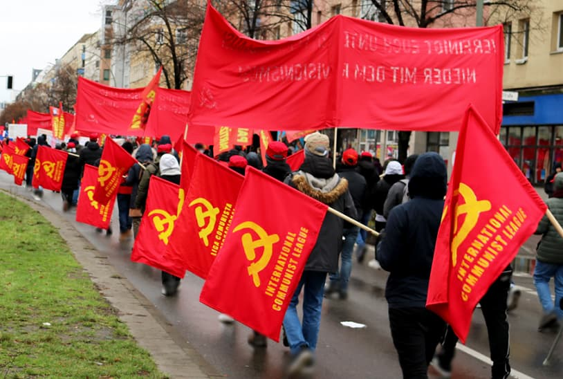

Bandeiras da LCI foram empunhadas no bloco dos revolucionários
internacionalistas. Foto: _Dem Volke Dienen_

Segundo o portal _Dem Volke Dienen_ , que cobriu a manifestação, as massas que
presenciaram o ato se mostraram entusiasmadas com o anúncio de fundação da
LCI. Dezenas de pessoas que viram o bloco pediram para segurar as bandeiras da
LCI múltiplas vezes e perguntaram onde podiam adquiri-las.

A manifestação do dia 15 de janeiro ocorre anualmente na rua de Berlim com o
objetivo de homenagear a memória de Rosa Luxemburgo e Karl Liebknecht, chefes
históricos do Partido Comunista da Alemanha, que foram assassinados pelas
tropas da social-democracia alemã em 1919, e Vladimir Lenin, chefe comunista
do proletariado internacional e grande referência para Luxemburgo e
Liebknecht.

Source: [https://anovademocracia.com.br/noticias/18585-alemanha-bandeiras-da-liga-comunista-internacional-sao-empunhadas-em-manifestacao-lll](https://anovademocracia.com.br/noticias/18585-alemanha-bandeiras-da-liga-comunista-internacional-sao-empunhadas-em-manifestacao-lll)

<!--NEWS-->

# Mexico: Nyheter fra Sol Rojista

Author: Tjen Folket Media

Description: Kameratene vår I Sol Rojista har skrevet om to viktige arrangementer som ble holdt i Oaxaca i midten av januar.

Publish Time: 2023-01-30T12:11:31+00:00

Modified Time: 2023-01-30T12:14:12+00:00

Images: ['[FOTO-1-1.png](https://tjen-folket.no/wp-content/uploads/2023/01/FOTO-1-1.png)', '[mZ7tHcQ-NJy6oeqgqheLkc3ygjVx__mFoF7E0rOeXL5TIW-3f7yuU64iIz-PDnT2e2Tcasd7zV9oeSO23G1NSEjOpe9qK-LuhXhKMVK9yG_LP1Hd1GwszXEtls4UjIcx0rwAe-BmDJJgg_s91BQgwobtEROnZkdqAfHMfSMYBumA8vXr_nHULNAMRrenSQ](https://lh3.googleusercontent.com/mZ7tHcQ-NJy6oeqgqheLkc3ygjVx__mFoF7E0rOeXL5TIW-3f7yuU64iIz-PDnT2e2Tcasd7zV9oeSO23G1NSEjOpe9qK-LuhXhKMVK9yG_LP1Hd1GwszXEtls4UjIcx0rwAe-BmDJJgg_s91BQgwobtEROnZkdqAfHMfSMYBumA8vXr_nHULNAMRrenSQ)', '[FKiyt-9VeX5IOO3a022imhd6utsdRQieBHWplYOQ1t3r5GNCasG1zV45LW2hpQhVJoRtpbplZ6DR5GJQU6KjanhonhwEal1nmA14sdcHLQyPmS5sTvVDlZDBVN_2hCknR7na2OeyzA6xYzurDd8nsBtSWNF96bmx12vN9rIaHPsHhYzswA8DXdW5TIsZZw](https://lh5.googleusercontent.com/FKiyt-9VeX5IOO3a022imhd6utsdRQieBHWplYOQ1t3r5GNCasG1zV45LW2hpQhVJoRtpbplZ6DR5GJQU6KjanhonhwEal1nmA14sdcHLQyPmS5sTvVDlZDBVN_2hCknR7na2OeyzA6xYzurDd8nsBtSWNF96bmx12vN9rIaHPsHhYzswA8DXdW5TIsZZw)', '[hktboAJOjRxH2YniOXbzH0T0jZSEX7D5iDQ8ZYK1jDsJvMxdFPoZWWFY4Q4YtLR33DrJmAXJ7ag3SJwKPM1i74hsgdrOHXHUcPJkm1jksD0ZveeTgcGMGhDywoZEzKUkkL-d0kA4hAZ2p2Fjmf5WRUztXCD0h69U693Hm5ExazxNaDLO28Oy4zWpkXWDLQ](https://lh3.googleusercontent.com/hktboAJOjRxH2YniOXbzH0T0jZSEX7D5iDQ8ZYK1jDsJvMxdFPoZWWFY4Q4YtLR33DrJmAXJ7ag3SJwKPM1i74hsgdrOHXHUcPJkm1jksD0ZveeTgcGMGhDywoZEzKUkkL-d0kA4hAZ2p2Fjmf5WRUztXCD0h69U693Hm5ExazxNaDLO28Oy4zWpkXWDLQ)', '[sdChw5LkOc1GVrBu7trExmVPXilF6ub77PoN-yELLxa5gBuHke4bPLhRtCl9MQwGj6Ukq_SHBKt4oSiDqReZ1esFDsTc8_oG_N2Hg9pLhdMBNgBE3q90nRpOoBCU2RcpRgZXkmcrCN3nWQO0m1f8PkKj04EY7b8LAzebC9i4OLrmdiVIBQwIk7cB5V5mwg](https://lh4.googleusercontent.com/sdChw5LkOc1GVrBu7trExmVPXilF6ub77PoN-yELLxa5gBuHke4bPLhRtCl9MQwGj6Ukq_SHBKt4oSiDqReZ1esFDsTc8_oG_N2Hg9pLhdMBNgBE3q90nRpOoBCU2RcpRgZXkmcrCN3nWQO0m1f8PkKj04EY7b8LAzebC9i4OLrmdiVIBQwIk7cB5V5mwg)', '[CVEXBMfSWEjHtyiZKC-She4FtbkzBg97bJJ96KpmdU08Bsv57Ci7mJusmiRTwOkVqVqReZwUPQMd9k6a9rJKlaWaRsD4nBl7rtDrqejdIdAzfaTv4FBpIzC44Y9kuUBa8gD0czdI-AtJak_crfgOsfbA-sEdoWyWWNWwDf3lXQISmw7wsI6PO2CEtQTbXw](https://lh6.googleusercontent.com/CVEXBMfSWEjHtyiZKC-She4FtbkzBg97bJJ96KpmdU08Bsv57Ci7mJusmiRTwOkVqVqReZwUPQMd9k6a9rJKlaWaRsD4nBl7rtDrqejdIdAzfaTv4FBpIzC44Y9kuUBa8gD0czdI-AtJak_crfgOsfbA-sEdoWyWWNWwDf3lXQISmw7wsI6PO2CEtQTbXw)', '[-saHQ_x3tObWC10fESPX_tDkvm-m2sKY1aJBip0oPBXO-TdZZgxwthzYWo9dLH9j1FMjk9QjAnnfQNSHBtw-OlvxZL3fL8oQ6wkoj6zKgRp0cWIL47OWtAJpFagvPBixtD5K5a-QUbUyN1xbJ_9elbdjYdR-LUWqTka36_NFV9qcMZbfe8rY8bBINKCavg](https://lh5.googleusercontent.com/-saHQ_x3tObWC10fESPX_tDkvm-m2sKY1aJBip0oPBXO-TdZZgxwthzYWo9dLH9j1FMjk9QjAnnfQNSHBtw-OlvxZL3fL8oQ6wkoj6zKgRp0cWIL47OWtAJpFagvPBixtD5K5a-QUbUyN1xbJ_9elbdjYdR-LUWqTka36_NFV9qcMZbfe8rY8bBINKCavg)', '[tWQrRe1TkDMamRvvO_LzNt8t2XMXzW6p7XPzLtJ9yc3q61kilLXQ6goSUeimqQCspEODtSktpiOacWUziOmJHcxDN2i7fJw5D787t4EHFjwi_vVvfY5sUitbIhZqKw2v5ovdV_BGtsjjQjv-RGrwVcJFgvKJJeY_su6h7Y9nDr9cd5a52ZZrE7LuG1R5Iw](https://lh3.googleusercontent.com/tWQrRe1TkDMamRvvO_LzNt8t2XMXzW6p7XPzLtJ9yc3q61kilLXQ6goSUeimqQCspEODtSktpiOacWUziOmJHcxDN2i7fJw5D787t4EHFjwi_vVvfY5sUitbIhZqKw2v5ovdV_BGtsjjQjv-RGrwVcJFgvKJJeY_su6h7Y9nDr9cd5a52ZZrE7LuG1R5Iw)', '[okiaJU-LB2MLRE5fRNsYlKI7bLeGE4Ceeb7QjnLhl81lLqfc6a9OSLku0R_ZZod0Cd0YA3hgqTvcXcCrrC1ShWIXjOPPFWnA2JIrB0JYRfSWJWsK0AupPdxzt0xe_MU140xWzQhU8DXk_Y-sWgq7Kpx0CF3v4bSxpyxoHAl8fq_s5rNGXBpIio7rHG4-PA](https://lh4.googleusercontent.com/okiaJU-LB2MLRE5fRNsYlKI7bLeGE4Ceeb7QjnLhl81lLqfc6a9OSLku0R_ZZod0Cd0YA3hgqTvcXcCrrC1ShWIXjOPPFWnA2JIrB0JYRfSWJWsK0AupPdxzt0xe_MU140xWzQhU8DXk_Y-sWgq7Kpx0CF3v4bSxpyxoHAl8fq_s5rNGXBpIio7rHG4-PA)', '[nmNfExzuH-1LhU5slAwIsHcFAnvpaDb23BpUPoiQIjzucsF636qWm5Wd416AipHZZ0kdl5Ky_t-Aj-EF_Zsa3wvo0NtfW53PMThm4XNZn3JOXr1WShmm5M27FRsBRBCqgDKFo9aXbpbuOpRelq8_pxs9VEesA0yjlB5LrwE3v7D-XE_UFMRdrXR18eEX1A](https://lh4.googleusercontent.com/nmNfExzuH-1LhU5slAwIsHcFAnvpaDb23BpUPoiQIjzucsF636qWm5Wd416AipHZZ0kdl5Ky_t-Aj-EF_Zsa3wvo0NtfW53PMThm4XNZn3JOXr1WShmm5M27FRsBRBCqgDKFo9aXbpbuOpRelq8_pxs9VEesA0yjlB5LrwE3v7D-XE_UFMRdrXR18eEX1A)', '[ohqDDMyC6xkaipAM8VlCwZVihod1lo2oq3Ze8nbVl-bsKfTXXE_Cj_Hvy4UvuwPeLqjbv8koNRNFa19hwgjaZmIBo5d9jbwCIOyYTVao1AJrN9M_o9-Yj-RRJtal9v9X6w6GVtI3KvRfnTWk88R9dj-wzwZFVzs6DBwvCqV6n79m-ssRWgf8YYjQ3W4vrA](https://lh5.googleusercontent.com/ohqDDMyC6xkaipAM8VlCwZVihod1lo2oq3Ze8nbVl-bsKfTXXE_Cj_Hvy4UvuwPeLqjbv8koNRNFa19hwgjaZmIBo5d9jbwCIOyYTVao1AJrN9M_o9-Yj-RRJtal9v9X6w6GVtI3KvRfnTWk88R9dj-wzwZFVzs6DBwvCqV6n79m-ssRWgf8YYjQ3W4vrA)', '[a8RyEpcxPhnjt6_GzDrE30gF1Y1jrWwqwWybZ6nMYr2gteWSj3dNMzQFo6joudeWeglrTtRDiXyA_ctJg6SpvxNn5h4udp7WcyMAlRhqOj5vt0Kut_ehnBJ_dVTnf43-Trz6yyhy62HEVymborceVyYOZeV9aPhnnu13nbI3WD5N-QAYhvxYDjBgo3bDTA](https://lh3.googleusercontent.com/a8RyEpcxPhnjt6_GzDrE30gF1Y1jrWwqwWybZ6nMYr2gteWSj3dNMzQFo6joudeWeglrTtRDiXyA_ctJg6SpvxNn5h4udp7WcyMAlRhqOj5vt0Kut_ehnBJ_dVTnf43-Trz6yyhy62HEVymborceVyYOZeV9aPhnnu13nbI3WD5N-QAYhvxYDjBgo3bDTA)', '[FrFUaCdMyb8F-MOldvxXZDZk4fZY8rtBmRRttTpRf1oXA9XBq2mQnw6lP6NzBR1pfIVMryv6x4g4LcwiVBMB-SkHkMEeKlmENJd0VLEzBYL0Oe-7ECJV744NLYdD5YgwioiB_H9CscmM9nHuGd-NLFAoFshdzkXx8LYknvRpyVHfm5lb5vTNNsNnEFIYvw](https://lh6.googleusercontent.com/FrFUaCdMyb8F-MOldvxXZDZk4fZY8rtBmRRttTpRf1oXA9XBq2mQnw6lP6NzBR1pfIVMryv6x4g4LcwiVBMB-SkHkMEeKlmENJd0VLEzBYL0Oe-7ECJV744NLYdD5YgwioiB_H9CscmM9nHuGd-NLFAoFshdzkXx8LYknvRpyVHfm5lb5vTNNsNnEFIYvw)', '[0OmOL4RG4QcnxmDP8vrJRbXpNLR7N8KxuIZq-E6AJAeYINcNQUxQCpIPd8QJ095qIbHk1gDO3K4QMOWJgmhUADqs1NTygJPbFOo6DYZlgTfrxHIjUzWhJdDrAWRjbBmdKLUt1j0qjJNk6jl48ZD7p_3e1Iz0gK_sM6uC1SDUK78JqCV8Rzqj6QKP3RQP9w](https://lh5.googleusercontent.com/0OmOL4RG4QcnxmDP8vrJRbXpNLR7N8KxuIZq-E6AJAeYINcNQUxQCpIPd8QJ095qIbHk1gDO3K4QMOWJgmhUADqs1NTygJPbFOo6DYZlgTfrxHIjUzWhJdDrAWRjbBmdKLUt1j0qjJNk6jl48ZD7p_3e1Iz0gK_sM6uC1SDUK78JqCV8Rzqj6QKP3RQP9w)', '[Yga6NTBJCB8EwZub8Swtt7TTi3Qnicl_C35c2RFKfmu9axZuUZ30AM-f6HdgnEyNXf8ix-jyWKbhjqs3rtAvPDxj7328l8vRO4l30mP1uyBH62aWNMrx8M8YV2VhV3mCvKvdiAFCXz40npzICGaYhZ63rkoAcZAD7Jrp1FvgLxnyf795s7OAnwcujO4LiA](https://lh4.googleusercontent.com/Yga6NTBJCB8EwZub8Swtt7TTi3Qnicl_C35c2RFKfmu9axZuUZ30AM-f6HdgnEyNXf8ix-jyWKbhjqs3rtAvPDxj7328l8vRO4l30mP1uyBH62aWNMrx8M8YV2VhV3mCvKvdiAFCXz40npzICGaYhZ63rkoAcZAD7Jrp1FvgLxnyf795s7OAnwcujO4LiA)', '[2wLm6r2sVEDOQrR-AHJlKK3Pa7OVaLE0aY-MTqIeBIrTARzwV9YC6bed084nTzXr9vWz-EoJSh3IEEFESZWs9oPw-lMZRvVVrqBp-EZTOzMuiKg7kcf9uM6NEzU5Y3O1XAAgX6Ngulpe9YyulZqr0jodeMKHz6tcvFBj8EZePH4e8AlL1_Y71lKAT5NcTQ](https://lh6.googleusercontent.com/2wLm6r2sVEDOQrR-AHJlKK3Pa7OVaLE0aY-MTqIeBIrTARzwV9YC6bed084nTzXr9vWz-EoJSh3IEEFESZWs9oPw-lMZRvVVrqBp-EZTOzMuiKg7kcf9uM6NEzU5Y3O1XAAgX6Ngulpe9YyulZqr0jodeMKHz6tcvFBj8EZePH4e8AlL1_Y71lKAT5NcTQ)']

Tags: None

Category: 'Latin-Amerika'

<!--METADATA-->

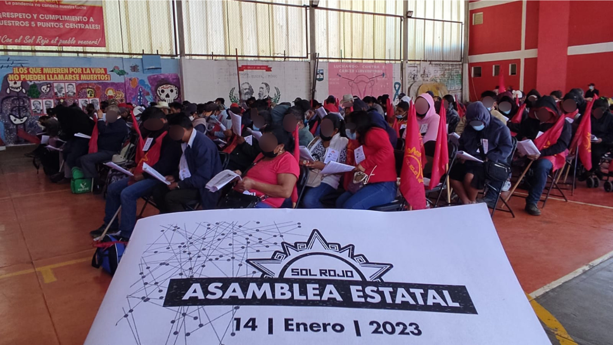

* * *

Av en kommentator for Tjen Folket Media.

* * *

**Kameratene vår I Sol Rojista har skrevet om to viktige arrangementer som ble
holdt i Oaxaca i midten av januar.**

13\. januar arrangerte Fronten for Oaxacan-organisasjoner (FORO) konferansen
«Situasjonen i Oaxacan, utfordringene til folkebevegelsen». FORO samler 13
demokratiske og revolusjonære organisasjoner. Det ble gjort viktige avtaler
under arrangementet, og det ble skrevet en politisk erklæring som er publisert
av Sol Rojista:

[Declaración Política del Frente de Organizaciones Oaxaqueñas
(FORO)](http://solrojista.blogspot.com/2023/01/declaracion-politica-del-
frente-de.html)

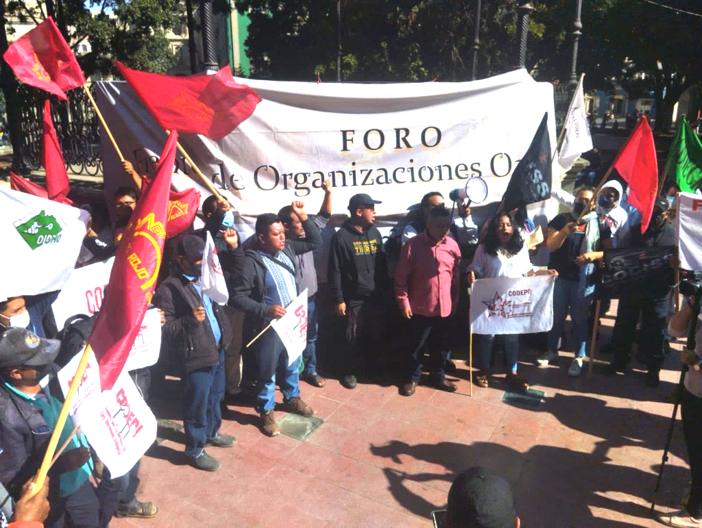
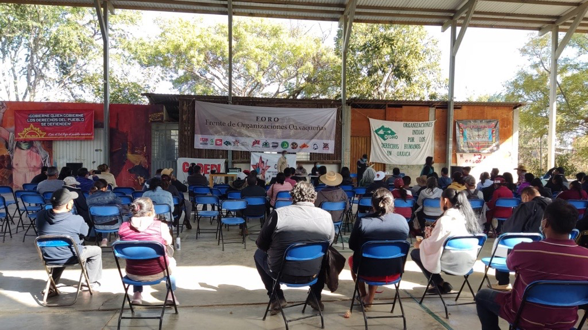

14\. januar holdt Corriente del Pueblo – Sol Rojo (Folkets Strømning – Røde
Sol) en konferanse, som ble gjennomført på et viktig tidspunkt i nasjonal og
statlig politisk kontekst og er en del av den nasjonale veien mot
konstitusjonen av Folkefronten og den pågående korrigeringskampanjen. Sol
Rojista har publisert en politiske uttalelse fra konferansen:

[DECLARACIÓN POLÍTICA DE LA
ASAMBLEAL](http://solrojista.blogspot.com/2023/01/declaracion-politica-de-la-
asambleal.html)

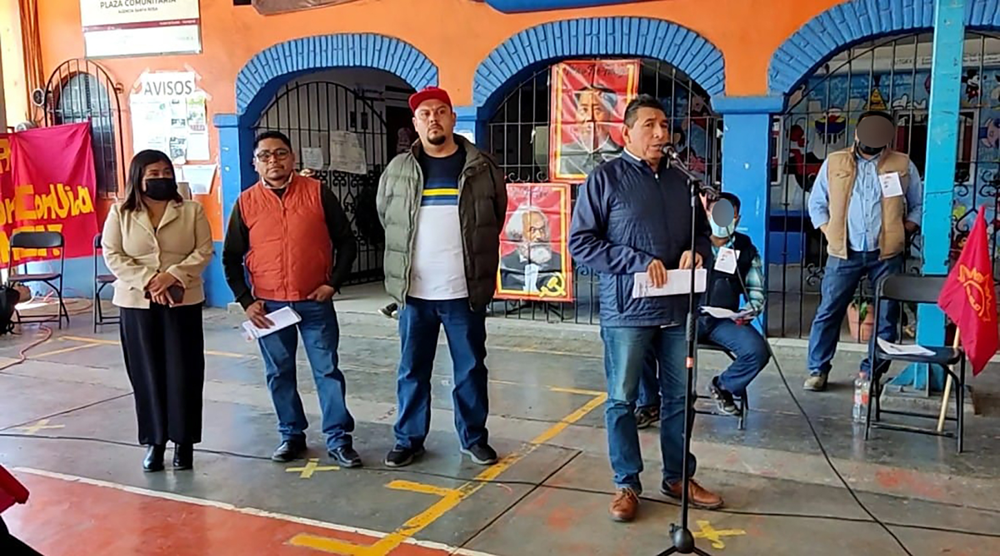
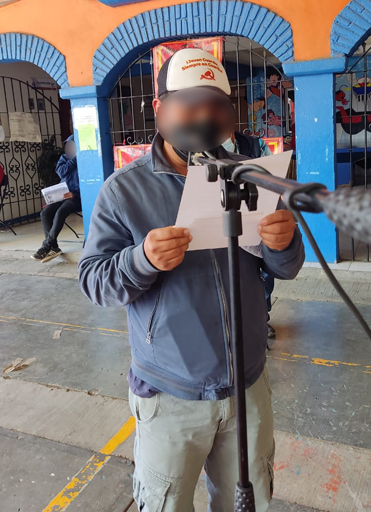
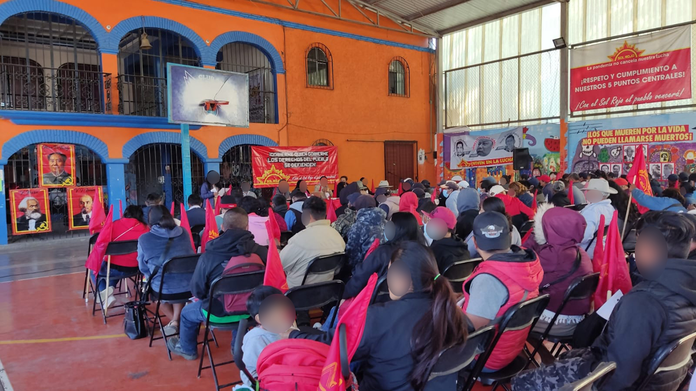
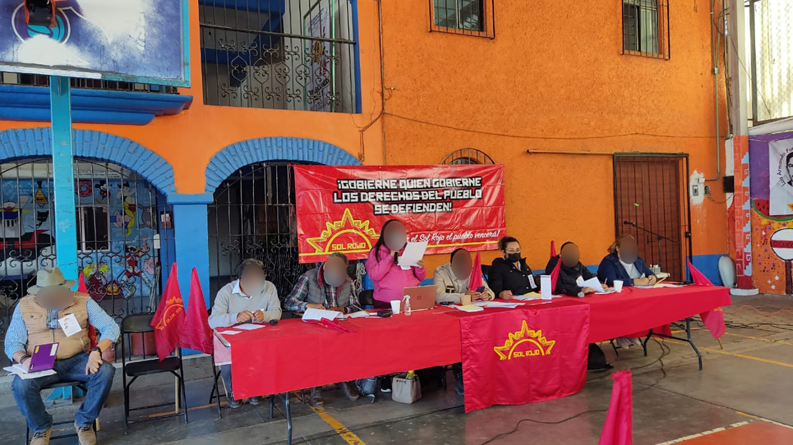
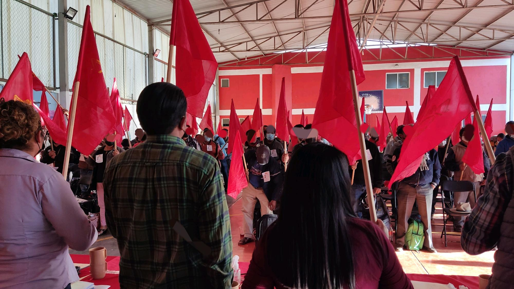
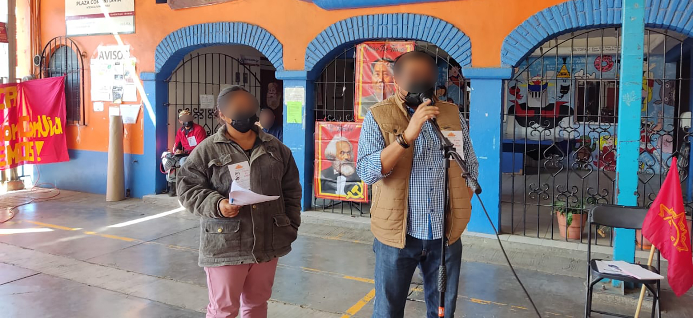
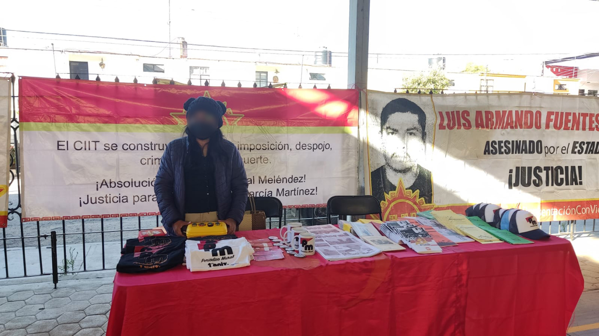
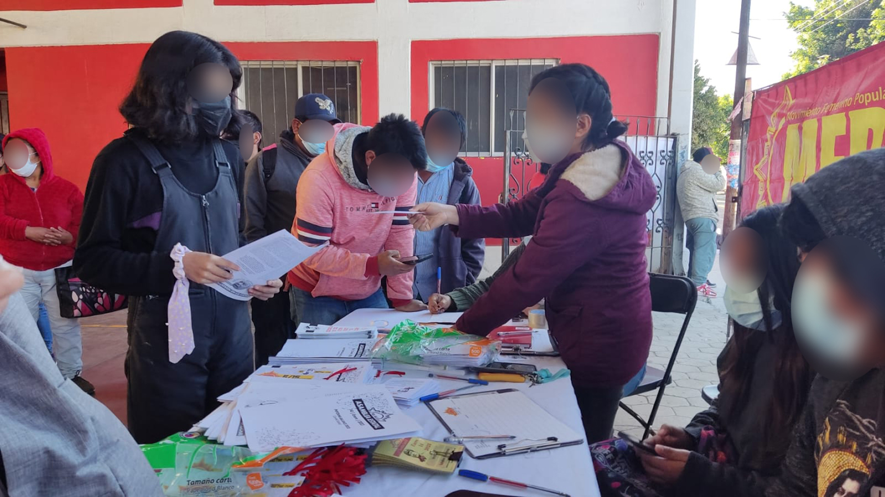
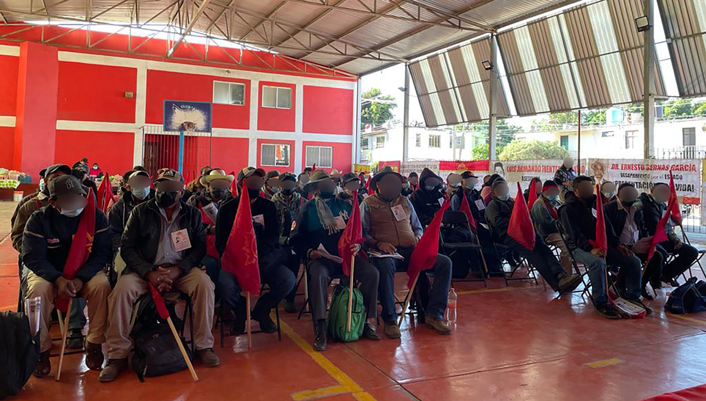
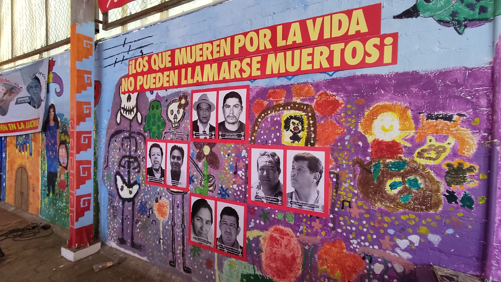
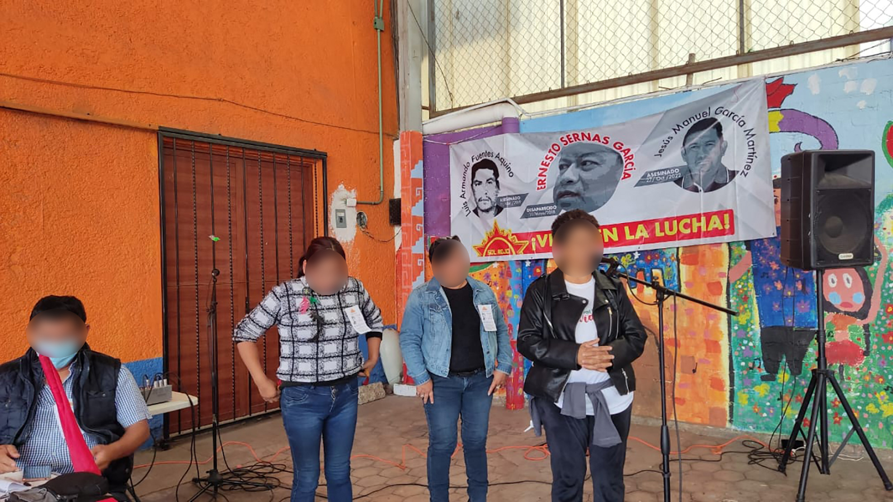
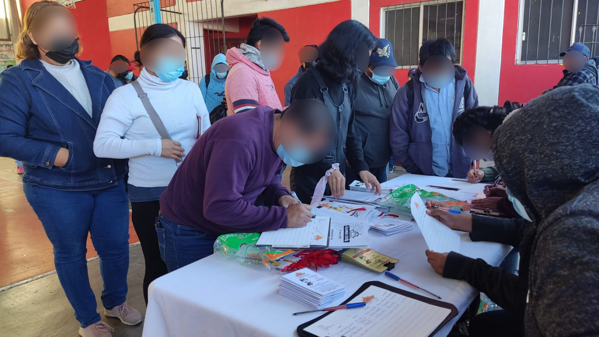

**Referanser**  
[Breves iniciado semana  
](http://solrojista.blogspot.com/2023/01/breves-iniciado-
semana.html)[Declaración Política del Frente de Organizaciones Oaxaqueñas
(FORO)  
](http://solrojista.blogspot.com/2023/01/declaracion-politica-del-frente-
de.html)[DECLARACIÓN POLÍTICA DE LA
ASAMBLEAL](http://solrojista.blogspot.com/2023/01/declaracion-politica-de-la-
asambleal.html)

Source: [https://tjen-folket.no/index.php/2023/01/30/mexico-nyheter-fra-sol-rojista-2/](https://tjen-folket.no/index.php/2023/01/30/mexico-nyheter-fra-sol-rojista-2/)

<!--NEWS-->

# Kundgebung in Hamburg: FREIHEIT FÜR PALÄSTINA!

Author: DEM VOLKE DIENEN

Time: 2023-01-30T13:16:26+00:00

Images: []

Tags: ['Palästina', 'Israel', 'Freiheit für Palästina', 'freedom for palestine', 'Nationale Befreiungsbewegung']

Category: None

<!--METADATA-->

**Freiheit f ur Palastina!**

Am vergangenen Freitag bombardierte der reaktionare israelische Staat wieder
einmal den Gazastreifen. Nur kurz zuvor ermordeten israelische
Sicherheitskrafte 10 Palastinenser bei einer Razzia in Dschenin im
Westjordanland. Die neue reaktionare Regierung in Israel erhoht die
Unterdruckung des palastinensischen Volkes und die Repression gegen die
nationale Befreiungsbewegung immer weiter.

Kommt mit uns gegen diese Bombardements, gegen die Unterdruckung und fur ein
vom Imperialismus befreites, selbstbestimmtes und geeintes Palastina auf die
Straße.

**F ur das Selbstbestimmungsrecht der Nationen!**

**Nieder mit dem Imperialismus!**

**Kundgebung: Samstag, 04. Februar 2023 | 15 Uhr | Steindamm Ecke
Adenauerallee (Vor der Apotheke am**

**Hauptbahnhof)**

_B undnis gegen imperialistische Aggression_

_Januar 2023_

Source: [https://www.demvolkedienen.org/index.php/de/t-international/7450-kundgebung-in-hamburg-freiheit-fuer-palaestina](https://www.demvolkedienen.org/index.php/de/t-international/7450-kundgebung-in-hamburg-freiheit-fuer-palaestina)

<!--NEWS-->

# PM executa chacina contra camponeses em Nova Mutum/RO, denuncia a Abrapo

Author: GABRIEL ARTUR

Time: 2023-01-30T15:44:13-03:00

Images: ['[16750064344332_1.jpg](https://anovademocracia.com.br/images/16750064344332_1.jpg)']

<!--METADATA-->

Camponeses covardemente assassinados em chacina. Foto: Rondoniaovivo

Segundo denunciou a Associação Brasileira dos Advogados do Povo Gabriel
Pimenta (Abrapo), no dia 28 de janeiro policiais militares do Batalhão de
Operações Especiais (Bope) e do Batalhão de Divisas e Fronteiras (BPFron)
torturaram e assassinaram covardemente dois camponeses e feriram outros três.
A ação foi perpetrada durante uma operação de reintegração de posse na sede da
fazenda NorBrasil, localizada em Nova Mutum-Paraná (RO), recentemente ocupada
por camponeses nas últimas semanas. Os camponeses assassinados são Raniel
Barbosa Laurindo, de 24 anos, e Rodrigo Hawerroth, de 34. Outros três
camponeses ficaram feridos durante a chacina.

> Ver essa foto no Instagram
>
> [Uma publicação compartilhada por ABRAPO
> (@abraponacional)](https://www.instagram.com/p/Cn_K7jEN-
> Tk/?utm_source=ig_embed&utm_campaign=loading)

A fim de justificar a chacina macabra, a Polícia Militar (PM) de Rondônia e a
imprensa latifundiária do estado afirmam que os camponeses portavam armas de
grosso calibre e que houve “troca de tiros”. Segundo informações da Abrapo, no
entanto, a verdade é que os camponeses foram torturados e executados.

Ainda segundo a Abrapo, o monopólio de imprensa “omitiu que a região faz parte
de uma das diversas áreas griladas pelo latifundiário Antônio Martins dos
Santos, conhecido como Galo Velho, investigado pelas polícias civil e federal,
em conjunto com o Ministério Público, pelo financiamento de pistoleiros na
região para a grilagem de terra e expulsão de camponeses”.

Desde que foi ocupada, a área tem sido palco de constantes ataques de
policiais e pistoleiros contra as famílias camponesas em busca de um pedaço de
terra. Na semana anterior à chacina, uma caminhonete não identificada disparou
contra mulheres e crianças no mesmo local e foi expulsa pelas famílias
moradoras da Área Tiago Campin dos Santos (assista no vídeo).

> Na semana anterior à chacina, uma caminhonete não identificada disparou
> contra mulheres e crianças no mesmo local e foi expulsa pelas famílias
> moradoras da Área Tiago Campin dos Santos.
> [pic.twitter.com/qqwJChZClH](https://t.co/qqwJChZClH)
>
> — A Nova Democracia (@jornaland) [January 30,
> 2023](https://twitter.com/jornaland/status/1620131341399650305?ref_src=twsrc%5Etfw)

A área é a mesma onde, em novembro de 2021, grupos armados do latifúndio
atuaram ampla e impunemente contra as mais de 800 famílias da Área
Revolucionária Tiago Campin dos Santos, que ocupou as terras da empresa do
“Galo Velho”, em Nova Mutum-Paraná, e seguem nela. Na ocasião, mais de 3 mil
tropas das forças policiais, sob direção política das Forças Armadas
reacionárias, e combinadas com as tropas mercenárias investigadas, foram
mobilizadas para reprimir os camponeses.

O pretenso dono, “Galo Velho”, está sendo investigado por pagar diária para
grupos paramilitares cometer abusos e execuções sumárias usando armamento e
viaturas oficiais das forças policiais nas área da fazenda NorBrasil. O grupo,
composto por policiais e pistoleiros, ainda lavava dinheiro e fraudava
processos judiciais de desapropriação de terras. A partir do afastamento do
sigilo bancário dos investigados pelo MP foi possível identificar
movimentações financeiras superiores a R$ 445 milhões, sendo efetivamente
comprovado o pagamento de valores aos servidores contratados para a função de
bando paramilitar particular do latifúndio.

#### [Leia também: Tropa mercenária do latifúndio é desarticulada em Nova
Mutum/RO](https://anovademocracia.com.br/noticias/18388-tropa-mercenaria-do-latifundio-e-desarticulada-em-
nova-mutum-ro)

A redação de **AND** seguirá mobilizada e trará, a qualquer momento, novas
informações.

Source: [https://anovademocracia.com.br/noticias/18629-pm-executa-chacina-contra-camponeses-em-nova-mutum-ro-denuncia-a-abrapo](https://anovademocracia.com.br/noticias/18629-pm-executa-chacina-contra-camponeses-em-nova-mutum-ro-denuncia-a-abrapo)

<!--NEWS-->

# pc 30 gennaio - La guerra in Ucraina si allarga al Medio Oriente: l'imperialismo USA e il suo cane da guardia israeliano hanno attaccato una struttura militare dell'Iran

Author: prolcomra

Time: 2023-01-30T15:46:00+01:00

Images: ['[Israele%20dietro%20gli%20attacchi%20all&#39;Iran.jpg](https://blogger.googleusercontent.com/img/b/R29vZ2xl/AVvXsEgxaOH1dpuwF3uMfBfNNjRIzfLi5aJtsBjIW5MF5j3-lPgZReoqTcI6gU6yHAUPQXLiDHOe4IDvYIuAATcHqsR8oOlICODJdF8edfa017V42AwUbIbTJWjrX5UmHN2Tx224517RTubzf4gL8kffv2VTTGhf936LPJSHFr5jV1w8mv8w98XL1wXiDbIAIA/w480-h296/Israele%20dietro%20gli%20attacchi%20all&#39;Iran.jpg)', '[Ron%20Prosor,%20ambasciatore%20israeliano%20in%20Germania.jpg](https://blogger.googleusercontent.com/img/b/R29vZ2xl/AVvXsEgGRb_H_m3utU6BOdR-gFGJ5fuQhkV5uLmV_AX_l8_GkJMES4fQz-Eo2hRrzAku_gTsn3NFDLWGMYYO2qa1oRyXW3OHGiHWoWvgFcpPCrJYbZ_uhm2g1fUSFjeKWlkz5yf8w-MO1PYmQk_nlGHXu0zyrIHqp83t-aHbnMopQhVUJWsYD0p2ZK0T8AUftw/s320/Ron%20Prosor,%20ambasciatore%20israeliano%20in%20Germania.jpg)', '[Iran-attacco%20a%20Isfahan.jpg](https://blogger.googleusercontent.com/img/b/R29vZ2xl/AVvXsEiYUZdBvlC2Wy1P_AN162XZqM6uSPnWX2At3Lc_jPmylRxsffrqlNodzO95b7nqHFbOy0XOtHbDHlsQdw9_PeZTK36BGDx1ba_eiZfQTY3RgsSKwxHCXejJtZn8TP2Ntc3phUon5mA0A_6-BmzOLIhj9ggX6TFUBB2dMsZDBWB3bDjww2GToZdyqNkbnQ/w640-h108/Iran-attacco%20a%20Isfahan.jpg)']

<!--METADATA-->

**Israele aiuta l'Ucraina dietro le quinte**

  
Secondo il Wall Street Journal, dietro agli attacchi all'Iran ci sarebbe
Israele. Teheran, a livello ufficiale, non attribuisce la responsabilità allo
Stato ebraico. In Siria droni israeliani contro convoglio d'armi delle milizie
del regime ad alBukamal

L'attacco a Isfahan è avvenuto meno di una settimana dopo un'importante
esercitazione militare USA-Israele nella prospettiva dello scontro contro
Teheran.

Secondo agenzia Nova i raid sono avvenuti in sei diverse città iraniane e più
volte è entrata in funzione la contraerea iraniana. L'ISW riferisce che
esplosioni sono state sentite a Karaj, nella provincia di Alborz; Dezfoul,
provincia del Khuzestan; e Hamedan City, provincia di Hamedan, nelle ore
successive all'attacco dei droni.

Inoltre "Iran e Israele sono impegnati da anni in una guerra ombra su terra,
mare, aria e nel cyberspazio con Israele che ha effettuato attacchi contro
strutture militari e nucleari iraniane, ha compiuto omicidi mirati con robot
telecomandati, colpendo scienziati e persino un alto funzionario militare, il
colonnello

Savad Khodayee, a capo di un'unità segreta delle Guardie Rivoluzionarie. Oltre
a lui, due colonnelli sono rimasti uccisi in incidenti. È quella che Naftali
Bennett, primo ministro "a rotazione" fino al luglio 2022, aveva definito "la
dottrina del polpo": colpire non più i «tentacoli» del regime iraniano nella
regione ma «andare dritti alla testa». Una strategia che l'attuale primo
ministro Benjamin Netanyahu, tornato in carica da appena un mese, potrebbe non
voler abbandonare" (da eastjournal).

amwaj.media: Tuttavia, parlando a condizione di anonimato, una fonte politica
di alto rango nella capitale iraniana ha indicato ad Amwaj.media che
**l'Ucraina è stata citata tra i potenziali colpevoli**. Facendo eco a questa
linea, l'affiliata mediatica del Consiglio supremo per la sicurezza nazionale
iraniana (SNSC) ha avvertito di "pesanti conseguenze" a meno che il governo
ucraino non prenda le distanze dall'attacco. Nel frattempo, altri sostengono
che **anche l'Azerbaigian** , la cui ambasciata a Teheran è stata recentemente
chiusa a causa delle crescenti tensioni, possa aver svolto un ruolo al fianco
di Israele.

Fonti con "conoscenza diretta dell'attacco" del 29 gennaio hanno detto a un
corrispondente israeliano dell'outlet statunitense Axios che l'attacco è stato
"specifico, chirurgico e di successo", sostenendo che "4 diverse aree
dell'edificio sono state accuratamente prese di mira e l'obiettivo è stato
raggiunto".

Poche ore prima degli attacchi in Iran, l'ambasciatore di Israele a Berlino ha
rilasciato questa interessante intervista in cui diceva, fra le altre cose:

 _"Abbiamo i russi in Siria. Come sapete, l'esercito israeliano blocca
regolarmente le spedizioni di armi dall'Iran alla Siria e al Libano. Questi
includono droni e missili iraniani che la Russia sta usando in Ucraina. Quindi
aiutiamo, anche se dietro le quinte e molto più di quanto si sappia. Abbiamo
anche una grande comunità ebraica in Russia. Questi sono i due motivi
principali per cui manteniamo un profilo basso"._

  
eastwest 30 Gennaio 2023

Secondo fonti della stampa statunitense, l'attacco di tre droni ad una
struttura militare di Isfahan avvenuto nei giorni scorsi è opera di Israele.
Il Ministero della Difesa di Teheran riferisce che i danni causati sono stati
limitati.

Non è la prima volta che Israele colpisce strutture militari della Repubblica
Islamica, ma le tempistiche dell'attacco, con droni, avvenuto nei giorni
scorsi lascia intendere un chiaro messaggio rivolto da Tel Aviv a Teheran
sull'approccio che lo Stato Ebraico intende perseguire nei confronti del Paese
sciita, evidentemente appoggiato dal suo più stretto alleato, gli Stati Uniti.
È il Wall Street Journal a sostenere con certezza che dietro l'operazione
rivolta ad un centro dell'esercito di Isfahan c'è la mano israeliana: con
almeno 3 droni, di cui uno capace di arrivare all'obiettivo, è stato raggiunto
un edificio che, per alcuni analisti, è un deposito di armi, per altri un
laboratorio o un sito logistico militare.

Nella giornata odierna inizia il viaggio del Segretario Antony Blinken in
Medio Oriente, dove incontrerà gli esponenti governativi di Israele, Palestina
ed Egitto. Una missione a dir poco incandescente, con Tel Aviv attiva
militarmente non solo in Iran ma anche in Cisgiordania, dove la tensione è
alle stelle. È la prima visita del Segretario di Stato da quando l'esecutivo
di estrema destra guidato da Benjamin Netanyahu si è insediato, con Washington
incapace di controllare le mosse dell'alleato israeliano, libero di operare
nel contesto internazionale. La vicinanza mai negata, né raffreddata, alla
Russia di Vladimir Putin si legge nel mancato invio di rifornimenti militari
all'Ucraina, che ha permesso all'esercito israeliano di proseguire
indisturbato con gli strike in territorio sovrano della Siria (supportata da
Mosca), dove gli obiettivi sono le presenze militari iraniane.

Sono, appunto, molteplici gli intrecci legati alle sorti mediorientali,
riguardando una fetta importante degli equilibri internazionali. Se si aprisse
un fronte più ampio di guerra aperta, questo trascinerebbe la comunità
internazionale negli inferi di un confronto militare dagli esiti inaspettati,
che coinvolge anche in questo caso potenze con armi nucleari. La diplomazia
sembra intorpidita in questa fase di azioni militare e violenze sui civili,
con l'Unione Europea che si dice pronta a inserire le Guardie della
Rivoluzione nella lista delle organizzazioni terroristiche nonostante il
pericolo politico che questa scelta causerebbe, ovvero la fine definitiva
delle trattative per il ripristino del JCPoA, l'accordo sul nucleare iraniano.

Eppure, sarebbero giunte aperture in tal senso dagli Stati Uniti, con la
mediazione del Qatar. Infatti, il Ministro degli Esteri Mohammed bin
Abdulrahman Al-Thani, in visita a Teheran, nella giornata di ieri avrebbe
consegnato al Governo iraniano un messaggio di Washington. "Faremo tutto ciò
che è possibile affinché si giunga ad un accordo tra l'Iran e l'Occidente,
fondamentale per la stabilità regionale", ha detto Al-Thani. Sul fronte
saudita, il Ministro degli Esteri Faisal bin Farhan Al Saud si recherà nelle
prossime settimane a Baghdad, ancora broker per la pace tra Riad e Teheran,
proprio per incontrare il collega iraniano Hossein Amirabdollahian.

Dopo 5 round negoziali con l'obiettivo di ripristinare le piene relazioni tra
i due Paesi, le parti hanno convenuto per nuovi incontri. Risulta sempre
complicato interpretare le mosse dei singoli attori, regionali e non,
coinvolti nella stabilità del Vicino e Medio Oriente: dalla presenza iraniana
nelle nazioni confinanti con Israele all'ambiguità dell'Arabia Saudita nel
rapporto con Tel Aviv, passando per il ruolo di Stati Uniti e Russia, è in
ballo la stabilità delle relazioni internazionali che, a quanto pare, poggia
ancora su una regione strategica a livello geopolitico.

Source: [https://proletaricomunisti.blogspot.com/2023/01/pc-30-gennaio-la-guerra-in-ucraina-si.html](https://proletaricomunisti.blogspot.com/2023/01/pc-30-gennaio-la-guerra-in-ucraina-si.html)

<!--NEWS-->

# Palestina: Resistência Nacional deixa sete mortos e 12 feridos após massacre de operação sionista

Author: Ângelo de Carvalho

Time: 2023-01-30T17:15:55-03:00

Images: ['[protesto_perto_de_gaza_Abdelkhaim_Abu_Riash_Al_Jazeera_2.jpg](https://anovademocracia.com.br/images/protesto_perto_de_gaza_Abdelkhaim_Abu_Riash_Al_Jazeera_2.jpg)']

<!--METADATA-->

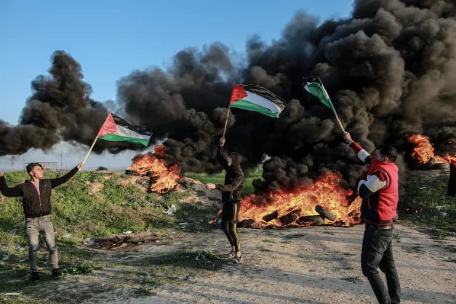

Palestinos promovem ações contra agressão sionista de Israel. Foto: Abdelkhaim
Abu Riash/Al Jazeera

Nos dias 27 e 28 de janeiro, sete israelenses foram mortos e 12 ficaram
feridos como resultado de dois ataques feitos pela Resistência Nacional
Palestina em Jerusalém Oriental, região anexada e ocupada por Israel. Os
ataques ocorreram após o assassinato de dez palestinos no dia 25/01 por tropas
sionistas do Estado de Israel na cidade de Jenin, na Palestina. A Jihad
Islâmica Palestina (JIP) e o Hamas, grupos da Resistência Nacional Palestina,
saudaram os ataques.

O primeiro ataque ocorreu em torno de 20h15 do dia 27/01, quando um palestino
de 21 anos estacionou seu carro próximo a uma sinagoga de Jerusalém Oriental e
alvejou 17 pessoas com tiros de armas de fogo. Sete pessoas morreram na hora e
outras dez ficaram feridas. O combatente da Resistência Nacional tentou fugir
após o ataque, mas foi perseguido e morto por tropas sionistas das Forças de
Defesa de Israel (IDF, em inglês).

Menos de 24 horas depois, na manhã do dia 28/01, foi realizado o segundo
assalto. Desta vez, um palestino de 13 anos disparou com uma pistola contra um
grupo de cinco pessoas. Dois israelenses ficaram feridos e nenhum foi morto. O
jovem foi alvejado na sequência por israelenses transeuntes, que abriram fogo
contra o combatente e o subjugaram até a chegada das tropas sionistas da IDF.
Atualmente, o palestino se encontra sob custódia em um hospital israelense.

As ações em Jerusalém Oriental foram celebradas por grupos da Resistência
Nacional, como o Hamas e a JIP. Hazem Qassem, porta-voz do Hamas, afirmou que
“essa operação [o tiroteio em Jerusalém Oriental] é uma resposta ao crime
conduzido pela ocupação em Jenin e uma resposta natural às ações criminosas da
ocupação”. Apesar disso, nenhum dos dois grupos reivindicou autoria das
operações.

Os recentes ataques em Jerusalém Oriental ocorrem em um contexto de
[robustecimento da Resistência Nacional](https://anovademocracia.com.br/noticias/18150-palestina-
resistencia-nacional-se-robustece-enfrentando-sionismo-israelense-e-traidores-
capitulacionistas) Palestina frente à escalada da agressão sionista de Israel.
Em 2022, a agressão sionista que deixou 225 palestinos mortos foi respondida
com o crescimento de grupos armados em território palestino, [lançamentos de
mísseis](https://anovademocracia.com.br/noticias/17947-palestina-resistencia-nacional-dispara-misseis-em-
resposta-a-terrorismo-promovido-por-israel), [ataques a
bomba](https://anovademocracia.com.br/noticias/18412-palestina-ataques-a-bomba-em-israel-dao-resposta-a-
crimes-da-ocupacao-sionista) e [ataques a faca](https://anovademocracia.com.br/noticias/18373-palestina-
apos-semanas-de-incursoes-sionistas-palestino-deixa-tres-israleneses-mortos-
na-cisjordania).

Agora, com a continuação das operações sionistas em Israel ao longo de 2023
(somente em janeiro, 35 palestinos foram mortos por militares israelenses), e
sobretudo após o massacre de Jenin, a Resistência Nacional Palestina segue a
afirmar por meio de declarações e ações que seguirá na elevação de sua luta.
Somente nos últimos quatro dias já foram realizados [bloqueios de vias,
protestos de rua, ataques com mísseis](https://anovademocracia.com.br/noticias/18621-palestina-dez-
palestinos-mortos-em-um-so-dia-por-exercito-sionista-de-israel) e tiroteios
contra a agressão sionista do Estado de Israel.

Source: [https://anovademocracia.com.br/noticias/18630-palestina-resistencia-nacional-deixa-sete-mortos-e-12-feridos-apos-massacre-de-operacao-sionista](https://anovademocracia.com.br/noticias/18630-palestina-resistencia-nacional-deixa-sete-mortos-e-12-feridos-apos-massacre-de-operacao-sionista)

<!--NEWS-->

# SP: Metalúrgicos em greve exigem pagamento atrasado com protestos em frente à fábrica

Author: Giovanna Maria

Time: 2023-01-30T17:19:32-03:00

Images: ['[sidor1.jpg](https://anovademocracia.com.br/images/sidor1.jpg)', '[dana1.jpg](https://anovademocracia.com.br/images/dana1.jpg)']

<!--METADATA-->

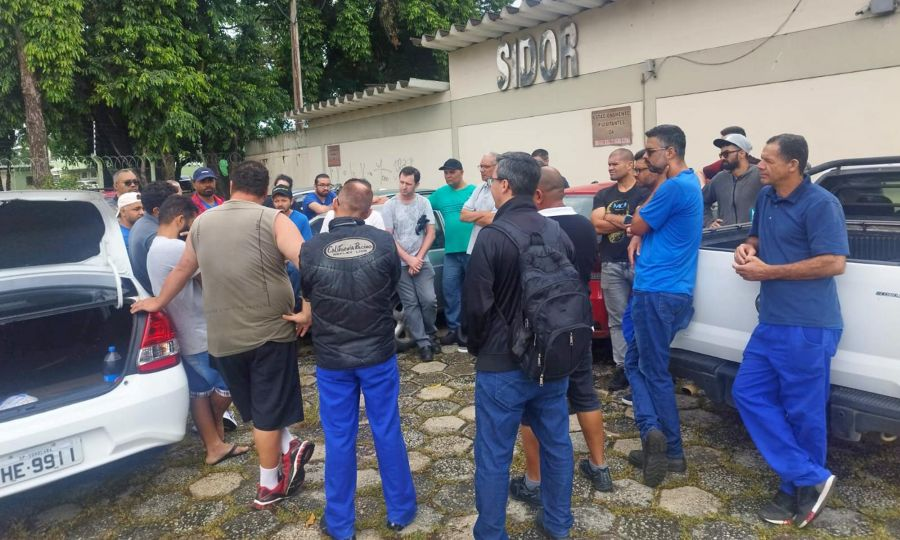

Operários da Sidor realizam protesto após sete dias de greve. Foto: Divulgação

No dia 30 de janeiro, os operários da Sidor realizaram um protesto em frente
às instalações da fábrica. A mobilização é parte da greve que iniciou no dia
23/01 para exigir pagamento de salários. Os operários da produção estão com os
vale-salários atrasados desde o dia 20/01, enquanto os trabalhadores da
administração estão com os salários referentes a dezembro atrasados desde o
dia 05/01. Por conta da mobilização, os patrões foram também obrigados a
depositar o décimo terceiro, que estava atrasado.

Não é a primeira vez que os operários da Sidor se mobilizam pelo atraso de
salários. Em julho e outubro do ano passado, os operários da empresa
realizaram uma série de greves pelos mesmos motivos. Depois das mobilizações,
os salários foram conquistados. A Sidor tem cerca de 50 trabalhadores e produz
autopeças e acessórios automobilísticos.

Também em Sorocaba, metalúrgicos da empresa Dana realizaram uma paralisação de
duas horas no dia 26/01 para protestar contra falta de transparência e
divergências referente às metas e valores da segunda parcela do Programa de
Participação nos Resultados (PPR) de 2022.

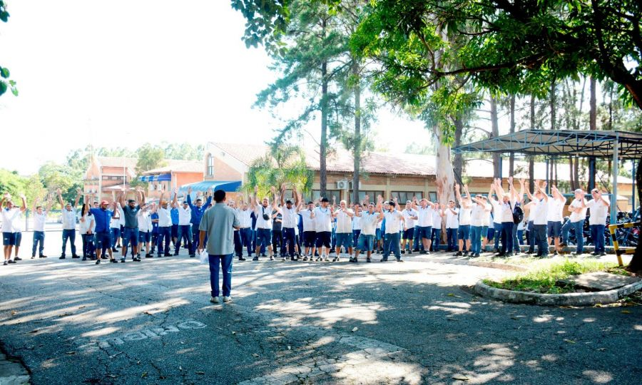

Metalúrgicos da Dana paralisam produção por duas horas. Foto:
Foguinho/Imprensa SMetal

Nos últimos anos, diversas mobilizações operárias ocorreram em São Paulo
contra a perda de direitos e por melhores condições de trabalho. Em novembro
do ano passado, operários conquistaram seus direitos após realizarem ao menos
dez greves durante uma intensa campanha de aumento salarial real e contra
demissões em massa.

Source: [https://anovademocracia.com.br/noticias/18631-sp-metalurgicos-em-greve-exigem-pagamento-atrasado-greve-com-protestos-em-frente-a-fabrica](https://anovademocracia.com.br/noticias/18631-sp-metalurgicos-em-greve-exigem-pagamento-atrasado-greve-com-protestos-em-frente-a-fabrica)

<!--NEWS-->

# pc 30 gennaio - Il governo Meloni sferra un altro attacco ai diritti dei lavoratori: contratti a termine senza limiti e senza causali

Author: prolcompal

Time: 2023-01-30T18:22:00+01:00

Images: ['[APA%2018FEB.jpg](https://blogger.googleusercontent.com/img/b/R29vZ2xl/AVvXsEh-KG5PPiTCRBHLTmgRiHrRad1sk88e9YOTQCzbr_kdzzZZPSMkGH4ttguaKnGXc1L-5F01p1AttLAtqrZFPvY56UnZVrIoul7eBtCSQ9wNBi-XQKHL29jGyk8oKqOPsHw9aZSnXPOc0j-QzdPuy5KwDq2GjqYhIULfYZr_k4eKUDsQK2seWnH1t1Vv7Q/w339-h480/APA%2018FEB.jpg)']

<!--METADATA-->

Dopo l'introduzione dei voucher con la legge di bilancio, nei prossimi giorni
il governo Meloni si appresta a fare altri favori ai padroni liberandoli dai
"vincoli" che erano posti ai contratti a termine, vincoli spesso imposti anche
da sentenze di tribunale e perfino dalla Corte costituzionale che "è già
intervenuta sul Jobs Act di Renzi, per invitare il Parlamento a legiferare in
modo più favorevole ai lavoratori per quanto riguarda i risarcimenti nei casi
di licenziamenti senza giusta causa." come riporta il Manifesto del 25 scorso.

È chiaro che i "risarcimenti" sono stati introdotti per attutire i colpi dei
licenziamenti, ma non hanno risarcito e non possono risarcire un operaio o una
operaia che perde il lavoro!

Le nuove norme sui contratti a termine dovrebbero essere varate "entro
l'inizio di febbraio: **via il limite di 12 mesi per i contratti a tempo senza
causali** , l'ipotesi è **tornare a 36 mesi, come ai tempi del governo Renzi**
e del ministro Poletti. **Con la possibilità di ulteriori 12 mesi da affidare
ai contratti collettivi**. Si allargheranno anche le causali per i rinnovi,
che oggi sono legati sostanzialmente alla sostituzione di lavoratori e
incrementi temporanei dell'attività."

Alle normali obiezioni che con queste norme si aggrava la precarietà già
estesa, visto che in Italia ci sono ufficialmente oltre 3 milioni di
lavoratrici e lavoratori in queste condizioni, si affretta a rispondere la
ministra del lavoro (della precarietà e della disoccupazione) Elvira Calderone
che bacchetta, per giunta! "«Basta considerare la flessibilità solo in chiave
negativa, il contratto a termine non è di per sé

una forma di precarizzazione»" e di che, se no? qui la ministra dimostra anche
perdita di capacità logica! Ma in realtà, la logica è giusta, è quella del
capitalismo-imperialismo.

"… sembra di tornare alle narrazioni dei tempi della Leopolda. - dice il
quotidiano - Senza tenere conto del fatto che, **nel 2021** (secondo i dati
del rapporto Inapp), solo il 14,8% dei nuovi contratti di lavoro era a tempo
indeterminato, **mentre il 69,8% era a termine**. Numeri che hanno spinto gli
stessi autori del rapporto definire il mercato del lavoro italiano **«
intrappolato nella precarietà**»."

Segue un piccolo elenco di dichiarazioni dei sindacati confederali, di fatto
al servizio del Capitale, che si lamentano e invitano il governo a ripensarci,
a discutere, discutere…

È invece, necessario passare ai fatti!

Lavoratrici e lavoratori, a "tempo indeterminato" o precari, si devono
organizzare, a fronte di questi continui attacchi, e unire le lotte contro
padroni e i loro governi.

**Anche la lotta contro la precarietà sarà argomento dell 'Assemblea
Proletaria Anticapitalista che si terrà a Roma il 18 febbraio prossimo dalle
10,30 alle 18,30 presso lo Spazio Occupato Metropoliz, di Via Prenestina
913**

Source: [https://proletaricomunisti.blogspot.com/2023/01/pc-30-gennaio-il-governo-meloni-sferra.html](https://proletaricomunisti.blogspot.com/2023/01/pc-30-gennaio-il-governo-meloni-sferra.html)

<!--NEWS-->

# Trondheim: Kastet ut alenemor med barn fra kommunal leilighet

Author: Tjen Folket Media

Description: Alenemor “Ana” (30) hadde til tross for mange forsøk ikke klart å finne bolig på det private utleiemarkedet i Trondheim. Torsdag 19. januar kastet Trondheim kommune “Ana” og sønnen hennes (6) ut av…

Publish Time: 2023-01-30T19:52:40+00:00

Modified Time: 2023-01-30T19:52:44+00:00

Images: ['[Trondheim_radhus-1160x694.jpg](https://tjen-folket.no/wp-content/uploads/2022/10/Trondheim_radhus-1160x694.jpg)']

Tags: None

Category: 'Innenriks'

<!--METADATA-->

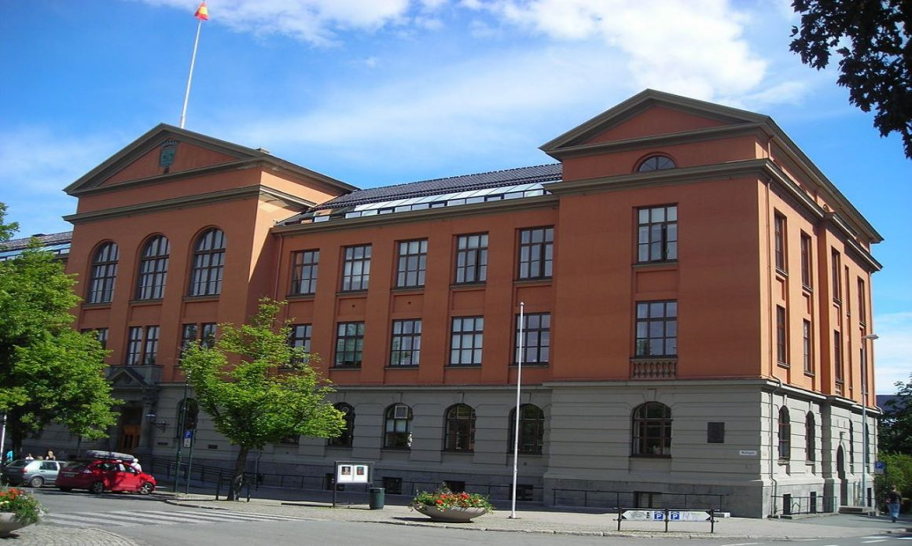

* * *

Av en kommentator for Tjen Folket Media.

* * *

**Alenemor “Ana” (30) hadde til tross for mange forsøk ikke klart å finne
bolig på det private utleiemarkedet i Trondheim. Torsdag 19. januar kastet
Trondheim kommune “Ana” og sønnen hennes (6) ut av den kommunale leiligheten
de hadde bodd i siden de kom til byen for seks år siden.  **

Avisa Nidaros har i januar skrevet om situasjonen til “Ana,” som kom til Norge
på flukt fra krig i 2016. De skriver at alenemoren studerer helse- og
oppvekstfag på videregående skole. Hun mottar nå overgangsstønad fra NAV, men
vil kunne starte lærlingtiden som helsefagarbeider og dermed få ordinær lønn
om to år.

“Ana” sa tidlig i desember til Nidaros:  
“Situasjonen er fortvilet. Jeg har vært på mange visninger, senest i jula, og
har virkelig prøvd å komme meg inn på det private utleiemarkedet. Men så langt
har jeg ikke klart det. Det er ikke lett å få leid bolig i Trondheim uten fast
inntekt, samtidig som jeg ikke snakker så godt norsk.”

Den forrige leiekontrakten for den kommunale leiligheten gikk ut i fjor, og
hun søkte da om ny forlengelse på bakgrunn av en endring i retningslinjene for
utleie av kommunale boliger. Endringen medførte blant annet at
“vanskeligstilte barnefamilier under gitte vilkår kan innvilges inntil ti års
leie i kommunale boliger,” ifølge Nidaros. Hun fikk avslag på forlengelse, og
mottok i desember varsel om forestående utkastelse. Leder av klagenemda i
kommunen, som opprettholdt vedtaket, begrunnet avslaget med at “Ana” ikke
lenger fyller kriteriene for tildeling av kommunal bolig og at “10-årsregelen
er myntet på barnefamilier opp mot å beholde skolekrets. Kvinnen har allerede
bodd i leiligheten i seks år, og de må uansett flytte fra leiligheten i løpet
av skoleløpet til sønnen.”

“Ana” fortalte til Nidaros at hun søkte om forlengelse av leiekontrakten i håp
om mer tid til å finne en bolig i nærområdet, slik at sønnen kan fortsette å
gå på samme skole, og fordi det er en del bråk i den kommunale blokka, som
gjør den lite egnet for barn. Hun beskrev at utryggheten og uforutsigbarheten
omkring boligsituasjonen var svært belastende for dem begge.  

4\. januar møtte namsfogden og representanter fra Trondheim kommune opp på
døra med utkastelsesordre. Utkastelsen var varslet på forhånd, men ble ikke
gjennomført: avisa Nidaros møtte opp, med det resultat at namsfogden og
kommunen trakk seg midlertidig tilbake.

Torsdag 19. januar tok namsfogden seg inn i leiligheten og låsen på døra ble
skiftet ut mens “Ana” var på skolen. Hun ble varslet av naboen, og ble møtt
ute på gata utenfor boligkomplekset av to representanter fra namsfogden, to
politibetjenter og to ansatte fra Trondheim Eiendom. Hun ble nektet tilgang
til leiligheten og rådet til å søke nødbolig hos NAV. Nidaros beskrev
situasjonen som hjerteskjærende, og at “Ana” fortvilet spurte om å få hentet
noen nødvendige ting til sønnen og seg selv. Dette ble avvist. Hun fikk én
time på seg dagen etter til å hente ut nødvendigheter som medisiner, og én
måned på å hente ut resten av eiendelene til familien.

Nidaros melder at “Ana” og sønnen bor midlertidig hos venner etter
utkastelsen, og at de nylig fikk tilbud om å leie leilighet i nærområdet på
det private utleiemarkedet etter at den opprinnelige leietakeren likevel ikke
skulle ha leiligheta. Dette utfallet endrer imidlertid ikke det faktum at
Trondheim kommune, midt i ei dyrtid og i en situasjon med stort press på
leiemarkedet, gjennomførte en utkastelse av en liten familie med en ung
forelder med lav inntekt lav inntekt og eneansvar for et lite barn.

**Referanser:  
**[Her kommer namsfogden på døra for å kaste ut alenemor (30) –
Nidaros](https://www.nidaros.no/her-kommer-namsfogden-pa-dora-for-a-kaste-ut-
alenemor-30/s/5-113-405228)  
[Her er alenemoren (30) kastet ut fra den kommunale leiligheten sin –
Nidaros](https://www.nidaros.no/her-er-alenemoren-30-kastet-ut-fra-den-
kommunale-leiligheten-sin/s/5-113-408255)  
[Alenemor (30) kastet ut på torsdag – nå har saken tatt en ny vending –
Nidaros](https://www.nidaros.no/alenemor-30-kastet-ut-torsdag-na-har-saken-
tatt-en-ny-vending/s/5-113-409262) ****

Source: [https://tjen-folket.no/index.php/2023/01/30/trondheim-kastet-ut-alenemor-med-barn-fra-kommunal-leilighet/](https://tjen-folket.no/index.php/2023/01/30/trondheim-kastet-ut-alenemor-med-barn-fra-kommunal-leilighet/)

<!--NEWS-->

# DENUNCIA URGENTE: PM executa chacina contra camponeses em Nova Mutum/RO

Author: 
Postado por

Time: 2023-01-31T00:07:00-03:00

Images: ['[16750064344332_1destaque1.jpg](https://anovademocracia.com.br/modules/mod_news_pro_gk5/cache/16750064344332_1destaque1.jpg)']

<!--METADATA-->

  

O CEBRASPO divulga nota sobre recentes assassinatos e torturas de Camponeses
pela Polícia Militar de Rondônia, que faz a segurança do grileiro de terras
públicas "Galo Velho" com os recursos dos impostos que a população paga.

Nós nos solidarizamos com as famílias e companheiros desses Camponeses e
defendemos o direito sagrado à terra para quem nela trabalha, especialmente
nesse momento em que a fome e o desemprego assolam o país. Entendemos e
apoiamos todos aqueles que querem viver uma vida digna através de seu
trabalho. As terras públicas do Brasil tem como destino constitucional a
reforma agrária, e não os interesses privados de grileiros, estes sim, ladrões
de terras públicas. Repudiamos esses massacres contra o povo pobre do campo e
as tentativas de criminalização.

  

 **LCP DENUNCIA ASSASSINATO DE CAMPONESES EM NOVA MUTUM PARANÁ**

  

A ABRAPO recebeu o comunicado da Liga dos Camponeses Pobres desmentindo as
alegações de tiroteio entre a LCP e as forças policiais durante operação de
reintegração de posse, e denunciando que foram realizadas torturas e execuções
sumárias de camponeses.

  

Além disso, denuncia a covarde matéria da Rede Globo, a qual incitou a
repressão, evitou mencionar a LCP e acusou os camponeses de "possíveis
criminosos".

Enquanto isso, omitiu que a região faz parte de uma das diversas áreas
griladas pelo latifundiário Antônio Martins dos Santos, conhecido como Galo
Velho, investigado pelas polícias civil e federal, em conjunto com o
Ministério Público, pelo financiamento de pistoleiros na região para a
grilagem de terra e expulsão de camponeses.

  

Importante que todos os democratas se mobilizem para desmascarar os algozes do
povo e desmontar mais essa farsa, pela divulgação da denúncia realizada da
LCP!

Source: [https://cebraspo.blogspot.com/2023/01/denuncia-urgente-pm-executa-chacina.html](https://cebraspo.blogspot.com/2023/01/denuncia-urgente-pm-executa-chacina.html)

<!--NEWS-->

# Ecuador: Kamp mot gruvedrift og undertrykking

Author: Tjen Folket Media

Description: Kameratene våre i Fronten til forsvar av folkets kamper (FDLP) har publisert denne uttalelsen til støtte samfunnsmedlemmene i Buenos Aires som kjemper for jorda si.

Publish Time: 2023-01-31T05:00:00+00:00

Modified Time: 2023-01-30T12:04:50+00:00

Images: ['[Kopi-av-FUERA-EMPRESAS-MINERAS.png](https://tjen-folket.no/wp-content/uploads/2023/01/Kopi-av-FUERA-EMPRESAS-MINERAS.png)', '[PaCAwC0oyyfC1ahQX6ita-xA2UG7yeBWIDSY5AQ0JbdyNuQ_Omthhz9cfAOvOzCFap_sh6-imKoMSUslJAj4R5Wj_jbXIO0F4o79ASWXAoV7nr7MdmbRFFGY_77_9zsJSTmER7RgTi1CtYwv5zJ_fAqz25ifO2wEJlhIJ8_85XPYFJ2_p2493U8FybueIw](https://lh4.googleusercontent.com/PaCAwC0oyyfC1ahQX6ita-xA2UG7yeBWIDSY5AQ0JbdyNuQ_Omthhz9cfAOvOzCFap_sh6-imKoMSUslJAj4R5Wj_jbXIO0F4o79ASWXAoV7nr7MdmbRFFGY_77_9zsJSTmER7RgTi1CtYwv5zJ_fAqz25ifO2wEJlhIJ8_85XPYFJ2_p2493U8FybueIw)']

Tags: None

Category: 'Latin-Amerika'

<!--METADATA-->

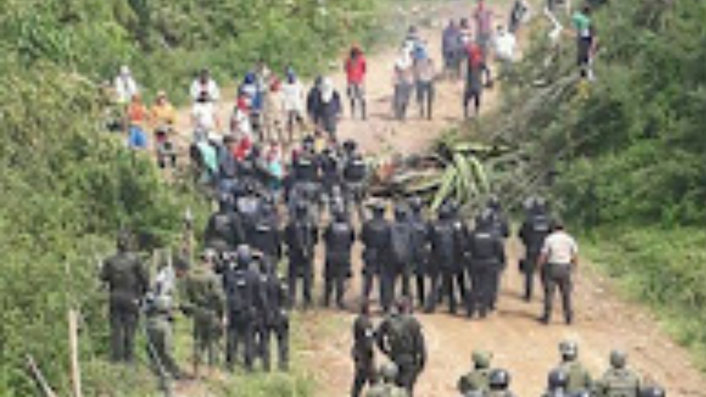

* * *

_Oversatt for Tjen Folket Media av en bidragsyter._

* * *

**Kameratene våre i Fronten til forsvar av folkets kamper (FDLP) har publisert
denne uttalelsen til støtte samfunnsmedlemmene i Buenos Aires som kjemper for
jorda si.**

Publisert av [FDLP-EC](http://fdlp-ec.blogspot.com/2023/01/alto-la-represion-
comuneros-de-buenos.html) 24.01.2023

* * *

### Stopp undertrykkinga av samfunnsmedlemmene i Buenos Aires, Imbabura, ut
med gruveselskapene, ut med FFAA og det nasjonale politiet

Tusenvis av soldater og politi har sluppet løs en blodig
undertrykkingskampanje mot samfunnsmedlemmene i Buenos Aires, Imbabura, som
motsetter seg gruvedrift i området deres.

Til tross for at samfunnet ved flere anledninger har uttrykt motstand mot
tilstedeværelsen av gruveselskapene i landet, særlig det australske
datterselskapet Hanrine, slipper disse utenlandske selskapene, med samtykke
fra Lassos korrupte regjering og støtte fra de væpna styrkene og politiet, løs
forfølgelse, fengsling og undertrykking med skytevåpen mot samfunnsmedlemmene
som resolutt motsetter seg gruveselskapenes og statens undertrykkelsesapparat.

For øyeblikket rapporterer samfunnsmedlemmene om skader, forsvinninger og
dødsfall.

El Frente de Defensa de las Luchas del Pueblo del Ecuador står i solidaritet
med samfunnsmedlemmene i Buenos Aires som modig kjemper for jorda si og å
fordrive inntrengerne, i dette tilfellet gruveselskapene, de væpna styrkene og
det nasjonale politiet, som har blitt virkelige okkupasjonshærer på
fattigbøndenes jord.

Vi fordømmer de væpna styrkene og det nasjonale politiet som mordere og
undertrykkere; udugelige og feige overfor organisert kriminalitet, modige og
rasende mot den ubevæpna befolkninga.

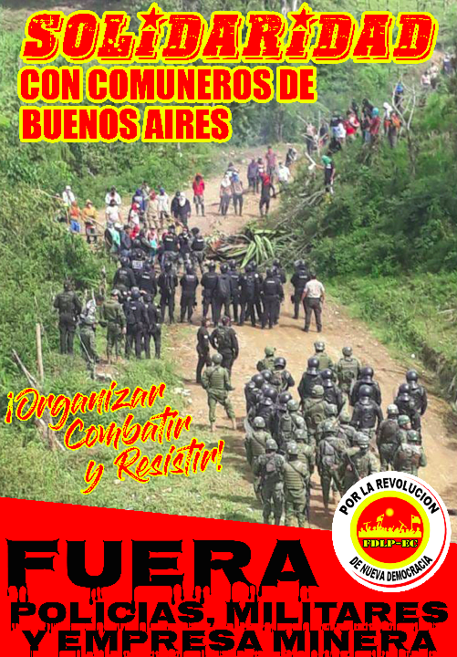

**Verken tilgivelse eller glemsel for folkets bødler!  **

**Militær og politi ut av Buenos Aires!**

**Gruveselskaper ut av Buenos Aires og Ecuador!**

* * *

Les også:

> [Ecuador: Kamp mot gruvedrift](https://tjen-
> folket.no/index.php/2021/08/16/ecuador-kamp-mot-gruvedrift-2/)

> [Ecuador: Kampen mot gruveselskapet fortsetter](https://tjen-
> folket.no/index.php/2021/08/22/ecuador-kampen-mot-gruveselskapet-
> fortsetter/)

Source: [https://tjen-folket.no/index.php/2023/01/31/ecuador-kamp-mot-gruvedrift-og-undertrykking/](https://tjen-folket.no/index.php/2023/01/31/ecuador-kamp-mot-gruvedrift-og-undertrykking/)

<!--NEWS-->

# No Brasil, ações celebram fundação da Liga Comunista Internacional (atualizado 31/01)

Author: Redação de AND

Time: 2023-01-31T10:00:00-03:00

Images: ['[Universidade_Tecnologica_Federal_do_Parana_1_1_1.jpg](https://anovademocracia.com.br/images/Universidade_Tecnologica_Federal_do_Parana_1_1_1.jpg)', '[Westfallen_com_Av_Iguacu_Centro_de_Curitiba_2JPG_3.jpg](https://anovademocracia.com.br/images/Westfallen_com_Av_Iguacu_Centro_de_Curitiba_2JPG_3.jpg)', '[Praca_Ouvidor_Pardinho_Centro_de_CuritibaJPG_1.jpg](https://anovademocracia.com.br/images/Praca_Ouvidor_Pardinho_Centro_de_CuritibaJPG_1.jpg)', '[Preca_Ouvidor_Pardinho_Centro_de_Curitiba_1.jpg](https://anovademocracia.com.br/images/Preca_Ouvidor_Pardinho_Centro_de_Curitiba_1.jpg)', '[rua_imaculada_conceicao_1.jpg](https://anovademocracia.com.br/images/rua_imaculada_conceicao_1.jpg)', '[estacao_puc_-_linha_verde_2.jpg](https://anovademocracia.com.br/images/estacao_puc_-_linha_verde_2.jpg)', '[col_estadual_Manuel_Ribas_1.jpg](https://anovademocracia.com.br/images/col_estadual_Manuel_Ribas_1.jpg)', '[av_das_torres_1.jpg](https://anovademocracia.com.br/images/av_das_torres_1.jpg)', '[viaduto_av_comendador_franco_com_linha_verde_1.jpg](https://anovademocracia.com.br/images/viaduto_av_comendador_franco_com_linha_verde_1.jpg)', '[01_Bairro_Alto_1.jpg](https://anovademocracia.com.br/images/01_Bairro_Alto_1.jpg)', '[02_Estrada_da_ribeira_atuba_1_1.jpg](https://anovademocracia.com.br/images/02_Estrada_da_ribeira_atuba_1_1.jpg)', '[03_Linha_verde_2.jpg](https://anovademocracia.com.br/images/03_Linha_verde_2.jpg)', '[04_Linha_verde_4.jpg](https://anovademocracia.com.br/images/04_Linha_verde_4.jpg)', '[05_Linha_verde_5.jpg](https://anovademocracia.com.br/images/05_Linha_verde_5.jpg)', '[06_Linha_Verde_1_1.jpg](https://anovademocracia.com.br/images/06_Linha_Verde_1_1.jpg)', '[07_Rgis_bittencourt_atuba.jpg](https://anovademocracia.com.br/images/07_Rgis_bittencourt_atuba.jpg)', '[08_Rgis_bittencourt_atuba_2_1.jpg](https://anovademocracia.com.br/images/08_Rgis_bittencourt_atuba_2_1.jpg)', '[09_Rgis_bittencourt_atuba_4.jpg](https://anovademocracia.com.br/images/09_Rgis_bittencourt_atuba_4.jpg)', '[10_Viaduto_atuba_1.jpg](https://anovademocracia.com.br/images/10_Viaduto_atuba_1.jpg)', '[11_Viaduto_atuba_2.jpg](https://anovademocracia.com.br/images/11_Viaduto_atuba_2.jpg)', '[12_viaduto_bairro_alto_4.jpg](https://anovademocracia.com.br/images/12_viaduto_bairro_alto_4.jpg)', '[13_Viaduto_bairro_alto_3.jpg](https://anovademocracia.com.br/images/13_Viaduto_bairro_alto_3.jpg)', '[14_Viaduto_Bairro_alto_1.jpg](https://anovademocracia.com.br/images/14_Viaduto_Bairro_alto_1.jpg)', '[15_Viaduto_bairro_alto_2.jpg](https://anovademocracia.com.br/images/15_Viaduto_bairro_alto_2.jpg)', '[112_4406cleaned.jpg](https://anovademocracia.com.br/images/112_4406cleaned.jpg)', '[112_4414cleaned.jpg](https://anovademocracia.com.br/images/112_4414cleaned.jpg)', '[112_4420cleaned.jpg](https://anovademocracia.com.br/images/112_4420cleaned.jpg)', '[112_4425cleaned.jpg](https://anovademocracia.com.br/images/112_4425cleaned.jpg)', '[112_4437cleaned.jpg](https://anovademocracia.com.br/images/112_4437cleaned.jpg)', '[112_4451cleaned.jpg](https://anovademocracia.com.br/images/112_4451cleaned.jpg)', '[112_4457cleaned.jpg](https://anovademocracia.com.br/images/112_4457cleaned.jpg)', '[1-18-LCI-Maring-PR-1.jpg](https://anovademocracia.com.br/images/1-18-LCI-Maring-PR-1.jpg)', '[1-18-LCI-Maring-PR-2.jpg](https://anovademocracia.com.br/images/1-18-LCI-Maring-PR-2.jpg)', '[1-18-LCI-Maring-PR-4.jpg](https://anovademocracia.com.br/images/1-18-LCI-Maring-PR-4.jpg)', '[1-18-LCI-Maring-PR-3.jpg](https://anovademocracia.com.br/images/1-18-LCI-Maring-PR-3.jpg)', '[Pinhais_20.jpg](https://anovademocracia.com.br/images/Pinhais_20.jpg)', '[Pinhais_19.jpg](https://anovademocracia.com.br/images/Pinhais_19.jpg)', '[Pinhais_18.jpg](https://anovademocracia.com.br/images/Pinhais_18.jpg)', '[Pinhais_11.jpg](https://anovademocracia.com.br/images/Pinhais_11.jpg)', '[Pinhais_16.jpg](https://anovademocracia.com.br/images/Pinhais_16.jpg)', '[Pinhais_14.jpg](https://anovademocracia.com.br/images/Pinhais_14.jpg)', '[Pinhais_15.jpg](https://anovademocracia.com.br/images/Pinhais_15.jpg)', '[Pinhais_12.jpg](https://anovademocracia.com.br/images/Pinhais_12.jpg)', '[Pinhais_13.jpg](https://anovademocracia.com.br/images/Pinhais_13.jpg)', '[Pinhais_17.jpg](https://anovademocracia.com.br/images/Pinhais_17.jpg)', '[Pinhais_01.jpg](https://anovademocracia.com.br/images/Pinhais_01.jpg)', '[Pinhais_02.jpg](https://anovademocracia.com.br/images/Pinhais_02.jpg)', '[Pinhais_04.jpg](https://anovademocracia.com.br/images/Pinhais_04.jpg)', '[Pinhais_09.jpg](https://anovademocracia.com.br/images/Pinhais_09.jpg)', '[Pinhais_07.jpg](https://anovademocracia.com.br/images/Pinhais_07.jpg)', '[Pinhais_08.jpg](https://anovademocracia.com.br/images/Pinhais_08.jpg)', '[Pinhais_05.jpg](https://anovademocracia.com.br/images/Pinhais_05.jpg)', '[Pinhais_10.jpg](https://anovademocracia.com.br/images/Pinhais_10.jpg)', '[Pinhais_0601.jpg](https://anovademocracia.com.br/images/Pinhais_0601.jpg)', '[Pinhais_03_12.jpg](https://anovademocracia.com.br/images/Pinhais_03_12.jpg)', '[Via_do_Minrio_anel_rodoviario_BH_5.jpg](https://anovademocracia.com.br/images/Via_do_Minrio_anel_rodoviario_BH_5.jpg)', '[Via_do_Minrio_anel_rodoviario_BH_3.jpg](https://anovademocracia.com.br/images/Via_do_Minrio_anel_rodoviario_BH_3.jpg)', '[Shopping_Del_Rey_anel_rodovirio_3_2.jpg](https://anovademocracia.com.br/images/Shopping_Del_Rey_anel_rodovirio_3_2.jpg)', '[Shopping_Del_Rey_anel_rodoviario_BH_2.jpg](https://anovademocracia.com.br/images/Shopping_Del_Rey_anel_rodoviario_BH_2.jpg)', '[Viaduto_sao_francisco_anel_rodoviario_BH_3_2.jpg](https://anovademocracia.com.br/images/Viaduto_sao_francisco_anel_rodoviario_BH_3_2.jpg)', '[Via_do_Minrio_anel_rodoviario_BH_6.jpg](https://anovademocracia.com.br/images/Via_do_Minrio_anel_rodoviario_BH_6.jpg)', '[Viaduto_So_Francisco_anel_rodovirio_BH_5.jpg](https://anovademocracia.com.br/images/Viaduto_So_Francisco_anel_rodovirio_BH_5.jpg)', '[1366x768_10_1.jpg](https://anovademocracia.com.br/images/1366x768_10_1.jpg)', '[1366x768_9_1.jpg](https://anovademocracia.com.br/images/1366x768_9_1.jpg)', '[1366x768_8_1.jpg](https://anovademocracia.com.br/images/1366x768_8_1.jpg)', '[1366x768_7_1.jpg](https://anovademocracia.com.br/images/1366x768_7_1.jpg)', '[6a_2.jpg](https://anovademocracia.com.br/images/6a_2.jpg)', '[1366x768_13_1.jpg](https://anovademocracia.com.br/images/1366x768_13_1.jpg)', '[1366x768_12_1.jpg](https://anovademocracia.com.br/images/1366x768_12_1.jpg)', '[1366x768_11_1.jpg](https://anovademocracia.com.br/images/1366x768_11_1.jpg)', '[anel_rodoviario_1.jpg](https://anovademocracia.com.br/images/anel_rodoviario_1.jpg)', '[vila_oeste_2_1.jpg](https://anovademocracia.com.br/images/vila_oeste_2_1.jpg)', '[vila_oeste_1_2.jpg](https://anovademocracia.com.br/images/vila_oeste_1_2.jpg)', '[Lci_nort_3.jpg](https://anovademocracia.com.br/images/Lci_nort_3.jpg)', '[Lci_nort_1.jpg](https://anovademocracia.com.br/images/Lci_nort_1.jpg)', '[Lci_nort_4.jpg](https://anovademocracia.com.br/images/Lci_nort_4.jpg)', '[Lci_nort_5.jpg](https://anovademocracia.com.br/images/Lci_nort_5.jpg)', '[Lci_nort_2.jpg](https://anovademocracia.com.br/images/Lci_nort_2.jpg)', '[divulgacao1.jpg](https://anovademocracia.com.br/images/divulgacao1.jpg)', '[Pichacao2.jpg](https://anovademocracia.com.br/images/Pichacao2.jpg)', '[Pichao_encontrada_ZO_SP.jpg](https://anovademocracia.com.br/images/Pichao_encontrada_ZO_SP.jpg)', '[Guarulhos_3.jpg](https://anovademocracia.com.br/images/Guarulhos_3.jpg)', '[Guarulhos_1.jpg](https://anovademocracia.com.br/images/Guarulhos_1.jpg)', '[Foto.jpg](https://anovademocracia.com.br/images/Foto.jpg)', '[Bandeiras_LCI_-_SP_Guarulhos_Campinas_3_1.jpg](https://anovademocracia.com.br/images/Bandeiras_LCI_-_SP_Guarulhos_Campinas_3_1.jpg)', '[Bandeiras_LCI_-_SP_Guarulhos_Campinas_2_1.jpg](https://anovademocracia.com.br/images/Bandeiras_LCI_-_SP_Guarulhos_Campinas_2_1.jpg)', '[Bandeiras_LCI_-_SP_Guarulhos_Campinas_1_2.jpg](https://anovademocracia.com.br/images/Bandeiras_LCI_-_SP_Guarulhos_Campinas_1_2.jpg)', '[passarela_trem_SC_Av_Pelcleaned.jpg](https://anovademocracia.com.br/images/passarela_trem_SC_Av_Pelcleaned.jpg)', '[Passarela_metro_SCcleaned.jpg](https://anovademocracia.com.br/images/Passarela_metro_SCcleaned.jpg)', '[Passeio-pblico-Lapa-RJ.jpg](https://anovademocracia.com.br/images/Passeio-pblico-Lapa-RJ.jpg)', '[Passeio-pblico-pontos-de-onibus-RJ.jpg](https://anovademocracia.com.br/images/Passeio-pblico-pontos-de-onibus-RJ.jpg)', '[Passarela-Radial-Oeste-RJ.jpg](https://anovademocracia.com.br/images/Passarela-Radial-Oeste-RJ.jpg)', '[Lapa-proximo-hospital-RJ.jpg](https://anovademocracia.com.br/images/Lapa-proximo-hospital-RJ.jpg)', '[Cinelandia2-RJ.jpg](https://anovademocracia.com.br/images/Cinelandia2-RJ.jpg)', '[Cinelandia1-RJ.jpg](https://anovademocracia.com.br/images/Cinelandia1-RJ.jpg)', '[Estao_de_Metro_Thomz_Coelho_na_entrada_da_Favela_do_Juramento_1.jpg](https://anovademocracia.com.br/images/Estao_de_Metro_Thomz_Coelho_na_entrada_da_Favela_do_Juramento_1.jpg)', '[19-1-LCI-2.jpg](https://anovademocracia.com.br/images/19-1-LCI-2.jpg)', '[19-1-LCI-3.jpg](https://anovademocracia.com.br/images/19-1-LCI-3.jpg)', '[19-1-LCI-Metr-SFX.jpg](https://anovademocracia.com.br/images/19-1-LCI-Metr-SFX.jpg)', '[Favela_do_Jacarezinho.jpg](https://anovademocracia.com.br/images/Favela_do_Jacarezinho.jpg)', '[Passarela_13_Avenida_Brasil.jpg](https://anovademocracia.com.br/images/Passarela_13_Avenida_Brasil.jpg)', '[Passarela_12_Avenida_Brasil.jpg](https://anovademocracia.com.br/images/Passarela_12_Avenida_Brasil.jpg)', '[Passarela_14_Avenida_Brasil.jpg](https://anovademocracia.com.br/images/Passarela_14_Avenida_Brasil.jpg)', '[Estao_do_Mier.jpg](https://anovademocracia.com.br/images/Estao_do_Mier.jpg)', '[Estao_do_Nova_Amrica.jpg](https://anovademocracia.com.br/images/Estao_do_Nova_Amrica.jpg)', '[Metro_de_Maria_da_Graa.jpg](https://anovademocracia.com.br/images/Metro_de_Maria_da_Graa.jpg)', '[Passarela_do_trem_de_Olaria.jpg](https://anovademocracia.com.br/images/Passarela_do_trem_de_Olaria.jpg)', '[Quadra_do_Cefet_de_Maria_da_Graa.jpg](https://anovademocracia.com.br/images/Quadra_do_Cefet_de_Maria_da_Graa.jpg)', '[1IMG_1509_Rua_Joao_Paulo_Primeiro.jpg](https://anovademocracia.com.br/images/1IMG_1509_Rua_Joao_Paulo_Primeiro.jpg)', '[2IMG_1509_Avenida_Paulo_de_Frontin1.jpg](https://anovademocracia.com.br/images/2IMG_1509_Avenida_Paulo_de_Frontin1.jpg)', '[IMG_20230118_090539052.jpg](https://anovademocracia.com.br/images/IMG_20230118_090539052.jpg)', '[IMG_20230118_090500779.jpg](https://anovademocracia.com.br/images/IMG_20230118_090500779.jpg)', '[ufrgs_campu_centro.jpg](https://anovademocracia.com.br/images/ufrgs_campu_centro.jpg)', '[zona_sul.jpg](https://anovademocracia.com.br/images/zona_sul.jpg)', '[zona_leste_ufrgs_2.jpg](https://anovademocracia.com.br/images/zona_leste_ufrgs_2.jpg)', '[consulado_zona_norte.jpg](https://anovademocracia.com.br/images/consulado_zona_norte.jpg)', '[001MSDOURADOS_1.jpg](https://anovademocracia.com.br/images/001MSDOURADOS_1.jpg)', '[003MSDOURADOS.jpg](https://anovademocracia.com.br/images/003MSDOURADOS.jpg)', '[002MSDOURADOS.jpg](https://anovademocracia.com.br/images/002MSDOURADOS.jpg)', '[2MSDOURADOS_1.jpg](https://anovademocracia.com.br/images/2MSDOURADOS_1.jpg)', '[1MSDOURADOS_1.jpg](https://anovademocracia.com.br/images/1MSDOURADOS_1.jpg)', '[5adwawdawdawd.jpg](https://anovademocracia.com.br/images/5adwawdawdawd.jpg)', '[1-18-Dourados2-LCI.jpg](https://anovademocracia.com.br/images/1-18-Dourados2-LCI.jpg)', '[1-18-Dourados1-LCI.jpg](https://anovademocracia.com.br/images/1-18-Dourados1-LCI.jpg)', '[015_Universidade_Federal_do_Ama.jpg](https://anovademocracia.com.br/images/015_Universidade_Federal_do_Ama.jpg)', '[IMG_8903limpo.jpg](https://anovademocracia.com.br/images/IMG_8903limpo.jpg)', '[009_Universidade_Estadual_do_Am.jpg](https://anovademocracia.com.br/images/009_Universidade_Estadual_do_Am.jpg)', '[006_Colgio_D_Pedro_IIcleaned_1.jpg](https://anovademocracia.com.br/images/006_Colgio_D_Pedro_IIcleaned_1.jpg)', '[007_ifam_1.jpg](https://anovademocracia.com.br/images/007_ifam_1.jpg)', '[002_Carrefour_Av_Djalma_Batist.jpg](https://anovademocracia.com.br/images/002_Carrefour_Av_Djalma_Batist.jpg)', '[003_Praa_da_Matrizcleaned.jpg](https://anovademocracia.com.br/images/003_Praa_da_Matrizcleaned.jpg)', '[019_-_Estdio_Arena_da_Amaznia_1.jpg](https://anovademocracia.com.br/images/019_-_Estdio_Arena_da_Amaznia_1.jpg)', '[Goiania-City-Goias-State-Brazil-coutry.jpg](https://anovademocracia.com.br/images/Goiania-City-Goias-State-Brazil-coutry.jpg)']

<!--METADATA-->

Uma série de imagens retratando ações em celebração pela fundação da Liga
Comunista Internacional (LCI) no Brasil foram enviadas à redação de **AND**.

As fotos registram içamento de bandeiras da LCI e pichações com as palavras de
ordem: **Viva a Liga Comunista Internacional!** , **Unir-se sob o maoismo!
Abaixo o revisionismo! Abaixo a guerra imperialista! Viva a Revolução
Proletária Mundial!** , com o símbolo foice e martelo. Segundo informações
publicadas pelo jornal [Internacional Comunista](https://ci-ic.org/), a LCI
foi fundada ao término da Conferência Internacional Maoista Unificada.

**PARANÁ**

**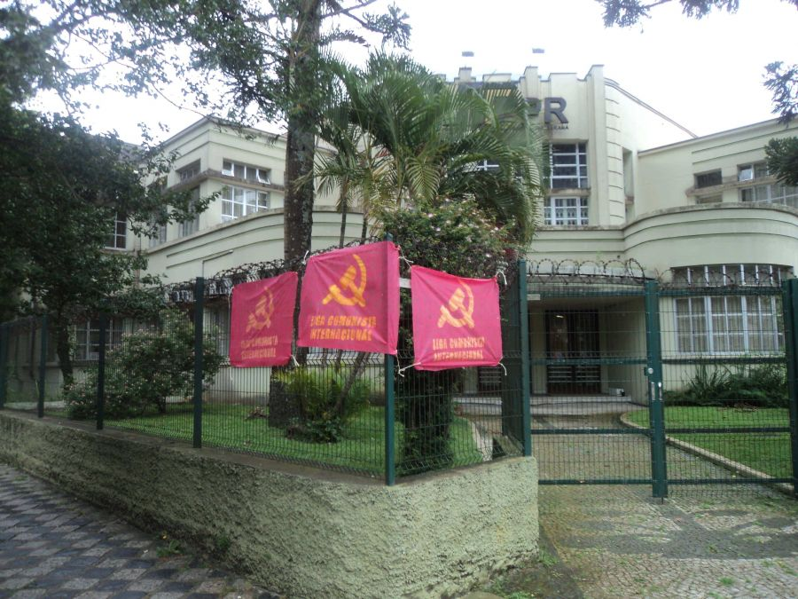**

Bandeiras içadas na Universidade Tecnologica Federal do Paraná (UTFP) no
centro de Curitiba (PR). Foto: Banco de Dados AND

Bandeiras içadas na rua Westfallen, esquina com a Av. Iguaçu, no centro de
Curitiba (PR). Foto: Banco de Dados AND

****

Bandeiras içadas na praça Ouvidor Pardinho, no centro de Curitiba (PR). Foto:
Banco de Dados AND

****

Bandeiras içadas na praça Ouvidor Pardinho, no centro de Curitiba (PR). Foto:
Banco de Dados AND

****

Bandeira içada na rua Imaculada Conceição, em Curitiba (PR). Foto: Banco de
Dados AND

**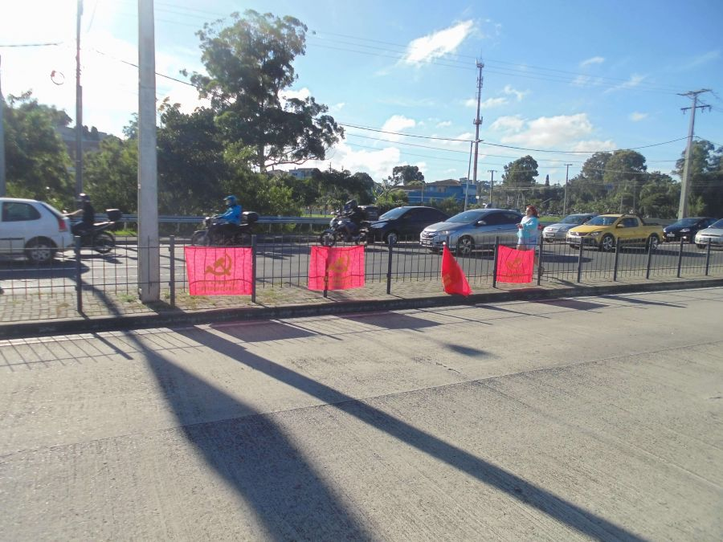**

Bandeiras içadas na estação da Pontifícia Universidade Católica (PUC), em
Curitiba (PR). Foto: Banco de Dados AND

****

Bandeiras içadas no colégio estadual Manuel Ribas em Curitiba (PR). Foto:
Banco de Dados AND

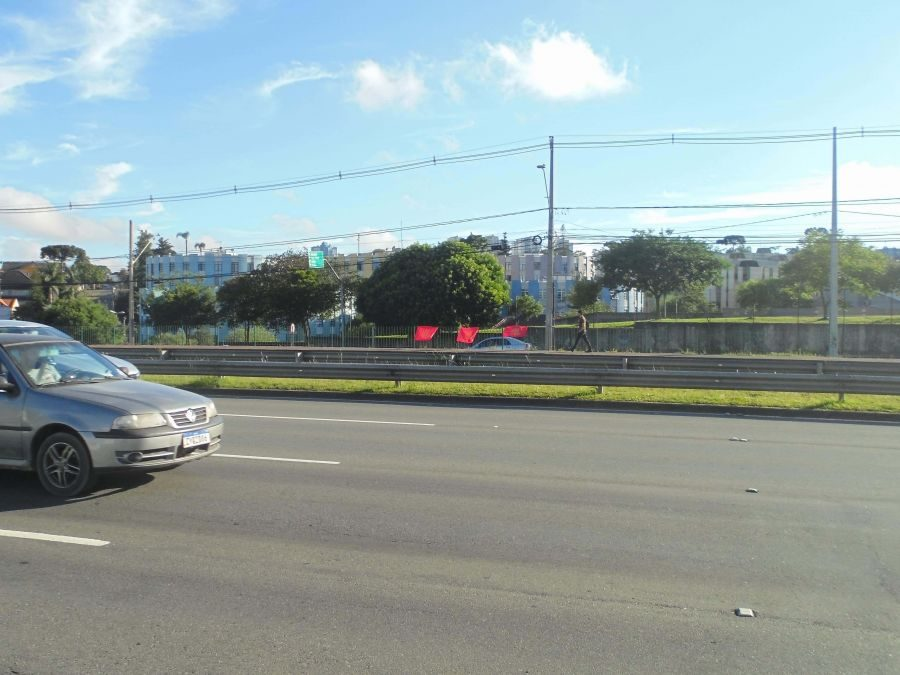

Bandeiras içadas na Avenida das Torres, em Curitiba (PR). Foto: Banco de Dados
AND

**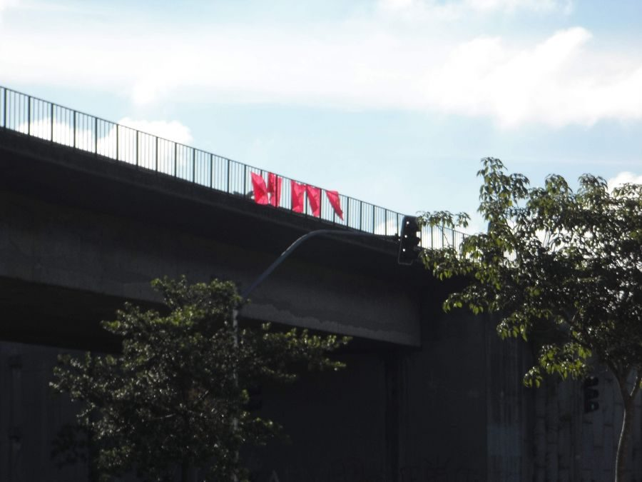**

Bandeiras içadas no viaduto da Avenida Comendador Franco, em Curitiba (PR).
Foto: Banco de Dados AND

****

Bandeira içada próximo ao Terminal do Bairro Alto, Curitiba (PR). Foto: Banco
de Dados AND

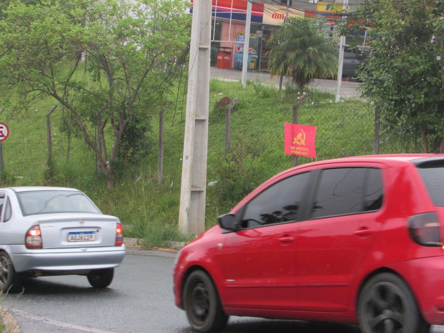

Bandeira içada na Estrada da Ribeira, bairro Atuba, Curitiba (PR). Foto: Banco
de Dados AND

Bandeira içada próx. à Estação Fagundes Varela, Av. Linha Verde, Curitiba
(PR). Foto: Banco de Dados AND

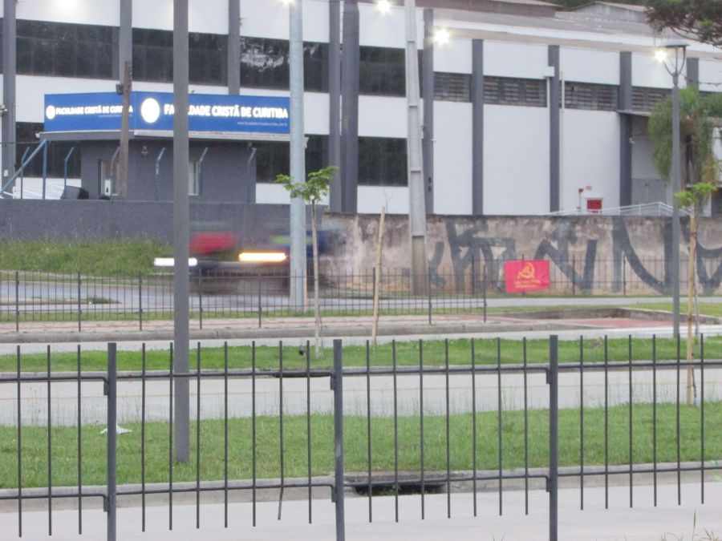

Bandeira içada próx. à Estação Fagundes Varela, Av. Linha Verde, Curitiba
(PR). Foto: Banco de Dados AND

Bandeira içada próx. à Estação Fagundes Varela, Av. Linha Verde, Curitiba
(PR). Foto: Banco de Dados AND

Bandeira içada próx. à Estação Fagundes Varela, Av. Linha Verde, Curitiba
(PR). Foto: Banco de Dados AND

Bandeira içada na Rodovia Régis Bitencourt, Bairro Atuba, Curitiba (PR). Foto:
Banco de Dados AND

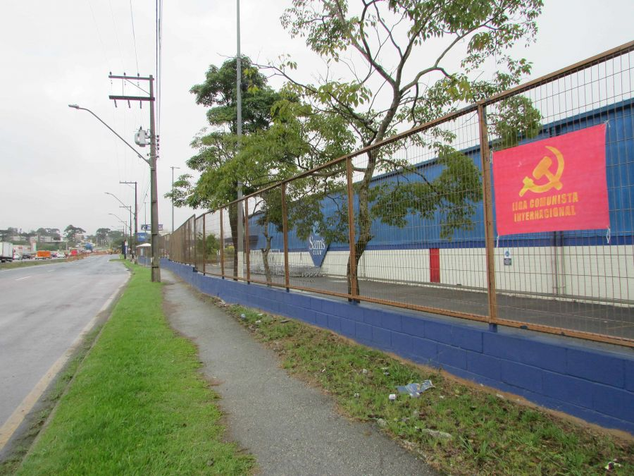

Bandeira içada na Rodovia Régis Bitencourt, Bairro Atuba, Curitiba (PR). Foto:
Banco de Dados AND

Bandeiras içadas na Rodovia Régis Bitencourt, Bairro Atuba, Curitiba (PR).
Foto: Banco de Dados AND

Bandeira Içada na Av. Mal. Mascarenhas de Morais sentido Colombo, Bairro
Atuba, Curitiba (PR). Foto: Banco de Dados AND

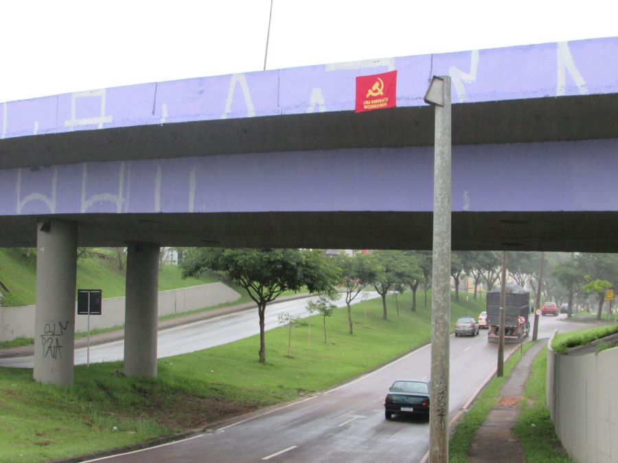

Bandeira Içada na Av. Mal. Mascarenhas de Morais sentido Colombo, Bairro
Atuba, Curitiba (PR). Foto: Banco de Dados AND

Bandeira Içada na Linha Verde, viaduto do Bairro Alto, Bairro Atuba, Curitiba
(PR). Foto: Banco de Dados AND

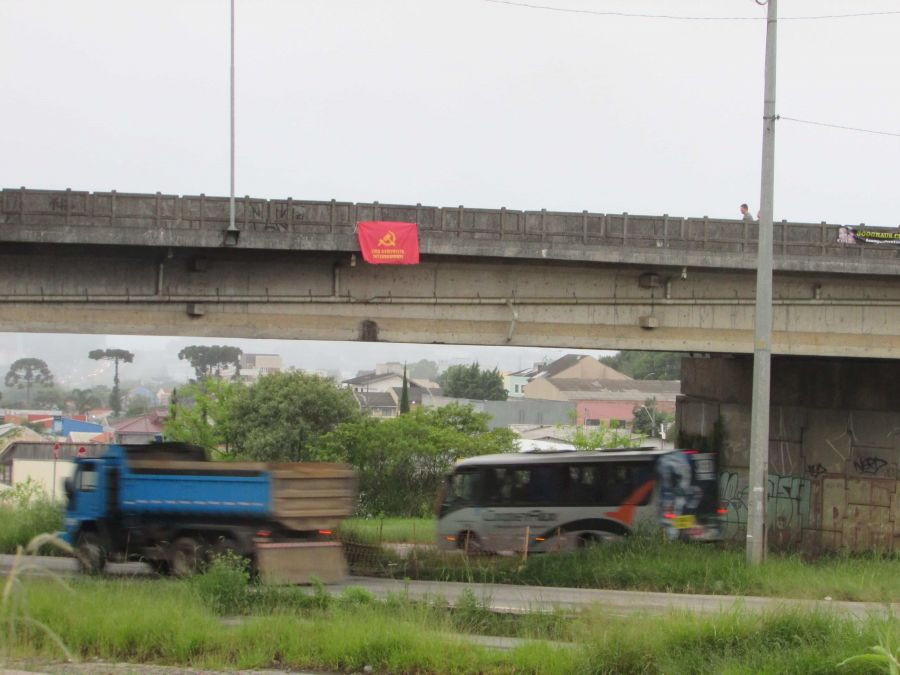

Bandeira Içada na Linha Verde, viaduto do Bairro Alto, Bairro Atuba, Curitiba
(PR). Foto: Banco de Dados AND

Bandeira Içada na Av. Monteiro Tourinho, Bairro Atuba, Curitiba (PR). Foto:
Banco de Dados AND

Bandeira Içada na Av. Monteiro Tourinho, Bairro Atuba, Curitiba (PR). Foto:
Banco de Dados AND

****

Bandeira içada no Viaduto Estaiado, bairro Guabirotuba, em Curitiba. Foto:
Banco de Dados AND  

Bandeira içada no Centro Politécnico da UFPR, bairro Jardim das Américas, em
Curitiba. Foto: Banco de Dados AND  

Bandeira içada no Centro Politécnico da UFPR, bairro Jardim das Américas, em
Curitiba. Foto: Banco de Dados AND  

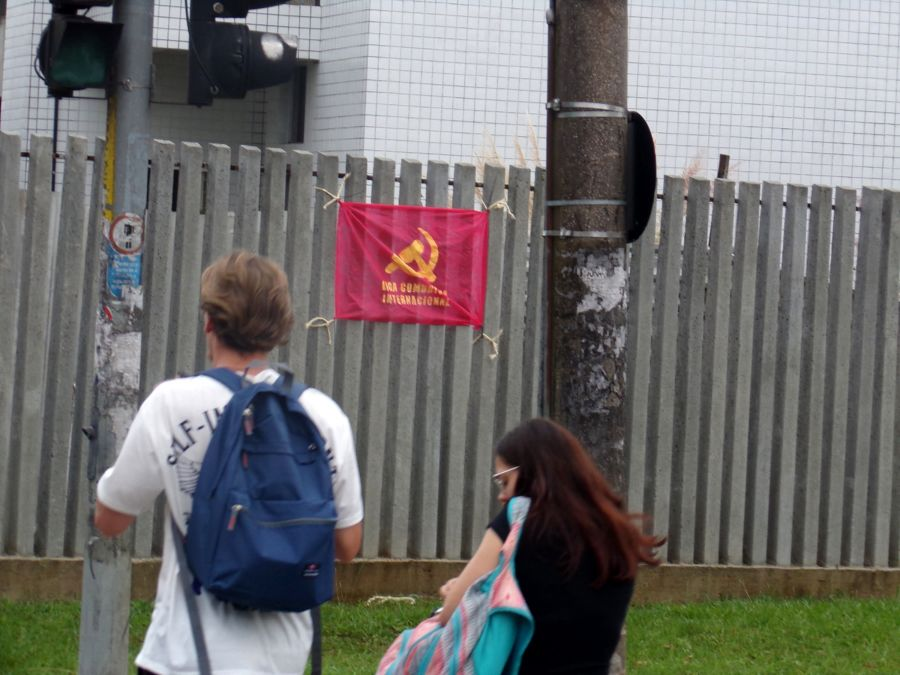

Bandeira içada no Centro Politécnico da UFPR, bairro Jardim das Américas, em
Curitiba. Foto: Banco de Dados AND  

Bandeira içada no Centro Politécnico da UFPR, bairro Jardim das Américas, em
Curitiba. Foto: Banco de Dados AND  

Bandeira içada nas proximidades do Shopping Jardim das Américas, em Curitiba.
Foto: Banco de Dados AND  

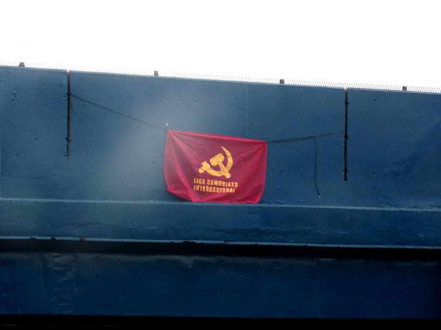

Bandeira içada na trincheira da BR 277 acima da Rua Rodolpho Senff, entre os
bairros Cajuru e Jardim das Américas, em Curitiba. Foto: Banco de Dados AND

Pichação em Maringá, município do Paraná. Foto: Banco de Dados AND

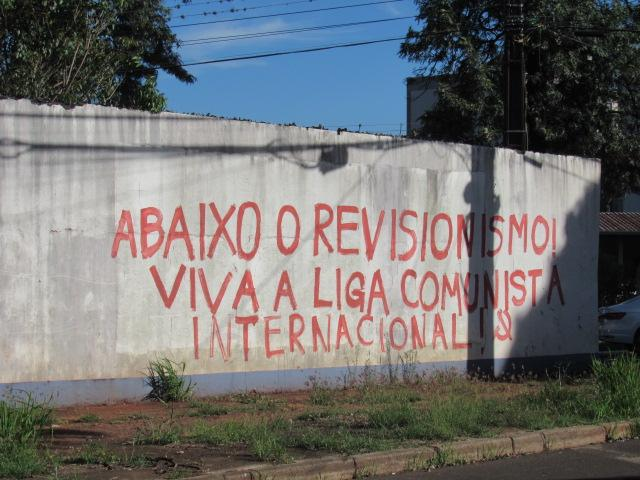

Pichação em Maringá, município do Paraná. Foto: Banco de Dados AND

Pichação em Maringá, município do Paraná. Foto: Banco de Dados AND

Pichação em Maringá, município do Paraná. Foto: Banco de Dados AND

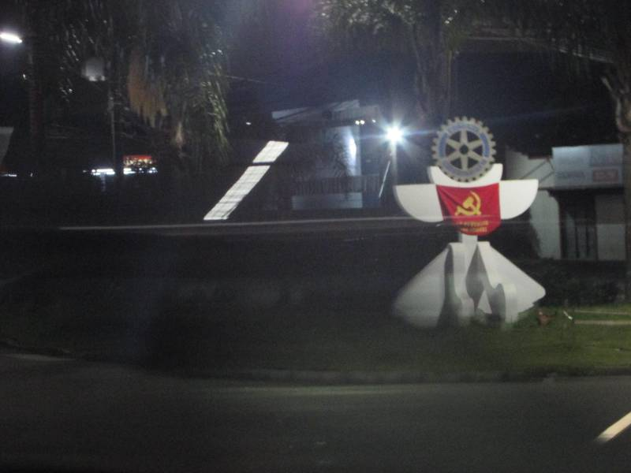

Bandeiras içadas na Avenida Leopoldo Jacomel, Centro de Pinhais. Foto: Banco
de dados AND

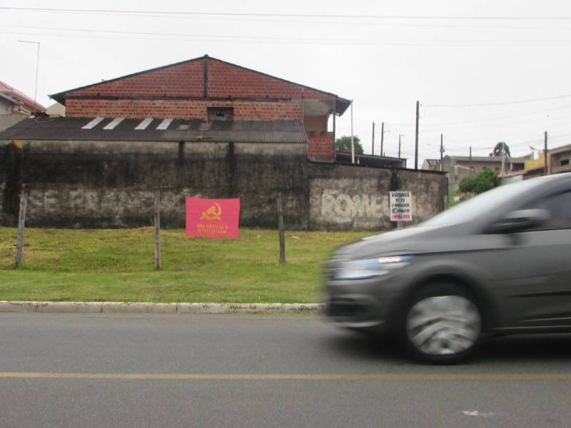

Bandeiras içadas em Rua Jacarezinho, bairro Pineville, cidade de Pinhais.
Foto: Banco de dados AND

Bandeiras içadas em Rua Alto Paraná, bairro Emiliano Perneta, em Pinhais.
Foto: Banco de dados AND

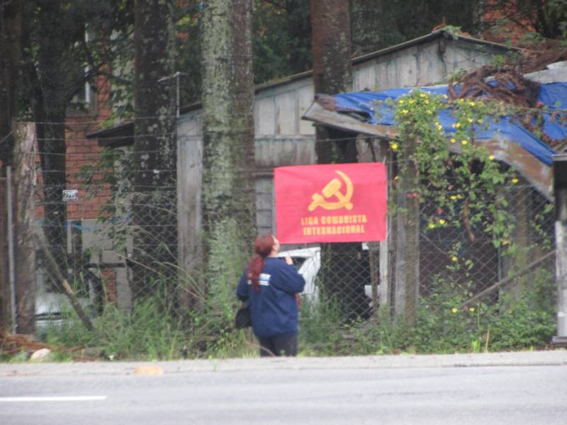

Bandeiras içadas na Avenida Maringá, bairro Emiliano Perneta, em Pinhais.
Foto: Banco de dados AND

Bandeiras içadas na Rua Jacarezinho, bairro Alto Tarumã, em Pinhais. Foto:
Banco de dados AND

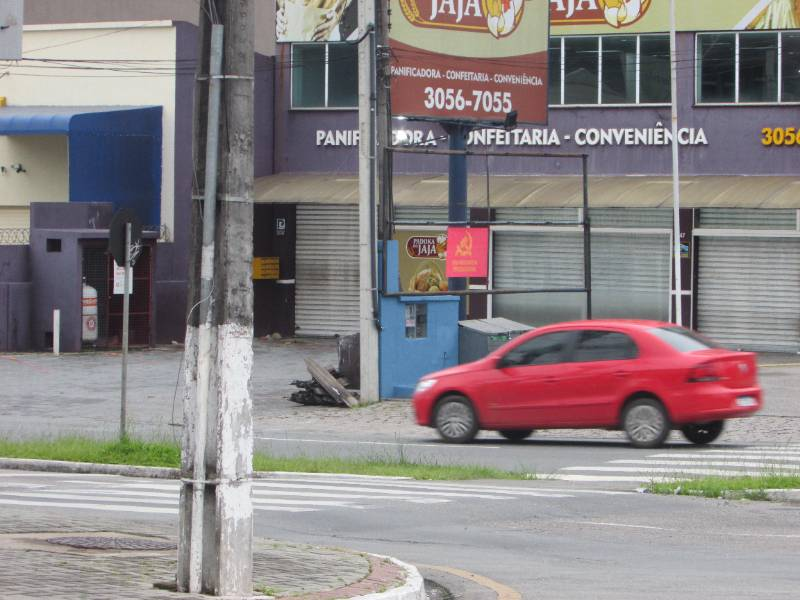

Bandeiras içadas em Avenida Jacob Macanhan, bairro Centro, em Pinhais. Foto:
Banco de dados AND

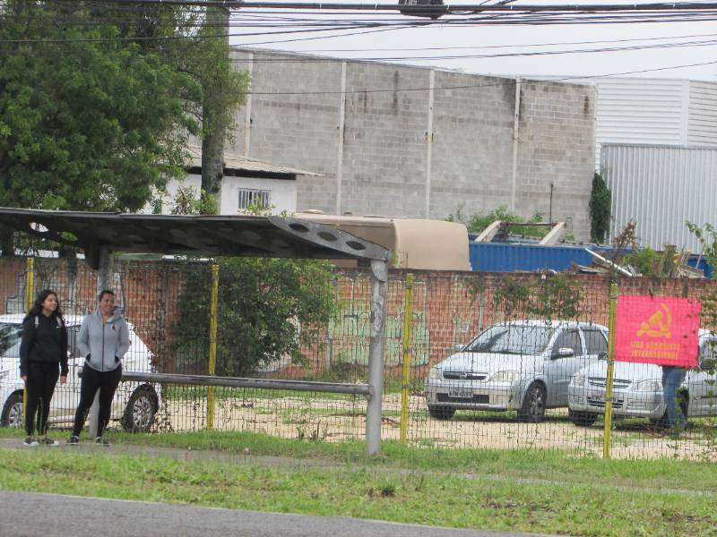

Bandeiras içadas na Avenida Maringá, bairro Emiliano Perneta, em Pinhais.
Foto: Banco de dados AND

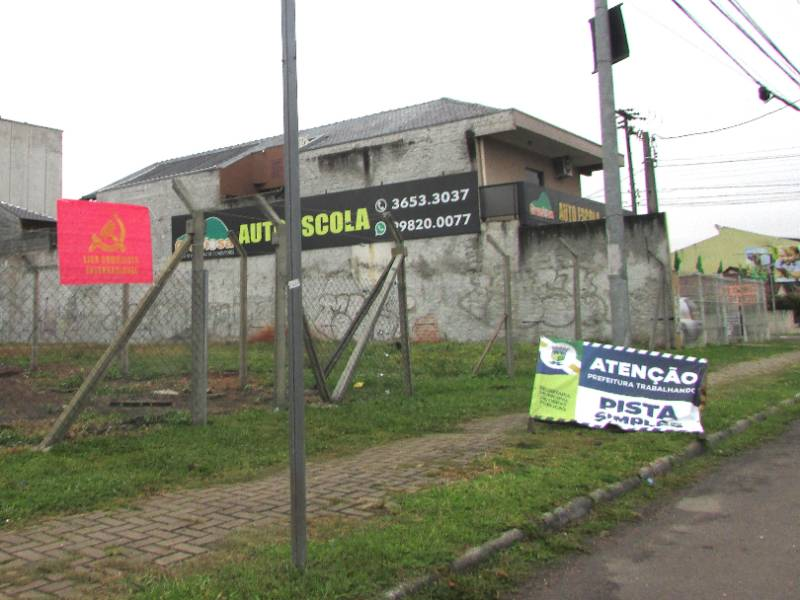

Bandeiras içadas na Avenida Maringá, bairro Atuba, em Pinhais. Foto: Banco de
dados AND

Bandeiras içadas na Avenida Maringá, esq. com a Avenida Leopoldo Jacomel, em
Pinhais. Foto: Banco de dados AND

Bandeiras içadas na Avenida Maringá, bairro Emiliano Perneta, em Pinhais.
Foto: Banco de dados AND

Bandeiras içadas na Avenida Maringá, bairro Emiliano Perneta, em Pinhais.
Foto: Banco de dados AND

Bandeiras içadas Avenida Leopoldo Jacomel, divisa com Curitiba, em Pinhais.
Foto: Banco de dados AND

Bandeiras içadas na Rua Jacarezinho, bairro Pineville em Pinhais. Foto: Banco
de dados AND

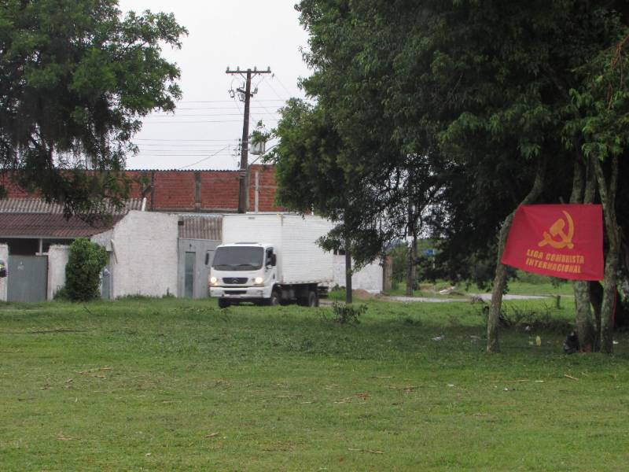

Bandeiras içadas na Rua Floral, bairro Alto Tarumã, em Pinhais. Foto: Banco de
dados AND

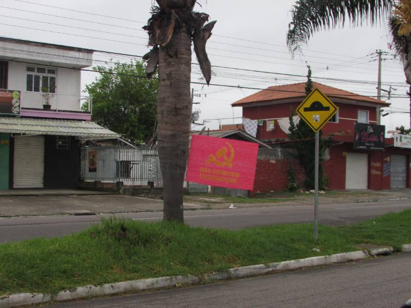

Bandeiras içadas Rua Jacarezinho, bairro Alto Tarumã, em Pinhais. Foto: Banco
de dados AND

Bandeiras içadas no Centro cultural e esportivo Arizona, bairro Alto Tarumã em
Pinhais. Foto: Banco de dados AND

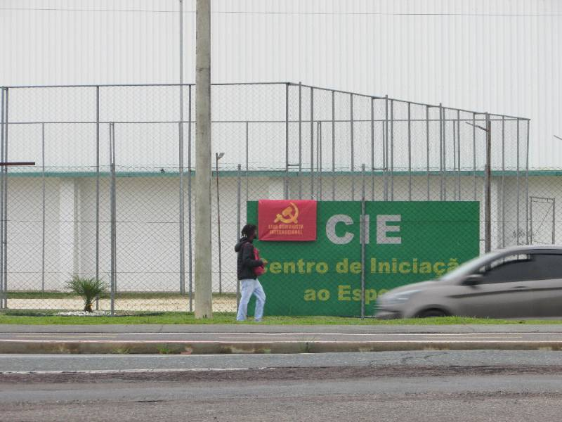

Bandeiras içadas na Avenida Maringá, bairro Emiliano Perneta em Pinhais. Foto:
Banco de dados AND

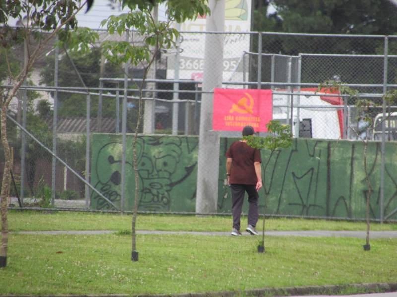

Bandeiras içadas na Avenida Maringá, bairro Emiliano Perneta, em Pinhais.
Foto: Banco de dados AND

Bandeiras içadas no Bosque Municipal Bordignon, bairro Pineville, em Pinhais.
Foto: Banco de dados AND

Bandeira içada em Avenida Jacoob Macanhan, bairro Pineville em Pinhais. Foto:
Banco de dados AND

**MINAS GERAIS**

****

Bandeiras içadas na Via do Minério, no Anel Rodoviário, Belo Horizonte (MG).
Foto: Banco de Dados AND

>
> [#Nacional](https://twitter.com/hashtag/Nacional?src=hash&ref_src=twsrc%5Etfw)
> | Recebemos em nosso correio eletrônico filmagem de bandeiras içadas em
> celebração a fundação da Liga Comunista Internacional (LCI). Informações
> apontam que o local dos embandeiramentos é Belo Horizonte (MG).
> [pic.twitter.com/wRYnjIxwjZ](https://t.co/wRYnjIxwjZ)
>
> — A Nova Democracia (@jornaland) [January 30,
> 2023](https://twitter.com/jornaland/status/1620078629773512704?ref_src=twsrc%5Etfw)

****

**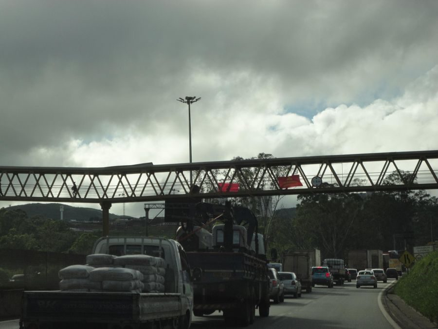**

Bandeiras içadas na Via do Minério, no Anel Rodoviário, Belo Horizonte (MG).
Foto: Banco de Dados AND

****

Bandeiras içadas na passarela do Shopping Del Rey, no Anel Rodoviário, Belo
Horizonte (MG). Foto: Banco de Dados AND

****

Bandeiras içadas na passarela do Shopping Del Rey, no Anel Rodoviário, Belo
Horizonte (MG). Foto: Banco de Dados AND

**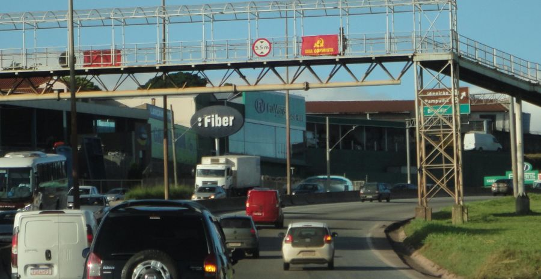**

Bandeiras içadas no viaduto São Francisco, no Anel Rodoviário, Belo Horizonte
(MG). Foto: Banco de Dados AND

**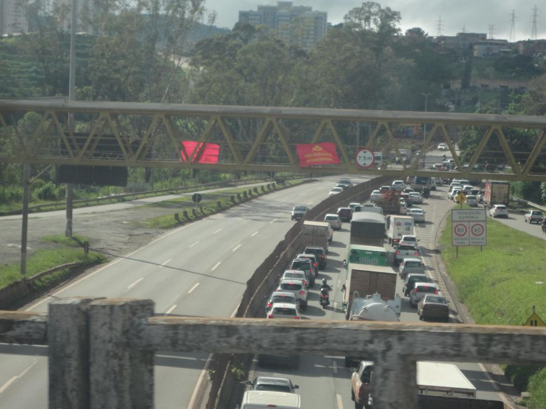**

Bandeiras içadas na Via do Minério, no Anel Rodoviário, Belo Horizonte (MG).
Foto: Banco de Dados AND

**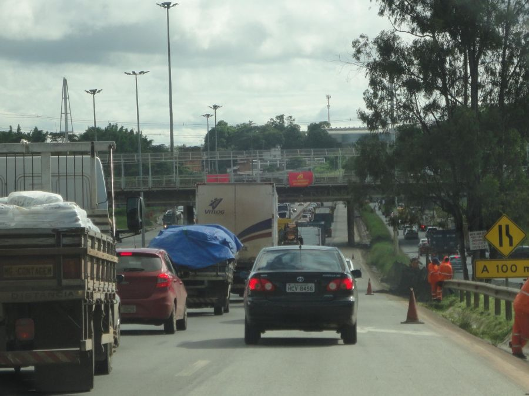**

Bandeiras içadas no viaduto São Francisco, no Anel Rodoviário, Belo Horizonte
(MG). Foto: Banco de Dados AND

**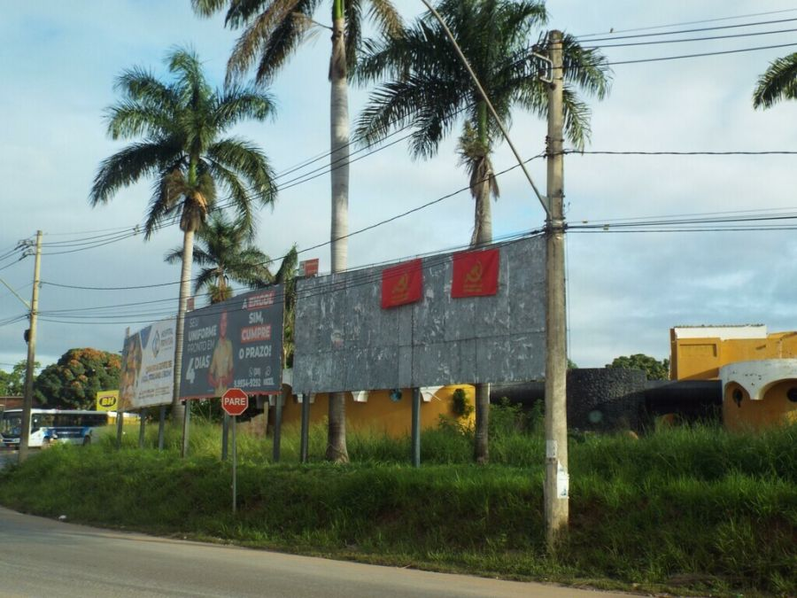**

****Bandeira içada em Montes Claros (MG). Foto: Banco de Dados AND

****

Bandeira içada em Montes Claros (MG). Foto: Banco de Dados AND

Bandeira içada em Montes Claros (MG). Foto: Banco de Dados AND

****

****Bandeira içada em Montes Claros (MG). Foto: Banco de Dados AND

****

****Bandeira içada em Montes Claros (MG). Foto: Banco de Dados AND

****

****Bandeira içada em Montes Claros (MG). Foto: Banco de Dados AND

****

Bandeira içada em Montes Claros (MG). Foto: Banco de Dados AND

****

Bandeira içada em Montes Claros (MG). Foto: Banco de Dados AND

****

Pichação encontrada no Anel Rodoviário, em Belo Horizonte (MG). Foto: Banco de
Dados AND

Pichação encontrada na Vila Oeste, em Belo Horizonte (MG). Foto: Banco de
Dados AND

Pichação encontrada na Vila Oeste, em Belo Horizonte (MG). Foto: Banco de
Dados AND

  
Bandeira içada em torre elétrica no Norte de Minas. Foto: Banco de Dados AND

  
Bandeira içada no Norte de Minas. Foto: Banco de Dados AND

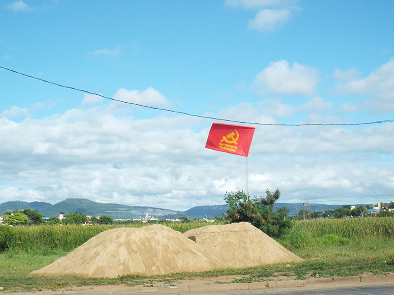  
Bandeira içada em fio urbano, Norte de Minas. Foto: Banco de Dados AND

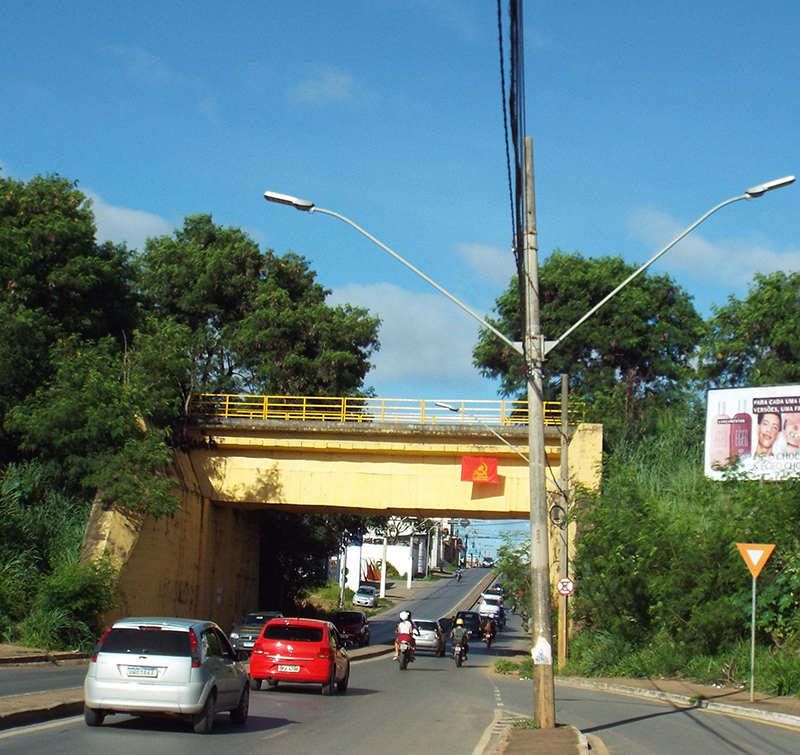  
Foto içada em ponte no Norte de Minas. Foto: Banco de Dados AND

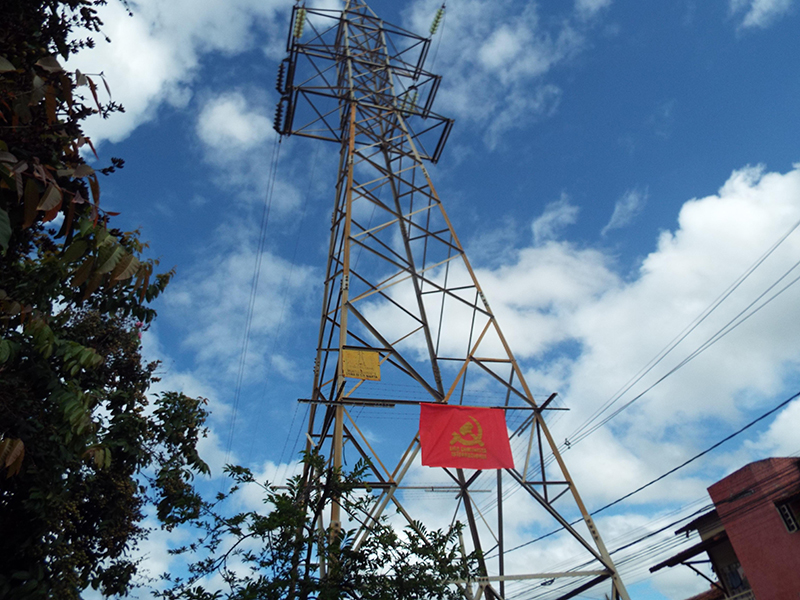  
Torre elétrica com bandeira içada, Norte de Minas. Foto: Banco de Dados AND

**SÃO PAULO**

****

Pichação encontrada em periferia de Campinas (SP). Foto: Banco de Dados AND

****

Pichação encontrada na rodovia Anhanguera, em Campinas (SP). Foto: Banco de
Dados AND

****

Pichação encontrada na Zona Oeste de São Paulo (SP). Foto: Banco de Dados AND

****

Pichação encontrada em Guarulhos (SP). Foto: Banco de Dados AND

****

Pichação encontrada em Guarulhos (SP). Foto: Banco de Dados AND

**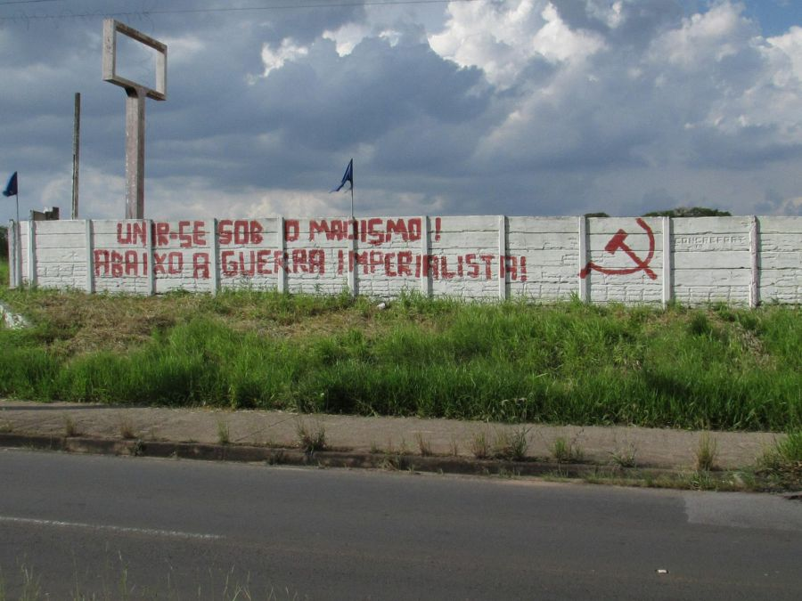**

Pichação avistada em Campinas (SP), próxima a uma periferia da cidade, em uma
avenida de grande circulação de operários. Foto: Banco de Dados AND

Bandeira içada em Campinas (SP). Foto: Banco de Dados AND

Bandeira içada em Guarulhos (SP). Foto: Banco de Dados AND

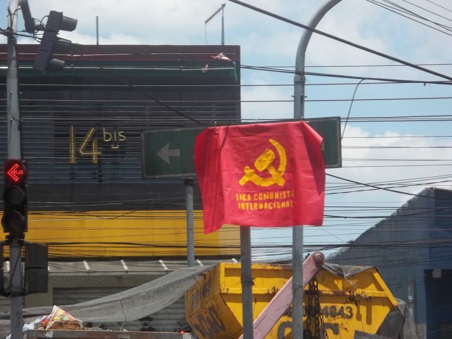

Bandeira içada em Guarulhos (SP). Foto: Banco de Dados AND

> Vídeo enviado à redação de AND: na virada do ano, à meia-noite do dia 31/12,
> a bandeira da Liga Comunista Internacional foi colocada no Viaduto do Chá,
> centro de São Paulo, ao lado da prefeitura.
> [pic.twitter.com/Bd4lhm0jzN](https://t.co/Bd4lhm0jzN)
>
> — A Nova Democracia (@jornaland) [January 9,
> 2023](https://twitter.com/jornaland/status/1612522186450866177?ref_src=twsrc%5Etfw)

RIO DE JANEIRO

>
> [#Nacional](https://twitter.com/hashtag/Nacional?src=hash&ref_src=twsrc%5Etfw)
> | Bandeiras e pichações celebrando a fundação da Liga Comunista
> Internacional (LCI) foram registradas e enviadas à redação de AND. Segundo
> informações, o local das filmagens é a Zona Norte do Rio de Janeiro.
> [pic.twitter.com/yl0UgULY35](https://t.co/yl0UgULY35)
>
> — A Nova Democracia (@jornaland) [January 23,
> 2023](https://twitter.com/jornaland/status/1617602519261392898?ref_src=twsrc%5Etfw)

Bandeira içada em passarela na Av Pelé, em São Cristóvão, Rio de Janeiro (RJ).
Foto: Banco de Dados AND

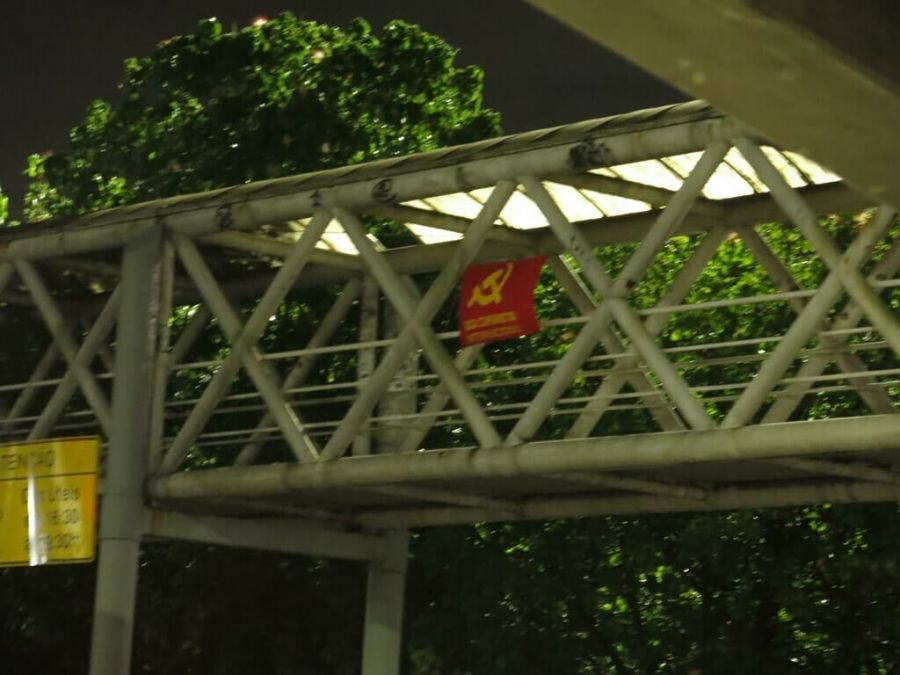

Bandeira içada em passarela em São Cristóvão, Rio de Janeiro (RJ). Foto: Banco
de Dados AND

Bandeira içada no Passeio Público, centro do RIo de Janeiro (RJ). Foto: Banco
de Dados AND

Bandeira içada no Passeio Público, centro do RIo de Janeiro (RJ). Foto: Banco
de Dados AND

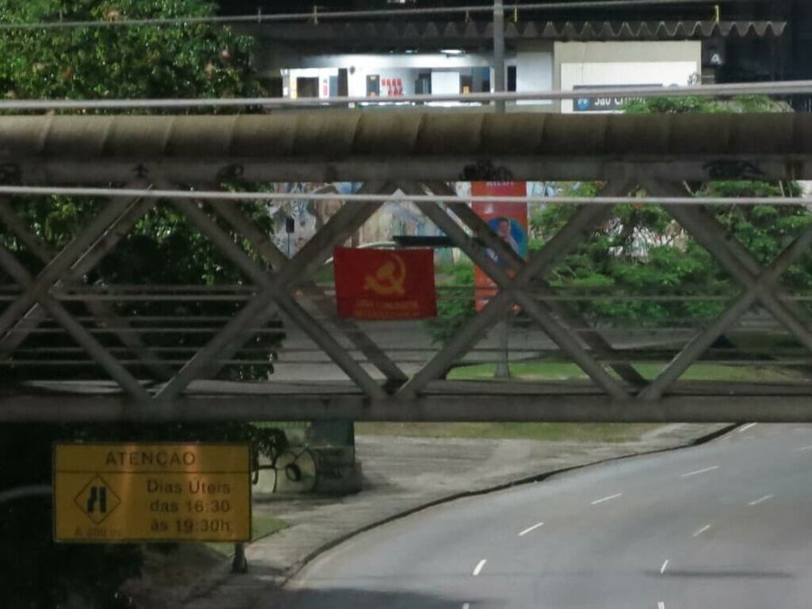

Bandeira içada na Passarela Radial Oeste, no RIo de Janeiro (RJ). Foto: Banco
de Dados AND

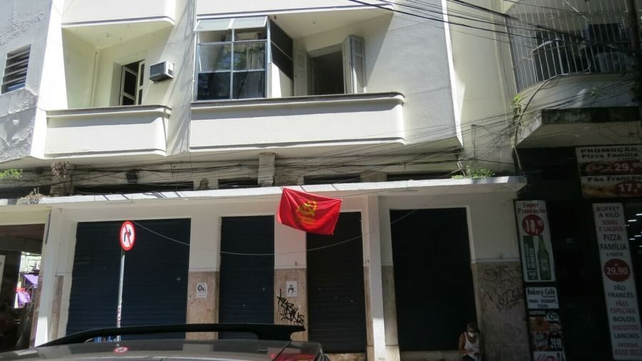

Bandeira içada na Lapa, centro do RIo de Janeiro (RJ). Foto: Banco de Dados
AND

Bandeira içada na Cinelândia, centro do RIo de Janeiro (RJ). Foto: Banco de
Dados AND

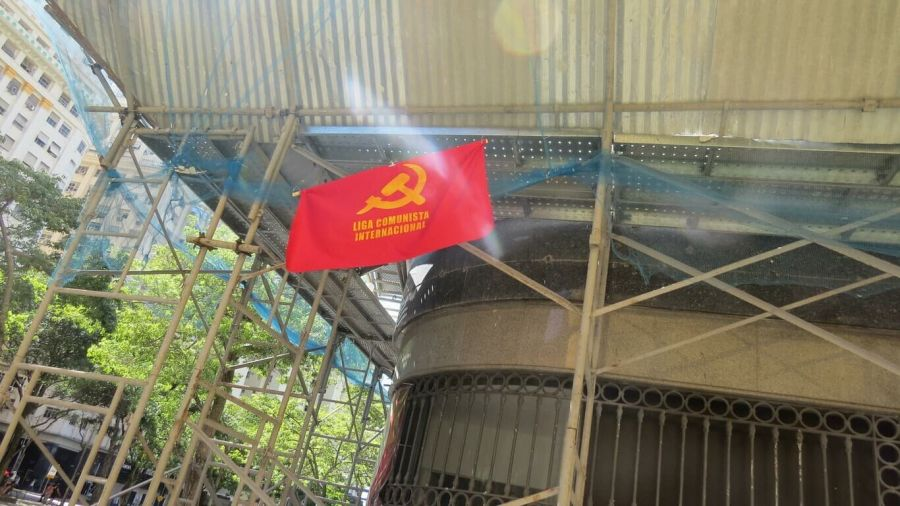

Bandeira içada na Cinelândia, centro do RIo de Janeiro (RJ). Foto: Banco de
Dados AND

Pichação encontrada na Estação de Metro Thomáz Coelho na entrada da Favela do
Juramento, no Rio de Janeiro (RJ). Foto: Banco de Dados AND

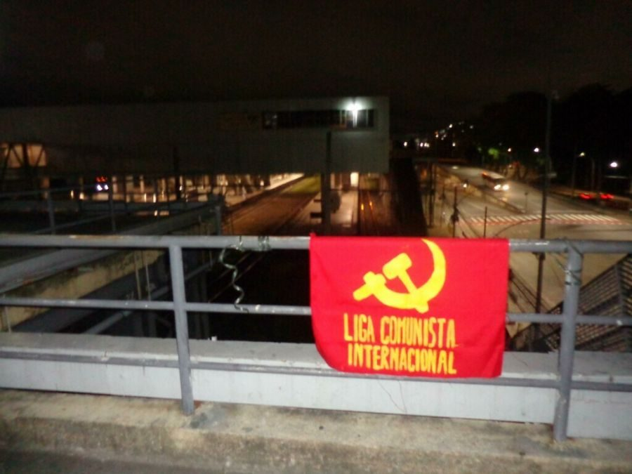

Bandeira da Liga Comunista Internacional na zona norte do Rio de Janeiro.
Foto: Banco de Dados AND

Bandeira da Liga Comunista Internacional no Rio de Janeiro. Foto: Banco de
Dados AND

Bandeira da Liga Comunista Internacional em posto do Metrô da São Francisco
Xavier. Foto: Banco de Dados AND

Bandeira içada na Favela do Jacarezinho, no Rio de Janeiro. Foto: Banco de
dados AND

Bandeira na passarela 13 na AV. Brasil. Foto: Banco de dados AND

Bandeira na Passarela 12 da Avenida Brasil, na capital. Foto: Banco de dados
AND

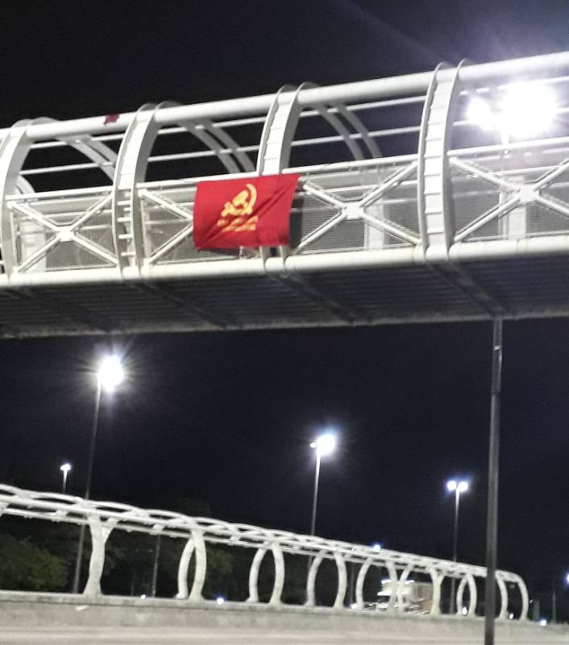

Bandeira na passarela 14 da Avenida Brasil. Foto: Banco de dados AND

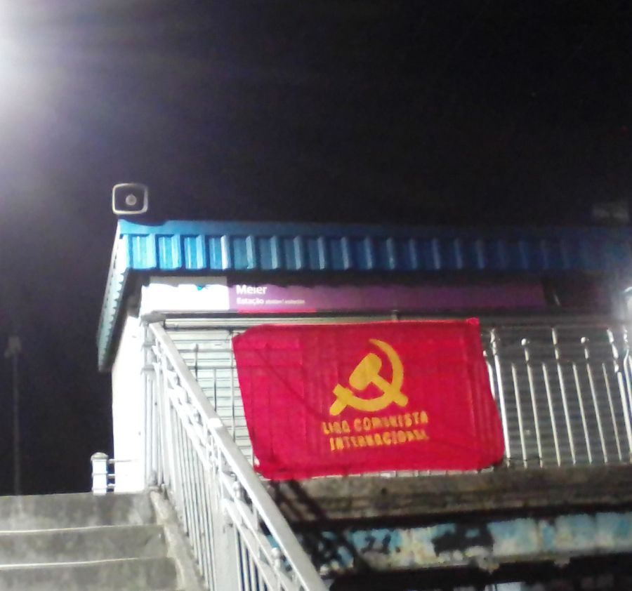

Bandeira içada na Estação do Meier, na Capital. Foto: Banco de dados AND

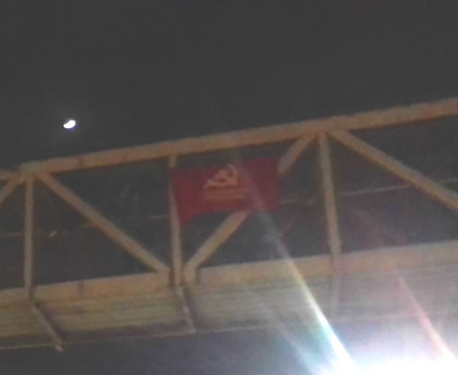

Estação Nova América, na Capital do estado. Foto: Banco de dados AND

Estação de metro Maria da Graça, na Capital do estado. Foto: Banco de Dados
AND

Bandeira na passarela do trem do bairro de Olaria, na Capital. Foto: Banco de
dados AND

Quadra do CEFET de Maria da Graça, na Capital. Foto: Banco de dados AND

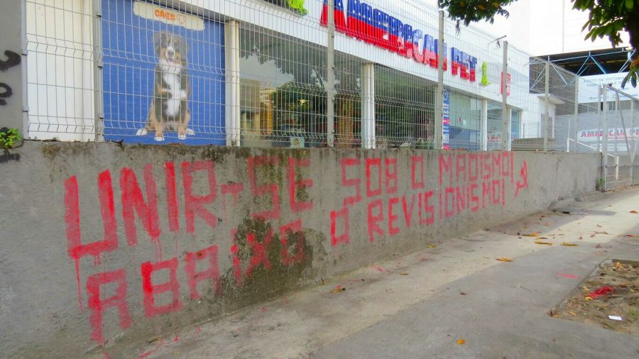

Pichação na rua João Paulo Primeiro, Estácio, Rio de Janeiro. Foto: Banco de
Dados AND

Pichação em viaduto próximo ao viaduto Paulo de Frontin, que liga zonas norte
e sul do Rio de Janeiro. Foto: Banco de Dados AND

SANTA CATARINA

Bandeiras com a foice e martelo junto da inscrição "Liga Comunista
Internacional" na passarela do terminal Rita Maria, no centro de
Florianópolis. Foto: Banco de Dados AND

Bandeiras com a foice e martelo junto da inscrição "Liga Comunista
Internacional" na passarela do terminal Rita Maria, no centro de
Florianópolis. Foto: Banco de Dados AND

****

****RIO GRANDE DO SUL

Bandeiras içadas na Universidade Federal do Rio Grande do Sul, no centro de
Porto Alegre (RS). Foto: Banco de Dados AND

Bandeira içada na Zona Sul de Porto Alegre (RS). Foto: Banco de Dados AND

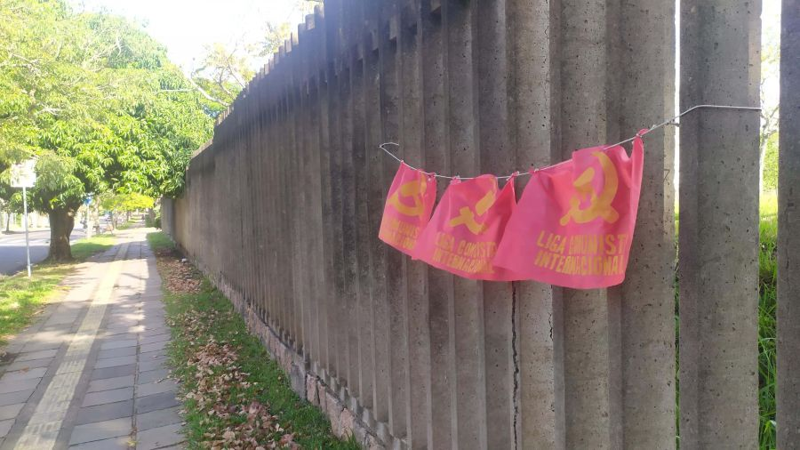

Bandeiras içadas na Universidade Federal do Rio Grande do Sul (UFRGS), na Zona
Leste de Porto Alegre (RS). Foto: Banco de Dados AND

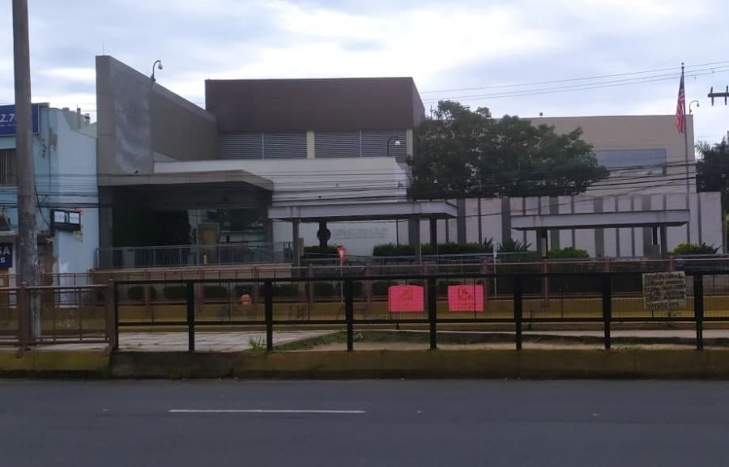

Bandeiras içadas em Porto Alegre (RS). Foto: Banco de Dados AND

MATO GROSSO DO SUL

Bandeira da LCI içada em Dourados (MS). Foto: Banco de Dados AND

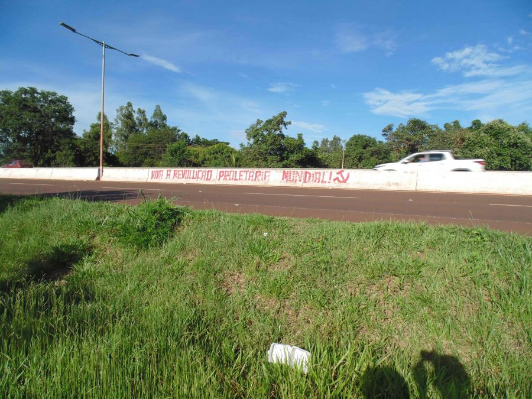

Pichação em Dourados (MS). Foto: Banco de Dados AND

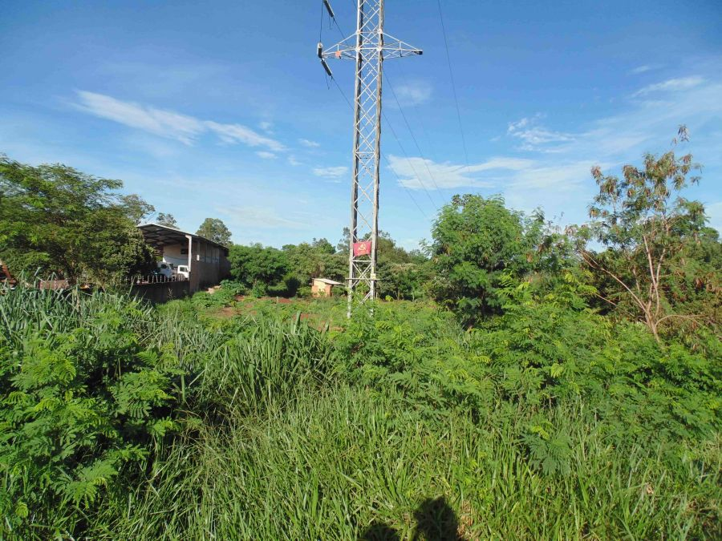

Bandeira da LCI içada em Dourados (MS). Foto: Banco de Dados AND

Bandeiras da LCI içadas em Dourados (MS). Foto: Banco de Dados AND

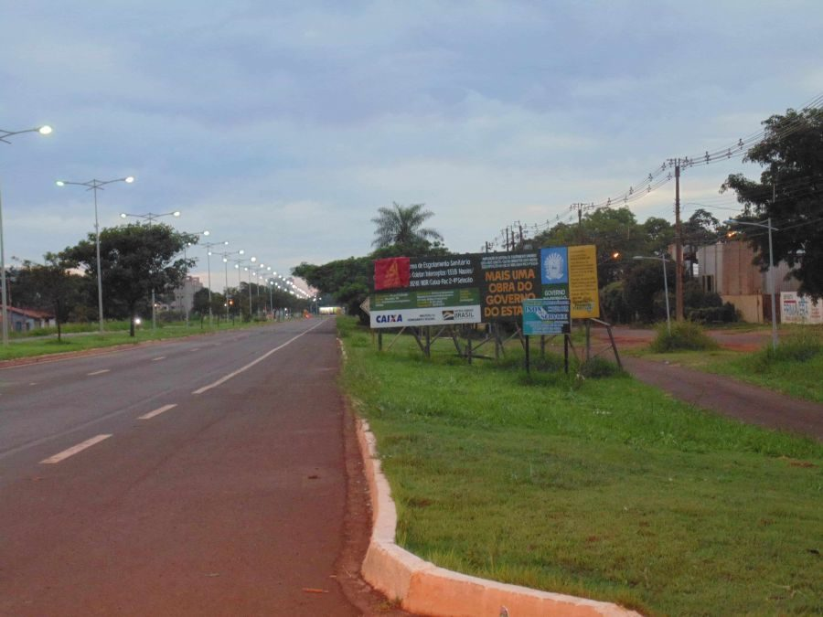

Bandeira da LCI içada em Dourados (MS). Foto: Banco de Dados AND

Bandeira da LCI içada em Dourados (MS). Foto: Banco de Dados AND

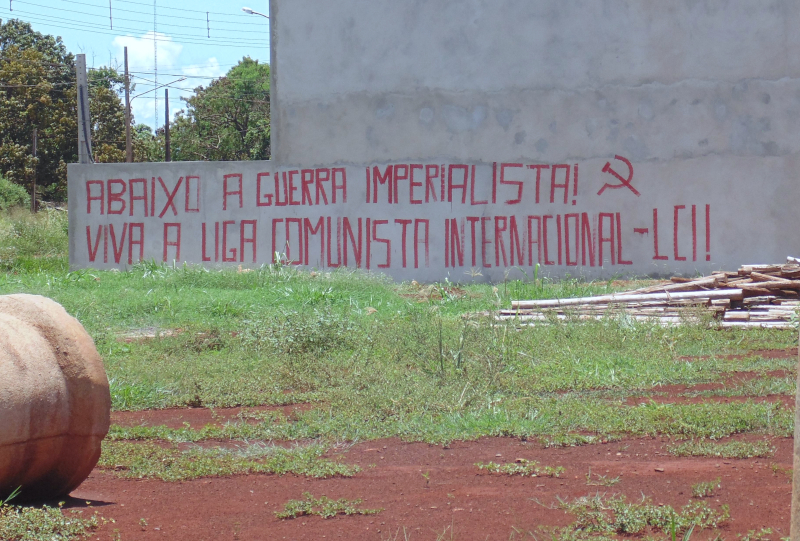

Pichação em Dourados, Mato Grosso do Sul. Foto: Banco de Dados AND

Pichação em Dourados, Mato Grosso do Sul. Foto: Banco de Dados AND

****

**Amazonas**

Bandeiras colocadas na Universidade Federal do Amazonas. Foto: Banco de dados
AND

Pichação encontrada em Manaus, capital do estado. Foto: Banco de dados AND

Bandeiras na Universidade Estadual do Amazonas. Foto: Banco de dados AND

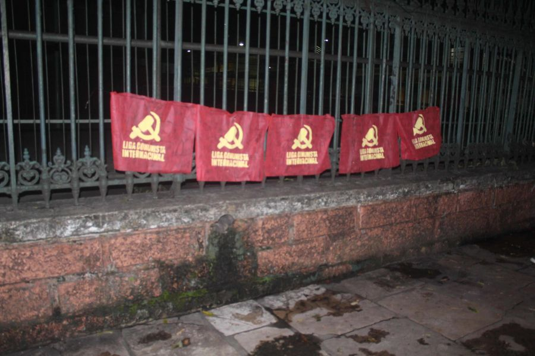

Bandeiras no Colégio Pedro II, em Manaus. Foto: Banco de dados AND

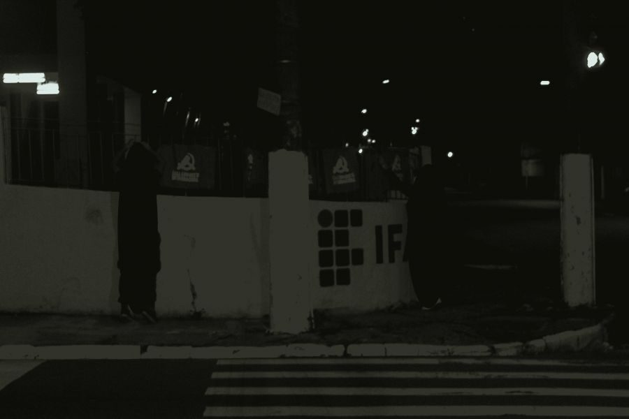

Bandeiras no Instituto Federal do Amazonas em Manaus. Foto: Banco de dados AND

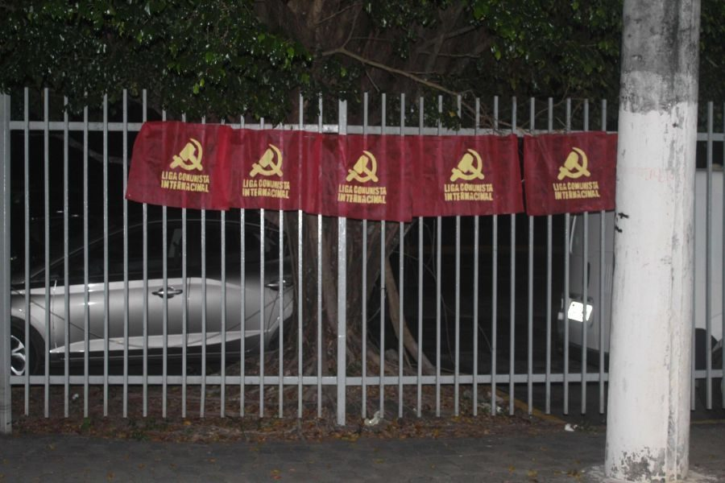

Bandeiras no mercado Carrefour da Av. Djalma Batista em Manaus. Foto: Banco de
dados AND

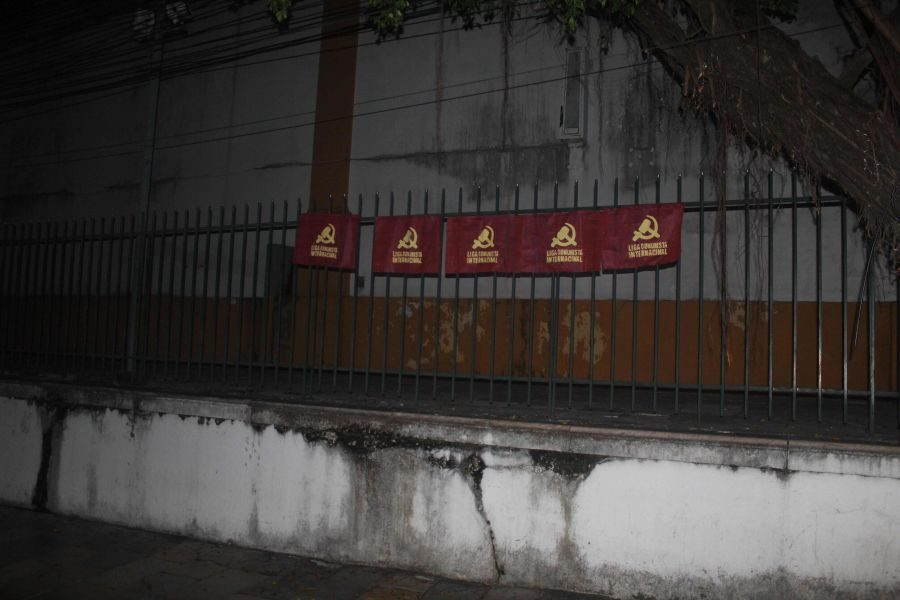

Bandeiras na Praça da Matriz em Manaus. Foto: Banco de dados AND

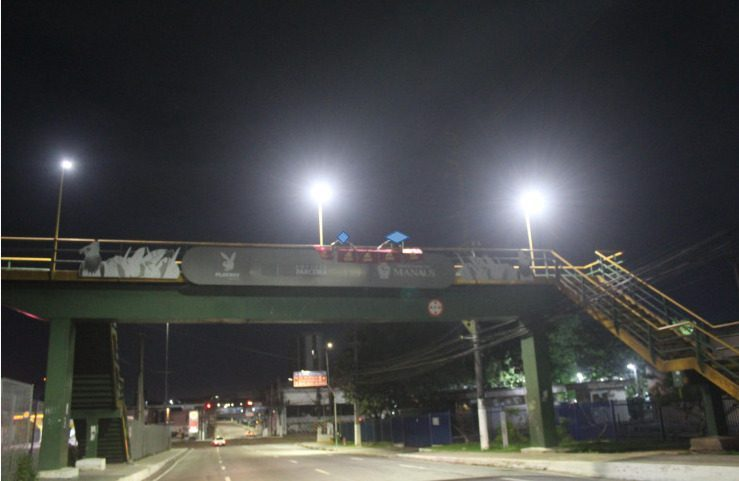

Bandeiras no Estádio Arena da Amazônia. Foto: Banco de dados AND

**GoiÁS**

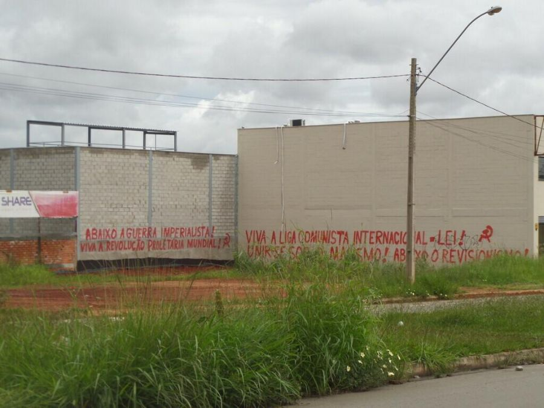

Pichação encontrada na cidade de Goiânia, em Goiás. Foto: Reprodução/ CI-IC

****

Source: [https://anovademocracia.com.br/noticias/18567-acoes-celebram-fundacao-da-lci-no-brasil](https://anovademocracia.com.br/noticias/18567-acoes-celebram-fundacao-da-lci-no-brasil)

<!--NEWS-->

# BRASIL: DENUNCIA URGENTE: PM executa chacina contra camponeses em Nova Mutum/RO (CEBRASPO)

Author: dazibao rojo

Description: O CEBRASPO divulga nota da ABRAPO sobre recentes assassinatos e torturas de
Camponeses pela polícia militar de Rondônia, que faz a seg...

Time: 2023-01-31T10:46:00+01:00

Images: ['[16750064344332_1destaque1.jpg](https://anovademocracia.com.br/modules/mod_news_pro_gk5/cache/16750064344332_1destaque1.jpg)']

<!--METADATA-->

###  

O CEBRASPO divulga nota da ABRAPO sobre recentes assassinatos e torturas de
Camponeses pela polícia militar de Rondônia, que faz a segurança do grileiro
de terras públicas "Galo Velho" com os recursos dos impostos que a população
paga.

Nós nos solidarizamos com as famílias e companheiros desses Camponeses e
defendemos o direito sagrado à terra para quem nela trabalha, especialmente
nesse momento em que a fome e o desemprego assolam o país. Entendemos e
apoiamos todos aqueles que querem viver uma vida digna através de seu
trabalho. As terras públicas no Brasil tem como destino constitucional a
reforma agrária e não os interesses privados de grileiros, estes sim, ladrões
de terras públicas. Repudiamos esses massacres contra o povo pobre do campo e
as tentativas de criminalização.

  

 **LCP DENUNCIA ASSASSINATO DE CAMPONESES EM NOVA MUTUM PARANÁ**  
  
A ABRAPO recebeu o comunicado da Liga dos Camponeses Pobres desmentindo as
alegações de tiroteio entre a LCP e as forças policiais durante operação de
reintegração de posse, e denunciando que foram realizadas torturas e execuções
sumárias de camponeses.  
  
Além disso, denuncia a covarde matéria da Rede Globo, a qual incitou a
repressão, evitou mencionar a LCP e acusou os camponeses de "possíveis
criminosos".  
Enquanto isso, omitiu que a região faz parte de uma das diversas áreas
griladas pelo latifundiário Antônio Martins dos Santos, conhecido como Galo
Velho, investigado pelas polícias civil e federal, em conjunto com o
Ministério Público, pelo financiamento de pistoleiros na região para a
grilagem de terra e expulsão de camponeses.  
  
Importante que todos os democratas se mobilizem para desmascarar os algozes do
povo e desmontar mais essa farsa, pela divulgação da denúncia realizada da
LCP!

Postado por [CEBRASPO ](https://www.blogger.com/profile/12198195616986210100
"author profile")

Source: [http://dazibaorojo08.blogspot.com/2023/01/brasil-denuncia-urgente-pm-executa.html](http://dazibaorojo08.blogspot.com/2023/01/brasil-denuncia-urgente-pm-executa.html)

<!--NEWS-->

# Da Mirafiori: la voce e la forte denuncia delle operaie. Il Mfpr e le lavoratrici Slai cobas sc preparano a Mirafiori una iniziativa nella settimana dell'8 marzo

Author: fannyhill

Description: Il 24 gennaio siamo intervenute a Mirafiori con lo Slai cobas per il sindacato
di classe. Abbiamo parlato con tante operaie. Le operaie rac...

Time: 2023-01-31T10:53:00+01:00

Images: ['[fiat.jpg](https://blogger.googleusercontent.com/img/b/R29vZ2xl/AVvXsEiYTMIJTtyCVUPd65lq9bzFTwfeybfD5JYp-emjf5FSOw61hNQVVzhMp_rigcIlLbcogDmWJpRkD8h8FsfFEmbTvj3Apf3zgDsQuOkjED68w2wnWWs2Za2qYxrmXknrH5OJHX5GbCMIdgWIUN0kJtxNcEMKeZTCFfPdCxoZcwWJOvY7o19VoPkkyecvNg/s320/fiat.jpg)']

<!--METADATA-->

  

Il 24 gennaio siamo intervenute a Mirafiori con lo Slai cobas per il sindacato
di classe.

Abbiamo parlato con tante operaie.

Le operaie raccontano di una situazione in fabbrica molto seria, ma sono
d'accordo che senza la lotta delle operaie e operai non ci possono essere
risultati, ma che c'è paura, individualismo, si pensa che 'non c'è più niente
da fare'; "Il problema di fondo, sai, è la paura, non si fa più lo sciopero.
Se qua dentro facciamo gli scioperi, ne paghi le conseguenze. Vieni messa a
fare i lavori peggiori, a parte che di belli qua dentro non c'è né, però
bisogna ribellarsi tutti quanti assieme... fuori da qua abbiamo una vita, una
casa".

Altre operaie confermano: "Si' sempre di più, lavoro da 30 anni, arrivo da
Grugliasco che hanno chiuso, mi sono rovinata la schiena in linea, non tengono
in considerazione le problematiche, ma a fine mese devi pagare l'affitto...";
"dopo 30 anni di lavoro non hai nemmeno la sanità che ti cura. Se non hai i
soldi fai in tempo a morire..."; "non mandano noi in pensione e dentro i
giovani, ho 30 anni di lavoro ma non ho mai lavorato come adesso, sulla linea
di montaggio", "...non è che siamo poi così giovani da poter stare sulle linee
di montaggio; io guido il carrello, scarico camion dalla mattina alla sera, a
56 anni penso di aver già dato"; "Troppo lavoro, troppo carichi di lavoro,
prima 10 pezzi, ora 15. Ma ci sono tanti operai a casa! Se dividessero il
lavoro sarebbe meglio, tutto il carico a noi, moriremo prima"; "Ritmi più alti
si', ma anche carichi mirati per obbligarti ad accettare le dimissioni"; "io
lavoro tre giorni la settimana, ma non ce la faccio più. Io vedo che altri in
altre fabbriche stanno peggio di noi, ritmi di lavoro, alla Amazon,
Pirkinton... Arrivati ad una certa età bisogna rallentare. Dobbiamo uscire da
qui. "Sinistra" e destra ci hanno ridotto in questo stato...".

A loro diciamo: Dobbiamo mettere tutte le nostre energie per costruire
un'alternativa, non siamo qui a dire agli operai fate, ma a lavorare assieme
per costruire la via d'uscita.

Parliamo di preparare un'assemblea per unire le operaie che non ci stanno a
questa vita, ma la dobbiamo costruire assieme. Le operaie non c'è la fanno più
per come si lavora in fabbrica, ma lamentarsi o protestare una per una non va,
lavoriamo assieme per una assemblea delle operaie nella settimana dell'8
marzo.

Altre operaie rafforzano la denuncia delle condizioni in fabbrica e di come si
viene trattate: "É uno schifo, ho la bambina di 7 anni non mi danno neanche i
giorni, mi fanno le proposte: se mi vieni un sabato o due io ti vengo
incontro. Loro vogliono che io vada per 18 sabati obbligatori, fino a
settembre… Incontro? Io ho la bambina di 7 anni e devo lavorare, io un giorno
vengo qua e la bambina la lascio al gabbiotto e entro a lavorare! E' giusto?"

Rispondiamo: "Come ti trattano no, fai bene a ribellarti, ma è giusto che la
protesta tu la faccia da sola? E le altre operaie? Perché non lo fate assieme,
e la tua bambina diventa la nostra lotta? Ci sono le possibilità se le
cerchiamo... dobbiamo ribaltare questa situazione, perché anche ad ubbidire
non ti salvi lo stesso, ritmi e carichi mirati, è una fabbrica che ti
schiaccia". Lei riflette sulla dimensione collettiva della protesta "Si è
vero, si può fare, e per l'assemblea parlo con le colleghe in reparto".

Altre voci sulla lotta: "Io sono arrivata da Rivalta, ho fatto uno sciopero,
erano li tutti che piangevano, sono uscita da sola... si andava fuori a fare i
cortei ma non è cambiato nulla"; "Nessuno è più disposto a fare sciopero, o se
ne fai uno poi non vanno più avanti, le bollette sono aumentate, le persone
qui dentro non sono disposte a perdere dei soldi. Io ne ho viste di lotte ma
non è cambiato nulla. Grugliasco, Rivalta, Maserati… hanno chiuso"; "ma le
pensioni, sanità le hanno portate gli operai con la lotta…".

In generale le operaie, più degli operai, avevano voglia di parlare, e alcune
sono stati nettamente critici verso i sindacati confederali, i delegati "che
se ne stanno la' seduti a non fare niente" rispetto a quello che succede in
fabbrica; "noi abbiamo già detto ai sindacati dentro i nostri problemi, ma più
di tanto non possono fare.

Ma non basta fare solo l'elenco delle disgrazie, prima quando gli operai
avevano nelle loro mani la lotta, il movimento operaio riempiva questi viali,
dobbiamo riprovarci. La forza degli operai è quando si organizzano per i
propri interessi. Per questo dobbiamo costruire una assemblea autonoma per
unire, organizzare, dare prospettiva alle operaie e operai che nelle fabbriche
vogliono opporsi. Per questo abbiamo portato nei cartelli e nel volantino
l'indicazione della nuova  **Assemblea proletaria anticapitalista che si
terra' a Roma il 18 febbraio** , in cui organizzeremo per Mirafiori
l'iniziativa nella settimana dell'8 marzo.

Source: [https://femminismorivoluzionario.blogspot.com/2023/01/da-mirafiori-la-voce-e-la-forte.html](https://femminismorivoluzionario.blogspot.com/2023/01/da-mirafiori-la-voce-e-la-forte.html)

<!--NEWS-->

# SP: Moradores bloqueiam rodovia Presidente Dutra contra despejo

Author: Giovanna Maria

Time: 2023-01-31T13:52:28-03:00

Images: ['[dutra1.jpg](https://anovademocracia.com.br/images/dutra1.jpg)', '[dutra2.jpg](https://anovademocracia.com.br/images/dutra2.jpg)', '[dutra4.jpg](https://anovademocracia.com.br/images/dutra4.jpg)', '[dutra3.jpg](https://anovademocracia.com.br/images/dutra3.jpg)']

<!--METADATA-->

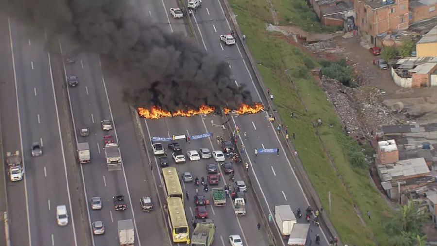

Moradores da comunidade do Sata bloqueiam a Presidente Dutra em Guarulhos
contra despejo. Foto: Reprodução/TV Globo

Moradores da comunidade do Sata, em Guarulhos (região metropolitana de São
Paulo), bloquearam com pneus em chamas a rodovia Presidente Dutra, que liga SP
ao Rio de Janeiro. A manifestação combativa se iniciou na manhã do dia 31 de
janeiro e durou cerca de duas horas. As massas protestavam contra uma ação de
despejo movida pela prefeitura que ameaça destruir os lares de pelo menos 33
famílias, e carregavam faixas afirmando que ali residiam há mais de 40 anos.

A prefeitura busca promover desde dezembro do ano passado o despejo das
famílias, alegando que a área corre risco de enchentes. Oferece, em troca, um
aluguel social de míseros R$ 400 reais, ignorando o fato de o aluguel da
cidade de Guarulhos ser o mais caro entre as cidades da região metropolitana
de São Paulo, de acordo com pesquisa do ZAP Imóveis. Os moradores realizaram
pelo menos três bloqueios da rodovia desde então.

Moradores da comunidade do Sata bloqueiam a Presidente Dutra em Guarulhos
contra despejo. Foto: Reprodução/TV Globo

**Prefeituras lançam milhares de famílias nas ruas**

Prefeituras da região metropolitana de São Paulo têm despejado milhares de
famílias nos últimos anos, deixando-as sem ter onde viver. Mesmo durante a lei
de suspensão de despejos durante a pandemia da Covid-19, que vigorou até
outubro de 2022, o judiciário do estado de São Paulo era o responsável por
mais da metade das das reclamações ajuizadas por descumprimento da decisão.

Em maio de 2022, a prefeitura de Carapicuíba promoveu o despejo de pelo menos
700 moradores da comunidade Vila Municipal. As massas lutaram combativamente
pela garantia de sua moradia, promovendo bloqueios com pneus em chamas e
enfrentando a covardia das forças de repressão com pedras e paus.

#### [Leia também: SP: Moradores resistem contra despejo em
Carapicuíba](https://anovademocracia.com.br/noticias/17524-sp-moradores-resistem-contra-despejo-em-
carapicuiba)

No mês de agosto, uma reintegração de posse na zona leste de São Paulo deixou
dezenas de moradores feridos por disparos de balas de borracha e bombas de gás
lacrimogêneo, entre eles mulheres grávidas e um bebê recém nascido. Em
novembro, cerca de 100 famílias da Comunidade Maracanã em Santo André
protestaram contra a reintegração de posse da comunidade e atearam fogo a dois
ônibus.

Enquanto isso, de 2019 até 2022, mais de 10 mil pessoas passaram a viver nas
ruas do estado de São Paulo, segundo levantamento da Universidade Federal de
Minas Gerais (UFMG).

Moradores da comunidade do Sata bloqueiam a Presidente Dutra em Guarulhos
contra despejo. Foto: Reprodução/TV Globo

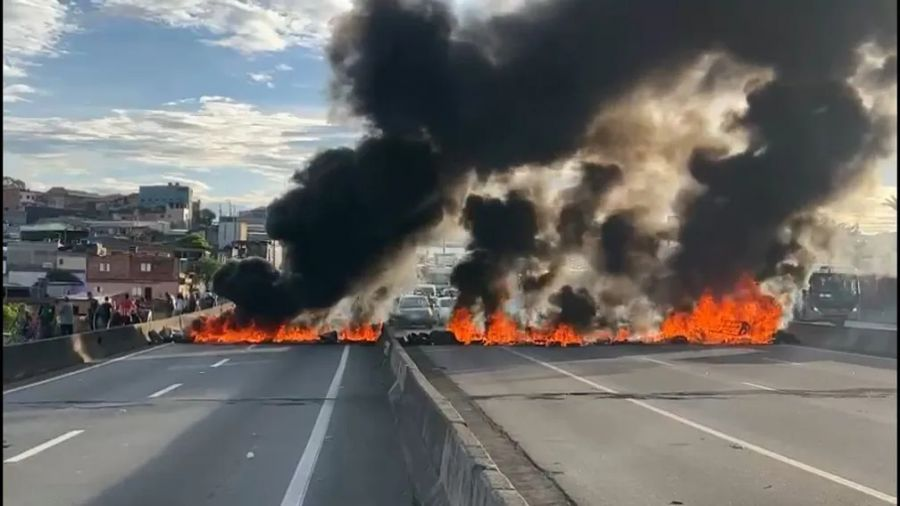

Moradores da comunidade do Sata bloqueiam a Presidente Dutra em Guarulhos
contra despejo. Foto: Reprodução/TV Globo

Source: [https://anovademocracia.com.br/noticias/18632-sp-moradores-bloqueiam-rodovia-presidente-dutra-contra-despejo](https://anovademocracia.com.br/noticias/18632-sp-moradores-bloqueiam-rodovia-presidente-dutra-contra-despejo)

<!--NEWS-->

# Antologia A luta pela terra: Seleção de textos finalistas do I Concurso Literário do AND

Author: Redação de AND

Time: 2023-01-31T14:34:15-03:00

Images: ['[CAPA.jpg](https://anovademocracia.com.br/images/CAPA.jpg)']

<!--METADATA-->

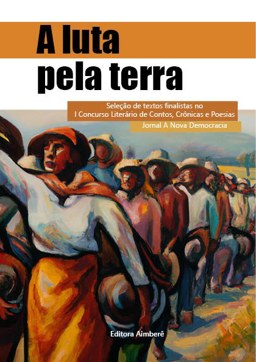

Capa da Antologia de textos finalistas do I Concurso Literário do jornal A
Nova Democracia

Já está disponível para _download_ o livro digital resultado da realização do
I Concurso Literário de Contos, Crônicas e Poesias organizado pelo jornal A
Nova Democracia.

O certame fez parte das celebrações do 20 anos de **AND** e concluiu-se em
dezembro de 2022 com a premiação em um grande evento realizado na cidade do
Rio de Janeiro.

#### **Leia mais:** [ AND conclui seu I Concurso Literário com grande
cerimônia de premiação ](https://anovademocracia.com.br/noticias/18493-and-conclui-seu-i-concurso-literario-
com-grande-cerimonia-de-premiacao)

Nesta antologia constam todas as obras finalistas nas categorias Contos,
Crônicas e Poesias, com destaque para os premiados e para uma menção honrosa
na categoria crônica.

O arquivo pode ser baixado [**aqui**](https://heyzine.com/flip-
book/7e3e4fe31a.html) e está disponível para amplo compartilhamento e
divulgação.

Source: [https://anovademocracia.com.br/noticias/18624-antologia-a-luta-pela-terra-selecao-de-textos-finalistas-do-i-concurso-literario-do-jornal-a-nova-democracia](https://anovademocracia.com.br/noticias/18624-antologia-a-luta-pela-terra-selecao-de-textos-finalistas-do-i-concurso-literario-do-jornal-a-nova-democracia)

<!--NEWS-->

# ESTUDIOS AGRARIOS BRASIL: Lucha Campesina » Policías matan a campesinos durante ataque a familias

Author: Verein der Neuen Demokratie

Description: Notícia completa traducida: Inicio » Lucha Campesina » Policías matan a
campesinos durante ataque a familias LUCHA CAMPESINA Policía ases...

Time: 2023-01-31T15:43:00+01:00

Images: ['[mandruva.jpg](https://i.ibb.co/5shms6M/mandruva.jpg)', '[esticado-nova.jpg](https://i.ibb.co/GvMY3dm/esticado-nova.jpg)', '[mail](https://ecp.yusercontent.com/mail)']

<!--METADATA-->

  **  Notícia completa traducida:**

 **Inicio » Lucha Campesina » Policías matan a campesinos durante ataque a
familias**

 **LUCHA CAMPESINA**

 **Policía asesina a campesinos durante ataque contra familias**

 **Escrito por LCP de Rondônia y Amazonía Occidental|Publicado el 30 de enero
de 2023**

 **Reproducimos a continuación una nota recibida de la Liga de Campesinos
Pobres de la Amazonía Occidental**

Companero Raniel Barbosa Laurindo, conocido como "Mandruvá"

[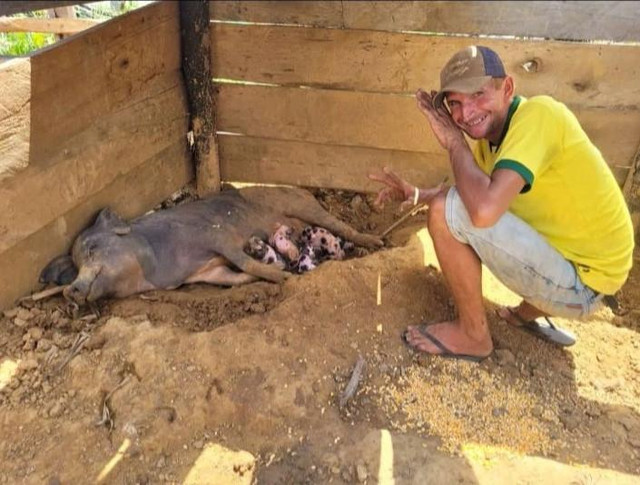](https://i.ibb.co/GvMY3dm/esticado-nova.jpg)Companero Rodrigo
Hawerroth, connocido como "Esticado"

 **  
**

 ****

 **Policía asesina a campesinos durante ataque contra familias**

El 28 de enero, en el distrito de Nova Mutum Paraná, zona rural de Porto
Velho, policías del Batallón de Operaciones Especiales (BOPE) asesinaron a dos
campesinos e hirieron gravemente a otro con disparos de fusil durante un
operativo arbitrario de la Policía Militar contra familias campesinas del Área
Tiago Campim dos Santos.

Hace algunos días, cientos de familias campesinas tomaron el resto de las
tierras de la hacienda Norbrasil, ubicada en tierras públicas propiedad de la
Unión, que fue tomada por el terrateniente Antônio Martins dos Santos,
conocido como Galo Velho, una famosa tierra ladrón, denunciado en numerosas
ocasiones, incluso recientemente detenido en el operativo "Lamassu" por acción
del propio Ministerio Público de la Federación. Galo Velho, además de grileiro
( se dice de quien mete titulos falsificados de tierras públicas a una gabeta
con grillos para que estos con sus escrecencias los hagan aparecer como
títulos antiguos), ladrón de tierras públicas pertenecientes a la Unión, es
asesino de campesinos, y es sabido que financia y mantiene una banda armada
integrada por policías, y que aún después de su arrestado por este motivo,
continúa actuando de la misma manera. Incluso el día 22, pistoleros de Galo
Velho en una camioneta negra dispararon contra familias, hombres, mujeres y
niños desarmados.

Para defender los privilegios e intereses ilegales de Galo Velho, la Policía
Militar del gobernador Coronel Marcos Rocha, el jefe de los terratenientes, el
28 de enero envió decenas de vehículos, drones y al menos tres batallones PM
para atacar a las familias que estaban en la zona luchando por el derecho al
trabajo de la tierra.

Una parte del contingente policial llegó a la BR 364, disparando armas y
tirando bombas a las familias. También había otros policías ubicados
subrepticiamente en diferentes puntos, detrás ya los costados del lugar donde
se concentraban las familias. Pistoleros del bandolero Galo Velho también
estaban emboscados, trabajando codo a codo con la PM, particularmente con la
policía del BOPE. Cuando las familias se alejaban de los disparos y efectos de
los gases de las bombas lanzadas por la policía, algunas de estas familias
cruzaron un río que corta el interior de la zona, y en ese momento fueron
sorprendidas por policías asesinos del BOPE. que disparó a tres campesinos.
Estos Compañeros fueron apresados ​​vivos, y los pobladores afirman que
estaban bien y hablando cuando los cobardes de la PM los apresaron, pero dos
de ellos fueron ejecutados en medio del camino.

Los Compañeros asesinados eran trabajadores, Rodrigo Hawerroth, conocido como
"Estucado", era un antiguo vecino, muy querido por todos. Y el compañero
Raniel Barbosa Laurindo, conocido como "Mandruvá", era un joven decidido que
buscaba conquistar su tierra para vivir dignamente.

No es la primera vez que el BOPE, esa banda de sicarios, bandidos uniformados,
mata campesinos en esta región. Actuando siempre de forma totalmente
arbitraria y sanguinaria, buscan en vano aterrorizar a las familias en un
intento de detener la lucha campesina por la tierra para servir a los
intereses de los terratenientes ladrones. Así asesinaron a los Companheiros
Amarildo, Amaral y Kevin en agosto de 2021, a los Companheiros Gedeon y
Rafael, en octubre de 2021, entre otros campesinos.

Y como siempre, para justificar sus crímenes y asesinatos a sangre fría, los
policías montan su farsa, cuentan sus cuentitos siempre diciendo que hubo un
enfrentamiento armado, intercambio de disparos, o algo así, y buscan calumniar
a sus víctimas como los peores criminales, y así justificar absurdamente la
práctica de las ejecuciones sumarias, que desde hace un tiempo se da en la
guerra injusta y reaccionaria que se libra contra los pobres de la ciudad y
del campo. Lo cierto es que, una vez más, asesinaron cobardemente a
campesinos, gente trabajadora, pobre y desarmada.

Los monopolios de la prensa y la prensa basura en Rondônia, como siempre,
cumplen su papel de voceros de la policía y de los terratenientes. Cuando no
callan, se limitan a repetir como papagayos los "comunicados" distribuidos a
la prensa por la policía, o peor aún, aumentan las mentiras para distorsionar
y ocultar la realidad. Ni siquiera se molestan en investigar de verdad,
comprobar información, escuchar distintas fuentes, etc., cuestiones básicas y
mínimas para cualquiera que pretenda hacer periodismo serio. ¡Pero eso sería
pedir demasiado de ti! Es mucho más fácil seguir en la comodidad de sus
redacciones, destilando odio contra los pobres, principalmente los campesinos
en lucha por la tierra, siempre tratados por ustedes como si fueran bandidos,
mientras encubren los crímenes de los verdaderos criminales, de ese
terrateniente sinvergüenza, de los políticos de varios tipos, del gobierno y
su policía, porque estos son los verdaderos patrones que patrocinan sus
fábricas de mentiras con dinero público. ¡Son mentirosos y cínicos! ¡Son
cómplices de los crímenes cometidos contra los campesinos!

¡Pero la sangre derramada de nuestros Compañeros no ahoga nuestra lucha!
Enrojece aún más nuestras banderas, aumenta nuestro odio, nuestra firmeza y
nuestra voluntad de luchar por un mundo verdaderamente justo. No penséis,
señores, que siempre podréis cometer vuestros crímenes con impunidad.

¡Honor y gloria eterna a los compañeros caídos en la Lucha por la Tierra!

¡Castigo a los ejecutores y mandatarios de los asesinatos de luchadores
populares!

¡Fuera de nuestras Áreas, policías Guaxeba de los latifundistas,  ladrones de
tierras de la Unión!

¡Las tierras del Área Tiago Campim dos Santos pertenecen al pueblo!

¡Conquista la tierra! ¡Destruir el latifundio!

¡Viva la Revolución Agraria!

29 de enero de 2023

LCP - Liga de Campesinos Pobres de la Amazonía Occidental

  

LUTA CAMPONESA  
  
[Polícia assassina camponeses durante ataque contra
famílias](https://resistenciacamponesa.com/luta-camponesa/policia-assassina-
camponeses-durante-ataque-contra-familias/)  
  
 **Escrito por LCP de Rondônia e Amazônia Ocidental|Publicado 30 de janeiro de
2023  
  
Reproduzimos abaixo nota recebida da Liga dos Camponeses Pobres da Amazônia
Ocidental  
  
  
  
Polícia assassina camponeses durante ataque contra famílias**  
  
No dia 28 de janeiro, na região do distrito de Nova Mutum Paraná, área rural
de Porto Velho, policiais do Batalhão de Operações Especiais (BOPE)
assassinaram dois camponeses e feriram outro gravemente com tiros de fuzil
durante operação arbitrária da PM contra as famílias camponesas da Área Tiago
Campim dos Santos.

  

Fonte.  **  Resistência Camponesa**

  

  

  

\--  

  

 ** _Notícias A_** ** _grárias - Brasil_**

 ** _Estudos, pesquisas e notícias_**

  

Source: [http://vnd-peru.blogspot.com/2023/01/estudios-agrarios-brasil-lucha.html](http://vnd-peru.blogspot.com/2023/01/estudios-agrarios-brasil-lucha.html)

<!--NEWS-->

# Folk har ikke råd til medicin

Author: socialistiskrevolution

Publish Time: 2023-01-31T15:45:34+00:00

Modified Time: 2023-01-31T15:46:08+00:00

Description: Inflationen er steget voldsomt i løbest af det sidste år, og dette påvirker især også folk, hvis’ liv og helbred afhænger af faste udgifter til medicin og behandling hver måned. Ikke nok med at pri…

Images: ['[th-521056444.jpeg](https://socialistiskrevolution.files.wordpress.com/2023/01/th-521056444.jpeg)']

Type: article

Categories: ['Uncategorized']

<!--METADATA-->

Inflationen er steget voldsomt i løbest af det sidste år, og dette påvirker
især også folk, hvis’ liv og helbred afhænger af faste udgifter til medicin og
behandling hver måned.

Ikke nok med at priserne på medicin for diverse sygdomme, behandling og
genoptræning hos professionelle terapeuter stiger, så stiger priserne på en
masse andre faste udgifter såsom husleje, varme, gas, mad, transport og gæld
for masserne, hvilket efterlader endnu færre penge til den stigende medicinen.

Dette leder til at flere tvinges til direkte at fravælge endda livsnødvendig
medicin, samtidig med at de sidder tilbage i kolde huse og lejligheder, med en
beskeden mængde mad, for at undgå total fallit i lyset af krisen.

Mange har faste udgifter på medicin og terapi på op til flere tusind kroner
hver måned, som de må betale ud fra egen lomme. Dette er en enorm byrde på
masserne i landet. Imens kan bourgeoisiet, hvor tusind kroner til eller fra
medicinudgifter om måneden ikke engang kan mærkes, fungerer systemet godt,
fordi de kan betale for medicinen uden problemer, springe foran i køen til
behandling ved at benytte private hospitaler og terapeuter.

Men dette karakteriserer et ulige sundhedssystem, der gang på gang svigter
især de dybeste og bredeste masser i landet.

Samtidig skærer den borgerlige stat gang på gang ned på sundhedsvæsenet, for
at skabe skattelettelser for bourgeoisiet og for at kaste flere penge efter
våben og imperialistisk aggression.

På samme tid lever vi i et land med nogle af de mest avancerede
produktivkræfter indenfor medicinalindustrien, med tonsvis af piller
produceret hver eneste dag. Samtidig holder pharmaselskaber, som Novo Nordisk,
kunstigt prisen på livsnødvendig medicin højt for masserne både i Danmark, men
især for masserne i de undertrykte nationer.

Livs- og helbredsnødvendig medicin er en folkeret, og udgifter til det skal
ikke trække masserne, som har brug for det, ned i elendighed. Det
imperialistiske bourgeoisi skal ikke have lov til at udnytte, at folk er
villige til at sætte deres liv på spil for at få råd til livsnødvendig
medicin, eller dør fordi de ikke har råd, for profit.

Alt dette afslører det borgerlige sundhedssystem, den borgerlige danske stat
og dens rolle. Det vil ikke hjælpe proletariatet at kræve »en nationalisering
af Novo Nordisk« fordi den nuværende gamle stat er udbytternes. Den er stadig
en udbytterstat og statsmonopolkapital er stadig lige så parasitisk og
udbyttende.

Novo
Nordisk, et danskejet imperialistisk selskab, holder bl.a. insulin, som er
nødvendigt for behandling af diabetes, dyrt for masserne i de undertrykte
nationer.

Vores rettigheder kan kun vindes gennem kamp, ikke ved at stemme og håbe og
vente på forandringer. Ingen ret, som arbejderklassen har er opnået uden kamp.

Kampen for vores rettigheder skal hærde os og tjene rekonstitueringen af DKP
under maoismen og dermed indledningen af Folkekrigen for erobringen af magten
i landet. Først da, ved en Socialistisk Revolution gennem Folkekrig og en ny
arbejderstat, kan et nyt sundhedsystem, der reelt tjener folket, blive skabt.

Advertisement

Source: [https://socialistiskrevolution.wordpress.com/2023/01/31/folk-har-ikke-rad-til-medicin/](https://socialistiskrevolution.wordpress.com/2023/01/31/folk-har-ikke-rad-til-medicin/)

<!--NEWS-->

# pc 31 gennaio &#8211; Licenziamenti annunciati per 472 lavoratori dell&#8217;industria degli occhiali Safilo

Author: prolcompal

Time: 2023-01-31T17:14:00+01:00

Images: ['[7194109_27092935_safilo_longarone.jpg](https://blogger.googleusercontent.com/img/b/R29vZ2xl/AVvXsEhMK79R-IjRH4kT6INKp7dOL7NF5KKYgJH_Sbzy3Y6wW5wFJv9Dmw9jhhkUtaH4hGc7eI1f5TRnvym18T8XCztqJe1ultD4TudcWM7FcBtXJylDgnuUN8tgDlhNHQ9VAcnGSlIl8OMuxq0eBN9-uVs48DISljUlakkbwGb_JN-PdabPcdjQ2YTwoSqrDw/w424-h233/7194109_27092935_safilo_longarone.jpg)']

<!--METADATA-->

Ai 206 tavoli di crisi presentati dalla Cisl con il suo primo "cruscotto sui
metalmeccanici" bisogna aggiungere quello che molto probabilmente si aprirà
per la Safilo, che ha comunicato "prima alla stampa che ai dipendenti che non
considera più strategico lo stabilimento di Longarone" e quindi i suoi 472
lavoratori, più i tanti dell'indotto.

Dopo aver assicurato in passato che "quel sito avrebbe dovuto diventare il
«gioiellino della produzione di occhiali in metallo»."

Stiamo parlando di una fabbrica nata sulle macerie di una disgrazia: "è stata
costruita coi soldi della ricostruzione del Vajont", ma arriva lo stesso la
comunicazione dei licenziamenti che ha fatto tanto arrabbiare la Cgil! "Nel
2019 l'ad dell'azienda ci aveva detto che, _grazie ai sacrifici imposti
allora,_ la sede di Longarone sarebbe rinata. Come può oggi venirci a dire che
sarà l'unica di quattro fabbriche a essere chiusa? Quella fabbrica è stata
costruita coi soldi della ricostruzione del Vajont».

Una fabbrica che ha i conti, e i profitti, a posto! 1 miliardo di ricavi nel
2022, in crescita dell'11,1% a cambi correnti e del 4,2% a cambi costanti
rispetto ai 969,6 milioni registrati nel 2021. Come riporta la stampa.

Il fatto è che la gigantesca ristrutturazione economica, messa in atto nel
mondo dai padroni, non conosce mezzi termini e continua imperterrita.

È la risposta degli operai a questo stillicidio che deve essere messa in campo
prima possibile!

Source: [https://proletaricomunisti.blogspot.com/2023/01/pc-31-gennaio-licenziamenti-annunciati.html](https://proletaricomunisti.blogspot.com/2023/01/pc-31-gennaio-licenziamenti-annunciati.html)

<!--NEWS-->

# Chacina em Nova Mutum/RO: Novas denúncias apontam para torturas e privação de direitos durante ataque da PM

Author: Gabriel Artur

Time: 2023-01-31T17:42:11-03:00

Images: ['[esticado-nova_11.jpg](https://anovademocracia.com.br/images/esticado-nova_11.jpg)', '[IMG-20230128-WA00560.jpg](https://anovademocracia.com.br/images/IMG-20230128-WA00560.jpg)', '[esticado-nova_21.jpg](https://anovademocracia.com.br/images/esticado-nova_21.jpg)', '[Screenshot_from_2023-01-31_17-14-5612.jpg](https://anovademocracia.com.br/images/Screenshot_from_2023-01-31_17-14-5612.jpg)', '[Screenshot_from_2023-01-31_17-12-5712.jpg](https://anovademocracia.com.br/images/Screenshot_from_2023-01-31_17-12-5712.jpg)', '[Screenshot_from_2023-01-31_17-16-0312.jpg](https://anovademocracia.com.br/images/Screenshot_from_2023-01-31_17-16-0312.jpg)', '[esticado132.jpg](https://anovademocracia.com.br/images/esticado132.jpg)', '[esticado21.jpg](https://anovademocracia.com.br/images/esticado21.jpg)', '[Screenshot_from_2023-01-31_17-11-50.jpg](https://anovademocracia.com.br/images/Screenshot_from_2023-01-31_17-11-50.jpg)', '[Screenshot_from_2023-01-31_17-10-5812.jpg](https://anovademocracia.com.br/images/Screenshot_from_2023-01-31_17-10-5812.jpg)', '[assassinados_112.jpg](https://anovademocracia.com.br/images/assassinados_112.jpg)']

<!--METADATA-->

Raniel Barbosa Laurindo (conhecido como “Mandruvá”) de 24 anos e Rodrigo
Hawerroth (conhecido como “Esticado”), de 34 anos, foram assassinados após
torturas pela PM de Rondônia. Foto: Banco de Dados AND

Na manhã do dia 28 de janeiro, em pleno sábado, o Batalhão de Operações
Especiais (Bope) da Polícia Militar (PM) de Rondônia assassinou dois
camponeses e levou terror a mais de 100 famílias (300 camponeses) em um novo
ataque aos camponeses do Acampamento Tiago Campin dos Santos, em Rôndonia. Em
31/01, a Associação Brasileira dos Advogados do Povo - Gabriel Pimenta
(Abrapo) [divulgou um
Relatório](https://drive.google.com/file/d/1mdOqfEU0y22iq_lFptbWfzUEUzYTFDtx/view?usp=share_link)
e a Liga dos Camponeses Pobres (LCP) da Amazônia Ocidental publicou [uma
nota](https://resistenciacamponesa.com/luta-camponesa/policia-assassina-
camponeses-durante-ataque-contra-familias/) sobre a chacina. Os dois
documentos dão conta da atuação covarde e terrorista neste que é o terceiro
ataque desde a ocupação em 2020.

A macabra chacina perpetrada pela PM assassina do governador coronel Marcos
Rocha ocorreu na área do Acampamento Tiago Campin dos Santos, localizado nas
Fazendas Arco-íris e Norbrasil. Segundo a Abrapo, o suposto dono daquelas
terras é a empresa Leme Emprendimentos, do latifundiário Antônio Martins.
“Galo Velho”, como é conhecido na região, é citado no "Livro Branco da
Grilagem de Terras” como um dos maiores grileiros do país, está sendo
investigado pelas polícias Civil e Federal, em conjunto com o Ministério
Público, pelo financiamento de pistoleiros na região para a grilagem de terra
e expulsão de camponeses.

Camponeses e advogados denunciaram crime contra o povo. Foto: Reprodução

O ataque brutal contra as famílias camponesas ocorreu durante uma operação de
reintegração de posse na sede da fazenda Norbrasil. Três batalhões da PM
deslocaram-se no dia 28/01 com dezenas de viaturas e drones. As tropas
militares reacionárias balearam três camponeses (dois morreram após torturas),
agrediram fisicamente centenas de camponeses e roubou os pertences individuais
dos camponeses. Marcos Rocha, governador do estado, é denunciado pela LCP por
se posicionar ao lado dos latifundiários grileiros de terra. O movimento
camponês afirma também que a operação foi para defender os “privilégios e
interesses ilegais do Galo Velho”.

**A OCUPAÇÃO DA SEDE DA FAZENDA NORBRASIL**

No mesmo local já havia ocorrido um ataque no dia 22 de janeiro. Segundo a
LCP, bandos militares de pistoleiros do Galo Velho foram até a área em uma
caminhonete preta e realizaram disparos em direção às famílias, homens,
mulheres e crianças desarmados.

No dia anterior, aproximadamente 100 famílias (cerca de 300 pessoas) ocuparam
a sede da fazenda Norbrasil, que fica na beira da BR-364. O interesse em
ocupar aquela parcela de terra era compartilhado não somente pelas 100
famílias, mas por todos do Acampamento Tiago Campin dos Santos pois a única
alternativa para se chegar às casas é dando uma volta de mais de 100 km. Além
disto, aquela parcela de terra é o principal ponto para escoar a produção
camponesa, pela proximidade com a rodovia federal.

Rodrigo Hawerroth trabalhando em sua criação. Foto: Reprodução

**INVASÃO POLICIAL: POLÍCIA COMETEU CHACINA E SÉRIE DE ILEGALIDADES**

Os policiais chegaram pela BR-364 atirando e lançando bombas de efeito moral e
gás lacrimogêneo. Outros grupos de policiais estavam em outros pontos, de
tocaia. Junto a estes também estavam pistoleiros que prestam serviço ao Galo
Velho, segundo as denúncias do movimento camponês e da Abrapo.

Os camponeses assassinados, Rodrigo Hawerroth (conhecido como “Esticado”), de
34 anos e Raniel Barbosa Laurindo (conhecido como “Mandruvá”) de 24, estavam
no grupo de camponeses que se afastou das bombas. O grupo decidiu atravessar o
Rio Cotia, fazendo a travessia de barco. Foi aí que foram rendidos pelos
policiais. Três camponeses foram baleados (além de Rodrigo e Raniel, Kenedy
também foi alvejado e levado para o hospital João Paulo II).

Crianças foram atingidas por balas de borracha e gás lacrimogêneo. Foto:
Reprodução

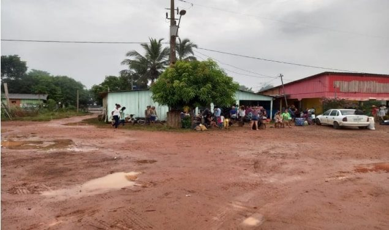

Famílias ficaram o dia inteiro sem alimentação debaixo de sol. Foto:
Reprodução

Caminhão transportando camponeses até a Vila Alípio de Freitas, no Acampamento
Tiago Campin dos Santos. Foto: Reprodução

Os três camponeses atingidos foram levados ainda com vida pelos policiais,
porém dois deles foram executados sumariamente após sofrerem severas torturas.
O Relatório da Abrapo aponta que “os camponeses rendidos foram torturados, as
marcas estão em seus corpos, tendo o Rodrigo apresentado hematomas no corpo e
rosto condinzentes com coronhadas de armas, corte na boca, olho furado e
língua cortada”. A Abrapo afirma que não há a certeza de que estas informações
constarão no laudo cadavérico (documento que é de responsabilidade da
Segurança Pública do governo do estado de Rondônia).

Após este ataque, os policiais iniciaram um cerco às famílias acampadas no
Barracão das Máquinas, na sede da fazenda. As famílias presentes tentaram
voltar em direção ao rio, mas foram impedidas pelos militares reacionários. Os
camponeses resistiram, gritando que haviam mulheres, inclusive grávidas, e
crianças no local, o que foi ignorado pela PM, que prontamente começou “a
atirar bala de borracha, jogar bomba de efeito moral, onde crianças foram
atingidas e apresentaram reação de sufocamento”, denuncia o Relatório.

Os camponeses afirmam que os policiais estavam todos sem identificação nos
uniformes e eram acompanhados por pistoleiros da fazenda. O responsável pelas
tropas (tenente-coronel Pontes) insultou os camponeses de criminosos e os
militares reacionários afirmaram que a orientação era de “matar todo mundo”.
As famílias resistiram à tentativa de jogá-los em um ônibus sem informar do
destino e foram novamente agredidas. Bombas de efeito moral foram lançadas e
as famílias recuaram, desta vez para a margem da BR-364 (na frente da
fazenda). E ficaram ali no sol escaldante, sem acesso a água ou alimentos. Um
camponês foi encaminhado ao mesmo hospital pois teve ataque cardíaco. Muitos
ficaram feridos por balas de borracha e sufocados pelo gás lacrimogêneo.
Mulheres desmaiaram e crianças ficaram sem alimentação.

Rodrigo Hawerroth durante atividade coletiva Foto: Reprodução

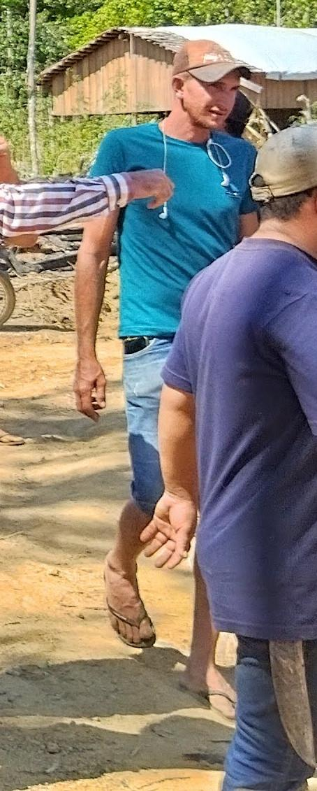

Rodrigo Hawerroth durante atividade coletiva. Foto: Reprodução

Somente alguns camponeses conseguiram permissão para retirar uma bolsa de
roupa de dentro do barracão. O restante das roupas, comidas, freezer com
alimentos, botijões de gás, celulares, colchões, remédios e demais pertences
pessoais não foram autorizados. A maior parte dos objetos dos camponeses
ficaram nos barracões, que foram todos destruídos pelos policiais. Os
camponeses denunciaram aos advogados que viram os militares reacionários
roubando seus pertences (celulares e dinheiro). Além disso, os policiais
também envenenaram cães e contaminaram poços de água, além de fotografarem os
camponeses que estavam no local.

A fim de intimidar os camponeses, a polícia passou com os corpos dos
camponeses assassinados à mostra nos carros. Também com o mesmo objetivo,
alguns camponeses foram levados para a sede da fazenda e ameaçados e
agredidos. As famílias que ficaram na beira da estrada também foram fustigadas
pela PM e pistoleiros que ficaram no local fazendo rondas ostensivas. Alguns
camponeses foram fichados e assinaram um termo circunstancial criminal e vão
responder por desobediência no Juizado Especial Criminal (JEC).

No fim da tarde do dia 29/01, as famílias deixaram o local e foram para a Vila
Alípio de Freitas, localizada dentro do Acampamento Tiago Campin dos Santos.
De acordo com o relatório, os camponeses mostraram “muita indignação com as
execuções e a forma de agir da PM em proteção ao latifúndio.”.

Leia o [relatório da
Abrapo](https://drive.google.com/file/d/1mdOqfEU0y22iq_lFptbWfzUEUzYTFDtx/view?usp=share_link)
e a [nota da LCP](https://resistenciacamponesa.com/luta-camponesa/policia-
assassina-camponeses-durante-ataque-contra-familias/).

**ATENÇÃO: IMAGENS SENSÍVEIS**

****

**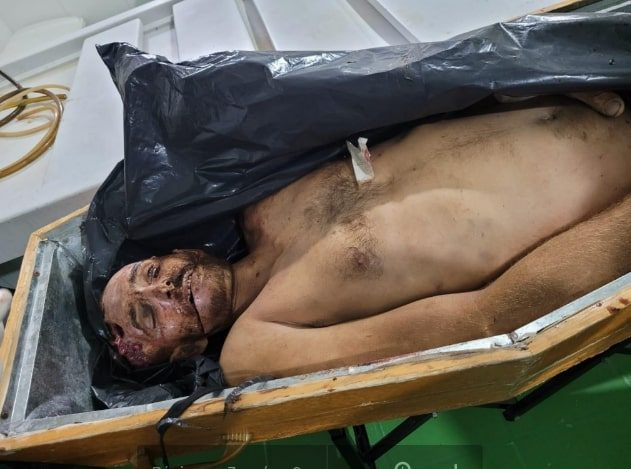**

Corpo de Rodrigo Hawerroth com marcas de torturas. Foto: Reprodução

****

Corpo de Rodrigo Hawerroth com marcas de torturas. Foto: Reprodução

****

****Marcas de tortura no corpo de Rodrigo e Raniel. Foto: Reprodução

Source: [https://anovademocracia.com.br/noticias/18634-chacina-em-nova-mutum-ro-novas-denuncias-apontam-para-torturas-e-privacao-de-direitos-durante-ataque-da-pm](https://anovademocracia.com.br/noticias/18634-chacina-em-nova-mutum-ro-novas-denuncias-apontam-para-torturas-e-privacao-de-direitos-durante-ataque-da-pm)

<!--NEWS-->

# pc 31 gennaio - Ancora sull'assemblea di Genova: le valutazioni dei compagni di proletari comunisti che vi hanno partecipato

Author: prolcomra

Time: 2023-01-31T18:51:00+01:00

Images: ['[Ass%20CALP%20GE.jpg](https://blogger.googleusercontent.com/img/b/R29vZ2xl/AVvXsEg5USj6YHZC6Th2YFjbzR4165K8a324sFTzSlojwXAW0jGhlpZ1ymc_O9BS4ZjrLotZI-jC2Zcky-6pDyWz7N_qoP-eBzWyhnXPUV0yEFxl2VwVNfaPfbo6bWz1w-MeVnpYFFE65fE-xhJyvwX9R6FwYBq-aDa2VcpWoQ2u946pY2SbFngdDxC1mdC2Ow/w228-h405/Ass%20CALP%20GE.jpg)']

<!--METADATA-->

L'opposizione alla guerra interimperialista esplosa in Ucraina comincia a fare
qualche passo in avanti nel nostro paese in termini di mobilitazioni sul piano
nazionale, in unità con le iniziative che si stanno svolgendo a livello
internazionale.

Questo passo in avanti è stato senz'altro l'assemblea del 28 gennaio contro la
guerra promossa dai lavoratori portuali del CALP di GE, molto partecipata, con
compagni provenienti dal sud (Taranto), dalla Sardegna, dal centro (Roma), dal
nord (Pisa, Livorno, Firenze, Padova, Bergamo). L'appello dei portuali per una
mobilitazione nazionale il 25 febbraio, ad un anno dall'inizio del conflitto
bellico imperialista in Ucraina, ha portato ad un dibattito e alle decisioni
su come iniziare e dare continuità all'opposizione alla guerra. E' stato
deciso una giornata di lotta nazionale, che a Genova ci sarà una
manifestazione con un corteo che punterà ad entrare nel Porto, e che la
mobilitazione sarà sostenuta dalla proclamazione dello sciopero nei porti
promosso dall'USB e che, chi non potrà venire a Genova, promuoverà iniziative
a livello locale in questa giornata.

Per noi, proletari comunisti che abbiamo partecipato e siamo intervenuti in
assemblea, l'iniziativa dei portuali del 25 rimette al centro la battaglia
giusta e centrale che vede i lavoratori protagonisti di questa mobilitazione
con l'azione diretta di contrasto alle navi (così come è stato fatta negli
aeroporti come a Pisa) che trasportano armi dirette nelle zone di guerra e con
lo sciopero che parte dai porti. Questo strumento di lotta è un'indicazione da
seguire anche per tutte le realtà sindacali, in opposizione ai confederali che
sono parte del fronte di conciliazione con le scelte di guerra dei governi,
ieri con Draghi e oggi con Meloni. Dobbiamo lavorare per questo, gli "scioperi
generali" dei sindacati di base sono stati assolutamente isolati e
controproducenti, autoreferenziali, che hanno portato persino alla spaccatura
del corteo del 3 dicembre a Roma.

Noi pensiamo che sia uno strumento di lotta utile da estendere nei luoghi di
lavoro la mozione operaia contro la guerra che, come sindacato Slai cobas psc,
è stata firmata dagli operai dell'Acciaierie Italia di Taranto, della
Fincantieri di Palermo, dalla Marcegaglia di Ravenna, della Dalmine di Bergamo
e che stiamo diffondendo in altre fabbriche che porta gli operai a schierarsi
nella lotta contro gli imperialisti in guerra e, per quello che riguarda gli
operai italiani, l'opposizione al nostro governo, al nostro imperialismo.

L'assemblea dei portuali di Genova ha avuto come dato positivo oltre alla
partecipazione anche l'attenzione verso i nostri interventi che hanno da un
lato portato il lavoro, piccolo ma concreto, con al centro le fabbriche e la
questione delle basi a Taranto.

Dall'altro ha chiarito la denuncia politica verso il governo, il nostro
imperialismo e il carattere della guerra antimperialista, cosa che, a causa
della composizione della sala e i numerosi interventi di area
retecomunisti/usB/cremaschi/UP/RC/Pap etc, non aveva messo al centro. Non
certo è di diversa natura il movimentismo/scadenzismo promosso dal collettivo
GKN e dall'area solidale di "convergere per insorgere" (CPA-FI) dove è
annacquata la direzione operaia di un movimento di classe.

Un aspetto negativo è stato la mancanza di realtà operaie a partire dall'Ilva
e che hanno fatto penare gli interventi, il criterio era che intervenivano
prima le realtà lontane, che solo dopo sollecitazione sono stati fatti ma
verso la fine.

In compenso alla fine un operaio del calp, antifascista, che era stato a bg
anche per FN, ci ha chiesto un parere su come era andata l'assemblea ed è
stata l'occasione per condividere la necessità di coinvolgere gli operai anche
delle altre fabbriche, ad esempio quelli dell'Ilva dove hanno contatti, e
dell'utile strumento della mozione per discutere sulle ragioni della guerra
inter imperialista. Non si può continuare ad avere attitudini egemoniche o di
bottega, io…io, ma ragionare da un punto di vista proletario e di classe: noi
come possiamo fare per smuovere le fabbriche e creare veramente una forza per
fare la guerra di classe.

Portare questa lotta all'interno della nostra assemblea proletaria
anticapitalista nazionale del 18 febbraio per valorizzarla nel verso giusto a
quello che serve per rafforzare la lotta politica contro il nostro
imperialismo, per la sconfitta del ns imperialismo.

L'assemblea del 28 a Genova ha anche il merito di portare avanti la
costruzione dell'unità del movimento di opposizione alla guerra, dai
lavoratori agli studenti, dagli antimperialisti agli antimilitaristi ai
pacifisti.

L'Appello del calp, pure con un'analisi del Governo che resta alla superficie,
ha il merito di avere messo al centro la necessità della mobilitazione contro
la guerra sul piano nazionale: come fai a boicottare la guerra dai territori
quando chi manda le armi è il governo e lo stato imperialista italiano?

Anche se la riduzione antimilitarista con la parola d'ordine "boicottiamo la
guerra", non vede il carattere dell'imperialismo, dell'azione specifica del
nostro imperialismo e del nostro governo, del rafforzare un processo in
direzione della dittatura del Capitale che va chiamato con il suo nome:
moderno fascismo, al servizio dei padroni, della borghesia imperialista
italiana. Non si tratta solo di effetti economici sulle masse ma gli effetti
politici reazionari verso la formazione di un regime: il fascismo porta
guerra, la guerra porta fascismo.

Non basta dire che il nemico è in casa nostra, senza vedere la natura di
classe, sociale, economica, politica, del governo Meloni come moderno
fascismo.

Le posizioni pacifiste e antimilitariste da sempre hanno anche il limite di
non vedere il legame con le lotte armate dirette dai comunisti maoisti, con le
rivolte popolari, che sono la sostanza dell'internazionalismo proletario.

L'Assemblea Proletaria Anticapitalista del 18 febbraio che abbiamo portato
all'interno dell'iniziativa dei Genova e a cui stiamo lavorando per una sua
riuscita in termini di partecipazione, vuole essere la proposta di lotta per
un passo in avanti nella formazione di un fronte unito contro governo,
padroni, guerra imperialista, combattendo nella linea giusta
dell'indissolubilità della lotta economica e politica.

Source: [https://proletaricomunisti.blogspot.com/2023/01/pc-31-gennaio-ancora-sullassemblea-di.html](https://proletaricomunisti.blogspot.com/2023/01/pc-31-gennaio-ancora-sullassemblea-di.html)

<!--NEWS-->

# Unidad contra el ajuste y en defensa de la soberanía

Author: carga

Time: 2023-01-31T99:00:00

Head Description: La rebelión del hermano pueblo peruano marca un camino para los pueblos de la región y el mundo. En Argentina, mientras las potencias imperialistas se disputan nuestros recursos naturales, crecen las luchas por las emergencias y en defensa de nuestra soberanía.

Description: 1. Viva la rebelión del pueblo peruano ¡Basta de represión! Sigue en las calles la rebelión del pueblo peruano y también crece la represión con más de 63 asesinados, miles de presos y heridos. Desde el PCR y su JCR y todos los movimientos de masas de los que participamos impulsamos en todo el país&hellip;

Images: ['[pintada-por-Perú-en-Quilmes-Berazategui-Varela.jpg](https://pcr.org.ar/wp-content/uploads/2023/01/pintada-por-Perú-en-Quilmes-Berazategui-Varela.jpg)']

Type: article

<!--METADATA-->

**1.** **Viva la rebelión del pueblo peruano ¡Basta de represión!**

Sigue en las calles la rebelión del pueblo peruano y también crece la
represión con más de 63 asesinados, miles de presos y heridos.

Desde el PCR y su JCR y todos los movimientos de masas de los que participamos
impulsamos en todo el país una gran campaña de masas en solidaridad con el
pueblo peruano, repudiando la feroz represión.

El golpe de Estado derrocó al presidente Pedro Castillo e impuso la
presidencia de facto de Dina Boluarte. El Congreso, controlado por la derecha
fascista, rechazó la posibilidad de una nueva elección este año.

Todos los imperialismos reconocieron al gobierno golpista. Disputan asociados
a distintos sectores de las clases dominantes peruanas, pero confluyen a la
hora de reprimir la movilización popular y sofocar la rebelión.

En Perú la disputa imperialista tiñe la situación del país. La tradicional
derecha proyanqui ha ido cediendo terreno ante el avance del imperialismo
chino, que se ha convertido en el principal socio comercial de Perú y controla
el cobre (Perú es el segundo productor mundial) y tiene importantes
inversiones estratégicas, entre ellas la construcción del puerto de Chancay
sobre el Pacífico, clave para el avance de la penetración china sobre América
del Sur y para su disputa imperialista por el Pacífico.

También el imperialismo japonés tiene importantes inversiones que avanzaron
principalmente durante la presidencia de Fujimori.

La rebelión del movimiento obrero y de los originarios y campesinos del
interior del país, viene movilizando grandes caravanas desde las provincias
andinas y las barriadas populares de Lima.

A esa movilización popular se sumó una caravana de reservistas y licenciados
de las Fuerzas Armadas, de más de 10.000 integrantes y dicen que llegarían a
Lima 30.000. Un hecho de enorme importancia, que fractura la estructura
militar y se suma al reclamo popular de barrer el gobierno y el Congreso
golpistas.

El presidente de México, López Obrador, pidió la liberación del presidente
derrocado, Pedro Castillo. Reclamo democrático que no se pudo aprobar en la
reciente reunión de la CELAC.

La profundidad de la rebelión de las masas campesinas, originarias, obreras,
estudiantiles y populares de Perú reclama cambios profundos. Hasta dónde
llegará esta lucha dependerá de que haya una vanguardia capaz de abrir un
camino revolucionario. Pero seguramente nada volverá a ser igual en este
hermano país.

Nuestro deber como comunistas revolucionarios es plantear esta situación entre
las masas en cada lugar de trabajo, estudio y militancia, para que haya
cientos de pronunciamientos en solidaridad con la heroica lucha del pueblo
peruano y **que exijan al gobierno argentino que reclame la libertad de Pedro
Castillo y repudie el golpe de Estado. El pueblo peruano es el único dueño de
su destino.**

****

**2.** **La invasión rusa a Ucrania y la guerra mundial**

“La guerra es un fracaso de la política, un fracaso de la humanidad, una
claudicación vergonzosa, una derrota frente a las fuerzas del mal. Si pensamos
que en este siglo último hubo tres guerras mundiales, 1914 al 1918, 1939 al
1945 y **esta actual que es una guerra mundial”.** La afirmación es del papa
Francisco por la invasión rusa a Ucrania.

**Putin subestimó al pueblo ucraniano que** hizo suya esa guerra patriótica.
El imperialismo ruso ha usado gran parte de sus reservas de misiles para
destruir edificios y asesinar a la población civil, buscando un genocidio que
siembre miedo y consiga un triunfo rápido. Y fue todo lo contrario.

**La invasión rusa a Ucrania coloca al mundo al borde de una nueva guerra
mundial.**

Estados Unidos enviará ahora 31 tanques Abrams. El gobierno de Biden lo
decidió después de que Alemania aceptó enviar 14 tanques Leopard de su propio
arsenal. El gobierno alemán había dicho que no iba a enviar los Leopard a
menos que Estados Unidos pusiera a disposición los Abrams.

En total, Francia, Inglaterra, Estados Unidos, Polonia, Alemania, Holanda y
Suecia enviarán alrededor de 160 tanques y vehículos blindados.

El imperialismo ruso respondió a estos anuncios con una nueva oleada de
ataques con misiles y bombardeos sobre Kiev y otras ciudades, y prepara una
gran ofensiva que se adelante a la llegada y puesta en marcha de los tanques.

**¡Fuera de Ucrania el imperialismo genocida ruso! ¡Fuera el imperialismo
yanqui y la OTAN! ¡Viva la heroica lucha patriótica del pueblo ucraniano!**

**3.** **La CELAC y el nuevo escenario de Latinoamérica**

La semana pasada, en el hotel Sheraton de la CABA se realizó la reunión de la
Comunidad de Estados Latinoamericanos y Caribeños (CELAC).

Alberto Fernández presidió la CELAC durante un año. Fue designado como sucesor
Ralph Gonsalves, impuesto por México. Es el primer ministro de San Vicente y
las Granadinas, una pequeña isla del Caribe, de habla inglesa, que aún
reconoce a la corona británica como su cabeza de Estado. Al mismo tiempo,
Gonsalves mantiene buenas relaciones con Cuba y Venezuela, y reiteró el apoyo
de su país a la demanda argentina por la reanudación de negociaciones con el
Reino Unido respecto a la soberanía de las Islas Malvinas.

La presencia de Lula, el nuevo presidente de Brasil, abrió cambios en la
región: propuso retomar y fortalecer el Mercosur, negociar en primer lugar con
la Unión Europea y luego con China. El Mercosur lo integran: Argentina,
Brasil, Paraguay, Uruguay y Venezuela (suspendida desde el 2017). Y como
Estados asociados: Chile, Colombia, Ecuador, Guyana, Perú y Surinam.

Con Lula también se abrieron negociaciones para el intercambio comercial y la
posibilidad de una ayuda financiera a la Argentina. Fue importante la
presencia de Evo Morales, el expresidente de Bolivia.

El presidente chino Xi Jinping, envió un video a la Celac en el que afirmó que
“El mundo ha entrado en un nuevo período de turbulencias y transformaciones” y
llamó a “impulsar la cooperación Sur-Sur”.

Organizaciones sociales y sindicales debatieron y presentaron un documento con
sus reclamos y sus posiciones antiimperialistas, como lo expresó el compañero
Ramiro Berdesegar, dirigente de la CCC y el PCR. Y el 24/1 se movilizaron
masivamente al Sherato, la CCC, el Movimiento Evita, la CTA y otras fuerzas
populares.

**4.** **Disputas en Juntos por el Cambio**

El PRO y Juntos por el Cambio son una “bolsa de gatos” y viven una feroz
disputa por los cargos para las elecciones de este año.

Tras el clima triunfalista por la victoria en 19 provincias en las elecciones
de 2021, creció la disputa interna con la rebelión de dirigentes provinciales:
Tucumán, Chubut, Salta, Córdoba, Río Negro y otras.

Patricia Bullrich (PRO), Gerardo Morales (UCR), Maximiliano Ferraro (Coalición
Cívica) y Miguel Ángel Pichetto (Encuentro Republicano Federal) se reunieron
este miércoles, como presidentes de las fuerzas que componen Juntos por el
Cambio. Acordaron “sancionar” a quienes no cumplan con las reglas internas de
la alianza para las elecciones anticipadas. Tratan de poner un límite a las
disputas por las listas de las provincias.

Macri se plantó: “Estoy en el ring y voy a pelear”. Elisa Carrió, le marcó la
cancha a Juntos por el Cambio: quiere ser candidata a presidenta para buscar
la “unidad”.

Manes pidió ampliar JxC, y le pidió a Schiaretti que no adelante las
elecciones en Córdoba.

La exgobernadora bonaerense María Eugenia Vidal, que también se anota en la
carrera presidencial, habla de una reforma previsional “porque el sistema está
quebrado”, y quiere “discutir” el sistema de indemnizaciones.

Este 12/2 se realizan internas en la Pampa, en las que Juntos por el Cambio va
a decidir sus candidatos entre el radicalismo y el Pro. El Frente
Justicialista pampeano unificó sus listas con poca discusión democrática y no
va a internas.

Más allá de sus disputas internas, el macrismo y los sectores que lo respaldan
quieren volver al gobierno para profundizar el ajuste, el hambre y la entrega.
**Es a quienes dirigimos el golpe principal de la lucha popular.**

**5.** **El juicio a la Corte Suprema**

El Congreso comenzó a tratar la posibilidad de un juicio político a la Corte
Suprema de Justicia. El 2 de febrero expondrán los denunciantes y el 9 se
votará.

El gobierno necesita dos tercios del Senado y de Diputados para aprobar el
juicio político, pero no tiene ni siguiera la mitad de cada una de esas
cámaras con lo que difícilmente el juicio político prospere.

Más allá de esto, esta discusión pone sobre la mesa el accionar corrupto de la
justicia argentina y su Corte Suprema, que muestran una y otra vez la
podredumbre de las instituciones de este Estado de las clases dominantes, que
es usado por los distintos sectores en su disputa, y también para reprimir y
disciplinar a las organizaciones sociales y políticas como la CCC y el PCR a
través de causas judiciales a la medida de su política de ajuste.

**6.** **Unidad en las calles contra el ajuste, por pan, trabajo y soberanía**

Vecinos de Quilmes saquearon camiones con ganado y se reparten la carne en la
calle: no tienen para comer.

Siguen aumentando los alimentos, los alquileres, los combustibles, las
tarifas, las prepagas y la telefonía. El precio de la vaca aumentó 17%, lo que
subiría la carne hasta el 40%.

En las zonas agrarias la sequía dejó al obrero sin trabajo y al chacarero
endeudado. Perdieron los cultivos iniciales y ahora están perdiendo los
tardíos. Muchos campesinos pobres y pequeños productores dejan sus campos y
crece la concentración de la tierra en manos de los pules y grandes
terratenientes.

Urge financiamiento, subsidios y créditos blandos, golpeando al sector de los
dueños de la tierra, que se llevan en concepto de renta 7 mil millones de
dólares, con un impuesto especial. También una ley de arrendamiento rural que
permita al productor rediscutir el alquiler en casos de emergencia como la
actual sequía.

La **emergencia social** no es el centro de la política del gobierno. El
centro de su política es **cumplir con el acuerdo con el FMI, el Club de París
y demás usureros de afuera y de adentro, recortando los planes sociales, los
salarios y las jubilaciones.**

Con esa gran mentira de que la salida a esta situación viene de la
diversificación de la dependencia, se festejan los acuerdos que se adueñan de
nuestras riquezas naturales y de nuestra soberanía.

Un tribunal aprobó la explotación del petróleo en Mar del Plata: ¡A la Shell!
La empresa de los que colonizan nuestras Malvinas y nuestra soberanía en el
Atlántico Sur y en el sector de la Antártida. Festejan la entrega del litio en
bruto, cuando Bolivia lo explota con una empresa nacional.

Las petroleras imperialistas nos imponen precios de los combustibles con super
ganancias. Se sigue descuartizando Vaca Muerta y Cerro Dragón a manos de las
empresas imperialistas.

Crece la disputa por nuestros recursos. El gobierno cede frente a los
monopolios exportadores y sobre el control de la mal llamada hidrovía. El
gobierno de Tierra del Fuego negocia con China la construcción de un puerto
estratégico. Y Lewis sigue adueñándose de la Patagonia, entregándosela al
imperialismo inglés.

Con esta política el gobierno ha perdido apoyo popular, porque no toca los
intereses de los poderosos y se agravó el hambre, la pobreza y la entrega de
nuestra soberanía nacional. Esto envalentona a la derecha reaccionaria en sus
planes de profundizar el ajuste, como hizo Milei anunciando su “plan
motosierra” para reducir el Estado y eliminar los ministerios de Salud,
Educación, Trabajo y el de Mujeres y Diversidades.

Crecen las luchas obreras, campesinas, de originarios, de los jóvenes, de las
mujeres, las luchas en defensa de nuestra soberanía. Son miles en la Argentina
los que vienen protagonizando sus reclamos y se unen en las calles

**Seguimos en la pelea por avanzar en estas luchas y unirnos con todos los
sectores populares y nacionales para que estas confluyan e impongan desde las
calles que la crisis la paguen los que se la están llevando en pala y se rompa
el acuerdo infame con el FMI y todos los acuerdos antinacionales con distintos
imperialismos. Solo así podremos avanzar en resolver las emergencias y en la
defensa de nuestra soberanía nacional.**

****

**7.** **Seguir a la cabeza de las luchas y no subestimar al enemigo**

El compañero Sebastián Saldaña, coordinador de la CCC de la ciudad de Santa
Fe, recibió en su casa una amenaza de muerte a él, su hijo, su beba y todo su
entorno. La nota llevaba una bala pegada con cinta. Decenas de organizaciones
sindicales y políticas santafesinas, la Mesa Nacional de la CCC y el PCR
repudiaron este hecho, exigiendo a los distintos niveles del Estado la pronta
investigación y resguardo del compañero y de su familia, el esclarecimiento
del hecho y el castigo a los responsables.

Esto sucede a pocos días del intento de asesinato del compañero Lautaro Nahuel
Ardura, en La Pampa. Son hechos que muestran que hay una derecha fascista que
trata de golpearnos, y un Estado enemigo de las fuerzas populares.

También avanzan en distintos lugares del país causas judiciales contra
compañeras y compañeros de la CCC y el PCR impulsados por sectores macristas y
otros de la justicia.

Las clases dominantes usan todo el aparato del Estado -el “legal” y el
mafioso- para aislar y atacar a los que encabezan la lucha popular. Esto exige
que sigamos en la lucha peleando la más amplia unidad como se expresó con la
gran solidaridad recibida ante estos ataques, y levantar la guardia para
garantizar la continuidad de las luchas populares por pan, tierra, trabajo y
soberanía.

**8.** **Nuestro objetivo es la revolución de liberación nacional y social**

Al cierre de esta edición, cientos de compañeras y compañeros de Río Negro y
de distintos puntos del país realizaban la Séptima marcha multisectorial a
Lago Escondido, repudiando la presencia del magnate inglés Lewis y reiterando
el reclamo soberano en esa zona de nuestra patria.

El 1 de febrero, decenas de organizaciones, entre las que se cuenta la CCC y
el PTP-PCR, marchan a la Corte Suprema en CABA y a los juzgados federales de
todo el país exigiendo el cese de la persecución a las organizaciones sociales
y sindicales, y a sus dirigentes.

Con las Resoluciones del 13 Congreso del PCR vamos al encuentro del gran
debate político que hay en las masas alrededor de cuál es la salida a favor
del pueblo.

Poniendo el centro en encabezar las luchas y acumular fuerzas revolucionarias,
proponemos afiliación a nuestro Partido y su Juventud a todos los compañeros y
compañeras con los que compartimos la lucha diaria.

Abordamos esa discusión de masas con una propuesta expresada en nuestro
programa de _Diez Medidas_. Ese debate incluye las propuestas electorales de
cada distrito, que se adelantan en muchas provincias, y la elección nacional.
Pero que va más allá, porque lo que está en juego es avanzar en la unidad para
la lucha de los sectores populares, en el camino de una revolución que nos
libere del latifundio y la dependencia, y permita la construcción de un nuevo
Estado, en manos de la clase obrera y el pueblo.

**_Escriben Ricardo Fierro y Germán Vidal_**

Foto: Pintada en Quilmes-Berazategui-Varela en solidaridad con la heroica
lucha del pueblo peruano

Source: [https://pcr.org.ar/nota/unidad-contra-el-ajuste-y-en-defensa-de-la-soberania/](https://pcr.org.ar/nota/unidad-contra-el-ajuste-y-en-defensa-de-la-soberania/)

<!--NEWS-->

# On the 80th anniversary of the victory in the battle of Stalingrad

Author: COMMUNIST INTERNATIONAL MARXIST-LENINIST-MAOIST ONLINE NEWSPAPER

Time: 2023-01-31T99:00:00

Images: ['[stalin-1024x576.jpg](https://ci-ic.org/wp-content/uploads/2023/01/stalin-1024x576.jpg)']

Categories: ['Articles']

<!--METADATA-->

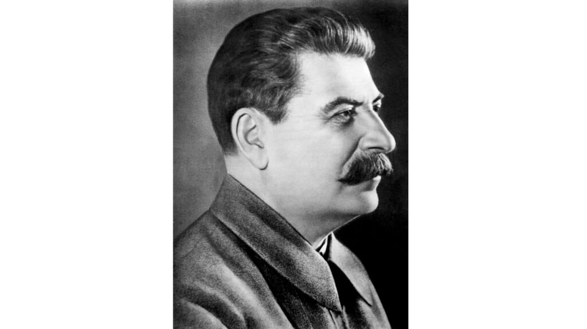

_Proletarians of all countries, unite!_

# On the 80th anniversary of the victory in the battle of Stalingrad

The International Communist League correctly stated in its ‘Political
Declaration and the Principles of the International Communist League’: _“_ _We
assume the position of Chairman Mao on the role of comrade Stalin that he was
a great_ _Marxist._ _Furthermore,_ _we must bear_ _in mind_ _that_ _he was the
one who brilliantly defined_ _Leninism._ _We, the communists, today have the
task to_ _assume the defense of_ _his_ _role in_ _World War_ _II_ _within the
Communist International, particularly its 7_ _th_ ___World_ _Congress.”_ The
latter will be central for this article celebrating the tremendous victory in
the battle of Stalingrad.

The weight and significance of this great and heroic battle was correctly
established by Chairman Mao Tse-Tung: **“** **This battle is not only the
turning point of the Soviet-German war, or even of the present anti-fascist
world war, it is the turning point in the history of all mankind.”**

The war fought by the USSR, as it was absolutely correctly defined, was a
Great Patriotic War, a just war of defence. Additionally to the glorious and
heroic defence, in which the USSR under the leadership of Comrade Stalin had
to apply scorched land to defend its territory, to defend the socialist
motherland, what costed more than 25 million lives, the anti-imperialist
struggle unfolded vastly in the oppressed nations during this period.

Chairman Mao Tse-Tung just and correct thought us: **“The Soviet Union’s
sacred war of resistance against fascist aggression is being waged not only in
its own defence but in defence of all the nations struggling to liberate
themselves from fascist enslavement. For Communists throughout the world the
task now is to mobilize the people of all countries and organize an
international united front to fight fascism and defend the Soviet Union,
defend China, and defend the freedom and independence of all nations.”**

The peoples of the world rose for the just cause and spilled their precious
blood not only in the war against the axis, but also against their respective
imperialist masters, what initiated the great anti-colonial struggle in the
second half of the 20th century.

In the winter 1941/42 the Soviet Union under the leadership and command of
Comrade Stalin had already successfully rebuffed a vicious Nazi-German attack
on the western part of the country, aiming to take the capital Moscow. The
Nazi-Wehrmacht, not able to understand that every attempt to crush the
Bolshevist steel tempered by the great Lenin and Stalin was doomed to fail,
mounted an offensive on southern Russia in the summer of 1942. They set their
sights on Stalingrad, because the city served as an industrial center in
Russia, producing, among other important goods, artillery for the country’s
troops. The Volga River, which runs through the city, was also an important
shipping route connecting the western part of the country with its distant
eastern regions. The Nazis wanted the Wehrmacht to occupy Stalingrad, seeing
its value for propaganda purposes, given that it bore Stalin’s name. For
similar moral reasons there was a special need to defend it. The 6th Army of
the Wehrmacht began their assault on 23 August 1942.

Comrade Stalin, as the highest command, issued personally the Order 227, at
the end of July 1942, in order to elevate the level of sacrifices and fighting
spirit of the armed forces to the level of the people:

“ **The enemy throws new forces to the front without regard to heavy losses
and penetrates deep into the Soviet Union, seizing new regions, destroying our
cities and villages, and violating, plundering and killing the Soviet
population. Combat goes on in region Voronej, near Don, in the south, and at
the gates of the Northern Caucasus. The German invaders penetrate toward
Stalingrad, to Volga and want at any cost to trap Kuban and the Northern
Caucasus, with their oil and grain. […] Part of the troops of the Southern
front, following the panic-mongers, have left Rostov and Novochercassk without
severe resistance and without orders from Moscow, covering their banners with
shame.**

**The population of our country, who love and respect the Red Army, start to
be discouraged in her, and lose faith in the Red Army, and many curse the Red
Army for leaving our people under the yoke of the German oppressors, and
itself running east. Some stupid people at the front calm themselves with talk
that we can retreat further to the east, as we have a lot of territory, a lot
of ground, a lot of population and that there will always be much bread for
us. They want to justify the infamous behavior at the front. But such talk is
falsehood, helpful only to our enemies.**

**Each commander, Red Army soldier and political commissar should understand
that our means are not limitless. The territory of the Soviet state is not a
desert, but people - workers, peasants, intelligentsia, our fathers, mothers,
wives, brothers, children. The territory of the USSR which the enemy has
captured and aims to capture is bread and other products for the army, metal
and fuel for industry, factories, plants supplying the army with arms and
ammunition, railroads. After the loss of Ukraine, Belorussia, Baltic
republics, Donetzk, and other areas we have much less territory, much less
people, bread, metal, plants and factories. We have lost more than 70 million
people, more than 800 million pounds of bread annually and more than 10
million tons of metal annually. […] To retreat further - means to waste
ourselves and to waste at the same time our Motherland. Therefore it is
necessary to eliminate talk that we have the capability endlessly to retreat,
that we have a lot of territory, that our country is great and rich, that
there is a large population, and that bread always will be abundant. Such talk
is false and parasitic, it weakens us and benefits the enemy, if we do not
stop retreating we will be without bread, without fuel, without metal, without
raw material, without factories and plants, without railroads. This leads to
the conclusion, it is time to finish retreating. _Not one step back!_ […] It
is impossible to tolerate commanders and commissars permitting units to leave
their positions. It is impossible to tolerate commanders and commissars who
admit that some panic-mongers determined the situation on the field of combat
and carried away in departure other soldiers and opened the front to the
enemy. The panic-mongers and cowards should be exterminated in place.**

**Henceforth the solid law of discipline for each commander, Red Army soldier,
and commissar should be the requirement - not a single step back without order
from higher command. Company, battalion, regiment and division - commanders
and appropriate commissars, who retreat without orders from higher commanders,
are betrayers of the Motherland. These are the orders of our Motherland. To
execute this order - means to defend our lands, to save the Motherland, to
exterminate and to conquer the hated enemy.”**

Our heroic red soldiers were initially able to slow the Wehrmacht’s advances
during a series of skirmishes north of Stalingrad, offering more than 200,000
lifes, and successfully held off the Nazi hordes. It was decided not to flee
but withstand and therefore not to evacuate the more than 400,000 inhabitants
of the city. The men and women, even the youngest, of Stalingrad were
incorporated into war related activities – combat, construction, espionage,
supply, etc. Even when the walls of Stalingrad bursted by the Luftwaffe’s
constant bombardments or the heavy artillery strikes, the people stood
steadfast.

The Operation Uranus led by Georgy Zhukov and Aleksandr Vasilevsky organized
Russian troops in the mountains to the north and west of the city. From there,
they launched a counterattack. Paying the necessary price the Red Army was
able to encircle the city by late November 1942, trapping the nearly 300,000
German and Axis troops (mainly Italian and Romanian), choking off the enemy
forces from vital supplies and essentially surrounding them in an ever-
tightening noose.

Close to Stalingrad the Red Army won important battles, including in Rostov-
on-Don, about 250 miles away from Stalingrad. Thus the enemy forces were
thinned and stretched at that part of the front and the Operation Little
Saturn in the west of Stalingrad was successful. With men, not arms, proving
the Marxist principle about what is most important correct once again, they
strangled the invaders to death and fought the greatest battle of war in
cities ever seen. It was a war not only from street to street, nor from house
to house or cellar to cellar, not even floor by floor, but room by room,
generating the most heroism, chapters that have shaken the world.

On the significance of the battle of Stalingrad for the whole course of the
war Chairman Mao stated: **“…in this present war the attack on Stalingrad is
the expression of the last desperate struggle of fascism itself. At this
turning point in history, too, many people in the world anti-fascist front
have been deluded by the ferocious appearance of fascism and have failed to
discern its essence. For forty-eight days there raged an unprecedentedly
bitter battle, unparalleled in the history of mankind–from August 23, when the
entire German force crossed the bend of the River Don and began the all-out
attack on Stalingrad, through September 15, when some German units broke into
the industrial district in the northwestern section of the city, and right up
to October 9, when the Soviet Information Bureau announced that the Red Army
had breached the German line of encirclement in that district. Ultimately this
battle was won by the Soviet forces. During those forty-eight days, the news
of each setback or triumph from that city gripped the hearts of countless
millions of people, now bringing them anxiety, now stirring them to elation.**
**This battle is not only the turning point of the Soviet-German war, or even
of the present antifascist world war, it is the turning point in the history
of all mankind.** **Throughout these forty-eight days, the people of the world
watched Stalingrad with even greater concern than they watched Moscow last
October.** **[** **…** **]** **following the battle for the defence of
Stalingrad, the situation will be totally different from that of last year. On
the one hand, the Soviet Union will launch a second winter counteroffensive on
a vast scale, Britain and the United States will no longer be able to delay
the opening of the second front (though the exact date cannot yet be
foretold), and the people of Europe will be ready to rise up in response. On
the other hand, Germany and her European accomplices no longer have the
strength to mount large-scale offensives, and Hitler will have no alternative
but to change his whole line of policy to the strategic defensive.”**

We all know, and we must remember, that the fascist offensive led by the
Nazis, to which the Italian and Spanish fascists as well as others like the
Romanians, Hungarians and also Bandera’s bunch of rats from Ukraine
contributed, and which used all the economic might of subjugated Europe, threw
millions over millions, the cream of the German army, 75% of its air force,
into the invasion. But comrade Stalin had wisely handled diplomacy with great
subtlety.

It is worth noting the sagacity and penetration of the Soviet intelligence
service. What an intelligence service. They knew the exact day of the Nazi-
invasion.

The Soviet Union applied a strategic defence together with scorched earth,
leaving them nothing but bare earth, mud, ashes and the most brave, determined
and resolute partisans behind the enemies lines. They had the audacity, the
courage to blow up monumental works such as the famous dam that links the
Volga with the Don that took so many years of effort. The Germans never
dreamed, they thought that this work would not be blown up, because it was too
important and had cost a lot.

The dictatorship of the proletariat was at stake, the revolution was at stake,
we cannot stop to think, nor can we simply allow ourselves to be hindered, as
Chairman Mao said, by the defence of inches of land. They crashed at the gates
of Leningrad, at the gates of Moscow and Stalingrad; but not only

scorched earth was carried out, but guerrillas and even simple individual men
and women with their rifles, their ammo and their vodka awaited the enemy. To
annihilate one of those brave heroes and heroines, the Germans lost 10 men,
averagely.

The fascist offensive was a military plan of very high quality, thus, the
highest and most enlightened German military leaders elaborated this plan and
the German school has a many times proven war tradition: in three months they
planned to conquer the USSR.

Comrade Stalin’s foresight, he had already taken measures since the 1930s when
there was the great transformation of the countryside and industry, they had
already transferred factories beyond the Urals, even foreseeing the
possibility of leaving as far as Moscow, for it is true, everything was

already in place in case they could not ultimately defend Moscow, even if that
was the decision taken, it was already planned to move the leadership and the
centre to the Urals; So the first thing that was done was to make arrangements
for Lenin’s transfer, because he could not fall into the dirty hands of the
wretched sons of hell, he could not fall.

But the order, after they had penetrated to the above mentioned gates, the
order was not to retreat any further! It is very memorable, and we must always
remember how on November 7, the anniversary of the revolution, they had
nowhere to celebrate it and it was considered impossible to carry it out;
comrade Stalin said: “to the station”, “but there is no platform there, there
are no seats there”, comrade Stalin stepped on a box and spoke in celebration
of the revolution, saying: “how many of us were there when we seized power,
what forces did we have when we repulsed the imperialist aggression
immediately after the October Revolution? We will crush them, and we will
annihilate the beast in its own den, in Berlin.”

These are things one must remember, to appreciate comrade Stalin one must look
at the Second World War. We all know how then came the great resistance, the
breaking of the German lines, the siege of Stalingrad where the German
commanders, Hitler himself, commanded them not to retreat to those inferior
subhumans. Those inferiors, the barbarians, the Mongols, hunted them down like
rats and they had to surrender.

It is always good to reiterate this: Stalin, the skillful and wise manager of
war, always took the moral element into account and paraded all the defeated,
surrendered Nazis and threw their flags, their eagles, their swastikas at the
foot of Lenin’s mausoleum; not only a great military defeat, but a

great moral defeat! The Nazi arrogance had been sunk in the mud and trampled
upon, it was the greatest moral blow it had ever received, and that was the
beginning of the breakdown of the Nazi Wehrmacht.

In February 1943 Comrade Stalin analysed: **“Three months ago the troops of
the Red Army began their offensive at the approaches to Stalingrad. Since then
the initiative in military operations has remained in our hands and the pace
and striking power of the offensive operations of the Red Army have not
weakened. Today, in hard winter conditions, the Red Army is advancing over a
front of 1,500 kilometres (950 miles) and is achieving successes practically
everywhere. In the north, near Leningrad, on the central front, at the
approaches to Kharkov, in the Donets Basin, at Rostov, on the shores of the
Sea of Azov and the Black Sea, the Red Army is striking blow after blow at the
Hitlerite troops. In three months the Red Army has liberated from the enemy
the territory of the Voronezh and Stalingrad regions, the Checheno-Ingush,
North Ossetian, Kabardino- Balkarian and Kalmyk Autonomous Republics, the
Stavropol and Krasnodar Territories, the Cherkess (Circassian), Karachaisu and
Adygeisu Autonomous Regions and almost the whole of the Rostov, Kharkov and
Kursk Regions.**

**[…] in the winter of 1942-43 alone, the Germans lost over 7,000 tanks, 4,000
planes, 17,000 guns […] since the beginning of the war, has put out of action
about 9,000,000 German-fascist officers and men, of whom no less than
4,000,000 were killed on the battlefield.**

**[…] first, the weakness of the German army is the shortage of man-power
reserves, and consequently it is not known from what sources these losses will
be replaced. […] the Red Army has become a seasoned army. […] millions of Red
Army men have become masters of their weapons [ …]**

**It cannot be considered an accident that the Red Army Command not only
liberates Soviet soil from the enemy but does not let the enemy leave our soil
alive, carrying out such important operations as the encirclement and
annihilation of enemy armies which can well serve as examples of military art.
This is undoubtedly a sign of the maturity of our commanders.**

**There can be no doubt that only the correct strategy of the Red Army
Command, and the flexible tactics of our commanders who execute it, could have
resulted in such an outstanding fact as the encirclement and annihilation at
Stalingrad of an enormous picked army of Germans, numbering 330,000 men.”**

Our Brazilian comrades pointed out: The victory against fascism in the Second
World War is one of the great historical events of the process of the
Proletarian World Revolution, the imperialist camp found itself deeply beaten,
three important imperialist powers were defeated - Germany, Japan and Italy -
which has to be seriously studied for its just and correct comprehension, it
has to be highlighted and celebrated.

The Communist Party of China affirmed, regarding the evaluation of this
historic experience:

“ **In the first place, the history of anti-fascist war shows that the
socialist system has an enormous vitality that can resist the most severe test
and that a state of the dictatorship of the proletariat is invincible.**

**In second place, the history of the anti-fascist war shows that imperialism
is the source of all wars in modern times, that the aggressive nature of
imperialism will not change and because of that, to defend world peace it is
necessary to persist in the struggle against imperialism.**

**In third place, the history of the anti-fascist war shows that the peoples
war sure to attain victory, that it is completely possible to defeat the
imperialist aggressors, that imperialism is a paper tiger, who is apparently
strong, but in reality is weak, and that the atomic bomb is also a paper
tigress and it is the people and not the arms, of any class, who decide the
outcome of the war.**

**In fourth place, the history of the anti-fascist war shows that, in order to
defeat the imperialist aggressor, it is imperative to trust in the unity of
the revolutionary forces of the people in all countries, to attract to our
side all the forces that can be won, to form the broadest possible
international united front and concentrate our blows on the main enemy of the
peoples of the world.”**

Under the guns of the glorious Red Army Nazi-Germany was shattered, Socialism
and the dictatorship of the proletariat arose in up to Eastern Germany. The
Red Banner of the Communist Party and the USSR waving over the shadowed and
destroyed German Reichstag is an undeniable great moment of the international
proletariat that symbolize the whole heroic and glorious epic of the struggle
against fascism in defense of the USSR and for the development of the
Proletarian World Revolution. The sentence made by comrade Dimitrov when he
embarked in the direction of

USSR after the great victory in the Nazi Tribunal in Leipzig was thus
accomplished: _“We will make Germany Soviet!”._

Source: [https://ci-ic.org/blog/2023/01/31/on-the-80th-anniversary-of-the-victory-in-the-battle-of-stalingrad/](https://ci-ic.org/blog/2023/01/31/on-the-80th-anniversary-of-the-victory-in-the-battle-of-stalingrad/)