# PC January 30: our central work continues in large factories. Mirafiori: the voices of the workers and our indications and proposals: anti -capitalist proletarian assembly in Rome February 18, assembly of workers in Turin in the week of 8 March

<!--METADATA-->

Initiative in Mirafiori to the concierge, with posting posters with the 
 Our indications and flags of the Slai Cobas alongside. They spread 
 flyers, also distributed for direct contact and an exchange with 
 workers and workers who enter and leave the concierge for the first and 
 second round. 

 Learned that the workers of the central shift were also at work that day 
 of the Maserati, we returned to 16.00 for the exit. This allowed to 
 also speak with the workers of this department on the general situation and on 
 company contract where information and perspective is missing. 

 During the morning the news had spread that in May they close the 
 Incentives for Lear(sedili)to send away and that there will be workers in the middle 
 to the street, and there was a bad mood. 

 The billboards, seen and read in several cases evidently, have become 
 opportunity to start talking "is no longer life, war and caravan, the 
 Single contract for the whole group "; the flags have attracted attention, 
 It was in fact, as someone said "the day of the Cobas". 

 This was clear from the first worker who when he saw us prepare the 
 billboards, a little surprised, we said "I didn't think there were still 
 These initiatives no longer have these initiatives in Mirafiori "; 
 We explained that our intervention is precisely because we do not have 
 Alternatives. 

 Others, seeing the flags said: "I was also cobas ... there were also 
 The Cobas at the time of the strikes for the Panda(2002 circa)but then with i 
 solidarity contracts no longer made them enter ... ";" There were also i 
 Cobas when the processions were there, the Cobas now are the 'to slap those 
 Stayed, there are eliminated people, put out ... ". 

 Several other workers spoke of this presence passed in various ways 
 "I was also cobas, you're right, now I read carefully ... 
 Angry and resigned it is not good, you have to be combative ... no I don't 
 give up ". 

 The guardians are very evident, who as usual observe the movement of 
 workers around us, and in front of the concierge the workers were more 
 elusive, and a couple of workers have explicitly said. 

 In general, the workers wanted to speak, and some were 
 clearly critical of the confederal unions, the delegates "who are 
 'sitting not to do anything "compared to what happens in the factory;" We 
 We have already told the unions inside our problems, but that much does not 
 they can do. 

 Faced with the renovation of the group, the caravan, the war, to 
 Meloni government, the proposal of the workers' assembly is the one necessary for 
 unite, organize, give perspective to the workers who want in factories 
 oppose. For this we brought the indication to the signs and in the flyer 
 of the new ** Anti -capitalist proletarian assembly that will take place in Rome on 18 
 February.** 

 [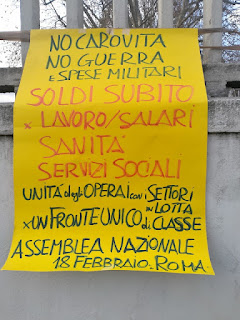](https://blogger.googleusercontent.com/img/b/R29vZ2xl/AVvXsEiYTMIJTtyCVUPd65lq9bzFTwfeybfD5JYp-
emjf5FSOw61hNQVVzhMp_rigcIlLbcogDmWJpRkD8h8FsfFEmbTvj3Apf3zgDsQuOkjED68w2wnWWs2Za2qYxrmXknrH5OJHX5GbCMIdgWIUN0kJtxNcEMKeZTCFfPdCxoZcwWJOvY7o19VoPkkyecvNg/s640/fiat.jpg)Workers tell of a very serious factory situation, it agrees that 
 Without the struggle of the workers, there cannot be results, but that there is fear, 
 individualism, it is thought that 'there is nothing more to do'; "The problem of 
 Fund, you know, it is fear, the strike is no longer done. If we do the 
 strikes, pay the consequences. Come and do the worst jobs, a 
 part that there is nor nor, but all of them must be rebelled 
 Together ... outside here we have a life, a house ". 

 Other workers and workers confirm: "Yes, more and more, I have been working for 30 years, 
 I arrive from Grugliasco who closed, I ruined my back in line, 
 do not take into consideration the problems, but at the end of the month you have to pay 
 The rent ... ";" After 30 years of work you don't even have the health that takes care of you. 
 If you don't have the money, you have time to die ... ";" They don't send us retired and 
 inside young people, I am 30 years of work but I have never worked as now, 
 on the assembly line "," ... it's not that we are so young that they can be 
 on assembly lines; I drive the cart, unloading truck from the morning 
 In the evening, at 56 years old I think I have already given ";" Too much work, too loaded 
 of work, first 10 pieces, now 15. But there are many workers at home!Self 
 They divided the work would be better, all the load to us, we will die before "; 
 "Higher rhythms yes, but also targeted loads to force you to 

 accept the resignation ";" I work three days a week, but there is no 
 I do more. I see that others in other factories are worse than us, rhythms 
 of work, Amazon, Pirkinton ... arrived at a certain age you need to 
 slow down. We have to get out of here. "Left" and right have reduced us to 
 This state ... ".
an alternative, we are not here to tell the workers, but to work together 
 to build the way out. 

 We talk about preparing an assembly to join the workers who are not there to 
 This life, but we must build it together. The workers are not there more 
 As you work in the factory, but complaining or protesting one by one, 
 We work together for ** an assembly of workers in the week of 8 
 March. ** 

 Other workers strengthen the complaint of factory conditions and how yes 
 It is treated: "It's sucks, I have the 7 year old girl don't even give me the 
 days, they make me the proposals: if you come to me on a Saturday or two I will come to you 
 I find. They want me to go for 18 compulsory Saturdays, up to 
 September ... Meeting? I have the 7 year old girl and I have to work, one day 
 I come here and the girl I leave her to the cage and I enter work!It's right?" 

 We reply: "How they treat you, you are right to rebel, but it is right that the 
 Do you protest her alone? And the other workers? Because you don't do it together, 
 And does your little girl become our struggle? There are the possibilities if the 
 we are looking for ... we have to overturn this situation, because even to obey 
 You don't save you the same, targeted rhythms and loads, it is a factory that you 
 crushed. "she reflects on the collective size of the protest" yes 
 True, it can be done, and for the assembly I speak with the colleagues in the ward ". 

 Other rumors about the fight: "I came from Rivalta, I made a strike, 
 They were all who cried, I went out on my own ... we went out to do the 
 processions but nothing has changed ";" Nobody is more willing to put strike, or if 
 You do one then they don't go further, the bills have increased, the people 
 In here they are not willing to lose money. I have seen struggles but 
 Nothing has changed. Grugliasco, Rivalta, Maserati ... have closed ";" But the 
 Pensions, health care have brought them the workers with the struggle ... ". 

 It is not enough to make only the list of misfortunes, first when the workers had 
 In their hands the struggle, the worker movement filled these avenues, we must 
 try again. The strength of the workers is when they organize themselves for their own 
 interests. For this we must build an autonomous assembly.

News Source: [https://proletaricomunisti.blogspot.com/2023/01/pc-30-gennaio-continua-il-nostro.html](https://proletaricomunisti.blogspot.com/2023/01/pc-30-gennaio-continua-il-nostro.html)

<!--NEWS-->

# And interview mother and wife of Samuel and Willian, murdered by the PM in 2021

<!--METADATA-->

Mother and wife of a student and worker murdered by the police 
 demonstration on January 25 in the north of Rio de Janeiro. Photo: Bank of 
 data and 

 On January 25, Sonia Bonfim, mother victim of violence from the old state, and 
 family members victims of police violence held a demonstration in 
 against the 31st Police Station of Ricardo de Albuquerque, requiring the 
 investigation and punishment of the police involved in the murder of his son, 
 Samuel Vicente, 17, and her husband, Willian Vasconcellos, 38. 

 They were murdered on September 25, 2021, by military police 
 of the 41st Military Police Battalion(PM), in the Chapadão Complex, North Zone 
 From Rio. At the time, Samuel and Willian returned from a celebration of 
 Samuel's approval to the army when they were shot. 

#### [Read also: RJ: Mother organizes manifestation for the punishment of police officers 
 killers of their families](https://anovademocracia.com.br/noticias/18471-rj-ocorrera-amanha-mae-
organiza-manifestacao-pela-punicao-dos-policiais-assassinos-de-seus-
familiares)Check out the video of ** and ** of the demonstration:

News Source: [https://anovademocracia.com.br/noticias/18626-and-entrevista-mae-e-esposa-de-samuel-e-willian-assassinados-pela-pm-em-2021](https://anovademocracia.com.br/noticias/18626-and-entrevista-mae-e-esposa-de-samuel-e-willian-assassinados-pela-pm-em-2021)

<!--NEWS-->

# Germany: International Communist League Flags are wielded in 'LLL' demonstration (check out the video)

<!--METADATA-->

Protesters raised track celebrating the foundation of the LCI. Photo: _Dem Volke 
 Dienen_ 

 International Revolutionaries released the foundation of the Communist League 
 International(LCI)in a massive manifestation in honor of Vladimir Lenin, 
 Rosa Luxembourg and Karl Liebknecht(conhecida como LLL), in Berlin, in the Center 
 from Germany. The demonstration took place on January 15 and toured the streets 
 from the city until it reaches the cemetery where Luxembourg and Liebknecht are 
 buried. 

 The demonstration began around 10am, when thousands of 
 People started marching by important avenues of the capital. 

 The revolutionary portal Dem Volke Dienem published a video of the demonstration: 

 A track with the consignment ** long life to the International Communist League!** 
 erected by the German and Turkish revolutionaries who made up an extensive block 
 in the manifestation. Cerrados in rows, the revolutionaries carried flags 
 of LCI, the organization _Partizan_ and a large track in honor of the party 
 Communist of Turkey/Marxist-Leninist(https://anovademocracia.com.brTKP/ML), which currently drives the 
 Popular war in that country. 

 Organization _Partizan_ paid tribute to the Communist Party of Turkey(https://anovademocracia.com.brTKP/ML). Photo: _dem Volke Dienen_ 

 In addition to the bands and flags, leaflets with excerpts from ** political dissemination and 
 Principles of the International Communist League ** and complete brochures of the 
 document were delivered by the revolutionaries to the masses they attended and if 
 integrated the demonstration. 

 LCI flags were held in the Revolutionaries Block 
 Internationalists. Photo: _dem Volke Dienen_ 

 According to the portal _dem Volke Dienen_, which covered the demonstration, the masses that 
 witnessed the act were enthusiastic about the announcement of the founding of the 
 LCI. Dozens of people who saw the block asked to hold the flags of the 
 LCI multiple times and asked where they could acquire them. 

 The demonstration on January 15 occurs annually on Berlin Street with the 
 Objective of honoring the memory of Rosa Luxembourg and Karl Liebknecht, bosses 
 historical communist party of Germany, which were murdered by the 
 German social democracy troops in 1919, and Vladimir Lenin, communist boss 
 of the international proletariat and great reference for Luxembourg and 
 Liebknecht.

News Source: [https://anovademocracia.com.br/noticias/18585-alemanha-bandeiras-da-liga-comunista-internacional-sao-empunhadas-em-manifestacao-lll](https://anovademocracia.com.br/noticias/18585-alemanha-bandeiras-da-liga-comunista-internacional-sao-empunhadas-em-manifestacao-lll)

<!--NEWS-->

# Mexico: News from Sol Rojista

<!--METADATA-->

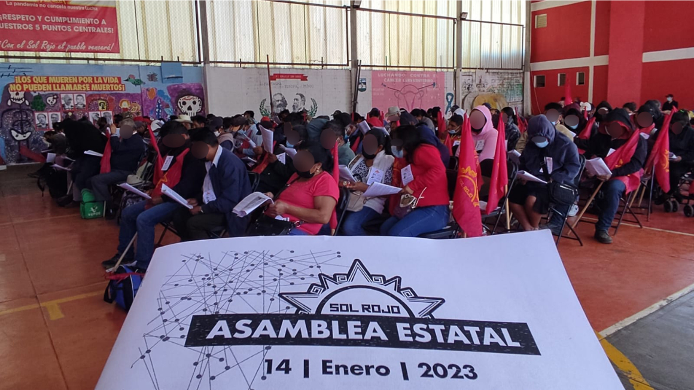* * * 

 By a commentator for the Earn Folket Media. 

 * * * 

 ** Our comrades in Sol Rojista have written about two important events that became 
 held in Oaxaca in mid -January. ** 

 13 \. January arranged the front of Oaxacan organizations(FORO)conference 
 "The situation in Oaxacan, the challenges of the popular movement". Foro collects 13 
 Democratic and revolutionary organizations. Important appointments were made 
 during the event and a political statement was written that has been published 
 by Sol Rojista: 

 [Declaración política del frented de organizaciones oaxaqueñas(FORO)](http://solrojista.blogspot.com/2023/01/declaracion-politica-del-
frente-de.html)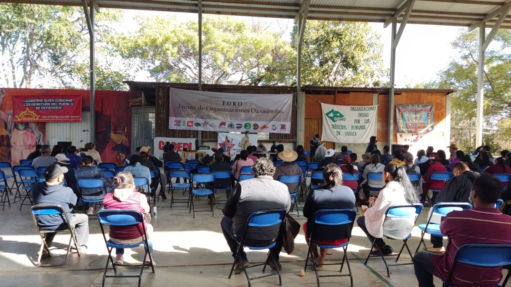14 \. Januar Holdt People's Current - Red Sol(Folkets Strømning – Røde
Sol)a conference, which was conducted at an important time in national and 
 state political context and is part of the national path towards 
 The constitution of the folk front and the ongoing correction campaign. Sun 
 Rojista has published a political statement from the conference: 

 [Declaración política de la 
 Asambleeal](http://solrojista.blogspot.com/2023/01/declaracion-politica-de-la-
asambleal.html)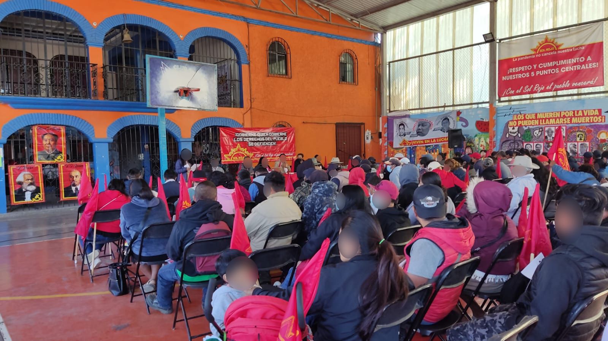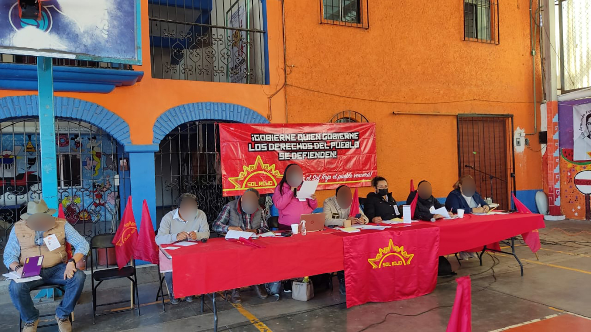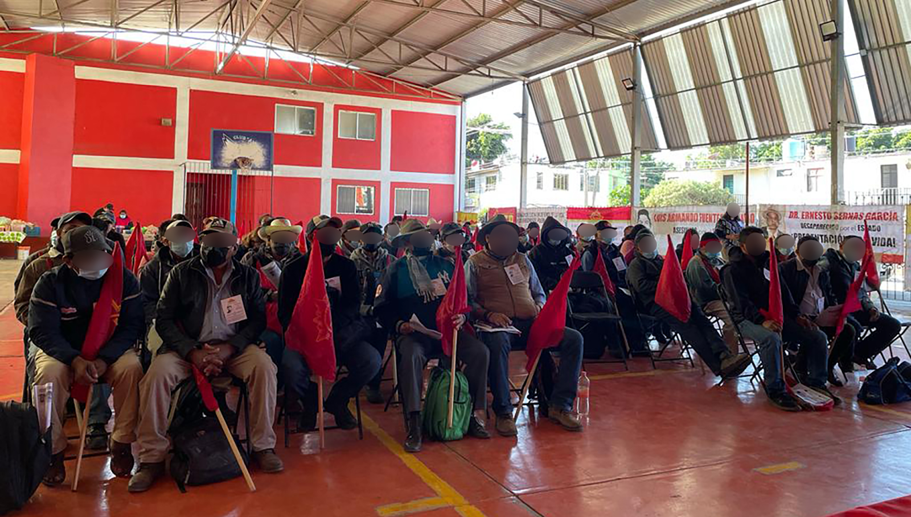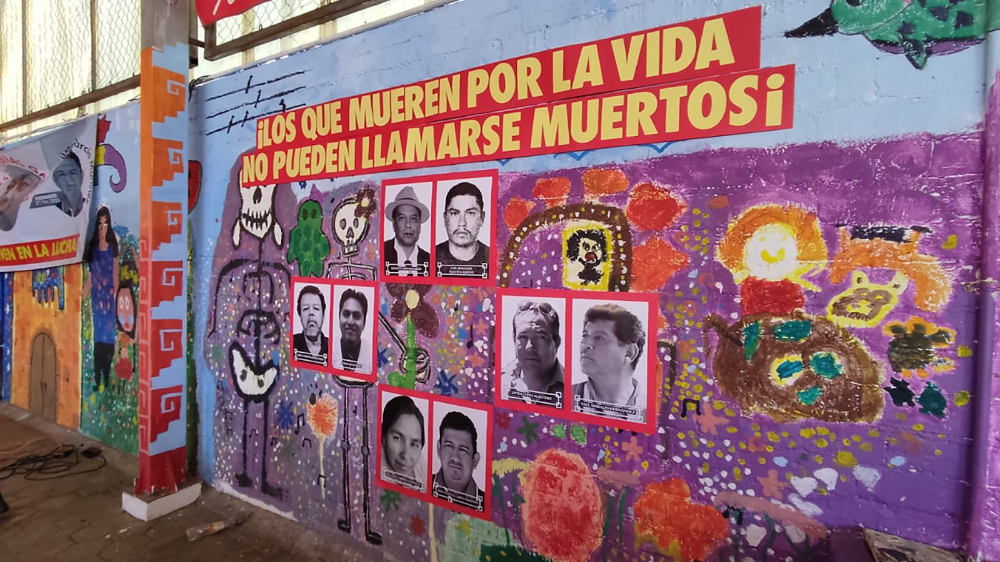** Referanser ** 
 [Brief Started Week 
 ](http://solrojista.blogspot.com/2023/01/breves-iniciado-
semana.html)[Political Declaration of the Oaxacan Organizations Front(FORO)](http://solrojista.blogspot.com/2023/01/declaracion-politica-del-frente-
de.html)[Political declaration of 
 Assembly](http://solrojista.blogspot.com/2023/01/declaracion-politica-de-la-
asambleal.html)

News Source: [https://tjen-folket.no/index.php/2023/01/30/mexico-nyheter-fra-sol-rojista-2/](https://tjen-folket.no/index.php/2023/01/30/mexico-nyheter-fra-sol-rojista-2/)

<!--NEWS-->

# Rally in Hamburg: Freedom for Palestine!

<!--METADATA-->

** Freedom for Palastina!** 

 Last Friday, the reactionary Israeli state bombed again 
 Once the Gaza Strip. Israeli murdered only shortly before 
 Security powers 10 palastinians at a raid in Dschenin im 
 West Bank. The new reactionary government in Israel is increasing the 
 Sub -pressure of the Palastinian people and the repression against the 
 National liberation movement. 

 Comes with us against these bombings, against the negative pressure and for one 
 freed from imperialism, self -determined and united Palastina on the 
 Street. 

 ** for the right to self -determination of the nations!** 

 ** Down with imperialism!** 

 ** rally: Saturday, February 4th, 2023 | 3 p.m. | Stone dam corner 
 Adenauerallee(Vor der Apotheke am**

**Hauptbahnhof)** 

 _B Undnis against imperialist aggression_ 

 _Januar 2023_

News Source: [https://www.demvolkedienen.org/index.php/de/t-international/7450-kundgebung-in-hamburg-freiheit-fuer-palaestina](https://www.demvolkedienen.org/index.php/de/t-international/7450-kundgebung-in-hamburg-freiheit-fuer-palaestina)

<!--NEWS-->

# PM performs peasant slaughter in Nova Mutum/RO, denounces to Abrapo

<!--METADATA-->

Cowardly murdered peasants in slaughter. Photo: Rondoniaovivo 

 According to the Brazilian Association of Lawyers Gabriel 
 Pepper(Abrapo), on January 28 Military Police of the Battalion of 
 Special operations(Bope)and the border and border battalion(BPFron)They cowardly tortured and murdered two peasants and wounded three others. 
 The action was perpetrated during a repossession operation at the headquarters of the 
 Norbrasil Farm, located in Nova Mutum-Paraná(RO), recently occupied 
 by peasants in recent weeks. The murdered peasants are Raniel 
 Barbosa Laurindo, 24, and Rodrigo Hawerroth, 34. Three others 
 Peasants were injured during the slaughter. 

 > See this photo on Instagram 
 > 
 > [A publication shared by Abrapo 
 >(@abraponacional)](https://www.instagram.com/p/Cn_K7jEN-
> Tk/?utm_source=ig_embed&utm_campaign=loading)In order to justify the macabre slaughter, the Military Police(PM)from Rondônia and the 
 State Latifundia Press claim that the peasants carried weapons of 
 thick caliber and there was a "gunfire". According to information from Abrapo, in 
 However, the truth is that the peasants were tortured and executed. 

 Also according to Abrapo, the press monopoly “omitted that the region is part 
 of one of the various areas graded by the landowner Antônio Martins dos 
 Santos, known as Rooster Velho, investigated by the Civil and Federal Police, 
 together with the Public Prosecution Service, for the financing of gunmen in the 
 region for land grabbing and expulsion of peasants ”. 

 Since it was occupied, the area has been the scene of constant attacks on 
 police and gunmen against peasant families in search of a piece of 
 Earth. In the week before the slaughter, an unidentified pickup truck fired 
 against women and children in the same place and was expelled by families 
 residents of the area Tiago Campin dos Santos(assista no vídeo). 

 > In the week before the slaughter, an unidentified pickup truck fired 
 > against women and children in the same place and was expelled by families 
 > residents of the area Tiago Campin dos Santos. 
 > [pic.twitter.com/qqwjchzclh](https://t.co/qqwJChZClH)> 
 > - The new democracy(@jornaland)[January 30,
> 2023](https://twitter.com/jornaland/status/1620131341399650305?ref_src=twsrc%5Etfw)The area is the same where, in November 2021, armed latifundium groups 
 They operated largely and impunally against the more than 800 families in the area 
 Revolutionary Tiago Campin dos Santos, who occupied the land of the company of 
 “Old Rooster” in Nova Mutum-Paraná, and follow her. At the time, more than 3 thousand 
 troops of the police forces, under the political direction of the Armed Forces 
 reactionary, and combined with the investigated mercenary troops, were 
 mobilized to repress the peasants. 

 The alleged owner, “Rooster Velho”, is being investigated for paying daily to 
 paramilitary groups commit abuse and summary executions using weaponry and 
 Official Cars of the Police Forces in the Norbrasil Farm Area. The group, 
 composed of police and gunmen, still washing money and fraudulent 
 Judicial Proceedings of land expropriation. From the departure from 
 bank secrecy of those investigated by the MP was possible to identify 
 financial movements exceeding R $ 445 million, being effectively 
 proven payment of amounts to the hired servers for the function of 
 Private paramilitary flock of the landlord. 

#### [Read also: Latifundium Mercenary Troop is disarticulated in new 
 Mutum/RO](https://anovademocracia.com.br/noticias/18388-tropa-mercenaria-do-latifundio-e-desarticulada-em-
nova-mutum-ro)The newsroom of ** and ** will continue mobilized and will bring, at any time, new 
 information.

News Source: [https://anovademocracia.com.br/noticias/18629-pm-executa-chacina-contra-camponeses-em-nova-mutum-ro-denuncia-a-abrapo](https://anovademocracia.com.br/noticias/18629-pm-executa-chacina-contra-camponeses-em-nova-mutum-ro-denuncia-a-abrapo)

<!--NEWS-->

# PC January 30 - The war in Ukraine expands to the Middle East: US imperialism and its Israeli guard dog have attacked a military structure of Iran

<!--METADATA-->

** Israel helps Ukraine behind the scenes ** 

 According to the Wall Street Journal, behind Iran attacks there would be 
 Israel. Tehran, officially, does not attribute responsibility to 
 Jewish state. In Syria Israeli drones against militias convoy of arms 
 of the regime in Albukamal 

 The attack on Isfahan took place less than a week after an important 
 Usa-Israel military exercise in the perspective of the clash against 
 Tehran. 

 According to Nova Agenzia, the raids took place in six different Iranian cities and more 
 Sometimes the Iranian smuggler has come into operation. The ISW reports that 
 Explosions were heard in Karaj, in the province of Alborz; Dezfoul, 
 Province of Khuzestan; and Hamedan City, province of Hamedan, in the hours 
 following the attack of the drones. 

 Furthermore, "Iran and Israel have been engaged for years in a shadow war on earth, 
 sea, air and in cyberspazio with Israel who made attacks against 
 Iranian military and nuclear structures made targeted murders with robots 
 remote controlled, hitting scientists and even a high military official, the 
 colonel 

 Savad Khodayee, head of a secret unit of the revolutionary guards. Beyond 
 To him, two colonels were killed in accidents. Is the one that naphtals 
 Bennett, prime minister "rotating" until July 2022, had defined "the 
 Polpo doctrine ": hit no longer the" tentacles "of the Iranian regime in the 
 region but "go straight to the head». A strategy that the current first 
 Minister Benjamin Netanyahu, returned in office for just a month, may not 
 Wanting to abandon "(da eastjournal)

 Amwaj.media: however, speaking on condition of anonymity, a political source 
 high rank in the Iranian capital indicated to Amwaj.Media that 
 ** Ukraine was mentioned among the guilty potential **. Echoing this 
 line, the media affiliate of the Supreme Council for National Security 
 Iranian(SNSC)he warned of "heavy consequences" unless the government 
 Ukrainian does not distance himself from the attack. In the meantime, others support 
 that ** Azerbaijan **, whose embassy to Tehran has recently been recently 
 closed due to the growing tensions, he may have played a role alongside 
 of Israel. 

 Sources with "direct knowledge of the attack" of 29 January told a 
 Israeli correspondent of the American outlet Axios that the attack was 
 "specific, surgical and successful", claiming that "4 different areas 
 of the building were accurately targeted and the goal was 
 reached up". 

 A few hours before the attacks in Iran, the Ambassador of Israel to Berlin has 
 released this interesting interview in which he said, among other things: 

  _ "We have the Russians in Syria. As you know, the Israeli army blocks 
 Regularly the shipments of weapons from Iran to Syria and Lebanon. These 
 They include Iranian drones and missiles that Russia is using in Ukraine. So 
 We help, even if behind the scenes and much more than you know. We have 
 Also a large Jewish community in Russia. These are the two reasons 
 main for which we keep a low profile "._ 

 Eastwest January 30, 2023 

 According to sources of the US press, the attack of three drones to one 
 Military structure of Isfahan took place in recent days is the work of Israel. 
 The Ministry of Defense of Tehran reports that the damage caused were 
 limited. 

 It is not the first time that Israel affects military structures of the Republic 
 Islamic, but the timing of the attack, with drones, which occurred in the days 
 last suggests a clear message addressed by Tel Aviv to Tehran 
 on the approach that the Jewish state intends to pursue towards the country 
 Shiite, evidently supported by his strictest ally, the United States. 
 It is the Wall Street Journal that supports with certainty that behind the operation
At least 3 drones, one of which capable of reaching the goal, has been achieved 
 A building that, for some analysts, is a weapons deposit, for others a 
 Laboratory or a military logistics site. 

 Today the journey of the secretary Antony Blinken in 
 Middle East, where he will meet the government representatives of Israel, Palestine 
 and Egypt. A mission to say the least incandescent, with Tel Aviv active 
 militarily not only in Iran but also in the West Bank, where the tension is 
 to the stars. It is the first visit of the Secretary of State since the executive 
 of the far right led by Benjamin Netanyahu has settled, with Washington 
 unable to control the moves of the Israeli ally, free to operate 
 in the international context. The proximity never denied, nor cooled, to the 
 Russia by Vladimir Putin reads the failure to send military supplies 
 to Ukraine, which allowed the Israeli army to continue 
 undisturbed with Strikes in Sovereign territory of Syria(supportata da
Mosca), where the objectives are Iranian military presences. 

 In fact, there are multiple intertwining related to the Middle Eastern fate, 
 concerning an important slice of international balances. If it opened 
 A wider front of open war, this would drag the community 
 international in the underworld of a military confrontation with unexpected results, 
 which also involves powers with nuclear weapons in this case. Diplomacy 
 seems to be numb in this phase of military actions and violence against civilians, 
 with the European Union that is said ready to insert the guards of the 
 Revolution in the list of terrorist organizations despite the 
 political danger that this choice would cause, or the definitive end 
 of the negotiations for the restoration of the JCPOA, the agreement on Iranian nuclear power. 

 Yet, openings would come to this sense from the United States, with the 
 Qatar mediation. In fact, Foreign Minister Mohammed Bin 
 Abdulrahman Al-Thani, visiting Tehran, yesterday would have 
 A message from Washington delivered to the Iranian government. "We will do all this 
 that it is possible so that an agreement is reached between Iran and the West, 
 fundamental for regional stability, "said Al-Thani. On the front 
 Saudi, Foreign Minister Faisal Bin Farhan at Saud will go to 
 Next weeks in Baghdad, still a broker for peace between Riad and Tehran, 
 Just to meet the Iranian colleague Hossein Amirabdollahian. 

 After 5 negotiating rounds with the aim of restoring full relationships between 
 The two countries, the parties have agreed for new meetings. It is always 
 complicated to interpret the moves of the individual actors, regional and non -regional, 
 involved in the stability of the neighbor and the Middle East: from the Iranian presence 
 in the nations bordering Israel to the ambiguity of Saudi Arabia in 
 relationship with Tel Aviv, passing through the role of the United States and Russia, is in 
 dance the stability of international relations which, apparently, rests 
 Still on a strategic region at a geopolitical level.

News Source: [https://proletaricomunisti.blogspot.com/2023/01/pc-30-gennaio-la-guerra-in-ucraina-si.html](https://proletaricomunisti.blogspot.com/2023/01/pc-30-gennaio-la-guerra-in-ucraina-si.html)

<!--NEWS-->

# Palestine: National Resistance leaves seven dead and 12 injured after Zionist operation massacre

<!--METADATA-->

Palestinians promote actions against Zionist aggression of Israel. Photo: Abdelkhaim 
 Abu Riash/Al Jazeera 

 On January 27 and 28, seven Israelis were killed and 12 were 
 injured as a result of two attacks by the national resistance 
 Palestine in East Jerusalem, an attached region and occupied by Israel. You 
 attacks occurred after the murder of ten Palestinians on 01/25 by troops 
 Zionists of the State of Israel in the city of Jenin, Palestine. The jihad 
 Palestinian Islamic(JIP)and Hamas, groups of the Palestinian National Resistance, 
 They greeted the attacks. 

 The first attack occurred around 20:15 on 01/27, when a Palestinian 
 21 years parked his car near an eastern Jerusalem synagogue and 
 He has gone 17 people with firearms. Seven people died on the spot and 
 Another ten were injured. The national resistance combatant tried to escape 
 after the attack, but was persecuted and killed by Zionist troops of the 
 Defense of Israel(IDF, em inglês). 

 Less than 24 hours later, on the morning of 01/28, the second 
 robbery. This time, a 13 -year -old Palestinian fired with a pistol against a 
 group of five people. Two Israelis were injured and none were killed. THE 
 young man was shot following by passersby Israelis, who opened fire 
 against the combatant and subjugated him until the arrival of the Zionist troops of IDF. 
 Currently, Palestinian is in custody in an Israeli Hospital. 

 Actions in East Jerusalem were celebrated by resistance groups 
 National, such as Hamas and JIP. HAZEM QOUSE, HAMAS spokesman, said that 
 “This operation [the shooting in East Jerusalem] is a response to the crime 
 conducted by occupation in Jenin and a natural response to the criminal actions of the 
 occupation". Nevertheless, neither group claimed authorship of 
 operations. 

 Recent attacks on East Jerusalem occur in a context of 
 [ROBUSTION OF NATIONAL RESISTANCE](https://anovademocracia.com.br/noticias/18150-palestina-
resistencia-nacional-se-robustece-enfrentando-sionismo-israelense-e-traidores-
capitulacionistas)Palestine against the escalation of the Zionist aggression of Israel. 
 In 2022, the Zionist aggression that left 225 dead Palestinians was answered 
 with the growth of armed groups in Palestinian territory, [launches of 
 missiles](https://anovademocracia.com.br/noticias/17947-palestina-resistencia-nacional-dispara-misseis-em-
resposta-a-terrorismo-promovido-por-israel), [attacks on 
 bomb](https://anovademocracia.com.br/noticias/18412-palestina-ataques-a-bomba-em-israel-dao-resposta-a-
crimes-da-ocupacao-sionista)and [attacks on the knife](https://anovademocracia.com.br/noticias/18373-palestina-
apos-semanas-de-incursoes-sionistas-palestino-deixa-tres-israleneses-mortos-
na-cisjordania). 

 Now, with the continuation of Zionist operations in Israel over 2023(somente em janeiro, 35 palestinos foram mortos por militares israelenses), and 
 Especially after Jenin's massacre, Palestinian National Resistance follows 
 affirm through statements and actions that will follow in the rise of your struggle. 
 Only in the last four days have it been performed [road blocks, 
 Street protests, missile attacks](https://anovademocracia.com.br/noticias/18621-palestina-dez-
palestinos-mortos-em-um-so-dia-por-exercito-sionista-de-israel)and shootings 
 against the Zionist aggression of the State of Israel.

News Source: [https://anovademocracia.com.br/noticias/18630-palestina-resistencia-nacional-deixa-sete-mortos-e-12-feridos-apos-massacre-de-operacao-sionista](https://anovademocracia.com.br/noticias/18630-palestina-resistencia-nacional-deixa-sete-mortos-e-12-feridos-apos-massacre-de-operacao-sionista)

<!--NEWS-->

# SP: Metalworkers on strike require late payment with protests in front of the factory

<!--METADATA-->

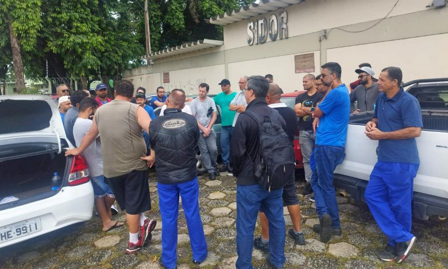Sedor workers protest after seven days of strike. Photo: Disclosure 

 On January 30, the Sidor workers held a protest in front 
 to the factory facilities. Mobilization is part of the strike that began on the day 
 01/23 to require salary payment. Production workers are with the 
 rather than late values since 01/20, while workers from the 
 Administration have the salaries for December late since the 
 Day 05/01. Because of the mobilization, the bosses were also required to 
 deposit the thirteenth, which was late. 

 This is not the first time that the sidor workers have mobilized for the delay of 
 salary. In July and October last year, the company's workers 
 performed a series of strikes for the same reasons. After mobilizations, 
 The salaries were won. Sidor has about 50 workers and produces 
 auto parts and car accessories. 

 Also in Sorocaba, metalworkers from Dana made a stoppage of 
 two hours on 01/26 to protest against lack of transparency and 
 differences regarding the goals and values of the second installment of the 
 Participation in Results(PPR)of 2022. 

 Dana metallurgists paralyze production for two hours. Photograph: 
 FOGUINHO/SMETAL PRESS 

 In recent years, several workers' mobilizations have occurred in São Paulo 
 against the loss of rights and for better working conditions. In November 
 last year, workers won their rights after at least 
 ten strikes during an intense real salary increase campaign 
 mass layoffs.

News Source: [https://anovademocracia.com.br/noticias/18631-sp-metalurgicos-em-greve-exigem-pagamento-atrasado-greve-com-protestos-em-frente-a-fabrica](https://anovademocracia.com.br/noticias/18631-sp-metalurgicos-em-greve-exigem-pagamento-atrasado-greve-com-protestos-em-frente-a-fabrica)

<!--NEWS-->

# PC January 30 - The Meloni government launches another attack on workers' rights: term contracts without limits and without causal

<!--METADATA-->

After the introduction of vouchers with the Budget Law, in the next few days 
 The Meloni government is preparing to make other favors to the masters by freeing them from 
 "constraints" that were placed for fixed -term contracts, constraints often also imposed 
 by court judgments and even by the Constitutional Court which "is already 
 intervened on the Jobs Act of Renzi, to invite Parliament to legislate in 
 more favorable way to workers regarding compensation in cases 
 of layoffs without just cause. "As reported by the manifesto of last 25. 

 It is clear that the "compensation" were introduced to cushion the blows of the 
 layoffs, but have not compensated and cannot compensate a worker or a 
 worker who loses work!

 The new fixed -term contracts should be launched "by 
 The beginning of February: ** Via the 12 -month limit for time contracts without 
 causali **, the hypothesis is ** return to 36 months, as in the times of the Renzi government ** 
 and Minister Poletti. ** with the possibility of a further 12 months to be entrusted 
 to collective contracts **. The causals for renewals will also be widening, 
 which today are substantially linked to the replacement of workers e 
 temporary increases in the activity. " 

 To the normal objections that precariousness already aggravates with these rules 
 extended, given that in Italy there are officially over 3 million 
 workers and workers in these conditions, hastens to answer the 
 Minister of Labor(della precarietà e della disoccupazione)Elvira Calderone 
 What a rod, moreover!“" Just consider flexibility only in the key 
 negative, the term contract is not in itself 

 a form of precariousness »" and that, if not? Here the minister also shows 
 Loss of logical ability!But in reality, the logic is right, it is that of 
 capitalism-imperialism. 

 "... it seems to return to the narratives of Leopolda's times. - says the 
 Daily - without taking into account the fact that, ** in 2021 **(secondo i dati
del rapporto Inapp), only 14.8% of the new employment contracts were in time 
 indeterminate, ** while 69.8% were completed **. Numbers that pushed the 
 same authors of the relationship define the Italian labor market ** " 
 trapped in precariousness ** »." 

 A small list of declarations of the confederal unions follows in fact 
 at the service of the capital, who complain and invite the government to rethink us, 
 To discuss, discuss ... 

 Instead, it is necessary to move on to the facts!

 Workers and workers, "indefinite" or precarious, must be 
 organize, in the face of these continuous attacks, and combine the struggles against 
 masters and their governments. 

 ** The fight against precariousness will also be the subject of the assembly 
 Anti -capitalist proletarian to be held in Rome on February 18 from 
 10.30 to 18.30 at the Metropoz occupied space, in via Prenestina 
 913 ** 

 

News Source: [https://proletaricomunisti.blogspot.com/2023/01/pc-30-gennaio-il-governo-meloni-sferra.html](https://proletaricomunisti.blogspot.com/2023/01/pc-30-gennaio-il-governo-meloni-sferra.html)

<!--NEWS-->

# TRONDHEIM: Throwed out single mother with children from municipal apartment

<!--METADATA-->

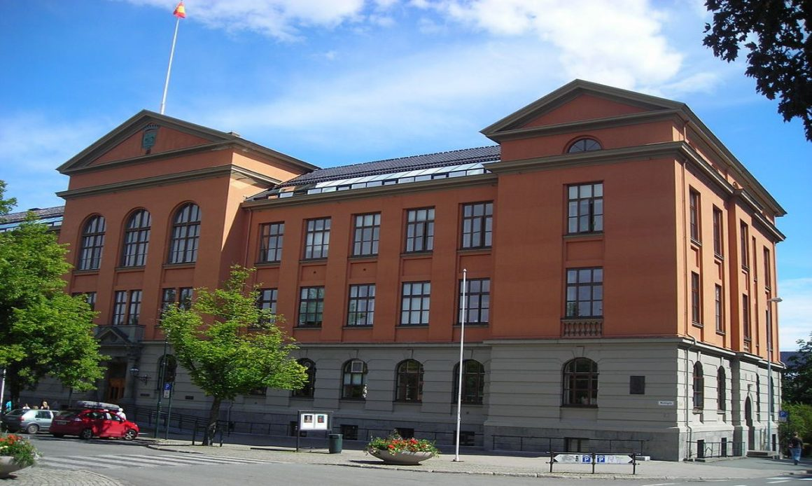* * * 

 By a commentator for the Earn Folket Media. 

 * * * 

 ** single mom “ana”(30)had in spite of many attempts failed to find 
 Housing in the private rental market in Trondheim. Thursday, January 19, threw 
 Trondheim municipality “Ana” and her son(6)out of the municipal apartment 
 They had lived in since they came to town six years ago. ** 

 Avisa Nidaros has written in January about the situation of "Ana," who came to Norway 
 on the run from war in 2016. They write that the single mother is studying health and 
 Growing up in high school. She now receives transitional benefit from NAV, but 
 will be able to start apprenticeship as a health care worker and thus receive ordinary wages 
 in two years. 

 "Ana" said in early December to Nidaros: 
 “The situation is in despair. I have been on many views, most recently in Christmas, and 
 Have really tried to get into the private rental market. But so far 
 I haven't done it. It is not easy to get rented housing in Trondheim without fixed 
 Income, while not talking so good Norwegian. ” 

 The previous lease for the municipal apartment expired last year, and 
 She then applied for a new extension based on a change in the guidelines for 
 Rental of municipal housing. The change led to, among other things, that 
 “Disailed families with families under given terms can be granted up to ten years 
 Rent in municipal housing, "according to Nidaros. She was denied extension, and 
 Received in December notice of impending eviction. Head of the Complaints Board in 
 The municipality, which maintained the decision, justified the rejection of the "ANA" not 
 Longer the criteria for allocating municipal housing and that “10-year rule 
 is aimed at families with children against retaining school districts. The woman already has 
 lived in the apartment for six years and they must move from the apartment in the race anyway 
 of the school run to the son. ” 

 "Ana" told Nidaros that she applied for an extension of the lease in hope 
 about more time to find a residence in the immediate area so that the son can continue to 
 go to the same school, and because there is some trouble in the municipal block, as 
 Make it not suitable for children. She described that the insecurity and unpredictability 
 Around the housing situation was very burdensome for both of them. 

 4 \. January met Namsfogden and representatives from Trondheim municipality up on 
 The door with an eviction order. The eviction was notified in advance but did not stay 
 Completed: Avisa Nidaros showed up, with the result that the bailiff and the bailiff and 
 The municipality temporarily withdrew. 

 On Thursday, January 19, the bailiff entered the apartment and the lock on the door was 
 replaced while "Ana" was at school. She was notified by the neighbor and was met 
 Out on the street outside the residential complex by two representatives from the Namsfogden, two 
 Police officers and two employees from Trondheim Eiendom. She was denied access 
 to the apartment and advised to seek emergency housing at NAV. Nidaros described 
 the situation as heartbreaking, and that "Ana" despaired asked to get picked up 
 Some necessary things for the son and themselves. This was rejected. She got one 
 hour after the day after to pick out necessities as medicines, and one 
 month to pick up the rest of the assets of the family. 

 Nidaros reports that "Ana" and his son live temporarily with friends after 
 the eviction, and that they were recently offered to rent an apartment in the immediate area of 
 the private rental market after the original tenant still not 
 Should have the apartment. However, this outcome does not change the fact that 
 Trondheim municipality, in the midst of an animal time and in a situation of great pressure on 
 the rental market, conducted an eviction of a small family with a young 
 Parents with low income low income and sole responsibility for a small child. 

 **References: 
 ** [Here comes the bailiff on the door to throw out a single mother(30)- 
 Nidaros](https://www.nidaros.no/her-kommer-namsfogden-pa-dora-for-a-kaste-ut-
alenemor-30/s/5-113-405228)[Here's the single mother(30)thrown out of its municipal apartment - 
 Nidaros](https://www.nidaros.no/her-er-alenemoren-30-kastet-ut-fra-den-
kommunale-leiligheten-sin/s/5-113-408255)[Single mother(30)thrown out on Thursday - now the case has taken a new turn - 
 Nidaros](https://www.nidaros.no/alenemor-30-kastet-ut-torsdag-na-har-saken-
tatt-en-ny-vending/s/5-113-409262)****

News Source: [https://tjen-folket.no/index.php/2023/01/30/trondheim-kastet-ut-alenemor-med-barn-fra-kommunal-leilighet/](https://tjen-folket.no/index.php/2023/01/30/trondheim-kastet-ut-alenemor-med-barn-fra-kommunal-leilighet/)

<!--NEWS-->

# URGENT DENITURE: PM performs peasant slaughter in Nova Mutum/RO

<!--METADATA-->

Cebraspo issues a note about recent murders and torture of peasants 
 by the Military Police of Rondônia, who makes the safety of the land grab 
 "Old Rooster" public with the tax resources that the population pays. 

 We sympathize with the families and companions of these peasants and 
 we defend the sacred right to the earth for those who work in it, especially 
 At this time when hunger and unemployment plague the country. We understand and 
 we support all those who want to live a dignified life through their 
 work. The public lands of Brazil have as its constitutional destination 
 agrarian reform, not the private interests of land grabbers, these, thieves 
 of public lands. We repudiate these massacres against the poor people of the field and 
 attempts at criminalization. 

  

  ** LCP denounces murder of peasants in Nova Mutum Paraná ** 

  

 Abrapo received the statement from the League of Poor Peasants denying the 
 shooting allegations between the LCP and the police forces during an operation of 
 repossession, and denouncing that torture and executions were carried out 
 peasants summary. 

  

 In addition, it denounces the cowardity of Rede Globo, which incited the 
 repression, avoided mentioning LCP and accused the peasants of "possible 
 criminals ". 

 Meanwhile, he omitted that the region is part of one of the various areas 
 Pliladed by the landlord Antônio Martins dos Santos, known as Galo 
 Old, investigated by the civil and federal police, together with the 
 Prosecutor, for the financing of gunmen in the region for the 
 land grabbing and expulsion of peasants. 

  

 Important that all democrats mobilize to unmask the tormentors of the 
 people and disassemble this scam, by the disclosure of the complaint made from the 
 LCP!

News Source: [https://cebraspo.blogspot.com/2023/01/denuncia-urgente-pm-executa-chacina.html](https://cebraspo.blogspot.com/2023/01/denuncia-urgente-pm-executa-chacina.html)

<!--NEWS-->

# Ecuador: Fight against mining and oppression

<!--METADATA-->

* * * 

 _ Transferred for Earn Folket Media by a contributor._ 

 * * * 

 ** our comrades in the front of defending people's matches(FDLP)has published 
 This statement to support the community members of Buenos Aires who is fighting for 
 Earth say. ** 

 Published by [FDLP-EC](http://fdlp-ec.blogspot.com/2023/01/alto-la-represion-
comuneros-de-buenos.html)24.01.2023 

 * * * 

### Stop the oppression of the community members of Buenos Aires, imbabura, out 
 with the mining companies, out with FFAA and the national police 

 Thousands of soldiers and police have released a bloody 
 oppression campaign against the community members of Buenos Aires, imbabura, as 
 contradicts mining in their area. 

 Despite the fact that society has on several occasions expressed resistance to 
 the presence of the mining companies in the country, especially the Australian 
 The subsidiary Hancine, releases these foreign companies, with consent 
 from Lasso's corrupt government and support from the armed forces and police, loose 
 persecution, imprisonment and oppression with firearms against the members of society 
 which resolutely opposes the suppression and the state's suppression apparatus. 

 Currently, the members of society report on injuries, disappearances and 
 Death. 

 El Frente De Defensa de las Lucha's del Pueblo del Ecuador is in solidarity 
 with the community members of Buenos Aires who brave fighting for the earth say and to 
 expel the invaders, in this case the mining companies, the armed forces and 
 the national police, who have become real occupation armies at 
 The land of poor farmers. 

 We condemn the armed forces and the national police as murderers and 
 oppressors; inept and cowardly to organized crime, brave and 
 furious against the unarmed population. 

 ** Neither forgiveness nor oblivion of the people's executioners!** 

 ** Military and police out of Buenos Aires!** 

 ** mining companies out of Buenos Aires and Ecuador!** 

 * * * 

 Also read: 

 > [Ecuador: Fight against mining](https://tjen-
> folket.no/index.php/2021/08/16/ecuador-kamp-mot-gruvedrift-2/)> [Ecuador: The fight against the mining company continues](https://tjen-
> folket.no/index.php/2021/08/22/ecuador-kampen-mot-gruveselskapet-
> fortsetter/)

News Source: [https://tjen-folket.no/index.php/2023/01/31/ecuador-kamp-mot-gruvedrift-og-undertrykking/](https://tjen-folket.no/index.php/2023/01/31/ecuador-kamp-mot-gruvedrift-og-undertrykking/)

<!--NEWS-->

# In Brazil, actions celebrate the foundation of the Communist International League (updated 01/31)

<!--METADATA-->

A series of images portraying actions in celebration by the Foundation of the League 
 International communist(LCI)In Brazil they were sent to the newsroom of ** and **. 

 The photos record LCI flags and graffiti with the words of 
 Order: ** Live the International Communist League!**, ** Unite under Maoism!
 Below the revisionism!Below the imperialist war!Long live the revolution 
 World proletarian!**, With the symbol sickle and hammer. According to information 
 published by the newspaper [International Communist](https://ci-ic.org/), LCI 
 It was founded at the end of the Unified Maoist International Conference. 

 ** Paraná ** 

 **** 

 Flags lined at the Federal Technological University of Paraná(UTFP)at the 
 downtown curitiba(PR). Photo: Database and 

 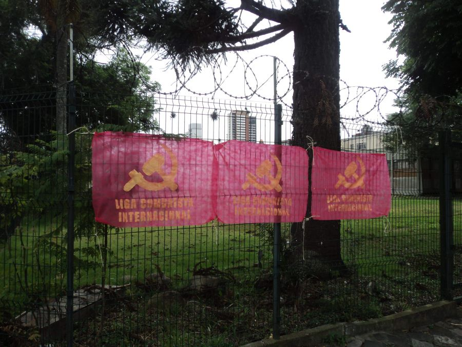Flags lined on Westphalen Street, corner with av. Iguaçu, in the center of 
 Curitiba(PR). Photo: Database and 

 **** 

 Bandeiras lit in the Pardinho Pardinho Square, in downtown Curitiba(PR). Photograph: 
 Database and 

 **** 

 Bandeiras lit in the Pardinho Pardinho Square, in downtown Curitiba(PR). Photograph: 
 Database and 

 **** 

 Flag Iada on Immaculate Conceição Street, in Curitiba(PR). Photo: Bank of 
 Data and 

 **** 

 Flags lifted at the Pontifical Catholic University Station(PUC), in 
 Curitiba(PR). Photo: Database and 

 **** 

 Bandeiras Içada at the Manuel Ribas State College in Curitiba(PR). Photograph: 
 Database and 

 Flags lifted on Avenida das Torres, in Curitiba(PR). Photo: Database 
 And 

 **** 

 Flags lined on the viaduct of Avenida Comendador Franco, in Curitiba(PR). 
 Photo: Database and 

 **** 

 Flag that is awarded near the Terminal of Bairro Alto, Curitiba(PR). Photo: Bank 
 of data and 

 Bandeira Iada on Ribeira Road, Atuba neighborhood, Curitiba(PR). Photo: Bank 
 of data and 

 Flag Iada Nex. Fagundes Varela Station, av. Green Line, Curitiba(PR). Photo: Database and 

 Flag Iada Nex. Fagundes Varela Station, av. Green Line, Curitiba(PR). Photo: Database and 

 Flag Iada Nex. Fagundes Varela Station, av. Green Line, Curitiba(PR). Photo: Database and 

 Flag Iada Nex. Fagundes Varela Station, av. Green Line, Curitiba(PR). Photo: Database and 

 Flag I gave on the Régis Bitencourt Highway, Atuba neighborhood, Curitiba(PR). Photograph: 
 Database and 

 Flag I gave on the Régis Bitencourt Highway, Atuba neighborhood, Curitiba(PR). Photograph: 
 Database and 

 Black flags on the Régis Bitencourt Highway, Atuba neighborhood, Curitiba(PR). 
 Photo: Database and 

 Flag Iaded on Av. Bad. Mascarenhas de Morais direction Colombo, neighborhood 
 Atuba, Curitiba(PR). Photo: Database and 

 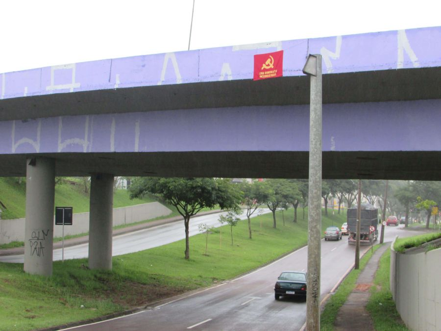Flag Iaded on Av. Bad. Mascarenhas de Morais direction Colombo, neighborhood 
 Atuba, Curitiba(PR). Photo: Database and 

 Bandered Flag in the Verde Line, Viaduct of Bairro Alto, Atuba neighborhood, Curitiba(PR). Photo: Database and 

 Bandered Flag in the Verde Line, Viaduct of Bairro Alto, Atuba neighborhood, Curitiba(PR). Photo: Database and 

 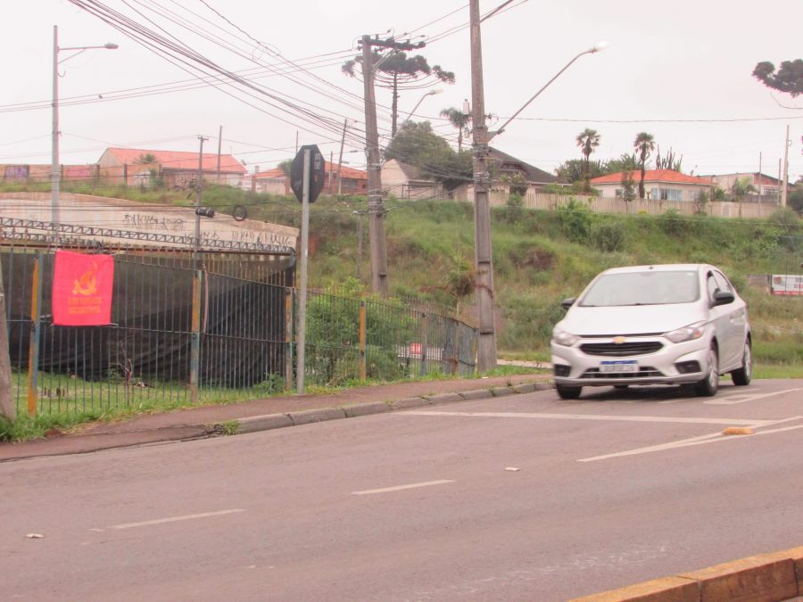Flag Iaded on Av. Monteiro Tourinho, Atuba neighborhood, Curitiba(PR). Photograph: 
 Database and 

 Flag Iaded on Av. Monteiro Tourinho, Atuba neighborhood, Curitiba(PR). Photograph: 
 Database and 

 **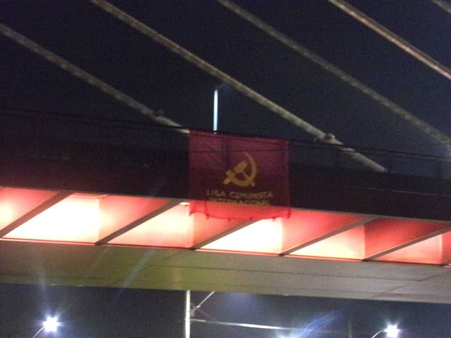** 

 Flag Iada on the Estaiado Viaduct, Guabirotuba neighborhood, in Curitiba. Photograph: 
 Database and 

 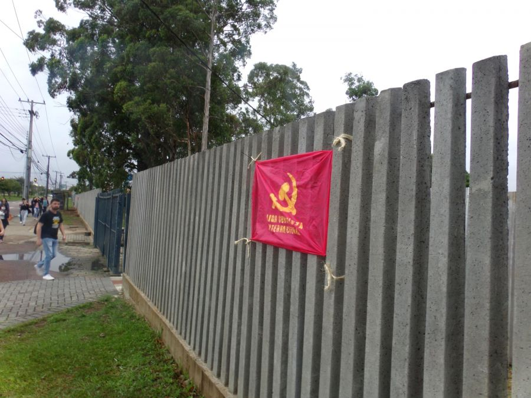Flag that was linked at the Polytechnic Center of UFPR, Jardim das Americas neighborhood, in 
 Curitiba. Photo: Database and 

 Flag that was linked at the Polytechnic Center of UFPR, Jardim das Americas neighborhood, in 
 Curitiba. Photo: Database and 

 Flag that was linked at the Polytechnic Center of UFPR, Jardim das Americas neighborhood, in 
 Curitiba. Photo: Database and 

 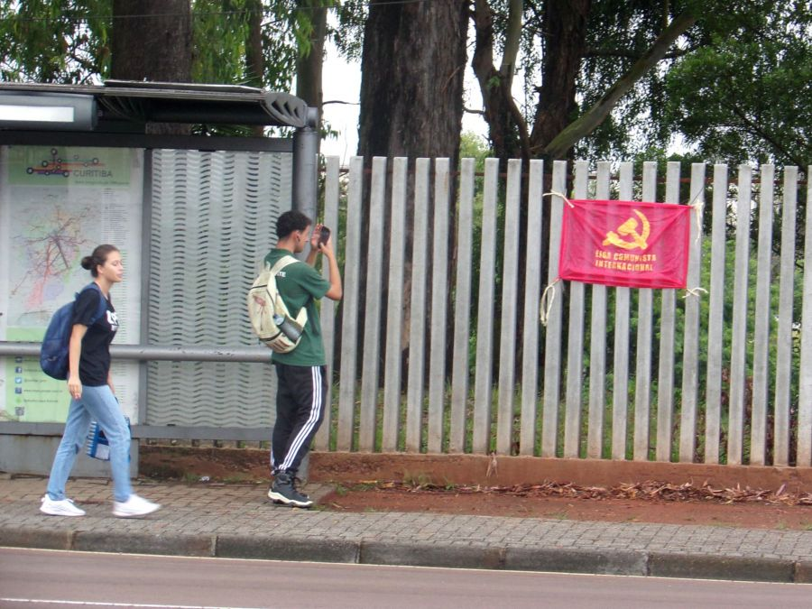Flag that was linked at the Polytechnic Center of UFPR, Jardim das Americas neighborhood, in 
 Curitiba. Photo: Database and 

 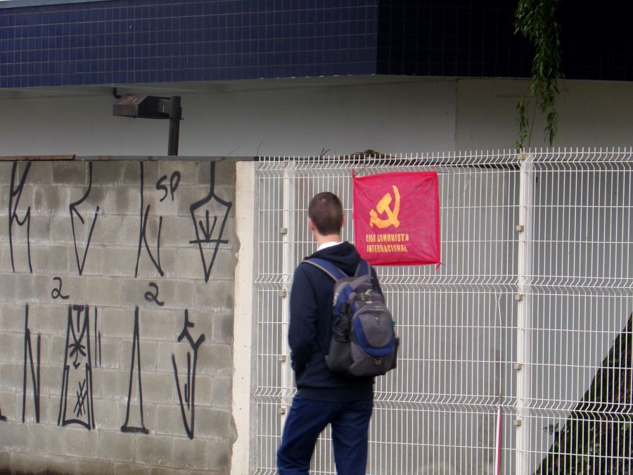

Photo: Database and 

 Flag that is awarded in the trench of BR 277 above Rodolpho Senff Street, among the 
 Cajuru and Jardim das Americas neighborhoods in Curitiba. Photo: Database and 

 Picking in Maringá, municipality of Paraná. Photo: Database and 

 Picking in Maringá, municipality of Paraná. Photo: Database and 

 Picking in Maringá, municipality of Paraná. Photo: Database and 

 Picking in Maringá, municipality of Paraná. Photo: Database and 

 Flags lined on Leopoldo Jacomel Avenue, downtown Pinhais. Photo: Bank 
 of data and 

 Flags lined in Jacarezinho Street, Pineville neighborhood, city of Pinhais. 
 Photo: Database and 

 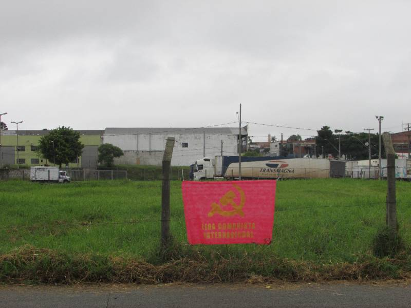Flags lined in Rua Alto Paraná, Emiliano Perneta neighborhood, in Pinhais. 
 Photo: Database and 

 Bandeiras avenue on Maringá Avenue, Emiliano Perneta neighborhood, in Pinhais. 
 Photo: Database and 

 Bandeiras on Jacarezinho Street, Alto Tarumã neighborhood, in Pinhais. Photograph: 
 Database and 

 Flags lined on Jacob Macanhan Avenue, Centro neighborhood, in Pinhais. Photograph: 
 Database and 

 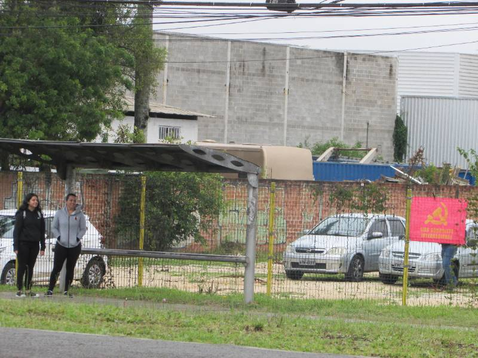Bandeiras avenue on Maringá Avenue, Emiliano Perneta neighborhood, in Pinhais. 
 Photo: Database and 

 Bandeiras lit on Avenida Maringá, Atuba neighborhood, in Pinhais. Photo: Bank of 
 data and 

 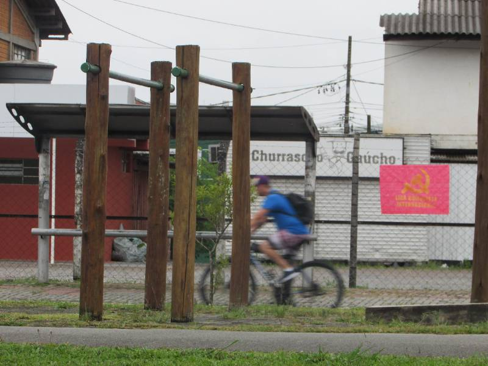Bandeiras Avenida Maringá Avenue, left. with Leopoldo Jacomel Avenue, in 
 Pinemers. Photo: Database and 

 Bandeiras avenue on Maringá Avenue, Emiliano Perneta neighborhood, in Pinhais. 
 Photo: Database and 

 Bandeiras avenue on Maringá Avenue, Emiliano Perneta neighborhood, in Pinhais. 
 Photo: Database and 

 Içada Flags Avenida Leopoldo Jacomel, border with Curitiba, in Pinhais. 
 Photo: Database and 

 Bandeiras on Jacarezinho Street, Pineville neighborhood in Pinhais. Photo: Bank 
 of data and 

 Flags lined on Floral Street, Alto Tarumã neighborhood, in Pinhais. Photo: Bank of 
 data and 

 Içada flags Jacarezinho Street, Alto Tarumã neighborhood, in Pinhais. Photo: Bank 
 of data and 

 Flags lifted at the Arizona Cultural and Sports Center, Bairro Alto Tarumã in 
 Pinemers. Photo: Database and 

 Bandeiras Avenida Maringá Avenue, Emiliano Perneta neighborhood in Pinhais. Photograph: 
 Database and 

 Bandeiras avenue on Maringá Avenue, Emiliano Perneta neighborhood, in Pinhais. 
 Photo: Database and 

 Flags lifted in the Bordignon Municipal Grove, Pineville neighborhood, in Pinhais. 
 Photo: Database and 

 Flag avenue in Jacob Macanhan Avenue, Pineville neighborhood in Pinhais. Photograph: 
 Database and 
 **MINAS GERAIS** 
 **** 

 Flags lifted on the ore road, in the road ring, Belo Horizonte(MG). 
 Photo: Database and 

 > 
 > [#National](https://twitter.com/hashtag/Nacional?src=hash&ref_src=twsrc%5Etfw)> | We received in our electronic mail filming of flags lifted in 
 > Celebration The Foundation of the International Communist League(LCI). Information 
 > point out that the location of the shelves is Belo Horizonte(MG).
> [pic.twitter.com/wRYnjIxwjZ](https://t.co/wRYnjIxwjZ)> 
 > - The new democracy(@jornaland)[January 30,
> 2023](https://twitter.com/jornaland/status/1620078629773512704?ref_src=twsrc%5Etfw)****

**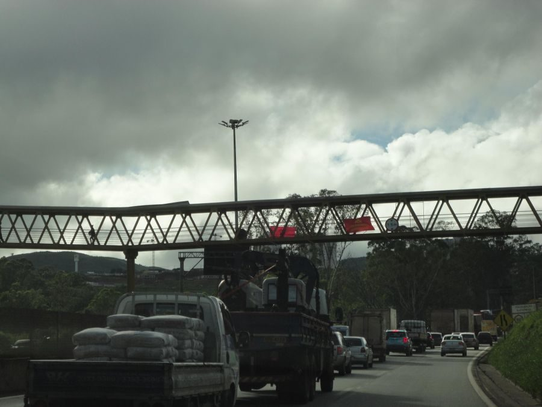** 

 Flags lifted on the ore road, in the road ring, Belo Horizonte(MG). 
 Photo: Database and 

 **** 

 Flags lifted on the Shopping Del Rey catwalk, in the Ring Road, Belo 
 Horizon(MG). Photo: Database and 

 **** 

 Flags lifted on the Shopping Del Rey catwalk, in the Ring Road, Belo 
 Horizon(MG). Photo: Database and 

 **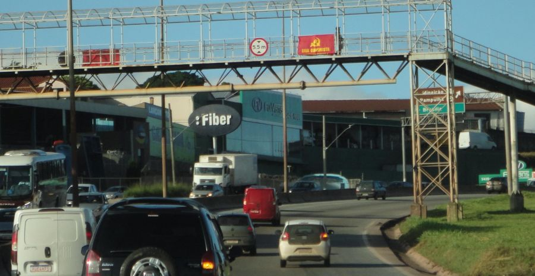** 

 Flags lifted on the São Francisco Viaduct, in the Road Road, Belo Horizonte(MG). Photo: Database and 

 **** 

 Flags lifted on the ore road, in the road ring, Belo Horizonte(MG). 
 Photo: Database and 

 **** 

 Flags lifted on the São Francisco Viaduct, in the Road Road, Belo Horizonte(MG). Photo: Database and 

 **** 

 **** Flag Iaded in Montes Claros(MG). Photo: Database and
Flag Iaded in Montes Claros(MG). Photo: Database and 

 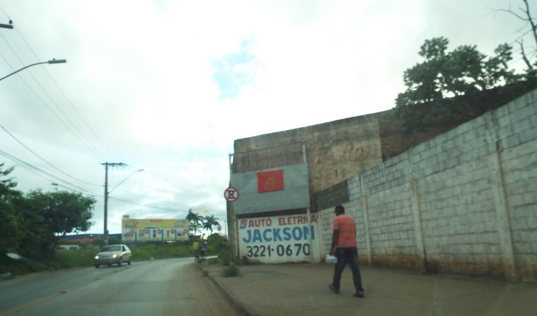Flag Iaded in Montes Claros(MG). Photo: Database and 

 **** 

 **** Flag Iaded in Montes Claros(MG). Photo: Database and 

 **** 

 **** Flag Iaded in Montes Claros(MG). Photo: Database and 

 **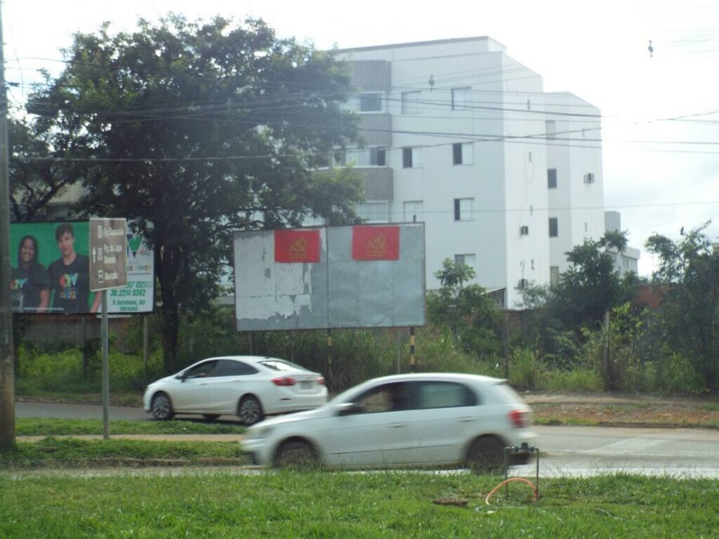** 

 **** Flag Iaded in Montes Claros(MG). Photo: Database and 

 **** 

 Flag Iaded in Montes Claros(MG). Photo: Database and 

 **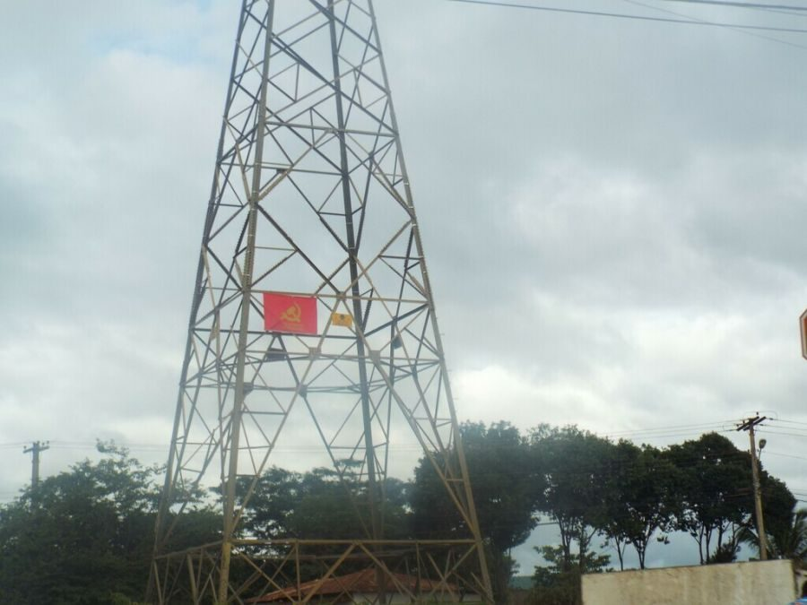** 

 Flag Iaded in Montes Claros(MG). Photo: Database and 

 **** 

 Graffiti found in the road ring in Belo Horizonte(MG). Photo: Bank of 
 Data and 

 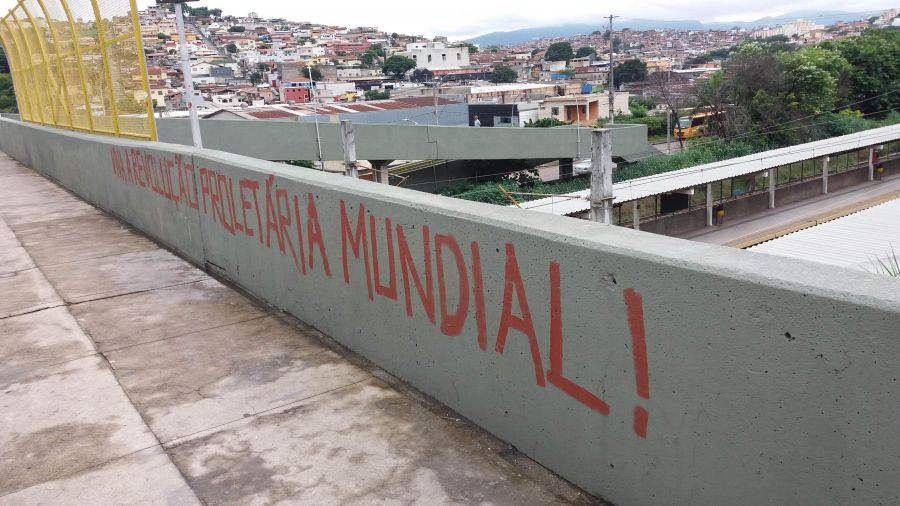Graffiti found in Vila Oeste, in Belo Horizonte(MG). Photo: Bank of 
 Data and 

 Graffiti found in Vila Oeste, in Belo Horizonte(MG). Photo: Bank of 
 Data and 

 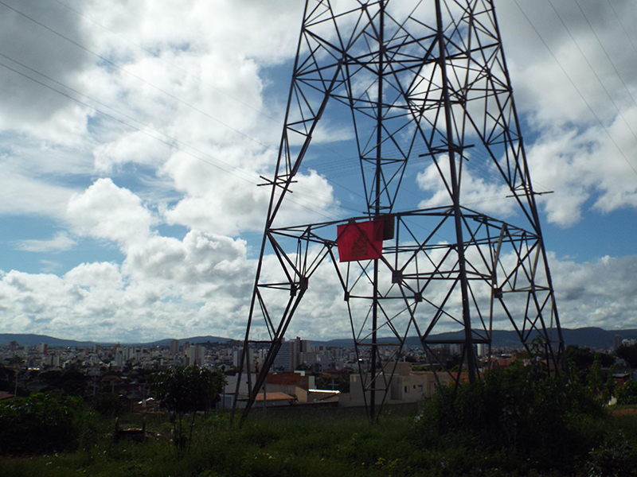Flag that was aveiled in Electric Tower in the north of Minas Gerais. Photo: Database and 

 Flag that is linked in the north of Minas. Photo: Database and 

 Flag Iaded in Urbano, North of Minas. Photo: Database and 

 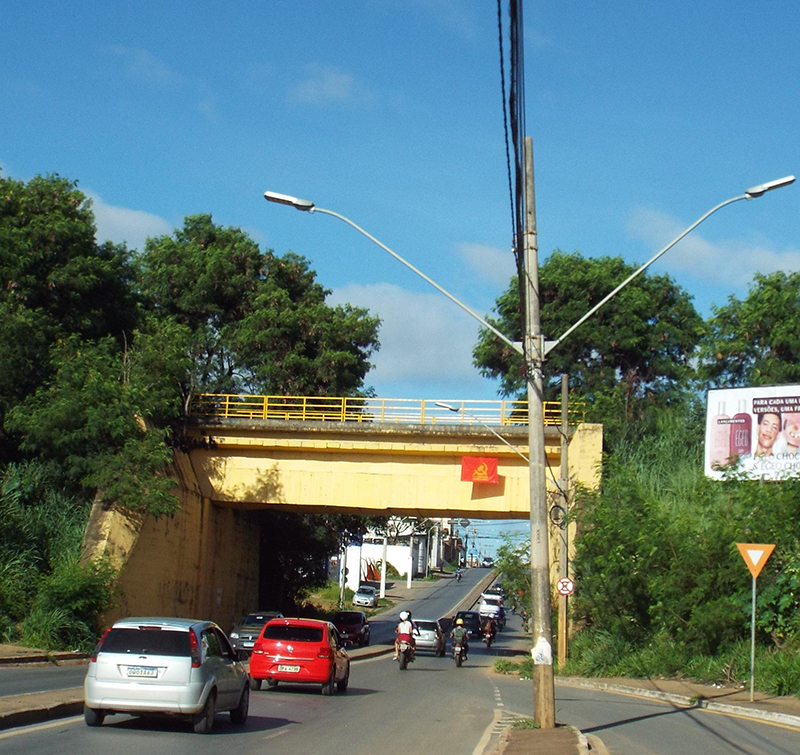Photo Iaded in Ponte in the north of Minas. Photo: Database and 

 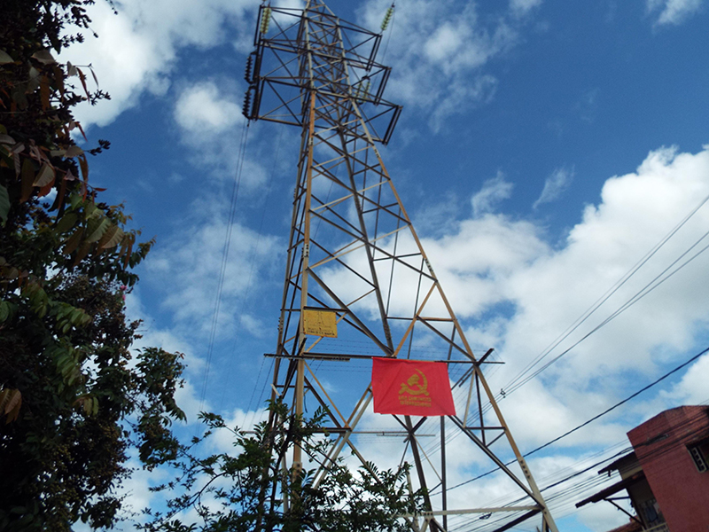Electric Tower with Iaded Flag, North of Minas. Photo: Database and 

 **SAO PAULO** 

 **** 

 Graffiti found in the periphery of Campinas(SP). Photo: Database and 

 **** 

 Graffiti found on the Anhanguera Highway, in Campinas(SP). Photo: Bank of 
 Data and 

 **** 

 Graffiti found in the west of São Paulo(SP). Photo: Database and 

 **** 

 Graffiti found in Guarulhos(SP). Photo: Database and 

 **** 

 Graffiti found in Guarulhos(SP). Photo: Database and 

 **** 

 Picking sight in Campinas(SP), next to a periphery of the city, in a 
 avenue of large circulation of workers. Photo: Database and 

 Flag Iada in Campinas(SP). Photo: Database and 

 Flag Iaded in Guarulhos(SP). Photo: Database and 

 Flag Iaded in Guarulhos(SP). Photo: Database and 

 > Video sent to the newsroom of and: at the turn of the year, at midnight on 12/31, 
 > The international communist league flag was placed on the tea viaduct, 
 > Center of São Paulo, next to City Hall. 
 > [pic.twitter.com/bd4lhm0jzn](https://t.co/Bd4lhm0jzN)> 
 > - The new democracy(@jornaland)[January 9,
> 2023](https://twitter.com/jornaland/status/1612522186450866177?ref_src=twsrc%5Etfw)RIO DE JANEIRO 

 > 
 > [#National](https://twitter.com/hashtag/Nacional?src=hash&ref_src=twsrc%5Etfw)> | Flags and graffiti celebrating the foundation of the Communist League 
 > International(LCI)were recorded and sent to the newsroom of and. Second 
 > Information, the place of filming is the northern zone of Rio de Janeiro. 
 > [pic.twitter.com/yl0uguly35](https://t.co/yl0UgULY35)> 
 > - The new democracy(@jornaland)[January 23,
> 2023](https://twitter.com/jornaland/status/1617602519261392898?ref_src=twsrc%5Etfw)Flag Iada in Passarela at Av Pelé, in São Cristóvão, Rio de Janeiro(RJ). 
 Photo: Database and 

 Flag Iada in Passarela in São Cristóvão, Rio de Janeiro(RJ). Photo: Bank 
 of data and 

 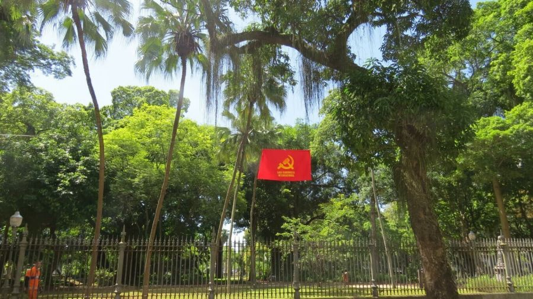Flag Iaded on the Public Ride, downtown Rio de Janeiro(RJ). Photo: Bank 
 of data and 

 Flag Iaded on the Public Ride, downtown Rio de Janeiro(RJ). Photo: Bank 
 of data and 

 Flag Iada on Radial West catwalk, in Rio de Janeiro(RJ). Photo: Bank 
 of data and 

 Lapa flag in Lapa, downtown Rio de Janeiro(RJ). Photo: Database 
 And 

 Flag Iaded in Cinelândia, downtown Rio de Janeiro(RJ). Photo: Bank of 
 Data and 

 Flag Iaded in Cinelândia, downtown Rio de Janeiro(RJ). Photo: Bank of 
 Data and 

 Graffiti found at the Thomáz Coelho Metro Station at the entrance of the favela 
 Oath, in Rio de Janeiro(RJ). Photo: Database and 

 Flag of the International Communist League in the North Zone of Rio de Janeiro. 
 Photo: Database and 

 

Data and 

 Flag of the International Communist League in São Francisco Metro Post 
 Xavier. Photo: Database and 

 Flag Iaded in the Jacarezinho favela, in Rio de Janeiro. Photo: Bank of 
 data and 

 Flag on catwalk 13 at av. Brazil. Photo: Database and 

 Flag on catwalk 12 of Avenida Brasil, in the capital. Photo: Database 
 And 

 Flag on catwalk 14 of Avenida Brasil. Photo: Database and 

 Flag Iaded at Meier Station, in the Capital. Photo: Database and 

 Nova America station, in the state capital. Photo: Database and 

 Metro Maria da Graça Station, in the state capital. Photo: Database 
 And 

 Flag on the catwalk of the Olaria neighborhood train in the capital. Photo: Bank of 
 data and 

 Maria da Graça's cefet court in the capital. Photo: Database and 

 Graffiti at Rua João Paulo First, Estácio, Rio de Janeiro. Photo: Bank of 
 Data and 

 Viaduct graffiti near the Paulo de Frontin viaduct, which connects North Zones 
 and southern Rio de Janeiro. Photo: Database and 

 SANTA CATARINA 

 Flags with the sickle and hammer with the inscription "Communist League 
 International "on the catwalk of Terminal Rita Maria, in the center of 
 Florianópolis. Photo: Database and 

 Flags with the sickle and hammer with the inscription "Communist League 
 International "on the catwalk of Terminal Rita Maria, in the center of 
 Florianópolis. Photo: Database and 

 **** 

 ****RIO GRANDE DO SUL 

 Flags lifted at the Federal University of Rio Grande do Sul, in the center of 
 Porto Alegre(RS). Photo: Database and 

 Flag iIda in the south of Porto Alegre(RS). Photo: Database and 

 Flags lined at the Federal University of Rio Grande do Sul(UFRGS), in the zone 
 East of Porto Alegre(RS). Photo: Database and 

 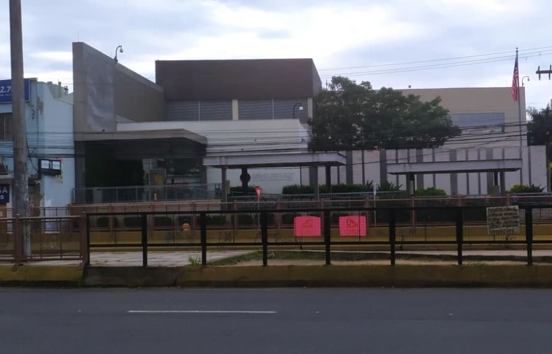Bandeiras Içada in Porto Alegre(RS). Photo: Database and 

 MATO GROSSO DO SUL 

 LCI Flag in Dourados(MS). Photo: Database and 

 Graffiti in Dourados(MS). Photo: Database and 

 LCI Flag in Dourados(MS). Photo: Database and 

 LCI Flags in Dourados(MS). Photo: Database and 

 LCI Flag in Dourados(MS). Photo: Database and 

 LCI Flag in Dourados(MS). Photo: Database and 

 Picking in Dourados, Mato Grosso do Sul. Photo: Database and 

 Picking in Dourados, Mato Grosso do Sul. Photo: Database and 

 **** 

 ** Amazonas ** 

 Flags placed at the Federal University of Amazonas. Photo: Database 
 And 

 Graffiti found in Manaus, state capital. Photo: Database and 

 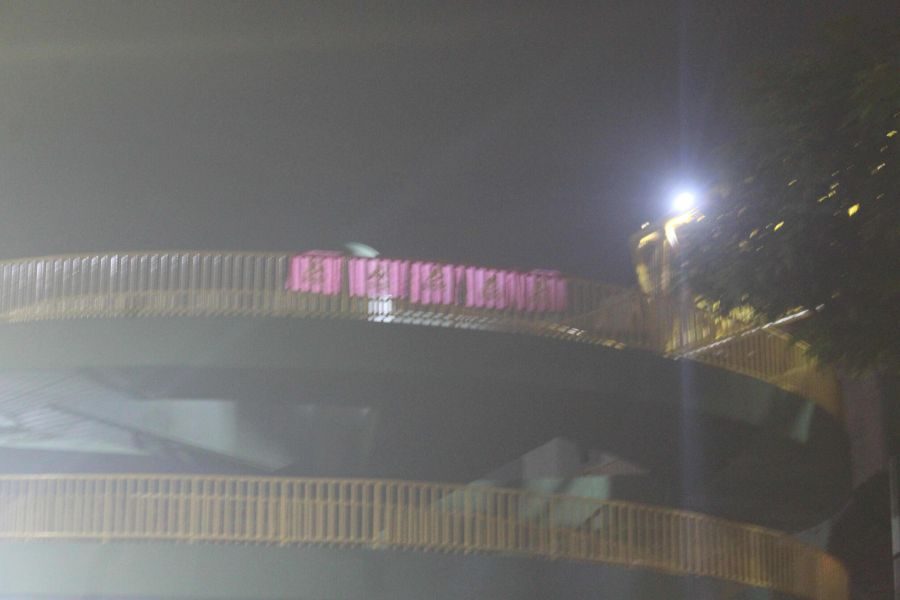Flags at the State University of Amazonas. Photo: Database and 

 Flags at Pedro II College in Manaus. Photo: Database and 

 Flags at the Federal Institute of Amazonas in Manaus. Photo: Database and 

 Flags on the Carrefour market of Av. Djalma Batista in Manaus. Photo: Bank of 
 data and 

 Flags in the Matrix Square in Manaus. Photo: Database and 

 Flags at Arena da Amazônia Stadium. Photo: Database and 

 ** Goiás ** 

 Graffiti found in the city of Goiânia, in Goiás. Photo: Reproduction/ CI-IC 

 ****

News Source: [https://anovademocracia.com.br/noticias/18567-acoes-celebram-fundacao-da-lci-no-brasil](https://anovademocracia.com.br/noticias/18567-acoes-celebram-fundacao-da-lci-no-brasil)

<!--NEWS-->

# Brazil: Urgent denunciation: PM performs peasant slaughter in Nova Mutum/RO (Cebraspo)

<!--METADATA-->

###  

Cebraspo issues Abrapo's note about recent murders and torture of 
 Peasants by the Military Police of Rondônia, who makes the safety of the grinker 
 of "old rooster" public lands with the resources of taxes that the population 
 pay. 

 We sympathize with the families and companions of these peasants and 
 we defend the sacred right to the earth for those who work in it, especially 
 At this time when hunger and unemployment plague the country. We understand and 
 we support all those who want to live a dignified life through their 
 work. Public land in Brazil has as its constitutional destination 
 land reform and not the private interests of land grabbers, these, thieves 
 of public lands. We repudiate these massacres against the poor people of the field and 
 attempts at criminalization. 

  

  ** LCP denounces murder of peasants in Nova Mutum Paraná ** 
  
 Abrapo received the statement from the League of Poor Peasants denying the 
 shooting allegations between the LCP and the police forces during an operation of 
 repossession, and denouncing that torture and executions were carried out 
 peasants summary. 
  
 In addition, it denounces the cowardity of Rede Globo, which incited the 
 repression, avoided mentioning LCP and accused the peasants of "possible 
 criminals ". 
 Meanwhile, he omitted that the region is part of one of the various areas 
 Pliladed by the landlord Antônio Martins dos Santos, known as Galo 
 Old, investigated by the civil and federal police, together with the 
 Prosecutor, for the financing of gunmen in the region for the 
 land grabbing and expulsion of peasants. 
  
 Important that all democrats mobilize to unmask the tormentors of the 
 people and disassemble this scam, by the disclosure of the complaint made from the 
 LCP!

 Posted by [Cebraspo](https://www.blogger.com/profile/12198195616986210100
"author profile")

News Source: [http://dazibaorojo08.blogspot.com/2023/01/brasil-denuncia-urgente-pm-executa.html](http://dazibaorojo08.blogspot.com/2023/01/brasil-denuncia-urgente-pm-executa.html)

<!--NEWS-->

# From Mirafiori: the voice and the strong denunciation of the workers. The MFPR and the Slai workers Cobas Sc prepare an initiative in Mirafiori in the week of March 8th

<!--METADATA-->

On January 24 we intervened in Mirafiori with the Slai Cobas for the union 
 class. 

 We talked to many workers. 

 The workers tell of a very serious factory situation, but they are 
 agree that without the struggle of the workers and workers they cannot be there 
 results, but that there is fear, individualism, it is thought that there is nothing more 
 to do'; "The basic problem, you know, is fear, the strike is no longer done. 
 If we make the strikes here, pay the consequences. Come to 
 do the worst jobs, apart from beautiful here there is nor, however, though 
 you have to rebel all of them together ... outside we have a life, one 
 home". 

 Other workers confirm: "Yes, more and more, I have been working for 30 years, arrival from 
 Grugliasco who closed, I ruined my back in line, they don't keep 
 In consideration the problems, but at the end of the month you have to pay the rent ... "; 
 "After 30 years of work you don't even have the health care that takes care of you. If you don't have 
 money do time to die ... ";" They don't retire and inside the 
 young people, I am 30 years of work but I have never worked as now, on the line 
 of assembly "," ... it's not that we are so young that they can be on the lines 
 by Assembly; I drive the cart, unloading truck from morning to evening, a 
 56 years I think I have already given ";" Too much work, too much loading, 
 First 10 pieces, now 15. But there are many workers at home!If they divided the 
 work would be better, all the load to us, we will die first ";" High rhythms 
 yes, but also targeted loads to force you to accept your resignation ";" Me 
 I work three days a week, but I can't take it anymore. I see that others in 
 Other factories are worse than us, work rhythms, Amazon, 
 Pirkinton ... arrived at a certain age you have to slow down. We have to get out of 
 here. "Left" and right have reduced us to this state ... ". 

 To them we say: we must put all our energies to build 
 an alternative, we are not here to tell the workers, but to work together 
 to build the way out. 

 We talk about preparing an assembly to join the workers who are not there to 
 This life, but we must build it together. The workers are not there more 
 As you work in the factory, but complaining or protesting one by one, 
 We work together for an assembly of workers in the week of 8 
 March. 

 Other workers strengthen the complaint of factory conditions and how yes 
 It is treated: "It's sucks, I have the 7 year old girl don't even give me the 
 days, they make me the proposals: if you come to me on a Saturday or two I will come to you 
 I find. They want me to go for 18 compulsory Saturdays, up to 
 September ... Meeting? I have the 7 year old girl and I have to work, one day 
 I come here and the girl I leave her to the cage and I enter work!It's right?" 

 We reply: "How they treat you, you are right to rebel, but it is right that the 
 Do you protest her alone? And the other workers? Because you don't do it together, 
 And does your little girl become our struggle? There are the possibilities if the 
 we are looking for ... we have to overturn this situation, because even to obey 
 You don't save you the same, targeted rhythms and loads, it is a factory that you 
 crushed. "she reflects on the collective size of the protest" yes 
 True, it can be done, and for the assembly I speak with the colleagues in the ward ". 

 Other rumors about the fight: "I came from Rivalta, I made a strike, 
 They were all who cried, I went out on my own ... we went out to do the 
 processions but nothing has changed ";" Nobody is more willing to put strike, or if 
 You do one then they don't go further, the bills have increased, the people 
 In here they are not willing to lose money. I have seen struggles but 
 Nothing has changed. Grugliasco, Rivalta, Maserati ... have closed ";" But the 
 Pensions, health care have brought them the workers with the struggle ... ". 

 In general, the workers, more than the workers, wanted to speak, and some 
 they were clearly critical of confederal unions, delegates "who 
 They are 'sitting to do nothing "compared to what happens in 
 factory; "We have already told the unions inside our problems, but more 
 they can't do so much. 

 But it is not enough to make only the list of misfortunes, first when the workers 
 they had the struggle in their hands, the worker movement filled these avenues, 
 We have to try again. The strength of the workers is when they organize themselves for the 
 own interests. For this we must build an autonomous assembly for 
 unite, organize, give perspective to the workers and workers who in factories 
 They want to oppose. For this we brought to the signs and in the flyer
Terra 'in Rome on February 18 **, in which we will organize for Mirafiori 
 The initiative in the week of March 8.

News Source: [https://femminismorivoluzionario.blogspot.com/2023/01/da-mirafiori-la-voce-e-la-forte.html](https://femminismorivoluzionario.blogspot.com/2023/01/da-mirafiori-la-voce-e-la-forte.html)

<!--NEWS-->

# SP: residents block highway Presidente Dutra against eviction

<!--METADATA-->

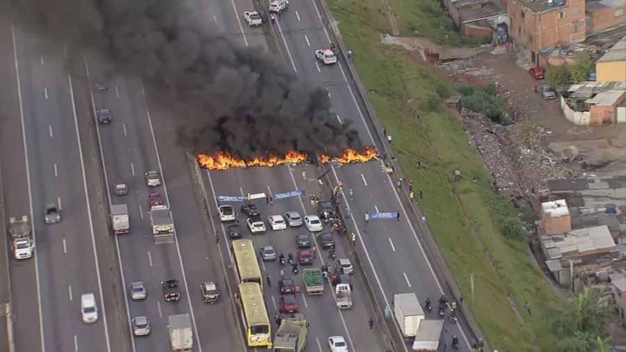Residents of the SATA community block President Dutra in Guarulhos 
 against eviction. Photo: Reproduction/TV Globo 

 Residents of the community of SATA, in Guarulhos(região metropolitana de São
Paulo), blocked with flame tires the Presidente Dutra Highway, which connects SP 
 to Rio de Janeiro. The combative manifestation began on the morning of the 31st 
 January and lasted about two hours. The masses protested against an action of 
 eviction moved by the city that threatens to destroy the homes of at least 33 
 Families, and carried banners stating that they lived there for over 40 years. 

 City Hall seeks to promote since December last year the eviction of 
 Families, claiming that the area is at risk of floods. Offers, in return, a 
 social rental rental R $ 400 reais, ignoring the fact that the rent of the 
 city of Guarulhos is the most expensive among the cities of the metropolitan region 
 from São Paulo, according to research by Zap Real Estate. Residents performed 
 At least three highway blocks ever since. 

 Residents of the SATA community block President Dutra in Guarulhos 
 against eviction. Photo: Reproduction/TV Globo 

 ** Municipalities launch thousands of families on the streets ** 

 City halls of the metropolitan region of São Paulo have poured thousands of 
 Families in recent years, leaving them without having nowhere to live. Even during the law 
 of suspension of eviction during the COVID-19 pandemic, which watched until 
 October 2022, the Judiciary of the State of São Paulo was responsible for 
 more than half of the complaints filed for non -compliance with the decision. 

 In May 2022, the City of Carapicuíba promoted the eviction of at least 
 700 residents of the Vila Municipal community. The masses fought combatively 
 by guaranteeing your housing, promoting blockages with flame tires and 
 facing the cowardice of the forces of repression with stones and sticks. 

#### [Read also: SP: residents resist the eviction in 
 Carapicuíba](https://anovademocracia.com.br/noticias/17524-sp-moradores-resistem-contra-despejo-em-
carapicuiba)In August, a repossession reintegration in the East Zone of São Paulo left 
 dozens of residents injured by rubber bullets and gas pumps 
 tear, including pregnant women and a newborn baby. In 
 November, about 100 families from the Maracanã community in Santo André 
 protested against the repossession of the community and set fire to two 
 bus. 

 Meanwhile, from 2019 to 2022, more than 10,000 people began to live in 
 streets of the state of São Paulo, according to a survey of the Federal University of 
 Minas Gerais(UFMG).

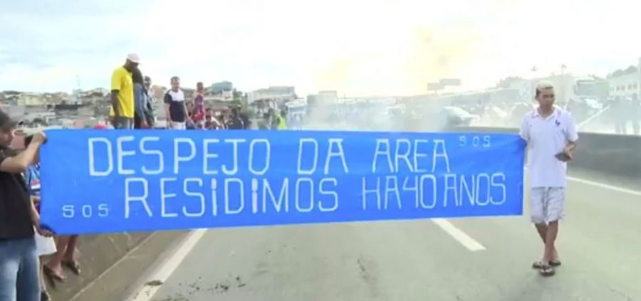Residents of the SATA community block President Dutra in Guarulhos 
 against eviction. Photo: Reproduction/TV Globo 

 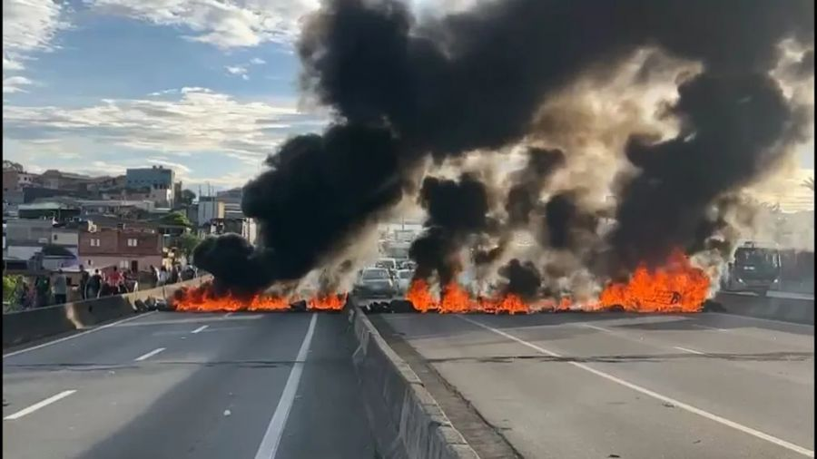Residents of the SATA community block President Dutra in Guarulhos 
 against eviction. Photo: Reproduction/TV Globo

News Source: [https://anovademocracia.com.br/noticias/18632-sp-moradores-bloqueiam-rodovia-presidente-dutra-contra-despejo](https://anovademocracia.com.br/noticias/18632-sp-moradores-bloqueiam-rodovia-presidente-dutra-contra-despejo)

<!--NEWS-->

# Anthology The Fight for Earth: Selection of Finalist Texts of the First Literary Contest of and

<!--METADATA-->

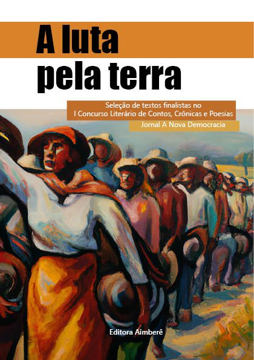Cover of the anthology of finalist texts of the 1st newspaper Literary Contest 
 New democracy 

 Is now available for _download_ the digital book result of the realization of the 
 I Literary Tales, Chronicles and Poetry Contest organized by the newspaper A 
 New democracy. 

 The event was part of the 20th anniversary celebrations and concluded in 
 December 2022 with the award in a large event held in the city of 
 Rio de Janeiro. 

#### ** Read more: ** [and concludes your I Literary Contest with Great 
 awards' ceremony ](https://anovademocracia.com.br/noticias/18493-and-conclui-seu-i-concurso-literario-
com-grande-cerimonia-de-premiacao)In this anthology there are all the finalist works in the tales categories, 
 Chronicles and poetry, with emphasis on the winners and an honorable mention 
 in the chronic category. 

 The file can be downloaded [** here **](https://heyzine.com/flip-
book/7e3e4fe31a.html)and is available for large sharing and 
 disclosure.

News Source: [https://anovademocracia.com.br/noticias/18624-antologia-a-luta-pela-terra-selecao-de-textos-finalistas-do-i-concurso-literario-do-jornal-a-nova-democracia](https://anovademocracia.com.br/noticias/18624-antologia-a-luta-pela-terra-selecao-de-textos-finalistas-do-i-concurso-literario-do-jornal-a-nova-democracia)

<!--NEWS-->

# Brazil Agrarian Studies: Campesina Lucha »Police kill peasants during attack on families

<!--METADATA-->

** Complete Noticia Translated: ** 

  ** Home »Peasant Fight» Police kill peasants during attack on 
 families ** 

  ** Peasant fight ** 

  ** A murderer police officers during attack against families ** 

  ** Written by LCP of Rondônia and Amazonia Wests | Published on January 30 
 of 2023 ** 

  ** We reproduce below a note received from the Peasants League 
 Poor of the Western Amazon ** 

 Compairs Raniel Barbosa Laurindo, conocidated as "mandruvá" 

 [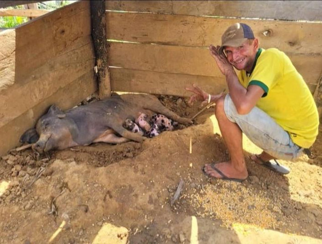](https://i.ibb.co/GvMY3dm/esticado-nova.jpg)Companero Rodrigo 
 Hawerroth, connoid as "stissued" 

  ** 
 ** 

  **** 

  ** A murderer police officers during attack against families ** 

 On January 28, in the district of Nova Mutum Paraná, rural area of Porto 
 Velho, police battalion police officers(BOPE)They murdered two 
 peasants and seriously wounded another with rifle shots during a 
 Arbitrary operation of the military police against peasant families in the area 
 Tiago Campim dos Santos. 

 A few days ago, hundreds of peasant families took the rest of the 
 Norbrasil Treasury lands, located in public lands owned by the 
 Union, which was taken by the landowner Antônio Martins dos Santos, 
 known as Galo Velho, a famous thief land, denounced in numerous 
 occasions, even recently detained in the "Lamassu" operation per action 
 of the Public Ministry of the Federation. Galo Velho, in addition to Grileiro( se dice de quien mete titulos falsificados de tierras públicas a una gabeta
con grillos para que estos con sus escrecencias los hagan aparecer como
títulos antiguos), public land thief belonging to the Union, is 
 Peasants murderer, and it is known that he finances and maintains an armed band 
 composed of police, and that even after their arrested for this reason, 
 Continue acting in the same way. Even on the 22nd, Galo gunmen 
 Velho in a black truck shot at families, men, women and 
 unarmed children. 

 To defend the privileges and illegal interests of Galo Velho, the police 
 Military of Governor Coronel Marcos Rocha, the head of the landowners, the 
 January 28 sent dozens of vehicles, drones and at least three PM battalions 
 To attack the families that were in the area fighting for the right to 
 Earth work. 

 A part of the police contingent reached BR 364, shooting weapons and 
 pulling bombs to families. There were also other police located 
 surreptitiously at different points, behind the sides of the place where 
 families concentrated. Galo Velho bandit guns too 
 They were ambushed, working side by side with the PM, particularly with the 
 BOPE police. When families moved away from the shots and effects of 
 The gases of the bombs launched by the police, some of these families 
 They crossed a river that cuts the interior of the area, and at that time they were 
 Surprised by Bope Killer Police. that shot three peasants. 
 These colleagues were arrested alive, and the settlers claim that 
 They were fine and speaking when the cowards of the PM arrested them, but two 
 of them were executed in the middle of the road. 

 The murdered colleagues were workers, Rodrigo Hawerroth, known as 
 "Estucado", was a former neighbor, very dear to everyone. And the partner 
 Raniel Barbosa Laurindo, known as "Mandruvá", was a determined young man who 
 He wanted to conquer his land to live dignity. 

 It is not the first time that the bope, that band of hitmen, uniformed bandits, 
 Mata peasants in this region. Always acting totally 
 arbitrary and bloodthirsty, seek in vain to terrorize families in a 
 attempt to stop the peasant fight for the earth to serve the 
 interests of thieves landowners. Thus they murdered the Companheiros 
 Amarildo, Amaral and Kevin in August 2021, to the Companheiros Gedeon and 
 Rafael, in October 2021, among other peasants. 

 And as always, to justify their crimes and murders in cold blood, 
 Police assemble their farce, they always tell their storys saying that there was a 
 armed confrontation, shots exchange, or something like that, and seek to slander 
 to its victims as the worst criminals, and thus absurdly justify the 
 Practice of summary executions, which for some time has occurred in the 
 unfair and reactionary war that is fought against the poor of the city and 
 of the field. The truth is that, once again, they cowardly murdered 
 Peasants, working, poor and unarmed people. 

 The monopolies of the press and the junk press in Rondônia, as always, 
 They play their role as police and landowners. When do not 
 shut up, they limit themselves to repeating as parrots the "communications" distributed to 
 The press for the police, or worse, increase lies to distort
Check information, listen to different sources, etc., basic issues and 
 Minimum for anyone who intends to do serious journalism. But that would be 
 ask too much about you!It is much easier to continue in the comfort of their 
 writings, distilling hatred against the poor, mainly the peasants 
 In struggle for Earth, always treated by you as if you were bandits, 
 While covering the crimes of the true criminals, of that 
 landless landowner, from politicians of various types, government and 
 your police, because these are the true patterns that sponsor their 
 Lies with public money. They are liars and cynical!They are 
 accomplices of crimes committed against peasants!

 But the spilled blood of our colleagues does not drown our fight!
 Our flags redden even more, our hatred, our firmness and 
 Our will to fight for a truly fair world. Do not think, 
 Gentlemen, who can always commit your crimes with impunity. 

 Honor and eternal glory to fallen companions in the struggle for Earth!

 Punishment to executors and leaders of the murders of fighters 
 popular!

 Outside our areas, Guaxeba police officers, thieves of 
 Lands of the Union!

 The lands of the Tiago Campim dos Santos area belong to the town!

 Conquest the earth!Destroy the estate!

 Long live the Agrarian Revolution!

 January 29, 2023 

 LCP - Liga de Peasant Poor de la Amazon 

  

 Luta Camponesa 
  
 [Polycia Assassina Camponses during attack against 
 familias](https://resistenciacamponesa.com/luta-camponesa/policia-assassina-
camponeses-durante-ataque-contra-familias/)** Written by LCP from Rondônia and Western Amazon | Published January 30, 
 2023 
  
 We reproduced below a note received from the League of Poor Peasants of the Amazon 
 Western 
  
  
  
 Murder Police Peasant during attack against families ** 
  
 On January 28, in the region of the district of Nova Mutum Paraná, rural area 
 of Porto Velho, police from the Special Operations Battalion(BOPE)murdered two peasants and wounded another seriously with rifle shots 
 During the arbitrary operation of the PM against the peasant families of the area Tiago 
 Campim dos Santos. 

  

 Source. ** Peasant resistance ** 

  

  

  

 \- 

 ** News to _ ** ** Agricultural - Brazil ** ** Studies, research and news **

News Source: [http://vnd-peru.blogspot.com/2023/01/estudios-agrarios-brasil-lucha.html](http://vnd-peru.blogspot.com/2023/01/estudios-agrarios-brasil-lucha.html)

<!--NEWS-->

# People can't afford medicine

<!--METADATA-->

Inflation has risen dramatically in the runningest of the last year and this affects 
 Especially also people whose 'life and health depends on fixed expenses of medicine and 
 treatment every month. 

 Not only that the prices of medicine for various diseases, treatment and 
 rehabilitation in professional therapists increases, then the prices of one rise 
 Lots of other fixed expenses such as rent, heat, gas, food, transport and debt 
 for the masses, leaving even less money for the rising medicine. 

 This leads to more forced to directly opt out 
 medicine while sitting back in cold houses and apartments, with one 
 modest amount of food, to avoid total bankruptcy in the light of the crisis. 

 Many have fixed expenses on medicine and therapy of up to several thousand dollars 
 every month that they have to pay from their own pocket. This is a huge burden on 
 The masses in the country. Meanwhile, the bourgeoisie may where a thousand kroner to or from 
 Medicine expenses a month can't even be felt the system works well, 
 Because they can pay for the medicine without any problems, jump in front of the queue to 
 Treatment by using private hospitals and therapists. 

 But this characterizes an odd health system that repeatedly fails 
 Especially the deepest and widest masses in the country. 

 At the same time, the bourgeois state is repeatedly cutting down on the health care system, for 
 to create tax cuts for the bourgeoisie and to throw more money after 
 weapons and imperialist aggression. 

 At the same time we live in a country with some of the most advanced 
 Productive forces within the pharmaceutical industry, with tons of pills 
 produced every single day. At the same time, pharma companies hold like Novo Nordisk, 
 Artificial price of vital medicine high for the masses both in Denmark, but 
 Especially for the masses in the oppressed nations. 

 Life and Health-Nedic Medicine is a international right and expenses for it to 
 Don't pull the masses that need it down in misery. That 
 Imperialist bourgeoisi should not be allowed to take advantage of people being 
 willing to put their lives at risk to get advice for vital to 
 medicine, or die because they can't afford, for profit. 

 All this reveals the bourgeois health system, the bourgeois Danish state 
 And its role. It will not help the proletariat to demand »a nationalization 
 by Novo Nordisk «because the current old state is the yields. It's still 
 A yield state and state monopoly capital is still as parasitic and 
 yielding. 

 Novo 
 Nordic, a Danish -owned imperialist company, holds, among other things. insulin which is 
 necessary for the treatment of diabetes, expensive for the masses in the oppressed 
 nations. 

 Our rights can only be won through battle, not by voting and hoping and 
 wait for change. No right that the working class has been achieved without a fight. 

 The fight for our rights must harden us and earn the reconstitution of DKP 
 Under Maoism and thus the introduction of the People's War for the Conquest of Power 
 in the country. Only then, by a socialist revolution through folk war and a new 
 Working State, a new health system that really serves the people can be created. 

 Advertisement

News Source: [https://socialistiskrevolution.wordpress.com/2023/01/31/folk-har-ikke-rad-til-medicin/](https://socialistiskrevolution.wordpress.com/2023/01/31/folk-har-ikke-rad-til-medicin/)

<!--NEWS-->

# PC January 31st &#8211; Layoffs announced for 472 workers of the Safilo Glasses Industry

<!--METADATA-->

To the 206 crisis tables presented by the CISL with its first "dashboard on 
 Metalmeccanici "must be added what will most likely open 
 For the Safilo, who communicated "first to the press that to employees who do not 
 consider the Longarone plant more strategic "and therefore its 472 
 workers, plus the many of the survey. 

 After ensuring in the past that "that site should have become the 
 "Jewel of the production of metal glasses." " 

 We are talking about a factory born on the rubble of a misfortune: "It was 
 built with the money of the reconstruction of the Vajont ", but the same arrives 
 Communication of the layoffs that made the CGIL angry so much!"In the 
 2019 The CEO of the company had told us that, _The thanks to the sacrifices imposed 
 Then, _ the Longarone headquarters would be reborn. How can it come to us today 
 Will he be the only one of four factories to be closed? That factory was 
 built with the money of the reconstruction of the Vajont ». 

 A factory that has the accounts, and profits, right!1 billion revenues in 
 2022, growing 11.1% to current changes and 4.2% to constant changes 
 Compared to the 969.6 million recorded in 2021. As reported by the press. 

 The fact is that the gigantic economic renovation, implemented in 
 World by the masters, he knows no minimum terms and continues undaunted. 

 It is the response of the workers to this dripping that must be put in the field 
 as soon as possible!

News Source: [https://proletaricomunisti.blogspot.com/2023/01/pc-31-gennaio-licenziamenti-annunciati.html](https://proletaricomunisti.blogspot.com/2023/01/pc-31-gennaio-licenziamenti-annunciati.html)

<!--NEWS-->

# Slaughter in Nova Mutum/RO: New complaints point to torture and deprivation of rights during attack by the PM

<!--METADATA-->

Raniel Barbosa Laurindo(conhecido como “Mandruvá”)24 years old and Rodrigo 
 Hawerroth(conhecido como “Esticado”), 34, were murdered after 
 torture by the PM of Rondônia. Photo: Database and 

 On the morning of January 28, in the middle of Saturday, the Operations Battalion 
 Special(Bope)of the Military Police(PM)from Rondônia murdered two 
 peasants and led to terror to over 100 families(300 camponeses)in a new 
 Attack on camponees of camp Tiago Campin dos Santos in Rondonia. In 
 01/31, the Brazilian Association of Lawyers of the People - Gabriel Pimenta(Abrapo)[released a 
 Report](https://drive.google.com/file/d/1mdOqfEU0y22iq_lFptbWfzUEUzYTFDtx/view?usp=share_link)and the League of Poor Peasants(LCP)of the Western Amazon published [one 
 note](https://resistenciacamponesa.com/luta-camponesa/policia-assassina-
camponeses-durante-ataque-contra-familias/)About the slaughter. Both 
 documents account for the coward and terrorist acting in this that is the third 
 attack since occupation in 2020. 

 The macabre slaughter perpetrated by the killer PM of Governor Colonel Marcos 
 Rocha occurred in the area of Camp Tiago Campin dos Santos, located in the 
 Rainbow and Norbrasil farms. According to Abrapo, the alleged owner of those 
 Lands is the company Leme Employments, by the Latifundia Antônio Martins. 
 “Velho Rooster”, as he is known in the region, is quoted in the "White Book of 
 Land grabbing ”as one of the largest land grabbers, is being 
 investigated by the Civil and Federal Police, in conjunction with the Ministry 
 Public, for the financing of gunmen in the region for land grabbing 
 and expulsion of peasants. 

 Peasants and lawyers reported a crime against the people. Photo: Reproduction 

 The brutal attack on peasant families occurred during a 
 Reintegration of possession at the headquarters of Norbrasil Farm. Three Battalions of the PM 
 They moved on 01/28 with dozens of vehicles and drones. The troops 
 reactionary military personnel shot three peasants(dois morreram após torturas), 
 physically assaulted hundreds of peasants and stole individual belongings 
 of the peasants. Marcos Rocha, governor of the state, is denounced by LCP for 
 position yourself next to the land grary landowners. The movement 
 peasant also states that the operation was to defend the “privileges and 
 illegal interests of the old rooster ”. 

 ** The occupation of the headquarters of Norbrasil Farm ** 

 In the same place had already been an attack on January 22. According to 
 LCP, military gangs of Galo Velho gunmen went to the area in a 
 black pickup truck and fired shots at families, men, 
 disarmed women and children. 

 The day before, approximately 100 families(cerca de 300 pessoas)occupied 
 The headquarters of Norbrasil Farm, which is on the edge of BR-364. Interest in 
 occupying that portion of land was shared not only for 100 
 families, but by all of Camp Tiago Campin dos Santos because the only 
 Alternative to get to the houses is a walk of over 100 km. Beyond 
 of this, that portion of land is the main point for draining production 
 Peasant, due to the proximity to the federal highway. 

 Rodrigo Hawerroth working in his creation. Photo: Reproduction 

 ** Police invasion: Police committed slaughter and illegality series ** 

 The police arrived at BR-364 shooting and launching bombs of moral effect and 
 tear gas. Other groups of police were in other points, 
 Tocaia. Next to these were also gunmen who provide service to the rooster 
 Old, according to complaints from the peasant movement and Abrapo. 

 The murdered peasants, Rodrigo Hawerroth(conhecido como “Esticado”), in 
 34 years old and Raniel Barbosa Laurindo(conhecido como “Mandruvá”)24, were 
 in the group of peasants that moved away from the bombs. The group decided to cross the 
 Cotia river, making the boat crossing. That's when they were surrendered by 
 cops. Three peasants were shot(além de Rodrigo e Raniel, Kenedy
também foi alvejado e levado para o hospital João Paulo II).

Children were hit by rubber bullets and tear gas. Photograph: 
 reproduction 

 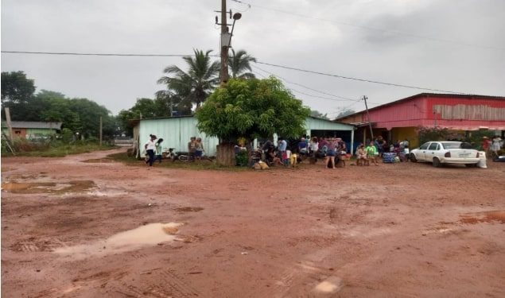Families stayed all day without sunshine. Photograph: 
 reproduction 

 Truck carrying peasants to Vila Alípio de Freitas, in Camp 
 Tiago Campin dos Santos. Photo: Reproduction 

 The three peasants hit were still brought alive by the police, 
 But two of them were executed summarily after suffering severe torture. 
 Abrapo's report points out that “the peasants surrendered were tortured, the 
 marks are in their bodies, and Rodrigo presented bruises on the body and 
 face -based face with arms, cut in the mouth, a bullshit and
will be included in the cadaveric report(documento que é de responsabilidade da
Segurança Pública do governo do estado de Rondônia). 

 After this attack, the police started a siege of the families camped in the 
 Barracks of the machines, at the headquarters of the farm. The families present tried 
 Return toward Rio, but were prevented by the reactionary military. You 
 peasants resisted, shouting that there were women, including pregnant women, and 
 children in the place, which was ignored by the PM, which promptly began “ 
 shoot rubber bullet, throw bomb of moral effect, where children were 
 affected and presented suffocating reaction ”, denounces the report. 

 The peasants claim that the police were all unidentified in the 
 uniforms and were accompanied by farm gunmen. The responsible for 
 troops(tenente-coronel Pontes)insulted the peasants of criminals and the 
 Reactionary military personnel stated that the orientation was to "kill everyone." 
 Families resisted the attempt to throw them on a bus without informing 
 destination and were assaulted again. Moral effect bombs were released and 
 Families retreated, this time to the bank of BR-364(na frente da
fazenda). And they stayed there in the scorching sun, without access to water or food. One 
 Peasant was referred to the same hospital because he had heart attack. Many 
 They were injured by rubber bullets and suffocated by tear gas. 
 Women fainted and children were without food. 

 Rodrigo Hawerroth during collective activity Photo: Reproduction 

 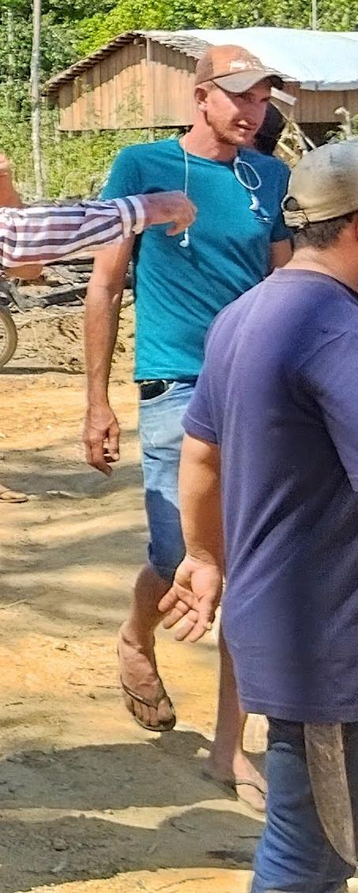Rodrigo Hawerroth during collective activity. Photo: Reproduction 

 Only a few peasants were allowed to remove a bag 
 clothes from inside the shed. The rest of the clothes, food, freezer with 
 foods, gas cylinders, cell phones, mattresses, medicines and other belongings 
 personal were not authorized. Most peasant objects 
 They stayed in the barracks, which were all destroyed by the police. You 
 peasants denounced to lawyers that they saw the reactionary military 
 stealing your belongings(celulares e dinheiro). In addition, the police 
 also poisoned dogs and contaminated water wells, and photographing the 
 peasants who were on site. 

 In order to intimidate the peasants, the police passed with the bodies of 
 Peasants murdered on the cars. Also with the same goal, 
 some peasants were taken to the farm headquarters and threatened and 
 assaulted. Families that were on the roadside were also beaten 
 For the PM and gunmen who were on the spot making ostensive rounds. Some 
 peasants were filled and signed a circumstantial criminal term and will 
 Respond for disobedience in the Special Criminal Court(JEC). 

 In the late afternoon of 01/29, the families left the place and went to the village 
 Alípio de Freitas, located inside Tiago Campin dos Santos camp. 
 According to the report, the peasants showed “a lot of indignation with the 
 executions and the way of acting of the PM in protection of the landlord. ”. 

 Read the [Report of 
 Abrapo](https://drive.google.com/file/d/1mdOqfEU0y22iq_lFptbWfzUEUzYTFDtx/view?usp=share_link)and to [Note from LCP](https://resistenciacamponesa.com/luta-camponesa/policia-
assassina-camponeses-durante-ataque-contra-familias/). 

 ** ATTENTION: Sensitive images ** 

 **** 

 **** 

 Rodrigo Hawerroth's body with torture marks. Photo: Reproduction 

 **** 

 Rodrigo Hawerroth's body with torture marks. Photo: Reproduction 

 **** 

 **** torture marks on Rodrigo and Raniel's body. Photo: Reproduction

News Source: [https://anovademocracia.com.br/noticias/18634-chacina-em-nova-mutum-ro-novas-denuncias-apontam-para-torturas-e-privacao-de-direitos-durante-ataque-da-pm](https://anovademocracia.com.br/noticias/18634-chacina-em-nova-mutum-ro-novas-denuncias-apontam-para-torturas-e-privacao-de-direitos-durante-ataque-da-pm)

<!--NEWS-->

# PC 31 January - Still on the Assembly of Genoa: the assessments of the companions of communist proletarians who participated in it

<!--METADATA-->

The opposition to the interimperialist war exploded in Ukraine begins to do 
 A few steps forward in our country in terms of mobilizations on the plan 
 national, in units with the initiatives that are taking place at the level 
 international. 

 This step forward was undoubtedly the assembly of January 28 against the 
 war promoted by the port workers of GE's Calp, very participatory, with 
 Comrades from the South(Taranto), from Sardinia, from the center(Roma), from the 
 north(Pisa, Livorno, Firenze, Padova, Bergamo)The appeal of the port for one 
 national mobilization on February 25, one year after the beginning of the conflict 
 Imperialist war in Ukraine, led to a debate and decisions 
 on how to start and give continuity to the opposition to the war. Has been 
 decided a day of national struggle, which in Genoa will be one 
 manifestation with a procession that will aim to enter the port, and that the 
 mobilization will be supported by the proclamation of the strike in ports 
 promoted by the USB and that, who cannot come to Genoa, will promote initiatives 
 locally on this day. 

 For us, communist proletarians who participated and intervened in 
 Assembly, the initiative of the ports of the 25th puts the battle in the center 
 right and central who sees the workers protagonists of this mobilization 
 with the direct action to combat ships(così come è stato fatta negli
aeroporti come a Pisa)who transport direct weapons in the war areas and with 
 The strike that starts from the ports. This tool of struggle is an indication from 
 also follow for all trade union realities, in opposition to confederals that 
 are part of the conciliation front with the war choices of governments, 
 Yesterday with Draghi and today with Meloni. We have to work for this, the "strikes 
 general "of the basic unions have been absolutely isolated e 
 counterproductive, self -referential, who even led to the rift 
 of the procession of 3 December in Rome. 

 We think it is a useful fight tool to extend in the places of 
 I work the workers' motion against war which, as Slai Cobas PSC union, 
 It was signed by the workers of the Italian steelworks of Taranto, of the 
 Fincantieri of Palermo, from the Marcegaglia of Ravenna, of the Dalmine of Bergamo 
 and that we are spreading in other factories that leads the workers to take sides 
 in the fight against the imperialists in war and, as regards the 
 Italian workers, the opposition to our government, to our imperialism. 

 The Assembly of the Ports of Genoa had as a positive data in addition to the 
 participation also the attention to our interventions that have from a 
 side brought the work, small but concrete, with the factories and the 
 Question of the bases in Taranto. 

 On the other, he clarified the political complaint towards the government, ours 
 imperialism and the character of the anti -imperialist war, which, due to 
 the composition of the room and the numerous interventions of the area 
 Retecomunisti/USB/Cremaschi/Up/RC/Pap etc, he had not put in the center. Not 
 Certainly the movementism/expirenzismo promoted by the collective is of different nature 
 GKN and the solidarity area of "converge to arise"(CPA-FI)where is 
 the worker direction of a class movement was watered down. 

 A negative aspect was the lack of workers' realities starting from Ilva 
 And that they made the interventions pencil, the criterion was that they intervened 
 first the distant realities, which only after stress were made but 
 towards the end. 

 On the other hand, in the end a Calp worker, anti -fascist, who had been to BG 
 Also for FN, he asked us for an opinion on how the assembly had gone and it is 
 It was an opportunity to share the need to involve the workers too 
 of the other factories, for example those of Ilva where they have contacts, e 
 of the useful instrument of the motion to discuss the reasons for the war 
 Inter imperialist. We cannot continue to have hegemonic attitudes or of 
 Bottega, I ... I, but reason from a proletarian and classy point of view: us 
 how we can do to move factories and truly create a force for 
 make class war. 

 Bring this struggle within our proletarian assembly 
 national anti -capitalist of February 18 to enhance it in the right direction to 
 what is needed to strengthen the political struggle against ours 
 imperialism, for the defeat of our imperialism. 

 The assembly of 28 in Genoa also has the merit of carrying out the 
 construction of the unit of the opposition movement to war, come on 
 workers to students, from antimperialists to antimilitarists to 
 pacifists.
has the merit of having put the need for mobilization against 
 The war on the national level: how do you boycott war from the territories 
 When is the weapons and the Italian government and the imperialist state? 

 Even if the antimilitarist reduction with the password "we boycott the 
 war ", does not see the character of imperialism, of the specific action of the 
 our imperialism and our government, of strengthening a process in 
 Directorate of the dictatorship of the capital that must be called with its name: 
 modern fascism, at the service of the masters, of the imperialist bourgeoisie 
 Italian. These are not only economic effects on the masses but the effects 
 reactionary politicians towards the formation of a regime: fascism brings 
 war, war brings fascism. 

 It is not enough to say that the enemy is in our house, without seeing the nature of 
 class, social, economic, political, of the Meloni government as modern 
 fascism. 

 The pacifist and antimilitarist positions have always have the limit of 
 do not see the link with the armed struggles directed by the Maoist Communists, with the 
 Popular revolts, which are the substance of proletarian internamentalism. 

 The anti -capitalist proletarian assembly of February 18 that we brought 
 within the initiative of the Genoa and to which we are working for one of his 
 success in terms of participation, it wants to be the proposal for struggle for 
 a step forward in the formation of a united front against government, 
 masters, imperialist war, fighting in the right line 
 of the indissolubility of the economic and political struggle.

News Source: [https://proletaricomunisti.blogspot.com/2023/01/pc-31-gennaio-ancora-sullassemblea-di.html](https://proletaricomunisti.blogspot.com/2023/01/pc-31-gennaio-ancora-sullassemblea-di.html)

<!--NEWS-->

# Unit against adjustment and defense of sovereignty

<!--METADATA-->

** 1. ** ** Long live the rebellion of the Peruvian people Enough of repression!** 

 The rebellion of the Peruvian people follow in the streets and the 
 Repression with more than 63 killed, thousands of prisoners and injuries. 

 From the PCR and its JCR and all the mass movements of which we participate 
 We promote a great mass campaign in solidarity with the 
 Peruvian people, repudiating the fierce repression. 

 The coup d'etat overthrew President Pedro Castillo and imposed the 
 Dina Boluarte de facto presidency. The Congress, controlled by the right 
 Fascist, rejected the possibility of a new election this year. 

 All imperialisms recognized the coup government. They dispute associated 
 to different sectors of the Peruvian ruling classes, but they converge to the 
 time to suppress popular mobilization and quell the rebellion. 

 In Peru the imperialist dispute stains the situation of the country. The traditional 
 Right Proyanqui has given ground to the advance of imperialism 
 Chino, who has become the main commercial partner of Peru and controls 
 Copper(Perú es el segundo productor mundial)And it has important 
 strategic investments, including the construction of the port of Chancay 
 About the Pacific, key to the advance of Chinese penetration on America 
 from the south and for its imperialist dispute over the Pacific. 

 Also Japanese imperialism has important investments that advanced 
 mainly during the presidency of Fujimori. 

 The rebellion of the labor movement and the originals and peasants of the 
 interior of the country, it has been mobilizing large caravans from the provinces 
 Andean and the popular neighborhoods of Lima. 

 To that popular mobilization was added a caravan of reservists and graduates 
 of the armed forces, of more than 10,000 members and say that they would reach 
 Lima 30,000. A fact of enormous importance, that fractures the structure 
 military and adds to the popular claim to sweep the government and congress 
 coup plotters 

 The president of Mexico, López Obrador, requested the release of the president 
 Overthrown, Pedro Castillo. Democratic claim that could not be approved in the 
 Recent CELAC meeting. 

 The depth of the rebellion of the peasant masses, originally, workers, 
 Student and popular Peru claims deep changes. Until where 
 This fight will arrive will depend on a avant -garde capable of opening a 
 Revolutionary path. But surely nothing will be the same in this 
 Brother country. 

 Our duty as revolutionary communists is to raise this situation between 
 The masses in each workplace, study and militancy, so that there are 
 hundreds of pronouncements in solidarity with the heroic struggle of the people 
 Peruvian and ** to demand the Argentine government to claim Pedro's freedom 
 Castle and repudiate the coup d'etat. The Peruvian people are the sole owner of 
 your destiny.** 

 **** 

 ** 2. ** ** The Russian invasion to Ukraine and World War ** 

 “War is a failure of politics, a failure of humanity, a 
 shameful claudication, a defeat against the forces of evil. If we think 
 that in this last century there were three world wars, 1914 to 1918, 1939 to 
 1945 and ** This current one that is a World War. ”** The statement belongs to the Pope 
 Francisco for Russian invasion to Ukraine. 

 ** Putin underestimated the Ukrainian people that ** endorsed that patriotic war. 
 Russian imperialism has used much of its missile reserves to 
 destroy buildings and kill the civilian population, looking for a genocide that 
 Sow fear and get a quick triumph. And it was quite the opposite. 

 ** Russian invasion to Ukraine places the world on the edge of a new war 
 world.** 

 The United States will now send 31 Abrams tanks. The Biden government 
 He decided after Germany agreed to send 14 leopard tanks of his own 
 arsenal. The German government had said that the Leopard was not going to send to 
 less than the United States made the Abrams available. 

 In total, France, England, the United States, Poland, Germany, Holland and 
 Sweden will send around 160 tanks and armored vehicles. 

 Russian imperialism responded to these ads with a new wave of 
 Missile and bombing attacks on kyiv and other cities, and prepares a 
 Great offensive that moves forward to the arrival and commissioning of the tanks. 

 ** Out of Ukraine Russian genocidal imperialism!Out of imperialism 
 Yankee and NATO!Long live the heroic patriotic struggle of the Ukrainian people!** 

 ** 3. ** ** The CELAC and the new scenario of Latin America ** 

 Last week, the meeting of the CABA was held at the Hotel Sheraton de la Caba 
 Community of Latin American and Caribbean States(CELAC). 

 Alberto Fernández presided over CELAC for a year. Was designated as successor 
 Ralph Gonsalves, imposed by Mexico. It is the Prime Minister of San Vicente and 
 the Granada, a small island of the Caribbean, of English speaking, that still
Gonsalves maintains good relations with Cuba and Venezuela, and reiterated support 
 from his country to the Argentine demand for the resumption of negotiations with the 
 United Kingdom regarding the sovereignty of the Falkland Islands. 

 The presence of Lula, the new president of Brazil, opened changes in the 
 Region: proposed to resume and strengthen Mercosur, negotiate first with 
 the European Union and then with China. Mercosur integrates it: Argentina, 
 Brazil, Paraguay, Uruguay and Venezuela(suspendida desde el 2017). And how 
 Associated states: Chile, Colombia, Ecuador, Guyana, Peru and Surinam. 

 With Lula, negotiations for commercial exchange and the 
 possibility of financial aid to Argentina. It was important 
 Presence of Evo Morales, the former president of Bolivia. 

 Chinese President Xi Jinping sent a video to CELAC in which he said 
 "The world has entered a new period of turbulence and transformations" and 
 He called to "boost South-South cooperation." 

 Social and union organizations discussed and presented a document with 
 his claims and his anti -imperialist positions, as the partner said 
 Ramiro Berdesegar, leader of the CCC and the PCR. And on 24/1 they mobilized 
 massively to the Sheo, the CCC, the Evita Movement, the CTA and other forces 
 popular 

 ** 4. ** ** Disputes in together for change ** 

 The pro and together for change are a "cat bag" and live a fierce 
 Dispute for charges for this year's elections. 

 After the triumphalist climate for victory in 19 provinces in the elections 
 Of 2021, the internal dispute with the rebellion of provincial leaders grew: 
 Tucumán, Chubut, Salta, Córdoba, Río Negro and others. 

 Patricia Bullrich(PRO), Gerardo Morales(UCR), Maximiliano Ferraro(Coalición
Cívica)and Miguel Ángel Pichetto(Encuentro Republicano Federal)They met 
 This Wednesday, as presidents of the forces that make up together for the 
 Change. They agreed to "sanction" those who do not comply with the internal rules of 
 The alliance for early elections. They try to put a limit to 
 disputes over the lists of the provinces. 

 Macri was planted: "I'm in the ring and I'm going to fight." Elisa Carrió, marked the 
 court to together for change: she wants to be a candidate for president to search 
 unit". 

 Manes asked to expand JXC, and asked Schiaretti to not move on the 
 Elections in Córdoba. 

 The former Buenos Aires Governor María Eugenia Vidal, who is also noted in the 
 Presidential career, speaks of a pension reform "because the system is 
 broken ”, and wants to“ discuss ”the compensation system. 

 This 12/2 are made internal in La Pampa, in which together for change it goes 
 to decide its candidates between radicalism and the Pro. The Front 
 Pampas justicialist unified his lists with little democratic discussion and not 
 It goes to internal. 

 Beyond its internal disputes, macrismo and the sectors that support it 
 They want to return to the government to deepen adjustment, hunger and delivery. 
 ** It is those who direct the main blow of the popular struggle. ** 

 ** 5. ** ** The trial of the Supreme Court ** 

 Congress began to deal with the possibility of a political trial to the Court 
 Supreme Justice. On February 2, the complainants will present and on 9 
 will vote. 

 The government needs two thirds of the Senate and deputies to approve the 
 political judgment, but it does not have or follow half of each of those 
 Chambers with what the political trial is hard to prosper. 

 Beyond this, this discussion puts on the table the corrupt actions of the 
 Argentine Justice and its Supreme Court, which show the 
 rot of the institutions of this state of the ruling classes, which 
 It is used by the different sectors in your dispute, and also to repress and 
 discipline social and political organizations such as CCC and PCR to 
 through judicial causes tailored to its adjustment policy. 

 ** 6. ** ** Unit in the streets against adjustment, for bread, work and sovereignty ** 

 Quilmes neighbors looted trucks with cattle and the meat is distributed in the 
 Street: They don't have to eat. 

 They continue to increase food, rentals, fuels, 
 rates, prepaid and telephony. The price of the cow increased 17%, which 
 The meat would rise to 40%. 

 In the agrarian areas the drought left the worker without work and the chacarero 
 indebted. They lost the initial crops and now they are losing the 
 late Many poor peasants and small producers leave their fields and 
 The concentration of the Earth grows in the hands of the pulses and large 
 landowners. 

 It is urgent financing, subsidies and soft credits, hitting the sector of the 
 Earth owners, which are carried out as income 7 billion 
 dollars, with a special tax. Also a rural lease law that 
 allow the producer to rediscuse the rent in emergency cases such as the 
 Current drought. 

 The ** social emergency ** is not the center of government policy. The
and other outsureres from outside and inside, cutting social plans, 
 salaries and retirement. ** 

 With that great lie that the exit to this situation comes from the 
 Diversification of the agency, the agreements that take over 
 our natural wealth and our sovereignty. 

 A court approved the exploitation of oil in Mar del Plata: to the Shell!
 The company of those who colonize our Malvinas and our sovereignty in the 
 South Atlantic and in the Antarctica sector. They celebrate the delivery of lithium in 
 Gross, when Bolivia exploits him with a national company. 

 Imperialist oil companies impose fuel prices with Super 
 Profits. Vaca Muerta and Cerro Dragon continues to dismembered at the hands of the 
 Imperialist companies. 

 The dispute for our resources grows. The government gives in to the 
 export monopolies and about the control of the so -called hydrovy. The 
 Government of Tierra del Fuego negotiates with China the construction of a port 
 strategic. And Lewis continues to take over Patagonia, giving it to the 
 English imperialism. 

 With this policy the government has lost popular support, because it does not touch the 
 interests of the powerful and hunger, poverty and delivery of 
 Our national sovereignty. This emboldenea to the reactionary right in their 
 plans to deepen the adjustment, as Milei did announcing his "plan 
 chainsaw ”to reduce the State and eliminate health ministries, 
 Education, work and women and diversities. 

 The workers, peasant, native, young people, of the young people, of the 
 women, the struggles in defense of our sovereignty. There are thousands in Argentina 
 Those who come starring their claims and join in the streets 

 ** We continue in the fight to advance these struggles and join with all the 
 popular and national sectors so that these converge and impose from the 
 streets that the crisis is paid by those who are taking it in shovel and breaks 
 The infamous agreement with the IMF and all anti -informed agreements with different 
 Imperialism. Only in this way can we advance in solving emergencies and in the 
 Defense of our national sovereignty. ** 

 **** 

 ** 7. ** ** Follow the head of the struggles and not underestimate the enemy ** 

 Companion Sebastián Saldaña, coordinator of the CCC of the city of Santa 
 Faith, he received at home a threat of death to him, his son, his baby and all his 
 environment. The note carried a bullet stuck with tape. Dozens of organizations 
 Santa Fe union and policies, the national table of the CCC and the PCR 
 They repudiated this fact, demanding from the different levels of the State the prompt 
 research and protection of the partner and his family, the clarification 
 of the fact and the punishment of those responsible. 

 This happens a few days after the murder attempt by fellow Lautaro Nahuel 
 Ardura, in La Pampa. They are facts that show that there is a fascist right that 
 Try to hit us, and an enemy state of popular forces. 

 They also advance in different parts of the country judicial causes against 
 Companions and companions of the CCC and the PCR driven by macrista and 
 others of justice. 

 The ruling classes use the entire state apparatus -the "legal" and the 
 MAFIOUS- To isolate and attack those who lead the popular struggle. This demands 
 that we continue in the fight fighting the widest unit as expressed with the 
 great solidarity received from these attacks, and lift the guard to 
 guarantee the continuity of popular struggles for bread, land, work and 
 sovereignty. 

 ** 8. ** ** Our goal is the National and Social Liberation Revolution ** 

 At the close of this edition, hundreds of companions of Río Negro and 
 of different parts of the country made the seventh multisectoral march to 
 Hidden lake, repudiating the presence of the English magnate Lewis and reiterating 
 The sovereign claim in that area of our homeland. 

 On February 1, dozens of organizations, including the CCC and 
 The PTP-PCR, march to the Supreme Court in CABA and the Federal Courts of 
 The whole country demanding the cessation of persecution to social organizations 
 and union, and its leaders. 

 With the resolutions of the 13 PCR Congress we go to meet the great 
 political debate in the masses around what is the exit in favor 
 from town. 

 Putting the center to lead the struggles and accumulate revolutionary forces, 
 We propose affiliation to our party and its youth to all the colleagues and 
 Companions with whom we share the daily struggle. 

 We address that mass discussion with a proposal expressed in our 
 DIEZ PROGRAM MEASURES_. This debate includes the electoral proposals of 
 each district, which are carried out in many provinces, and the national election. 
 But that goes further, because what is at stake is to advance in the unit to 
 the struggle of the popular sectors, on the path of a revolution that
State, in the hands of the working class and the people. 

 ** _ Write Ricardo Fierro and Germán Vidal _ ** 

 Photo: Painted in Quilmes-Berezategui-Varela in solidarity with the heroic 
 Peruvian people's fight

News Source: [https://pcr.org.ar/nota/unidad-contra-el-ajuste-y-en-defensa-de-la-soberania/](https://pcr.org.ar/nota/unidad-contra-el-ajuste-y-en-defensa-de-la-soberania/)

<!--NEWS-->

# On the 80th anniversary of the victory in the battle of Stalingrad

<!--METADATA-->

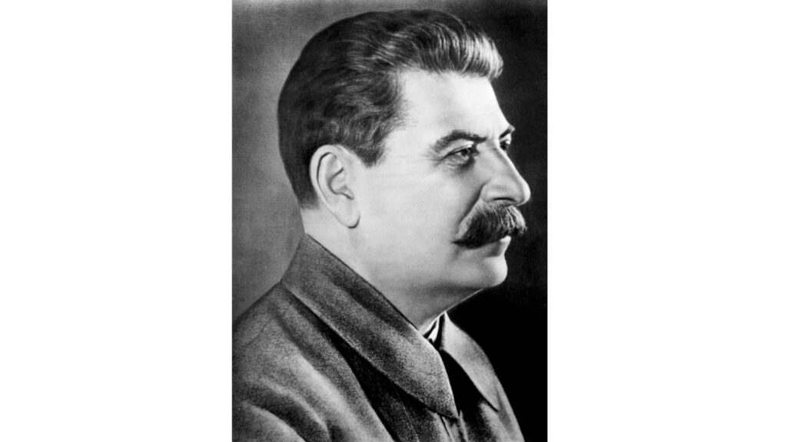_Proletarians of all countries, unite!_

# On the 80th anniversary of the victory in the battle of Stalingrad

The International Communist League correctly stated in its ‘Political
Declaration and the Principles of the International Communist League’: _“_ _We
assume the position of Chairman Mao on the role of comrade Stalin that he was
a great_ _Marxist._ _Furthermore,_ _we must bear_ _in mind_ _that_ _he was the
one who brilliantly defined_ _Leninism._ _We, the communists, today have the
task to_ _assume the defense of_ _his_ _role in_ _World War_ _II_ _within the
Communist International, particularly its 7_ _th_ ___World_ _Congress.”_ The
latter will be central for this article celebrating the tremendous victory in
the battle of Stalingrad.

The weight and significance of this great and heroic battle was correctly
established by Chairman Mao Tse-Tung: **“** **This battle is not only the
turning point of the Soviet-German war, or even of the present anti-fascist
world war, it is the turning point in the history of all mankind.”**

The war fought by the USSR, as it was absolutely correctly defined, was a
Great Patriotic War, a just war of defence. Additionally to the glorious and
heroic defence, in which the USSR under the leadership of Comrade Stalin had
to apply scorched land to defend its territory, to defend the socialist
motherland, what costed more than 25 million lives, the anti-imperialist
struggle unfolded vastly in the oppressed nations during this period.

Chairman Mao Tse-Tung just and correct thought us: **“The Soviet Union’s
sacred war of resistance against fascist aggression is being waged not only in
its own defence but in defence of all the nations struggling to liberate
themselves from fascist enslavement. For Communists throughout the world the
task now is to mobilize the people of all countries and organize an
international united front to fight fascism and defend the Soviet Union,
defend China, and defend the freedom and independence of all nations.”**

The peoples of the world rose for the just cause and spilled their precious
blood not only in the war against the axis, but also against their respective
imperialist masters, what initiated the great anti-colonial struggle in the
second half of the 20th century.

In the winter 1941/42 the Soviet Union under the leadership and command of
Comrade Stalin had already successfully rebuffed a vicious Nazi-German attack
on the western part of the country, aiming to take the capital Moscow. The
Nazi-Wehrmacht, not able to understand that every attempt to crush the
Bolshevist steel tempered by the great Lenin and Stalin was doomed to fail,
mounted an offensive on southern Russia in the summer of 1942. They set their
sights on Stalingrad, because the city served as an industrial center in
Russia, producing, among other important goods, artillery for the country’s
troops. The Volga River, which runs through the city, was also an important
shipping route connecting the western part of the country with its distant
eastern regions. The Nazis wanted the Wehrmacht to occupy Stalingrad, seeing
its value for propaganda purposes, given that it bore Stalin’s name. For
similar moral reasons there was a special need to defend it. The 6th Army of
the Wehrmacht began their assault on 23 August 1942.

Comrade Stalin, as the highest command, issued personally the Order 227, at
the end of July 1942, in order to elevate the level of sacrifices and fighting
spirit of the armed forces to the level of the people:

“ **The enemy throws new forces to the front without regard to heavy losses
and penetrates deep into the Soviet Union, seizing new regions, destroying our
cities and villages, and violating, plundering and killing the Soviet
population. Combat goes on in region Voronej, near Don, in the south, and at
the gates of the Northern Caucasus. The German invaders penetrate toward
Stalingrad, to Volga and want at any cost to trap Kuban and the Northern
Caucasus, with their oil and grain. […] Part of the troops of the Southern
front, following the panic-mongers, have left Rostov and Novochercassk without
severe resistance and without orders from Moscow, covering their banners with
shame.**

**The population of our country, who love and respect the Red Army, start to
be discouraged in her, and lose faith in the Red Army, and many curse the Red
Army for leaving our people under the yoke of the German oppressors, and
itself running east. Some stupid people at the front calm themselves with talk
that we can retreat further to the east, as we have a lot of territory, a lot
of ground, a lot of population and that there will always be much bread for
us. They want to justify the infamous behavior at the front. But such talk is
falsehood, helpful only to our enemies.**

**Each commander, Red Army soldier and political commissar should understand
that our means are not limitless. The territory of the Soviet state is not a
wives, brothers, children. The territory of the USSR which the enemy has
captured and aims to capture is bread and other products for the army, metal
and fuel for industry, factories, plants supplying the army with arms and
ammunition, railroads. After the loss of Ukraine, Belorussia, Baltic
republics, Donetzk, and other areas we have much less territory, much less
people, bread, metal, plants and factories. We have lost more than 70 million
people, more than 800 million pounds of bread annually and more than 10
million tons of metal annually. […] To retreat further - means to waste
ourselves and to waste at the same time our Motherland. Therefore it is
necessary to eliminate talk that we have the capability endlessly to retreat,
that we have a lot of territory, that our country is great and rich, that
there is a large population, and that bread always will be abundant. Such talk
is false and parasitic, it weakens us and benefits the enemy, if we do not
stop retreating we will be without bread, without fuel, without metal, without
raw material, without factories and plants, without railroads. This leads to
the conclusion, it is time to finish retreating. _Not one step back!_ […] It
is impossible to tolerate commanders and commissars permitting units to leave
their positions. It is impossible to tolerate commanders and commissars who
admit that some panic-mongers determined the situation on the field of combat
and carried away in departure other soldiers and opened the front to the
enemy. The panic-mongers and cowards should be exterminated in place.**

**Henceforth the solid law of discipline for each commander, Red Army soldier,
and commissar should be the requirement - not a single step back without order
from higher command. Company, battalion, regiment and division - commanders
and appropriate commissars, who retreat without orders from higher commanders,
are betrayers of the Motherland. These are the orders of our Motherland. To
execute this order - means to defend our lands, to save the Motherland, to
exterminate and to conquer the hated enemy.”**

Our heroic red soldiers were initially able to slow the Wehrmacht’s advances
during a series of skirmishes north of Stalingrad, offering more than 200,000
lifes, and successfully held off the Nazi hordes. It was decided not to flee
but withstand and therefore not to evacuate the more than 400,000 inhabitants
of the city. The men and women, even the youngest, of Stalingrad were
incorporated into war related activities – combat, construction, espionage,
supply, etc. Even when the walls of Stalingrad bursted by the Luftwaffe’s
constant bombardments or the heavy artillery strikes, the people stood
steadfast.

The Operation Uranus led by Georgy Zhukov and Aleksandr Vasilevsky organized
Russian troops in the mountains to the north and west of the city. From there,
they launched a counterattack. Paying the necessary price the Red Army was
able to encircle the city by late November 1942, trapping the nearly 300,000
German and Axis troops(mainly Italian and Romanian), choking off the enemy
forces from vital supplies and essentially surrounding them in an ever-
tightening noose.

Close to Stalingrad the Red Army won important battles, including in Rostov-
on-Don, about 250 miles away from Stalingrad. Thus the enemy forces were
thinned and stretched at that part of the front and the Operation Little
Saturn in the west of Stalingrad was successful. With men, not arms, proving
the Marxist principle about what is most important correct once again, they
strangled the invaders to death and fought the greatest battle of war in
cities ever seen. It was a war not only from street to street, nor from house
to house or cellar to cellar, not even floor by floor, but room by room,
generating the most heroism, chapters that have shaken the world.

On the significance of the battle of Stalingrad for the whole course of the
war Chairman Mao stated: **“…in this present war the attack on Stalingrad is
the expression of the last desperate struggle of fascism itself. At this
turning point in history, too, many people in the world anti-fascist front
have been deluded by the ferocious appearance of fascism and have failed to
discern its essence. For forty-eight days there raged an unprecedentedly
bitter battle, unparalleled in the history of mankind–from August 23, when the
entire German force crossed the bend of the River Don and began the all-out
attack on Stalingrad, through September 15, when some German units broke into
the industrial district in the northwestern section of the city, and right up
to October 9, when the Soviet Information Bureau announced that the Red Army
had breached the German line of encirclement in that district. Ultimately this
battle was won by the Soviet forces. During those forty-eight days, the news
of each setback or triumph from that city gripped the hearts of countless
millions of people, now bringing them anxiety, now stirring them to elation.**
of the present antifascist world war, it is the turning point in the history
of all mankind.** **Throughout these forty-eight days, the people of the world
watched Stalingrad with even greater concern than they watched Moscow last
October.** **[** **…** **]** **following the battle for the defence of
Stalingrad, the situation will be totally different from that of last year. On
the one hand, the Soviet Union will launch a second winter counteroffensive on
a vast scale, Britain and the United States will no longer be able to delay
the opening of the second front(though the exact date cannot yet be
foretold), and the people of Europe will be ready to rise up in response. On
the other hand, Germany and her European accomplices no longer have the
strength to mount large-scale offensives, and Hitler will have no alternative
but to change his whole line of policy to the strategic defensive.”**

We all know, and we must remember, that the fascist offensive led by the
Nazis, to which the Italian and Spanish fascists as well as others like the
Romanians, Hungarians and also Bandera’s bunch of rats from Ukraine
contributed, and which used all the economic might of subjugated Europe, threw
millions over millions, the cream of the German army, 75% of its air force,
into the invasion. But comrade Stalin had wisely handled diplomacy with great
subtlety.

It is worth noting the sagacity and penetration of the Soviet intelligence
service. What an intelligence service. They knew the exact day of the Nazi-
invasion.

The Soviet Union applied a strategic defence together with scorched earth,
leaving them nothing but bare earth, mud, ashes and the most brave, determined
and resolute partisans behind the enemies lines. They had the audacity, the
courage to blow up monumental works such as the famous dam that links the
Volga with the Don that took so many years of effort. The Germans never
dreamed, they thought that this work would not be blown up, because it was too
important and had cost a lot.

The dictatorship of the proletariat was at stake, the revolution was at stake,
we cannot stop to think, nor can we simply allow ourselves to be hindered, as
Chairman Mao said, by the defence of inches of land. They crashed at the gates
of Leningrad, at the gates of Moscow and Stalingrad; but not only

scorched earth was carried out, but guerrillas and even simple individual men
and women with their rifles, their ammo and their vodka awaited the enemy. To
annihilate one of those brave heroes and heroines, the Germans lost 10 men,
averagely.

The fascist offensive was a military plan of very high quality, thus, the
highest and most enlightened German military leaders elaborated this plan and
the German school has a many times proven war tradition: in three months they
planned to conquer the USSR.

Comrade Stalin’s foresight, he had already taken measures since the 1930s when
there was the great transformation of the countryside and industry, they had
already transferred factories beyond the Urals, even foreseeing the
possibility of leaving as far as Moscow, for it is true, everything was

already in place in case they could not ultimately defend Moscow, even if that
was the decision taken, it was already planned to move the leadership and the
centre to the Urals; So the first thing that was done was to make arrangements
for Lenin’s transfer, because he could not fall into the dirty hands of the
wretched sons of hell, he could not fall.

But the order, after they had penetrated to the above mentioned gates, the
order was not to retreat any further!It is very memorable, and we must always
remember how on November 7, the anniversary of the revolution, they had
nowhere to celebrate it and it was considered impossible to carry it out;
comrade Stalin said: “to the station”, “but there is no platform there, there
are no seats there”, comrade Stalin stepped on a box and spoke in celebration
of the revolution, saying: “how many of us were there when we seized power,
what forces did we have when we repulsed the imperialist aggression
immediately after the October Revolution? We will crush them, and we will
annihilate the beast in its own den, in Berlin.”

These are things one must remember, to appreciate comrade Stalin one must look
at the Second World War. We all know how then came the great resistance, the
breaking of the German lines, the siege of Stalingrad where the German
commanders, Hitler himself, commanded them not to retreat to those inferior
subhumans. Those inferiors, the barbarians, the Mongols, hunted them down like
rats and they had to surrender.

It is always good to reiterate this: Stalin, the skillful and wise manager of
war, always took the moral element into account and paraded all the defeated,
surrendered Nazis and threw their flags, their eagles, their swastikas at the
foot of Lenin’s mausoleum; not only a great military defeat, but a

great moral defeat!The Nazi arrogance had been sunk in the mud and trampled
beginning of the breakdown of the Nazi Wehrmacht.

In February 1943 Comrade Stalin analysed: **“Three months ago the troops of
the Red Army began their offensive at the approaches to Stalingrad. Since then
the initiative in military operations has remained in our hands and the pace
and striking power of the offensive operations of the Red Army have not
weakened. Today, in hard winter conditions, the Red Army is advancing over a
front of 1,500 kilometres(950 miles)and is achieving successes practically
everywhere. In the north, near Leningrad, on the central front, at the
approaches to Kharkov, in the Donets Basin, at Rostov, on the shores of the
Sea of Azov and the Black Sea, the Red Army is striking blow after blow at the
Hitlerite troops. In three months the Red Army has liberated from the enemy
the territory of the Voronezh and Stalingrad regions, the Checheno-Ingush,
North Ossetian, Kabardino- Balkarian and Kalmyk Autonomous Republics, the
Stavropol and Krasnodar Territories, the Cherkess(Circassian), Karachaisu and
Adygeisu Autonomous Regions and almost the whole of the Rostov, Kharkov and
Kursk Regions.**

**[…] in the winter of 1942-43 alone, the Germans lost over 7,000 tanks, 4,000
planes, 17,000 guns […] since the beginning of the war, has put out of action
about 9,000,000 German-fascist officers and men, of whom no less than
4,000,000 were killed on the battlefield.**

**[…] first, the weakness of the German army is the shortage of man-power
reserves, and consequently it is not known from what sources these losses will
be replaced. […] the Red Army has become a seasoned army. […] millions of Red
Army men have become masters of their weapons [ …]**

**It cannot be considered an accident that the Red Army Command not only
liberates Soviet soil from the enemy but does not let the enemy leave our soil
alive, carrying out such important operations as the encirclement and
annihilation of enemy armies which can well serve as examples of military art.
This is undoubtedly a sign of the maturity of our commanders.**

**There can be no doubt that only the correct strategy of the Red Army
Command, and the flexible tactics of our commanders who execute it, could have
resulted in such an outstanding fact as the encirclement and annihilation at
Stalingrad of an enormous picked army of Germans, numbering 330,000 men.”**

Our Brazilian comrades pointed out: The victory against fascism in the Second
World War is one of the great historical events of the process of the
Proletarian World Revolution, the imperialist camp found itself deeply beaten,
three important imperialist powers were defeated - Germany, Japan and Italy -
which has to be seriously studied for its just and correct comprehension, it
has to be highlighted and celebrated.

The Communist Party of China affirmed, regarding the evaluation of this
historic experience:

“ **In the first place, the history of anti-fascist war shows that the
socialist system has an enormous vitality that can resist the most severe test
and that a state of the dictatorship of the proletariat is invincible.**

**In second place, the history of the anti-fascist war shows that imperialism
is the source of all wars in modern times, that the aggressive nature of
imperialism will not change and because of that, to defend world peace it is
necessary to persist in the struggle against imperialism.**

**In third place, the history of the anti-fascist war shows that the peoples
war sure to attain victory, that it is completely possible to defeat the
imperialist aggressors, that imperialism is a paper tiger, who is apparently
strong, but in reality is weak, and that the atomic bomb is also a paper
tigress and it is the people and not the arms, of any class, who decide the
outcome of the war.**

**In fourth place, the history of the anti-fascist war shows that, in order to
defeat the imperialist aggressor, it is imperative to trust in the unity of
the revolutionary forces of the people in all countries, to attract to our
side all the forces that can be won, to form the broadest possible
international united front and concentrate our blows on the main enemy of the
peoples of the world.”**

Under the guns of the glorious Red Army Nazi-Germany was shattered, Socialism
and the dictatorship of the proletariat arose in up to Eastern Germany. The
Red Banner of the Communist Party and the USSR waving over the shadowed and
destroyed German Reichstag is an undeniable great moment of the international
proletariat that symbolize the whole heroic and glorious epic of the struggle
against fascism in defense of the USSR and for the development of the
Proletarian World Revolution. The sentence made by comrade Dimitrov when he
embarked in the direction of

USSR after the great victory in the Nazi Tribunal in Leipzig was thus
accomplished: _“We will make Germany Soviet!”._

News Source: [https://ci-ic.org/blog/2023/01/31/on-the-80th-anniversary-of-the-victory-in-the-battle-of-stalingrad/](https://ci-ic.org/blog/2023/01/31/on-the-80th-anniversary-of-the-victory-in-the-battle-of-stalingrad/)