# COMMUNIST INTERNATIONAL NEWSPAPER: On the 80th anniversary of the victory in the battle of Stalingrad

Author: Verein der Neuen Demokratie

Description: January 31, 2023 ...

Time: 2023-02-01T15:46:00+01:00

Images: ['[stalin-1024x576.jpg](https://ci-ic.org/wp-content/uploads/2023/01/stalin-1024x576.jpg)']

<!--METADATA-->

#  

January 31, 2023

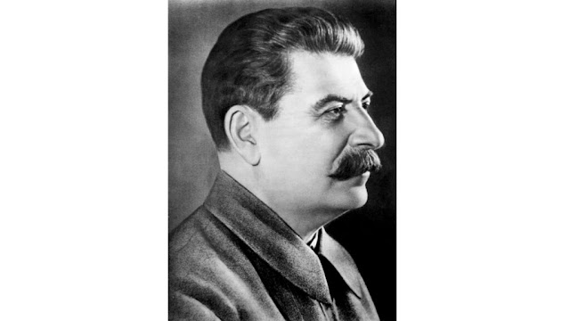

[Download PDF](https://ci-ic.org/blog/2023/01/31/on-the-80th-anniversary-of-
the-victory-in-the-battle-of-stalingrad/?print=pdf)[Print
document](https://ci-ic.org/blog/2023/01/31/on-the-80th-anniversary-of-the-
victory-in-the-battle-of-stalingrad/?print=print)

_Proletarians of all countries, unite!_

# On the 80th anniversary of the victory in the battle of Stalingrad

The International Communist League correctly stated in its 'Political
Declaration and the Principles of the International Communist League': _"_ _We
assume the position of Chairman Mao on the role of comrade Stalin that he was
a great_ _Marxist._ _Furthermore,_ _we must bear_ _in mind_ _that_ _he was the
one who brilliantly defined_ _Leninism._ _We, the communists, today have the
task to_ _assume the defense of_ _his_ _role in_ _World War_ _II_ _within the
Communist International, particularly its 7_ _th_ ___World_ _Congress. "_ The
latter will be central for this article celebrating the tremendous victory in
the battle of Stalingrad.

The weight and significance of this great and heroic battle was correctly
established by Chairman Mao Tse-Tung: **"** **This battle is not only the
turning point of the Soviet-German war, or even of the present anti-fascist
world war, it is the turning point in the history of all mankind. "**

The war fought by the USSR, as it was absolutely correctly defined, was a
Great Patriotic War, a just war of defence. Additionally to the glorious and
heroic defence, in which the USSR under the leadership of Comrade Stalin had
to apply scorched land to defend its territory, to defend the socialist
motherland, what costed more than 25 million lives, the anti-imperialist
struggle unfolded vastly in the oppressed nations during this period.

Chairman Mao Tse-Tung just and correct thought us: **" The Soviet Union's
sacred war of resistance against fascist aggression is being waged not only in
its own defence but in defence of all the nations struggling to liberate
themselves from fascist enslavement. For Communists throughout the world the
task now is to mobilize the people of all countries and organize an
international united front to fight fascism and defend the Soviet Union,
defend China, and defend the freedom and independence of all nations."**

The peoples of the world rose for the just cause and spilled their precious
blood not only in the war against the axis, but also against their respective
imperialist masters, what initiated the great anti-colonial struggle in the
second half of the 20th century.

In the winter 1941/42 the Soviet Union under the leadership and command of
Comrade Stalin had already successfully rebuffed a vicious Nazi-German attack
on the western part of the country, aiming to take the capital Moscow. The
Nazi-Wehrmacht, not able to understand that every attempt to crush the
Bolshevist steel tempered by the great Lenin and Stalin was doomed to fail,
mounted an offensive on southern Russia in the summer of 1942. They set their
sights on Stalingrad, because the city served as an industrial center in
Russia, producing, among other important goods, artillery for the country's
troops. The Volga River, which runs through the city, was also an important
shipping route connecting the western part of the country with its distant
eastern regions. The Nazis wanted the Wehrmacht to occupy Stalingrad, seeing
its value for propaganda purposes, given that it bore Stalin's name. For
similar moral reasons there was a special need to defend it. The 6th Army of
the Wehrmacht began their assault on 23 August 1942.

Comrade Stalin, as the highest command, issued personally the Order 227, at
the end of July 1942, in order to elevate the level of sacrifices and fighting
spirit of the armed forces to the level of the people:

" **The enemy throws new forces to the front without regard to heavy losses
and penetrates deep into the Soviet Union, seizing new regions, destroying our
cities and villages, and violating, plundering and killing the Soviet
population. Combat goes on in region Voronej, near Don, in the south, and at
the gates of the Northern Caucasus. The German invaders penetrate toward
Stalingrad, to Volga and want at any cost to trap Kuban and the Northern
Caucasus, with their oil and grain. [ …] Part of the troops of the Southern
front, following the panic-mongers, have left Rostov and Novochercassk without
severe resistance and without orders from Moscow, covering their banners with
shame.**

**The population of our country, who love and respect the Red Army, start to
be discouraged in her, and lose faith in the Red Army, and many curse the Red
Army for leaving our people under the yoke of the German oppressors, and
itself running east. Some stupid people at the front calm themselves with talk
that we can retreat further to the east, as we have a lot of territory, a lot
of ground, a lot of population and that there will always be much bread for
us. They want to justify the infamous behavior at the front. But such talk is
falsehood, helpful only to our enemies.**

**Each commander, Red Army soldier and political commissar should understand
that our means are not limitless. The territory of the Soviet state is not a
desert, but people - workers, peasants, intelligentsia, our fathers, mothers,
wives, brothers, children. The territory of the USSR which the enemy has
captured and aims to capture is bread and other products for the army, metal
and fuel for industry, factories, plants supplying the army with arms and
ammunition, railroads. After the loss of Ukraine, Belorussia, Baltic
republics, Donetzk, and other areas we have much less territory, much less
people, bread, metal, plants and factories. We have lost more than 70 million
people, more than 800 million pounds of bread annually and more than 10
million tons of metal annually. […] To retreat further - means to waste
ourselves and to waste at the same time our Motherland. Therefore it is
necessary to eliminate talk that we have the capability endlessly to retreat,
that we have a lot of territory, that our country is great and rich, that
there is a large population, and that bread always will be abundant. Such talk
is false and parasitic, it weakens us and benefits the enemy, if we do not
stop retreating we will be without bread, without fuel, without metal, without
raw material, without factories and plants, without railroads. This leads to
the conclusion, it is time to finish retreating. _Not one step back!_ […] It
is impossible to tolerate commanders and commissars permitting units to leave
their positions. It is impossible to tolerate commanders and commissars who
admit that some panic-mongers determined the situation on the field of combat
and carried away in departure other soldiers and opened the front to the
enemy. The panic-mongers and cowards should be exterminated in place.**

**Henceforth the solid law of discipline for each commander, Red Army soldier,
and commissar should be the requirement - not a single step back without order
from higher command. Company, battalion, regiment and division - commanders
and appropriate commissars, who retreat without orders from higher commanders,
are betrayers of the Motherland. These are the orders of our Motherland. To
execute this order - means to defend our lands, to save the Motherland, to
exterminate and to conquer the hated enemy."**

Our heroic red soldiers were initially able to slow the Wehrmacht's advances
during a series of skirmishes north of Stalingrad, offering more than 200,000
lifes, and successfully held off the Nazi hordes. It was decided not to flee
but withstand and therefore not to evacuate the more than 400,000 inhabitants
of the city. The men and women, even the youngest, of Stalingrad were
incorporated into war related activities - combat, construction, espionage,
supply, etc. Even when the walls of Stalingrad bursted by the Luftwaffe's
constant bombardments or the heavy artillery strikes, the people stood
steadfast.

The Operation Uranus led by Georgy Zhukov and Aleksandr Vasilevsky organized
Russian troops in the mountains to the north and west of the city. From there,
they launched a counterattack. Paying the necessary price the Red Army was
able to encircle the city by late November 1942, trapping the nearly 300,000
German and Axis troops (mainly Italian and Romanian), choking off the enemy
forces from vital supplies and essentially surrounding them in an ever-
tightening noose.

Close to Stalingrad the Red Army won important battles, including in Rostov-
on-Don, about 250 miles away from Stalingrad. Thus the enemy forces were
thinned and stretched at that part of the front and the Operation Little
Saturn in the west of Stalingrad was successful. With men, not arms, proving
the Marxist principle about what is most important correct once again, they
strangled the invaders to death and fought the greatest battle of war in
cities ever seen. It was a war not only from street to street, nor from house
to house or cellar to cellar, not even floor by floor, but room by room,
generating the most heroism, chapters that have shaken the world.

On the significance of the battle of Stalingrad for the whole course of the
war Chairman Mao stated: **" …in this present war the attack on Stalingrad is
the expression of the last desperate struggle of fascism itself. At this
turning point in history, too, many people in the world anti-fascist front
have been deluded by the ferocious appearance of fascism and have failed to
discern its essence. For forty-eight days there raged an unprecedentedly
bitter battle, unparalleled in the history of mankind-from August 23, when the
entire German force crossed the bend of the River Don and began the all-out
attack on Stalingrad, through September 15, when some German units broke into
the industrial district in the northwestern section of the city, and right up
to October 9, when the Soviet Information Bureau announced that the Red Army
had breached the German line of encirclement in that district. Ultimately this
battle was won by the Soviet forces. During those forty-eight days, the news
of each setback or triumph from that city gripped the hearts of countless
millions of people, now bringing them anxiety, now stirring them to elation.
****This battle is not only the turning point of the Soviet-German war, or
even of the present antifascist world war, it is the turning point in the
history of all mankind.** **Throughout these forty-eight days, the people of
the world watched Stalingrad with even greater concern than they watched
Moscow last October.** **[** **…** **]** **following the battle for the
defence of Stalingrad, the situation will be totally different from that of
last year. On the one hand, the Soviet Union will launch a second winter
counteroffensive on a vast scale, Britain and the United States will no longer
be able to delay the opening of the second front (though the exact date cannot
yet be foretold), and the people of Europe will be ready to rise up in
response. On the other hand, Germany and her European accomplices no longer
have the strength to mount large-scale offensives, and Hitler will have no
alternative but to change his whole line of policy to the strategic defensive.
"**

We all know, and we must remember, that the fascist offensive led by the
Nazis, to which the Italian and Spanish fascists as well as others like the
Romanians, Hungarians and also Bandera's bunch of rats from Ukraine
contributed, and which used all the economic might of subjugated Europe, threw
millions over millions, the cream of the German army, 75% of its air force,
into the invasion. But comrade Stalin had wisely handled diplomacy with great
subtlety.

It is worth noting the sagacity and penetration of the Soviet intelligence
service. What an intelligence service. They knew the exact day of the Nazi-
invasion.

The Soviet Union applied a strategic defence together with scorched earth,
leaving them nothing but bare earth, mud, ashes and the most brave, determined
and resolute partisans behind the enemies lines. They had the audacity, the
courage to blow up monumental works such as the famous dam that links the
Volga with the Don that took so many years of effort. The Germans never
dreamed, they thought that this work would not be blown up, because it was too
important and had cost a lot.

The dictatorship of the proletariat was at stake, the revolution was at stake,
we cannot stop to think, nor can we simply allow ourselves to be hindered, as
Chairman Mao said, by the defence of inches of land. They crashed at the gates
of Leningrad, at the gates of Moscow and Stalingrad; but not only

scorched earth was carried out, but guerrillas and even simple individual men
and women with their rifles, their ammo and their vodka awaited the enemy. To
annihilate one of those brave heroes and heroines, the Germans lost 10 men,
averagely.

The fascist offensive was a military plan of very high quality, thus, the
highest and most enlightened German military leaders elaborated this plan and
the German school has a many times proven war tradition: in three months they
planned to conquer the USSR.

Comrade Stalin's foresight, he had already taken measures since the 1930s when
there was the great transformation of the countryside and industry, they had
already transferred factories beyond the Urals, even foreseeing the
possibility of leaving as far as Moscow, for it is true, everything was

already in place in case they could not ultimately defend Moscow, even if that
was the decision taken, it was already planned to move the leadership and the
centre to the Urals; So the first thing that was done was to make arrangements
for Lenin's transfer, because he could not fall into the dirty hands of the
wretched sons of hell, he could not fall.

But the order, after they had penetrated to the above mentioned gates, the
order was not to retreat any further! It is very memorable, and we must always
remember how on November 7, the anniversary of the revolution, they had
nowhere to celebrate it and it was considered impossible to carry it out;
comrade Stalin said: "to the station", "but there is no platform there, there
are no seats there", comrade Stalin stepped on a box and spoke in celebration
of the revolution, saying: "how many of us were there when we seized power,
what forces did we have when we repulsed the imperialist aggression
immediately after the October Revolution? We will crush them, and we will
annihilate the beast in its own den, in Berlin."

These are things one must remember, to appreciate comrade Stalin one must look
at the Second World War. We all know how then came the great resistance, the
breaking of the German lines, the siege of Stalingrad where the German
commanders, Hitler himself, commanded them not to retreat to those inferior
subhumans. Those inferiors, the barbarians, the Mongols, hunted them down like
rats and they had to surrender.

It is always good to reiterate this: Stalin, the skillful and wise manager of
war, always took the moral element into account and paraded all the defeated,
surrendered Nazis and threw their flags, their eagles, their swastikas at the
foot of Lenin's mausoleum; not only a great military defeat, but a

great moral defeat! The Nazi arrogance had been sunk in the mud and trampled
upon, it was the greatest moral blow it had ever received, and that was the
beginning of the breakdown of the Nazi Wehrmacht.

In February 1943 Comrade Stalin analysed: **" Three months ago the troops of
the Red Army began their offensive at the approaches to Stalingrad. Since then
the initiative in military operations has remained in our hands and the pace
and striking power of the offensive operations of the Red Army have not
weakened. Today, in hard winter conditions, the Red Army is advancing over a
front of 1,500 kilometres (950 miles) and is achieving successes practically
everywhere. In the north, near Leningrad, on the central front, at the
approaches to Kharkov, in the Donets Basin, at Rostov, on the shores of the
Sea of Azov and the Black Sea, the Red Army is striking blow after blow at the
Hitlerite troops. In three months the Red Army has liberated from the enemy
the territory of the Voronezh and Stalingrad regions, the Checheno-Ingush,
North Ossetian, Kabardino- Balkarian and Kalmyk Autonomous Republics, the
Stavropol and Krasnodar Territories, the Cherkess (Circassian), Karachaisu and
Adygeisu Autonomous Regions and almost the whole of the Rostov, Kharkov and
Kursk Regions.**

**[ …] in the winter of 1942-43 alone, the Germans lost over 7,000 tanks,
4,000 planes, 17,000 guns […] since the beginning of the war, has put out of
action about 9,000,000 German-fascist officers and men, of whom no less than
4,000,000 were killed on the battlefield.**

**[ …] first, the weakness of the German army is the shortage of man-power
reserves, and consequently it is not known from what sources these losses will
be replaced. […] the Red Army has become a seasoned army. […] millions of Red
Army men have become masters of their weapons […]**

**It cannot be considered an accident that the Red Army Command not only
liberates Soviet soil from the enemy but does not let the enemy leave our soil
alive, carrying out such important operations as the encirclement and
annihilation of enemy armies which can well serve as examples of military art.
This is undoubtedly a sign of the maturity of our commanders.**

**There can be no doubt that only the correct strategy of the Red Army
Command, and the flexible tactics of our commanders who execute it, could have
resulted in such an outstanding fact as the encirclement and annihilation at
Stalingrad of an enormous picked army of Germans, numbering 330,000 men. "**

Our Brazilian comrades pointed out: The victory against fascism in the Second
World War is one of the great historical events of the process of the
Proletarian World Revolution, the imperialist camp found itself deeply beaten,
three important imperialist powers were defeated - Germany, Japan and Italy -
which has to be seriously studied for its just and correct comprehension, it
has to be highlighted and celebrated.

The Communist Party of China affirmed, regarding the evaluation of this
historic experience:

" **In the first place, the history of anti-fascist war shows that the
socialist system has an enormous vitality that can resist the most severe test
and that a state of the dictatorship of the proletariat is invincible.**

**In second place, the history of the anti-fascist war shows that imperialism
is the source of all wars in modern times, that the aggressive nature of
imperialism will not change and because of that, to defend world peace it is
necessary to persist in the struggle against imperialism.**

**In third place, the history of the anti-fascist war shows that the peoples
war sure to attain victory, that it is completely possible to defeat the
imperialist aggressors, that imperialism is a paper tiger, who is apparently
strong, but in reality is weak, and that the atomic bomb is also a paper
tigress and it is the people and not the arms, of any class, who decide the
outcome of the war.**

**In fourth place, the history of the anti-fascist war shows that, in order to
defeat the imperialist aggressor, it is imperative to trust in the unity of
the revolutionary forces of the people in all countries, to attract to our
side all the forces that can be won, to form the broadest possible
international united front and concentrate our blows on the main enemy of the
peoples of the world. "**

Under the guns of the glorious Red Army Nazi-Germany was shattered, Socialism
and the dictatorship of the proletariat arose in up to Eastern Germany. The
Red Banner of the Communist Party and the USSR waving over the shadowed and
destroyed German Reichstag is an undeniable great moment of the international
proletariat that symbolize the whole heroic and glorious epic of the struggle
against fascism in defense of the USSR and for the development of the
Proletarian World Revolution. The sentence made by comrade Dimitrov when he
embarked in the direction of

USSR after the great victory in the Nazi Tribunal in Leipzig was thus
accomplished: _" We will make Germany Soviet!"._

## Continue Reading

[Previous AND Weekly Editorial - The head of the snake](https://ci-
ic.org/blog/2023/01/27/and-weekly-editorial-the-head-of-the-snake/)

[Next Actions carried out worldwide on the occassion of the announcement of
the ICL (Update no. 19])(https://ci-ic.org/blog/2023/02/01/actions-carried-out-
worldwide-on-the-occassion-of-the-announcement-of-the-icl/)

Source: [http://vnd-peru.blogspot.com/2023/02/communist-international-newspaper-on.html](http://vnd-peru.blogspot.com/2023/02/communist-international-newspaper-on.html)

<!--NEWS-->

# Palästina: Israel erhöht Aggression gegen Palästina

Author: DEM VOLKE DIENEN

Time: 2023-02-01T18:00:00+00:00

Images: ['[paläkampfjan2023.png](https://www.demvolkedienen.org/images/paläkampfjan2023.png)']

Tags: ['Palästina']

Category: None

<!--METADATA-->

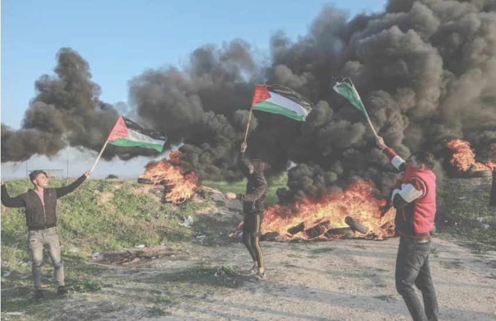

Am 26. Januar hat die israelische Armee bei einer Militaroperation in der
Stadt Dschenin im Westjordanland 10 Palastinenser ermordet und 20 weitere zum
Teil schwer verletzt. Ziel der Operation waren mehrere Wohnhauser, ein
Fluchtlingslager und ein Krankenhaus. Gerechtfertigt wurde diese als eine
Aktion gegen sogenannte „Terroristen", wie die nationale Befreiungsbewegung
und andere Widerstandige bezeichnet werden. Mitglieder der nationalen
Befreiungsorganisationen Hamas und Islamischer Jihad wehrten sich zum Teil mit
Schusswaffen gegen das Massaker. Unter den Toten war neben mehreren jungen
Mannern auch eine 61-jahrige, die in ihrem eigenen Haus durch einen
Genickschuss regelrecht hingerichtet wurde. Außerdem wurde eine
Tranengasgranate in eine Kinderstation eines ortlichen Krankenhauses gefeuert,
wodurch mehrere Kinder verletzt wurden.

Seit letztem Jahr ist wieder ein enormer Anstieg des Terrors Israels gegen das
palastinensische Volk zu erkennen. 225 Palastinenser wurden im letzten Jahr
durch israelische Besatzungstruppen getotet - die hochste Zahl seit 15 Jahren.
Allein im Januar 2023 wurden bereits 30 Palastinenser umgebracht.

Mit diesem Ansturm der Aggression wachst aber auch der Widerstand des
palastinensischen Volkes. Nach der Militaroperation in Dschenin feuerte die
Hamas zwei Raketen aus dem Gazastreifen auf Israel. Dazu gingen Massen auf die
Straße, um gegen die Besatzung und die andauernden reaktionaren Operationen zu
protestieren. In Jerusalem schossen israelische Sicherheitskrafte auf eine
Demonstration, wodurch ein 22-jahriger Palastinenser ermordet wurde. Am
Freitag den 27. Januar bombardierte Israel dann den dicht besiedelten
Gazastreifen. Dabei sollen laut offiziellen Angaben nur militarische
Stellungen angegriffen worden sein, was Israel nach jedem Bombardement
offiziell verlauten lasst.

Die neue reaktionare Regierung Israels setzt seit dem Wochenende außerdem ihre
neuen sogenannten „Antiterrorgesetze" um. Durch diese durfen die Wohnhauser
von all jenen, die Israel als Terroristen ansieht, kunftig geraumt und
zerstort werden. Des Weiteren werden Familien von sogenannten Terroristen in
Sippenhaft genommen, indem ihnen Rechte entzogen werden durfen, einfach nur,
weil sie verwandt sind. Diese Maßnahmen erhohen die Unterdruckung des
palastinensischen Volkes und die Repression gegen die nationale
Befreiungsbewegung weiter. Sie sind dennoch nur ein jammerlicher Versuch den
palastinensischen Widerstand zu brechen, der das Volk in ihrem Kampf nur
befeuern wird.

Source: [https://www.demvolkedienen.org/index.php/de/t-international/7454-palaestina-israel-erhoeht-aggression](https://www.demvolkedienen.org/index.php/de/t-international/7454-palaestina-israel-erhoeht-aggression)

<!--NEWS-->

# pc 1 febbraio - Bombe nucleari NATO in Italia: l'imperialismo USA e il governo e parlamento italiano complici a tappe forzate ci trascinano nell'escalation bellica

Author: prolcomra

Time: 2023-02-01T20:00:00+01:00

Images: ['[bombe%20nucleari.jpg](https://blogger.googleusercontent.com/img/b/R29vZ2xl/AVvXsEglQ6mywZzFkSghSeUCH5b8hJazW2kR9IbCx6gZstqNKuBVR9WTzJTYfzYvv8EkPpx_1aEve3Te5pVIce6Z6ulGlXGXsWqE198xQ2AM3pwuw4QzWNus9lX2stssHfjZee0nACsNow5Te0Z68K_S76wRFKj2sMe2U3y6zyj1ILC33A7NtUxKWylTkXe-_w/w514-h289/bombe%20nucleari.jpg)']

<!--METADATA-->

**Davanti alle Basi della morte diventa sempre più necessaria la mobilitazione
del movimento contro la guerra interimperialista**

  

  
 osservatoriodiritti

di Giorgio Beretta

30/1/2023

 **Rischio nucleare Italia: le nuove bombe a Ghedi e Aviano**

Stanno per arrivare dagli Stati Uniti anche a Ghedi (Brescia) e Aviano
(Pordenone) le bombe nucleari di "nuova generazione" B61-12. Sostituiranno le
vecchie B61-11 dislocate da anni nelle basi militari in Belgio, Germania,
Paesi Bassi, Turchia e Italia nell'ambito della cosiddetta dottrina del
nuclear sharing,

la "condivisione nucleare" della Nato.

Vengono definiti "ordigni nucleari tattici", ma non sono meno pericolose delle
"bombe nucleari strategiche" presenti negli arsenali di Stati Uniti, Russia,
Cina, Francia, Regno Unito, India, Pakistan, Israele e Corea del Nord.

La "potenza regolabile" della nuove B61-12 varia da 0,3 a 50 chilotoni, cinque
volte superiore alla bomba di Hiroshima. Ma - segnalano Rete Pace e Disarmo e
Campagna Ican - possono esplodere sotto la superficie terrestre aumentando
così la loro capacità distruttiva fino a raggiungere l'equivalente di un'arma
a scoppio in superficie con una resa di 1.250 chilotoni, cioè circa 83 bombe
come quella usata a Hiroshima.

 **Oggi l 'Italia è un possibile bersaglio nucleare**

Tutto questo rende **Ghedi** e **Aviano** , ma di riflesso anche **Brescia** e
**Pordenone** , **possibile bersaglio nella guerra nucleare**. Una eventualità
oggi non più così remota: in questi mesi le autorità russe hanno manifestato
la possibilità di impiegare bombe nucleari tattiche in Ucraina.

Per tutta risposta, l'amministrazione di Joe Biden ha deciso di mantenere in
vigore la possibilità di utilizzare per primi gli ordigni nucleari,
rinunciando così ad introdurre la regola del No first use. Non solo: il rapido
mutamento dello scenario mondiale sta portando a giustificare anche l'uso
preventivo delle armi nucleari per difendere quello che i vertici americani ed
europei definiscono l'"ordine basato sulle regole".

Le bombe nucleari, anche quelle "tattiche", non possono quindi più essere
considerate uno strumento di mera deterrenza, ma espongono le popolazioni dei
territori in cui sono stoccate ad essere bersagli del "primo colpo" o di
ulteriori ritorsioni.

Source: [https://proletaricomunisti.blogspot.com/2023/02/pc-1-febbraio-bombe-nucleari-nato-in.html](https://proletaricomunisti.blogspot.com/2023/02/pc-1-febbraio-bombe-nucleari-nato-in.html)

<!--NEWS-->

# Uutisia Meksikosta

Author: mats

Time: 2023-02-01T99:00:00

Images: ['[sol1.png](https://punalippu.noblogs.org/files/2023/02/sol1.png)', '[sol2.png](https://punalippu.noblogs.org/files/2023/02/sol2.png)', '[sol3.png](https://punalippu.noblogs.org/files/2023/02/sol3.png)', '[sol4.png](https://punalippu.noblogs.org/files/2023/02/sol4.png)', '[sol5.png](https://punalippu.noblogs.org/files/2023/02/sol5.png)', '[sol6.png](https://punalippu.noblogs.org/files/2023/02/sol6.png)', '[sol7.png](https://punalippu.noblogs.org/files/2023/02/sol7.png)', '[sol8.png](https://punalippu.noblogs.org/files/2023/02/sol8.png)', '[sol9.png](https://punalippu.noblogs.org/files/2023/02/sol9.png)', '[sol10.png](https://punalippu.noblogs.org/files/2023/02/sol10.png)', '[sol11.png](https://punalippu.noblogs.org/files/2023/02/sol11.png)', '[sol12.png](https://punalippu.noblogs.org/files/2023/02/sol12.png)', '[sol13.png](https://punalippu.noblogs.org/files/2023/02/sol13.png)']

Categories: ['Yleinen']

<!--METADATA-->

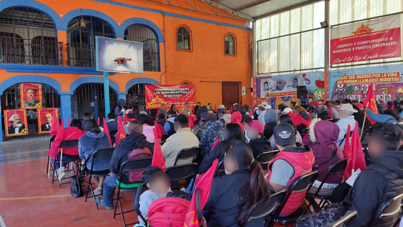

Kansanvirtaus – Punainen Aurinko (Corriente del Pueblo – Sol Rojo)
organisaation toverit ovat julkaisseet tärkeän uutisen.

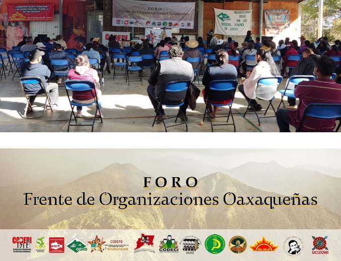

Tammikuun 13.päivä Oaxacan osavaltiossa kolmentoista vallankumouksellisen ja
demokraattisen järjestön rintama (Frente Organizaciones Oaxaqueñas [FORO])
organisoi konferenssin: "Oaxacan tilanne, kansanliikkeen haasteet".
Konferenssissa tehtiin tärkeitä sopimuksia. Konferenssin poliittisen
julkilausuman voi lukea espanjaksi
[täällä](http://solrojista.blogspot.com/2023/01/declaracion-politica-del-
frente-de.html).

Kansanvirtaus – Punainen Aurinko järjesti myös seuraavana päivänä (14.1)
konferenssin, joka järjestettiin tärkeänä ajankohtana nyt kun maa ajautuu yhä
enemmän taantumukselliseen militarismiin. Solrojistojen konferenssi on tärkeä
osa tiellä kansanrintaman rakentamiseksi. Konferenssin poliittisen
julkilausuman voi lukea espanjaksi
[täällä](http://solrojista.blogspot.com/2023/01/declaracion-politica-del-
frente-de.html).

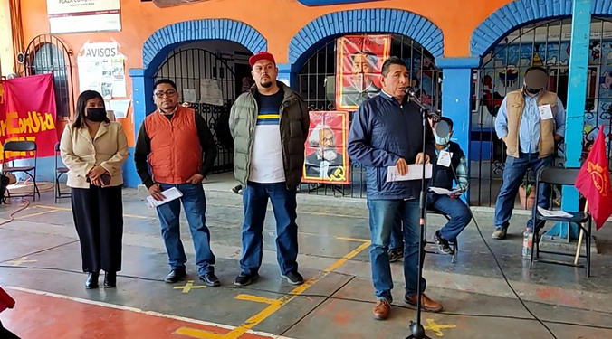
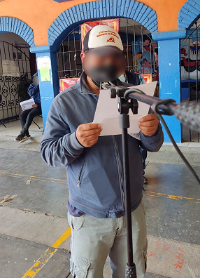
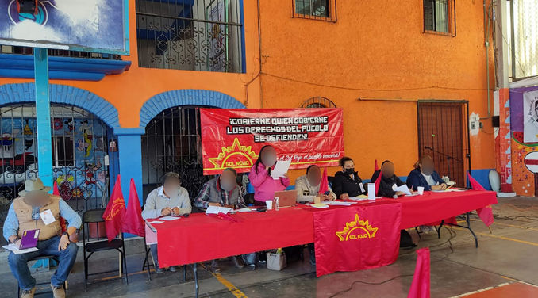
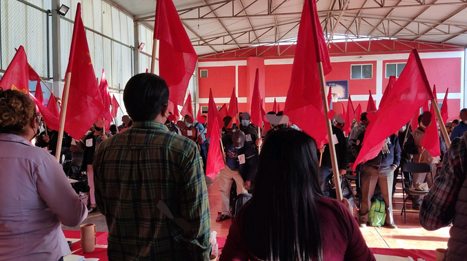
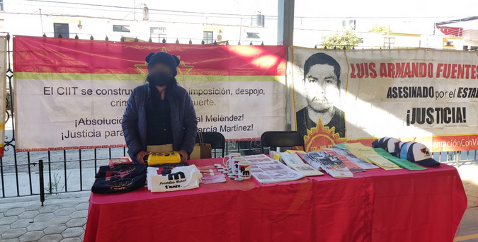

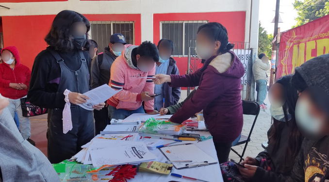
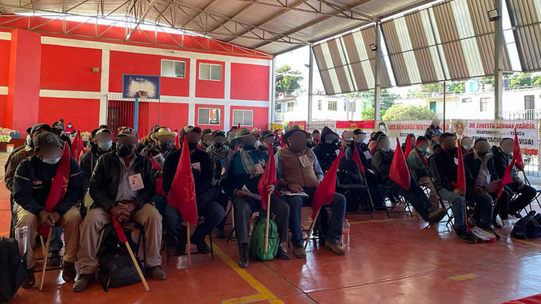
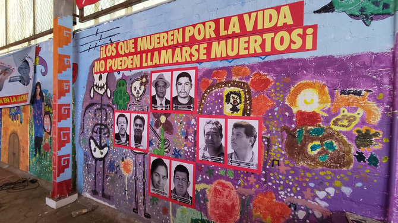
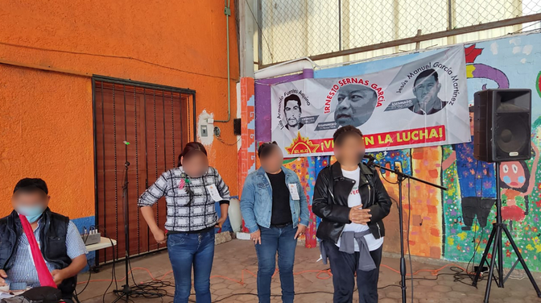

Source: [https://punalippu.noblogs.org/post/2023/02/01/uutisia-meksikosta/](https://punalippu.noblogs.org/post/2023/02/01/uutisia-meksikosta/)

<!--NEWS-->

# Unidad contra el ajuste y en defensa de la soberanía

Author: carga

Time: 2023-02-01T99:00:00

Head Description: La rebelión del hermano pueblo peruano marca un camino para los pueblos de la región y el mundo. En Argentina, mientras las potencias imperialistas se disputan nuestros recursos naturales, crecen las luchas por las emergencias y en defensa de nuestra soberanía.

Description: 1. Viva la rebelión del pueblo peruano ¡Basta de represión! Sigue en las calles la rebelión del pueblo peruano y también crece la represión con más de 63 asesinados, miles de presos y heridos. Desde el PCR y su JCR y todos los movimientos de masas de los que participamos impulsamos en todo el país&hellip;

Images: ['[pintada-por-Perú-en-Quilmes-Berazategui-Varela.jpg](https://pcr.org.ar/wp-content/uploads/2023/01/pintada-por-Perú-en-Quilmes-Berazategui-Varela.jpg)']

Type: article

<!--METADATA-->

**1.** **Viva la rebelión del pueblo peruano ¡Basta de represión!**

Sigue en las calles la rebelión del pueblo peruano y también crece la
represión con más de 63 asesinados, miles de presos y heridos.

Desde el PCR y su JCR y todos los movimientos de masas de los que participamos
impulsamos en todo el país una gran campaña de masas en solidaridad con el
pueblo peruano, repudiando la feroz represión.

El golpe de Estado derrocó al presidente Pedro Castillo e impuso la
presidencia de facto de Dina Boluarte. El Congreso, controlado por la derecha
fascista, rechazó la posibilidad de una nueva elección este año.

Todos los imperialismos reconocieron al gobierno golpista. Disputan asociados
a distintos sectores de las clases dominantes peruanas, pero confluyen a la
hora de reprimir la movilización popular y sofocar la rebelión.

En Perú la disputa imperialista tiñe la situación del país. La tradicional
derecha proyanqui ha ido cediendo terreno ante el avance del imperialismo
chino, que se ha convertido en el principal socio comercial de Perú y controla
el cobre (Perú es el segundo productor mundial) y tiene importantes
inversiones estratégicas, entre ellas la construcción del puerto de Chancay
sobre el Pacífico, clave para el avance de la penetración china sobre América
del Sur y para su disputa imperialista por el Pacífico.

También el imperialismo japonés tiene importantes inversiones que avanzaron
principalmente durante la presidencia de Fujimori.

La rebelión del movimiento obrero y de los originarios y campesinos del
interior del país, viene movilizando grandes caravanas desde las provincias
andinas y las barriadas populares de Lima.

A esa movilización popular se sumó una caravana de reservistas y licenciados
de las Fuerzas Armadas, de más de 10.000 integrantes y dicen que llegarían a
Lima 30.000. Un hecho de enorme importancia, que fractura la estructura
militar y se suma al reclamo popular de barrer el gobierno y el Congreso
golpistas.

El presidente de México, López Obrador, pidió la liberación del presidente
derrocado, Pedro Castillo. Reclamo democrático que no se pudo aprobar en la
reciente reunión de la CELAC.

La profundidad de la rebelión de las masas campesinas, originarias, obreras,
estudiantiles y populares de Perú reclama cambios profundos. Hasta dónde
llegará esta lucha dependerá de que haya una vanguardia capaz de abrir un
camino revolucionario. Pero seguramente nada volverá a ser igual en este
hermano país.

Nuestro deber como comunistas revolucionarios es plantear esta situación entre
las masas en cada lugar de trabajo, estudio y militancia, para que haya
cientos de pronunciamientos en solidaridad con la heroica lucha del pueblo
peruano y **que exijan al gobierno argentino que reclame la libertad de Pedro
Castillo y repudie el golpe de Estado. El pueblo peruano es el único dueño de
su destino.**

****

**2.** **La invasión rusa a Ucrania y la guerra mundial**

“La guerra es un fracaso de la política, un fracaso de la humanidad, una
claudicación vergonzosa, una derrota frente a las fuerzas del mal. Si pensamos
que en este siglo último hubo tres guerras mundiales, 1914 al 1918, 1939 al
1945 y **esta actual que es una guerra mundial”.** La afirmación es del papa
Francisco por la invasión rusa a Ucrania.

**Putin subestimó al pueblo ucraniano que** hizo suya esa guerra patriótica.
El imperialismo ruso ha usado gran parte de sus reservas de misiles para
destruir edificios y asesinar a la población civil, buscando un genocidio que
siembre miedo y consiga un triunfo rápido. Y fue todo lo contrario.

**La invasión rusa a Ucrania coloca al mundo al borde de una nueva guerra
mundial.**

Estados Unidos enviará ahora 31 tanques Abrams. El gobierno de Biden lo
decidió después de que Alemania aceptó enviar 14 tanques Leopard de su propio
arsenal. El gobierno alemán había dicho que no iba a enviar los Leopard a
menos que Estados Unidos pusiera a disposición los Abrams.

En total, Francia, Inglaterra, Estados Unidos, Polonia, Alemania, Holanda y
Suecia enviarán alrededor de 160 tanques y vehículos blindados.

El imperialismo ruso respondió a estos anuncios con una nueva oleada de
ataques con misiles y bombardeos sobre Kiev y otras ciudades, y prepara una
gran ofensiva que se adelante a la llegada y puesta en marcha de los tanques.

**¡Fuera de Ucrania el imperialismo genocida ruso! ¡Fuera el imperialismo
yanqui y la OTAN! ¡Viva la heroica lucha patriótica del pueblo ucraniano!**

**3.** **La CELAC y el nuevo escenario de Latinoamérica**

La semana pasada, en el hotel Sheraton de la CABA se realizó la reunión de la
Comunidad de Estados Latinoamericanos y Caribeños (CELAC).

Alberto Fernández presidió la CELAC durante un año. Fue designado como sucesor
Ralph Gonsalves, impuesto por México. Es el primer ministro de San Vicente y
las Granadinas, una pequeña isla del Caribe, de habla inglesa, que aún
reconoce a la corona británica como su cabeza de Estado. Al mismo tiempo,
Gonsalves mantiene buenas relaciones con Cuba y Venezuela, y reiteró el apoyo
de su país a la demanda argentina por la reanudación de negociaciones con el
Reino Unido respecto a la soberanía de las Islas Malvinas.

La presencia de Lula, el nuevo presidente de Brasil, abrió cambios en la
región: propuso retomar y fortalecer el Mercosur, negociar en primer lugar con
la Unión Europea y luego con China. El Mercosur lo integran: Argentina,
Brasil, Paraguay, Uruguay y Venezuela (suspendida desde el 2017). Y como
Estados asociados: Chile, Colombia, Ecuador, Guyana, Perú y Surinam.

Con Lula también se abrieron negociaciones para el intercambio comercial y la
posibilidad de una ayuda financiera a la Argentina. Fue importante la
presencia de Evo Morales, el expresidente de Bolivia.

El presidente chino Xi Jinping, envió un video a la Celac en el que afirmó que
“El mundo ha entrado en un nuevo período de turbulencias y transformaciones” y
llamó a “impulsar la cooperación Sur-Sur”.

Organizaciones sociales y sindicales debatieron y presentaron un documento con
sus reclamos y sus posiciones antiimperialistas, como lo expresó el compañero
Ramiro Berdesegar, dirigente de la CCC y el PCR. Y el 24/1 se movilizaron
masivamente al Sherato, la CCC, el Movimiento Evita, la CTA y otras fuerzas
populares.

**4.** **Disputas en Juntos por el Cambio**

El PRO y Juntos por el Cambio son una “bolsa de gatos” y viven una feroz
disputa por los cargos para las elecciones de este año.

Tras el clima triunfalista por la victoria en 19 provincias en las elecciones
de 2021, creció la disputa interna con la rebelión de dirigentes provinciales:
Tucumán, Chubut, Salta, Córdoba, Río Negro y otras.

Patricia Bullrich (PRO), Gerardo Morales (UCR), Maximiliano Ferraro (Coalición
Cívica) y Miguel Ángel Pichetto (Encuentro Republicano Federal) se reunieron
este miércoles, como presidentes de las fuerzas que componen Juntos por el
Cambio. Acordaron “sancionar” a quienes no cumplan con las reglas internas de
la alianza para las elecciones anticipadas. Tratan de poner un límite a las
disputas por las listas de las provincias.

Macri se plantó: “Estoy en el ring y voy a pelear”. Elisa Carrió, le marcó la
cancha a Juntos por el Cambio: quiere ser candidata a presidenta para buscar
la “unidad”.

Manes pidió ampliar JxC, y le pidió a Schiaretti que no adelante las
elecciones en Córdoba.

La exgobernadora bonaerense María Eugenia Vidal, que también se anota en la
carrera presidencial, habla de una reforma previsional “porque el sistema está
quebrado”, y quiere “discutir” el sistema de indemnizaciones.

Este 12/2 se realizan internas en la Pampa, en las que Juntos por el Cambio va
a decidir sus candidatos entre el radicalismo y el Pro. El Frente
Justicialista pampeano unificó sus listas con poca discusión democrática y no
va a internas.

Más allá de sus disputas internas, el macrismo y los sectores que lo respaldan
quieren volver al gobierno para profundizar el ajuste, el hambre y la entrega.
**Es a quienes dirigimos el golpe principal de la lucha popular.**

**5.** **El juicio a la Corte Suprema**

El Congreso comenzó a tratar la posibilidad de un juicio político a la Corte
Suprema de Justicia. El 2 de febrero expondrán los denunciantes y el 9 se
votará.

El gobierno necesita dos tercios del Senado y de Diputados para aprobar el
juicio político, pero no tiene ni siguiera la mitad de cada una de esas
cámaras con lo que difícilmente el juicio político prospere.

Más allá de esto, esta discusión pone sobre la mesa el accionar corrupto de la
justicia argentina y su Corte Suprema, que muestran una y otra vez la
podredumbre de las instituciones de este Estado de las clases dominantes, que
es usado por los distintos sectores en su disputa, y también para reprimir y
disciplinar a las organizaciones sociales y políticas como la CCC y el PCR a
través de causas judiciales a la medida de su política de ajuste.

**6.** **Unidad en las calles contra el ajuste, por pan, trabajo y soberanía**

Vecinos de Quilmes saquearon camiones con ganado y se reparten la carne en la
calle: no tienen para comer.

Siguen aumentando los alimentos, los alquileres, los combustibles, las
tarifas, las prepagas y la telefonía. El precio de la vaca aumentó 17%, lo que
subiría la carne hasta el 40%.

En las zonas agrarias la sequía dejó al obrero sin trabajo y al chacarero
endeudado. Perdieron los cultivos iniciales y ahora están perdiendo los
tardíos. Muchos campesinos pobres y pequeños productores dejan sus campos y
crece la concentración de la tierra en manos de los pules y grandes
terratenientes.

Urge financiamiento, subsidios y créditos blandos, golpeando al sector de los
dueños de la tierra, que se llevan en concepto de renta 7 mil millones de
dólares, con un impuesto especial. También una ley de arrendamiento rural que
permita al productor rediscutir el alquiler en casos de emergencia como la
actual sequía.

La **emergencia social** no es el centro de la política del gobierno. El
centro de su política es **cumplir con el acuerdo con el FMI, el Club de París
y demás usureros de afuera y de adentro, recortando los planes sociales, los
salarios y las jubilaciones.**

Con esa gran mentira de que la salida a esta situación viene de la
diversificación de la dependencia, se festejan los acuerdos que se adueñan de
nuestras riquezas naturales y de nuestra soberanía.

Un tribunal aprobó la explotación del petróleo en Mar del Plata: ¡A la Shell!
La empresa de los que colonizan nuestras Malvinas y nuestra soberanía en el
Atlántico Sur y en el sector de la Antártida. Festejan la entrega del litio en
bruto, cuando Bolivia lo explota con una empresa nacional.

Las petroleras imperialistas nos imponen precios de los combustibles con super
ganancias. Se sigue descuartizando Vaca Muerta y Cerro Dragón a manos de las
empresas imperialistas.

Crece la disputa por nuestros recursos. El gobierno cede frente a los
monopolios exportadores y sobre el control de la mal llamada hidrovía. El
gobierno de Tierra del Fuego negocia con China la construcción de un puerto
estratégico. Y Lewis sigue adueñándose de la Patagonia, entregándosela al
imperialismo inglés.

Con esta política el gobierno ha perdido apoyo popular, porque no toca los
intereses de los poderosos y se agravó el hambre, la pobreza y la entrega de
nuestra soberanía nacional. Esto envalentona a la derecha reaccionaria en sus
planes de profundizar el ajuste, como hizo Milei anunciando su “plan
motosierra” para reducir el Estado y eliminar los ministerios de Salud,
Educación, Trabajo y el de Mujeres y Diversidades.

Crecen las luchas obreras, campesinas, de originarios, de los jóvenes, de las
mujeres, las luchas en defensa de nuestra soberanía. Son miles en la Argentina
los que vienen protagonizando sus reclamos y se unen en las calles

**Seguimos en la pelea por avanzar en estas luchas y unirnos con todos los
sectores populares y nacionales para que estas confluyan e impongan desde las
calles que la crisis la paguen los que se la están llevando en pala y se rompa
el acuerdo infame con el FMI y todos los acuerdos antinacionales con distintos
imperialismos. Solo así podremos avanzar en resolver las emergencias y en la
defensa de nuestra soberanía nacional.**

****

**7.** **Seguir a la cabeza de las luchas y no subestimar al enemigo**

El compañero Sebastián Saldaña, coordinador de la CCC de la ciudad de Santa
Fe, recibió en su casa una amenaza de muerte a él, su hijo, su beba y todo su
entorno. La nota llevaba una bala pegada con cinta. Decenas de organizaciones
sindicales y políticas santafesinas, la Mesa Nacional de la CCC y el PCR
repudiaron este hecho, exigiendo a los distintos niveles del Estado la pronta
investigación y resguardo del compañero y de su familia, el esclarecimiento
del hecho y el castigo a los responsables.

Esto sucede a pocos días del intento de asesinato del compañero Lautaro Nahuel
Ardura, en La Pampa. Son hechos que muestran que hay una derecha fascista que
trata de golpearnos, y un Estado enemigo de las fuerzas populares.

También avanzan en distintos lugares del país causas judiciales contra
compañeras y compañeros de la CCC y el PCR impulsados por sectores macristas y
otros de la justicia.

Las clases dominantes usan todo el aparato del Estado -el “legal” y el
mafioso- para aislar y atacar a los que encabezan la lucha popular. Esto exige
que sigamos en la lucha peleando la más amplia unidad como se expresó con la
gran solidaridad recibida ante estos ataques, y levantar la guardia para
garantizar la continuidad de las luchas populares por pan, tierra, trabajo y
soberanía.

**8.** **Nuestro objetivo es la revolución de liberación nacional y social**

Al cierre de esta edición, cientos de compañeras y compañeros de Río Negro y
de distintos puntos del país realizaban la Séptima marcha multisectorial a
Lago Escondido, repudiando la presencia del magnate inglés Lewis y reiterando
el reclamo soberano en esa zona de nuestra patria.

El 1 de febrero, decenas de organizaciones, entre las que se cuenta la CCC y
el PTP-PCR, marchan a la Corte Suprema en CABA y a los juzgados federales de
todo el país exigiendo el cese de la persecución a las organizaciones sociales
y sindicales, y a sus dirigentes.

Con las Resoluciones del 13 Congreso del PCR vamos al encuentro del gran
debate político que hay en las masas alrededor de cuál es la salida a favor
del pueblo.

Poniendo el centro en encabezar las luchas y acumular fuerzas revolucionarias,
proponemos afiliación a nuestro Partido y su Juventud a todos los compañeros y
compañeras con los que compartimos la lucha diaria.

Abordamos esa discusión de masas con una propuesta expresada en nuestro
programa de _Diez Medidas_. Ese debate incluye las propuestas electorales de
cada distrito, que se adelantan en muchas provincias, y la elección nacional.
Pero que va más allá, porque lo que está en juego es avanzar en la unidad para
la lucha de los sectores populares, en el camino de una revolución que nos
libere del latifundio y la dependencia, y permita la construcción de un nuevo
Estado, en manos de la clase obrera y el pueblo.

**_Escriben Ricardo Fierro y Germán Vidal_**

Foto: Pintada en Quilmes-Berazategui-Varela en solidaridad con la heroica
lucha del pueblo peruano

Source: [https://pcr.org.ar/nota/unidad-contra-el-ajuste-y-en-defensa-de-la-soberania/](https://pcr.org.ar/nota/unidad-contra-el-ajuste-y-en-defensa-de-la-soberania/)

<!--NEWS-->

# ΧΑΝΙΑ| Σύσκεψη για διοργάνωση αντιπολεμικής – αντιιμπεριαλιστικής διαδήλωσης - ΚΚΕ(μ-λ)

Author: ΚΚΕ(μ-λ)

Time: 2023-02-01T99:00:00

Description: Η οργάνωση Χανίων του ΚΚΕ(μ-λ) καλεί σε ανοικτή σύσκεψη συλλογικότητες, οργανώσεις και αγωνιστές της πόλης την Δευτέρα 6 Φλεβάρη στις 7.00μ.μ. στο Εργατικό Κέντρο Χανίων με στόχο τη συζήτηση για τη διοργάνωση κινητοποίησης ενάντια στην επίσκεψη στις 20-21 Φλεβάρη του υπουργού εξωτερικών των ΗΠΑ Μπλίνκεν, στη χώρα μας .

Images: ['[antoni-mplinken-600x375.jpeg](https://www.kkeml.gr/media/u2xetuwg/antoni-mplinken-600x375.jpeg)']

Type: article

<!--METADATA-->

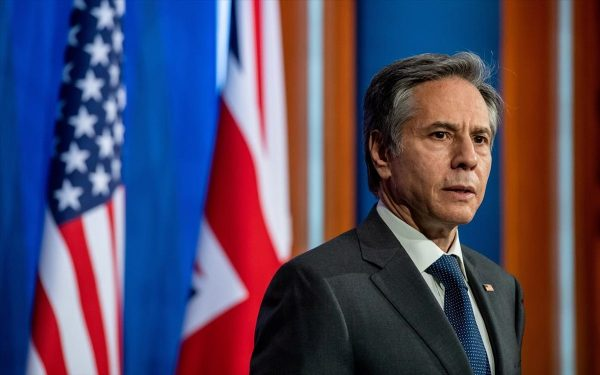

Η οργάνωση Χανίων του ΚΚΕ(μ-λ) καλεί σε ανοικτή σύσκεψη συλλογικότητες,
οργανώσεις και αγωνιστές της πόλης την Δευτέρα 6 Φλεβάρη στις 7.00μ.μ. στο
Εργατικό Κέντρο Χανίων με στόχο τη συζήτηση για τη διοργάνωση κινητοποίησης
ενάντια στην επίσκεψη στις 20-21 Φλεβάρη του υπουργού εξωτερικών των ΗΠΑ
Μπλίνκεν, στη χώρα μας .

Ο εκπρόσωπος του αμερικάνικου ιμπεριαλισμού επιτήρησε αυτές τις μέρες την
καταδυνάστευση και σφαγή των Παλαιστινίων από το σιωνιστικό Ισραήλ και
ευλόγησε επιθετικές δράσεις κατά του Ιράν. Σε είκοσι μέρες θα είναι ξανά στην
περιοχή με επίσκεψη στη χώρα μας και την Τουρκία και συμμετοχή στο σχήμα 3+1
(Ελλάδας- Κύπρου- Ισραήλ + ΗΠΑ).

Η επίσκεψή του στοχεύει στη δέσμευση του πολιτικού προσωπικού μπροστά στις
εκλογές για ενίσχυση της εμπλοκής της χώρας μας στον πιο επικίνδυνο πόλεμο
μετά το Β’ Παγκόσμιο που κλιμακώνεται στην Ουκρανία, καθώς και στα σχέδια
ενίσχυσης της ιμπεριαλιστικής παρουσίας των ΗΠΑ στη νοτιοανατολική Μεσόγειο
και τη Μέση Ανατολή.

Η ενίσχυση της φιλίας και της αλληλεγγύης των λαών είναι ο μόνος τρόπος για να
αποτραπούν τα ανθρωποσφαγεία που γεννά ο εντεινόμενος ιμπεριαλιστικός
ανταγωνισμός. Η απαίτηση να πάψει η εμπλοκή της χώρας μας με την αποστολή
όπλων στον πόλεμο, την επέκταση και ένταση της χρήσης των βάσεων, είναι ανάγκη
να διατρανωθεί αγωνιστικά τη μέρα της επίσκεψης του εκπροσώπου του
αμερικάνικου ιμπεριαλισμού στη χώρα μας.

ΗΠΑ- ΝΑΤΟ- ΡΩΣΙΑ εντείνουν το ανθρωποσφαγείο στην Ουκρανία, ανατροφοδοτούν την
κρίση και τους ανταγωνισμούς τους που οδήγησαν στον πόλεμο και διαμορφώνουν
όρους γενικευμένης σύγκρουσης. Μόνο η πάλη των λαών μπορεί να τους φράξει το
δρόμο. Ας αναλάβουμε τις ευθύνες που μας αντιστοιχούν και ας μην υποτιμάμε τη
δυναμική των ήδη υπαρκτών αντιστάσεων και τη δύναμη που μπορεί να γεννήσει η
πάλη των λαών για την ειρήνη, τη ζωή και το δίκιο τους.

_Χανιά 1-2-2023_

Source: [https://www.kkeml.gr/χανια-σύσκεψη-για-διοργάνωση-αντιπολεμικής-αντιιμπεριαλιστικής-διαδήλωσης/](https://www.kkeml.gr/χανια-σύσκεψη-για-διοργάνωση-αντιπολεμικής-αντιιμπεριαλιστικής-διαδήλωσης/)

<!--NEWS-->

# İnfazı yakılan tutsak Kadir Karabak’ın durumuna ilişkin açıklama yapılacak

Author: kaypakkaya haber

Time: 2023-02-02T01:22:00

Description: İnfazı fiili olarak yakılan tutsak Partizan Kadir Karabak&#039;la ilgili İHD İstanbul Şube&#039;de bir basın toplantısı düzenlenecek.

Images: ['[aciklama-cagri-3.jpg](https://www.kaypakkayahaber.com/sites/default/files/styles/grid-34/public/aciklama-cagri-3.jpg)']

<!--METADATA-->

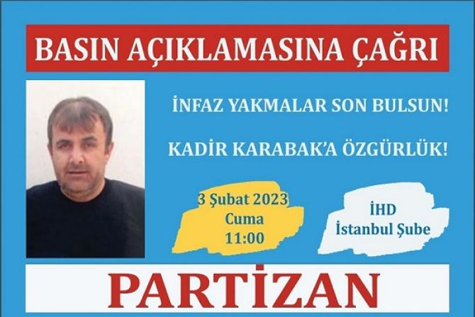

Tekirdağ 2 No’lu F Tipi Hapishanesinde bulunan tutsak Partizan Kadir
Karabak’ın tahliyesi ikinci defa ertelendi.

Hapisahne idaresi 6.5 ve 9 yaşındaki kızlarının örgütsel faaliyet yürüttüğünü,
Kadir Karabak’ın da kızlarının bu durumu neticesinde salıverilmesi durumunda
örgütsel faaliyete katılacağı gerekçesiyle tahliyesini bir kez daha erteledi.

Böylelikle Kadir Karabak’ın fiili olarak infazı yakılmış oldu. Bugünkü durumda
Kadir Karabak yatması gereken süreyi doldurmuş bulunuyor.

Yaşanan keyfi ve hukuksuz duruma ilişkin dikkat çekmek amacıyla Partizan yarın
İHD İstanbul Şube’de saat. 11:00’de bir basın toplantısı düzenleyecek.

28

Source: [https://www.kaypakkayahaber.com/haber/infazi-yakilan-tutsak-kadir-karabakin-durumuna-iliskin-aciklama-yapilacak](https://www.kaypakkayahaber.com/haber/infazi-yakilan-tutsak-kadir-karabakin-durumuna-iliskin-aciklama-yapilacak)

<!--NEWS-->

# TKP-ML TİKKO Savaşçıları Parti Ve Devrim Şehitlerini Andı

Author: kaypakkaya haber

Time: 2023-02-02T01:36:00

Description: Devrim ve Komünizm Şehitleri Ölümsüzdür

Images: ['[tkpmltikko-678x381.png](https://www.kaypakkayahaber.com/sites/default/files/styles/grid-34/public/tkpmltikko-678x381.png)']

<!--METADATA-->

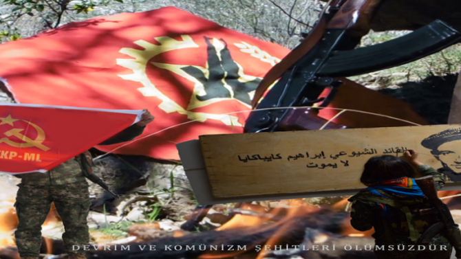

TKP-ML TİKKO savaşçıları Parti ve Devrim şehitlerini andı. Anma etkinliği
insanlığın kurtuluşu için mücadele yürüten başta parti şehitleri olmak üzere
tüm devrim ve komünizm şehitleri için yapılan bir dakikalık saygı duruşu ile
başladı.

Günün anlam ve önemine dair ilk olarak Ortadoğu Parti Komitesi adına bir
açılış konuşması yapıldı. _“Onların ideallerini, düşlerini yaşatmaya nerede
olursak olalım devam edeceğimizin sözünü veriyoruz. Daha inançlı daha
kararlıyız”_ denilen açılış konuşmasının ardından TKP-ML Ortadoğu Parti
temsilcisi bir konuşma yaptı. Temsilci “ _1978 yılından bugüne kadar her Ocak
ayının son haftasında şehitlerimizi anıyoruz. Bugün de bunun için toplandık.
Şehitlerimiz bize her zaman özgürlüğü ve onu gerçekleştirene kadar mücadelede
ısrarı işaret ediyor_ ” dedikten sonra sözlerine şöyle devam etti;

“ _İçinde bulunduğumuz yıl aynı zamanda partimizin kurucusu İbrahim Kaypakkaya
yoldaşın TC faşizmi tarafından katledilmesinin 50. yıldönümüdür. Önder
yoldaşın 50. ölümsüzlük yıldönümünde Kaypakkaya yoldaş, ‘Hesaplaşma, Kopuş ve
Yeni Bir Yol’ olarak devrim ve komünizm mücadelesinde yaşamaya, savaşmaya ve
yol göstermeye devam ediyor. İbrahim Kaypakkaya sadece Türkiye halklarının
önderi değildir. O, aynı zamanda Kafkaslar’ın, Ortadoğu’nun önderidir. Onun
düşünceleri günceldir, gerçektir. Biz böyle bir öndere sahibiz, böyle bir
önderin ardıllarıyız_.”

Son olarak TKP-ML TİKKO Genel Komutanlık adına bir konuşma yapıldı. Bu
konuşmada da dünyada ve ülkede duruma değinerek _“Partilileşmenin ve
önderleşmenin bugün her zamandan daha fazla ihtiyaç hale geldiği bir süreçten
geçiyoruz. İşçiler, emekçiler, ezilenler her alanda ve zamanda önderliğini
arıyor. Partilileşme ve önderleşmenin sorumluluğu ve görevlerimizin
ağırlığıyla hareket etmeliyiz. Bunun sözünü vermeliyiz. Partimiz, şehitlerimiz
bizden bunu bekliyor. Bu göreve hazır olacağız_ ” denildi.

Konuşmaların ardından anmaya katılan enternasyonal bir savaşçı da kısa bir
konuşma yaptı. Enternasyonal savaşçı, “ _Devrim şehitlerini anmak demek geride
kalan her savaşçıya büyük sorumluluk ve görevlerin yüklediğini anlamaktır.
Onların her son sözü bizim ilk başlangıç sözümüz olarak okumalıyız. Devrim
şehitlerinin anılarına bağlı kalarak devrimci görevlerimizi yerine
getireceğiz_ ” dedi.

Şehitlere bağlılık sözü ile sonlanan konuşmanın ardından anma etkinliği bir
ağızdan söylenen türkü ve marşlarla sona erdi.

60

Source: [https://www.kaypakkayahaber.com/haber/tkp-ml-tikko-savascilari-parti-ve-devrim-sehitlerini-andi](https://www.kaypakkayahaber.com/haber/tkp-ml-tikko-savascilari-parti-ve-devrim-sehitlerini-andi)

<!--NEWS-->

# 2 de febrero, 80 años de la Victoria de Stalingrado

Author: Revolución Obrera

Time: 2023-02-02T07:52:39-05:00

Images: ['[grado.jpg](https://www.revolucionobrera.com/wp-content/uploads/2023/02/grado.jpg)']

Tags: ['Batalla de Stalingrado', 'derrota del fascismo', 'fascismo', 'Hitler', 'Stalin', 'Stalingrado', 'Unión Soviética']

Categories: ['Efemérides']

<!--METADATA-->

> Stalingrado marcó el ocaso del ejército fascista alemán. Como es sabido,
> después del desastre de Stalingrado, los alemanes no han podido ya reponerse
> más. Stalin

Los fracasos y derrotas de la Guerra Relámpago condujeron a un punto
desesperante a los hitlerianos, pues estos comenzaron a perder las ventajas
temporales ganadas por el sorpresivo y pérfido ataque contra el país de los
Soviets. Ya para el primer semestre del año 1942 el alto mando hitleriano no
podía lanzar una ofensiva general a lo largo de todo el frente, debiendo optar
por escoger un solo objetivo para una gran ofensiva de verano, tal objetivo lo
comprendía los campos petroleros de los montes del Cáucaso que se encontraban
en el suroeste, para tal fin Hitler ordenó conquistar primero la ciudad de
Stalingrado para cimentar el flanco norte. Los fascistas despacharon 1.500.000
soldados, procurando cortar y conquistar hacia el suroeste el suministro de
petróleo de los ejércitos soviéticos y abastecer a sus propias fuerzas. A
Stalingrado el alto mando militar nazi envió a sus mejores generales,
transfiriendo incluso aviones y tanques del frente de África del Norte, a sus
hienas más cualificadas. Sin embargo, el alto mando militar hitleriano seguía
soñando con conquistar Moscú. Con aquella estratagema el fascismo se jugaba el
todo por el todo y buscaba asegurar su futuro y evitar la derrota en el frente
oriental. Mao Tse-tung describió el ataque contra Stalingrado como una
ofensiva «de la que dependía la existencia misma del fascismo».

Por su parte el Partido Comunista bolchevique y los altos mandos del Ejército
Rojo se prepararon ideológica, organizativa y políticamente, con un plan del
que esperaban que Stalingrado se convirtiera en la tumba del fascismo alemán.
Sobre la nueva situación en el frente de guerra Stalin refirió: «¿En qué
consistía, pues, el objetivo principal de la ofensiva alemana? Consistía en
envolver a Moscú por el Este, aislar a la capital de la retaguardia del Volga
y de los Urales y, después, atacarla. El avance de los alemanes en el sur,
hacia las zonas petrolíferas, perseguía no sólo y no tanto el objetivo
auxiliar de ocupar éstas, como de distraer hacía el sur el grueso de nuestras
reservas y debilitar el frente de Moscú, para conseguir más fácilmente el
éxito al atacar a la capital. Esto, precisamente, explica el que la agrupación
principal de las tropas alemanas se encuentre ahora no en el Sur, sino en los
sectores de Orel y Stalingrado». Con aquellas directrices el Ejército Rojo
había venido replegando sus fuerzas a lo largo del río Don organizadamente con
el objetivo de parar el avance nazi en Stalingrado.

El plan para detener el avance nazi en Stalingrado consistía en transformar la
ciudad en una enorme esponja que absorbiera y empantanará la mayor cantidad
posible de tropas alemanas por el tiempo necesario para organizar y concentrar
en secreto en secreto un gran Ejército para después con una fuerte
contraofensiva rodear, atrapar y aniquilar todo el VI Ejército alemán. La
clave para el éxito de aquel plan lo constituía una lucha urbana con
características de guerra de guerrillas apoyada en las masas. Chuikov, quien
comandó la defensa de la gloriosa batalla de Stalingrado, considera dos
momentos en la batalla: «Se divide en dos períodos: el defensivo, del 17 de
julio al 19 de noviembre de 1942, y el ofensivo, del 19 de noviembre de 1942
al 2 de febrero de 1943. La batalla duró seis meses y medio. En ella
participaron por ambas partes más de 2 millones de hombres y una inmensa
cantidad de material de guerra».

#### Periodo Defensivo

En el periodo defensivo sucede una encarnizada lucha en las cercanías a
Stalingrado, en la novela  _Ellos Lucharon por su Patria_  de Mijail Shólojov
escrita en 1942 y en pleno avance del ejército nazi hacía la región de El Don,
se retrata como con la valentía del Ejército Rojo se le ejerce una resistencia
tenaz al avance alemán en cercanías de Stalingrado. En esos momentos el
Partido Comunista, en difíciles condiciones organiza detalladamente la defensa
de la ciudad creando unidades especiales con los miles de sus mejores
militantes y en un breve tiempo logran transformar en un fortín militar a
Stalingrado. Las famosas fábricas Barricada y Octubre Rojo, junto con la
central eléctrica, pasaron a ser centros de preparativos militares. Miles de
milicianos obreros formaron unidades de combate, armados con brazaletes y
rifles. Veteranos de la revolución bolchevique y de la guerra civil,
trabajadores de las acerías, de los ferrocarriles y de los astilleros,
ingenieros de tractores, barqueros del Volga, mujeres y hombres se preparaban
para luchar al lado del Ejército Rojo. Alrededor de las fábricas, otros
trabajadores cavaban trincheras para defenderlas. Durante el avance de las
fuerzas alemanas, la misma población de Stalingrado se precipitó a recoger los
cultivos y a cavar trincheras contra los tanques. De la ciudad se logró
evacuar a la mayoría de los 500.000 habitantes al otro lado del río. Un
historiador burgués describió así la primera batalla en las trincheras
alrededor de Stalingrado: «De la noche a la mañana, la milicia rusa llevó a
cabo un milagro: cavó puestos fortificados interconectados y asimiló los
puntos básicos de la guerra moderna. Ahora, vestidos en su ropa de trabajo o
ropa elegante de domingo, se acurrucaban detrás de los morteros y
ametralladoras para desafiar al mejor ejército de tanques del mundo. Cuando el
Grupo de Combate [alemán] Krupen tambaleó ante su barrera de artillería, los
rusos incluso iniciaron un contraataque, dirigido por tanques T-34 sin pintar,
que salieron directamente de las líneas de ensamblaje».

Los fascistas alemanes iniciaron un ataque aéreo sobre Stalingrado con la
intención de reducirla a cenizas y doblegarla, los bombarderos alemanes Stuka
atacaron en pleno río muchos botes que transportaban civiles y soltaron bombas
de dispersión en medio de las multitudes que esperaban traslado. La fuerza
aérea nazi soltó miles y miles de bombas sobre la ciudad y la dejó en llamas.
Docenas de miles de civiles murieron en los ataques iniciales. Los miembros de
los grupos juveniles comunistas movilizaron a la población para buscar
sobrevivientes colectivamente entre los escombros. Mientras tanto, los tanques
y soldados nazis avanzaban hacia la ciudad con el sueño de atrapar a los
ejércitos soviéticos contra el río y derrotarlos allí, todo en un lapso de 24
horas.

La resistencia en Stalingrado era tenaz, en la heroica defensa antiaérea
soviética Chuikov nos relata:

«En su afán de llegar cuanto antes hasta el Volga en una extensa franja, los
fascistas no cesaron los bombardeos aéreos de Stalingrado ni por un minuto:
sólo el 23 de agosto la aviación fascista hizo dos mil incursiones. Los
soldados de la defensa antiaérea y los pilotos soviéticos rechazaban con todo
coraje los sucesivos ataques de la aviación nazi. En un solo día, el 23 de
agosto, derribaron 90 aviones enemigos. No fueron pocos los casos cuando los
soldados de la defensa aérea tuvieron que librar combates no sólo contra los
aviones, sino también contra los tanques y la infantería del enemigo, como
sucedió en las inmediaciones de Moscú. (…)

La mayoría de las tripulaciones de los cañones antiaéreos y de las luces
reflectoras eran mujeres… Se mantenían firmes y seguían disparando aun cuando
las bombas estallaban a su alrededor, cuando parecía imposible incluso
quedarse en su puesto. En medio de los incendios y el humo, en medio de los
estallidos de las bombas, aparentemente sin importarles las columnas de tierra
que saltaban al aire por todas partes, se mantenían firmes hasta el fin. Por
eso, y a pesar de grandes bajas, los aviones alemanes siempre tropezaban con
un fuego concentrado y sufrían muchas pérdidas. Las artilleras bajaron docenas
de aviones alemanes encima de la ciudad».

Los primeros tanques fascistas llegaron a los suburbios el 1 de septiembre.
Allí se activa el plan y comienza la lucha callejera que se había previsto. La
ciudad destruida con sus escombros y ruinas se convierte en un terreno idóneo
que entorpece el avance de los tanques alemanes y favorece al Ejército Rojo,
los tanques alemanes pasaron a ser presa fácil y los primeros en llegar fueron
destruidos desde los techos de los edificios en ruinas. Chuikov escribió:
«Destruimos por separado la infantería y los tanques que penetraron nuestras
líneas: los tanques no podían hacer mucho sin la infantería, y por eso se
retiraron después de sufrir grandes pérdidas… En los contraataques el enemigo
siempre sufría muchas bajas y tenía que abandonar un ataque. Después tenía que
recorrer el frente en busca de un punto débil en nuestras defensas, perdiendo
tiempo e iniciativa… Muchas veces nuestro propósito no solo era causarles
pérdidas sino, por medio de un ataque sorpresa de infantería y tanques, y con
la ayuda de nuestra artillería y aviones, penetrar sus posiciones, trastornar
sus formaciones, quebrantar su ataque y ganar tiempo».

En la lucha callejera, Chuikov instruye al Ejército Rojo para que aplique la
táctica de  _abrazar al enemigo_ , aprehendiendo de la misma práctica de la
lucha llega a concluir: «Así que nos dimos cuenta de que debíamos reducir a lo
mínimo la tierra de nadie, si era posible a la distancia de una granada». Los
soldados soviéticos trataban de acercarse tanto al enemigo con la intención de
evitar que la fuerza aérea fascista pudiera bombardear las unidades soviéticas
del frente y sus trincheras sin arriesgar la vida de los soldados alemanes. En
la encarnizadas lucha cuerpo a cuerpo que se desató, en donde inclusive las
palas y herramientas de mano se convertían a veces en armas, se elevó la moral
y la intrepidez del Ejército Rojo y decayó la moral de los hitlerianos. «Su
moral no lo podía tolerar. No tenían suficiente valor como para mirar al
soldado soviético cara a cara. Se podía identificar a un soldado enemigo en su
puesto de avanzada desde lejos, especialmente durante la noche, porque
constantemente, cada cinco o diez minutos, disparaba su metralleta con el fin
de reforzar su moral. De esa manera nuestros soldados encontraban a esos
‘guerreros’, se les acercaban sigilosamente y los aniquilaban con una bala o
bayoneta». En aquel nuevo escenario, el ejército fascista comenzó a
desgastarse y toda su lógica de la Guerra Relámpago perdió sustento, Chuikov
testimonia: «La guerra urbana es una clase especial de combate. Las cosas no
se resuelven por medio de la fuerza, sino por la habilidad, la ingeniosidad y
la rapidez… lo clave son las pequeñas unidades de infantería y las armas y
tanques individuales».

Las masas que sobrevivían entre los escombros se convirtieron en un vital
apoyo para Ejército Rojo con la información que aportaban sobre las posiciones
del enemigo. Muchos niños huérfanos sobreviviente entre las ruinas en
ocasiones pasaban a ser «hijos de los regimientos». A estos niños se les
vestía, se les daba de comer y se les daba uniforme militar. Estos con sus
diminutos cuerpos y su agilidad fueron buenos para atravesar escombros,
esconderse y recoger información del enemigo. Anatoli Kúrishev fue un «hijo
del regimiento» que participó en la heroica defensa de la casa Pavlov, donde
un pequeño grupo de soldados durante 58 días logró rechazar todos los ataques
enemigos hasta el último aliento. Anatoli Kúrishev recuerda: «La casa tenía
una gran importancia estratégica por su posición en un sitio abierto que la
hacía de difícil acceso, los soldados pusieron minas alrededor de la casa para
obstaculizar la llegada a ésta. Pavlov me dijo cuando estaba a su lado: Ve
ayudar a Voronov, al tirador de ametralladora y haz lo que él te diga».
Anatoli traía balas y granadas a los soldados que defendían la casa y además
atendía a los civiles que se refugiaban en el sótano de la casa.

Muchos soldados de esas pequeñas unidades tenían distintas nacionalidades,
pero luchaban hasta el último aliento para defender el gran país socialista.
«En sus filas un puesto de honor le pertenece al komsomol M. Panikaja, marino
del Océano Pacífico. A fines de septiembre él atravesó el Volga junto con su
883° regimiento de la 193a división y defendió con sus compañeros de
regimiento el poblado de Krasni Oktiabr. Cuando los tanques nazis (¡cuántas
veces ya!) atacaban las posiciones del regimiento, M. Panikaja lanzaba contra
ellos botellas de líquido inflamable. Ocurrió que una de sus botellas fue
atravesada por una bala y el líquido inflamado lo envolvió al instante en
llamas. Ardiendo como una antorcha, Panikaja sin perder la serenidad, saltó de
la trinchera, se acercó al tanque enemigo y con la segunda botella lo
incendió. El joven héroe entregó su vida en aras de la defensa de la ciudad a
orillas del Volga, en aras de nuestra justa causa y de nuestra gran Patria».
Chuikov.

Dándole una vuelta más a la tuerca y empeorarle la situación al ejército nazi,
el Partido Comunista inició un «movimiento de francotiradores» entre los
combatientes del 62 Ejército. De allí surgiría el héroe de la Unión Soviética
Vasili Záitsev, anteriormente obrero de la ciudad de Kolomna y de joven pastor
en los Urales, quien manifestó profundamente su inquebrantable decisión de
defender la ciudad: «Tras el Volga no hay tierra para nosotros». Rápidamente
Záitsev se convirtió en el temor de todos los soldados fascistas en
Stalingrado, durante el período del 10 de noviembre al 17 de diciembre de
1942, abatió a 225 soldados y oficiales fascistas, incluidos 11
francotiradores. El mando militar hitleriano traslado desde la misma Berlín a
su mejor tirador —el comandante König, jefe de la escuela berlinesa de
francotiradores—; Záitsev logra dar de baja al mejor tirador fascista alemán
en un duelo que quedó registrado en su librera militar. `1`

Para el 24 de septiembre, los alemanes controlaban la mayor parte de la ciudad
a costo de sufrir muchas bajas. La resistencia continuaba en los distritos
industriales del norte. Muchos de los refuerzos soviéticos que llegaron en
esos días del otro lado del Volga eran adolescentes de las regiones
fronterizas del Asia soviética, a quienes se les instruía sobre la lucha
urbana y se les dotaba de un manual para pelear. El 14 de octubre, los
alemanes lanzaron una gran ofensiva, soñando con que fuera la última.
Empezaron con 3000 bombardeos de aviones, seguidos por un ataque de tres
divisiones de infantería y dos de tanques. El 30 de octubre, el 62 Ejército
soviético solo controlaba tres pequeños territorios a lo largo del río, pero
de todos modos los alemanes no lo podían derrotar. Un oficial de tanques
alemán escribió: «Hemos peleado 15 días para conquistar una sola casa, con
morteros, granadas, ametralladoras y bayonetas. El tercer día había 54
cadáveres alemanes en los sótanos, los rellanos y las escaleras. El frente es
un corredor entre las habitaciones quemadas; es el techo entre dos pisos. Los
refuerzos llegan de las casas vecinas por medio de chimeneas y escaleras de
incendios. Hay un sinfín de peleas del mediodía al anochecer. De un piso al
otro, con la cara cubierta de sudor, nos atacamos el uno al otro con granadas
en medio de las explosiones, las nubes de polvo y el humo… Pregúntenle a
cualquier soldado qué quiere decir luchar cuerpo a cuerpo en una batalla así».

El 11 de noviembre, los alemanes lanzaron la que sería su última ofensiva;
tuvieron que pelear por cada metro y cada ladrillo. Al segundo día, el 12 de
noviembre, se agotaron.

#### Periodo Ofensivo

El esfuerzo y sacrificio de los combatientes de Stalingrado otorgó el tiempo
necesario para agrupar en secreto un gran ejército de cerca de 1.700.000
hombres. El alto mando hitleriano había mordido el señuelo. Stalin, el general
Vassilevsky y el mariscal Zhúkov analizaron los puntos débiles del enemigo
fascistas y se percataron de que habían descuidado los flancos, ellos
elaboraron el plan Operación Urano, que consistía en una maniobra de pinza
para cercar, copar y embolsar al Sexto Ejército Nazi por entero, simulando las
maniobras de la Guerra Relámpago, irrumpiendo además en la retaguardia alemana
por los dos flancos norte y sur, atacando allí donde las fuerzas hitlerianas
eran más débiles.

El 19 de noviembre de 1942, un potente ataque de la artillería soviética
anuncio el inicio de la fuerte ofensiva. Desde el norte y el sur un movimiento
envolvente en pinza cercó a 330 mil soldados y oficiales nazis en tan solo 5
días. Aquella ofensiva fue realizada en pleno invierno, por lo que la destreza
y preparación de los soldados rojos ayudó mucho a asegurar el cerco.

La respuesta de Hitler al general del VI ejército Von Paulus, fue la de
resistir el cerco mientras enviaba tropas y abastecimiento en ayuda para
romperlo. Hitler envió un nutrido grupo de tanques bajo el mando del mariscal
de campo Manstein desde el Don para romper el cerco, mientras ordenó a las
fuerzas aéreas nazis abastecer a Paulus. Sin embargo, el Ejército Rojo contuvo
las divisiones blindadas de Manstein en una encarnizada batalla. La novela
Nieve Ardiente de Yuri Bondariev `2` escenifica aquella batalla donde fueron
derrotadas las divisiones blindadas con escasos recursos y luego de marchar
forzosamente por días enteros en invierno. La respuesta de las Fuerza Aérea
nazi fue ineficaz por los golpes propinados por la fuerza antiaérea soviética.
Sobre el cercado Ejército Alemán recayó la presión del Ejército Rojo, sumado a
las enfermedades, el hambre y las inclemencias del clima. El VI Ejército Nazi
Alemán se desintegró poco a poco y terminó rindiéndose el 2 de febrero de
1943. Paulus se rindió con los 90 mil soldados que quedaban del VI Ejército.
Stalin al hacer un análisis sobre el resultado de Stalingrado para los
fascistas aseguró: «La batalla de Stalingrado terminó con el cerco de un
ejército alemán de 300.000 hombres, con la derrota del mismo y el
aprisionamiento de casi la tercera parte de las tropas cercadas. Para darse
una idea de las proporciones de la debacle sin precedentes en la historia que
tuvo lugar en los campos de Stalingrado, es necesario saber que después de la
terminación de esta batalla, fueron recogidos y sepultados la cantidad de
147.200 cadáveres de soldados y oficiales alemanes y 46.700 de soldados y
oficiales soviéticos. Stalingrado mareó el ocaso del ejército fascista
alemán». `3`

Los 90 mil soldados hechos prisioneros fueron obligados a trabajar para
reconstruir la ciudad y luego fueron enviados a campos de trabajo forzados. De
ese número solo sobrevivieron 6 mil que fueron liberados por el revisionista
Krushev en 1953 después de destronar la dictadura del proletariado en la URSS.
Años después Krushev cambio el nombre a la ciudad de Stalingrado por el nombre
actual Volgogrado, en concordancia con sus intereses oportunistas y en socorro
de todos los imperialistas, ya que Stalingrado significó la tumba del fascismo
alemán.

##### Notas:

    
    
    1 Extractos del diario de Vasili Záitsev en [http://revolucioncultural-p.blogspot.com/2012/05/derrota-del-nazi-fascismo-un-heroe-para.html  
    
    2 Nieve Ardiente de Yuri Bondariev https://drive.google.com/file/d/0Bw5Zm10Cq88HZDk5YTdiYmYtMDNiMC00ZTk1LWIwZmEtYjQxYTNlZjExMWY3/view?authkey=CPKe5pkE&hl=en](http://revolucioncultural-p.blogspot.com/2012/05/derrota-del-nazi-fascismo-un-heroe-para.html  
    
    2 Nieve Ardiente de Yuri Bondariev https://drive.google.com/file/d/0Bw5Zm10Cq88HZDk5YTdiYmYtMDNiMC00ZTk1LWIwZmEtYjQxYTNlZjExMWY3/view?authkey=CPKe5pkE&hl=en)
    
    3 Discursos de Stalin en la Gran Guerra Patria <https://drive.google.com/file/d/1NRzofnEw6Dhu7Jb2xIJo9X6DY1vBgmFX/view?usp=sharing>

Source: [https://www.revolucionobrera.com/efemerides/stalingrado/](https://www.revolucionobrera.com/efemerides/stalingrado/)

<!--NEWS-->

# pc 2 febbraio: Riprende la Formazione operaia dal prossimo giovedi', su: "La guerra imperialista e i proletari"

Author: fannyhill

Time: 2023-02-02T08:17:00+01:00

Images: ['[download.jpg](https://blogger.googleusercontent.com/img/b/R29vZ2xl/AVvXsEgUuNhYH5V2UQQrskvEbwuQc15769JTd2XWydP3gNZ9v_9Jp-lHA7nF0f-5ueIZ1KOwBhkwtZY6cn_fr892BZq5XW0W4pwgWdTrDwWbEqI3iFb_guuhoX_7Gj7MOFJzON09wGuQc0RrU7mlkV_JfdTviNQn2lT7wbiMqee9c5_k0Wm-XHPw-gx5-uXbYA/w254-h320/download.jpg)']

<!--METADATA-->

[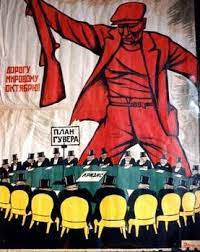](https://blogger.googleusercontent.com/img/b/R29vZ2xl/AVvXsEgUuNhYH5V2UQQrskvEbwuQc15769JTd2XWydP3gNZ9v_9Jp-
lHA7nF0f-5ueIZ1KOwBhkwtZY6cn_fr892BZq5XW0W4pwgWdTrDwWbEqI3iFb_guuhoX_7Gj7MOFJzON09wGuQc0RrU7mlkV_JfdTviNQn2lT7wbiMqee9c5_k0Wm-
XHPw-gx5-uXbYA/s252/download.jpg)

Questo nuovo ciclo della Formazione Operaia on line sarà dedicato a formare
l'avanguardia proletaria sul tema della guerra imperialista e come lottare
contro di essa.

Sul piano pratico proletari comunisti ha elaborato una mozione operaia, che
sintetizza la posizione necessaria adesso, che è stata sottoposta alla firma e
all'approvazione degli operai in alcune fabbriche e riportata in assemblee e
manifestazioni contro la guerra.

Noi consideriamo che questo oggi sia il compito principale nelle fila della
classe operaia e dei proletari in lotta, sulla cui base passare a forme più
avanzate di azione, organizzazione contro la guerra imperialista in corso, con
epicentro l'Ucraina, che può avere ulteriori sviluppi e sfociare in una terza
guerra mondiale.

Proprio per questo è fondamentale comprendere qual'è la posizione che deve
guidare l'azione della classe operaia in questa situazione.

**In questo primo ciclo useremo gli scritti di Lenin, riprenderemo passi di
essi e li commenteremo.**

Ogni proletario d'avanguardia, individualmente o collettivamente, può e deve
partecipare a questo ciclo nelle forme più impegnate possibili, con
interventi, domande, proposte di azione, perché chiaramente questa formazione
teorica è al servizio della pratica o indissolubilmente legata ad essa.

**Questa Formazione Operaia si svolgerà ogni giovedì su questo blog con
esposizioni sia orali sia scritte, così come gli interventi possono essere sia
orali che scritti.**

Source: [https://proletaricomunisti.blogspot.com/2023/02/pc-2-febbraio-riprende-la-formazione.html](https://proletaricomunisti.blogspot.com/2023/02/pc-2-febbraio-riprende-la-formazione.html)

<!--NEWS-->

# Proletari Comunisti/PCm Italy - Long Live Stalingrado! Mao on Stalingrado

Author: maoistroad

Description: pc 2 febbraio - Viva Stalingrado - il significato di Stalingrado nelle parole
di MaoTse Tung " A Stalingrado, - scriveva Mao anco...

Time: 2023-02-02T11:39:00-08:00

Images: []

<!--METADATA-->

###  [pc 2 febbraio - Viva Stalingrado - il significato di Stalingrado nelle
parole di MaoTse
Tung](https://proletaricomunisti.blogspot.com/2023/02/pc-2-febbraio-viva-
stalingrado-il.html)

  " **A Stalingrado,** \- scriveva Mao ancor prima della vittoria definitiva -
**i combattenti dell'Esercito rosso hanno compiuto un'impresa eroica, che
influirà sul destino dell'intera umanità. Essi sono i figli della Rivoluzione
d'Ottobre. La bandiera della Rivoluzione d'Ottobre è invincibile, e tutte le
forze fasciste sono condannate a perire."** (Mao, Opere scelte, vol. III,
p.109, Ed. in lingue estere di Pechino)

  

Source: [https://maoistroad.blogspot.com/2023/02/proletari-comunistipcm-italy-long-live.html](https://maoistroad.blogspot.com/2023/02/proletari-comunistipcm-italy-long-live.html)

<!--NEWS-->

# pc 2 febbraio - Profitti record per l'industria di armi Beretta...

Author: prolcompal

Time: 2023-02-02T14:05:00+01:00

Images: ['[beretta%20record.jpg](https://blogger.googleusercontent.com/img/b/R29vZ2xl/AVvXsEg0GW6NVf-rO0FXlZm7ijRII6c5eDRBqPoyI50Xc4ozxh6NDhsboddFmCa8JxzVmDCTAKYVdOTDNJrevc-4FTvFI2dfX6fd50jxjHdALUv9elhkY2-wwhenAjfzbRXKXNxesGpgx1afhV4VKAw0ld9aBADLKKkVSUlekATpIrqxdPT4MSmKSq-h3OrnTA/w565-h440/beretta%20record.jpg)']

<!--METADATA-->

Tanto per confermare chi fa profitti a palate con la guerra

In Italia, la crisi non ha toccato questo settore, come dice l'articolo del
Sole24Ore… **nonostante l 'aumento dei costi energetici** "passati da 2,8
milioni a 9,5 di cui 7,5 in elettricità" … **quanto hanno aiutato (tra i tanti
altri infiniti aiuti) i grandi padroni i bonus del governo?**

  
 **  
**

Source: [https://proletaricomunisti.blogspot.com/2023/02/pc-2-febbraio-profitti-record-per.html](https://proletaricomunisti.blogspot.com/2023/02/pc-2-febbraio-profitti-record-per.html)

<!--NEWS-->

# A CARTE SCOPERTE. LE OPERAIE ALLA BERETTA LOTTANO CONTRO LE DURE CONDIZIONI DI LAVORO E I PIANI DELL’AZIENDA CHE USANDO L’APPALTO (IMBROGLIO) CERCA DI ELIMINARLE SILENZIOSAMENTE

Author: Gorria

Description: PER RIPRENDERE LE LINEE DI LAVORAZIONE 4,5 E CONTROLLO ISOLE. PER L'UNITÀ DI
TUTTELE OPERAIE DELLA BERETTA DIVISE DAI CONTRATTI PRECARI. La ...

Time: 2023-02-02T14:24:00+01:00

Images: ['[AVvXsEgTAd1AbSXgBno-Brpu0v6XZn9-3y6CEkwi_KQwgWWgzI0Rsy9Q0RPcJoEjdV4ZVwGf_HCT3Qp27xeCg-9kWTL41abFMuLtBX53k3K0wxmaxeqhAn1ube6at5CXeij5RVQLqqxHEVRuxxsTr77s11L4bKDZ8diMlHQkrdyBjegkpToASyqJz5rw9KXlQA=w534-h401](https://blogger.googleusercontent.com/img/a/AVvXsEgTAd1AbSXgBno-Brpu0v6XZn9-3y6CEkwi_KQwgWWgzI0Rsy9Q0RPcJoEjdV4ZVwGf_HCT3Qp27xeCg-9kWTL41abFMuLtBX53k3K0wxmaxeqhAn1ube6at5CXeij5RVQLqqxHEVRuxxsTr77s11L4bKDZ8diMlHQkrdyBjegkpToASyqJz5rw9KXlQA=w534-h401)', '[AVvXsEg6yP5Ks3DTePYiJG80CibHaULhjfERNn6u8Oup9Io58OlQuByQGqLG1CHayK4DrRvXsrAkV_M6rPm3uulf9MywmXBifQwUeyUDw31mejY-kHaxI1W0B8xoHYj2uiswSkDH2gwz9QhR-kSElUlfRAVJHRb5FTFp0ybKXF36Fpg0pAL1XtIIywvzdEhNhA=w640-h552](https://blogger.googleusercontent.com/img/a/AVvXsEg6yP5Ks3DTePYiJG80CibHaULhjfERNn6u8Oup9Io58OlQuByQGqLG1CHayK4DrRvXsrAkV_M6rPm3uulf9MywmXBifQwUeyUDw31mejY-kHaxI1W0B8xoHYj2uiswSkDH2gwz9QhR-kSElUlfRAVJHRb5FTFp0ybKXF36Fpg0pAL1XtIIywvzdEhNhA=w640-h552)', '[AVvXsEjJgyC4MmHsOUub8FmXAmRuslv6ydY8sBC_C0kZrP4KRG7dnY6LfJjBae0rGe1WITGKMca829qHxNpaqVhrQ--Vt6SunH8SS9YJC2W8QEXdhjOb2w3W38MEDJP9eqSzMATiU_4wMyXpPuQNNAVuM3zH-OwuIjnXJbWAS7JtRCIPcx8lzpIDYJp0Ei6UXA=w320-h307](https://blogger.googleusercontent.com/img/a/AVvXsEjJgyC4MmHsOUub8FmXAmRuslv6ydY8sBC_C0kZrP4KRG7dnY6LfJjBae0rGe1WITGKMca829qHxNpaqVhrQ--Vt6SunH8SS9YJC2W8QEXdhjOb2w3W38MEDJP9eqSzMATiU_4wMyXpPuQNNAVuM3zH-OwuIjnXJbWAS7JtRCIPcx8lzpIDYJp0Ei6UXA=w320-h307)', '[AVvXsEgn2HOLHZ3z5WOAfqCIRWp1Cm8t9Ztm5uQNnosKc9D7O-RlZ5H9XywR6halmgbYNb4ETb_JcV-FYPt3Q4B1qOGSJ2MLpqjWviiP6RyLxUaX9QGl_1odIdpsELdmKMAilqKv5RP1Klgpgd6Bf4XHq4J_zHGOcmmO9WrYF3BF4VVE_3wI7sXSz6I11SmhhQ=w198-h400](https://blogger.googleusercontent.com/img/a/AVvXsEgn2HOLHZ3z5WOAfqCIRWp1Cm8t9Ztm5uQNnosKc9D7O-RlZ5H9XywR6halmgbYNb4ETb_JcV-FYPt3Q4B1qOGSJ2MLpqjWviiP6RyLxUaX9QGl_1odIdpsELdmKMAilqKv5RP1Klgpgd6Bf4XHq4J_zHGOcmmO9WrYF3BF4VVE_3wI7sXSz6I11SmhhQ=w198-h400)', '[AVvXsEiCNYET8wXYYH5LhVQikVjG7xy7IgTszAX9gfy6BUfsyGmciZGPZsUoDVIqsLxHf3ixcJRKwLiYrsVqOpAuQnhYLAZKBGJYOj0w0W8F-0ELmaeEJujivGiqSaKJJ_IL6hy4_wNzOmVXtxdvEHxUlcQE9J6SXytFbCw0U0GfNd8kB4wnrAdXxuoo5Tr4zg=w180-h400](https://blogger.googleusercontent.com/img/a/AVvXsEiCNYET8wXYYH5LhVQikVjG7xy7IgTszAX9gfy6BUfsyGmciZGPZsUoDVIqsLxHf3ixcJRKwLiYrsVqOpAuQnhYLAZKBGJYOj0w0W8F-0ELmaeEJujivGiqSaKJJ_IL6hy4_wNzOmVXtxdvEHxUlcQE9J6SXytFbCw0U0GfNd8kB4wnrAdXxuoo5Tr4zg=w180-h400)', '[AVvXsEgjyxtTs3BXxPzDXevg_5zuZjEHnX5LtvhhMs8iz51PrrWisMfTesyQ2fAx8nXp20xjf9BaRRrhwgYtZyJveO60rTp8XlSlH0WpXukoPtGxjS8HgaTfrQrBnxogtO74IrOiG3aTLyl3I8_LsoSzBR-5G1gaA_n6RpP9BXko5Pna7lXh2ahIHhNfru30Jw=w400-h300](https://blogger.googleusercontent.com/img/a/AVvXsEgjyxtTs3BXxPzDXevg_5zuZjEHnX5LtvhhMs8iz51PrrWisMfTesyQ2fAx8nXp20xjf9BaRRrhwgYtZyJveO60rTp8XlSlH0WpXukoPtGxjS8HgaTfrQrBnxogtO74IrOiG3aTLyl3I8_LsoSzBR-5G1gaA_n6RpP9BXko5Pna7lXh2ahIHhNfru30Jw=w400-h300)', '[AVvXsEgFK-EEbecBFyc1hQ8jRHJGIqt-YbL_GQl3HWMR9Vlwj6RRMmptbsLxETFJrL0gq051BuUeHeJYRwsPTYHNxBWwMMywLs9Q3bwiqk_PYij3bRbafMHZHXzte47v5Bns5ocFFr6fEMekpD7xVaLFHojuLkWTHnJXzIfttD5v1l0ig_Jy6QjH2sM6g45qWA=w400-h225](https://blogger.googleusercontent.com/img/a/AVvXsEgFK-EEbecBFyc1hQ8jRHJGIqt-YbL_GQl3HWMR9Vlwj6RRMmptbsLxETFJrL0gq051BuUeHeJYRwsPTYHNxBWwMMywLs9Q3bwiqk_PYij3bRbafMHZHXzte47v5Bns5ocFFr6fEMekpD7xVaLFHojuLkWTHnJXzIfttD5v1l0ig_Jy6QjH2sM6g45qWA=w400-h225)', '[AVvXsEggJ-ZPhIYbmoigBkDoQsM9VbR9obslYCcgS3ABPfZzH7t0hMcbpwl1AIPoldse2n8km9JEr3iHoT3tDirjMMbiKnpgFEAyrCQ6cUWtend7c-BsgHhhTLDBGrCeAQHNU4MIMVLlSuIgRGKSySBYgZY15jwXjSttpK6aI6JD2nCzvRGQwVY7U7eJsPv3Sg](https://blogger.googleusercontent.com/img/a/AVvXsEggJ-ZPhIYbmoigBkDoQsM9VbR9obslYCcgS3ABPfZzH7t0hMcbpwl1AIPoldse2n8km9JEr3iHoT3tDirjMMbiKnpgFEAyrCQ6cUWtend7c-BsgHhhTLDBGrCeAQHNU4MIMVLlSuIgRGKSySBYgZY15jwXjSttpK6aI6JD2nCzvRGQwVY7U7eJsPv3Sg)', '[AVvXsEiaCna2cOfjz6yyNZp5efH-NRA1-LfHDwOSGALqGh-V9Co8AIVIeVrOsCSi6mD4CoJJGRbQ5SO1qs1YV1GJIb9WYrrfpKlefp2R20W7Wz0Hwtgq1E7mQhBHcxAGyyjbwMC7o1jWHik_bsME8_ODlKKHgUgVTZ1IP7klOhWD6wHTTvkHvjsy9fEfUffuWg=w493-h640](https://blogger.googleusercontent.com/img/a/AVvXsEiaCna2cOfjz6yyNZp5efH-NRA1-LfHDwOSGALqGh-V9Co8AIVIeVrOsCSi6mD4CoJJGRbQ5SO1qs1YV1GJIb9WYrrfpKlefp2R20W7Wz0Hwtgq1E7mQhBHcxAGyyjbwMC7o1jWHik_bsME8_ODlKKHgUgVTZ1IP7klOhWD6wHTTvkHvjsy9fEfUffuWg=w493-h640)']

<!--METADATA-->

****

**[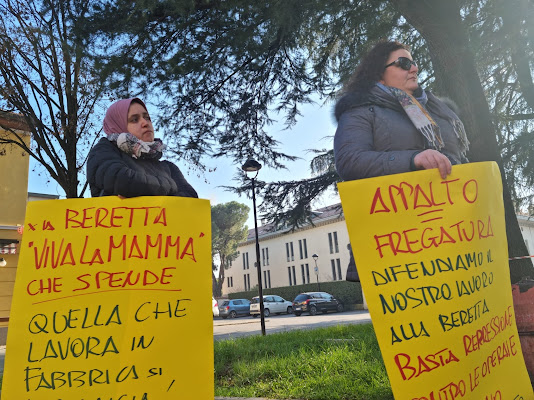](https://blogger.googleusercontent.com/img/a/AVvXsEgTAd1AbSXgBno-
Brpu0v6XZn9-3y6CEkwi_KQwgWWgzI0Rsy9Q0RPcJoEjdV4ZVwGf_HCT3Qp27xeCg-9kWTL41abFMuLtBX53k3K0wxmaxeqhAn1ube6at5CXeij5RVQLqqxHEVRuxxsTr77s11L4bKDZ8diMlHQkrdyBjegkpToASyqJz5rw9KXlQA=s640)**

**  
PER RIPRENDERE LE LINEE DI LAVORAZIONE 4,5 E CONTROLLO ISOLE. PER L'UNITÀ DI
TUTTELE OPERAIE DELLA BERETTA DIVISE DAI CONTRATTI PRECARI.**  

La lotta delle operaie in appalto alla Beretta, guarda a tutte le operaie e
alla loro condizione. Dalla difesa della salute e del posto di lavoro in
fabbrica, all'unità con le altre realtà che lottano, nella partecipazione
all'Assemblea Nazionale del 18 febbraio a Roma.

[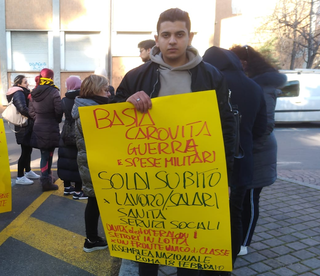](https://blogger.googleusercontent.com/img/a/AVvXsEg6yP5Ks3DTePYiJG80CibHaULhjfERNn6u8Oup9Io58OlQuByQGqLG1CHayK4DrRvXsrAkV_M6rPm3uulf9MywmXBifQwUeyUDw31mejY-
kHaxI1W0B8xoHYj2uiswSkDH2gwz9QhR-
kSElUlfRAVJHRb5FTFp0ybKXF36Fpg0pAL1XtIIywvzdEhNhA=s640)

  
A cominciare dalla difesa della salute. Le operaie in sciopero hanno
denunciato ' **ba** **sta non ce la facciamo più a correre tutto il giorno, al
freddo,  ** **cosi ci rompiamo solo la schiene** ' proprio mentre sono usciti
i nuovi dati INAIL sul forte aumento degli infortuni e delle malattie
professionali.

E contro la repressione in fabbrica, fatta di comportamenti discriminatori,
arroganti, antisindacali, come i 50 euro dati a dicembre come gratifica solo
alle operaie che non  hanno scioperato, o facendo leva sul doppio carico che
le operaie e mamme della fabbrica, hanno nell'assistenza ai figli ad es., con
una vera e propria rappresaglia fatta di  cambi di turno e di orari,
improvvisi e personalizzati, per mettere in difficoltà le lavoratrici scomode,
obbligarle a fare i salti mortali con le baby sitter. E naturalmente dei
tentativi falliti di ostacolare lo sciopero, sfociati, davanti alla fermezza
delle operaie, in un frustrato

post (cancellato all'arrivo delle risposte):' erano10 scappate di casa'. NO
non penso proprio che sono scappate di casa, hanno pieni i MARRONI di lavorare
in quelle condizioni.

  

  

Lo sciopero ha messo in mostra il nuovo appalto con Mpm del 31.5.22
(denunciato anche con un esposto) fatto in tutta fretta per l'indagine aperta
-aprile 22- dalla Guardia di Finanza 'contro l'uso illecito da parte di
Beretta delle cooperative per avere sempre a disposizione manodopera
disponibile e sottopagata, definita in modo esplicito transumanza dei
lavoratori', come operazione di facciata e commerciale; come a scaricare sulle
cooperative tutte le responsabilità; come a cancellare il fatto che, i
risultati dello sfruttamento del lavoro precario e sottopagato dell'appalto,
dello schifoso CCNL Multiservizi, aumentano il PROFITTO di BERETTA.

Con la firma della Uil il cambio appalto è stato concluso senza la trasparenza
e le garanzie rivendicate dallo Slai Cobas sc a proposito delle linee di
lavorazione effettivamente passate in gestione a Mpm.

L'appalto diventa così il cavallo di Troja per togliere una a una  le linee
alle operaie che con Slai Cobas sc stanno lottando in fabbrica o che non
riescono più a tenere i ritmi della fabbrica. Nelle ultime settimane sono
state tolte le linee 4 e 5, le isole di controllo, che devono tornare alle
operaie Mpm che sono da anni e anni in quelle postazioni. L'APPALTO USATO PER
COLPIRE 'SOTTOBANCO' LE OPERAIE.

Con lo sciopero c'è stata una partecipata e autogestita dalle operaie
conferenza stampa, significativamente davanti alla sede ATS di Trezzo, con le
giornaliste di Milano Today, del Giorno, quelli della Gazzetta della Martesana
e di Radio Popolare e alcuni indipendenti che realizzano inchieste sul mondo
del lavoro, tutti coinvolti dal protagonismo delle lavoratrici, che hanno
iniziato a più voci, a raccontarsi, per dire basta, per cambiare.

A differenza di quanto accaduto fino ad ora, con le operaie consumate sulle
linee di lavorazione della Beretta, messe fuori o che se ne sono andate in
silenzio, magari consigliate da un sindacalista ad accettare l'offerta di
conciliazione dell'azienda, come inevitabile.

La giornata del 31 gennaio, parte di una mobilitazione a 360°, come detto
nell'ultima assemblea, per usare con lo sciopero, tutti i mezzi a disposizione
delle lavoratrici.

  

[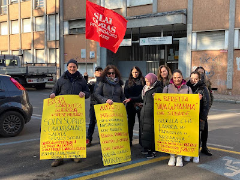](https://blogger.googleusercontent.com/img/a/AVvXsEgjyxtTs3BXxPzDXevg_5zuZjEHnX5LtvhhMs8iz51PrrWisMfTesyQ2fAx8nXp20xjf9BaRRrhwgYtZyJveO60rTp8XlSlH0WpXukoPtGxjS8HgaTfrQrBnxogtO74IrOiG3aTLyl3I8_LsoSzBR-5G1gaA_n6RpP9BXko5Pna7lXh2ahIHhNfru30Jw)

[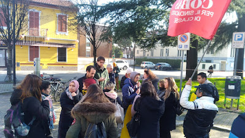](https://blogger.googleusercontent.com/img/a/AVvXsEgFK-
EEbecBFyc1hQ8jRHJGIqt-
YbL_GQl3HWMR9Vlwj6RRMmptbsLxETFJrL0gq051BuUeHeJYRwsPTYHNxBWwMMywLs9Q3bwiqk_PYij3bRbafMHZHXzte47v5Bns5ocFFr6fEMekpD7xVaLFHojuLkWTHnJXzIfttD5v1l0ig_Jy6QjH2sM6g45qWA)  
---  
 **    CONFERENZA STAMPA E RASSEGNA STAMPA SULLO SCIOPERO   **  
  
  
[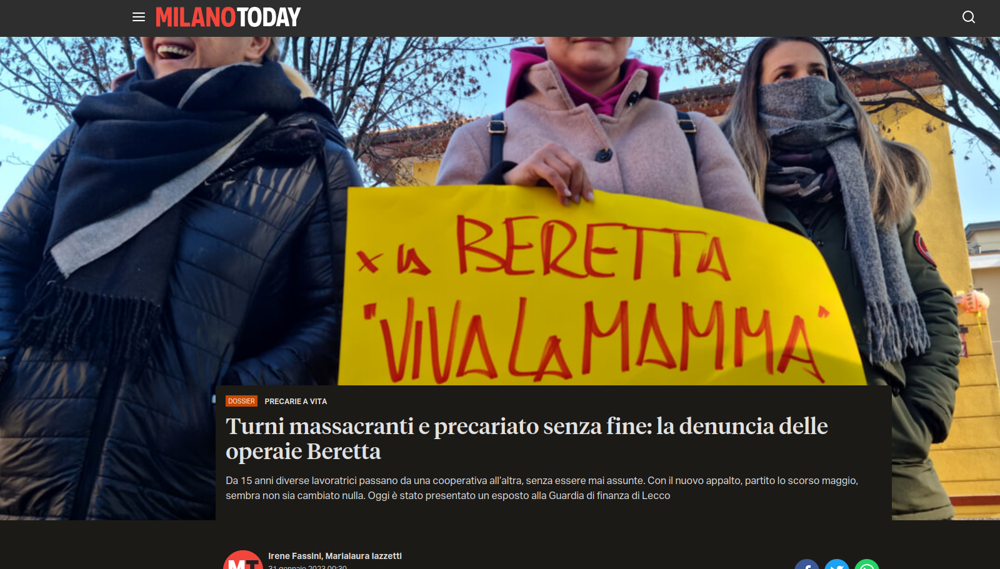](https://blogger.googleusercontent.com/img/a/AVvXsEggJ-
ZPhIYbmoigBkDoQsM9VbR9obslYCcgS3ABPfZzH7t0hMcbpwl1AIPoldse2n8km9JEr3iHoT3tDirjMMbiKnpgFEAyrCQ6cUWtend7c-BsgHhhTLDBGrCeAQHNU4MIMVLlSuIgRGKSySBYgZY15jwXjSttpK6aI6JD2nCzvRGQwVY7U7eJsPv3Sg)

<https://www.milanotoday.it/dossier/economia/precariato-operaie-beretta-
sindacati.html?referrer=premium-checkout>

 <https://primalamartesana.it/attualita/lavoratrici-della-salumi-beretta-di-
trezzo-sulladda-in-sciopero-il-picchetto-davanti-allats/>

 <https://radioattiva.noblogs.org/files/2023/02/intervista-operaie-
beretta.mp3>

[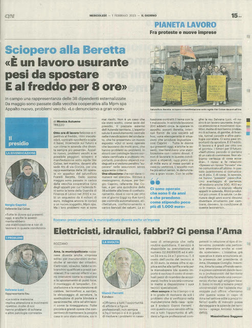](https://blogger.googleusercontent.com/img/a/AVvXsEiaCna2cOfjz6yyNZp5efH-
NRA1-LfHDwOSGALqGh-V9Co8AIVIeVrOsCSi6mD4CoJJGRbQ5SO1qs1YV1GJIb9WYrrfpKlefp2R20W7Wz0Hwtgq1E7mQhBHcxAGyyjbwMC7o1jWHik_bsME8_ODlKKHgUgVTZ1IP7klOhWD6wHTTvkHvjsy9fEfUffuWg)

Source: [https://femminismorivoluzionario.blogspot.com/2023/02/a-carte-scoperte-le-operaie-alla.html](https://femminismorivoluzionario.blogspot.com/2023/02/a-carte-scoperte-le-operaie-alla.html)

<!--NEWS-->

# BANDERA ROJA: PCP BASE LIMA: DESENMASCARAR EL PLAN IMPERIALISTA YANQUI CONTRA EL PERÚ Y OTROS PAÍSES DE AMÉRICA LATINA

Author: Verein der Neuen Demokratie

Description: ¡Proletarios de todos los países, uníos! DESENMASCARAR EL PLAN IMPERIALISTA
YANQUI CONTRA EL PERÚ Y OTROS PAÍSES DE AMÉRICA LATINA En un c...

Time: 2023-02-02T15:46:00+01:00

Images: []

<!--METADATA-->

 ¡Proletarios de todos los países, uníos!

  
 **DESENMASCARAR EL PLAN IMPERIALISTA YANQUI CONTRA EL PERÚ Y OTROS PAÍSES DE
AMÉRICA LATINA**

  
En un contexto de crisis general del imperialismo, principalmente por una
aguda y profunda crisis económica. Esta crisis atiza una vez más las
contradicciones fundamentales y la principal (imperialismo-naciones oprimidas)

  
Inmejorable, condiciones objetivas para potenciar los movimientos de
liberación nacional y el desarrollo de la nueva gran ola comandada por el
maoísmo y guerras populares ha dado como grandioso y estratégico triunfo la
conformación y próxima reunificación de la Liga Comunista Internacional paso
decisivo y transcendental en la futura internacional comunista comandada por
el maoísmo.

  
Expresamos nuestro fervoroso saludo comunista al proletariado internacional, a
los partidos comunistas, movimientos y organizaciones que la conforman y nos
reafirmamos en nuestra todopoderosa ideología científica y universal el
marxismo-leninismo-maoísmo principalmente maoísmo, y el aporte decisivo y
universal del presidente Gonzalo nuestra jefatura por haberla definido como
tercera, nueva y superior etapa del marxismo y aplicándolo magistralmente a la
revolución peruana contribuyendo decisivamente al nuevo desarrollo del
marxismo.

  
A nivel internacional se agudizan las contradicciones inter imperialistas por
un lado el imperialismo yanqui como superpotencia hegemónica única, en
declinación, su oligarquía financiera comandada por la burguesía compradora su
llamada "globalización neoliberal" está en profunda crisis y creciente
inflación con una perspectiva negra con tremenda recesión, aplican cada vez
más proteccionismo lo que agudiza sus pugnas, recurren al fascismo, riesgo de
"guerra civil" y "separatismo" o "autonomía de estados", sus planes
estratégicos para mantener su condición hegemonista único van de tumbo en
tumbo, de crisis en crisis y cada vez se sustentan en el chantaje bélico y
atómico para amedrentar o generar temor en las naciones oprimidas; guerras de
agresión y rapiña (OTAN en medio oriente y ahora en Europa del Este) auspician
y promueven el "terrorismo" en función de sus intereses.

  
Por otro lado, la superpotencia atómica ruso viene recuperando posiciones y
coligado con el social imperialismo chino vienen desenvolviendo planes
estratégicos para socavar, impedir y contraponer los planes hegemónicos yanqui
consolidándose en sus áreas de dominio y ampliando sus áreas de influencia
caso Asia, África, y América Latina (considerar que Rusia y China mantienen
influencia y se coluden en regímenes comandados por la burguesía burocrática
pero pugnan para abarcar con mayor amplitud en base a sus propios intereses).

  
En América latina, base del imperialismo yanqui, sus planes hegemónicos en la
región están siendo socavados, la penetración de la superpotencia rusa
influenciando y apoyando política y militarmente a regímenes donde la facción
burocrática comanda los Estados terratenientes burocráticos casos; Cuba,
Venezuela, Nicaragua, Bolivia, etc. Simultáneamente el socialimperialismo
chino (quien sueña ser superpotencia mundial en el presente siglo) y sus
planes hegemónicos globales viene ejecutando una serie de planes y proyectos
en ese sentido, por ejemplo "la llamada nueva ruta de la seda" y de allí la
voracidad con que se lanza sobre los recursos energéticos en la región
(hidrocarburos, minería, litio, gran pesca, reservas de agua, etc) bajo el
manto de relaciones económicas y comerciales. Veamos el caso de nuestro país:
El 64% de las exportaciones peruanas devienen de la minería aportando el 10%
del PBI, Perú es el segundo productor mundial en cobre y zinc y el tercer
productor de plata y estaño en América Latina, además, somos el primer
productor de zinc, estaño, plomo y selenio a pesar que solo el 1.07% del
territorio peruano está en condición de explotación minera y el 0.28% está en
exploración, es decir más del 98% esta considerara como zona virgen en
explotación, agregamos a esto que la producción de cobre y plata que tiene el
país son necesarias para el proceso de transición energética (la sociedad
nacional de minería, petróleo y energía asume que el 16% de la inversión
privada está en la minería). ¡Qué tal torta que los yanquis y sus aliados
quieren para ellos solos, pero allí le pisan los talones la superpotencia rusa
y el socialimperialismo chino! Somos parte del botín y no podemos consentirlo
¡Defendamos la patria con Guerra Popular!

  
Agudas e intensas contradicciones interimperialistas en la región repercute en
el seno de las clases explotadoras principalmente de la gran burguesía entre
sus dos facciones (burguesía compradora y burguesía burocrática) vemos también
los casos de Argentina, Bolivia, Chile, Brasil, etc) lo que lejos de
amenguarse vienen acrecentándose y seguirá agudizándose.

  
 **EL CAMINO DEMOCRÁTICO SE DESARROLLA COMO UN CAMINO POPULAR DE LIBERACIÓN**

  
El presidente Gonzalo en su magistral y victorioso discurso del 24 de
septiembre 1992 nos estableció el periodo político al cual ingreso la
revolución democrática, ante el creciente y una mayor intervención del
imperialismo principalmente yanqui con el objetivo de concretar sus
antihistoricas tres tareas contrarrevolucionarias: Reimpulsar el capitalismo
burocrático, reestructurar el viejo Estado peruano pero principalmente su
sueño de Aniquilar la Guerra Popular.

  
El presidente Gonzalo con gran visión política, clara visión maoísta que
limpia telarañas nos demandó a pensar con mucho sentido histórico viendo la
historia del Perú, veamos los tres siglos últimos y nos establece una clara
definición. Siglo XVIII: Dominio de España, nos condujo a profunda crisis,
consecuencia el Perú fue dividido.

  
Siglo XIX: Dominio de Inglaterra ¿en su contienda con Francia? Guerra con
chile. Nos llevó a una crisis profundísima. Perdimos territorio y nuestra
patria sufre un cisma.

  
Siglo XX: Tenemos un dominador el imperialismo yanqui principalmente ¿a dónde
nos ha traído? A la peor crisis de toda la historia del pueblo peruano.

  
Desde 1980 con el inicio y desarrollo de la Guerra Popular la sociedad peruana
contemporánea ha ingresado a su tercer momento de crisis general y
principalmente ha ingresado a su destrucción y barrimiento de las tres grandes
montañas que explotan y oprimen al pueblo; el imperialismo, el capitalismo
burocrático y la semifeudalidad.

  
Ante el desarrollo de la guerra popular y haber alcanzado el equilibrio
estratégico como segunda etapa político y militar de la guerra popular, en
1991 el imperialismo principalmente yanqui y la reacción "para mantener su
sistema y recuperar posiciones" en defensa y salvaguarda del estado
terrateniente burocrático dieron el autogolpe del 5 de abril de 1992
(desarrollo de la estrategia contrasubversiva yanqui: desarrollo de la guerra
de baja intensidad) para imponer un régimen fascista , genocida y vendepatria
proyanqui por décadas por delante con planes a largo plazo.

  
En 1993 como parte de su cuarta reestructuración elaboraron (en medio de
genocidio) y aprobaron una constitución política hecha a su medida y en
función de los intereses del imperialismo principalmente yanqui.

  
Siendo esta constitución proyanqui y columna vertebral de este régimen
fascista, genocida y vendepatria levantaron esta traposa y sangrienta
constitución de rapiña para estructurar el reimpulso del capitalismo
burocrático a pesar que literalmente se declaraba como una "economía social de
mercado" cuando en el fondo aplicaron una economía de "libre mercado"
barriendo la producción nacional y otorgando en bandeja el ingreso de la
industria imperialista, este llamado "neoliberalismo" a favor de una mayor
penetración y dominio imperialista principalmente (art 62 o contratos ley como
ejemplo), este reimpulso no venía solo estuvo junto a reestructurar su aparato
estatal caracterizándose por el absolutismo presidencialista (camarilla
fascista) digitado por la embajada yanqui. Reimpulsar y reestructura no era
posible sino ingresaban a aniquilar la guerra popular por lo que esta
constitución del 93 promovió y legalizo la mayor entrega y mayor poder con
facultades a las FF.AA y PNP fascistas y genocidas aplicar la estrategia
contrasubversiva de guerra de baja intensidad.

  
El presidente Gonzalo en el documento "comentarios acerca del golpe de Estado"
nos enseñó a diferenciar lo que es un sistema de Estado y nos dijo con
claridad que esta es una dictadura de clase de grandes burgueses y
terratenientes al servicio del imperialismo principalmente yanqui y como
sistema de gobierno (bajo su forma de democracia representativa) estas se
diferenciaban en dictaduras abiertas y encubiertas.

  
A la caída de la camarilla fascista y genocida de Fujimori y Montesinos en el
año 2000 el imperialismo principalmente yanqui monto su gobierno de transición
(Paniagua) bajo el auspicio de la CIA - OEA, y a pesar que se planteaba
formalmente cambiar su traposa constitución y que sectores de la gran
burguesía y el oportunismo aplaudían a rabiar, el capítulo económico nunca la
colocaron en cuestión.

  
El régimen fascista, genocida y vendepatria bajo la hegemonía y dirección de
la burguesía compradora en estas décadas del presente siglo XXI profundizo y
acentuó el carácter semifeudal (megalatinfundios a costa del despojo de la
tierra del campesinado principalmente pobre y semicolonial )(mayor injerencia,
intervención y dominio imperialista principalmente yanqui) donde se desarrolla
un putrefacto capitalismo burocrático como lo fue con la firma del TLC con
EEUU por Toledo y su implementación a sangre y fuego con más de 120 decretos
legislativos con el genocida de Alan García y luego del capitán Carlos o
Ollanta Humala.

  
Este dominio imperialista yanqui sobre el viejo y caduco Estado peruano está
siendo socavado por la creciente penetración del imperialismo ruso y
particularmente por el socialimperialismo chino, lo que repercute fuertemente
en el seno de la gran burguesía (facciones compradora y burocrática; grupos y
tendencias demoliberal y fascista) pero principalmente repercute y obliga a
forjar con guerra popular el único camino que tiene el pueblo, el camino
democrático del pueblo como camino popular de liberación, esa es la
circunstancia que estamos atravesando hoy y esta nítido que la vanguardia
organizada del proletariado , nuestro partido comunista del Perú dirige y
dirigirá hasta alcanzar la conquista del poder para el proletariado y el
pueblo peruano, acaso hay otro camino? Por eso decimos ¡Guerra Popular hasta
el comunismo!.

  
Desde el 2016 la pugna en el seno de la facción compradora entre la tendencia
fascista (keiko Fujimori) y la tendencia demoliberal (PPK) por el control del
ejecutivo del régimen fascista, genocida y vendepatria proyanqui se agudizo,
el fujimorismo con el control del parlamento burgués fue socavando al
ejecutivo, cuestionando la esencia en la conducción del régimen: el
absolutismo presidencialista, simultáneamente iba copando los otros poderes e
instituciones del viejo Estado tal y como se ha demostrado ante el control que
tienen con el: poder judicial, ministerio público, tribunal constitucional,
etc. Siguiendo claro esta su camino reaccionario porque ese es el verdadero
camino reaccionario y contrarrevolucionario que les corresponde seguir,
¿tienen otro camino? Pues no la tienen, es su única salida, continuar con un
régimen fascista, genocida y vendepatria proyanqui y lo estamos viendo en este
presente siglo claro y nítido confirmando una vez más lo que nos señaló el
presidente Gonzalo.

  
En la actualidad conducen el régimen fascista, genocida y vendepatria a una
crisis política permanente (05 presidente en 05 años) atizada por la crisis
económica y financiera internacional (2018 y 2019) y por la profunda crisis
del capitalismo burocrático que no da para más y que han tratado de encubrir y
posponer a través de sus "estados de emergencia y militarización sanitaria"
dizque para combatir la pandemia (Covid - 19) y en medio de una insultante
desvergonzada corrupción de grandes negociados a costa de la muerte y vida del
pueblo. El ejecutivo junto a las camarillas de las FF.AA y policíales
genocidas, las farmacéuticas en monopolio y las clínicas privadas amasaron
grandes fortunas demostrando que el sistema de salud publico colapsado no
servía a la población, un abandono de siglos en desmedro de la salud y la
vida, hambre, miseria y desnutrición entre otros, causaron la muerte de más de
200 mil personas. El índice más alto en el mundo. Destrucción de las fuerzas
productivas (eliminar el excedente poblacional) plan genocida y siniestro de
este régimen fascista y de los planes hegemónicos del imperialismo
principalmente yanqui.

  
Es en este contexto de crisis y decadencia del régimen fascista, genocida y
vendepatria (dentro del tercer momento de crisis general y destrucción de la
sociedad peruana contemporánea) que se convocan a las elecciones generales del
año 2021, elecciones cruciales para el imperialismo y la reacción en función
de continuar el cumplimiento de sus tres tareas contrarrevolucionarias pero y
muy particularmente para la tendencia fascista (fujimorismo) de la facción
compradora que a toda costa necesitaba el control total del Estado
principalmente del ejecutivo.

  
El 2021 es elegido el rondero y anticomunista de Pedro Castillo, un
oportunista de cabo a rabo y fiel representante y defensor de los intereses de
la burguesía burocrática (Perú libre procastrista, feudillo de la familia
cerrón) con el apoyo de una recua de revisionistas y oportunistas
particularmente del movadef y los del Vraem, esa línea oportunista de
izquierda de reniego y alstamiento, a quienes sus desvergonzados sueños de
amnistía, capitulación y alistamiento no les han impedido a salir en defensa
de quienes por mandato del imperialismo yanqui se convirtieron en los verdugos
ejecutores (Castillo Terrones - Anibal Torres y otros con la venia de la CIA)
del vesánico y alevoso plan de asesinar al presidente Gonzalo ¡Honor y Gloria
al presidente Gonzalo el más grande marxista-leninista-maoista que ha dado la
tierra!.

  
Desde que asumió la presidencia el rondero oportunista de castillo, se abrió
un periodo de intensa pugna entre ambas facciones; el imperialismo
principalmente yanqui le dio su aval formal a este rondero de Castillo
mientras tramaba su derrocamiento por acción de la burguesía compradora
(tendencia fascista representado por el fujimorismo) bajo el control de la
cloaca llamado parlamento y con la venia de las FFAA y PNP fascistas,
genocidas y más vendepatrias proyanqui y bendecidos por la iglesia sedienta de
sangre.

  
La tendencia de cuestionar el absolutismo presidencialista a favor de un
absolutismo parlamentario se agravo a finales del 2022. La reestructuración
del viejo Estado peruano esta sobre el tapete nuevamente y la burguesía
burocrática es quien promueve las ilusiones constitucionales de una asamblea
constituyente para una nueva constitución, incluso hay quienes agregan "para
el pueblo" esta propuesta de la facción burocrática y sus compinches sirve
principalmente para recuperar posiciones y pasar a comandar la dirección del
viejo y podrido Estado peruano, venderse al mejor postor y cambiar de amo
(promueven siniestras posiciones imperialistas o "plurinacional" "multiétnico"
"etnicidad" "etnocacerismo", "nacionalismo" etc).

  
Por otro lado, la burguesía compradora ha pasado a ejecutar una defensa
cerrada ( a sangre y fuego) de la constitución proyanqui del 93, formalmente
la podrían cambiar pero en la esencia no, los reajustes que vienen ejecutando
en esta cloaca de parlamento burgués apunta a tener mayor poder y control:
bicameralidad, reelección de congresistas y todo tipo de dificultades en
desmedro del ejecutivo agudizando así su contradicción y pugnas.

  
Pueblo peruano, Intensa pugna de estos burgueses y reaccionarios pro
imperialistas que se enmarca dentro de una creciente ola de protesta a nivel
nacional principalmente del campesinado pobre. ¡Viva las luchas del heroico
pueblo peruano!

  
Siendo necesidad del imperialismo yanqui y de la reacción, la defensa y
continuidad de su régimen el 07 de diciembre del 2022 propiciaron y ejecutaron
el golpe de Estado en favor de una mayor intervención del imperialismo yanqui,
la CIA y el desarrollo de su guerra de baja intensidad y que vienen ejecutando
las fuerza armadas y policiales fascistas, genocidas y vendepatrias como
camarilla y agentes proyanquis: Dina Boluarte, Otarola, Williams Zapata, Gómez
de la Torre entre otros responsables quienes aplican el plan fascista y
genocida yanqui contra el Perú y el pueblo peruano, sueñan con desmembrar,
partir el Perú y a contener y desviar el ascenso revolucionario del
campesinado principalmente pobre, el proletariado y las masas, sueñan con
aplastar al proletariado y a su vanguardia, el PCP y sueñan que la complicidad
del revisionismo de todo tipo y los oportunistas de siempre les salvara su
caduco sistema de hambre y miseria. Decimos; sigan soñando.

  
Dictadura abierta: un régimen fascista, genocida y vendepatria proyanqui que
en su afán de mantenerse, perpetuarse y cumplir a pie juntillas los mandatos
de su amo yanqui vienen potenciando la línea política genocida del Estado
peruano en contra del justo y creciente movimiento popular, vienen
desarrollando su estrategia antisubversiva yanqui de guerra de baja
intensidad: militarización del país a través de los estados de emergencia,
toque de queda, criminalizar las luchas y demandas populares, operativos
masivos de movilización de sus fuerzas, ingreso violento a las universidades,
infiltración a diestra y siniestra en las organizaciones sociales y populares,
en sus marchas para identificar y detener a sus dirigentes o representantes,
acciones psicológicas contra el pueblo a través de los grandes medios
reaccionarios y monopolizadas de propaganda y de comunicación masiva. Las FFAA
y FFPP que trataron de legitimarse ante la opinión publica mostrándose como
"respetuosos de los DDHH" y quienes con la complicidad de esa "comisión de la
verdad y reconciliación" dijeron hasta la saciedad "el principal violador de
los DDHH fue sendero" etc. Hoy se evidencia a todas luces que la esencia de
las fuerza armadas y policiales es columna vertebral y defensor del viejo y
caduco Estado peruano terrateniente burocrático que se cae en pedazos;
fascistas, genocidas, vendepatrias proyanqui que más temprano que tarde
recibirán la justa sanción del partido y de pueblo y hoy igual que ayer
recrudece las detenciones arbitrarias, ilegales, torturas, desaprisiones,
asesinatos en las comisarías en los cuarteles, los sabotajes a instituciones
estatales y privados realizados por ellos mismos a través de sus agentes y
lumpenes contratados como cabezas negras y fuerzas de choque y las falsas
banderas y pintas en paredes y hasta asesinatos de su propio personal (caso
del policía quemado en su patrullero en puno) para imputarlos a la población,
estas FFAA y policiales, valientes para matar pero cobardes para morir,
ejecutan asesinatos de niños y madres por sus francotiradores con el total
aval y complicidad de esa casta de caudillos jerárquicos de la iglesia como la
de puno, inclusive la muerte de varios recién nacidos ante la metralla
inmisericorde de estos genocidas contra una población civil desarmada, no
contentos con eso viene realizando apagones en pueblos y ciudades para que, en
el amparo de la oscuridad rompan puertas y secuestren a dirigentes populares y
sociales como el caso de Ayacucho, continúan con disparos a mansalva y desde
los helicópteros artillados y siguen utilizando su vieja táctica de enfrentar
masas contra masas y utilizan a lumpenes como cebos para atraer luchadores o
identificar a dirigentes para luego asesinarlos o detenerlos (lumpenes
venezolanos que muy pronto saldrán huyendo del pais); sus "marchas por la paz"
de policías, militares y agentes de inteligencia (sumados a grupos fascistas,
la resistencia y otros) la promueven con descaro la propia policía
representado por el genocida ex director PNP de Dircote especialista en
torturas y violaciones mientras que con la otra mano allanan y siembra de
pruebas contra locales como la confederación campesina del Perú o de nuevo
Perú (téngase en cuenta que cuando salió la denuncia de los leeks se supo del
reglaje y seguimiento militar y policial a toda oposición al régimen fascista
y a su constitución proyanqui del 93 imputándoseles de "terrorista"). No hay
un solo lugar del país donde no muestren su esencia de represión y genocidio,
lo que iniciaron en el sur del país hoy recorre el territorio nacional ¡La
sangre derramada jamás será olvidada! ¡A más sangre más represión, más
genocidio más revolución!! ¡Solo el pueblo juzga y sanciona a los genocidas!
¡Contra la represión y el genocidio, por los derechos del pueblo y la guerra
popular!

  
Apuntan a destruir toda oposición de las organizaciones sociales, populares,
sindicales y partidarias, etc pero principalmente sueñan impedir el avance del
partido, que hoy avanza (en sentar sólidas bases) en su reorganización general
y el reordenamiento de su ejército hoy popular de liberación.

  
Su campaña contrarrevolucionaria de imputar al pueblo de "terroristas" se le
está cayendo estrepitosamente, busca con un vano intento de separar guerrilla
de las masas, sueña que el pueblo no tenga una dirección proletaria justa y
correcta, promueve a revisionistas y oportunistas de todo pelaje a montarse en
esta justas luchas del heroico pueblo para luego "negociar" en "mesas de
diálogo" y vender la sangre derramada por dadivas o puestos en este caduco
sistema, están apuntando a detener, secuestrar, asesinar y desaparecer a los
verdaderos dirigentes del pueblo que en los hechos asumen esa digna
responsabilidad política y social.

  
Sépase que el pueblo peruano tiene una riquísima experiencia en nuevo poder y
guerra popular porque es guerra popular guiado por el marxismo-leninismo-
maoismo pensamiento Gonzalo y está enraizada en la clase, en el pueblo y eso
apanica, atemoriza a la reacción y al revisionismo.

  
Lo establecido por el presidente Gonzalo es perentorio: "la clase, el pueblo,
las masas demandan exigen, necesitan, claman desarrollar la guerra popular" y
los comunistas y revolucionarios tenemos una gran responsabilidad de
cumplirla.

  
 **¡ Vivimos momentos históricos cada uno debe estar claros que es así,
nuestra patria la han convertido en parte del botín imperialista hundiendo al
pueblo peruano en la peor crisis de toda su historia!! ¡y, eso no lo
permitiremos!!**

  
 **El Presidente Gonzalo nos advirtió: " otra vez la nación está en riesgo,
otra vez la república está en riesgo, otra vez el territorio está en riesgo
puede ser perdido fácilmente y por intereses. Esa es la situación a la que nos
han traído (…)**

  
 **Pensemos en el peligro: de que la nación, el país, puede estar dividido,
que la nación esté en riesgo quieren despedazarla, quieren dividirlo ¿quién
quiere hacer eso? Los imperialistas, los que explotan, los que mandan"**

  
 **LA GUERRA POPULAR HA DEMOSTRADO QUE EL ESTADO PERUANO ES UN TIGRE DE PAPEL
QUE ESTA PODRIDO HASTA EL TUETANO.**

  
La guerra popular prolongada que dirige el partido desde 1980 ha mostrado y
demostrado palmariamente ante los ojos del mundo y principalmente ante el
pueblo peruano que el viejo Estado peruano es un tigre de papel que está
podrido hasta el tuétano y solo cabe su demolición total, cabal y completa y
no quede piedra sobre piedra.

  
Vivimos una situación revolucionaria en desarrollo creciente. Lenin definió
como situación revolucionaria (condiciones objetivas de la revolución) y las
sintetizo en dos: 1) que los de abajo no quieren seguir viviendo como antes 2)
los de arriba no pueden seguir administrando y gobernando como hasta entonces:
estas dos condiciones son las que generan movilizaciones de las masas.

  
Y, el presidente Mao Tse Tung nos enseña que la situación revolucionaria
afecta las bases mismas los cimientos del viejo y caduco Estado y por lo tanto
no es factible "una salida reformista de la situación" solo cabe una salida
revolucionaria.

  
El presidente Gonzalo claramente nos enseña que el viejo Estado peruano tiene
: "… una amplia base fallida, una fractura de los cimientos del Estado sobre
el cual ejercen su dictadura conjunta los grandes burgueses y los
terratenientes feudales pero sobre esa frágil estructura opera el imperialismo
con sus pugnas y contradicciones especialmente del imperialismo yanqui que nos
domina" fuertes pugnas con el imperialismo ruso y el socialimperialismo chino
que le socavan este dominio yanqui, asimismo el presidente Gonzalo agrega:"
pugnas interimperialistas que agravan la fragilidad del sistema de Estado en
general y especialmente la del propio sistema de gobierno (régimen fascista,
genocida, vendepatria proyanqui y mayor crisis de su llamada "democracia
representativa") esta fragilidad del viejo Estado y al desarrollarse estas
contradicciones entre las clases que ejercen dictadura y entre sus diversas
facciones a través de las cuales pretenden, los imperialistas, mantener su
hegemonía imperialista o socavarse entre si "

  
La fragilidad del Estado peruano en cuanto a su sistema estatal y sistema de
gobierno es esencial e insuperable para este viejo Estado por sus condiciones
de país semifeudal y semicolonial donde evoluciona un caduco y podrido
capitalismo burocrático, a esa fragilidad se le agrava el cumplimiento de las
tres tareas contrarrevolucionarias particularmente su reestructuración
(reforma o nueva constitución), su reimpulso que le signfican agravar las
condiciones de vida de las masas y lo principal, enfrentarse a un movimiento
popular en desarrollo y en creciente protesta que viene generando en esta
quinquenio un mayor desborde social que busca satisfacer sus más elementales
derechos y reivindicaciones en función de la lucha por la toma del poder.

  
El viejo Estado peruano se hunde y se hundirá en la represión y el genocidio,
en su violencia reaccionaria para mantener su caduco sistema y preservar los
intereses de los explotadores y del imperialismo pero en contraparte esta la
violencia revolucionaria que como parte de la historia plasmara muy pronto el
anhelo del pueblo peruano de una nueva república popular del Perú.

  
Para el proletariado y el pueblo peruano el problema será barrer esta o
cualquier "nueva constitución" de los explotadores u otra como expresión del
viejo orden imperante, porque ninguna de estas representa los intereses más
supremos de la clase y el pueblo, será por acción de la guerra popular
prolongada que dirige el partido comunista del Perú bajo el marxismo-
leninismo-maoísmo, pensamiento Gonzalo la que otorgara una verdadera
constitución y podrá ser alcanzado en un Estado de nueva democracia, en guerra
popular y bajo la dirección omnímoda del Partido comunista del Perú.

  
Finalmente, el 24 de setiembre de 1992, el presidente Gonzalo estableció cual
eran las tareas urgentes que el partido debiera de cumplir:  **" corresponde
que potenciemos el movimiento popular de liberación y eso lo desarrollaremos
manejado en guerra popular porque el pueblo, siempre el pueblo ha sido quien
ha defendido la patria, quien ha defendido la nación en desarrollo.
Corresponde formar frente popular de liberación, corresponde formar y
desarrollar a partir del ejército guerrillero popular un ejército popular de
liberación; ¡eso es lo que corresponde! ¡Y eso hacemos nosotros! ¡y eso lo
estamos haciendo y eso lo vamos a hacer! Uds serán testigos señores"**

  
Decimos al proletariado y pueblo peruano:

  
 **¡ Gloria eterna al presidente Gonzalo jefe del partido y de la
revolución!**

  
 **¡ Enarbolar, defender y aplicar el marxismo-leninismo-maoísmo pensamiento
Gonzalo principalmente el pensamiento Gonzalo**

 **  
¡ Viva el Partido Comunista del Perú!**

  
 **¡ La Guerra Popular vencerá inevitablemente!**

  
 **¡ Unir al pueblo contra la dictadura fascista genocida y vendepatria
proyanqui!**

  
 **¡ Contra la represión y el genocidio! ¡por los derechos del pueblo y la
Guerra Popular!**

  
 **¡ Abajo el plan imperialista yanqui, fascista y genocida de destruir el
Perú!**

  
 **¡ Defender la patria con Guerra Popular!**

  
 **¡ Desarrollar el camino popular de liberación con Guerra Popular ¡**

  
 **¡ Saludamos la primera conferencia internacional maoísta y la fundación de
la Liga Comunista Internacional paso decisivo en la conformación de la futura
internacional comunista guiada por el maoísmo!**

  
 **¡ Viva el maoísmo abajo el revisionismo!**

  
 **¡ Viva el heroico pueblo peruano!**

  
 **Enero 2023  
**

 **PARTIDO COMUNISTA DEL PERU COMITÉ BASE LIMA**

Source: [http://vnd-peru.blogspot.com/2023/02/bandera-roja-pcp-base-lima.html](http://vnd-peru.blogspot.com/2023/02/bandera-roja-pcp-base-lima.html)

<!--NEWS-->

# Nuevo canto de amor a Stalingrado

Author: Revolución Cultural

Time: 2023-02-02T16:45:40-05:00

Images: ['[Stalingrado-2-940x517.png](http://www.revolucionobrera.com/wp-content/uploads/2023/02/Stalingrado-2-940x517.png)', '[pablo-neruda-art.jpeg](http://www.revolucionobrera.com/wp-content/uploads/2023/02/pablo-neruda-art.jpeg)']

Tags: ['batalla', 'II Guerra Mundial', 'Stalingrado']

Categories: ['Revolución Cultural', 'Blogs']

<!--METADATA-->

[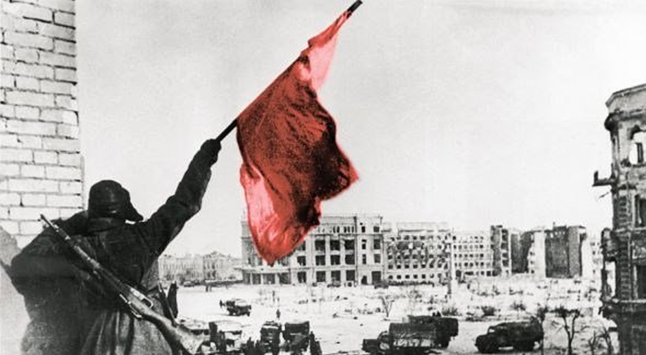](http://www.revolucionobrera.com/wp-
content/uploads/2023/02/Stalingrado-2.png)

**Pablo Neruda**

Yo escribí sobre el tiempo y sobre el agua,  
describí el luto y su metal morado,  
yo escribí sobre el cielo y la manzana,  
ahora escribo sobre Stalingrado.

Ya la novia guardó con su pañuelo  
el rayo de mi amor enamorado,  
ahora mi corazón está en el suelo,  
en el humo y la luz de Stalingrado.

Yo toqué con mis manos la camisa  
del crepúsculo azul y derrotado:  
ahora toco el alba de la vida  
naciendo con el sol de Stalingrado.

Yo sé que el viejo joven transitorio  
de pluma, como un cisne encuadernado,  
desencuaderna su dolor notorio  
por mi grito de amor a Stalingrado.

Yo pongo el alma mía donde quiero.  
Y no me nutro de papel cansado,  
adobado de tinta y de tintero.  
Nací para cantar a Stalingrado.

Mi voz estuvo con tus grandes muertos  
contra tus propios muros machacados,  
mí voz sonó como campana y viento  
mirándote morir, Stalingrado.

Ahora americanos combatientes  
blancos y oscuros como los granados,  
matan en el desierto a la serpiente.  
Ya no estás sola, Stalingrado.

Francia vuelve a las viejas barricadas  
con pabellón de furia enarbolado  
sobre las lágrimas recién secadas.  
Ya no estás sola, Stalingrado.

Y los grandes leones de Inglaterra  
volando sobre el mar huracanado  
clavan las garras en la parda tierra.  
Ya no estás sola, Stalingrado.

Hoy bajo tus montañas de escarmiento  
no sólo están los tuyos enterrados:  
temblando está la carne de los muertos  
que tocaron tu frente, Stalingrado.

Deshechas van las invasoras manos,  
triturados los ojos del soldado,  
están llenos de sangre los zapatos  
que pisaron tu puerta, Stalingrado.

Tu acero azul de orgullo construido,  
tu pelo de planetas coronados,  
tu baluarte de panes divididos,  
tu frontera sombría, Stalingrado.

Tu Patria de martillos y laureles,  
la sangre sobre tu esplendor nevado,  
la mirada de Stalin a la nieve  
tejida con tu sangre, Stalingrado.

Las condecoraciones que tus muertos  
han puesto sobre el pecho traspasado  
de la tierra, y el estremecimiento  
de la muerte y la vida, Stalingrado.

La sal profunda que de nuevo traes  
al corazón del hombre acongojado  
con la rama de rojos capitanes  
salidos de tu sangre, Stalingrado.

La esperanza que rompe en los jardines  
como la flor del árbol esperado,  
la página grabada de fusiles,  
las letras de la luz, Stalingrado.

La torre que concibes en la altura,  
los altares de piedra ensangrentados,  
los defensores de tu edad madura,  
los hijos de tu piel, Stalingrado.

Las águilas ardientes de tus piedras,  
los metales por tu alma amamantados,  
los adioses de lágrimas inmensas  
y las olas de amor, Stalingrado.

Los huesos de asesinos malheridos,  
los invasores párpados cerrados,  
y los conquistadores fugitivos  
detrás de tu centella, Stalingrado.

Los que humillaron la curva del Arco  
y las aguas del Sena han taladrado  
con el consentimiento del esclavo,  
se detuvieron en Stalingrado.

Los que Praga la Bella sobre lágrimas,  
sobre lo enmudecido y traicionado,  
pasaron pisoteando sus heridas,  
murieron en Stalingrado.

Los que en la gruta griega han escupido,  
la estalactita de cristal truncado  
y su clásico azul enrarecido,  
ahora dónde están, Stalingrado?

Los que España quemaron y rompieron  
dejando el corazón encadenado  
de esa madre de encinos y guerreros,  
se pudren a tus pies, Stalingrado.

Los que en Holanda, tulipanes y agua  
salpicaron de lodo ensangrentado  
y esparcieron el látigo y la espada,  
ahora duermen en Stalingrado.

Los que en la noche blanca de Noruega  
con un aullido de chacal soltado  
quemaron esa helada primavera,  
enmudecieron en Stalingrado.

Honor a ti por lo que el aire trae,  
lo que se ha de cantar y lo cantado,  
honor para tus madres y tus hijos  
y tus nietos, Stalingrado.

Honor al combatiente de la bruma,  
honor al comisario y al soldado,  
honor al cielo detrás de tu luna,  
honor al sol de Stalingrado.

Guárdame un trozo de violenta espuma,  
guárdame un rifle, guárdame un arado,  
y que lo pongan en mi sepultura  
con una espiga roja de tu estado,  
para que sepan, si hay alguna duda,  
que he muerto amándote y que me has amado,  
y si no he combatido en tu cintura  
dejo en tu honor esta granada oscura,  
este canto de amor a Stalingrado.

Source: [https://www.revolucionobrera.com/blogs/cultural/canto-stalingrado/](https://www.revolucionobrera.com/blogs/cultural/canto-stalingrado/)

<!--NEWS-->

# A Working Class Response to Fascism - Anti Imperialist Action Ireland

Author: isrmedia

Publish Time: 2023-02-02T17:08:06+00:00

Description: ‘Some questions that should be posed to the fascists attempting to take advantage of concerns in working class communities.’ What solutions have you ever offered the working class in relation to the artificially created housing crisis, soaring energy prices, the capitalist rise in cost of living, the lack of jobs, training and education opportunities, the [&hellip;]

Images: ['[3D57DFAC-DD0E-4A49-9BEC-E1777B400ACE-1200x524.jpeg](https://anti-imperialist-action-ireland.com/wp-content/uploads/2023/02/3D57DFAC-DD0E-4A49-9BEC-E1777B400ACE-1200x524.jpeg)']

Categories: ['AIA']

Type: article

<!--METADATA-->

‘ _Some questions that should be posed to the fascists attempting to take
advantage of concerns in working class communities_.’

What solutions have you ever offered the working class in relation to the
artificially created housing crisis, soaring energy prices, the capitalist
rise in cost of living, the lack of jobs, training and education
opportunities, the deliberate destruction of our health and public services,
the decades of deliberate neglect and marginalisation by the state, the
partition and occupation of our country by foreign imperialist powers (the
real foreign threat), the changing of the balance of power from the golden
circle to the people?

You call yourselves patriots. What role have you played in the ongoing
struggle for National Liberation in our country? You know, the one where real
patriots have sacrificed their lives and their liberty for the freedom of
Ireland and the working class?

We know what your leaders have done. Justin Barrett and James Reynolds were in
Fine Gael, the Blueshirts, the anti-Republican party that has been in the
pocket of British Imperialism since 1922. Some patriots. And Hermann Kelly was
being educated in a university well known for links with MI5, before becoming
the lap-dog of Nigel Farage and the most aggressive form of British
imperialism and chauvinism. Maybe we misunderstood. When you call yourselves
‘patriots’ is it British patriots you mean? Again, no friends of the working
class.

As British patriots, is that why Free State fascist organisations are
consistently developing closer and closer links with loyalist death squads and
the British far right? The same death squads that kill innocent Irish citizens
on behalf of British imperialism and the same British far-right that ran
campaigns of hate against Irish immigrants under the banner ‘No blacks, no
dogs, no Irish!’ Are you being directed by MI5 to develop these links and act
in alliance against Irish National Liberation? Justin and Hermann certainly
have form.

Understanding that Irish people, due to 850 years of ongoing oppression, have
a long history of emigration, where our people have suffered racism, violence
and exploitation; Why protest against centres housing vulnerable asylum
seekers fleeing war-torn and destitute countries, seeking international
protection, instead of against those who are really creating the problems,
namely the Free State administration, British, European and US Imperialism,
NATO, the capitalist class and in particular landlords? Is it because you are
in fact in alliance with these same powers and view yourselves very much as
part of their club?

No answers? We thought so.

Fascists have nothing to offer the working class. They are pro-establishment,
pro-imperialist, pro-landlord and have no base in our communities. We won’t
let them get one now.

The Irish people have always been proudly anti-imperialist and anti-fascist.
Let us be proud of that tradition and not allow our fighting spirit to be
hijacked by far-right lies online or the fascist boot boys serving the agenda
of those in power.

Full consultation with the community when asylum seekers and refugees are to
be housed in an area is a must! No more lies. Information takes away fear and
consultation, information and communication will lead to genuine integration.
Resourcing is needed in all communities where asylum seekers and refugees are
to be housed. Housing for all, training and education opportunities, funding
for schools, sports clubs, healthcare and other community services are a must
and are a legitimate set of demands from working class communities.

Working class communities have genuine concerns. Anger at the cost of living,
the housing crisis, the collapse of our healthcare system and being ignored by
those in power for generations have led to anger coming to boiling point. But
that anger must be channeled in the right way. Our communities won’t be fixed
by targeting vulnerable asylum seekers, refugees or migrants and that only
serves the agenda of those in power as a distraction from the real issues.

The working class need a united front to fight against our exploitation by
those in power. The anger and protests need to be directed at those in
Leinster House, and Stormont, against the multinationals and international
imperialism. Against the landlords, the energy companies, the fascists and the
far right agitators. Building such a movement is the task for all of us who
believe in an Ireland owned and controlled by the people, in the Republic
proclaimed in 1916.

And remember, if anyone is calling for protests against asylum seekers or
scapegoating refugees or migrants, they are serving the interests of those in
power and should be isolated and unwelcome in our communities. Let’s focus on
our real enemies and not allow ourselves to be divided and conquered by those
in power!

For a United Working Class - Ireland for the People - All of the People!

Source: [https://anti-imperialist-action-ireland.com/blog/2023/02/02/a-working-class-response-to-fascism/](https://anti-imperialist-action-ireland.com/blog/2023/02/02/a-working-class-response-to-fascism/)

<!--NEWS-->

# pc 2 febbraio - il governo reprime la campagna democratica e solidale per Alfredo Cospito

Author: maoist

Time: 2023-02-02T18:26:00+01:00

Images: ['[romacr.jpg](https://soccorsorossoproletario.noblogs.org/files/2023/02/romacr.jpg)']

<!--METADATA-->

# [Ancora intimidazioni agli attivisti solidali con Alfredo Cospito. Tentativo
di irruzione nella sede di Usb a Roma per identificare gli studenti
ospitati](https://soccorsorossoproletario.noblogs.org/post/2023/02/02/ancora-
intimidazioni-agli-attivisti-solidali-con-alfredo-cospito-tentativo-di-
irruzione-nella-sede-di-usb-a-roma-per-identificare-gli-studenti-ospitati/)

Posted on
[02/02/2023](https://soccorsorossoproletario.noblogs.org/post/2023/02/02/ancora-
intimidazioni-agli-attivisti-solidali-con-alfredo-cospito-tentativo-di-
irruzione-nella-sede-di-usb-a-roma-per-identificare-gli-studenti-ospitati/
"15:21")

_[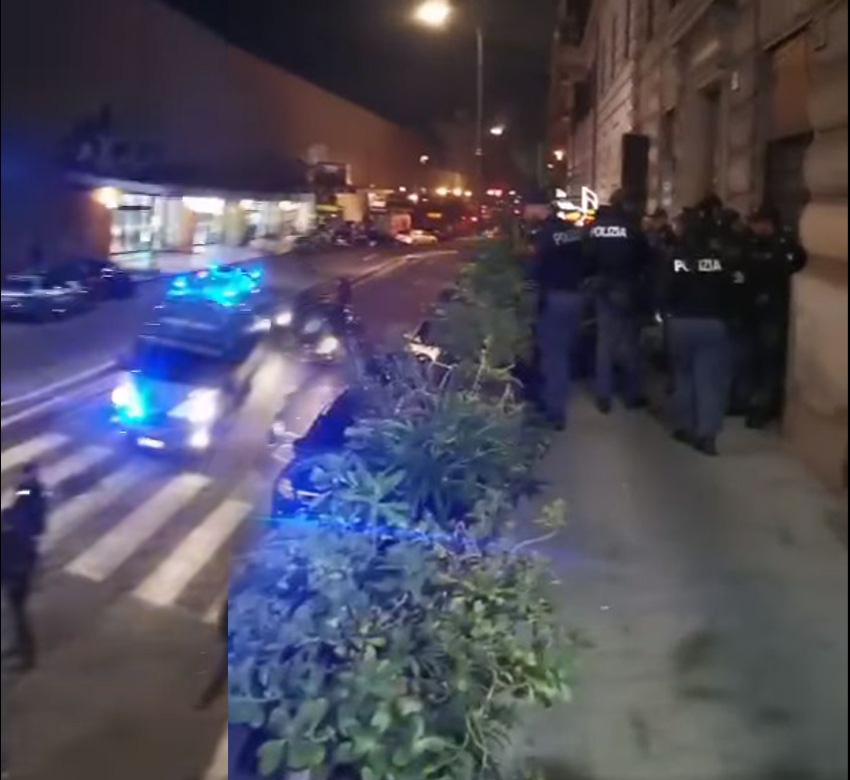](https://soccorsorossoproletario.noblogs.org/post/2023/02/02/ancora-
intimidazioni-agli-attivisti-solidali-con-alfredo-cospito-tentativo-di-
irruzione-nella-sede-di-usb-a-roma-per-identificare-gli-studenti-
ospitati/romacr/)Il comunicato di ieri di OSA e Cambiare Rotta:_

**Basta caccia alle streghe.**

È grave l'episodio che oggi ha colpito gli studenti medi e universitari di OSA
e Cambiare Rotta: mentre costruivamo materiale divulgativo in solidarietà ad
Alfredo Cospito, contro la tortura del 41bis, un esagerato - e al limite del
ridicolo - dispiegamento di polizia e carabinieri ha provato a entrare nella
sede del sindacato di Usb che ci ospitava, senza mandato, con la pretesa di
identificare gli studenti (per lo più minorenni) presenti.

La solidarietà umana e politica ad Alfredo Cospito è più che legittima e non
si deve reprimere, così come la lotta contro il 41bis, strumento di tortura e,
troppo spesso, vendetta contro chi lotta contro sistema.

Il Governo non solo sta lasciando morire Alfredo ma sta anche innalzando un
pericoloso clima da "caccia alle streghe" contro chiunque osi dissentire con
le ingiustizie della nostra società. Una caccia alle streghe contro le idee e
che andrà a colpire tutte le lotte conflittuali e democratiche nel nostro
paese.

È una facile via di fuga, per un governo che ha difficoltà a mantenere le sue
promesse elettorali e con una grave situazione sociale nel paese, creare un
nemico interno, il "pericolo anarchico" che ciclicamente torna nella storia
del nostro paese.

Andrà mantenuta alta la vigilanza democratica per evitare un ulteriore
scivolamento verso uno stato di Polizia, la lotta continua.

OSA ROMA

Source: [https://proletaricomunisti.blogspot.com/2023/02/pc-2-febbraio-il-governo-reprime-la.html](https://proletaricomunisti.blogspot.com/2023/02/pc-2-febbraio-il-governo-reprime-la.html)

<!--NEWS-->

# Kundgebung in Hamburg: Stoppt den Terror gegen das mexikanische Volk!  Stoppt die Megaprojekte der Enteignung und des Todes!

Author: DEM VOLKE DIENEN

Time: 2023-02-02T18:45:37+00:00

Images: []

Tags: ['Mexiko', 'Sol Rojo']

Category: None

<!--METADATA-->

_Wir ver offentlichen einen Aufruf zu einer Kundgebung in Hamburg, der uns
zugeschickt wurde. _

Im Bundesstaat Oaxaca im Suden Mexikos wehren sich die armen Bauern seit
Jahren gegen Megaprojekte, die der alte Staat in Kooperation mit den
Imperialisten errichtet. Den Bauern wird ihr Land geraubt, damit am Isthmus
von Tehuantepec riesige Windparks hochgezogen werden konnen. So werden die
Bauern enteignet, die Natur wird zerstort und die Bevolkerung vertrieben.

Der Widerstand, den die Bauern seit Jahren dagegen leisten, wird vom alten
mexikanischen Staat und seinen Handlangern mit Repression und Terror
beantwortet. Um den Kampf der Bauern und der unterschiedlichen Volksbewegungen
zu brechen, die sich der Aufgabe angenommen haben, den Widerstand gegen die
imperialistischen Megaprojekte zu entwickeln, hetzt der Staat paramilitarische
Morderbanden auf die Bevolkerung. Diese Situation hat sich in den letzten
Wochen drastisch verscharft. Mehrere Kampfer des Volkes wurden festgenommen
oder verschwanden spurlos. Am 29. Januar 2023 besetzten bewaffnete
Paramilitars in Auftrag des Großgrundbesitzes die Gemeinde Rincon Tagolaba
bedrohten die Bewohner, zerstorten Anbauflachen und Trinkwasserschlauche und
gaben Schusse zur Einschuchterung ab. Die nationale Polizei ruckte zwar an,
unternahm aber nichts gegen die schwerbewaffneten Paramilitars.

Der mexikanische Staat setzt mithilfe der Morderbanden, die fur ihn arbeiten
die Interessen der Imperialisten auf Kosten des Volkes am Isthmus von
Tehuantepec durch und dafur ist ihnen jedes Mittel recht. Unsere Solidaritat
gilt den kampfenden armen Bauern und den Volksbewegungen, wie der
Volksstromung Rote Sonne (Corriente del Pueblo Sol Rojo), die unermudlich und
opferbereit fur die Bedurfnisse und Interessen des Volkes kampft. Wir fordern
die Freilassung aller inhaftierten Kampfer des Volkes. Wir fordern die
sofortige lebendige Prasentation der Verschwundenen. Wir fordern ein Ende der
Repression und des Terrors des alten mexikanischen Staates und seiner
Handlanger.

**Kundgebung: Mittwoch, 08. Februar 2023 | 18Uhr | S-Bahnhof Sternschanze**

_B undnis gegen imperialistische Aggression_

_Februar 2023_

Source: [https://www.demvolkedienen.org/index.php/de/t-international/7453-kundgebung-in-hamburg-stoppt-den-terror-gegen-das-mexikanische-volk-stoppt-die-megaprojekte-der-enteignung-und-des-todes](https://www.demvolkedienen.org/index.php/de/t-international/7453-kundgebung-in-hamburg-stoppt-den-terror-gegen-das-mexikanische-volk-stoppt-die-megaprojekte-der-enteignung-und-des-todes)

<!--NEWS-->

# pc 2 febbraio - Viva Stalingrado - un po' di storia

Author: maoist

Time: 2023-02-02T20:08:00+01:00

Images: ['[zresistenze150.jpg](https://www.resistenze.org/sito/zresistenze150.jpg)']

<!--METADATA-->

**da**  

Accademia delle Scienze dell'URSS | Storia universale vol. X, pagg. 205-219,
Teti Editore, Milano, 1975  
Trascrizione per [Resistenze.org](http://www.resistenze.org) a cura del Centro
di Cultura e Documentazione Popolare  
  
  
  
_In occasione dell'80 ° anniversario della vittoria dell'Unione Sovietica a
Stalingrado sugli invasori nazifascisti_  
  
All'inizio dell'inverno 1942-1943 si apriva sulle rive del Volga e del Don una
nuova tappa della lotta mortale contro il nazifascismo, entrata nella storia
come il periodo della svolta radi­cale nel corso di tutta la seconda guerra
mondiale. Il merito principale della realizzazione di questa svolta a favore
della coalizione antifascista appartiene all'Unione Sovietica.  
Nelle acca­nite battaglie del 1942-1943 sul fronte sovietico-tedesco si
decisero i destini storici non solo del popolo sovietico, ma dell'intera
umanità.  
  
**1\. La disfatta delle truppe fasciste sul Volga. L'inizio della svolta
radicale nella guerra**  
  
LA SITUAZIONE ALL'INIZIO DELLA CONTROFFENSIVA DELLE TRUPPE SOVIETICHE SUL
FRONTE MERIDIONALE  
  
Nell'autunno 1942 il fronte sovietico-tedesco, a eccezione di alcuni settori,
si stabilizzò su tutta la linea dal mare di Barents alle pendici del Caucaso.
Tuttavia la situazione continuò a essere estremamente grave per l'Unione
Sovietica. Leningrado era assediata, grandi for­ze nemiche continuavano a
operare sulle lon­tane vie di accesso a Mosca, gli incessanti aspri
combattimenti a Stalingrado assorbivano sempre nuove forze, le vie principali
di co­municazione con il Caucaso erano interrotte.  
  
Sfavorevole per le forze armate sovietiche era anche la situazione sui mari.
La flotta del Bal­tico era bloccata nella parte orientale del gol­fo di
Finlandia. La flotta del mar Nero, dopo la perdita della penisola di Crimea e
di Novorossijsk, era costretta a far capo a porti inadeguati come quelli di
Poti, Gelendžik e Tuapse, e ciò ostacolava le sue azioni. In condizioni più
favorevoli si trovava la flotta del nord. Rinforzata con navi fatte giungere
dall'oceano Pacifico, essa difendeva le comunicazioni set­tentrionali e
prestava un valido aiuto alle trup­pe terrestri nella difesa del litorale.  
  
Nell'au­tunno 1942 divenne chiaro che i piani della campagna estiva-autunnale
del comando nazi­sta erano falliti. Benché le truppe tedesche e dei loro
alleati fossero giunte sul Volga e si trovassero sulle pendici del Caucaso,
esse non avevano raggiunto il loro obiettivo principale. L'avanzata
dell'estate era costata alla Germa­nia nazista circa un milione di uomini tra
uc­cisi, feriti e prigionieri nonché la perdita di u­na enorme quantità di
mezzi e armamenti.  
  
Il gruppo di armate tedesche "A", avendo in­contrato una accanita resistenza
da parte delle truppe sovietiche sulle pendici del Cau­caso, venne impegnato
in lunghi e logoranti combattimenti. Il gruppo di armate "B" do­vette disporsi
su un fronte ad arco della lun­ghezza di 1.300 km. Al centro dell'arco, di
fronte a Stalingrado, si trovavano la VI ar­mata di von Paulus e la IV armata
corazzata di Hoth, che combattevano per la conqui­sta della città. Alle loro
ali erano schierate la III e la IV armate romene e la VIII ar­mata italiana,
passate alla difensiva. Le trup­pe satelliti erano più deboli dal punto di
vi­sta militare e morale di quelle tedesche.  
  
La situazione delle truppe degli aggressori fasci­sti che si trovavano sotto
Stalingrado e nel Caucaso del nord era aggravata dal fatto che le loro riserve
strategiche erano quasi completamente esaurite. Sullo sconfinato fronte
orientale, che si estendeva per oltre 6.000 km, vi erano nella riserva del
comando centrale delle truppe terrestri tedesche solo tre divi­sioni
corazzate, una divisione di scorta e due brigate di fanteria; nella riserva
dei gruppi di armate vi erano otto divisioni e una brigata.  
  
Nell'ottobre 1942 il comando tedesco, con­siderando compromessa la situazione,
prese la decisione di passare alla difensiva. Nell'ordi­ne n. 1 del 14 ottobre
1942 si disponeva: "Dobbiamo affrontare la campagna invernale. Compito del
fronte orientale - oltre alle ope­razioni offensive in corso oppure progettate
- è di mantenere a ogni costo le posizioni rag­giunte, respingere ogni
tentativo del nemico di sfondarle e creare in tal modo i presuppo­sti per
continuare la nostra offensiva nel 1943 allo scopo di sconfiggere
definitivamente il no­stro più pericoloso nemico".  
  
Sulla base di queste disposizioni le forze armate tedesche iniziarono i
preparativi per l'inverno. Su tut­ta la lunghezza del fronte vennero costruite
o rafforzate le fortificazioni.  
Una particolare at­tenzione venne rivolta al settore centrale del fronte, dove
il comando della Wehrmacht si attendeva azioni offensive dell'armata rossa.
Qui vennero concentrati i rinforzi principali a detrimento dei raggruppamenti
delle altre zone. All'inizio della campagna invernale, nel gruppo di armate
centrale era concentrata circa la metà delle unità corazzate e motoriz­zate di
cui i tedeschi disponevano sul fronte orientale. Lo stato maggiore di Hitler
ritene­va che l'offensiva dell'armata rossa contro il gruppo di armate
centrale sarebbe stata lan­ciata agli inizi di novembre.  
  
Dal canto suo il comando supremo sovietico, nel perfezionare i piani
dell'offensiva invernale, aveva deciso di sferrare il colpo principale nel
settore me­ridionale con le forze del fronte sud-ovest (comandate dal tenente-
generale Vatutin), del fronte del Don (comandate dal tenente-genera­le
Rokossovski) e del fronte di Stalingrado (comandate dal colonnello-generale
Eremenko) partendo dalla zona di Stalingrado con unica direzione verso il
bacino del Don. Per prepa­rare la controffensiva e coordinare le azioni dei
fronti vennero inviati nella zona di Stalingra­do il generale d'armata Zukov e
il colonnello­generale Vassilevski.  
  
L'opportunità di iniziare l'attacco proprio in questo settore era dettata da
un insieme di fat­tori politici, economici e militari. La disfatta decisiva
del nemico nel sud doveva portare al crollo definitivo dei suoi piani che
puntavano sull'arrivo delle truppe tedesche nel Caucaso e sull'entrata della
Turchia nella guerra contro l'Unione Sovietica. Ottenendo deci­sivi risultati
militari nel sud, si sarebbero li­berate le ricchissime zone cerealicole del
Don e del Kuban, sarebbero stati creati i presup­posti per la liberazione del
bacino del Don, e sarebbe stata eliminata la minaccia nemica alle fonti di
petrolio del Caucaso e alle vie di comunicazione con gli alleati che
attraver­so l'Iran giungevano al golfo Persico. Il settore del bacino del Don
appariva il punto più vulnerabile nella difesa strategica tedesca.  
  
Con l'arrivo delle truppe sovietiche a Rostov vennero create le condizioni per
la sconfitta del gruppo di armate tedesche "A", che ope­rava nel Caucaso
settentrionale. La sconfitta del nemico nel territorio tra il Volga e il Don
doveva essere solo la prima tappa della campagna invernale. Dopo il suc­cesso
di questa operazione il comando supre­mo sovietico calcolava di compiere una
serie di operazioni offensive sugli altri fronti. Una particolare importanza
veniva data all'elimina­zione dell'assedio di Leningrado e alla sconfitta dei
raggruppamenti del nemico nelle zo­ne di Demjansk, Ržev-Vjazma, nel corso
supe­riore del Don e nel Caucaso settentrionale.  
  
La prima fase della campagna invernale ven­ne progettata nel modo più completo
e accu­rato. Con gli sforzi congiunti dello stato mag­giore del comando
supremo, dello stato mag­giore generale e del comando dei fronti di
Sta­lingrado, del Don e sud-ovest, venne elaborato un piano che ricevette il
nome di "Uranus". Questo piano era fondato su una idea molto ardita: con le
forze dei tre fronti circondare e distruggere il grande raggruppamento di
truppe fasciste nel territorio tra il Volga e il Don e creare le condizioni
per il passaggio delle forze armate sovietiche alla offensiva strategica
generale sull'ala meridionale e su­gli altri settori del fronte sovietico-
tedesco. I raggruppamenti d'assalto del fronte sud­-ovest e del fronte di
Stalingrado dovevano attaccare convergendo su Kalač e Sovjetskij e serrare poi
in questa zona l'anello della sacca in cui dovevano restare le truppe degli
aggressori.  
La difesa del nemico doveva essere spezzata nei settori più vulnerabili, che
erano tenuti dalle truppe romene.  
  
L'inizio dell'offensiva era fissato per i fronti sud-ovest del Don al 19
novembre, per il fronte di Stalingrado al giorno successivo. Per attuare l'
"operazione Uranus" occorreva un'enorme attività organizzativa per mettere le
truppe in piena efficienza in vista dei com­battimenti. Era necessario
rafforzare prima di tutto i fronti con uomini, armi, mezzi militari e
vettovagliamenti; creare le riserve operative e strategiche; perfezionare la
preparazione politico-militare delle truppe; dislocare in segre­to i
raggruppamenti d'assalto nelle zone di par­tenza dell'operazione; organizzare
il loro coor­dina­mento e la loro direzione. I preparativi erano complicati
dal fatto che il trasporto de­gli uomini e dei mezzi avveniva sotto il
continuo bombardamento dall'aria su tre ferrovie a binario unico, fatto che
limitava la velo­cità di afflusso. Una particolare difficoltà nel garantire la
se­gretezza del concentramento delle forze era rappresentata dal carattere
prevalentemente stepposo delle zone dove si sarebbe lanciata la prossima
offensiva.  
  
Il successo delle operazioni dipendeva in pri­mo luogo dalle azioni delle
unità corazzate e meccanizzate. Perciò, alla vigilia dell'offensi­va i fronti
vennero rafforzati con unità e re­parti di carri armati. Complessivamente nei
tre fronti erano allineati circa 900 carri ar­mati. Oltre 13.500 cannoni e
mortai vennero messi a disposizione dell'arti­glie­ria, il doppio di quanti ne
erano stati impiegati nella con­troffensiva di Mosca. L'aviazione contava più
di 1.000 aeroplani.  
  
Alla vigilia dell'offensiva le truppe sovietiche schierate sui tre fronti non
potevano contare su una sostanziale superiorità rispetto al nemico. Ma con
l'abile dislocazione delle for­ze e dei mezzi nelle direttrici degli attacchi
principali, il comando sovietico riuscì a crea­re potenti blocchi di truppe.
Tutte queste forze e mezzi furono preventivamente schiera­ti sulle posizioni
di attacco grazie al lavoro organizzato nelle retrovie.  
  
Sul Volga, da Sara­tov ad Astrachan, funzionavano ininterrotta­mente 50
traghetti a vapore. Furono costruiti numerosi ponti di barche. Il
concentramento delle forze passò inosservato al nemico: le di­visioni in
marcia mantenevano il più assolu­to silenzio radiofonico, tutti gli ordini
veniva­no dati a voce. Vennero impiegate largamente anche misure per
disorientare il nemico. Un grande aiuto offrirono ai comandi milita­ri la
popolazione e le organizzazioni del par­tito comunista della regione di
Stalingrado. I lavoratori della regione contribuirono al rifor­nimento delle
truppe con viveri e munizioni. Decine di migliaia di cittadini lavorarono alla
costruzione di aeroporti, ponti sui fiumi e strade, aiutarono a trasportare le
munizioni e a riparare i mezzi militari. Verso la metà di novembre i
preparativi per l' "operazione Uranus" erano stati completa­ti. L'armata rossa
era pronta a infliggere il colpo decisivo al nemico.  
  
L'ACCERCHIAMENTO E LA DISFATTA DELLE FORZE TEDESCHE A STALINGRADO  
  
Il 19 novembre, alle 8,50 del mattino, dopo un massiccio bombardamento delle
artiglierie, le truppe dei fronti sud-ovest e del Don scat­tarono
all'offensiva.  
  
Una intensa nevicata e la nebbia mattutina impedirono l'intervento
dell'aviazione. Dopo avere infranto la resistenza delle truppe romene della
III armata, il raggruppamento d'assalto del fronte sud-ovest riuscì ad
avanzare alla fine del primo giorno di combattimenti di 30-35 km.
Contemporaneamente penetra­rono profondamente nel dispositivo difensivo nemico
anche le truppe del fronte del Don. Dal mattino del 20 novembre, in condizioni
meteorologiche sfavorevoli, passò all'attacco il fronte di Stalingrado. Dopo
aver rotto la difesa della IV armata romena a sud della città, le truppe
sovietiche si spinsero verso nord-ovest e verso sud-ovest.  
  
Il comando tedesco compì sforzi disperati per arrestare l'offensiva delle
truppe sovietiche, ma tutti i tentativi di bloccarla o anche solo di
rallentarla fallirono completamente. Le unità mobili dei fronti sud-ovest e di
Stalingrado avanzando rapidamente raggiunsero le ali della VI armata tedesca,
facendo pesare sul rag­gruppamento nemico la minaccia dell'accer­chiamento.  
  
Il 23 novembre, il 4° corpo corazzato sovie­tico del fronte sud-ovest al
comando del mag­giore-generale A. Kravčenko si congiunse come previsto nella
zona del villaggio di Sovjetskij con il 4° corpo meccanizzato del fronte di
Stalingrado comandato dal maggiore-generale V.T. Volski, realizzando così
l'accer­chia­mento di un grande raggruppamento nemico forte di ben 22
divisioni. Di rincalzo alle unità mobili avanzò la fanteria dei due fronti.  
  
Per non con­sentire la rottura dell'anello da parte del rag­gruppamento
circondato o il suo sblocco dall'esterno, le truppe sovietiche continuarono
l'avanzata per allargare il corridoio stabilito tra le truppe tedesche nella
prima fase dell'ope­ra­zione. Respingendo con successo i con­trattacchi del
nemico, esse giunsero la sera del 30 novembre sulla linea dei fiumi Čir e Don.
Nel frattempo vennero condotte attive azioni anche sul fronte interno
dell'accerchiamento. La sera del 30 novembre la superficie occu­pata dal
raggruppamento circondato si era già ridotta di oltre la metà e non superava
ormai i 1.500 kmq. Questo settore venne martellato in modo massiccio dal fuoco
dell'artiglie­ria so­vietica.  
  
Il 22 novembre, ancor prima che l'accerchia­mento fosse completato, il
comandante della VI armata tedesca generale von Paulus convo­cò a Gumrak la
riunione dei comandanti dei corpi, i quali giunsero all'unanimità alla
conclusione che una lunga lotta difensiva all'in­terno della gigantesca sacca
avrebbe portato alla catastrofe e che per evitarla bisognava spingersi
immediatamente con il grosso delle forze verso sud-ovest. Il generale von
Paulus chiese a Hitler l'autorizzazione a rompere l'ac­cerchiamento verso sud-
ovest, ma ottenne un inflessibile rifiuto accompagnato dalla pro­messa che
sarebbero state prese tutte le mi­sure per garantire il normale rifornimento
dell'armata e contemporaneamente liberarla dall'accerchiamento.  
  
Alla fine di novembre e nei primi giorni di dicembre i tedeschi fecero un
primo tentativo di liberate le divisioni circondate, lanciando un contrattacco
nella zona del fronte sud­ovest. Ma l'avanzata dei carri tedeschi fu bloccata
e respinta.  
  
Nel tentativo di ristabilire la situazione nel sud, il comando tedesco decise
di creare in tutta fretta un nuovo gruppo di armate "Don", nel quale furono
comprese le truppe che ope­ravano nella grande ansa del Don, insieme al gruppo
di armate circondato nella zona di Stalingrado.  
  
A questo gruppo di armate, co­mandato dal maresciallo von Manstein, venne
assegnato il compito di arrestare l'offensiva delle truppe sovietiche e,
attaccando dalle zo­ne di Kotelnikovo e Tormosin verso Stalin­grado, di
raggiungere le truppe circondate, unirsi a esse e ristabilire il precedente
fronte di difesa. Il rifornimento del raggruppamento accerchiato sarebbe stato
assicurato per via aerea.  
  
Il comando sovietico intuì tempestiva­mente i piani del nemico e si preparò
effica­cemente a respingerne i contrattacchi: raffor­zò i propri
raggruppamenti che operavano sul fronte esterno del "corridoio", organizzò la
caccia contro l'avia­zione da trasporto nemica. In dicembre vennero distrutti
in aria o negli aeroporti oltre 750 aerei da trasporto tede­schi.
L'annientamento dell'armata di von Pau­lus fu affidata al fronte del Don,
comandato dal tenente-generale Rokossovski. Lo stato maggiore del comando
supremo era rappresen­tato dal colonnello-generale Voronov. Tutta­via la
realizzazione di questo obiettivo dovet­te essere provvisoriamente rinviato.  
  
Il 12 dicembre dal distretto di Kotelnikovo, lungo la ferrovia Tichoreck-
Stalingrado, co­minciò ad avanzare il 57° corpo corazzato del gruppo di armate
Hoth. Sotto la forte pressione delle preponderanti forze nemiche la LI armata
del fronte di Stalingrado, che ope­rava su questa linea, fu costretta a
ritirarsi verso nord-est. Tuttavia il 15 dicembre essa riuscì ad arrestare
l'avanzata tedesca e nei giorni successivi resistette eroicamente alla
pressione del nemico. Il 19 dicembre il grup­po di armate Hoth riprese
l'offensiva e il 23 dicembre raggiunse il flume Myškova, a una distanza di
circa 40 km dalle truppe della VI armata circondate.  
  
Per respingere l'offensiva nemica venne inviata nella zona di Kotelni­kovo la
II armata della guardia comandata dal tenente-generale Rodion Malinovski,
desti­nata in precedenza alla liquidazione del rag­gruppamento nemico
circondato. Nelle dure condizioni dell'inverno russo le truppe di Ma­linovski
si spinsero con una marcia forzata di 40-50 km al giorno verso il fiume
Myškova, dove il nemico tentava di ampliare la pro­pria testa di ponte. Appena
giunta a contatto col nemico la II armata sovietica lo attaccò di slancio
senza arrestarsi.  
  
Il 24 dicembre l'ar­mata Malinovski passò all'offensiva con una azione
coordinata con una parte delle forze della V armata d'assalto e della LI
armata.  
Dopo avere infranto la resistenza tedesca, le truppe sovietiche occuparono il
29 dicembre Kotelnikovo. Venne cosi realizzato l'obiettivo di impedire il
nuovo tentativo del nemico di sbloccare l'armata di von Paulus, chiusa
irri­mediabilmente nella sacca di Stalingrado, che ora appariva condannata
senza scampo alla totale distruzione.  
  
Al successo dell'azione contribuirono le truppe dei fronti di Voronež e di
sud-ovest. Il mat­tino del 16 dicembre, dopo un ora e mezza di fuoco di
artiglieria, le truppe dei fronti di Voronež e di sud-ovest sfondarono la
dife­sa del nemico in alcuni punti e la sera del 24 dicembre avevano
realizzato un'avanzata di 100-200 chilometri. In otto giorni di duri
combattimenti esse inflissero una severa scon­fitta all'VIII armata italiana e
all'ala sinistra del gruppo di armate "Don", creando così una minaccia di
profondo accerchiamento dal nord del grosso delle sue forze.  
  
Il 30 dicembre le truppe sovietiche avanza­rono profondamente nelle retrovie
del nemi­co sulla linea Nikolskaja-Ilinka. Nel tentativo di arrestare
l'avanzata dei fron­ti di Voronež e di sud-ovest, il comando te­desco fu
costretto a fare affluire frettolosa­mente 8 divisioni destinate in precedenza
allo sblocco delle truppe di von Paulus. Agli inizi del gennaio 1943 la
situazione delle truppe chiuse nella sacca peggiorò notevol­mente. L'anello
dell'accerchiamento si restrin­geva sempre più. Ai tedeschi mancavano ri­serve
di qualsiasi genere. Le munizioni e il combustibile stavano per fi­nire. I
morale delle truppe accerchiate era bassissimo anche se i soldati continuavano
a combattere.  
  
Nel tentativo di evitare un inutile spargimen­to di sangue, l'8 gennaio 1943
il comando so­vietico offrì a von Paulus la resa con l'onore delle armi,
proponendogli di cessare l'insensa­ta resistenza. Sperando sempre nell'arrivo
dell'armata di "soccorso" e in obbedienza agli ordini di Hitler, von Paulus
respinse la ge­nerosa offerta. Il 10 gennaio 1943 le truppe del fronte del Don
passarono quindi all'an­nientamento del raggruppamento accerchiato.  
  
Superando la forte resistenza del nemico, le truppe del fronte giunsero il 17
gennaio a Voroponovo; il comando sovietico propose di nuovo a von Paulus di
arrendersi. Ma anche questa proposta fu respinta.  
  
Le truppe del fronte del Don continuarono gli attacchi e il 25 gennaio le
avanguardie sovietiche giunsero a Stalingrado dall'ovest. Alla sera del 26
gen­naio le truppe della XXI armata si congiun­sero nella zona della collina
di Mamai alle truppe della LXII armata, spezzando così in due parti il
raggruppamento accerchiato. La combattività del nemico diminuiva ora per ora e
molti soldati cominciavano ad arrendersi.  
  
Il 31 gennaio venne spezzata definitivamente la resistenza del gruppo
meridionale e il 2 feb­braio quella della parte settentrionale dell'ar­mata di
von Paulus.  
  
Le truppe del fronte del Don avevano annien­tato 22 divisioni, facendo
prigionieri 91 mila tra soldati e ufficiali con lo stesso maresciallo von
Paulus (Hitler lo aveva promosso sul campo sperando così di indurlo a non
arren­dersi e a sacrificare fino all'ultimo i suoi sol­dati) e conquistando
una ingente quantità di armi e mezzi militari. Nel corso dell'offensiva,
durata due mesi e mezzo, vennero sbaragliate complessivamente 5 armate
fasciste. Le perdite in uomini delle truppe tedesche e alleate superarono, dal
19 novembre 1942 al 2 febbraio 1943, gli 800 mila uomini. Nello stesso periodo
l'armata ros­sa distrusse o catturò 2.000 carri armati e can­noni semoventi,
oltre 10 mila cannoni e mor­tai, 2.000 aerei da combattimento e da tra­sporto,
oltre 70 mila automezzi.  
  
L'OFFENSIVA GENERALE DELL'ARMATA ROSSA NELL'IN­VERNO 1942-1943  
  
La vittoria sul Volga mutò decisamente la si­tuazione strategica sull'in­tero
fronte sovietico-­tedesco e innanzitutto nel suo settore meridio­nale. Il
comando supremo sovietico decise, fa­cendo entrare in azione nuove forze, di
allar­gare il fronte dell'offensiva strategica. Lo svi­luppo della
controffensiva in offensiva generale iniziò ancor prima del completo
annienta­mento del raggruppamento tedesco circondato sul Volga.
Complessivamente, per l'offensiva generale della campagna invernale 1942-1943,
venne utilizzato oltre il 70% di tutte le forze e dei mezzi dell'esercito
sovietico combattente. L'offensiva strategica si sviluppò su un fron­te di
3.000 km e per una profondità di 600-700 km.  
  
Ebbe così inizio la cacciata degli oc­cupanti dal territorio sovietico. Lo
stato mag­giore del comando supremo sovietico approvò il piano dell'offensiva
delle truppe dei fronti sud e del Caucaso, con l'obiettivo di circondare e
distruggere il raggruppamento tedesco che operava sul fronte caucasico. In
base a questo piano, le truppe del fronte sud, al comando del colonnello-
generale Ere­menko dovevano portarsi nella zona di Ro­stov e tagliare la via
della ritirata al raggrup­pamento nord-caucasico della Wehrmacht.  
  
L'a­la sinistra di questo fronte doveva attaccare verso Tichoreck attraverso
le steppe di Salsk, per non consentire la ritirata del nemico ver­so la
penisola di Taman. Le truppe del fronte del Caucaso, al comando del generale
d'arma­ta I. Tjulenev, dovevano attaccare con le for­ze del gruppo del mar
Nero verso Krasno­dar e più oltre verso Tichoreck, e, unitamente alle truppe
del fronte sud, circondare in que­sta zona il grosso del raggruppamento
tede­sco nord-caucasico.  
  
Contemporaneamente, ven­ne ordinato al gruppo settentrionale delle trup­pe del
fronte del Caucaso di spingere, avan­zando con la propria ala destra
attraverso Mozdok in direzione di Armavir, il grosso della I armata corazzata
tedesca verso le pen­dici della catena centrale del Caucaso per poi
distruggerlo.  
  
Il 1° gennaio 1943, le truppe del fronte sud passarono all'esecuzione del
piano. Quando, dopo aver superato la forte resistenza del nemico, esse
giunsero al fiume Manyč, il grup­po di armate tedesche "A" si trovò chiuso in
una profonda sacca, e, per non venire iso­lato, cominciò a ritirarsi
velocemente verso Rostov.  
  
Il 3 gennaio, il gruppo settentrionale delle truppe del fronte caucasico
iniziò l'insegui­mento delle unità in ritirata della I armata corazzata
tedesca. Tuttavia il ritmo della sua avanzata era insufficiente. Dopo il
gruppo set­tentrionale, iniziò l'avanzata anche il gruppo del mar Nero che
operava nelle difficili con­dizioni dell'inverno sulle montagne, senza poter
contare, a causa del maltempo, sull'appoggio dell'aviazione. In gennaio,
superan­do la resistenza del nemico e i valichi mon­tani, le truppe di questo
gruppo liberarono Nalčik, Stavropol, Armavir e numerose altre località.  
  
Un grande aiuto alle truppe diedero i partigia­ni di Stavropol diretti, dal
comitato di par­tito della regione. I patrioti attaccavano gli hitleriani,
distruggevano o si impadronivano dei loro mezzi, dei ponti, dei depositi,
delle locomotive, dei vagoni, liberando anche diverse località. Il gruppo
settentrionale delle trup­pe del fronte del Caucaso, al comando del tenente-
generale I. I. Maslennikov, entrò in azione il 24 gennaio 1943 sul fronte del
Caucaso del nord.  
  
Superando la resistenza del ne­mico, la impraticabilità dei luoghi e il
mal­tempo, le truppe raggiunsero ai primi di feb­braio il mare d'Azov. Nella
testa di ponte del Kuban, venne isolata la XVII armata tedesca, che ora poteva
man­tenere i collegamenti con il grosso delle forze naziste solamente
attraverso la Crimea.  
  
Intan­to le armate del fronte sud combattevano nei dintorni di Rostov. Una
notevole parte del Caucaso settentrionale fu liberata, ma non si riuscì a
circondare il raggruppamento nemico nord-caucasico come previsto dal piano.
Con l'arrivo, alla fine del gennaio 1943, delle trup­pe sovietiche nei pressi
di Rostov, la resisten­za del nemico aumentò. Il comando tedesco compiva
sforzi disperati per guadagnare il tem­po necessario per il ritiro delle
proprie forze dal Caucaso del nord. Combattimenti accaniti si svolsero nella
zona della stazione ferro­viaria di Bataisk, a 10 km da Rostov, attraver­so la
quale i tedeschi trasportavano uomini e mezzi.  
  
Si sviluppò anche l'offensiva delle truppe del gruppo del mar Nero. Il 4
febbraio esse giun­sero al fiume Kuban e nei pressi di Krasno­dar. Per
impossessarsi di Novorossijsk e della penisola di Taman, nella notte del 4
feb­braio il comando del fronte del Caucaso del nord e della flotta del mar
Nero passò ad attuare una grande operazione di sbarco nella zona di Jušnaja
Osereika. Tuttavia, accolta dal forte fuoco del nemico e avendo subito forti
perdite, una parte delle navi da sbarco fu costretta a ritirarsi, mentre le
truppe già sbar­cate non riuscirono a mantenere la testa di ponte a causa
dell'ineguaglianza delle forze.  
  
Più favorevole fu l'esito dello sbarco delle truppe di rinforzo, al comando
del maggiore Z. L. Kunikov, nella zona del villaggio di Stanička e del monte
Myšako, nei pressi di No­vorossijsk. Questa spedizione composta da 800 uomini
della fanteria di marina, rinforzata rapidamente con altri reparti, occupò e
tenne saldamente una piccola testa di ponte.  
  
Lo stato maggiore hitleriano, compreso il peri­colo che incombeva sul
raggruppamento di Novorossijsk, diede ordine di ricacciare a ogni costo in
mare i soldati sovietici. Contro le modeste truppe sovietiche furono
concentrati gli effettivi di 5 divisioni tedesche.  
  
Tuttavia i loro sforzi cozzarono contro il va­lore della fanteria da marina
sovietica. Ebbe inizio una lotta che doveva durare sette me­si nella testa di
ponte di Myšako, che venne denominata "Piccola terra". Per tutto questo
periodo non cessarono mai i combattimenti col nemico che impiegava carri
armati, artiglieria e aviazione.  
  
I difensori della "Piccola terra" si coprirono di gloria, scrivendo una pagine
di autentico eroismo nella storia della grande guerra pa­triottica. Le truppe
del fronte del Caucaso del nord liberarono il 12 febbraio Krasnodar e,
affron­tando aspri combattimenti, continuarono l'a­vanzata lungo le rive del
Kuban e nel Cau­caso occidentale verso la penisola di Taman. Frattanto le
truppe del fronte sud attaccarono le linee nemiche davanti a Rostov. Nei
pressi della città si sviluppò una accanita battaglia.  
  
Il 14 febbraio, dopo alcuni giorni di aspri combattimenti, Rostov venne
liberata. In seguito all'offensiva furono liberate le re­gioni della Ceceno-
Inguscezia, della Ossetia set­tentrionale, della Cabardino-Balcaria, il
territo­rio di Stavropol, e una gran parte della regione di Rostov e del
territorio di Krasnodar. In queste regioni vivevano prima della guerra 10
milioni di persone. Gli invasori tedeschi reca­rono un enorme danno
all'economia della zona, uccisero molte migliaia di cittadini sovie­tici. Nel
solo territorio di Stavropol, si resero responsabili del massacro, di oltre 30
mila civili  
  
Contemporaneamente all'offensiva delle trup­pe sovietiche del Caucaso del nord
vennero lanciate operazioni offensive nelle zone Ostrogožsk-Rossošk, e
Voronež-Kastornoje.  
  
Nella seconda metà del gennaio 1943 le trup­pe del fronte di Voronež, al
comando del tenente-generale F. I. Golikov, circondarono e distrussero un
forte raggruppamento nemico attestato sul Don tra Voronež e Kantemirovka.  
  
Il colpo principale venne inferto alla II ar­mata ungherese e all'VIII armata
italiana, di­slocate in questa zona. Nel corso delle opera­zioni furono
completamente distrutte oltre 15 divisioni, mentre 6 divisioni vennero
grave­mente colpite. Oltre 86 mila tra soldati e ufficiali nemici furono fatti
prigionieri.  
Le trup­pe sovietiche avanzarono di 140 km verso il flume Oskol.  
  
Quindi le truppe dell'ala destra del fronte di Voronež e dell'ala sinistra del
fronte di Brjansk attaccarono e sconfissero a Kastornoje il raggruppamento
nemico della linea Voronež-Kastornoje. Solo pochi gruppetti di soldati
riuscirono a sfuggire all'accerchiamento. Durante questa operazione vennero
distrutte 11 divisioni ne­miche. Le truppe dei fronti di Brjansk e di Voronež
liberarono una gran parte delle re­gioni di Voronež di Kursk, le città di
Voronež, Kastornoje, Staryi Oskol e Tim.  
  
In queste due operazioni nel corso superiore del Don il gruppo di armate
tedesche "B" subì una dura sconfitta. Perdite assai gravi subirono le armate
dei satelliti della Germania (Ungheria e Italia). La II armata ungherese fu di
fatto distrutta, avendo perso 135 mila uomini. La stessa sorte toccò all'VIII
armata italiana. Avendo perso completamente la ca­pacità combattiva, essa
venne ritirata dal fron­te sovietico-tedesco. La disfatta delle armate
ungherese e italiana produsse una forte im­pressione in Ungheria e in Italia e
contribuì allo sviluppo delle tendenze antifasciste fra la popolazione dei
paesi satelliti della Germania.  
  
Sviluppando la loro offensiva le truppe sovie­tiche occuparono l'8 febbraio
Kursk e il 16 febbraio Charkov. Nel frattempo, le truppe del fronte sud-ovest,
al comando del colonnello­generale Vatutin, lanciarono un attacco verso
Mariupol, per tagliare la ritirata verso ovest al raggruppamento nemico del
bacino del Don.  
  
Il ritiro parziale delle truppe nemiche dal cor­so inferiore del Don verso
Mius e gli sposta­menti compiuti dai tedeschi nel bacino del Donec furono
erroneamente valutati dal co­mando dei fronti sud-ovest e di Voronež come
l'inizio di una ritirata generale delle trup­pe fasciste oltre il Dnepr. Lo
stato maggiore del comando supremo concordò con questa valutazione. In tal
modo, nonostante le truppe di questi fronti si fossero indebolite e avesse­ro
urgente bisogno di rinforzi, la loro offen­siva venne forzata in tutte le
maniere. Dal canto suo il comando nazista progettava una grande controffensiva
in questo settore.  
  
Il 13 febbraio il gruppo di armate tedesche "Don" venne trasformato in gruppo
di ar­mate "Sud", che fu frettolosamente raffor­zato con unità fatte giungere
dall'Europa oc­cidentale, dai Balcani, e da altri settori del fronte
sovietico-tedesco. A Zaporožje si ten­ne alla presenza di Hitler una riunione
del co­mando supremo della Wehrmacht. Nella riu­nione venne approvato il piano
della con­troffensiva, che prevedeva l'attacco alle trup­pe del fronte sud-
ovest, in marcia verso il Dnepr, per respingerle oltre il Don settentrio­nale.
Il piano prevedeva anche l'accerchiamen­to delle truppe sovietiche nella zona
di Char­kov, e, dopo la loro sconfitta, la penetrazione nelle retrovie del
fronte di Voronež e una avanzata verso Kursk.  
  
Nello stesso tempo dalla zona a sud di Orël doveva iniziare un'offensiva
contro le retrovie del fronte centrale sovietico, per circondare le truppe
dell'arma­ta rossa concentrate nella zona di Kursk. Alla vigilia delle
operazioni il gruppo di armate te­desche "Sud" disponeva di 31 divisioni, 13
delle quali erano corazzate o motorizzate, ossia della metà di tutte le unità
mobili operanti sul fronte sovietico-tedesco. Per la verità, le divisioni
naziste, specialmente quelle coraz­zate, erano incomplete in uomini e in
mezzi.  
  
La controffensiva contro l'ala destra del fron­te sud-ovest ebbe inizio il 19
febbraio. Sotto la pressione delle preponderanti forze nemiche le truppe
sovietiche furono costrette a riti­rarsi verso il Donec settentrionale.
Successiva­mente le unità tedesche attaccarono le truppe avanzanti dell'ala
sinistra del fronte di Voronež. Le truppe sovietiche difesero coraggio­samente
ogni palmo di terreno. In queste gior­nate ricevette il battesimo del fuoco
sul fron­te di Voronež il battaglione cecoslovacco al comando del colonnello
Ludvik Svoboda.  
  
Il 13 marzo i tedeschi occuparono nuovamen­te Charkov e respinsero le truppe
dell'ala si­nistra del fronte di Voronež verso Belgorod creando una situazione
difficile non solo per questo fronte, ma anche per le retrovie del fronte
centrale. Lo stato maggiore del comando supremo sovietico spostò allora verso
le zone minacciate le riserve con le quali, verso la fine di marzo, venne
arrestata la controf­fensiva tedesca. Su tutta l'ala meridionale del fronte
sovietico-tedesco da Belgorod al mare d'Azov entrambi gli eserciti passarono
sulla difensiva.  
  
Il comando tedesco non riuscì a raggiungere i suoi obiettivi, anche se con la
sua offensiva era riuscito a rioccupare una parte delle zone nord-orientali e
orientali dell'Ucraina. Ma que­sti successi costarono un prezzo molto alto.
Uno degli obiettivi principali raggiunto dalle truppe sovietiche nella
campagna invernale 1942-1943 fu l'eliminazione dell'assedio di Le­ningrado. Lo
sfondamento della difesa fortifi­cata del nemico venne realizzato dalle truppe
del fronte di Leningrado, al comando del tenente-generale L. A. Govorov e da
quelle del fronte di Volchov, al comando del generale d'armata K. A. Merezkov.  
  
Per l'offensiva venne scelto il settore a sud del lago Ladoga, lungo la linea
tedesca Schlüsselburg-Sinjavino. Gli attacchi delle truppe dei due fronti
furono concertati in modo da prendere i tedeschi tra due fuochi e da
con­sentire il congiungimento dei soldati dell'ar­mata rossa per la via più
breve.  
  
Comprendendo l'importanza strategica di que­sto settore, gli hitleriani vi
concentrarono in­genti forze ben addestrate alle azioni in zone forestali-
paludose.  
Nello spazio di un lungo periodo i tedeschi avevano costruito una serie di
potenti fortificazioni difese a scaglioni. L'as­salto a queste posizioni era
estremamente dif­ficile. Dopo avere completato lunghi e accu­rati preparativi,
le truppe dei fronti di Lenin­grado e di Volchov passarono all'offensiva il 12
gennaio 1943.  
  
Alla rottura dell'assedio presero parte attiva i marinai della flotta del
Baltico (comandati dal viceammiraglio V. Tribuz) e della flotti­glia da guerra
del lago Ladoga (comandati dal contrammiraglio V. S. Čerokov). Dopo aspri
combattimenti le truppe sovietiche eb­bero ragione della difesa del nemico e
il 18 gennaio si congiunsero nella zona dei sobbor­ghi operai n. 1 e n. 5.
L'assedio di Lenin­grado era rotto. Lungo il litorale meridionale del lago
Ladoga si formò un corridoio largo 8-11 km, lungo il quale la città poté
ri­stabilire il collegamento per terra con il resto del paese. In questo
corridoio venne costruita in breve tempo una ferrovia che nel feb­braio 1943
entrò in funzione. I leningradesi la chiamarono "ferrovia della vittoria".  
  
La rottura dell'assedio rese meno precaria la situazione di Leningrado. Per 18
mesi i leningradesi, sopportando pri­vazioni indicibili, erano stati
sottoposti a un completo assedio da parte del nemico. Com­plessivamente,
specialmente nel primo inver­no dell'assedio, erano morti per fame e per gli
attacchi nemici oltre 600 mila abitanti.  
  
Ma i leningradesi resistettero. Per tutto il mondo la difesa di Leningrado
divenne il sim­bolo della volontà del popolo sovietico di vin­cere il nemico.
Il presidente degli Stati Uniti d'America Roosevelt, nel diploma inviato a
Leningrado, scrisse: "A nome del popolo de­gli Stati Uniti d'America consegno
questo di­ploma alla città di Leningrado a ricordo dei suoi valorosi
combattenti e dei suoi fedeli abitanti, uomini, donne e bambini, che isolati
dalla restante parte del loro popolo e nono­stante i continui bombardamenti e
le indicibili sofferenze provocate da fame, freddo e malat­tie, hanno difeso
con successo la loro cara città nel periodo critico dall'8 settembre 1941 al
18 gennaio 1943, assurgendo così a simbolo dello spirito invincibile dei
popoli dell'Unio­ne delle Repubbliche Socialiste Sovietiche e di tutti i
popoli del mondo che si oppongono alle forze dell'ag­gressione". Le gesta
degli eroici difensori della città di Lenin sono ri­maste impresse per sempre
nella memoria dei popoli del mondo.  
  
Nel febbraio e nel marzo 1943 nei settori centrale e nord-occidentale del
fronte vennero compiute operazioni offensive per la liquida­zione di due
avamposti del nemico, profonda­mente incuneati nel dispositivo delle truppe
sovietiche. Il 15 febbraio 1943 le truppe del fronte nord-ovest al comando del
maresciallo Timošenko e la III armata d'assalto del fron­te di Kalinin
iniziarono l'offensiva contro le unità della XVI armata tedesca, attestata
nel­la "sacca di Demjansk", senza però riuscire a circondare e distruggere le
truppe nemiche. I tedeschi, subendo forti perdite, si sottras­sero
all'accerchiamento.  
  
Nei combattimenti a nord di Velikije-Luki, il 23 febbraio, nel gior­no
anniversario della fondazione dell'arma­ta rossa, compì una impresa eroica il
giova­ne comunista diciannovenne Aleksandr Ma­trossov. Egli ostruì con il suo
corpo una feri­toia da mitraglia di un fortino nemico e im­molando la propria
vita garantì il successo del suo plotone. Il nome di Aleksandr Ma­trossov,
eroe dell'Unione Sovietica, è iscritto per sempre nell'albo d'onore del 254°
reg­gimento di fanteria della guardia, che porta il suo nome.  
  
Le truppe dei fronti ovest e di Kalinin svilupparono in marzo un'offensiva
verso Ržev-Vjazma. Sotto gli attacchi delle truppe sovietiche e paventando la
minaccia di accerchiamento, il nemico fu costretto a re­trocedere. La linea
del fronte venne così non solo allontanata di altri 130-160 km da Mo­sca verso
occidente, ma anche raccorciata.  
  
L'IMPORTANZA POLITICO-MILITARE E INTERNAZIONALE DELLE VITTORIE DELL'ARMATA
ROSSA NELLA CAMPAGNA DELL'IN­VERNO 1942-1943  
  
Per 4 mesi e mezzo, dalla metà di novembre 1942 alla fine di marzo 1943, si
protrasse la campagna invernale, che registro grandissi­me vittorie
dell'ar­ma­ta rossa. Un posto centrale ebbe in questa campagna
l'accerchiamento e l'annientamento delle truppe nemiche sul Volga.  
  
Dopo avere sostenuto la pressione delle trup­pe fasciste nell'estate 1942,
l'armata rossa in­flisse loro un colpo decisivo. Come era acca­duto presso
Mosca, nelle condizioni difficili dei combattimenti difensivi, venne preparata
una controffensiva delle truppe sovietiche su scala strategica. Tuttavia la
situazione nella quale iniziò e si svolse la campagna invernale 1942-1943, si
distinse sostanzialmente dalla situazio­ne dell'inverno 1941-1942. Sotto Mosca
la sconfitta delle truppe tedesche fu ottenuta in una congiuntura in cui le
risorse economiche e militari del paese erano ben lungi dall'essere
completamente utilizzate, mentre le retrovie si trovavano in una situazione
estremamente difficile.  
  
L'armata rossa, avendo subito enormi perdite in uomini e mezzi nell'estate
1941, non poteva ancora assicurarsi una decisa superiorità sul nemico e lanciò
la controffensiva disponendo di forze e mezzi assai limitati. Questa fu una
delle cause principali per cui la battaglia da­vanti a Mosca non riuscì a
realizzare l'accer­chiamento e la distruzione di grandi forze ne­miche.  
  
Nell'autunno 1942 la situazione era diversa. Nel paese era già in funzione una
eco­nomia bellica organizzata e in grado, nono­stante le grandi perdite
dell'estate 1942, di ri­fornire l'esercito della quantità necessaria di mezzi
e armamenti. La solidità delle retrovie, la rapida ed energica mobilitazione
dell'intera economia per le esigenze della guerra, il lavo­ro del popolo,
diretto dal partito comunista, furono la premessa che assicurò all'armata
rossa la possibilità di passare alla controffensiva.  
  
Le forze armate sovietiche, temprate nelle precedenti battaglie, dotate di
esperienza e di grandi capacità combattive, potevano ora af­frontare e
risolvere compiti offensivi su scala strategica. Non cause occasionali, ma la
soli­dità del regime socialista, la consapevolezza del dovere da parte di
tutto il popolo e il suo elevato patriottismo, permisero all'Unio­ne Sovietica
non solo di resistere nella dura lotta, ma anche di capovolgere il corso di
tut­ta la guerra mondiale a favore della coalizione antifascista.  
  
La vittoria delle armi sovietiche sul Volga fu il frutto degli sforzi eroici
dell'intero popolo sovietico, delle sue realizzazioni sul fronte mi­litare ed
economico. Questa vittoria alzò il mo­rale dei cittadini sovietici, i quali
videro che il loro sangue e il loro lavoro non erano stati vani. Essa diede
nuove forze a coloro che con­tinuavano a languire sotto il giogo degli
inva­sori fascisti. La disfatta delle armate nemiche sul Volga spezzò la
preziosa macchina bellica forgiata dai generali tedeschi per le aggressioni di
Hi­tler.  
  
Il mito della invincibilità dell'esercito te­desco cadde miseramente, mentre
l'iniziativa strategica gli veniva tolta per sempre. La vit­toria storica sul
Volga consentì all'armata ros­sa di sviluppare un'of­fen­siva generale su
lar­ga scala e di iniziare la liberazione del terri­torio sovietico dagli
invasori. Nel corso della campagna invernale le truppe tedesche non solo
persero tutto ciò che avevano raggiunto nell'estate 1942, ma furono costrette
ad ab­bandonare una serie di città e di regioni, do­ve si erano attestate nel
1941.  
  
In certi punti il fronte si spostò verso ovest di 600-700 km. Un enorme
territorio di 480 mila chilometri quadrati venne liberato dagli invasori. Le
popolazioni delle regioni di Voronež e di Stalingrado, delle repubbliche
auto­nome di Ceceno-Inguscezia, Ossetia setten­trionale, Cabardino-Balcaria e
dei calmucchi, del territorio di Stavropol, delle regioni auto­nome dei
circassi, dei caraciai e degli adigheti, di quasi tutto il territorio di
Krasnodar, delle regioni di Rostov e di Kursk, di notevole parte delle regioni
di Vorošilovgrad, Smolensk e Orël riacquistarono la liberta.  
  
Vennero ristabiliti i collegamenti interrotti dal nemico su molte ferrovie e
lungo il Volga. Durante la campagna invernale 1942-1943 gli aggressori
fascisti subirono colossali perdite. Dall'ottobre 1942 al marzo 1913 oltre
1.300.000 tra soldati e ufficiali furono presi dal nemico come forza
combattente. Perdite particolarmente gravi subirono gli eserciti dei satelliti
della Germania. La III e la IV arma­te romene, la II armata ungherese, l'VIII
ar­mata italiana cessarono praticamente di esi­stere. L'armata rossa distrusse
o catturò enor­mi quantità di armi e di mezzi del nemico. Ma non si trattava
solo delle perdite umane e materiali subite dalla Germania hitleriana e dai
suoi alleati. Le sconfitte fecero cadere il morale dell'esercito e della
popolazione dei paesi dell'Asse fascista.  
  
I governanti fascisti furono costretti ad an­nunciare un lutto di 3 giorni per
i caduti a Stalingrado. Per la prima volta dall'inizio della guerra, nei
giorni del febbraio 1943, gli abitanti delle città e dei villaggi tedeschi
sen­tirono, invece delle marce della vittoria, il rintocco funebre delle
campane delle chiese.  
Mutò anche il tono della propaganda tedesca, che cominciò a parlare delle
difficoltà e della crisi dell'esercito tedesco in Oriente. Fra i te­deschi si
diffuse la "malattia" che il coman­do germanico chiamava "influenza
dell'ani­ma", esprimentesi nello scetticismo a nella crescente sfiducia nella
vittoria finale.  
  
La propaganda e il terrorismo non riuscivano più a guarire da questa
"malattia". Le sconfitte all'est scossero l'intero blocco fasci­sta. Tra la
Germania e i suoi alleati si creò un'atmosfera di reciproca sfiducia, si
intensifi­carono i dissensi che testimoniavano la crisi iniziatasi nel covo
delle potenze dell'Asse. Risultò indebolita anche l'influenza della Ger­mania
nei paesi neutrali. Il Giappone, che con­tava di godere dei frutti dei
successi militari delle truppe dell'Asse e che attendeva solo il momento
propizio per aggredire l'Unione So­vietica, fu costretto a rinunciare alle sue
in­tenzioni.  
  
La vittoria dell'armata rossa sul Volga e la suc­cessiva offensive sovietica
segnarono l'inizio della svolta radicale non solo nel corso della grande
guerra patriottica del popolo sovietico, ma anche di tutta la seconda guerra
mondiale. Questo fatto venne riconosciuto in tutto il mondo. Nel diploma
inviato ai difensori di Stalingrado, il presidente Roosevelt scrisse che "la
loro gloriosa vittoria ha arrestato l'onda­ta della invasione e ha segnato la
svolta della guerra delle nazioni alleate contro l'aggres­sione".  
  
Sotto l'influenza degli avvenimenti sul fronte sovietico-tedesco si sviluppò
con maggior forza la lotta di liberazione dei popoli dell'Europa e dell'Asia
contro la tirannide hitleriana.  
  
Grazie alla vittoria delle truppe sovietiche si crearono le condizioni
favorevoli per un maggior impegno di tutte le forze della coalizione anti-
hitleriana.  
Nell'autunno 1942 il blocco fascista schierava sul fronte sovietico-tedesco la
maggior parte delle proprie forze armate: 266 divisioni di cui 193 tedesche.  
Questo fatto consentiva agli alleati dell'Unione sovietica di iniziare
un'offensiva vittoriosa nell'Africa del Nord.

  

* * *

 |
|

Sostieni Resistenze.org.  
  
---|---|---

Source: [https://proletaricomunisti.blogspot.com/2023/02/pc-2-febbraio-viva-stalingrado-un-po-di.html](https://proletaricomunisti.blogspot.com/2023/02/pc-2-febbraio-viva-stalingrado-un-po-di.html)

<!--NEWS-->

# pc 2 febbraio - Viva Stalingrado - un canto immortale

Author: maoist

Time: 2023-02-02T20:11:00+01:00

Images: []

<!--METADATA-->

Source: [https://proletaricomunisti.blogspot.com/2023/02/pc-2-febbraio-viva-stalingrado-un-canto.html](https://proletaricomunisti.blogspot.com/2023/02/pc-2-febbraio-viva-stalingrado-un-canto.html)

<!--NEWS-->

# pc 2 febbraio - Viva Stalingrado - il significato di Stalingrado  nelle parole di MaoTse Tung

Author: maoist

Time: 2023-02-02T20:16:00+01:00

Images: []

<!--METADATA-->

" **A Stalingrado,** \- scriveva Mao ancor prima della vittoria definitiva -
**i combattenti dell'Esercito rosso hanno compiuto un'impresa eroica, che
influirà sul destino dell'intera umanità. Essi sono i figli della Rivoluzione
d'Ottobre. La bandiera della Rivoluzione d'Ottobre è invincibile, e tutte le
forze fasciste sono condannate a perire."** (Mao, Opere scelte, vol. III,
p.109, Ed. in lingue estere di Pechino)

Source: [https://proletaricomunisti.blogspot.com/2023/02/pc-2-febbraio-viva-stalingrado-il.html](https://proletaricomunisti.blogspot.com/2023/02/pc-2-febbraio-viva-stalingrado-il.html)

<!--NEWS-->

# Basta de persecución a las y los que luchan

Author: carga

Time: 2023-02-02T98:00:00

Head Description: Organizaciones sociales, sindicales, políticas y de derechos humanos, entre ellas la Corriente Clasista y Combativa, la FNC y el PTP-PCR marcharon a la Corte Suprema de Justicia el miércoles 1 de febrero en CABA. También se hicieron marchas a juzgados federales en distintas ciudades del país.

Description: Frente a Tribunales realizaron un nutrido acto de denuncia a la persecución judicial y criminalización de las y los que luchan y de  repudio a los ataques mediáticos, judiciales y políticos a los movimientos populares y en solidaridad con las y los compañeros que han sufrido y sufren amenazas y ataques. Confluimos con sectores que&hellip;

Images: ['[Acto-1-de-febrero-frente-a-la-Corte-Suprema.jpg](https://pcr.org.ar/wp-content/uploads/2023/02/Acto-1-de-febrero-frente-a-la-Corte-Suprema.jpg)', '[Acto-en-la-Corte-Suprema-1-300x173.jpg](http://pcr.org.ar/wp-content/uploads/2023/02/Acto-en-la-Corte-Suprema-1-300x173.jpg)']

Type: article

<!--METADATA-->

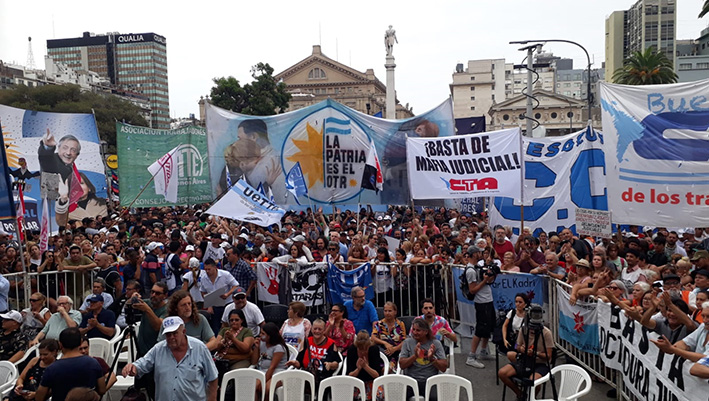

Frente a Tribunales realizaron un nutrido acto de denuncia a la persecución
judicial y criminalización de las y los que luchan y de repudio a los ataques
mediáticos, judiciales y políticos a los movimientos populares y en
solidaridad con las y los compañeros que han sufrido y sufren amenazas y
ataques.

Confluimos con sectores que pusieron el centro en el juicio político a la
Corte Suprema, y en el intento de proscripción a la vicepresidenta Cristina
Fernández de Kirchner.

Después del Himno Nacional hablaron representantes de las organizaciones
presentes, entre ellos Taty Almeida de Madres Línea Fundadora, Hugo Yaski de
CTA de los Trabajadores, Ramiro “Vasco” Berdesegar de la CCC, Hugo Cachorro
Godoy de CTA Autónoma, Omar Plaini de Canillitas, Héctor Amichetti de la
Federación Gráfica Bonaerense, el diputado Juan Marino, el juez Juan María
Ramos Padilla, cerrando el acto Nora Cortiñas de Madres Línea Fundadora quien
reclamó por “una patria digna, sin mafia judicial, sin los canallas que
desconocieron los derechos humanos cuando firmaron el 2×1”. Estuvieron
presentes gran cantidad de dirigentes y funcionarios, entre ellos tres
ministras y ministros del gobierno de la provincia de Buenos Aires.

**Palabras de Ramiro “Vasco” Berdesegar de la CCC**

Ramiro Berdesegar resaltó la unidad de las organizaciones sociales,
sindicales, políticas, de Derechos Humanos y religiosas presentes y mandó “un
fraterno saludo, caluroso y de clase, a los compañeros originarios,
campesinos, estudiantes, trabajadores que marcharon hacia Lima, y que desde el
7 de diciembre enfrentan el golpe de Estado y la represión. No tenemos dudas
de que en esos compañeros se alza la bandera de Murillo, de Tupac Amaru, de
Micaela Bastidas, de Panchito Solano y de cada uno de los compañeros que han
dejado la vida por la emancipación de esta América Latina. Un enorme aplauso
para cada uno de ellos y gritamos ¡viva la rebelión del pueblo de Perú!”

“En el día de ayer se conocieron los datos del último censo: 46.044.703
habitantes que pueblan de norte a sur nuestra Argentina. Eso señala un
crecimiento del 14,77% de nuestra población desde el último censo en el 2010.
Grafica el dinamismo, la vida de nuestro pueblo, el crecimiento. La otra cara
de la estática de los que se quieren quedar por siempre son los cuatro
“supremos” que desde hace años no hacen más que instalar un gobierno paralelo
para defender los intereses de los grupos económicos que se esconden detrás de
ellos” señaló Berdesegar.

El dirigente de la CCC dio más datos del censo y refiriéndose al porcentaje de
mujeres señaló que “allí están las miles de compañeras que todos los días
revuelven la olla en los comedores populares, las miles que garantizan la
producción, las miles de campesinas, muchas de ellas sin tierra, que
garantizan alimentos en cada uno de los cinturones verdes, las mujeres que
dieron el paso adelante como promotoras de salud en la pandemia, las que no
están son las mujeres representadas en esta Corte Suprema nefasta, estos
cuatro que no solamente desde su perspectiva de clase también desde su
perspectiva de género no hacen más que imprimir fallos contra nuestro pueblo”.

Señaló Berdesegar que por los datos del censo la provincia de Buenos Aires es
la que tiene más habitantes, más de 17 millones, le siguen Córdoba, Santa Fe y
cuarta CABA, con 3.120.000, preguntándose “¿En qué galaxia viven estos
“supremos” cuando imponen un fallo que atenta contra el federalismo y la
coparticipación, como lo que hicieron hace unos meses?”

“Queda claro que cuando uno lee cada uno de los fallos de esta Justicia adicta
al macrismo no hace más que encontrar la defensa de los intereses de clase de
los verdaderos dueños de este país, de los 1.823 grandes terratenientes que
tienen el 50% de la tierra productiva en nuestra Patria a costa de miles de
campesinos/as, de originarios/as, desplazados de la tierra y del territorio.
En esos fallos se esconden los intereses que tienen los formadores de precios
y los productores de alimentos, esas 20 grandes empresas, que todos los días
le arrebatan la comida, la carne, la leche a nuestros pibes.

“Pero también en cada uno de los fallos de esa Justicia se esconde un profundo
odio de clase a los sectores populares. Odio de clase que dejaron expresado
cuando ratificaron la condena a la compañera Milagro Sala. Odio de clase que
tiene la jueza Vence que desde noviembre de 2021 hasta julio del año pasado, a
pesar de que no había ninguna prueba ante denuncias falsas ordenó que nos
pinchen los teléfonos a decenas de dirigentes y compañeros y compañeras de
nuestra organización, ordenó la persecución física desde nuestras casas y la
escucha en tiempo real, y no les alcanzó con eso sino que ordenaron 23
allanamientos a las casas de nuestras compañeras, a los comedores, a las
unidades productivas. Sabemos lo que quieren, nos quieren criminalizar,
perseguir, nos quieren sacar del medio, nos quieren encarcelar pero lo que
nunca van a poder es ponernos de rodillas porque acá en unidad estamos para
enfrentarlos y seguiremos en las calles.

“Para terminar, quiero ratificar el camino de unidad, de confluencia
multisectorial que es la esperanza para parir la Patria que necesitan nuestros
hijos e hijas. Ni un paso atrás, compañeros”.

[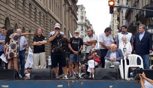](http://pcr.org.ar/nota/basta-de-persecucion-a-las-y-
los-que-luchan/acto-en-la-corte-suprema-1/)

Source: [https://pcr.org.ar/nota/basta-de-persecucion-a-las-y-los-que-luchan/](https://pcr.org.ar/nota/basta-de-persecucion-a-las-y-los-que-luchan/)

<!--NEWS-->

# Suomen työväen vallankumouksen 105. vuosipäivänä

Author: lipunkantaja

Time: 2023-02-02T99:00:00

Images: ['[stvk23a.png](https://punalippu.noblogs.org/files/2023/02/stvk23a.png)', '[stvk23b.png](https://punalippu.noblogs.org/files/2023/02/stvk23b.png)', '[stvk23c.png](https://punalippu.noblogs.org/files/2023/02/stvk23c.png)', '[stvk23d.png](https://punalippu.noblogs.org/files/2023/02/stvk23d.png)']

Categories: ['Yleinen']

<!--METADATA-->

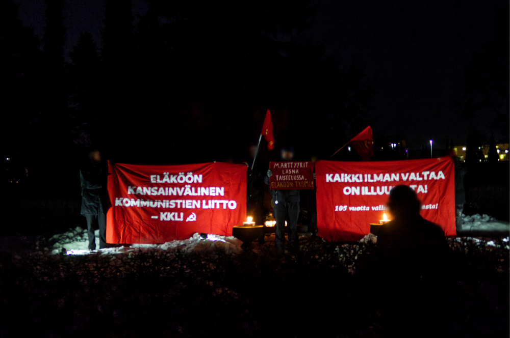

Perjantaina 27. tammikuuta juhlistettiin Suomen työväen vallankumouksen 105.
vuosipäivää. Sen kunniaksi pidettiin tilaisuus punaisten hautamuistomerkillä
Malmin hautausmaalla Helsingissä. Yhteislauluissa, runoesityksissä ja
juhlapuheissa yhdistyivät punaisten luokkasankarien uhrauksen muisto sekä
uskollisuus heidän työtään jatkaville tehtäville Suomessa palveluksena
maailmanvallankumoukselle, osana kansainvälisen kommunistisen liikkeen
ponnistuksia. Tätä ilmensivät myös Kansainvälisen Kommunistien Liiton liput,
banderollien tunnukset sekä [Turkin toverien marttyyrien
viikolle](https://demvolkedienen.org/index.php/en/t-international-
en/7439-turkey-action-for-the-foundation-of-the-icl-and-further-activities-in-
memory-of-the-martyrs-of-the-party-and-the-revolution) osoitettu viesti
"marttyyrit läsnä taistelussa, eläköön TKP/ML!"

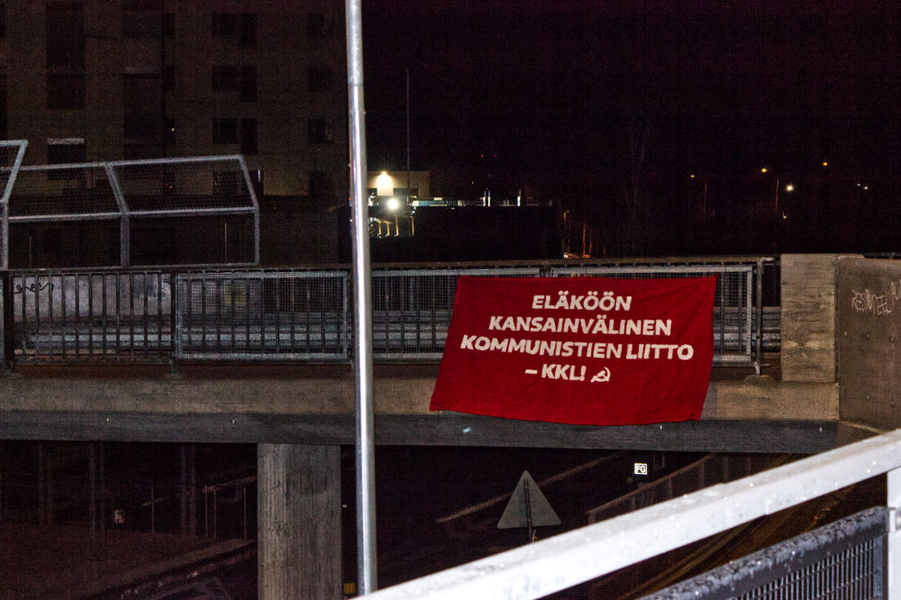

_" Eläköön Kansainvälinen Kommunistien Liitto - KKL!"_

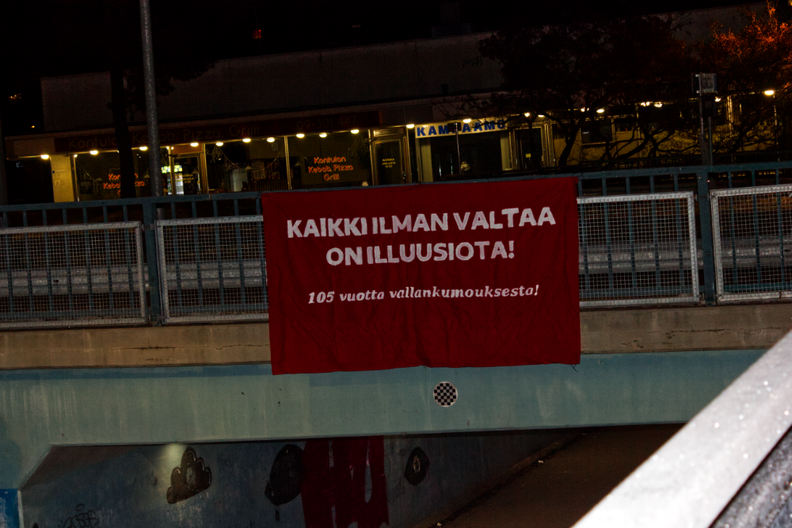

_" Kaikki ilman valtaa on illuusiota! 105 vuotta vallankumouksesta!"_

Source: [https://punalippu.noblogs.org/post/2023/02/02/suomen-tyovaen-vallankumouksen-105-vuosipaivana/](https://punalippu.noblogs.org/post/2023/02/02/suomen-tyovaen-vallankumouksen-105-vuosipaivana/)

<!--NEWS-->

# Repudiamos la violencia y agresiones de Lewis y sus matones

Author: carga

Time: 2023-02-02T99:00:00

Head Description: 

Description: Luego de la masiva marcha multisectorial con más de mil personas el martes 31, y de cinco días de movilizaciones por soberanía y la apertura del camino de Tacuifi, este miércoles se llevó adelante una nueva marcha en el ingreso del camino vecinal donde estuvimos el martes en la 7ma convocatoria. Pero esta vez, al&hellip;

Images: ['[Agresiones-de-Lewis-1-de-feb-w.jpg](https://pcr.org.ar/wp-content/uploads/2023/02/Agresiones-de-Lewis-1-de-feb-w.jpg)']

Type: article

<!--METADATA-->

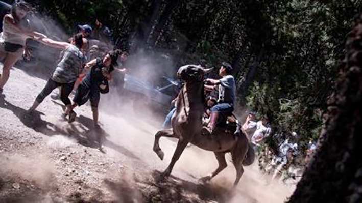

Luego de la masiva marcha multisectorial con más de mil personas el martes 31,
y de cinco días de movilizaciones por soberanía y la apertura del camino de
Tacuifi, este miércoles se llevó adelante una nueva marcha en el ingreso del
camino vecinal donde estuvimos el martes en la 7ma convocatoria. Pero esta
vez, al intentar sobrepasar la tranquera los defensores de Lewis a caballo y
con palos, piedras y gases agredieron a los manifestantes.

Repudiamos la violencia ejercida y exigimos que se actúe con celeridad y
garantice la salud e integridad de las víctimas.

El gobierno de Arabela Carreras no solo incumple leyes constitucionales, sino
fallos judiciales y ahora también libera la zona y permite este tipo de
aberraciones.

Sostenemos lo que afirmamos hace años: Lewis gobierna un estado paralelo en
Río Negro con la complicidad de Juntos por el Cambio y Juntos Somos Río Negro.

1 de febrero 2023

Source: [https://pcr.org.ar/nota/repudiamos-la-violencia-y-agresiones-de-lewis-y-sus-matones/](https://pcr.org.ar/nota/repudiamos-la-violencia-y-agresiones-de-lewis-y-sus-matones/)

<!--NEWS-->

# ΑΘΗΝΑ| Προταση για αντιπολεμικές κινητοποιήσεις: Για τη σύσκεψη της 31/1 - Νέα σύσκεψη την Παρασκευή 3/2, 7.30μμ στο &quot;Εκτός των Τειχών&quot; - ΚΚΕ(μ-λ)

Author: ΚΚΕ(μ-λ)

Time: 2023-02-02T99:00:00

Description: Πραγματοποιήθηκε την Τρίτη 31/1 στην Αθήνα η σύσκεψη οργανώσεων και συλλογικοτήτων, στη βάση της πρότασης του ΚΚΕ(μ-λ) για &#171;πλατιά αντιπολεμική κοινή δράση μέσα στον Φλεβάρη&#187;.

Images: ['[ap23029343183231.jpg](https://www.kkeml.gr/media/2tzh1e0d/ap23029343183231.jpg)']

Type: article

<!--METADATA-->

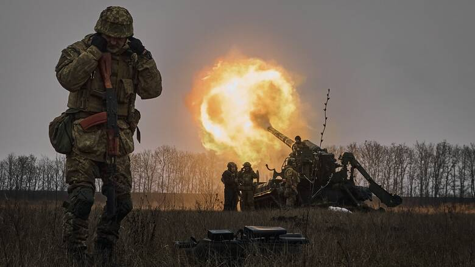

Πραγματοποιήθηκε την Τρίτη 31/1 στην Αθήνα η σύσκεψη οργανώσεων και
συλλογικοτήτων, στη βάση της πρότασης του ΚΚΕ(μ-λ) για «πλατιά αντιπολεμική
κοινή δράση μέσα στον Φλεβάρη». Η πρόταση αυτή κατατίθεται ενόψει της
συμπλήρωσης ενός έτους από την έναρξη του πολέμου στην Ουκρανία, καθώς και της
προγραμματιζόμενης επίσκεψης του υπ. Εξωτερικών των ΗΠΑ, Μπλίνκεν, στην Ελλάδα
και σε χώρες της περιοχής.

Στη σύσκεψη παρευρέθηκαν εκπρόσωποι του ΝΑΡ, της ΔΕΑ, της ΑΡΑΣ, της ΛΑΔ, της
Αναμέτρησης και του Λαϊκού Μετώπου. Στην τοποθέτησή του το ΚΚΕ(μ-λ) κατέθεσε
την άποψή του για τις εξελίξεις και παρουσίασε το περιεχόμενο της πρότασής
του, που υπαγορεύεται από την ανάγκη να σπάσει η πολύμηνη σιγή και αδράνεια
του κινήματος αναφορικά με την ιμπεριαλιστική σύγκρουση των ΗΠΑ-ΝΑΤΟ με τη
Ρωσία στην Ουκρανία και τα εφιαλτικά ενδεχόμενα που αυτή τροφοδοτεί. Ως εκ
τούτου, πρότεινε τη διεξαγωγή κινητοποίησης στις 21 του Φλεβάρη, ημέρα που
είναι κοντά στην επέτειο του ενός χρόνου από το ξεκίνημα του πολέμου και
φημολογείται επίσης ότι θα επισκεφτεί τη χώρα ο Μπλίνκεν. Η προτεινόμενη
κινητοποίηση αφορά για εμάς τόσο την καταγγελία του άδικου πολέμου που
μαίνεται, των ιμπεριαλιστών που πρωταγωνιστούν στη σφαγή, της ντόπιας άρχουσας
τάξης που μετατρέπει τη χώρα σε ορμητήριο για τα Αμερικανονατοϊκά αφεντικά της
και εμπλέκει τον λαό σε αυτή τη βάση στην αντιδραστική της αντιπαράθεση με την
τουρκική αστική τάξη όσο και την αγωνιστική καταδίκη του ερχομού του
εκπροσώπου του αμερικάνικου ιμπεριαλισμού. Από αυτό το περιεχόμενο απορρέει
και η διαδρομή της διαδήλωσης που πιστεύουμε ότι θα έπρεπε να ακολουθηθεί,
απέναντι και στις δύο πρεσβείες, αμερικάνικη και ρώσικη.

Από την πλευρά του ΝΑΡ, της ΔΕΑ και της Αναμέτρησης, με τις ιδιαίτερες απόψεις
φυσικά της κάθε οργάνωσης, υπήρξε μια γενική συμφωνία στο περιεχόμενο της
πρότασης. Εκφράστηκαν, ωστόσο, διαφωνίες -από διαφορετικές αφετηρίες- σε σχέση
με την προτεινόμενη διαδρομή της διαδήλωσης. Το ΝΑΡ και η ΔΕΑ, συμμετέχοντας
από κοινού σε αντιπολεμική πρωτοβουλία, αντιπρότειναν την πραγματοποίηση
ξεχωριστής συγκέντρωσης στις δύο πρεσβείες σε διαφορετική ημερομηνία από την
επίσκεψη Μπλίνκεν.

Στις τοποθετήσεις των υπολοίπων δυνάμεων έγινε φανερή η αδιαφορία για την
ανάγκη καταγγελίας του πολέμου και μια προσπάθεια διαχωρισμού του από την
επίσκεψη Μπλίνκεν, με αποκλειστική επικέντρωση στην απάντηση που πρέπει να
δώσει το κίνημα σε αυτή. Γεγονός το οποίο δεν μας προκάλεσε ιδιαίτερη
εντύπωση, μιας και είναι γνωστές οι απόψεις μιας σειράς οργανώσεων για το
ζήτημα, που κινούνται από την -ντροπαλή- αθώωση του ρωσικού ιμπεριαλισμού
μέχρι και την απροκάλυπτη αποδοχή της υποταγής των συμφερόντων των λαών στις
επιλογές του, στο όνομα του αντιαμερικανισμού και του αντιφασισμού. Στην
αντιπαράθεση που ακολούθησε αναδείχτηκαν τα εμπόδια που τίθενται από τέτοιες
τοποθετήσεις στη διοργάνωση αντιπολεμικής κινητοποίησης, με την απροθυμία για
κάτι τέτοιο να ομολογείται ανοιχτά τόσο από την ΑΡΑΣ όσο και από τη ΛΑΔ. Από
την πλευρά της ΑΡΑΣ η μόνη αναφορά που προτάθηκε σε σχέση με τον πόλεμο ήταν η
μονόπλευρη καταγγελία της επέκτασης του ΝΑΤΟ, των δυτικών κυρώσεων και το
σύνθημα για «ειρηνική διευθέτηση» της σύγκρουσης.

Δεδομένης της αδυναμίας κατάληξης σε κάποια συμφωνία, το ραντεβού ανανεώθηκε
με τον καθορισμό νέας σύσκεψης για την Παρασκευή 3/2. Παρά τις έντονες
διαφωνίες μεταξύ των πολιτικών δυνάμεων, από τη μεριά μας επιμένουμε στην
προσπάθεια να βρεθεί κοινός τόπος για την πραγματοποίηση αντιιμπεριαλιστικής-
αντιπολεμικής κινητοποίησης, αξιοποιώντας τις διαθέσεις που εκφράστηκαν για τη
διεξαγωγή πορείας απέναντι στην πρόκληση της επίσκεψης του εκπροσώπου των
Αμερικανονατοϊκών στη χώρα. Στο πλαίσιο αυτής της προσπάθειας, δηλώνουμε τη
διάθεσή μας να αναζητηθούν συμβιβασμοί και να τροποποιήσουμε στοιχεία της
πρότασής μας, χωρίς όμως να έχουμε την πρόθεση σε επίπεδο περιεχομένου να
κάνουμε πίσω από την ουσία του συνθήματος «οι λαοί δεν έχουν ανάγκη από
προστάτες» και να αφήσουμε στο απυρόβλητο κάποιον από τους εμπρηστές του
πολέμου και τους φονιάδες των λαών.

Source: [https://www.kkeml.gr/αθηνα-προταση-για-αντιπολεμικές-κινητοποιήσεις-για-τη-σύσκεψη-της-31-1-νέα-σύσκεψη-την-παρασκευή-3-2-7-30μμ-στο-εκτός-των-τειχών/](https://www.kkeml.gr/αθηνα-προταση-για-αντιπολεμικές-κινητοποιήσεις-για-τη-σύσκεψη-της-31-1-νέα-σύσκεψη-την-παρασκευή-3-2-7-30μμ-στο-εκτός-των-τειχών/)