# 共产主义国际报纸：斯大林格勒战役中胜利80周年

作者: Verein der Neuen Demokratie

描述: 2023年1月31日...

时间: 2023-02-01T15:46:00+01:00

图片: ['[stalin-1024x576.jpg](https://ci-ic.org/wp-content/uploads/2023/01/stalin-1024x576.jpg)']

<!--METADATA-->

＃ 

 2023年1月31日 

 [下载PDF](https://ci-ic.org/blog/2023/01/31/on-the-80th-anniversary-of-
the-victory-in-the-battle-of-stalingrad/?print=pdf)[打印 
 文档](https://ci-ic.org/blog/2023/01/31/on-the-80th-anniversary-of-the-
victory-in-the-battle-of-stalingrad/?print=print)_所有国家的普罗莱门特人，团结!_ 

 ＃在斯大林格勒战役中胜利80周年 

 国际共产党联盟在其政治上正确地说明了 
 宣言和国际共产党联盟的原则'：_“ _ _ _ 
 承担毛主席主席在斯大林同志的角色上的职位 
 一个伟大的_ _marxist._ _ furthermore，_ _ _我们必须bear _in mind _ _that _ _he是 
 一个明智地定义的_ _ leninism。 
 任务to _ _ assume __his _ _role in__world war _ _ii _ _within的防御 
 共产主义国际，尤其是其7_ _th______world__congress。 “_ 这 
 后者将是本文庆祝巨大胜利的中心 
 斯大林格勒战役。 

 这场伟大而英勇的战斗的重量和意义正确 
 由Mao Tse-Tung主席建立：** ** **这场战斗不仅是 
 苏联 - 德国战争的转折点，甚至是目前的反法西斯主义者 
 世界大战，这是全人类历史的转折点。 ” ** 

 苏联打击的战争是绝对正确定义的，是一个 
 伟大的爱国战争，公正的国防战争。 除了光荣和 
 英勇的辩护，在斯大林同志领导下的苏联 
 应用焦土的土地来捍卫自己的领土，捍卫社会主义者 
 祖国，耗资超过2500万的生命，反帝国主义者 
 在此期间，在被压迫国家的斗争大大展开了。 

 毛主席董事长公正正确地想我们：**苏联的 
 对法西斯侵略的神圣抵抗战争不仅在 
 它自己的辩护，但为了捍卫所有努力解放的国家 
 自己来自法西斯奴役。 对于全世界的共产党人 
 现在的任务是动员所有国家的人民，并组织 
 国际联合阵线与法西斯主义作斗争并捍卫苏联， 
 捍卫中国，并捍卫所有国家的自由和独立性。” ** 

 世界人民为公正的事业而兴起，并散发出他们的珍贵 
 不仅在反对轴心的战争中，而且还针对他们各自的鲜血 
 帝国主义大师，是什么发起了伟大的反殖民斗争 
 20世纪下半叶。 

 在1941/42冬季，苏联在领导和指挥下 
 斯大林同志已经成功拒绝了一次恶毒的纳粹德国袭击 
 在该国的西部，旨在占领莫斯科首都。 这 
 纳粹 - 韦尔马赫(Nazi-Wehrmacht)，无法理解每一次粉碎的尝试 
 由大列宁和斯大林纠正的布尔什维斯特钢注定要失败， 
 1942年夏天，对俄罗斯南部进行了进攻。 
 在斯大林格拉德(Stalingrad)上的景点，因为这座城市是一个工业中心 
 俄罗斯，生产的其他重要商品，为该国的炮兵 
 军队。 穿过城市的伏尔加河也很重要 
 连接该国西部地区的运输路线与遥远 
 东部地区。 纳粹希望Wehrmacht占领Stalingrad，看到 
 鉴于它以斯大林的名字命名，其价值是宣传目的。 为了 
 类似的道德原因也有特殊需要捍卫它。 第六军 
 WEHRMACHT于1942年8月23日开始袭击。 

 斯大林同志作为最高司令部，亲自发出了227命令 
 1942年7月底，为了提高牺牲和战斗水平 
 武装部队的精神达到人民的水平： 

 “ **敌人将新力量扔向前线，而无需考虑惨重的损失 
 并深入苏联，夺取新地区，摧毁我们 
 城市和村庄，违反，掠夺和杀害苏联 
 人口。 战斗在南部，南部的唐附近，南部和 
 高加索北部的大门。 德国入侵者渗透 
 Stalingrad，到达伏尔加河，并希望不惜一切代价捕获Kuban和Northern 
 高加索，其油和谷物。 […]南部部队的一部分 
 正面，紧随恐慌的人，离开了罗斯托夫和诺维奥切尔科斯克 
 严重的抵抗力，没有莫斯科的命令，覆盖了他们的横幅 
 耻辱。** 

 **我们国家的人口热爱和尊重红军，开始 
 对她灰心，对红军失去信心，许多人诅咒红色 
 军队将我们的人民留在德国压迫者的锁下， 
 本身向东行驶。 一些愚蠢的人在谈话中平静下来 
 我们可以进一步向东撤退，因为我们有很多领土，很多 
 地面，大量人口，总会有很多面包
虚假，仅对我们的敌人有帮助。** 

 **每个指挥官，红军士兵和政治委员都应该了解 
 我们的手段不是无限的。 苏联国家的领土不是 
 沙漠，但是人民 - 工人，农民，知识分子，我们的父亲，母亲， 
 妻子，兄弟，孩子。 敌人拥有的苏联领土 
 捕获并捕获的目标是陆军，金属的面包和其他产品 
 以及工业，工厂，植物为军队提供武器和 
 弹药，铁路。 在失去波罗的海乌克兰，波罗的海的乌克兰之后 
 共和国，Donetzk和其他地区，我们的领土要少得多，少得多 
 人，面包，金属，植物和工厂。 我们损失了超过7000万 
 人，每年超过8亿磅的面包，超过10磅 
 每年一百万吨金属。 […]进一步撤退 - 意味着浪费 
 我们自己，同时浪费我们的祖国。 因此它是 
 消除我们具有无限撤退能力的谈话所必需的， 
 我们有很多领土，我们的国家是伟大而富有的， 
 人口众多，面包总是很丰富。 这样的谈话 
 是虚假的和寄生的，它会削弱我们并受益于敌人，如果我们不这样做 
 停止退缩我们将没有面包，没有燃料，没有金属，没有金属 
 原材料，没有工厂和植物，无铁路。 这将导致 
 结论是时候完成撤退了。 _不后退!_ […] 
 不可能容忍指挥官和委员会允许单位离开 
 他们的位置。 不可能容忍指挥官和委员 
 承认有些恐慌群确定了战斗领域的情况 
 并带走了其他士兵，并打开前面 
 敌人。 恐慌的人和胆小鬼应被灭绝。** 

 **此后，每个指挥官，红军士兵， 
 委员应该是要求 - 如果没有订单，就不是一步 
 从高级命令。 公司，营，军团 - 指挥官 
 和适当的委员会，他们没有从高级指挥官那里撤退， 
 是祖国的背叛者。 这些是我们祖国的命令。 到 
 执行此命令 - 意味着捍卫我们的土地，拯救祖国， 
 灭绝并征服讨厌的敌人。” ** 

 我们的英勇红色士兵最初能够减慢Wehrmacht的进步 
 在斯大林格拉德以北的一系列小规模冲突中，提供了超过200,000 
 生命，并成功地阻止了纳粹成群。 决定不逃跑 
 但是承受，因此不撤离超过40万居民 
 城市的。 斯大林格勒的男人和女人，甚至是最小的男人 
 合并到与战争相关的活动中 - 战斗，建筑，间谍， 
 供应等。即使斯大林格拉德的墙被德国空军的墙破裂 
 人们不断轰炸或大炮袭击，人们站着 
 坚定。 

 由乔治·朱科夫(Georgy Zhukov)和亚历山大·瓦西列夫斯基(Aleksandr Vasilevsky)领导的天王星行动组织 
 俄罗斯军队在城市北部和西部的山区。 从那里， 
 他们发起了反击。 为红军支付必要的价格 
 能够在1942年11月下旬之前包围城市，捕获近30万 
 德国和轴(mainly Italian and Romanian)，扼杀敌人 
 来自重要供应的力量，本质上是在不断的 
 收紧绞索。 

 接近斯大林格拉德，红军赢得了重要的战斗，包括在罗斯托夫 
 on-don，距离斯大林格拉德约250英里。 因此敌军是 
 在正面的那部分稀疏和伸展，操作很少 
 斯大林格拉德西部的土星成功。 与男人，不是武器，证明 
 马克思主义的原则关于什么是最重要的正确正确的原则，他们 
 勒死了入侵者死亡，并与 
 城市见过。 这不仅是从街道到街，也是一场战争 
 将房屋或地窖住在地窖，甚至不是地板，而是在房间的房间里， 
 产生最大的英雄主义，震撼了世界的章节。 

 关于Stalingrad战役在整个过程中的重要性 
 毛战争主席说：**“……在当前的战争中，对斯大林格勒的袭击是 
 法西斯主义本身的最后一场绝望的斗争的表达。 在这 
 历史上的转折点也是世界上许多反法西斯主义阵线的人 
 被法西斯主义的凶猛外观所迷惑，未能 
 辨别它的本质。 四十八天，狂暴 
 痛苦的战斗，在8月23日的人类历史上无与伦比 
 整个德国部队越过唐河的弯道，开始了全力以赴 
 直到9月15日，一些德国单位闯入 
 城市西北部的工业区，直接向上 
 到10月9日，苏联信息局宣布红军
苏联赢得了战斗。 在那四十八天，新闻 
 那个城市的每个挫折或胜利都抓住了无数的心 
 数以百万计的人，现在使他们感到焦虑，现在使他们兴高采烈。 
 ****这场战斗不仅是苏联 - 德国战争的转折点，还是 
 即使是当前的反法西斯主义世界大战，这也是 
 全人类的历史。** **在这些四十八日， 
 世界看着斯大林格勒比他们所观察到的更加关注 
 莫斯科去年10月。** ** [** ** **…** **] ** ** 
 辩护斯大林格拉德，情况将与 
 去年。 一方面，苏联将推出第二个冬天 
 在大规模的反击中，英国和美国将不再 
 能够延迟第二个战线的开放(though the exact date cannot
yet be foretold)，欧洲人民将准备好起床 
 回复。 另一方面，德国和她的欧洲同伙不再 
 有实力大规模攻击，希特勒将没有 
 替代方案，但要将他的整个政策范围更改为战略防御。 
 ” ** 

 我们都知道，我们必须记住，法西斯进攻由 
 纳粹，意大利语和西班牙法西斯主义者以及其他像其他人一样 
 罗马尼亚人，匈牙利人以及班德拉(Bandera)的一群老鼠来自乌克兰 
 贡献了，并使用了征服欧洲的所有经济力量， 
 数以百万计的德国军队的奶油，占空军的75％ 
 进入入侵。 但是斯大林同志曾明智地处理外交 
 微妙。 

 值得注意的是苏联情报的聪明和渗透 
 服务。 多么的情报服务。 他们知道纳粹的确切日子 
 入侵。 

 苏联与焦土一起应用了战略辩护， 
 除了裸露的大地，泥土，灰烬和最勇敢的，决心 
 并在敌人线后面坚决党派。 他们有胆量， 
 勇于炸毁巨大的作品，例如著名的水坝 
 与DON一起花了很多年的DON。 德国人永远不会 
 梦dream以求，他们认为这项工作不会被炸毁，因为它也是如此 
 重要，花费很多。 

 无产阶级的独裁统治受到威胁，革命受到威胁， 
 我们不能停下来思考，我们也不能简单地允许自己受到阻碍，因为 
 毛主席主席说，捍卫了英寸的土地。 他们在大门坠毁 
 列宁格勒(Leningrad)，莫斯科(Moscow)和斯大林格拉德(Stalingrad)的大门； 但不仅是 

 进行了焦土，但游击队，甚至是简单的个人 
 妇女用步枪，弹药和伏特加酒等待着敌人。 到 
 歼灭了那些勇敢的英雄和英雄之一，德国人失去了10个人 
 平均。 

 法西斯进攻是一项非常高质量的军事计划，因此 
 最高和最开明的德国军事领导人阐述了这一计划， 
 这所德国学校有很多次证明的战争传统：三个月后 
 计划征服苏联。 

 斯大林同志的远见道，他自1930年代以来就已经采取了措施 
 乡村和工业发生了巨大的转变，他们有 
 已经将工厂转移到了乌拉尔之外，甚至预见了 
 离开莫斯科的可能性，因为这是真的，一切都是 

 如果他们最终无法捍卫莫斯科，即使 
 是做出的决定，已经计划迁移领导和 
 到乌拉尔的中心； 所以第一件事是安排 
 为了列宁的转移，因为他不能落入 
 地狱的悲惨儿子，他不能摔倒。 

 但是，在他们渗透到上述大门之后，该命令是 
 命令不再撤退!这是非常令人难忘的，我们必须永远 
 记住如何在革命周年纪念日11月7日 
 无处可庆祝它，被认为不可能执行它。 
 斯大林同志说：“到达车站”，但是那里没有平台 
 那里没有座位。 
 革命说：“当我们夺取权力时，我们当中有多少人， 
 当我们击败帝国主义侵略时，我们有什么力量 
 十月革命之后立即？ 我们会粉碎它们，我们将 
 在柏林歼灭野兽。” 

 这些是人们必须记住的事情，欣赏斯大林同志必须看 
 在第二次世界大战中。 我们都知道那是如何出现的，巨大的抵抗力量， 
 破坏德国线，围困斯大林格勒的德国人的围困 
 指挥官希特勒本人命令他们不要撤退到那些劣等的 
 亚人类。 那些卑鄙的人，野蛮人，蒙古人像 
 老鼠和他们不得不投降。 

 重申这一点总是很好的：斯大林，熟练而明智的经理
投降纳粹，扔了旗帜，他们的老鹰，他们的魔力 
 列宁陵墓的脚； 不仅是一次巨大的军事失败，而且还 

 巨大的道德失败!纳粹傲慢被泥土沉没并践踏 
 在这是有史以来最大的道德打击，那是 
 纳粹Wehrmacht的崩溃开始。 

 1943年2月，斯大林同志分析了：**三个月前 
 红军开始进攻斯大林格勒。 自那以后 
 军事行动的主动行动仍在我们手中和步伐中 
 红军进攻行动的惊人力量尚未 
 削弱。 今天，在艰难的冬季条件下，红军正在前进 
 1,500公里的前部(950 miles)并实际上取得了成功 
 到处。 在北部，在列宁格勒附近，中央前沿， 
 在罗斯托夫(Rostov 
 阿佐夫和黑海的海洋，红军在打击后打击 
 希特勒部队。 在三个月内，红军从敌人那里解放了 
 Voronezh和Stalingrad地区的领土，车臣 -  ingush， 
 北奥塞梯，卡巴迪诺 - 巴尔干和卡尔米克自治共和国， 
 Stavropol和Krasnodar领土，Cherkess(Circassian)，Karachaisu和 
 Adygeisu自治区域以及Rostov，Kharkov和 
 库尔斯克地区。** 

 ** […]仅在1942  -  43年的冬季，德国人损失了7,000多个坦克， 
 自战争开始以来，有4,000架飞机，17,000枪[…] 
 大约9,000,000名德国法西斯官员和男子行动，其中不少于 
 在战场上有4,000,000人被杀。** 

 ** […]首先，德国军队的弱点是人力的短缺 
 储备金，因此尚不清楚这些损失的来源 
 被替换。 […]红军已成为一支经验丰富的军队。 […]数百万的红色 
 军人已经成为武器的主人[…] ** 

 **不仅是红军司令部不仅是事故 
 将苏联的土壤从敌人中解放出来，但不让敌人离开我们的土壤 
 活着，进行包围和包围等重要操作 
 可以很好地用作军事艺术例子的敌军的灭绝。 
 毫无疑问，这是我们指挥官成熟的标志。** 

 **毫无疑问，只有红军的正确策略 
 司令部以及执行指挥官的灵活策略可能会有 
 导致了一个杰出的事实，例如环境和歼灭 
 一支巨大的德国人军队的斯大林党，人数有33万人。 ” ** 

 我们的巴西同志指出：第二次反对法西斯主义的胜利 
 世界大战是该过程的伟大历史事件之一 
 无产阶级世界革命，帝国主义营地发现自己被深深殴打， 
 三个重要的帝国主义大国被击败 - 德国，日本和意大利 -  
 必须认真研究其公正和正确的理解， 
 必须强调和庆祝。 

 中国共产党确认了对此的评估 
 历史经验： 

 “ **首先，反法西斯战争的历史表明 
 社会主义系统具有巨大的活力，可以抵抗最严重的测试 
 而且，无产阶级的独裁统治是无敌的。** 

 **第二位，反法西斯战争的历史表明帝国主义 
 是现代所有战争的根源，即 
 帝国主义不会改变，因此，为捍卫世界和平是 
 坚持反对帝国主义的斗争所必需的。** 

 **第三名，反法西斯战争的历史表明人民 
 战争一定要获得胜利，完全有可能击败 
 帝国主义侵略者，帝国主义是一只纸虎，显然是 
 强大，但实际上很弱，原子弹也是一篇论文 
 老虎，是人民，而不是任何阶级的武器，决定了 
 战争的结果。** 

 **在第四位，反法西斯主义战争的历史表明，为了 
 击败帝国主义侵略者，必须信任 
 所有国家人民的革命力量，吸引我们 
 侧面所有可以赢得的力量，形成最广泛的力量 
 国际联合阵线，将我们的打击集中在主要敌人身上 
 世界民族。 ” ** 

 在光荣的红军的枪支下，纳粹 - 德国被打碎，社会主义 
 无产阶级的独裁统治在德国东部出现。 这 
 共产党的红色旗帜和苏联在阴影上挥舞着 
 被摧毁的德国国会大厦是国际的不可否认的伟大时刻 
 无产阶级象征着整个斗争的英雄和光荣的史诗 
 反对法西斯主义捍卫苏联和发展
踏上方向 

 在莱比锡纳粹法庭取得巨大胜利之后，苏联是 
 完成：_“我们将成为德国苏联!” ._ 

 ＃＃ 继续阅读 

 [上一周和每周社论 - 蛇的负责人](https://ci-
ic.org/blog/2023/01/27/and-weekly-editorial-the-head-of-the-snake/)[在宣布的情况下，全球采取的下一个行动 
 ICL(Update no. 19])(https://ci-ic.org/blog/2023/02/01/actions-carried-out-
worldwide-on-the-occassion-of-the-announcement-of-the-icl/)

News Source: [http://vnd-peru.blogspot.com/2023/02/communist-international-newspaper-on.html](http://vnd-peru.blogspot.com/2023/02/communist-international-newspaper-on.html)

<!--NEWS-->

# 巴勒斯坦：以色列增加对巴勒斯坦的侵略性

作者: DEM VOLKE DIENEN

时间: 2023-02-01T18:00:00+00:00

图片: ['[paläkampfjan2023.png](https://www.demvolkedienen.org/images/paläkampfjan2023.png)']

标签: ['Palästina']

类别: None

<!--METADATA-->

1月26日，以色列军队正在进行军事手术 
 西岸的Dschenin市10帕拉斯丁人被谋杀，其他20人 
 部分受伤。 该操作的目的是几个住宅建筑商，一个 
 逃生仓库和医院。 这是合理的 
 反对被称为“恐怖分子”的行动，例如民族解放运动 
 和其他抗性。 国家议员 
 解放组织哈马斯和伊斯兰圣战是部分抵抗的 
 枪杀屠杀。 除了几个男孩， 
 男子也是一个61岁的男人，在自己的房子里 
 Genick Shot实际上被执行。 此外，一个 
 Tranenaschranates在当地医院的儿童病房开火， 
 几个孩子受伤。 

 自去年以来，以色列对此的恐怖恐怖量大大增加了 
 认识帕拉斯蒂安人。 去年有225名帕拉斯汀人 
 由以色列职业部队提到，这是15年来最多的人数。 
 仅在2023年1月，就有30名帕拉斯丁人被杀。 

 然而，随着这种侵略的匆忙， 
 帕拉斯蒂安人。 在德舍宁进行军事手术后，她解雇了 
 哈马斯从以色列的加沙地带上有两枚火箭。 为此，群众去了 
 斯特拉斯对船员和正在进行的反动行动 
 反对。 在耶路撒冷，以色列安全权在一个 
 示威，谋杀了一名22岁的帕拉斯蒂安。 在 
 1月27日，星期五，以色列轰炸了人口稠密的人口 
 加沙地带。 根据官方信息，只有军事 
 每次轰炸后，职位都受到了以色列的攻击 
 正式浪费。 

 以色列新的反动政府也一直在设置 
 新的So称为“反恐怖主义法”。通过这些，允许房屋 
 从所有将以色列视为恐怖分子并提出艺术的人中 
 被摧毁。 此外，来自如此称呼的恐怖分子的家庭 
 被从中撤回，只是，只是，只是 
 因为它们是相关的。 这些措施增加了 
 帕拉斯蒂安人民和对民族的镇压 
 解放运动进一步。 但是，您只是犹太尝试 
 打破帕拉斯蒂安的抵抗，人民只在斗争中 
 被加油。

News Source: [https://www.demvolkedienen.org/index.php/de/t-international/7454-palaestina-israel-erhoeht-aggression](https://www.demvolkedienen.org/index.php/de/t-international/7454-palaestina-israel-erhoeht-aggression)

<!--NEWS-->

# PC 2月1日 - 在意大利出生的核弹：美国帝国主义和意大利政府和议会同伙在强迫阶段拖累我们的战争升级

作者: prolcomra

时间: 2023-02-01T20:00:00+01:00

图片: ['[bombe%20nucleari.jpg](https://blogger.googleusercontent.com/img/b/R29vZ2xl/AVvXsEglQ6mywZzFkSghSeUCH5b8hJazW2kR9IbCx6gZstqNKuBVR9WTzJTYfzYvv8EkPpx_1aEve3Te5pVIce6Z6ulGlXGXsWqE198xQ2AM3pwuw4QzWNus9lX2stssHfjZee0nACsNow5Te0Z68K_S76wRFKj2sMe2U3y6zyj1ILC33A7NtUxKWylTkXe-_w/w514-h289/bombe%20nucleari.jpg)']

<!--METADATA-->

**在死亡基地前，动员变得越来越必要 
 反对临时战争的运动** 

  

 天文台 

 乔治·贝雷塔(Giorgio Beretta) 

 30/1/2023 

  **意大利核风险：Ghedi和Aviano的新炸弹** 

 他们即将从美国到达Ghedi(Brescia)和Aviano(Pordenone)“新一代” B61-12的核弹。 他们将更换 
 旧的B61-11在德国比利时的军事基地中多年 
 荷兰，土耳其和意大利作为So称为教义的一部分 
 核共享， 

 北约的“核共享”。 

 它们被称为“战术核设备”，但危险不亚于 
 美国武器库中存在的“战略性核弹”，俄罗斯， 
 中国，法国，英国，印度，巴基斯坦，以色列和朝鲜。 

 新的B61-12的“可调能力”从0.3到50千座不等，五个 
 比广岛炸弹高。 但是 - 他们报告了和平与裁军网络E 
 ICAN运动 - 他们可以通过增加地球表面爆炸 
 因此，他们的破坏力直到达到武器等效的能力 
 在表面上以1,250千万的产量在表面上爆裂，约为83枚炸弹 
 就像广岛上使用的那样。 

  **今天意大利可能是一个可能的核目标** 

 所有这些都使** ghedi ** e ** aviano **，但也反映了** brescia ** e 
 ** Pordenone **，**核战争中可能的目标**。 最终 
 今天不再如此遥不可及：最近几个月，俄罗斯当局已显示 
 在乌克兰使用战术核弹的可能性。 

 作为回应，乔·拜登(Joe Biden)的管理已决定继续 
 首先使用核设备的可能性 
 因此，放弃引入无第一使用规则。 不仅如此：快速 
 改变世界情景也导致了使用 
 核武器的引用是为了捍卫美国领导人和 
 欧洲人定义“基于订单的订单”。 

 因此，核弹，甚至是“战术”的炸弹，都不再是 
 考虑一种仅仅威慑工具，但要暴露 
 将它们存储为“第一镜头”的目标或 
 进一步的报复。

News Source: [https://proletaricomunisti.blogspot.com/2023/02/pc-1-febbraio-bombe-nucleari-nato-in.html](https://proletaricomunisti.blogspot.com/2023/02/pc-1-febbraio-bombe-nucleari-nato-in.html)

<!--NEWS-->

# 来自墨西哥的新闻

作者: mats

时间: 2023-02-01T99:00:00

图片: ['[sol1.png](https://punalippu.noblogs.org/files/2023/02/sol1.png)', '[sol2.png](https://punalippu.noblogs.org/files/2023/02/sol2.png)', '[sol3.png](https://punalippu.noblogs.org/files/2023/02/sol3.png)', '[sol4.png](https://punalippu.noblogs.org/files/2023/02/sol4.png)', '[sol5.png](https://punalippu.noblogs.org/files/2023/02/sol5.png)', '[sol6.png](https://punalippu.noblogs.org/files/2023/02/sol6.png)', '[sol7.png](https://punalippu.noblogs.org/files/2023/02/sol7.png)', '[sol8.png](https://punalippu.noblogs.org/files/2023/02/sol8.png)', '[sol9.png](https://punalippu.noblogs.org/files/2023/02/sol9.png)', '[sol10.png](https://punalippu.noblogs.org/files/2023/02/sol10.png)', '[sol11.png](https://punalippu.noblogs.org/files/2023/02/sol11.png)', '[sol12.png](https://punalippu.noblogs.org/files/2023/02/sol12.png)', '[sol13.png](https://punalippu.noblogs.org/files/2023/02/sol13.png)']

类别: ['Yleinen']

<!--METADATA-->

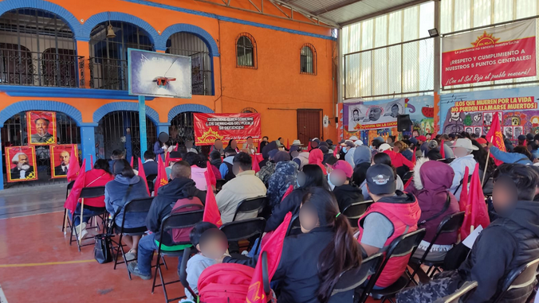流 - 红色的阳光(Corriente del Pueblo – Sol Rojo)该组织的同志发表了重要新闻。 

 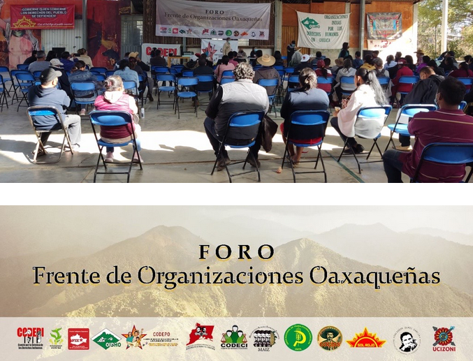1月13日在13个革命者的瓦哈卡州 
 民主组织的前沿(Frente Organizaciones Oaxaqueñas [FORO])会议组织：“瓦哈卡局势，人民运动的挑战”。 
 会议上达成了重要协议。 政治会议 
 该声明可以用西班牙语阅读 
 [这里](http://solrojista.blogspot.com/2023/01/declaracion-politica-del-
frente-de.html)。 

 民族流 - 第二天红色的太阳也组织了(14.1)现在，该国仍在漂流，在一个重要时期组织的会议 
 衰退的军事主义更多。 索林会议很重要 
 一部分是建立民间阵线的道路。 政治会议 
 该声明可以用西班牙语阅读 
 [这里](http://solrojista.blogspot.com/2023/01/declaracion-politica-del-
frente-de.html)。 

 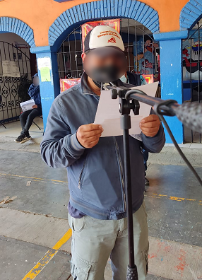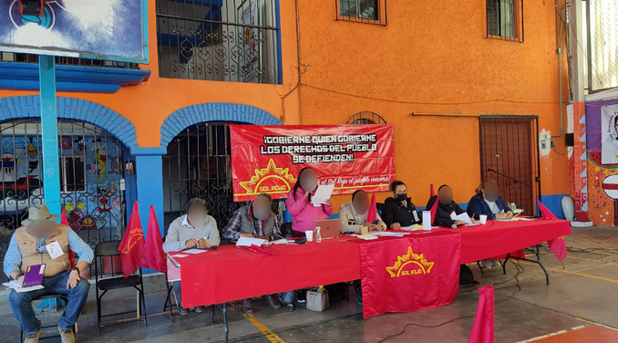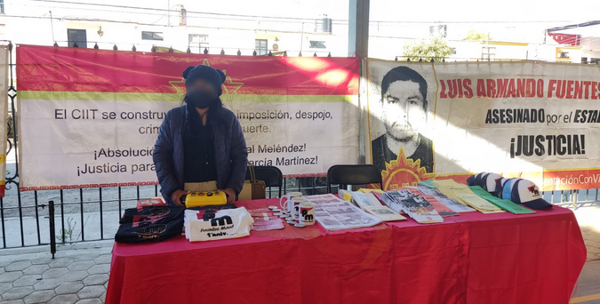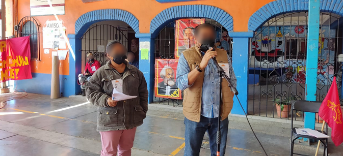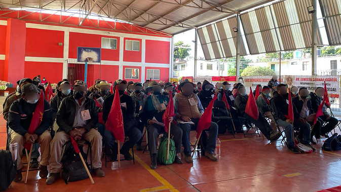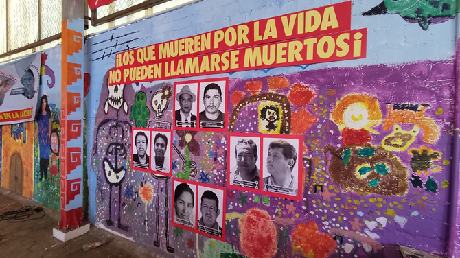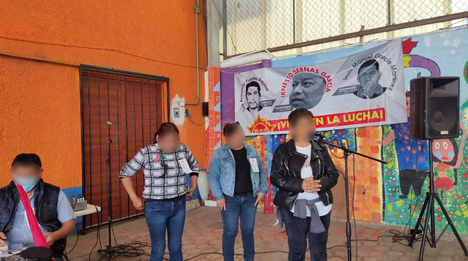

News Source: [https://punalippu.noblogs.org/post/2023/02/01/uutisia-meksikosta/](https://punalippu.noblogs.org/post/2023/02/01/uutisia-meksikosta/)

<!--NEWS-->

# 反对调整和辩护主权的单位

作者: carga

时间: 2023-02-01T99:00:00

头部描述: 秘鲁兄弟的叛乱标志着该地区和世界人民的一条道路。 在阿根廷，尽管帝国主义大国对我们的自然资源有争议，但为紧急情况和捍卫我们的主权而奋斗。

描述: 1.秘鲁人民的叛乱万岁足够镇压！ 秘鲁人民的叛乱在街上继续进行，镇压也随着63多名杀害，成千上万的囚犯和伤害而增长。 从PCR及其JCR以及我们参与的所有群众运动中，我们在全国各地推广；

图片: ['[pintada-por-Perú-en-Quilmes-Berazategui-Varela.jpg](https://pcr.org.ar/wp-content/uploads/2023/01/pintada-por-Perú-en-Quilmes-Berazategui-Varela.jpg)']

类型: article

<!--METADATA-->

** 1. ** **万岁秘鲁人民的叛乱足以镇压!** 

 秘鲁人民的叛乱在街上跟随 
 镇压超过63人丧生，成千上万的囚犯和受伤。 

 来自PCR及其JCR以及我们参与的所有群众运动 
 我们促进了一场大规模的竞选活动，以团结一致 
 秘鲁人民，否定了激烈的镇压。 

 政变过度推翻了佩德罗·卡斯蒂略(Pedro Castillo)总统，并强加了 
 Dina Boluarte事实上担任总统。 国会，由权利控制 
 法西斯主义者拒绝了今年举行新选举的可能性。 

 所有帝国主义都承认政变政府。 他们质疑相关的 
 到秘鲁统治阶级的不同部门，但它们汇聚到 
 是时候抑制民众动员并平息叛乱了。 

 在秘鲁，帝国主义争端弄脏了该国的局势。 传统 
 右Proyanqui已为帝国主义的发展提供了基础 
 奇诺(Chino)，已成为秘鲁和控制的主要商业合作伙伴 
 铜(Perú es el segundo productor mundial)它很重要 
 战略投资，包括建造Chancay港口 
 关于太平洋，这是中国人渗透到美国的关键 
 从南方及其帝国主义争端在太平洋上。 

 日本帝国主义也有重要的投资 
 主要是在藤莫里总统期间。 

 劳动运动的叛乱以及原始人和农民的叛乱 
 该国的内部，它一直在动员各省的大型大篷车 
 安第斯山脉和利马的受欢迎社区。 

 向这种流行的动员加了一大堆预备役与毕业生的大篷车 
 武装部队，超过10,000名成员，并说他们将到达 
 利马30,000。 一个巨大的事实，使结构破裂 
 军事并增加了席卷政府和国会的普遍主张 
 政变策划者 

 墨西哥总统洛佩斯·奥布拉多(LópezObrador)要求释放总统 
 佩德罗·卡斯蒂略(Pedro Castillo)被推翻。 民主主张无法批准 
 最近的CELAC会议。 

 农民群众叛乱的深度，最初是工人 
 学生和受欢迎的秘鲁声称有深刻的变化。 直到哪里 
 这场战斗将取决于能够打开的前卫 -  
 革命道路。 但是肯定没有什么 
 兄弟国家。 

 我们作为革命共产主义者的义务是提高这种情况 
 每个工作场所，学习和武装的群众，以便有 
 数百个声援人民的英勇斗争的声明 
 秘鲁和**要求阿根廷政府要求佩德罗的自由 
 城堡并否认政变。 秘鲁人民是 
 你的命运。** 

 **** 

 ** 2. ** **俄罗斯对乌克兰和世界大战的入侵** 

 “战争是政治的失败，人类的失败，一个 
 可耻的lau不休，对邪恶力量的失败。 如果我们想 
 在上个世纪，有三场世界大战，1914年至1918年，1939年至1939年 
 1945年和**这是世界大战的现任。” **该声明属于教皇 
 弗朗西斯科俄罗斯入侵乌克兰。 

 **普京低估了乌克兰人民，这些人**认可了这场爱国战争。 
 俄罗斯帝国主义使用了许多导弹储备 
 摧毁建筑物并杀死平民，寻找种族灭绝 
 播种恐惧并快速胜利。 相反。 

 **俄罗斯对乌克兰的入侵使世界陷入新战争的边缘 
 世界。** 

 美国现在将发送31辆艾布拉姆斯坦克。 拜登政府 
 在德国同意发送14个豹子坦克之后，他决定 
 兵工厂。 德国政府曾表示，豹子不会发送给 
 少于美国使艾布拉姆斯可用。 

 总体，法国，英国，美国，波兰，德国，荷兰和 
 瑞典将派遣约160辆坦克和装甲车。 

 俄罗斯帝国主义以新的浪潮对这些广告做出了回应 
 导弹和​​对基辅和其他城市的轰炸袭击，并准备 
 巨大的进攻能够向前发展和调试坦克。 

 **从乌克兰的俄罗斯种族灭绝帝国主义出发!出于帝国主义 
 洋基和北约!乌克兰人民的英勇爱国斗争万岁!** 

 ** 3. ** ** celac和拉丁美洲的新场景** 

 上周，Caba的会议在Sheraton de la Caba酒店举行 
 拉丁美洲和加勒比国家社区(CELAC)。 

 AlbertoFernández主持CELAC一年。 被指定为继任者 
 拉尔夫·贡萨尔维斯(Ralph Gonsalves)，由墨西哥施加。 它是圣维森特总理， 
 格拉纳达(Granada)是加勒比海的一个小岛，讲英语，仍然
贡萨尔维斯与古巴和委内瑞拉保持良好关系，并重申支持 
 从他的国家到阿根廷对恢复谈判的需求 
 英国关于福克兰群岛的主权。 

 巴西新任总统卢拉(Lula)的存在开放了 
 地区：提议恢复和加强Mercosur，首先与 
 欧盟，然后与中国一起。 MercoSur整合：阿根廷， 
 巴西，巴拉圭，乌拉圭和委内瑞拉(suspendida desde el 2017)。 如何 
 相关状态：智利，哥伦比亚，厄瓜多尔，圭亚那，秘鲁和苏里南。 

 与卢拉，商业交流的谈判和 
 向阿根廷提供经济援助的可能性。 这很重要 
 前玻利维亚前总统埃沃·莫拉莱斯(Evo Morales)的存在。 

 中国总统习近平向Celac发送了一段视频，他说 
 “世界已经进入了一个新的动荡和转变时期”，并且 
 他呼吁“促进南南合作”。 

 社会和工会组织讨论并介绍了一份文件 
 正如合伙人所说，他的主张和反帝国主义立场 
 CCC和PCR的负责人Ramiro Berdesegar。 在24/1时，他们动员了 
 大量向Sheo，CCC，Evita运动，CTA和其他力量 
 受欢迎的 

 ** 4. ** **一起争议以进行更改** 

 专业人士和更改的是一个“猫袋”，活着凶猛 
 争议今年的选举。 

 在选举中胜利的胜利胜利之后 
 2021年，与省级领导人的叛乱的内部争议成长： 
 Tucumán，Chubut，Salta，Córdoba，RíoNegro等。 

 帕特里夏·布里奇(Patricia Bullrich)(PRO)，Gerardo Morales(UCR)，Maximiliano Ferraro(Coalición
Cívica)和MiguelángelPichetto(Encuentro Republicano Federal)他们相遇 
 这个星期三，作为弥补的部队的总统 
 改变。 他们同意“制裁”那些不遵守内部规则的人 
 早期选举的联盟。 他们试图限制 
 在各省名单上的争议。 

 马克里(Macri)被种植：“我在戒指，我要战斗。” ElisaCarrió，标记了 
 法院共同进行变革：她想成为总统搜索的候选人 
 单元”。 

 Manes要求扩大JXC，并要求Schiaretti不要继续前进 
 科尔多巴的选举。 

 前布宜诺斯艾利斯州长玛丽亚·尤金尼亚·维达尔(MaríaEugeniaVidal)也在 
 总统职业，谈到养老金改革”，因为该系统是 
 破碎”，并想“讨论”补偿系统。 

 这12/2在La Pampa内部进行，在其中共同改变它 
 在激进主义和专业人士之间决定其候选人。 
 潘帕斯司法主义者以几乎没有民主的讨论将他的清单统一了 
 它进入了内部。 

 除了内部争端，宏观和支持它的部门 
 他们想返回政府加深调整，饥饿和交付。 
 **是那些指导流行斗争的主要打击的人。** 

 ** 5. ** **最高法院的审判** 

 国会开始应对法院进行政治审判的可能性 
 最高正义。 2月2日，申诉人将在场，并在9号 
 会投票。 

 政府需要参议院和代表的三分之二来批准 
 政治审判，但没有或没有遵循其中的一半 
 政治审判的钱伯斯很难繁荣。 

 除此之外，讨论还将 
 阿根廷大法官及其最高法院，这表明 
 统治阶级的这种状态的机构的腐烂， 
 它在您的争议中使用的不同部门使用，也被压制和 
 纪律社会和政治组织，例如CCC和PCR 
 通过根据其调整政策量身定制的司法原因。 

 ** 6. ** **街道上的单位反对调整，面包，工作和主权** 

 Quilmes邻居用牛洗劫了卡车，肉分布在 
 街：他们不必吃饭。 

 他们继续增加食物，租金，燃料， 
 费率，预付费和电话。 牛的价格上涨了17％，这是 
 肉将上升到40％。 

 在农业地区，干旱使工人没有工作和chacarero 
 负债。 他们失去了最初的作物，现在他们失去了 
 晚的 许多贫穷的农民和小生产者离开了田野， 
 地球的浓度在脉冲和大的手中生长 
 土地所有者。 

 这是紧迫的融资，补贴和软信贷，打击了 
 地球所有者，以70亿收入进行 
 美元，有特殊税。 也是农村租赁法 
 允许生产者在紧急情况下重新兑现租金，例如 
 当前的干旱。 

 **社会紧急**不是政府政策的中心。 这
以及外部和内部的其他外国人，削减社会计划， 
 工资和退休。** 

 有一个伟大的谎言，即出口到这种情况 
 代理机构的多元化，接管的协议 
 我们的自然财富和主权。 

 法院批准在Mar del Plata中剥削石油：向外壳!
 那些在我们的Malvinas和我们的主权的人的公司 
 南大西洋和南极地区。 他们庆祝锂的交付 
 格罗斯，当玻利维亚用一家国家公司利用他。 

 帝国主义石油公司用超级强加燃油价格 
 利润。 瓦卡·穆尔塔(Vaca Muerta)和塞罗·龙(Cerro Dragon)继续肢解 
 帝国主义公司。 

 我们资源的争议增长。 政府屈服于 
 出口垄断和控制SO被称为Hydrovy的控制。 他 
 Tierra del Fuego政府与中国谈判港口的建设 
 战略。 刘易斯继续接管巴塔哥尼亚，将其交给 
 英国帝国主义。 

 通过这项政策，政府失去了公众的支持，因为它没有触及 
 强大而饥饿，贫穷和交付的兴趣 
 我们的国家主权。 这是对他们的反动右边 
 计划加深调整的计划，因为米利确实宣布了他的“计划 
 电锯”，以减少州并消除卫生部， 
 教育，工作与妇女和多样性。 

 工人，农民，本地人，年轻人，年轻人， 
 妇女，为捍卫我们的主权而奋斗。 阿根廷有成千上万 
 那些出演主张并加入街头的人 

 **我们继续为推进这些斗争而奋斗并加入所有 
 受欢迎和国家部门，使这些部门融合并强加于 
 那些铲用于铲子和休息的人支付了危机的街道 
 与国际货币基金组织的臭名昭著的协议以及与不同的所有反国际协议 
 帝国主义。 只有这样，我们才能促进解决紧急情况和 
 捍卫我们的国家主权。** 

 **** 

 ** 7. ** **跟随斗争的头部，不要低估敌人** 

 伴侣SebastiánSaldaña，圣诞老人市CCC的协调员 
 信仰，他在家中对他，儿子，他的婴儿以及他所有的人都受到死亡的威胁 
 大约。 音符带着胶带卡住的子弹。 数十个组织 
 圣达菲联盟和政策，CCC和PCR的国家桌子 
 他们拒绝了这一事实，要求从国家的不同层面提示 
 伴侣及其家人的研究和保护，澄清 
 事实和负责人的惩罚。 

 这发生在劳塔罗·纳赫尔(Lautaro Nahuel)谋杀企图几天后发生 
 阿杜拉(Ardura)，在拉邦帕(La Pampa)。 他们是事实表明，有一个法西斯主义的权利 
 尝试击中我们，并成为大众力量的敌人状态。 

 他们还在该国的不同地区前进 
 CCC的同伴和同伴以及Macrista驱动的PCR和PCR 
 其他司法。 

 统治阶级使用整个国家机构 - “法律”和 
 Mafious-隔离和攻击那些领导大众斗争的人。 这需要 
 我们继续战斗与最宽的单位作战 
 从这些攻击中获得了极大的团结，并将警卫提升到 
 保证在面包，土地，工作和 
 主权。 

 ** 8. ** **我们的目标是民族和社会解放革命** 

 在此版本结束时，数百名RíoNegro的同伴和 
 该国不同地区的第七个多部门游行 
 隐藏的湖泊，拒绝英国大亨刘易斯的存在并重申 
 在我们家园的那个地区的主权主张。 

 2月1日，数十个组织，包括CCC和 
 PTP-PCR，游行前往CABA的最高法院和联邦法院 
 整个国家要求停止对社会组织的迫害 
 和联盟及其领导人。 

 通过13个PCR大会的决议，我们去见了伟大的 
 大众围绕什么是偏离的政治辩论 
 来自镇。 

 使中心领导斗争并积累革命力量， 
 我们向我们的政党及其年轻人求婚，并向所有同事和 
 与我们分享日常斗争的同伴。 

 我们通过我们的提案在我们的大规模讨论中解决 
 DIEZ计划措施_。 这场辩论包括 
 每个地区都在许多省和全国大选中进行。 
 但这是进一步的，因为遇到的危险是在单位中前进 
 流行部门的斗争，在革命的道路上
在工人阶级和人民的手中。 

 ** _写Ricardo Fierro和GermánVidal_ ** 

 照片：在Quilmes-Berezategui-Varela绘画，与英勇 
 秘鲁人民的战斗

News Source: [https://pcr.org.ar/nota/unidad-contra-el-ajuste-y-en-defensa-de-la-soberania/](https://pcr.org.ar/nota/unidad-contra-el-ajuste-y-en-defensa-de-la-soberania/)

<!--NEWS-->

# Chania 反瓦尔 - 反帝国主义示范会议-KKE（M -L）

作者: ΚΚΕ(μ-λ)

时间: 2023-02-01T99:00:00

描述: Chania组织的KKE（M-L）邀请2月6日星期一晚上7点，邀请公开会议集体，组织和战斗机。 在Chania劳工中心，旨在讨论2月20日至21日美国国务卿眨眼在我们国家的动员。

图片: ['[antoni-mplinken-600x375.jpeg](https://www.kkeml.gr/media/u2xetuwg/antoni-mplinken-600x375.jpeg)']

类型: article

<!--METADATA-->

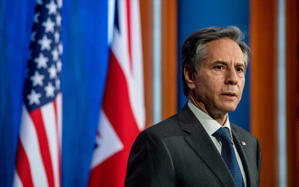kke的chania组织(μ-λ)邀请开放会议集体， 
 2月6日星期一晚上7点，城市组织和战斗机 在里面 
 Chania劳工中心旨在讨论动员 
 反对美国国务卿2月20日至21日 
 眨眼，在我国。 

 如今，美国帝国主义的代表幸存下来 
 犹太复国主义者以色列的压迫和屠杀 
 他祝福对伊朗的积极行动。 二十天后将再次进入 
 参观我们国家和土耳其的区域，并参与图3+1(Ελλάδας- Κύπρου- Ισραήλ + ΗΠΑ)。 

 他的访问旨在使政治人员在 
 选举以加强我们国家参与最危险的战争 
 在第二世界扩展之后，乌克兰和计划中 
 加强在地中海东南部的美国帝国主义的存在 
 和中东。 

 加强人民的友谊和团结是唯一的途径 
 他们阻止了不断增长的帝国主义者产生的拟人化 
 竞赛。 通过发送来阻止我们国家参与的要求 
 战争的武器，扩展和基础使用强度，需要 
 在代表访问的那天参加比赛 
 美国帝国主义在我国。 

 美国 - 北约 - 俄罗斯加剧了乌克兰的人为功能，反馈 
 判断力和导致战争和格式的比赛 
 一般冲突的条件。 只有人民的斗争才能堵塞他们 
 路。 让我们承担与我们相对应的责任，不要低估 
 已经存在的电阻的动力和能够产生的力量 
 人民为和平，生活和权利而奋斗。 

 _ Chancia 1-2-2023_

News Source: [https://www.kkeml.gr/χανια-σύσκεψη-για-διοργάνωση-αντιπολεμικής-αντιιμπεριαλιστικής-διαδήλωσης/](https://www.kkeml.gr/χανια-σύσκεψη-για-διοργάνωση-αντιπολεμικής-αντιιμπεριαλιστικής-διαδήλωσης/)

<!--NEWS-->

# 将对卡迪尔·卡拉巴克（Kadir Karabak）的情况做出解释，该情况被烧毁。

作者: kaypakkaya haber

时间: 2023-02-02T01:22:00

描述: 将在Partizan Partizan Kadir Karabak上尉的IHD伊斯坦布尔分公司举行新闻发布会。

图片: ['[aciklama-cagri-3.jpg](https://www.kaypakkayahaber.com/sites/default/files/styles/grid-34/public/aciklama-cagri-3.jpg)']

<!--METADATA-->

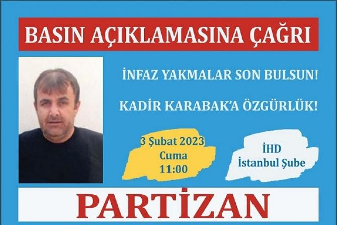Tekirdağf类型2监狱Partizan Kadir 
 卡拉巴克的疏散被第二次推迟。 

 监狱管理6.5和9年龄的女儿开展组织活动， 
 如果由于这种情况而发布了卡迪尔·卡拉巴克(Kadir Karabak) 
 他再次推迟了他的释放，理由是他将参加组织活动。 

 因此，卡迪尔·卡拉巴克的实际执行被烧毁了。 今天的情况 
 卡迪尔·卡拉巴克(Kadir Karabak)已经完成了他必须睡觉的时间。 

 明天的党派提请注意愉悦和非法情况 
 IHD伊斯坦布尔分支机构。 它将在11:00举行新闻发布会。 

 28

News Source: [https://www.kaypakkayahaber.com/haber/infazi-yakilan-tutsak-kadir-karabakin-durumuna-iliskin-aciklama-yapilacak](https://www.kaypakkayahaber.com/haber/infazi-yakilan-tutsak-kadir-karabakin-durumuna-iliskin-aciklama-yapilacak)

<!--NEWS-->

# tkp-ml tikko战斗机纪念党与革命的烈士

作者: kaypakkaya haber

时间: 2023-02-02T01:36:00

描述: 革命和共产主义的烈士是不朽的

图片: ['[tkpmltikko-678x381.png](https://www.kaypakkayahaber.com/sites/default/files/styles/grid-34/public/tkpmltikko-678x381.png)']

<!--METADATA-->

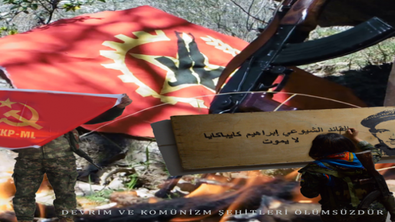TKP-MLTİKKO战斗机纪念党与革命的烈士。 纪念活动 
 党的烈士，尤其是为拯救人类而战的党烈士 
 一分钟的沉默，全力以赴和共产主义的烈士 
 开始。 

 首先，代表中东党委员会关于当天的意义和重要性 
 开场讲话。 _“在哪里保持理想和梦想 
 如果是的话，我们保证我们将继续。 更忠实 
 在开幕词称为“ _ TKP-ML中东派对”之后 
 代表发表了演讲。 代表“自1978年以来每年一月 
 我们在一个月的最后一周纪念烈士。 今天我们为此聚集在一起。 
 我们的烈士永远是自由，在斗争中，直到他们意识到这一点 
 他指出了坚持。 

 “我们同年也是我们聚会的创始人İbrahimKaypakkaya的创始人 
 这是TC法西斯主义谋杀同志50周年。 领导者 
 同志凯帕卡亚同志在同志同志50周年纪念日“估算，破裂和 
 在争取革命和共产主义的斗争中生活，战斗和战斗的新方式。 
 继续指导。 易卜拉欣·凯帕卡亚(Ibrahim Kaypakkaya)只有土耳其人民 
 这不是领导者。 他还是高加索和中东的领导者。 她 
 他的想法是最新的，这是真实的。 我们有这样的领导者 
 我们是领导者的继任者。” 

 最后，代表TKP-MLTİKKOGeneral Commands发表演讲。 这 
 在演讲中，提及世界上和国家的情况_ _ _“聚会和 
 从今天比以往任何时候都更需要领导者的过程。 
 我们经过。 工人，工人，在每个领域的压迫领导 
 打电话。 聚会和领导和我们的职责的责任 
 我们必须以它的重量行动。 我们必须保证。 我们的聚会，我们的烈士 
 他正在等待我们。 我们将为这项任务做好准备。 

 演讲后参加纪念活动的国际战士也很短 
 他发表了演讲。 国际战士说：“对革命的烈士的纪念是落后的 
 要了解，每个剩下的战斗机都会施加出色的责任和任务。 
 我们必须阅读每个最后一个单词作为我们的第一个开始。 革命 
 而不是我们的革命职责，而是坚持烈士的记忆 
 我们会带它。” 

 演讲之后，以对烈士承诺的承诺结束，纪念活动是 
 它以歌曲和歌曲从嘴里演唱。 

 60

News Source: [https://www.kaypakkayahaber.com/haber/tkp-ml-tikko-savascilari-parti-ve-devrim-sehitlerini-andi](https://www.kaypakkayahaber.com/haber/tkp-ml-tikko-savascilari-parti-ve-devrim-sehitlerini-andi)

<!--NEWS-->

# 2月2日，Stalingrad 80年的胜利

作者: Revolución Obrera

时间: 2023-02-02T07:52:39-05:00

图片: ['[grado.jpg](https://www.revolucionobrera.com/wp-content/uploads/2023/02/grado.jpg)']

标签: ['Batalla de Stalingrado', 'derrota del fascismo', 'fascismo', 'Hitler', 'Stalin', 'Stalingrado', 'Unión Soviética']

类别: ['Efemérides']

<!--METADATA-->

> Stalingrad标记了德国法西斯军队的暮色。 众所周知， 
 >斯大林格拉德灾难之后，德国人已经能够恢复 
 >更多。 斯大林 

 雷击战争的失败和失败导致了某个点 
 渴望希特勒人，因为这些开始失去优势 
 暂时赢得了令人惊讶和强烈的对国家的攻击 
 苏联 1942年上半年，希特勒高级司令部已经 
 他可以在整个前线发动一般的进攻，不得不选择 
 为了为一个伟大的夏季进攻选择一个目标，这样的目标 
 我了解高加索山的油田 
 在西南，为此目的，希特勒首先下令征服这座城市 
 斯大林格格勒巩固了北部的侧面。 法西斯主义者派遣了1,500,000 
 士兵，试图削减和征服 
 苏联军队的油，并提供自己的力量。 到 
 斯大林格勒纳粹军事高级司令部发出了他最好的将军， 
 将北非前线的飞机和坦克转移到其 
 更合格的鬣狗。 但是，希特勒军事高级司令部继续 
 梦想征服莫斯科。 与那个Stratpatagema法西斯主义一起玩 
 全部全部，并试图确保他的未来并避免在前面失败 
 东方。 Mao Tse-Tung将对Stalingrad的袭击描述为 
 进攻性“法西斯主义的存在依赖于此。” 

 布尔什维克共产党和军队的高命令 
 红色准备的意识形态，在组织和政治上，有一个计划 
 他们希望斯大林格拉德成为德国法西斯主义的墓。 
 在斯大林战线的新情况下，他说：«什么 
 那么，它是德国进攻的主要目标吗？ 它由 
 将莫斯科包裹在东方，将伏尔加河后部的首都隔离到后部的首都 
 和Urales，然后攻击它。 南部德国人的进步， 
 对于石油区，他不仅追求目标 
 占用这些的辅助机构，好像是分散了我们的大部分时间 
 预订并削弱了莫斯科阵线，以获取 
 通过攻击资本来取得成功。 确切地说，这解释了小组 
 现在的德国军队现在不在南部，而是 
 Orel和Stalingrad部门»。 与这些准则红军 
 他一直在与唐河一起折叠部队 
 阻止纳粹进步的目标。 

 阻止纳粹前进的计划是改变 
 巨大的海绵中的城市吸收和低音 
 在组织和集中的必要时间内可能有德国军队 
 秘密地是一支伟大的军队，然后有一个强者 
 反击环境，捕捉并歼灭所有VI德国军队。 这 
 该计划成功的关键是与城市斗争 
 群众支持的游击战争特征。 Chuikov，谁 
 对斯大林格拉德的光荣战斗的辩护，指挥了两个 
 战斗中的时刻：«它分为两个时期：防御效率： 
 1942年的7月至11月19日和1942年11月19日的进攻 
 截至1943年2月2日。这场战斗持续了六个半月。 在她的 
 超过200万人和大量参与了这两个部分 
 战争材料的数量»。 

 ####防御期 

 在防御时期，在附近发生了激烈的斗争 
 斯大林格拉德(Stalingrad 
 纳粹军队于1942年全面撰写过，纳粹陆军的埃尔·唐(El Don)地区 
 它被描绘成红军的勇气 
 Tenaz晋升为斯大林格拉德的德国前进。 在那一刻 
 共产党，在困难条件下，它详细组织 
 从城市创建特殊部队，拥有数千个最好的 
 激进分子，在短时间内，他们设法转变为军事堡垒 
 斯大林格勒。 著名的巴里卡达(Barricada)和十月工厂 
 发电厂，他们成为军事准备中心。 上千的 
 Obrero民兵组成了战斗部队，手镯和 
 步枪 布尔什维克革命和内战的退伍军人， 
 Aceries，铁路和造船厂工人， 
 准备 
 在红军旁边战斗。 周围的工厂，其他人 
 工人挖沟为他们辩护。 在前进期间
庄稼和挖沟靠在坦克上。 这座城市的成就 
 撤离河上500,000名居民中的大多数。 一种 
 伯戈历史学家因此描述了战es中的第一次战斗 
 斯大林格拉德(Stalingrad)周围：«一夜之间，俄罗斯民兵导致 
 制作了一个奇迹：它挖出了相互联系的强化位置，并吸收了 
 现代战争的基本要点。 现在，穿着您的工作服或 
 优雅的周日衣服，他们依arg在迫击炮后面 
 机枪挑战世界上最好的坦克大军。 当他 
 战斗小组[德国]克鲁宾在他们的炮兵障碍物之前错开了 
 俄罗斯人甚至开始了反击，由无绘画的T-34坦克执导， 
 直接从组装线»»。 

 德国法西斯主义者开始对Stalingrad发动空袭 
 将其减少到灰烬并弯曲的意图，德国轰炸机Stuka 
 他们袭击了许多运输平民并释放炸弹的船只 
 在预期转移的人群中间的分散。 力量 
 纳粹·艾里亚(NaziAérea)在城市上释放了数千枚炸弹，并纵火炸毁。 
 在最初的袭击中，成千上万的平民死亡。 成员 
 共产主义青年团体动员人口搜寻 
 在瓦砾中共同幸存者。 同时，坦克 
 纳粹士兵前往城市，梦见 
 苏维埃军队对河流并在那里击败了他们，这一切都在24个时期 
 小时。 

 斯大林格格拉德的抵抗是顽强的，在英勇的反空战中 
 苏维埃·奇科夫(Soviet Chuikov)告诉我们： 

 «他渴望尽快到达伏尔加河中 
 法西斯主义者没有停止斯大林格勒的空气爆炸或一分钟： 
 仅仅8月23日，法西斯航空才进行了两千名入侵。 这 
 反辩护士兵和苏联飞行员拒绝了一切 
 勇于纳粹航空的连续攻击。 在一天中，第23 
 8月，90架敌机撞倒了。 很少有情况 
 防空士兵不仅要战斗 
 飞机，也反对敌人的坦克和步兵，例如 
 它发生在莫斯科附近。(…)大多数反喷射和轻型大炮的船员 
 反射器是女性...她们很坚定，即使 
 炸弹在他们周围爆炸了，当似乎是不可能的 
 留在你的位置。 在火灾和烟中间，中间 
 炸弹爆炸，显然不论地球柱如何 
 他们跳入到处的空中，直到最后才牢固。 为了 
 那，尽管伤亡很大，但德国飞机总是偶然发现 
 一场集中大火，遭受了许多损失。 大炮降低了数十个 
 城市上方的德国飞机»。 

 9月1日，第一批法西斯坦克到达郊区。 
 该计划被激活，并计划开始街头斗争。 这 
 城市被瓦砾摧毁，废墟成为理想的土地 
 这阻碍了德国坦克的前进并有利于红军， 
 德国坦克变得容易，第一个到达 
 被废墟的建筑物的天花板摧毁。 Chuikov写道： 
 «我们分别摧毁步兵和穿透我们的坦克 
 线路：没有步兵，坦克不能做太多事情，这就是为什么 
 他们在遭受巨大损失后撤回...在反击中敌人 
 他总是遭受许多伤亡，不得不放弃袭击。 那我不得不 
 游览战线以寻找我们的防御措施的弱点，输了 
 时间和主动性...很多时候我们的目的不仅是为了造成他们 
 损失，但通过步兵惊喜攻击和坦克，并与 
 在我们的炮兵和飞机的帮助下，渗透到他们的位置，不高兴 
 他的阵型，打破了他的进攻并赢得了时间»。 

 在街头战斗中，楚科夫指示红军申请 
 _ABRAZAR敌人的策略，从同样的做法中理解 
 战斗得出结论：«我们意识到我们应该将其简化为 
 至少任何人的土地，如果可能的话，在手榴弹的距离处»。 这 
 苏联士兵试图对敌人接近敌人 
 防止法西斯空军可能轰炸苏联部队 
 前部及其战es的危险，而没有冒着德国士兵生命的危险。 在 
 释放的激烈的近战战斗，甚至 
 帕拉斯和手动工具有时成为武器，士气玫瑰 
 红军的勇敢，拒绝了希特勒人的道德。 “你的 
 道德无法忍受它。 他们没有足够的价值看
远方的高级位置，尤其是在晚上，因为 
 每隔五到十分钟就不断开枪一次。 
 加强他的道德。 这样我们士兵找到了那些 
 “ Guerreros”，他们安静地接近他们，并用子弹或 
 刺刀”。 在这种新情况下，法西斯军队开始 
 我戴出来，所有闪电战争的逻辑失去了寄托，chuikov 
 证词：«Urban War是一个特殊的战斗课。 事情没有 
 它们是通过武力解决的，但出于技巧，独创性和 
 速度...关键是小步兵部队和武器， 
 单个坦克»。 

 在瓦砾之间幸存的群众变得至关重要 
 支持红军，并提供有关职位的信息 
 敌人。 许多孤儿的孩子在废墟之间生存 
 场合变成了“军团的孩子”。 这些孩子是 
 他穿着，他们被喂了，并得到了军装。 这些与他们 
 微小的身体及其敏捷性可以跨越碎屑， 
 隐藏并从敌人那里收集信息。 AnatoliKúrishev是“儿子 
 参与帕夫洛夫之家的英雄防御的团 
 一小群士兵持续了58天，设法拒绝了所有攻击 
 敌人直到最后一口气。 AnatoliKúrishev回忆说：«房子有 
 比其在开放地点的位置非常重要的战略重要性 
 很难进入，士兵们在房子周围放地雷 
 阻碍了它的到来。 帕夫洛夫在他身边告诉我：看到 
 帮助Voronov，机枪，做他告诉您的事情»。 
 安纳托利(Anatoli)将子弹和手榴弹带给了捍卫房屋的士兵 
 他参加了在房屋地下室避难的平民。 

 这些小单位的许多士兵都有不同的国籍， 
 但是他们一直战斗到最后一口气，以捍卫这个伟大的社会主义国家。 
 «在其排名中，荣誉属于马里诺的Komsomol M. Panikaja 
 太平洋。 9月底，他和他的 
 193a分区的883°团，并与他的同伴一起防守 
 团埃尔·波布拉多·克拉斯尼·奥克蒂亚(El Poblado de Krasni Oktiab)。 当纳粹坦克时(¡cuántas
veces ya!)他们攻击了该团的职位，M。Panikaja发起了 
 他们瓶易燃液体。 碰巧他的一个瓶子是 
 被子弹交叉，发炎的液体立即包裹着他 
 呼叫。 像火炬一样燃烧，panikaja而不会失去宁静，从 
 沟渠，接近敌人的坦克，第二瓶 
 火。 这位年轻的英雄为了城市的防御而献出了生命 
 为了我们的公正事业和我们的大家园，伏尔加河的海岸»。 
 chuikov。 

 将螺母变成局势，使纳粹军队恶化， 
 共产党开始了一次“狙击运动” 
 62军的战士。 从那里出现苏联的英雄 
 VasiliZáitsev，以前在Kolomna和Young Shepherd市工作 
 在洛斯·乌拉莱斯(Los Urales)中，他深深地表达了他对 
 捍卫这座城市：“在伏尔加河之后，我们没有土地。” 迅速地 
 Záitsev成为所有法西斯士兵的恐惧 
 Stalingrad，在11月10日至12月17日期间 
 1942年，着迷225名法西斯士兵和军官，其中包括11名 
 狙击手 希特勒军事司令部从同一柏林转移到 
 他最好的射手-König指挥官，柏林学校校长 
 狙击手 -  Záitsev设法取消订阅最好的德国法西斯射手 
 在其军事书商中注册的决斗中。 `1` 

 9月24日，德国人控制着城市的大部分地区 
 以遭受许多伤亡的代价。 该地区的阻力继续 
 北部工业。 许多苏联的增援 
 伏尔加省另一侧的那些日子是来自地区的青少年 
 苏维埃亚洲边界，在战斗中被指示 
 Urban和他们被赋予了一份手册要战斗。 10月14日， 
 德国人发动了巨大的进攻，梦想成为最后一个。 
 他们从3000架飞机炸弹爆炸开始，然后进行三击 
 步兵师和两个坦克。 10月30日，第62军 
 苏维埃只控制着河沿河的三个小领土，但 
 无论如何，德国人无法击败他。 一名坦克官 
 德语写道：«我们已经战斗了15天，以征服一所房子 
 砂浆，手榴弹，机枪和刺刀。 第三天是54 
 地下室，着陆和楼梯的德国尸体。 正面是 
 烧毁的房间之间的走廊； 它是两层之间的屋顶。 这
火。 黄昏时有无穷无尽的战斗。 从地板到 
 另一个，脸上有汗水，我们用手榴弹互相攻击 
 在爆炸的中间，尘埃和烟雾...请他 
 任何士兵在这样的战斗中打击什么。 

 11月11日，德国人发动了他们的最后进攻。 
 他们不得不为每个仪表和每块砖而战。 第二天，第十二 
 十一月，他们卖光了。 

 ####进攻期 

 斯大林格勒战斗人员的努力和牺牲给了时间 
 秘密地将大约1,700,000的大军分组 
 男士。 希特勒高级司令部有点诱惑。 斯大林，一般 
 Vassilevsky和Zhúkov元帅分析了敌人的弱点 
 法西斯主义者并意识到他们忽略了侧面，他们 
 他们准备了Oración天王星计划，该计划由夹具操纵组成 
 围栏，完全掩盖和栓塞第六纳粹军队，模拟 
 雷电运动，也闯入德国后方 
 对于两个北侧和南侧的侧面，进攻希特勒部队 
 他们较弱。 

 1942年11月19日，苏联炮兵的强烈袭击 
 宣布了强烈进攻的开始。 从北方和南部的运动 
 Pinginge Invelope仅在5个中包围了3.3万纳粹士兵和军官 
 天。 这种进攻是在冬季中期进行的，所以技巧 
 红士兵的准备有助于确保篱笆。 

 希特勒对VI陆军冯·保洛斯军队的反应是 
 在派遣部队和供应时抵抗围栏 
 打破它。 希特勒在元帅的指挥下派出了一大批坦克 
 曼斯坦田地从礼物到打破篱笆，同时订购 
 纳粹空军提供保罗。 但是，红军举行 
 曼斯坦装甲师在激烈的战斗中。 小说 
 尤里·邦达里夫(Yuri Bondariev)燃烧的雪2`舞台 
 用有限的资源击败了装甲部门，离开后 
 在冬季，强迫整整几天。 空军的反应 
 纳粹由于苏联反协作部队提出的打击而无效。 
 大约在德国军队围起红军的压力，加上 
 疾病，饥饿和恶劣天气。 VI纳粹军队 
 德国一点一点地瓦解，最终于2月2日投降 
 1943年。保卢斯向剩下的VI军队投降了。 
 斯大林在分析斯大林的结果时 
 法西斯主义者说：«斯大林格拉德战役以一个 
 德国军队由30万人失败， 
 几乎有三分之一的围栏部队的监禁。 发生 
 关于历史上空前崩溃的比例的想法 
 它发生在Stalingrad领域，有必要知道之后 
 这场战斗的终止 
 147,200名德国士兵和军官以及46,700名士兵和 
 苏联军官。 斯大林格勒头晕目眩的法西斯军队的衰落 
 德语”。 `3` 

 这9.0万士兵使囚犯被迫工作 
 重建城市，然后派往强迫劳动领域。 的 
 这个数字只有6000名被修正主义者释放的人 
 克鲁什夫(Krushev)于1953年取消了苏联无产阶级的独裁统治之后。 
 多年后，克鲁舍夫(Krushev 
 当前的伏尔加格勒，按照其机会主义和救济利益 
 在所有帝国主义者中，因为斯大林格拉德是法西斯主义墓 
 德语。 

 #####注意： 

    
    
     1摘自VasiliZáitsev的报纸，网址为[http://revolucioncultural-p.blogspot.com/2012/05/derrota-delrota-del-nazi-fascismo-un-heroe-heroe-heroe-para.html 
    
     2 yuri bondariev https://drive.google.com/file/d/0bw5zm10cq88hzdk5ytdiymytmdnimc00ztk1lwiwiwiwzmetjqxytnlzjqxytnlzjexmmmwy3/view？(http://revolucioncultural-p.blogspot.com/2012/05/derrota-del-nazi-fascismo-un-heroe-para.html  
    
    2 Nieve Ardiente de Yuri Bondariev https://drive.google.com/file/d/0Bw5Zm10Cq88HZDk5YTdiYmYtMDNiMC00ZTk1LWIwZmEtYjQxYTNlZjExMWY3/view?authkey=CPKe5pkE&hl=en)斯大林大帕特里亚战争中的3次演讲

News Source: [https://www.revolucionobrera.com/efemerides/stalingrado/](https://www.revolucionobrera.com/efemerides/stalingrado/)

<!--NEWS-->

# PC 2月2日：从下周四开始恢复工人培训：“帝国主义战争与无产阶级人”

作者: fannyhill

时间: 2023-02-02T08:17:00+01:00

图片: ['[download.jpg](https://blogger.googleusercontent.com/img/b/R29vZ2xl/AVvXsEgUuNhYH5V2UQQrskvEbwuQc15769JTd2XWydP3gNZ9v_9Jp-lHA7nF0f-5ueIZ1KOwBhkwtZY6cn_fr892BZq5XW0W4pwgWdTrDwWbEqI3iFb_guuhoX_7Gj7MOFJzON09wGuQc0RrU7mlkV_JfdTviNQn2lT7wbiMqee9c5_k0Wm-XHPw-gx5-uXbYA/w254-h320/download.jpg)']

<!--METADATA-->

[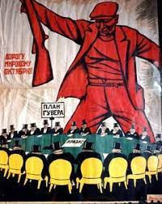](https://blogger.googleusercontent.com/img/b/R29vZ2xl/AVvXsEgUuNhYH5V2UQQrskvEbwuQc15769JTd2XWydP3gNZ9v_9Jp-
lHA7nF0f-5ueIZ1KOwBhkwtZY6cn_fr892BZq5XW0W4pwgWdTrDwWbEqI3iFb_guuhoX_7Gj7MOFJzON09wGuQc0RrU7mlkV_JfdTviNQn2lT7wbiMqee9c5_k0Wm-
XHPw-gx5-uXbYA/s252/download.jpg)这个新的在线工人培训周期将致力于成立 
 关于帝国主义战争主题以及如何战斗的无产阶级前卫 -  
 反对。 

 在实际层面上，共产主义无产阶级发展了一项工人动议，该动议 
 总结现在的必要位置，该位置已受到签名e 
 在某些工厂的批准中批准工人并在集会中报告 
 反对战争的示威。 

 我们认为，今天这是一级的主要任务 
 工人阶级和斗争中的无产阶级人士，以其前进的基础 
 高级行动，反对正在进行的帝国主义战争的组织 
 乌克兰埃普中心可以进一步发展，并导致第三个 
 世界大战。 

 正是由于这个原因，必须了解必须了解的位置是什么 
 在这种情况下指导工人阶级的行动。 

 **在第一个周期中，我们将使用列宁的著作，我们将恢复步骤 
 他们和我们将纪念他们。** 

 每个人的无产阶级，单独或集体都可以而且必须 
 以最敬业的形式参与此周期 
 干预措施，问题，行动提案，因为明确此培训 
 理论是为实践服务或与之无可链接的。 

 **该工作培训将在每个星期四在此博客上与 
 口头和书面展览以及干预措施都可以 
 那个写的。**

News Source: [https://proletaricomunisti.blogspot.com/2023/02/pc-2-febbraio-riprende-la-formazione.html](https://proletaricomunisti.blogspot.com/2023/02/pc-2-febbraio-riprende-la-formazione.html)

<!--NEWS-->

# 共产主义无产阶级/PCM意大利-Live Stalingrado！ 毛在斯廷格拉多

作者: maoistroad

描述: PC 2月2日-Viva stalingrado-斯大林拉多的含义 
 莫特·唐（Maotse Tung

时间: 2023-02-02T11:39:00-08:00

图片: []

<!--METADATA-->

### [PC 2月2日-Viva Stalingrado- Stalingrado的含义 
 莫斯的话 
 钨](https://proletaricomunisti.blogspot.com/2023/02/pc-2-febbraio-viva-
stalingrado-il.html)“ **斯大林拉多，** \  - 甚至在最后胜利之前写了毛 -  
 **红军战士制造了一家英勇的企业， 
 它将影响所有人类的命运。 他们是革命的孩子 
 十月。 十月革命的旗帜是无敌的，所有人都 
 法西斯力量被谴责灭亡。” **(Mao, Opere scelte, vol. III,
p.109, Ed. in lingue estere di Pechino)

News Source: [https://maoistroad.blogspot.com/2023/02/proletari-comunistipcm-italy-long-live.html](https://maoistroad.blogspot.com/2023/02/proletari-comunistipcm-italy-long-live.html)

<!--NEWS-->

# PC 2月2日 - 贝雷塔武器行业的创纪录利润...

作者: prolcompal

时间: 2023-02-02T14:05:00+01:00

图片: ['[beretta%20record.jpg](https://blogger.googleusercontent.com/img/b/R29vZ2xl/AVvXsEg0GW6NVf-rO0FXlZm7ijRII6c5eDRBqPoyI50Xc4ozxh6NDhsboddFmCa8JxzVmDCTAKYVdOTDNJrevc-4FTvFI2dfX6fd50jxjHdALUv9elhkY2-wwhenAjfzbRXKXNxesGpgx1afhV4VKAw0ld9aBADLKKkVSUlekATpIrqxdPT4MSmKSq-h3OrnTA/w565-h440/beretta%20record.jpg)']

<!--METADATA-->

只是确认那些在战争中获利的人 

 在意大利，危机没有触及这个部门，因为 
 Sole24ore ... **尽管能源成本增加了**” 
 数百万到9.5，其中7.5在电力上“ ... **他们有多少帮助(tra i tanti
altri infiniti aiuti)伟大的大师政府奖金？** 

 ** 
 **

News Source: [https://proletaricomunisti.blogspot.com/2023/02/pc-2-febbraio-profitti-record-per.html](https://proletaricomunisti.blogspot.com/2023/02/pc-2-febbraio-profitti-record-per.html)

<!--NEWS-->

# 要发现卡。 贝雷塔工人在艰苦的工作条件和使用合同（作弊）试图默默消除他们的公司的计划中挣扎

作者: Gorria

描述: 恢复4.5处理线和岛屿的控制。 对于单位 
 贝雷塔（Beretta）的所有工人都划分了不稳定的合同。 这 ...

时间: 2023-02-02T14:24:00+01:00

图片: ['[AVvXsEgTAd1AbSXgBno-Brpu0v6XZn9-3y6CEkwi_KQwgWWgzI0Rsy9Q0RPcJoEjdV4ZVwGf_HCT3Qp27xeCg-9kWTL41abFMuLtBX53k3K0wxmaxeqhAn1ube6at5CXeij5RVQLqqxHEVRuxxsTr77s11L4bKDZ8diMlHQkrdyBjegkpToASyqJz5rw9KXlQA=w534-h401](https://blogger.googleusercontent.com/img/a/AVvXsEgTAd1AbSXgBno-Brpu0v6XZn9-3y6CEkwi_KQwgWWgzI0Rsy9Q0RPcJoEjdV4ZVwGf_HCT3Qp27xeCg-9kWTL41abFMuLtBX53k3K0wxmaxeqhAn1ube6at5CXeij5RVQLqqxHEVRuxxsTr77s11L4bKDZ8diMlHQkrdyBjegkpToASyqJz5rw9KXlQA=w534-h401)', '[AVvXsEg6yP5Ks3DTePYiJG80CibHaULhjfERNn6u8Oup9Io58OlQuByQGqLG1CHayK4DrRvXsrAkV_M6rPm3uulf9MywmXBifQwUeyUDw31mejY-kHaxI1W0B8xoHYj2uiswSkDH2gwz9QhR-kSElUlfRAVJHRb5FTFp0ybKXF36Fpg0pAL1XtIIywvzdEhNhA=w640-h552](https://blogger.googleusercontent.com/img/a/AVvXsEg6yP5Ks3DTePYiJG80CibHaULhjfERNn6u8Oup9Io58OlQuByQGqLG1CHayK4DrRvXsrAkV_M6rPm3uulf9MywmXBifQwUeyUDw31mejY-kHaxI1W0B8xoHYj2uiswSkDH2gwz9QhR-kSElUlfRAVJHRb5FTFp0ybKXF36Fpg0pAL1XtIIywvzdEhNhA=w640-h552)', '[AVvXsEjJgyC4MmHsOUub8FmXAmRuslv6ydY8sBC_C0kZrP4KRG7dnY6LfJjBae0rGe1WITGKMca829qHxNpaqVhrQ--Vt6SunH8SS9YJC2W8QEXdhjOb2w3W38MEDJP9eqSzMATiU_4wMyXpPuQNNAVuM3zH-OwuIjnXJbWAS7JtRCIPcx8lzpIDYJp0Ei6UXA=w320-h307](https://blogger.googleusercontent.com/img/a/AVvXsEjJgyC4MmHsOUub8FmXAmRuslv6ydY8sBC_C0kZrP4KRG7dnY6LfJjBae0rGe1WITGKMca829qHxNpaqVhrQ--Vt6SunH8SS9YJC2W8QEXdhjOb2w3W38MEDJP9eqSzMATiU_4wMyXpPuQNNAVuM3zH-OwuIjnXJbWAS7JtRCIPcx8lzpIDYJp0Ei6UXA=w320-h307)', '[AVvXsEgn2HOLHZ3z5WOAfqCIRWp1Cm8t9Ztm5uQNnosKc9D7O-RlZ5H9XywR6halmgbYNb4ETb_JcV-FYPt3Q4B1qOGSJ2MLpqjWviiP6RyLxUaX9QGl_1odIdpsELdmKMAilqKv5RP1Klgpgd6Bf4XHq4J_zHGOcmmO9WrYF3BF4VVE_3wI7sXSz6I11SmhhQ=w198-h400](https://blogger.googleusercontent.com/img/a/AVvXsEgn2HOLHZ3z5WOAfqCIRWp1Cm8t9Ztm5uQNnosKc9D7O-RlZ5H9XywR6halmgbYNb4ETb_JcV-FYPt3Q4B1qOGSJ2MLpqjWviiP6RyLxUaX9QGl_1odIdpsELdmKMAilqKv5RP1Klgpgd6Bf4XHq4J_zHGOcmmO9WrYF3BF4VVE_3wI7sXSz6I11SmhhQ=w198-h400)', '[AVvXsEiCNYET8wXYYH5LhVQikVjG7xy7IgTszAX9gfy6BUfsyGmciZGPZsUoDVIqsLxHf3ixcJRKwLiYrsVqOpAuQnhYLAZKBGJYOj0w0W8F-0ELmaeEJujivGiqSaKJJ_IL6hy4_wNzOmVXtxdvEHxUlcQE9J6SXytFbCw0U0GfNd8kB4wnrAdXxuoo5Tr4zg=w180-h400](https://blogger.googleusercontent.com/img/a/AVvXsEiCNYET8wXYYH5LhVQikVjG7xy7IgTszAX9gfy6BUfsyGmciZGPZsUoDVIqsLxHf3ixcJRKwLiYrsVqOpAuQnhYLAZKBGJYOj0w0W8F-0ELmaeEJujivGiqSaKJJ_IL6hy4_wNzOmVXtxdvEHxUlcQE9J6SXytFbCw0U0GfNd8kB4wnrAdXxuoo5Tr4zg=w180-h400)', '[AVvXsEgjyxtTs3BXxPzDXevg_5zuZjEHnX5LtvhhMs8iz51PrrWisMfTesyQ2fAx8nXp20xjf9BaRRrhwgYtZyJveO60rTp8XlSlH0WpXukoPtGxjS8HgaTfrQrBnxogtO74IrOiG3aTLyl3I8_LsoSzBR-5G1gaA_n6RpP9BXko5Pna7lXh2ahIHhNfru30Jw=w400-h300](https://blogger.googleusercontent.com/img/a/AVvXsEgjyxtTs3BXxPzDXevg_5zuZjEHnX5LtvhhMs8iz51PrrWisMfTesyQ2fAx8nXp20xjf9BaRRrhwgYtZyJveO60rTp8XlSlH0WpXukoPtGxjS8HgaTfrQrBnxogtO74IrOiG3aTLyl3I8_LsoSzBR-5G1gaA_n6RpP9BXko5Pna7lXh2ahIHhNfru30Jw=w400-h300)', '[AVvXsEgFK-EEbecBFyc1hQ8jRHJGIqt-YbL_GQl3HWMR9Vlwj6RRMmptbsLxETFJrL0gq051BuUeHeJYRwsPTYHNxBWwMMywLs9Q3bwiqk_PYij3bRbafMHZHXzte47v5Bns5ocFFr6fEMekpD7xVaLFHojuLkWTHnJXzIfttD5v1l0ig_Jy6QjH2sM6g45qWA=w400-h225](https://blogger.googleusercontent.com/img/a/AVvXsEgFK-EEbecBFyc1hQ8jRHJGIqt-YbL_GQl3HWMR9Vlwj6RRMmptbsLxETFJrL0gq051BuUeHeJYRwsPTYHNxBWwMMywLs9Q3bwiqk_PYij3bRbafMHZHXzte47v5Bns5ocFFr6fEMekpD7xVaLFHojuLkWTHnJXzIfttD5v1l0ig_Jy6QjH2sM6g45qWA=w400-h225)', '[AVvXsEggJ-ZPhIYbmoigBkDoQsM9VbR9obslYCcgS3ABPfZzH7t0hMcbpwl1AIPoldse2n8km9JEr3iHoT3tDirjMMbiKnpgFEAyrCQ6cUWtend7c-BsgHhhTLDBGrCeAQHNU4MIMVLlSuIgRGKSySBYgZY15jwXjSttpK6aI6JD2nCzvRGQwVY7U7eJsPv3Sg](https://blogger.googleusercontent.com/img/a/AVvXsEggJ-ZPhIYbmoigBkDoQsM9VbR9obslYCcgS3ABPfZzH7t0hMcbpwl1AIPoldse2n8km9JEr3iHoT3tDirjMMbiKnpgFEAyrCQ6cUWtend7c-BsgHhhTLDBGrCeAQHNU4MIMVLlSuIgRGKSySBYgZY15jwXjSttpK6aI6JD2nCzvRGQwVY7U7eJsPv3Sg)', '[AVvXsEiaCna2cOfjz6yyNZp5efH-NRA1-LfHDwOSGALqGh-V9Co8AIVIeVrOsCSi6mD4CoJJGRbQ5SO1qs1YV1GJIb9WYrrfpKlefp2R20W7Wz0Hwtgq1E7mQhBHcxAGyyjbwMC7o1jWHik_bsME8_ODlKKHgUgVTZ1IP7klOhWD6wHTTvkHvjsy9fEfUffuWg=w493-h640](https://blogger.googleusercontent.com/img/a/AVvXsEiaCna2cOfjz6yyNZp5efH-NRA1-LfHDwOSGALqGh-V9Co8AIVIeVrOsCSi6mD4CoJJGRbQ5SO1qs1YV1GJIb9WYrrfpKlefp2R20W7Wz0Hwtgq1E7mQhBHcxAGyyjbwMC7o1jWHik_bsME8_ODlKKHgUgVTZ1IP7klOhWD6wHTTvkHvjsy9fEfUffuWg=w493-h640)']

<!--METADATA-->

**** 

 ** ** 

 ** 
 恢复4.5处理线和岛屿的控制。 对于单位 
 贝雷塔(Beretta)的所有工人都划分不稳定的合同。** 

 工人在贝雷塔(Beretta)的合同中的斗争看着所有工人和 
 到他们的状况。 从卫生和工作场所的辩护 
 工厂，与其他战斗的现实团结一致 
 2月18日在罗马举行的国民议会。 

 [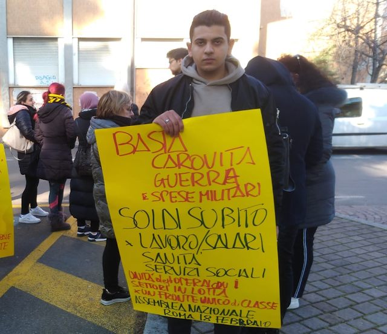](https://blogger.googleusercontent.com/img/a/AVvXsEg6yP5Ks3DTePYiJG80CibHaULhjfERNn6u8Oup9Io58OlQuByQGqLG1CHayK4DrRvXsrAkV_M6rPm3uulf9MywmXBifQwUeyUDw31mejY-
kHaxI1W0B8xoHYj2uiswSkDH2gwz9QhR-
kSElUlfRAVJHRb5FTFp0ybKXF36Fpg0pAL1XtIIywvzdEhNhA=s640)从防御健康开始。 罢工工人有 
 谴责'** ba ** **架，我们不能再整天奔跑， 
 冷，** **，所以我们只打破后背**'当他们出来时 
 有关事故和疾病的强劲增加的新数据数据 
 专业的。 

 并反对由歧视行为制成的工厂镇压 
 傲慢，反工会，就像12月份给予的50欧元一样，仅满足 
 给尚未罢工的工人，或在双重负载上杠杆 
 工厂的工人和母亲以身作则为孩子提供帮助 
 真正的报复是由关税和时间变化做出的 
 突然和个性化，使不舒服的工人陷入困境， 
 迫使他们与保姆一起致命跳跃。 当然还有 
 阻碍罢工的尝试失败了，该罢工在坚定的面前解决了 
 工人沮丧 

 邮政(cancellato all'arrivo delle risposte)：'他们是10个逃脱的家'。 不 
 我只是不认为他们逃离房子，他们有全棕色的工作 
 在这些条件下。 

  

 罢工显示了MPM 31.5.22的新合同(denunciato anche con un esposto)急于进行公开调查 
 -22-从Guardia di Finanza'反对非法使用 
 Beretta Delle合作社始终拥有人力 
 可用和薪水不足，明确定义为 
 工人的外墙和商业操作； 如何下载 
 所有责任合作社； 好像要取消事实，我 
 剥削不稳定工作和合同不足的结果， 
 在令人作呕的CCNL MultiServizi中，增加了贝雷塔的利润。 

 随着UIL的签署，不断变化的合同没有透明度 
 以及Slai Cobas SC要求的担保 
 处理实际上传递给了MPM。 

 因此，合同成为特洛伊木马，以一一删除线条 
 对于用Slai Cobas Sc在工厂挣扎的工人来说。 
 他们设法更多，以保持工厂的节奏。 最近几周他们是
多年来一直担任这些职位的MPM工人。 用于的合同 
 击中“在这个主题下”工人。 

 罢工有一个参与性和自我管理的工人 
 新闻发布会，大量在特雷佐的ATS总部前面 
 今天的米兰记者，当天的米兰(Gazzetta Della Martesana) 
 以及Popolare广播电台和一些独立的人，他们对世界进行调查 
 工作，所有人都参与了工人的主角 
 从几个声音开始，互相告诉，说得足够多。 

 与迄今为止发生的事情不同，工人被消费 
 贝雷塔处理线，推出或离开 
 沉默，也许工会主义者建议接受 
 公司的和解，是不可避免的。 

 1月31日，360°动员的一部分，如前所述 
 在最后一个组装中，与罢工一起使用，所有可用的手段 
 工人。 

  

 [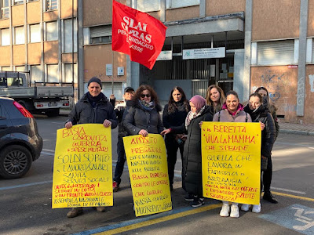](https://blogger.googleusercontent.com/img/a/AVvXsEgjyxtTs3BXxPzDXevg_5zuZjEHnX5LtvhhMs8iz51PrrWisMfTesyQ2fAx8nXp20xjf9BaRRrhwgYtZyJveO60rTp8XlSlH0WpXukoPtGxjS8HgaTfrQrBnxogtO74IrOiG3aTLyl3I8_LsoSzBR-5G1gaA_n6RpP9BXko5Pna7lXh2ahIHhNfru30Jw)[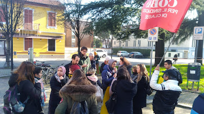](https://blogger.googleusercontent.com/img/a/AVvXsEgFK-
EEbecBFyc1hQ8jRHJGIqt-
YbL_GQl3HWMR9Vlwj6RRMmptbsLxETFJrL0gq051BuUeHeJYRwsPTYHNxBWwMMywLs9Q3bwiqk_PYij3bRbafMHZHXzte47v5Bns5ocFFr6fEMekpD7xVaLFHojuLkWTHnJXzIfttD5v1l0ig_Jy6QjH2sM6g45qWA)--- 
  **新闻发布会和罢工的新闻审查** 
  
  
 [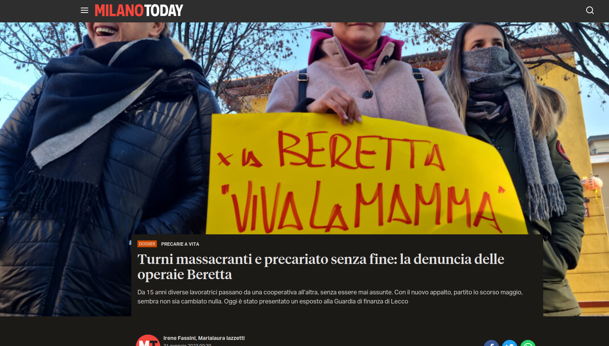](https://blogger.googleusercontent.com/img/a/AVvXsEggJ-
ZPhIYbmoigBkDoQsM9VbR9obslYCcgS3ABPfZzH7t0hMcbpwl1AIPoldse2n8km9JEr3iHoT3tDirjMMbiKnpgFEAyrCQ6cUWtend7c-BsgHhhTLDBGrCeAQHNU4MIMVLlSuIgRGKSySBYgZY15jwXjSttpK6aI6JD2nCzvRGQwVY7U7eJsPv3Sg)<https://www.milantaday.it/dossier/economia/precariato-opeia-popeia-beretta-- 
 unions.html？referrer = premium-checkout> 

  <https://primalamartesana.it/tuintlita/lavorattori-della-salumi-beretta-di-- 
 trezzo-sulladda-in-sciopero-the-picchetto-davanti-allats/> 

  <https://radioactiva.noblogs.org/files/2023/02/ 
 beretta.mp3> 

 

News Source: [https://femminismorivoluzionario.blogspot.com/2023/02/a-carte-scoperte-le-operaie-alla.html](https://femminismorivoluzionario.blogspot.com/2023/02/a-carte-scoperte-le-operaie-alla.html)

<!--NEWS-->

# 危险信号：PCP基地利马：揭露对秘鲁和其他拉丁美洲国家的洋基帝国主义计划

作者: Verein der Neuen Demokratie

描述: 所有国家的无产阶级人，团结！ 揭露帝国主义计划 
 洋基对秘鲁和其他拉丁美洲国家 /地区

时间: 2023-02-02T15:46:00+01:00

图片: []

<!--METADATA-->

所有国家的无产阶级人，团结!

  
  **揭露洋基帝国主义对秘鲁和其他国家的计划 
 拉美** 

  
 在帝国主义一般危机的背景下，主要是 
 急性和深厚的经济危机。 这场危机再次 
 基本矛盾和主要矛盾(imperialismo-naciones oprimidas)无与伦比的客观条件，以增强 
 民族解放和由 
 毛主义和大众战争取得了伟大而战略性的胜利 
 国际共产党联盟PASO的构象和下一个统一 
 在未来的共产主义国际指挥下的决定性和先验 
 毛主义。 

  
 我们向国际无产阶级表达热心的共产主义问候 
 共产党，运动和组织， 
 我们重申了全能的科学和普遍意识形态 
 马克思列宁主义主要是毛主义，以及决定性的贡献和 
 冈萨洛总统的普遍总部我们的总部将其定义为 
 第三，马克思主义的新阶段和上层阶段，并巧妙地将其应用于 
 秘鲁革命果断地促进了新的发展 
 马克思主义。 

  
 在国际一级，帝国主义矛盾 
 洋基帝国主义的一面是独特的霸权超级大国， 
 衰落，他的财务寡头由购买资产阶级指挥 
 被称为“新自由主义全球化”正在严重危机和不断增长 
 充满黑色视角的通货膨胀和巨大的衰退，每次适用 
 更多的保护主义使他们的斗争加强，诉诸法西斯主义，风险 
 “内战”和“分离主义”或“国家的自治”，其计划 
 保持您独特的霸权状况的战略性，它们是tumbo 
 Tumbo，危机危机，越来越基于战争勒索和 
 原子在被压迫国家恐吓或产生恐惧； 战争 
 侵略和猎物(OTAN en medio oriente y ahora en Europa del Este)赞助 
 并根据其利益促进“恐怖主义”。 

  
 另一方面，俄罗斯原子超级大国一直在恢复职位， 
 他们与社会中国帝国主义一起制定了计划 
 破坏，防止和对比洋基霸权计划的战略性 
 在其领域合并并扩大其影响力领域 
 亚洲案，非洲和拉丁美洲(considerar que Rusia y China mantienen
influencia y se coluden en regímenes comandados por la burguesía burocrática
pero pugnan para abarcar con mayor amplitud en base a sus propios intereses)。 

  
 在拉丁美洲，洋基帝国主义的基地，其霸权计划 
 地区正在破坏，俄罗斯超级大国的渗透 
 影响和政治支持政权的派系 
 官僚机构指挥官僚主义的土地所有者案件； 古巴， 
 委内瑞拉，尼加拉瓜，玻利维亚等 同时社会帝国主义 
 中国人(quien sueña ser superpotencia mundial en el presente siglo)及其 
 全球霸权计划一直在执行一系列计划和项目 
 从这个意义上讲，例如“ So称为新的丝绸路线”，从那里开始 
 它在该地区的能源上推出的可振奋性(hidrocarburos, minería, litio, gran pesca, reservas de agua, etc)在下面 
 经济和商业关系的斗篷。 让我们看一下我们国家的情况： 
 64％的秘鲁出口贡献了10％ 
 秘鲁来自GDP，是铜和锌的第二世界生产商，第三个生产商 
 拉丁美洲的银和锡生产商，我们是第一个 
 锌生产商锡，铅和硒，尽管事实上只有1.07％ 
 秘鲁地区是开采剥削，0.28％为 
 探索，即超过98％，它将视为处女区 
 剥削，我们补充说，铜和银的生产是 
 国家对于能源过渡过程是必需的(la sociedad
nacional de minería, petróleo y energía asume que el 16% de la inversión
privada está en la minería)。 洋基及其盟友的蛋糕怎么样 
 他们希望他们一个人，但是他们踏上了俄罗斯超级大国的高跟鞋 
 和中国的社会质感!我们是战利品的一部分，我们不能同意 
 让我们以流行的战争来捍卫祖国!

  
 该地区的急性和强烈的临时主义矛盾会影响 
 剥削阶层的怀抱主要是大资产阶级 
 他的两个派系(burguesía compradora y burguesía burocrática)我们也看到 
 阿根廷，玻利维亚，智利，巴西等案件。
1992年9月建立了政治时期 
 鉴于民主革命的日益增长和更大的干预 
 主要是洋基帝国主义，目的是指定他们的 
 反历史三个反革命任务：重新冲突资本主义 
 官僚主义，重组古老的秘鲁国家，但主要是 
 梦想歼灭流行战争。 

  
 冈萨洛总统具有伟大的政治愿景，明确的毛主义愿景 
 干净的蜘蛛网起诉我们以许多历史意义思考 
 秘鲁的历史，让我们看看过去三个世纪 
 定义。 18世纪：西班牙的领域，这使我们陷入了深层危机， 
 后果秘鲁分裂了。 

  
 19世纪：在与法国的比赛中，英格兰的领域？ 与战争 
 辣椒。 它导致我们陷入了深刻的危机。 我们失去了领土和我们的 
 国土遭受了分裂。 

  
 20世纪：我们有一个统治者洋基帝国主义主要是 
 带了我们吗？ 秘鲁人民整个历史上最严重的危机。 

  
 自1980年以来，随着大众战争的开始和发展，秘鲁社会 
 当代人进入了他的第三阶段的一般危机和 
 他主要进入了三个伟大的毁灭和边界 
 利用和压迫人民的山脉； 帝国主义，资本主义 
 官僚和半伪造。 

  
 在大众战争发展之前并达到平衡 
 战略是大众战争的第二个政治和军事阶段， 
 1991年主要是洋基帝国主义和反应。 
 系统并恢复国家的国防和保障职位 
 官僚土地所有者给了1992年4月5日的Autogolpe(desarrollo de la estrategia contrasubversiva yanqui: desarrollo de la guerra
de baja intensidad)强加法西斯，种族灭绝和仇恨政权 
 Proyanqui已有数十年的长期计划。 

  
 1993年，作为其第四个重组的一部分，他们准备了(en medio de
genocidio)并批准制定的政治宪法来衡量和 
 帝国主义的利益的功能主要是洋基。 

  
 该政权的这种Projequi宪法和脊柱 
 法西斯主义者，种族灭绝和vendatria提出了这种隐藏和血腥的 
 构成构造资本主义的革命 
 官僚主义虽然从字面上宣布为“ 
 Mercado”在背景中，他们应用了“自由市场”经济 
 全国生产并给予 
 帝国主义的行业，这种称为“新自由主义”，赞成更大的 
 主要是帝国主义的渗透和领域(art 62 o contratos ley como
ejemplo)，这个reimpulso不仅可以重组他的设备 
 以总统专制主义为特征的国家(camarilla
fascista)由洋基大使馆数字化。 重新冲突和重组不是 
 可能但输入以消灭流行的战争 
 93人的宪法促进并合法化了最大的交付和更大的权力 
 FF.AA和法西斯和种族灭绝PNP的能力 
 低强度战争相反。 

  
 冈萨洛总统在“关于政变的评论”文件中 
 他教我们区分国家系统，并告诉我们 
 清楚地表明，这是一个伟大资产阶级的阶级独裁统治 
 帝国主义服务的土地所有者主要是洋基和 
 政府系统(bajo su forma de democracia representativa)这些 
 他们在开放和秘密的独裁统治下进行了区别。 

  
 到藤莫里和蒙特西诺斯的法西斯主义和种族灭绝集团的沦陷 
 2000年主要是洋基帝国主义，我等于其过渡政府(Paniagua)在CIA -OA的主持下，尽管它是升高的 
 正式改变其破烂的宪法和伟大的部门 
 资产阶级和机会主义赞扬了愤怒，经济章节从未 
 他们提出了疑问。 

  
 在霸权和指导下，法西斯，种族灭绝和vendria政权 
 在当今21世纪的数十年中，购买资产阶级 
 强调了半伪装角色(megalatinfundios a costa del despojo de la
tierra del campesinado principalmente pobre y semicolonial )(mayor injerencia,
intervención y dominio imperialista principalmente yanqui)它在哪里发展 
 Rotrefacto的官僚资本主义，以及FTA的签名 
 托莱多的美国及其用血液和火的实施，有超过120个法令 
 立法与艾伦·加西亚(AlanGarcía)的种族灭绝，然后是卡洛斯上尉或 
 Ollanta Humala。 

  
 这个在旧且过期的秘鲁国家的洋基帝国主义领域是 
 由于俄罗斯帝国主义和 
 特别是对于中国社会质感主义，这有很大的影响

tendencias demoliberal y fascista)但主要影响和力量 
 与大众战争的锻造是人们所拥有的唯一道路 
 人民的民主是一条流行的解放之路，那就是 
 我们今天经历的情况很明显，即 
 由无产阶级组织，我们的秘鲁共产党指示和 
 将指导直到征服无产阶级的权力和 
 秘鲁人，还有另一种方式吗？ 这就是为什么我们说流行战争直到 
 共产主义!

  
 自2016年以来，趋势之间的购买派别的斗争 
 法西斯主义者(keiko Fujimori)和拆卸的趋势(PPK)控制 
 法西斯主义，种族灭绝政权和Salepatria Proyanqui的执行人员变得更糟， 
 资产阶级议会的控制权正在破坏 
 执行人员，质疑该政权的传统中的本质： 
 总统主义专制主义，同时我正在夺走其他权力， 
 旧状态的机构，如在控制之前所示 
 与：司法部门，公共部，宪法法院， 
 ETC 遵循此反动路径，因为那是真实的 
 与它们相对应的反动和反趋化路径， 
 他们有另一种方式吗？ 好吧，他们没有，这是他们唯一的出路，继续 
 法西斯主义者，种族灭绝政权和Venpatria Proyanqui，我们在此看到它 
 现在和清晰的世纪再次确认 
 冈萨罗总统。 

  
 目前，他们将法西斯主义，种族灭绝和卖方制度进行 
 永久政治危机(05 presidente en 05 años)受危机的影响 
 国际经济和金融(2018 y 2019)并为严重的危机 
 官僚主义的资本主义不给予更多，并且试图掩盖和 
 推迟其“紧急状态和健康军事化” 
 斗争狂欢(Covid - 19)在侮辱中 
 伟大的无耻腐败以牺牲死亡和生命为代价 
 镇。 高管在FF.AA和警察的集团旁边 
 种族灭绝，垄断药品和私人诊所 
 伟大的命运证明了公共卫生系统崩溃 
 它为人口服务，放弃了几个世纪，以牺牲健康为代价 
 生命，饥饿，痛苦和营养不良，导致死亡超过 
 2万人。 世界上最高的指数。 毁灭力量 
 生产力(eliminar el excedente poblacional)种族灭绝和险恶计划 
 这个法西斯政权和帝国主义的霸权计划 
 主要是洋基。 

  
 正是在这种危机和法西斯主义，种族灭绝政权和衰落的背景下 
 叛徒(dentro del tercer momento de crisis general y destrucción de la
sociedad peruana contemporánea)召集了大选 
 2021年，帝国主义和功能反应的关键选举 
 继续遵守其三个反革命任务，但 
 特别是对于法西斯主义倾向(fujimorismo)派系 
 不惜一切代价的买家需要全州控制 
 主要来自高管。 

  
 The 2021 is elected the Rondero and Anticomunista of Pedro Castillo, a 
 机会主义者可以参加Rabe和Faiender和捍卫者的兴趣 
 官僚资产阶级(Perú libre procastrista, feudillo de la familia
cerrón)在修正主义者和机会主义者的审查的支持下 
 特别是来自Movadef和Vraem的，那个机会主义的路线 
 雷妮戈和阿尔斯特郡的左派，他们无耻的梦想 
 大赦，投降和入伍并没有阻止他们离开辩护 
 在扬基帝国主义的任务的人中 
 执行者(Castillo Terrones - Anibal Torres y otros con la venia de la CIA)维萨尼和毛茸茸的计划杀死冈萨罗总统荣誉y gloria 
 冈萨洛总统是最伟大的马克思列宁主义者，他给了 
 土地!。 

  
 自担任总统职位以来，卡斯蒂略的机会主义者罗德罗(Rondero)开业 
 两个派别之间的激烈斗争时期； 帝国主义 
 主要是洋基(Yankee)正式的认可 
 同时绘制买家资产阶级的推翻(tendencia fascista representado por el fujimorismo)在控制下 
 泄殖腔名为议会，与Venia de Las FFAA和PNP法西斯主义者一起 
 种族灭绝，更普遍，并受到渴求教会的祝福 
 血。 

  
 质疑总统绝对主义的趋势，以支持 
 议会专制主义在2022年底加剧了 
 从垫子上的旧秘鲁国家和资产阶级 
 官僚主义是促进议会宪法幻想的人 
 新宪法的组成部分，甚至有些人添加了“
主要是恢复位置并指挥 
 旧且腐烂的秘鲁国家，出售给最高出价者并更改主人(promueven siniestras posiciones imperialistas o "plurinacional" "multiétnico"
"etnicidad" "etnocacerismo", "nacionalismo" etc)。 

  
 另一方面，购买资产阶级已经实施了辩护 
 关闭( a sangre y fuego)93的Pro -Andanqui宪法 
 他们可以更改它，但本质上没有执行的重新调整 
 资产阶级议会的下水道旨在拥有更大的权力和控制力： 
 双色，国会议员的选举和各种困难 
 因此，高管的过剩使其矛盾和挣扎。 

  
 秘鲁人民，这些资产阶级的激烈斗争和反动职业 
 帝国主义者在不断增长的抗议浪潮中陷入困境 
 国家主要是贫穷的农民。 英勇的斗争万岁 
 秘鲁人!

  
 需要洋基帝国主义和反应，防御和 
 他们的政权连续性在2022年12月7日领导并处决 
 政变赞成更大的洋基帝国主义干预， 
 中央情报局及其低强度战争的发展，他们一直在执行 
 法西斯主义者，种族灭绝和venopatria武装和警察部队，例如 
 Camarilla和Proyanquis代理人：Dina Boluarte，Otarola，Williams Zapata，Gómez 
 塔的其他负责人以及适用法西斯计划和 
 洋基对秘鲁和秘鲁人民的种族灭绝，梦想肢解， 
 离开秘鲁，包含并转移了革命性的崛起 
 主要是贫穷的农民，无产阶级和群众，梦想 
 粉碎无产阶级和先锋队，PCP和梦想 
 各种修正主义和机会主义者将始终拯救他们的 
 我暴露了饥饿和痛苦系统。 我们说; 继续做梦。 

  
 开放独裁统治：法西斯主义，种族灭绝政权和Vespatria Proyanqui 
 他渴望留下，永久履行任务 
 从他的主人洋基那里，他们增强了国家的种族灭绝政治路线 
 秘鲁反对公平和日益流行的运动，来了 
 开发其低战争的扬奎战争 
 强度：通过紧急状态对国家的军事化， 
 宵禁，将大众斗争定为犯罪 
 大规模动员部队，对大学的暴力录取， 
 diestra和社会和受欢迎组织中的险恶渗透， 
 在他们的游行中以识别和拘留其领导人或代表， 
 通过伟大媒体对人民的心理行动 
 反动派和垄断宣传和大众传播。 FFAA 
 和FFPP试图在公众舆论表明自己之前合法化的FFPP 
 “尊重人权”，并以此为同谋” 
 真理与和解” 
 人权是一条途径。今天显然很明显 
 武装和警察部队是老人的骨干和捍卫者， 
 向属于碎片的秘鲁裔国家官僚主义土地； 
 法西斯主义者，种族灭绝，vespatrias proyanqui早晚 
 他们将获得党和城镇的公平制裁，今天与昨天一样 
 任意，非法逮捕，酷刑，不赞成，禁用，禁用， 
 在军营的警察局谋杀，破坏机构 
 国家和私人由自己的代理人和 
 集团雇用为黑头和冲击力和虚假 
 墙壁上的旗帜和绘画，甚至是您自己的员工的谋杀案(caso
del policía quemado en su patrullero en puno)将它们归咎于人口， 
 这些FFAA和警察勇敢地杀死但胆小鬼死了， 
 他们为狙击手谋杀儿童和母亲的谋杀案 
 对教会等级领导人种姓的认可和同谋 
 普诺(Puno)，包括弹片前几名新生儿的死亡 
 这些种族灭绝对无武装平民的土地灭绝者，否 
 对此感到满意，它一直在进行村庄和城市，以便在 
 保护黑暗破裂的门和绑架受欢迎的领导者和 
 作为Ayacucho的社交，他们继续与Mansalva的差距以及 
 炮兵直升机，并继续使用旧战术面对 
 群众反对群众，并使用块状作为诱饵来吸引战斗机或 
 识别领导者，然后杀死他们或阻止他们(lumpenes
venezolanos que muy pronto saldrán huyendo del pais); 他的“和平游行” 
 警察，军事和情报人员(sumados a grupos fascistas,
la resistencia y otros)警察本身无礼地推广
他们的折磨和违规，另一方面他们铺路和播种 
 针对诸如秘鲁农民联邦或再次发生的场所的测试 
 秘鲁(téngase en cuenta que cuando salió la denuncia de los leeks se supo del
reglaje y seguimiento militar y policial a toda oposición al régimen fascista
y a su constitución proyanqui del 93 imputándoseles de "terrorista")。 没有 
 在该国的一个地方，他们没有表现出他们的压抑和种族灭绝的本质， 
 今天始于该国南部的国家旅行。 
 溢出的鲜血永远不会被遗忘!更多的压抑，更多 
 种族灭绝加革命!只有人民判断和批准种族灭绝!
 反对压迫和种族灭绝，以人民和战争的权利 
 受欢迎的!

  
 他们旨在摧毁社会，受欢迎的组织， 
 联盟和政党等，但主要是他们梦想着防止 
 派对，今天进步(en sentar sólidas bases)一般重组 
 今天他的军队的重新安排流行解放。 

  
 他的反革命运动旨在将“恐怖分子”人民归为 
 他大声跌倒，徒劳地试图分开游击队 
 在群众中，他梦见人民没有公平的无产阶级方向 
 正确，它促进了任何皮毛的修正主义者和机会主义者 
 这个英勇的小镇的这一公平斗争，然后在“桌子上进行谈判” 
 对话 
 系统的目标是停止，绑架，杀死和消失 
 假定值得的人的真正领导人 
 政治和社会责任。 

  
 秘鲁人民可能在新的力量方面有美味的经验 
 大众战争是因为这是由马克思列宁主义指导的流行战争 -  
 毛主义认为冈萨洛(Gonzalo)，植根于乡镇， 
 阿帕尼卡(Apanica)吓坏了反应和修正主义。 

  
 冈萨洛总统的规定是强制性的：“班级，人民， 
 群众的需求，需要，大喊大叫，以发展流行的战争” 
 共产党和革命者对 
 实现它。 

  
  **我们过着历史时刻，每个人都必须清楚地表明， 
 我们的国家使它成为帝国主义战利品的一部分 
 秘鲁人民在所有历史上最严重的危机中!而且，我不 
 我们将允许!** 

  
  **冈萨洛总统警告我们：“国家再次处于危险之中， 
 共和国再次处于危险之中，该领土再次处于危险之中 
 它很容易丢失和兴趣。 这就是我们的情况 
 他们带来了(…)** 

  
  **让我们考虑一下危险：国家，国家可以分割， 
 这个国家处于危险之中，想将其拆散，他们想分开它，谁 
 你想这样做吗？ 帝国主义者，那些利用的人，发送“ **的人 

  
  **大众战争表明秘鲁国家是纸虎 
 那是烂了的tuetano。** 

  
 自1980年以来一直由该党领导的漫长的大众战争已经展示， 
 在世界眼中，主要是在 
 秘鲁人认为旧秘鲁国家是一只纸质老虎 
 腐烂到骨髓，只有其总数，充分而完全的拆除， 
 没有石头上没有石头。 

  
 我们在不断增长的发展方面生活在革命性的情况下。 列宁定义 
 作为革命性的情况(condiciones objetivas de la revolución)和 
 合成两个：1(régimen fascista,
genocida, vendepatria proyanqui y mayor crisis de su llamada "democracia
representativa")旧状态的这种脆弱性以及这些脆弱性 
 行使独裁统治的阶级和各种阶级之间的矛盾
帝国主义霸权或互相破坏” 

  
 秘鲁国家的脆弱性在其状态系统和 
 政府对于这个旧状态而言是必不可少的 
 在半伪造和半殖民地国家中，一个过时和腐烂的国家 
 官僚资本主义，这种脆弱性加剧了遵守 
 三个反革命任务，特别是其重组(reforma o nueva constitución)，他的reimpulso意味着加重 
 群众的生活条件和主要事物，面对运动 
 在开发和越来越多的抗议活动中引起了人们的流行 
 Quinquenio一个更大的社会溢出，旨在满足其最基本的 
 基于夺取权力的斗争的权利和索赔。 

  
 古老的秘鲁国家沉没并陷入镇压和种族灭绝， 
 在他们的反动暴力行为中，以维护您的过期系统并保留 
 剥削者和帝国主义的利益，但在此方面 
 革命性的暴力行为，作为历史的一部分，很快就会表达 
 向秘鲁新受欢迎的共和国的秘鲁人民渴望。 

  
 对于无产阶级和秘鲁人民，问题将是扫除此或 
 剥削者或其他的任何“新宪法”作为表达 
 旧的盛行顺序，因为这些都不代表最大的利益 
 最高阶级和人，这将是受欢迎的战争的行动 
 在马克思主义下延长了秘鲁共产党的延长 -  
 Leninismo-Maoism，冈萨洛认为是真实的 
 宪法，可以在战争的新民主状态下实现 
 受欢迎的秘鲁共产党的综合指导。 

  
 最后，在1992年9月24日，冈萨洛总统建立了 
 他们是该党必须遵守的紧急任务：** 
 我们赋予了大众发行运动的能力，我们将开发 
 在大众战争中进行管理，因为人们一直是 
 他为捍卫该国发展的国家辩护。 
 有必要形成流行的解放阵线，有必要形成和 
 从受欢迎的游击队发展 
 发布; 那就是对应的!我们这样做!然后 
 我们正在做，我们将做到这一点!您将成为见证人” ** 

  
 我们告诉无产阶级和秘鲁人民： 

  
  **永恒的荣耀与冈萨洛总统党负责人和 
 革命!** 

  
  **哇，捍卫并应用马克思主义列宁主义 - 莫主义思想 
 冈萨洛主要是冈萨洛的思想** 

  ** 
 秘鲁共产党万岁!** 

  
  **大众战争将不可避免地克服!** 

  
  **团结人民反对种族灭绝的法西斯独裁统治 
 Proyanqui!** 

  
  **反对压抑和种族灭绝!为人民的权利和 
 流行战争!** 

  
  **沿着洋基帝国主义计划，法西斯和种族灭绝以摧毁这一计划 
 秘鲁!** 

  
  **通过流行战争捍卫祖国!** 

  
  **通过流行战争发展流行的解放之路** 

  
  **我们打招呼第一次毛主义国际会议和 
 国际共产党联盟的决定性步骤 
 由毛主义指导的共产主义国际!** 

  
  **在修正主义之下的毛主义万岁!** 

  
  **万岁的英雄秘鲁人!** 

  
  ** 2023年1月 
 ** 

  **秘鲁利马基地委员会共产党**

News Source: [http://vnd-peru.blogspot.com/2023/02/bandera-roja-pcp-base-lima.html](http://vnd-peru.blogspot.com/2023/02/bandera-roja-pcp-base-lima.html)

<!--NEWS-->

# 斯大林格拉德的新情歌

作者: Revolución Cultural

时间: 2023-02-02T16:45:40-05:00

图片: ['[Stalingrado-2-940x517.png](http://www.revolucionobrera.com/wp-content/uploads/2023/02/Stalingrado-2-940x517.png)', '[pablo-neruda-art.jpeg](http://www.revolucionobrera.com/wp-content/uploads/2023/02/pablo-neruda-art.jpeg)']

标签: ['batalla', 'II Guerra Mundial', 'Stalingrado']

类别: ['Revolución Cultural', 'Blogs']

<!--METADATA-->

[!stalingrad的新情歌1](Images/Stalingrado-2-940x517.png)](http://www.revolucionobrera.com/wp-
content/uploads/2023/02/Stalingrado-2.png)** Pablo Neruda ** 

 我写了关于时间和水的文章， 
 我描述了哀悼及其紫色金属， 
 我写了关于天堂和苹果的文章 
 现在我写了关于斯大林格勒的文章。 

 新娘已经和她的手帕保持了 
 我爱中的爱的射线， 
 现在我的心在地板上， 
 在烟雾和斯大林的光中。 

 我用手打了手 
 蓝色的暮光之城，被击败： 
 现在我扮演生命的曙光 
 出生于斯大林格勒的阳光。 

 我知道那个老式的年轻人 
 笔，像天鹅一样 
 不常见你臭名昭著的痛苦 
 为了我对斯大林格拉德的爱。 

 我把我的灵魂放在我想要的地方。 
 而且我不厌倦纸， 
 墨水和墨水。 
 我天生就是唱斯大林格勒。 

 [!stalingrad 2的新情歌2](Images/pablo-neruda-art.jpeg)](http://www.revolucionobrera.com/wp-content/uploads/2023/02/pablo-
neruda-art.jpeg)我的声音与你的大死 
 在你自己的墙壁上， 
 我的声音听起来像钟声和风 
 看着你，斯大林格勒。 

 现在是美国战斗人员 
 白色和黑暗的手榴弹， 
 他们杀死了沙漠中的蛇。 
 斯大林格勒，你不再孤单。 

 法国返回旧路障 
 带有愤怒的凉亭 
 关于新鲜干燥的眼泪。 
 斯大林格勒，你不再孤单。 

 和英格兰的大狮子 
 在飓风上飞行 
 他们将爪子钉成棕色。 
 斯大林格勒，你不再孤单。 

 今天在你的教训山下 
 您不仅被埋葬了： 
 颤抖是死者的肉 
 他们触摸了你的额头，斯大林格勒。 

 撤消入侵的手， 
 压碎了士兵的眼睛， 
 鞋子充满血 
 他们踩在你的门上，斯大林格勒。 

 您建造的蓝色钢铁， 
 你的头发从加冕的行星中， 
 你的面包划痕， 
 你那凄凉的边界，斯大林格勒。 

 你的家园和桂冠， 
 你下雪的灿烂的鲜血， 
 斯大林的眼睛 
 用你的鲜血编织，斯大林格勒。 

 你死了的装饰 
 他们戴着乳房 
 地球和颤抖 
 死亡与生命，斯大林格勒。 

 你再次带来的深盐 
 令人恶心的人的核心 
 与红色队长的分支 
 斯大林格勒，摆脱鲜血。 

 希望在花园里破裂的希望 
 就像预期树的花一样 
 记录的步枪页面， 
 光字母，斯大林格勒。 

 您受孕的塔， 
 血腥的石祭坛， 
 您成熟年龄的捍卫者， 
 皮肤的孩子，斯大林格勒。 

 你的石头燃烧的老鹰， 
 您的灵魂母乳喂养的金属， 
 巨大的眼泪道德 
 和爱的浪潮，斯大林格勒。 

 坏凶手的骨头， 
 封闭的眼睑入侵者， 
 和逃亡者征服者 
 斯大林格勒在火花后面。 

 那些羞辱弧曲线的人 
 塞纳的水已经钻了 
 在奴隶的同意下， 
 他们停在斯大林格勒。 

 那些在眼泪中占据美丽的人， 
 关于修改和背叛， 
 他们花了踩下伤口， 
 他们死于斯大林格勒。 

 那些在希腊洞穴中吐的人， 
 截短的玻璃钟乳石 
 还有他经典的稀有蓝色 
 他们在哪里，斯大林格勒？ 

 那些西班牙燃烧和破产的人 
 离开心脏束缚 
 那个橡树和战士的母亲 
 他们在你的脚下腐烂，斯大林格勒。 

 那些在荷兰，郁金香和水 
 他们从血腥的泥浆中溅出 
 他们散布鞭子和剑， 
 现在他们睡在斯大林格勒。 

 那些在挪威白夜 
 用来洗钱的黑色 
 他们烧了那个霜春天， 
 他们陷入了斯大林格勒。 

 为您的空气带来的荣誉， 
 什么是唱歌和演唱， 
 为您的母亲和孩子荣誉 
 还有你的孙子斯大林格勒。 

 向雾气的战斗机荣誉， 
 向专员和士兵致敬 
 尊敬您的月球后面的天堂， 
 尊敬斯大林格勒的阳光。 

 保护我一块暴力泡沫， 
 给我步枪，给我留下犁， 
 他们把它放在我的葬礼上 
 带着您的状态红色尖峰， 
 知道，如果有任何疑问， 
 我死了爱你，你爱我， 
 如果我没有在你的腰上打架 
 我为您的荣誉留下这个黑色手榴弹， 
 这首情歌给斯大林格勒。

News Source: [https://www.revolucionobrera.com/blogs/cultural/canto-stalingrado/](https://www.revolucionobrera.com/blogs/cultural/canto-stalingrado/)

<!--NEWS-->

# 工人阶级对法西斯主义的反应 - 反帝国主义行动爱尔兰

作者: isrmedia

发布时间: 2023-02-02T17:08:06+00:00

描述: “一些问题应该向法西斯主义者提出，试图利用工人阶级社区的关注。”您提供的解决方案与人工创造的住房危机，高昂的能源价格，资本主义的成本上涨有关的解决方案 生活，缺乏工作，培训和教育机会，[＆Hellip;]

图片: ['[3D57DFAC-DD0E-4A49-9BEC-E1777B400ACE-1200x524.jpeg](https://anti-imperialist-action-ireland.com/wp-content/uploads/2023/02/3D57DFAC-DD0E-4A49-9BEC-E1777B400ACE-1200x524.jpeg)']

类别: ['AIA']

类型: article

<!--METADATA-->

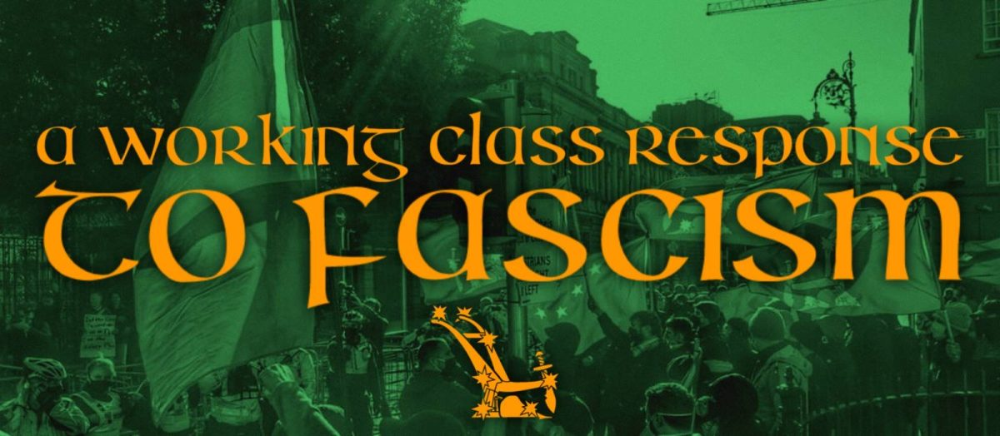‘_应该向法西斯主义者提出的问题 
 工人阶级社区中担心的优势_。’ 

 您提供了有关工人阶级的解决方案 
 人为创造的住房危机，高昂的能源价格，资本主义 
 生活成本上升，缺乏工作，培训和教育 
 机会，故意破坏我们的健康和公共服务， 
 国家故意忽视和边缘化的数十年 
 外国帝国主义大国对我们国家的划分和占领(the
real foreign threat)，金黄色的力量平衡的改变 
 圈出人民？ 

 你称自己为爱国者。 您在正在进行中扮演着什么角色 
 在我国为民族解放而奋斗？ 你知道，真实的 
 爱国者牺牲了他们的生命和自由 
 爱尔兰和工人阶级？ 

 我们知道您的领导人做了什么。 贾斯汀·巴雷特(Justin Barrett)和詹姆斯·雷诺兹(James Reynolds) 
 Fine Gael，BlueShirts，反间隔党的聚会 
 自1922年以来，英国帝国主义的口袋。一些爱国者。 赫尔曼·凯利(Hermann Kelly) 
 在一所大学以与MI5的联系而闻名的大学教育，然后 
 奈杰尔·法拉奇(Nigel Farage)和英国最激进的形式 
 帝国主义和沙文主义。 也许我们误解了。 当你叫自己 
 “爱国者”是您的意思是英国爱国者吗？ 再次，没有工作的朋友 
 班级。 

 作为英国爱国者，这就是为什么自由州法西斯组织是为什么 
 始终与忠实的死亡小队建立越来越紧密的联系， 
 英国人对吗？ 杀死无辜的爱尔兰公民的同一个死亡小队 
 代表英国帝国主义和同样的英国极右翼 
 旗帜下针对爱尔兰移民的仇恨运动“没有黑人，否 
 狗，没有爱尔兰人!
 反对爱尔兰民族解放联盟？ 贾斯汀和赫尔曼当然 
 有形式。 

 了解爱尔兰人由于持续的压迫850年，已经 
 悠久的移民历史，我们的人民遭受种族主义，暴力 
 和剥削； 为什么抗议中心住房脆弱的庇护 
 寻求战争饱受战争和贫困国家的寻求者，寻求国际 
 保护，而不是反对那些真正造成问题的人，而是 
 即英国，欧洲和美帝国主义的自由国家政府， 
 北约，资本主义阶级，特别是房东？ 是因为你是 
 实际上，与这些同样的权力联盟，并非常了解自己 
 他们俱乐部的一部分？ 

 没有答案？ 我们这么认为。 

 法西斯主义者没有什么可以提供工人阶级的。 他们是促成的， 
 亲帝国主义者，亲陆地，在我们的社区中没有基础。 我们不会 
 让他们现在得到一个。 

 爱尔兰人民一直是反帝国主义和反法西斯主义者。 
 让我们为这一传统感到自豪，不允许我们的战斗精神成为 
 在网上劫持极右边的谎言或法西斯主义的靴子男孩为议程服务 
 当权者。 

 当寻求庇护者和难民要与社区进行全面磋商 
 被安置在某个区域是必须的!没有更多的谎言。 信息消除了恐惧和 
 咨询，信息和沟通将导致真正的整合。 
 在寻求庇护者和难民都是的所有社区中都需要资源 
 被安置。 所有人的住房，培训和教育机会，资金 
 对于学校，体育俱乐部，医疗保健和其他社区服务是必须的 
 并且是工人阶级社区的一系列合法要求。 

 工人阶级社区有真正的担忧。 以生活为代价的愤怒， 
 住房危机，我们的医疗保健系统的崩溃，被忽略 
 那些世代相传的人导致愤怒到沸点。 但 
 这种愤怒必须以正确的方式引导。 我们的社区不会固定 
 通过针对寻求庇护的庇护者，难民或移民的目标 
 为当权者的议程服务，以分散对实际问题的注意力。 

 工人阶级需要一个统一的战线来与我们的剥削作斗争 
 当权者。 愤怒和抗议需要针对那些 
 伦斯特豪斯(Leinster House)和斯托蒙特(Stormont)反对跨国公司和国际 
 帝国主义。 反对房东，能源公司，法西斯主义者和 
 最右边的搅拌器。 建立这样的运动是我们所有人的任务 
 相信一个由人民拥有和控制的爱尔兰，共和国 
 1916年宣布。 

 请记住，如果有人呼吁抗议寻求庇护者或 
 替罪羊或移民，他们正在为人们提供利益 
 权力，应该在我们的社区中孤立和不受欢迎。 让我们专注于 
 我们的真实敌人，不允许我们被那些人分裂和征服 
 当权的!

News Source: [https://anti-imperialist-action-ireland.com/blog/2023/02/02/a-working-class-response-to-fascism/](https://anti-imperialist-action-ireland.com/blog/2023/02/02/a-working-class-response-to-fascism/)

<!--NEWS-->

# PC 2月2日 - 政府压制阿尔弗雷多·科斯蒂奥（Alfredo Costio）的民主和团结运动

作者: maoist

时间: 2023-02-02T18:26:00+01:00

图片: ['[romacr.jpg](https://soccorsorossoproletario.noblogs.org/files/2023/02/romacr.jpg)']

<!--METADATA-->

＃[仍然对Alfredo Cosenza的团结活动家恐吓。 试图 
 在罗马的USB总部的突袭 
 托管](https://soccorsorossoproletario.noblogs.org/post/2023/02/02/ancora-
intimidazioni-agli-attivisti-solidali-con-alfredo-cospito-tentativo-di-
irruzione-nella-sede-di-usb-a-roma-per-identificare-gli-studenti-ospitati/)发表于 
 [02/02/2023](https://soccorsorossoproletario.noblogs.org/post/2023/02/02/ancora-
intimidazioni-agli-attivisti-solidali-con-alfredo-cospito-tentativo-di-
irruzione-nella-sede-di-usb-a-roma-per-identificare-gli-studenti-ospitati/
"15:21")_ [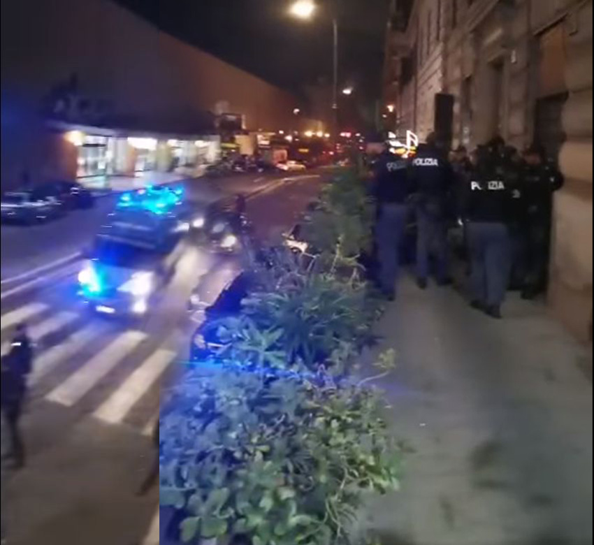](https://soccorsorossoproletario.noblogs.org/post/2023/02/02/ancora-
intimidazioni-agli-attivisti-solidali-con-alfredo-cospito-tentativo-di-
irruzione-nella-sede-di-usb-a-roma-per-identificare-gli-studenti-
ospitati/romacr/)昨天的OSA新闻稿和变更课程：_ 

 **只是狩猎女巫。** 

 袭击中间的情节和OSA的大学生很认真 
 和变更课程：在团结广告中建立知名度 
 阿尔弗雷多·科萨托(Alfredo Cosato)，反对41bis的酷刑，夸张 -  
 荒谬 - 警察部署和Carabinieri试图进入 
 USB联盟的所在地，该联盟没有授权，并要求 
 识别学生(per lo più minorenni)展示。 

 阿尔弗雷多·科森扎(Alfredo Cosenza)的人类和政治团结不仅仅是合法的，而不是 
 必须压制它，以及与41BI的斗争，酷刑工具和， 
 经常对那些与制度斗争的人进行报复。 

 政府不仅让阿尔弗雷多(Alfredo)死亡，而且还在提出 
 危险的“女巫狩猎”气候对任何敢于不同意的人 
 我们社会的不公正现象。 巫婆反对思想 
 这将打击我们的所有矛盾和民主斗争 
 村庄。 

 这是一条简单的逃生路线，对于一个难以维护其的政府 
 选举承诺和在该国有严重的社会状况，创建一个 
 内部敌人，周期性地回到历史的“无政府主义者危险” 
 我们的国家。 

 将保持民主监督以避免进一步的监督 
 朝警察国家滑倒，斗争仍在继续。 

 奥萨·罗马

News Source: [https://proletaricomunisti.blogspot.com/2023/02/pc-2-febbraio-il-governo-reprime-la.html](https://proletaricomunisti.blogspot.com/2023/02/pc-2-febbraio-il-governo-reprime-la.html)

<!--NEWS-->

# 汉堡集会：停止对墨西哥人民的恐怖！ 停止征收和死亡的大型项目！

作者: DEM VOLKE DIENEN

时间: 2023-02-02T18:45:37+00:00

图片: []

标签: ['Mexiko', 'Sol Rojo']

类别: None

<!--METADATA-->

_我们公开呼吁在汉堡举行集会 
 寄了，送了。 _ 

 在墨西哥苏登的瓦哈卡州，贫穷的农民自此捍卫自己 
 反对大型项目的多年，旧州与 
 帝国主义者建造。 农民被偷走了土地，以便在地峡上 
 Tehuantepec可以筹集巨大的风电场。 所以 
 农民被征用，大自然被摧毁，人口被出售。 

 农民多年来一直在做的抵抗是旧的 
 墨西哥国家及其同胞以压抑和恐怖 
 回答。 对农民的斗争和不同的流行运动 
 打破抵制任务与该任务的任务 
 发展帝国主义大型项目，国家急于潜艇 
 人口的帮派。 这种情况在最后 
 几周巨大的指责。 几个人民被捕 
 或消失没有痕迹。 武装武装于2023年1月29日 
 代表大型财产，林克·塔戈拉巴(Rincon Tagolaba)的城市 
 居民威胁着饭菜和饮用水的地方， 
 给了凹陷的镜头。 国家警察抽搐 
 但是什么也不反对武装的武装对象。 

 墨西哥国家利用谋杀团伙为他工作 
 帝国主义者的利益以牺牲人民为代价 
 Tehuantepec通过，对他们来说是正确的。 我们的团结 
 适用于战斗的贫穷农民和大众运动，例如 
 民间电红色阳光(Corriente del Pueblo Sol Rojo)脱颖而出和 
 为受害者准备满足人民的需求和利益。 我们要求 
 所有被拘留的露营者的释放。 我们要求他们 
 立即消失了生动的prase站。 我们要求结束 
 旧墨西哥国家及其恐怖分子及其恐怖分子 
 处理。 

 **集会：2023年2月8日，星期三| 下午6点| S-Bahn Station Sternschanze ** 

 _b undnis反对帝国主义侵略_ 

 _ febraws 2023_

News Source: [https://www.demvolkedienen.org/index.php/de/t-international/7453-kundgebung-in-hamburg-stoppt-den-terror-gegen-das-mexikanische-volk-stoppt-die-megaprojekte-der-enteignung-und-des-todes](https://www.demvolkedienen.org/index.php/de/t-international/7453-kundgebung-in-hamburg-stoppt-den-terror-gegen-das-mexikanische-volk-stoppt-die-megaprojekte-der-enteignung-und-des-todes)

<!--NEWS-->

# PC 2月2日 -  Viva Stalingrado-一点点历史

作者: maoist

时间: 2023-02-02T20:08:00+01:00

图片: ['[zresistenze150.jpg](https://www.resistenze.org/sito/zresistenze150.jpg)']

<!--METADATA-->

**从** 

 URSS科学院| 通用历史卷。 X，页面 205-219， 
 TETI Editore，米兰，1975年 
 [comentance.org]的转录(http://www.resistenze.org)由中心编辑 
 文化和流行文件 
  
  
  
 _在苏联胜利80周年之际 
 纳粹 - 法西斯侵略者的斯大林格勒 
  
 1942  -  1943年冬季开始时，它在伏尔加河河岸开业 
 反对纳粹主义的致命斗争的新阶段，进入历史 
 就像在第二次战争中的激进转折点一样 
 世界。 实现此转折点的主要优点 
 反法西斯主义联盟属于苏联。 
 在1942  -  1943年在苏联 - 德国战线上的狂热战斗中 
 苏联人民的历史命运不仅决定，而且是整体的 
 人性。 
  
 ** 1 \。 法西斯军队在伏尔加省失败。 转折点的开始 
 战争中的激进** 
  
 苏维埃军队的反击开始时的情况 
 南方 
  
 1942年秋天，苏联 - 德国阵线，除某些部门外 
 他从高加索的山坡上的巴伦支海稳定了整个线。 
 但是，对于联盟而言，情况仍然非常严重 
 苏联。 列宁格勒被围困，伟大的敌军继续 
 在通往莫斯科的遥远访问路线上运行，不断的粗糙 
 Stalingrad的战斗总是吸收新部队，主要街道 
 与高加索的交流中断。 
  
 对于苏联武装部队，海洋的局势也不利。 
 波罗的海舰队在海湾东部被封锁 
 芬兰。 克里米亚半岛E失去后，黑海舰队 
 在Ninotorossijsk的身上，他被迫导致不足的港口 
 Poti，Gelendžik和Tuapse，这阻碍了他的行为。 在更多条件下 
 北舰队很有利。 用船只加固 
 从太平洋来捍卫北部通讯和 
 他为陆地辩护提供了有效的帮助。 
  
 1942年秋天，很明显，夏季自我竞选的计划 
 纳粹司令部失败了。 尽管德国军队及其他们的军队 
 盟友已经到达伏尔加舞，在高加索的斜坡上， 
 他们没有实现他们的主要目标。 进步 
 夏季，大约一百万人在纳粹德国之间损失了 
 被杀，受伤和囚犯以及损失大量 
 手段和军备。 
  
 德国军队团体“ A”，遇到了狂热的抵抗 
 在高加索的山坡上，苏联部队很忙 
 在漫长而疲惫的战斗中。 “ B”军团必须习惯 
 长度为1300公里的总部。 在拱门的中心 
 在Stalingrado的前面，有冯·保罗(Von Paulus)和iv陆军的VI武装 
 Hath的战舰，为征服城市而战。 对他们的 
 翅膀由III和IV罗马尼亚军队和VIII的意大利军队排成一排 
 去防御。 卫星部队从 
 德国人的军事和道德观。 
  
 法西斯攻击者的局势 
 Stalingrado和在北高加索地区因其储备而加重了 
 战略几乎完全精疲力尽。 在无限的额头上 
 东部延伸了超过6,000公里，有 
 德国陆军部队的中央指挥只有三个师 
 战舰，一个备用师和两个步兵旅； 在保护区 
 武装团体有八个师和一个旅。 
  
 1942年10月，德国司令部，考虑到局势受到损害， 
 他决定继续前进。 顺序n。 10月14日1 
 1942年安排：“我们必须面对冬季运动。 
 东部阵线 - 除了当前的进攻行动或设计 
  - 是为了维护任何代价的职位，拒绝每个人 
 敌人试图打破他们，从而创造条件 
 在1943年继续我们的进攻以击败 
 绝对是我们最危险的敌人”。 
  
 根据这些规定，德国武装部队开始了 
 冬天的准备。 在整个前部的长度上 
 或加强防御工事。 
 特别关注的是前线的中央前沿 
 预计红军的进攻行动是WEHRMACHT司令部。 
 在这里，浓缩分组的主要增援 
 其他领域。 在冬季运动开始时，在军队中
德国人将其放在东方。 希特勒总参谋部 
 他认为红军对军队的攻势 
 中央将在11月初推出。 
  
 就苏联至高无上的司令而言，它完善了计划 
 在冬季进攻中，决定在 
 南部地区与西南战线的力量(comandate dal tenente-
generale Vatutin)，唐前部(comandate dal tenente-genera­le
Rokossovski)和斯大林的前部(comandate dal colonnello-generale
Eremenko)从stalingrado区域从一个方向到 
 唐的盆地。 准备反性并协调行动 
 Fronti被派往斯大林格勒地区，祖科夫陆军将军 
 colonellogenenal vassilevski。 
  
 在该部门开始攻击的机会由 
 一组政治，经济和军事因素。 决定性的失败 
 南方的敌人必须导致他的计划的明确崩溃 
 他们专注于德国军队在高加索地区的到来和 
 土耳其在针对苏联战争中。 获得决定性的结果 
 南部的士兵，非常丰富的谷物区域 
 唐和库班，解放的条件 
 唐的盆地，敌人对来源的威胁 
 高加索的油以及与盟友的交流路线 
 通过伊朗，他们到达了波斯湾。 唐盆地部门 
 德国战略防御中最脆弱的一点出现了。 
  
 随着苏联军队到达罗斯托夫的条件 
 在高加索地区运作的德国装甲集团“ A”的失败 
 北方。 敌人在伏尔加河和唐之间的领土上失败 
 这只是冬季运动的第一阶段。 成功之后 
 在此操作中，计算出苏联的Supreme命令要执行一个 
 在其他方面进行一系列进攻行动。 特别重要 
 被赋予了消除列宁格拉多的围困和失败 
 在课程 
 唐和北高加索地区的上级。 
  
 冬季活动的第一阶段以最完整的方式设计 
 这是准确的。 在司令部总参谋部的联合努力下 
 至高无上的总参谋部和前线的指挥 
 Stalingrado，Del Don和South-West制定了一个计划，该计划接受了 
 “天王星”的名称。 该计划基于一个非常大胆的想法： 
 这三个战线的力量围绕并摧毁了巨大的分组 
 在伏尔加河和唐之间的领土上的法西斯军队并创造条件 
 为了通过苏联武装部队进入战略进攻 
 在南方机翼和苏联前部的其他部门的一般 -  
 德语。 西南战线和前部的突击群体 
 他们不得不通过汇合Kalač和Sovjetskij来攻击，然后收紧 
 在这个地区，袋子的戒指 
 攻击者。 
 对敌人的辩护必须在最脆弱的部门中被打破， 
 他们由罗马尼亚军队占领。 
  
 进攻的开始是为19岁的唐的西南战线 
 十一月，到第二天的斯大林格拉德(Stalingrad)。 实施 
 “天王星操作”是需要一项巨大的组织活动，以使 
 鉴于战斗，部队充分效率。 有必要 
 首先，用人，武器，军车和 
 规定； 创建运营和战略储备； 完美 
 政治军事准备部队； 秘密我 
 行动起始区域的突击分组； 组织 
 他们的协调和方向。 准备工作很复杂 
 从人类的运输和手段发生的事实发生在 
 在三个独特的铁路上，空中轰炸的轰炸，这一事实是 
 他限制了涌入速度。 保证的特殊困难 
 力浓度的保密由特征代表 
 主要是踏上下一个将推出的区域 
 进攻。 
  
 操作的成功主要取决于 
 战舰和机械化单位。 因此，在进攻前夕 
 他们用坦克的单位和疣加强了。 总体上 
 将三个前部对齐约900个坦克。 超过13,500大炮E 
 Mortai被向炮兵提供，是那两倍的 
 他们曾在莫斯科的反击中受雇。 航空数量更多 
 1,000架飞机。 
  
 在进攻性苏联军队的前夕，在三个战线上排队
袭击董事中部队和车辆的熟练脱位 
 主要，苏联司令部设法创造了强大的部队。 
 所有这些力量和手段先前都在位置上排队 
 攻击要归功于后方组织的工作。 
  
 从萨拉托夫(Saratov 
 蒸汽渡轮。 建造了许多船桥。 这 
 部队的集中度过没有被敌人注意到的： 
 三月保持最绝对的无线电沉默，所有命令 
 他们被送给了声音。 措施也被广泛用于 
 迷失敌人。 很大的帮助向军队命令 
 该地区共产党的人口和组织 
 Stalingrado。 该地区的工人有助于加油 
 用食物和弹药的部队。 成千上万的公民从事 
 建造机场，河流和道路上的桥梁，帮助运输了 
 弹药和维修军用车辆。 在11月中旬 
 “天王星操作”的准备工作已经完成。 红军 
 她准备对敌人施加果断的打击。 
  
 在斯大林拉多的德国军队的包围和击败 
  
 在大规模轰炸后，11月19日，早上8.50 
 炮兵，西南战线的部队，唐触发了 
 进攻。 
  
 强烈的降雪和早晨的雾防止了干预 
 航空。 破坏了罗马尼亚军队的抵抗 
 III陆军，西南战线的突击小组设法 
 在30-35公里的战斗第一天结束时前进。 
 同时他们深入敌人的防御装置 
 也是唐阵线的部队。 从11月20日上午开始 
 不利的气象，斯大林格拉德阵线传给了攻击。 后 
 在破坏了对城市以南的罗马尼亚军队的防御后，部队 
 苏维埃西北和西南。 
  
 德国司令部拼命努力逮捕攻势 
 苏联部队，但所有试图阻止它，甚至只是 
 完全放慢速度。 西南阵线的移动单元和 
 斯大林拉多迅速前进，他们到达了德国VI军队的翅膀， 
 使更轻的威胁压制敌人的分组。 
  
 11月23日，西南阵线的第四苏联装甲尸体 
 A.Kravčenko少将的指挥 
 Sovjetskij村的区域，有第四个机械化机构 
 斯大林拉多由少将V.T.指挥 沃尔斯基，这样 
 一大批敌人的包围22 
 部门。 两个前部的移动单元。 
  
 为了不允许戒指通过分组打破 
 苏联被包围或从外部释放，继续 
 扩大在德国军队之间建立的走廊的进步 
 操作的第一阶段。 成功拒绝了 
 敌人，他们于11月30日晚上在富士和唐的线上到达。 
 同时，还在内部方面进行了积极的股票 
 打火机。 11月30日晚上，表面占据 
 包围的分组已经减少了一半以上，并且不超过 
 到现在为1,500平方公里。 这个部门被大火震惊 
 苏联炮兵。 
  
 11月22日，甚至在包围完成之前， 
 大道六世陆军的指挥官冯·保洛斯召唤古姆拉克·洛拉 
 尸体指挥官的会议，他们一致来到了 
 结论是，巨大的袋子里的漫长防御斗争 
 会导致灾难，为了避免它，有必要去 
 立即与西南部队的大部分部队。 冯将军 
 保卢斯要求希特勒授权打破南方的包围 
 西部，但得到了不灵活的拒绝，伴随着承诺 
 所有措施都将采取确保正常加油的措施 
 军队和同时将其从打火机上释放。 
  
 在11月底和12月的第一天，德国人做了 
 首先尝试释放周围的部门，发起反击 
 在西南前部的区域。 但是德国货车的前进被封锁了 
 并被拒绝。 
  
 为了恢复南部的局势，德国司令部决定 
 快速创建一组新的“唐”军队 
 包括在唐的大安萨(Ansa)中运作的部队，以及该团体 
 在斯大林拉多地区包围的军队。
分配了逮捕苏联军队的攻势的任务， 
 从Kotelnikovo和Torre的地区攻击到Stalingrado， 
 到达包围部队，加入他们并恢复前一个 
 国防阵线。 周围的分组的加油本来是 
 由空气保险。 
  
 苏联司令部立即感觉到敌人的计划并准备 
 有效地拒绝其反击：他加强了自己的 
 在“走廊”外部前部运行的分组组织了 
 狩猎敌人的运输航空。 12月，他们被摧毁 
 在空中或机场中，超过750架德国运输飞机。 
 冯·保洛斯军队的歼灭被委托给唐的阵线， 
 由Rokossovski中尉指挥。 司令部总参谋部 
 至尊由沃诺夫上校代表。 但是，那 
 必须暂时推迟实现这一目标。 
  
 12月12日，沿Tichoreck Railway的Kotelnikovo区 
 斯大林拉多(Stalingrado 
 霍斯。 在主要敌军的强大压力下，军队 
 在这条线上运行的Stalingrad Frort的 
 东北退休。 但是，他在12月15日设法逮捕 
 德国进步，在接下来的几天里，英勇抵抗 
 敌人的压力。 12月19日，陆军团体恢复了 
 进攻和12月23日到达水槽Myškova，距离 
 距VI军队的部队约40公里。 
  
 为了拒绝敌人的进攻，它被送往科特尔尼科沃地区 
 警卫队由中将罗德·马利诺夫斯基(Rodion Malinovski)指挥的军队 
 以前打算清算敌人分组 
 包围。 在俄罗斯冬季的恶劣条件下，马利诺夫斯基军队 
 他们每天驶向河流40-50公里的强迫游行 
 Myškova，敌人试图扩大他的桥头。 立刻 
 苏联军队与敌人接触，以动力袭击了他 
 不停止。 
  
 12月24日，马利诺夫斯基军队通过行动传递了进攻 
 与V武装袭击和LI的一部分部队协调 
 军队。 
 违反德国抵抗力量后，苏联军队占领了 
 12月29日Kotelnikovo。 防止 
 敌人解锁冯·保洛斯军队的新尝试关闭 
 在Stingrado Bag中无关紧要，现在出现在谴责 
 没有逃避全面破坏。 
  
 Voronež和Vorone的部队和 
 西南。 在12月16日上午，一个半小时的大火 
 炮兵，Voronež和西南部队的部队打破了 
 在某些地方和12月24日晚上对敌人的防御 
 前进100-200公里。 在八天之内 
 战斗会影响意大利第八军E的严重失败 
 到“唐”军队的左翼，从而造成了威胁 
 从他大部分力量的北部深处包围。 
  
 12月30日，苏联军队在后方深入前进 
 尼古尔斯卡(Nikolskaja-ilinka)线上的敌人。 试图逮捕 
 Voronež和西南部前部的前进，德国司令部是 
 被迫赶紧以前打算的8个部门 
 冯·保罗斯(Von Paulus)的部队释放。 1943年1月初 
 部队的局势在行李袋中关闭得多。 戒指 
 打火机的范围越来越狭窄。 德国人缺少储备金 
 任何形式的。 弹药和燃料即将结束。 这 
 即使士兵继续 
 打架。 
  
 试图避免1943年1月8日无用的流血事件 
 苏维埃司令部以武器的荣誉向冯·保洛斯(von Paulus)投降 
 提议停止毫无意义的阻力。 一直希望到达 
 在希特勒的命令下服从“救援”军的副手冯·保洛斯 
 他拒绝了慷慨的提议。 1943年1月10日，唐阵线的部队 
 然后，他们继续进行周围的分组的歼灭。 
  
 超过敌人的强烈抵抗，前线的部队在17日出现 
 一月在Voroponovo； 苏联司令再次向冯·保罗·迪(Von Paulus di)提议 
 放弃。 但是该提议也被拒绝。 
  
 唐战线的部队继续袭击，并于1月25日 
 苏联前卫 - 加德(Garde)从西部到达斯大林格拉德(Stalingrad)。 26日晚上 
 一月XXI军队加入了山区 
 Mamai向LXII军队的部队，从而破坏了
许多士兵开始投降。 
  
 1月31日，该小组的抵抗力截然不同 
 南部和2月2日的军队北部 
 冯·保罗斯(Von Paulus)。 
  
 唐阵线的部队歼灭了22个师， 
 士兵和官员与同一元帅冯之间的囚犯9.1万 
 保卢斯(Hitler lo aveva promosso sul campo sperando così di indurlo a non
arren­dersi e a sacrificare fino all'ultimo i suoi sol­dati)和征服 
 大量武器和军事手段。 在进攻期间， 
 持续两个半月，5名武装武装毁灭 
 法西斯主义者。 德国军队和盟友的损失超过了 
 1942年11月19日至1943年2月2日，有80万人。 在同一时期 
 红军摧毁或捕获了2,000辆坦克和自塑的大炮， 
 超过万多大炮和迫击炮，2,000架战斗和运输飞机， 
 超过7万辆汽车。 
  
 1942  -  1943年冬季红军的总体进攻 
  
 击败伏尔加的胜利绝对借用了整体战略状况 
 苏联 - 德国人，首先是其南部地区。 这 
 苏联最高司令部决定，使新部队施加行动 
 扩大战略攻势的正面。 发展 
 反性 - 总的来说，甚至在完成之前就开始了 
 伏尔加河周围的德国分组的歼灭。 
 总体而言，对于1942  -  1943年冬季运动的一般攻势， 
 超过70％的军队和手段被使用 
 苏联战斗机。 战略进攻在 
 3,000公里，深度为600-700公里。 
  
 因此，开始驱逐居民从苏联领土上驱逐出境。 这 
 苏联最高司令部的总参谋部批准了进攻计划 
 南方部队和高加索的部队，目的是周围E 
 摧毁了在高加索战线上运作的德国分组。 在 
 基于这一计划，南方部队由上校指挥 
 Eremenko将军必须带到Rostov地区并砍伐街道 
 撤退到Wehrmacht的北高卡斯分组。 
  
 这方面的左翼必须通过 
 萨尔斯克的草原，以免让敌人撤退到 
 塔曼半岛。 高加索阵线的部队由将军指挥 
 武装的I. Tjulenev，他们不得不与MAR组的力量进攻 
 黑色到Krasnodar，在Tichoreck上进一步，并与部队一起 
 在南部的阵线，围绕着该地区的小组组 
 北高卡斯德语。 
  
 同时，他被命令前往北部的部队 
 高加索的前部推动，他的右翼前进 
 通过莫兹多克(Mozdok 
 德国朝着高加索中央链的斜坡，然后 
 摧毁它。 
  
 1943年1月1日，南战线的部队通过了执行 
 计划。 当他们通过敌人的强烈抵抗后，他们 
 他们到达了曼恩河，德国军队“ A”群体发现自己关闭了 
 一个深袋，为了不隔离，开始退休 
 迅速朝罗斯托夫。 
  
 1月3日，高加索战线的北部部队 
 开始了I装甲军的撤退单位的追逐 
 德语。 但是，其进步的节奏不足。 后 
 北部集团，黑海的前进小组也开始了 
 在山区冬季的困难条件下进行操作，而无法 
 由于天气恶劣，计算航空的批准。 在一月， 
 克服敌人和山区的抵抗，这是该部队的部队 
 Group FreedNalčik，Stavropol，Armavir和许多其他地点。 
  
 向部队提供了很大的帮助，从 
 该地区党委员会。 爱国者袭击了希特勒人， 
 他们摧毁或没收了自己的手段，桥梁，沉积物， 
 机车，货车，还可以释放多个位置。 群组 
 在中尉的指挥下，高加索阵线部队的北部 
 I. I. Maslennikov将军，于1943年1月24日在前面采取行动 
 北方高加索地区。 
  
 克服敌人的抵抗，地方的不切实际性和 
 天气恶劣，部队于2月初到达了亚齐夫海。 在里面 
 库班桥的负责人，XVII德国军队被隔离了，他现在可以 
 仅与大部分纳粹部队保持联系 
 通过克里米亚。 
  
 同时，南阵线的军队在罗斯托夫周围的环境中作战。 一种 
 北高加索地区的显着部分被释放出来，但不可能
随着1943年1月底的到来，附近的苏联部队 
 罗斯托夫(Rostov)的抵抗力量增加。 德国司令部出现 
 迫切的努力赚取撤离必要的时间 
 来自北部高加索的部队。 狂热的战斗发生在 
 Bataisk火车站的区域，距离Rostov 10公里 
 德国人运送了人和手段。 
  
 黑海集团部队的进攻也发展了。 
 2月，他们到达了Kuban河和Krasnodar附近。 为了 
 在4个晚上，拥有Ninational和Taman Peninsula 
 2月，北部高加索和3月的舰队的命令 
 Nero继续在Jušnaja地区实施了一项伟大的登陆行动 
 Osereika。 但是，受到敌人的强烈火的欢迎，并立即强烈 
 泄漏，一部分着陆船被迫退休，而 
 已经登陆的部队无法保留桥头，因为 
 部队的不平等。 
  
 强化部队着陆的结果更有利， 
 Z. L. Kunikov少校，位于Stanička村和山区 
 Myšako，Novorossijsk附近。 这个由800名男子组成的货物 
 码头步兵，迅速与其他部门一起加强，占领和 
 他坚定地保持了一个小桥头。 
  
 希特勒的友好员工，包括看望的危险 
 Nincoossijsk的分组，他下令开车，以付出任何代价 
 苏联士兵。 反对谦虚的苏联部队 
 集中了5个德国分区的有效性。 
  
 但是，他们的努力覆盖了码头的步兵的价值 
 苏联。 一场斗争开始了，必须持续七个月 
 Myšako桥，称为“小土地”。 为此 
 时期从未停止与使用货车的敌人战斗 
 武装，炮兵和航空。 
  
 “小土地”的捍卫者以荣耀覆盖了自己，写一页 
 伟大的爱国战争历史上真实的英雄主义。 军队 
 Krasnot和2月12日，2月12日 
 面对痛苦的战斗，他们继续前进 
 库班和西部高加索朝着塔曼半岛。 同时 
 南阵线的部队袭击了罗斯托夫面前的敌人线。 在里面 
 这座城市的轴线发生了激烈的战斗。 
  
 2月14日，经过几天的激烈战斗，Rostov来了 
 释放。 进攻之后，塞塞诺(Ceceno)地区被释放 
 北部明显的Inguscezia，来自卡巴迪诺 - 巴尔卡里亚(Cabardino-Balcaria)， 
 Stavropol的领土，以及Rostov地区的很大一部分 
 Krasnodar领土。 在这些地区，他们在战争10之前居住 
 百万人。 德国入侵者造成了巨大伤害 
 该地区的经济杀死了数千名苏联公民。 在里面 
 他们只有斯塔夫罗波尔(Stavropol)的领土，才使自己对30多人的屠杀负责 
 千平民 
  
 与北高加索地区的苏联军队的进攻同时 
 在Ostrogožsk-Rossošk地区发起了进攻行动 
 Voronež-Kest​​ornoje。 
  
 1943年1月下半年，al vorone front的部队 
 中尉F. I. Golikov的指挥，被包围并摧毁了 
 强有力的敌人分组证明了Voronež和Kantamirovka之间的唐。 
  
 对匈牙利II军和VIII军队造成了主要打击 
 意大利人，位于该地区。 在操作过程中，他们是 
 超过15个部门完全被摧毁，而有6个师来了 
 受到严重影响。 士兵和敌方军官之间超过8.6万 
 囚犯。 
 苏联军队向奥斯科尔(Flume Oskol)前进了140公里。 
  
 然后是Voronež正面的右翼部队和 
 Brjansk的前面攻击并击败了Kastornoje的分组 
 Voronež-Kastornoje线的敌人。 只有几组士兵 
 他们设法逃脱了打火机。 在此操作中，他们来了 
 11个敌人师摧毁了。 Brjansk和Voronež1的部队 
 他们释放了库尔斯克Vorone的大部分地区， 
 Voronež，Kastornoje，Staryi Oskol和Tim。 
  
 在这两个行动中 
 德国“ B”遭受了艰难的失败。 非常严重的损失遭受了军队 
 德国卫星(Ungheria e Italia)。 II匈牙利军队是 
 摧毁了事实，损失了1.35千人。 同样的命运触及了第八 
 意大利军队。 完全失去了好斗能力， 
 它是从苏联德国阵线中撤回的。 军队的失败 
 匈牙利和意大利人在匈牙利和意大利产生了深刻的印象
德国卫星国家。 
  
 发展他们的进攻，苏联军队于2月8日占领 
 库尔斯克和2月16日查尔科夫。 同时，西南战线的部队， 
 在Colonellogenal vatutin的指挥下，他们发动了攻击 
 mariupol，将撤退向西切换到敌人的分组 
 唐的盆地。 
  
 敌军从唐·沃尔斯(Don Verso)的下部撤军 
 Mius和德国人在Donec盆地的动作是 
 通过西南战线的指挥和Voronež进行错误的评估 
 除了DNEPR以外的法西斯军队的一般撤退的开始。 这 
 最高司令部的总参谋部同意这项评估。 在这样的 
 道路，尽管这些战线的部队已经削弱了，并且已经削弱了 
 迫切需要增援，他们的进攻被迫 
 马尼尔。 就其部分而言，纳粹司令部设计了一个很棒的反对性 
 在这个领域。 
  
 2月13日，德国装甲团体“唐”变成了一个小组 
 “南方”军队，该军队用制造的单位匆忙加强 
 来自西欧，来自巴尔干地区和前线的其他部门 
 苏联德国人。 希特勒在场的扎波尔杰(Zaporžje)举行了会议 
 Wehrmacht的最高命令。 该计划在会议上获得批准 
 反攻势，该攻击规定袭击南方阵线的部队 
 西向DNEPR前进，拒绝他们以外的北部。 
 该计划还涉及该地区苏联部队的包围 
 通过查科夫，在失败之后，穿透了 
 Voronež的前部和向库尔斯克的前进。 
  
 同时，他不得不开始进攻 
 靠在苏联中央阵线的后部，围绕着部队 
 红军集中在库尔斯克地区。 在 
 行动“南”德国军队有31个分区，13个部门 
 其中是战舰或机动的，即所有单位的一半 
 家具在苏联 - 德国阵线上运行。 真理，分裂 
 纳粹，尤其是战舰，在男人和 
 方法。 
  
 对西南战线的右翼的反攻开始于19日 
 二月。 在主要敌人的压力下，部队 
 苏联被迫退休到北部北部。 
 随后，德国单位攻击了翼的先进部队 
 左侧的左侧。 苏联军队勇敢地拔出 
 每个土壤的棕榈。 这些天，他得到了火的洗礼 
 在捷克斯洛伐克营的前面，在上校 
 Ludvik Svoboda。 
  
 3月13日，德国人再次占领查科夫并拒绝了部队 
 Voronež正面的左翼向Belgorod造成了一种情况 
 不仅在这方面，而且对于前部的后部也很困难 
 中央。 然后，苏联最高司令的主要工作人员朝向 
 这些地区威胁到3月底的储备 
 德国反性逮捕。 在整个正面的整个翼 
 从贝尔戈罗德(Belgorod)到阿佐夫(Azov 
 在防御上。 
  
 德国司令无法实现其目标，即使 
 他的进攻设法重新占领了东北地区的一部分， 
 乌克兰东方。 但是这些成功的价格很高。 
 苏联军队在 
 1942  -  1943年的冬季运动是消除了列宁格拉多的围困。 这 
 对敌人的强化防御的崩溃是由部队做出的 
 在L. A. Govorov中尉的指挥下，在Leningrado Frort的统治下 
 在陆军将军K. A. Merezkov的指挥下，Volchov阵线的那些。 
  
 对于进攻，拉多加湖以南的行业被沿线选择 
 德国Schlüsselburg-Sinjavino。 两个战线部队的袭击 
 他们是一致的，以便在两场大火之间带德国人 
 允许红军士兵的结合 
 简短的。 
  
 通过了解该部门的战略重要性，希特勒人VI 
 集中大力在森林地区的行动中受过良好训练 -  
 沼泽。 
 在很长一段时间的空间中，德国人建造了一系列 
 在Scaglioni中防御强大的防御工事。 对这些职位的攻击是 
 极其困难。 完成长期准确的准备工作后， 
 列宁格拉多和沃尔乔夫前部的部队于12岁传递了进攻 
 1943年1月。 
  
 在围困中，舰队的水手 
 波罗的海(comandati dal viceammiraglio V. Tribuz)和战争舰队
战斗苏联是捍卫敌人的理由 
 1月18日，他们加入了郊区工人的地区。 1和n。 5。 
 列宁格拉多的围困被打破了。 沿着湖的南部海岸 
 拉多加(Ladoga)成立了一个8-11公里的宽走廊 
 恢复与该国其他地区与地面的联系。 在这一点 
 走廊是在1943年2月的短时间内建造的 
 他开始运作。 列宁构成称她为“胜利铁路”。 
  
 围困的崩溃使列宁格勒局势不稳定。 为18 
 lengledesi持续了难以言喻的私密性，已经 
 遭受敌人的完全围困。 总体， 
 特别是在攻城的第一个冬天，他们死于饥饿和 
 敌人袭击超过60万居民。 
  
 但是静态抗拒。 对于全世界，列宁格拉多的辩护 
 他成为苏联人民赢得敌人的意志的象征。 
 罗斯福美国总统在发给的文凭 
 Leningrado写道：“代表美利坚合众国我交付 
 这本登陆列宁格拉多市的文凭是为了纪念其英勇 
 战士和他忠实的居民，男人，女人和儿童孤立 
 在他们的其余部分，尽管持续轰炸 
 饥饿，寒冷和疾病造成的无法言喻的痛苦 
 从1941年9月8日到关键时期，他们成功的城市成功 
 1943年1月18日，因此起到了无敌精神的象征 
 苏联社会主义共和国联盟和所有人的人民 
 反对侵略力量的世界人民。 
 列宁市的英勇捍卫者永远留下了深刻的印象 
 在纪念世界民族的中。 
  
 1943年2月和3月在中央和西北部门 
 在进攻行动面前进行了两次清算 
 敌人的前哨，深深地在部队设备下 
 苏联。 1943年2月15日，西北战线的部队由 
 Timošenko元帅和III武装进攻在Kalinin Front上 
 进攻始于XVI德国军队的单位，证明了 
 在“ Demjansk Bag”中，但没有能够包围和销毁 
 敌军。 德国人遭受了巨大的损失，逃脱了 
 打火机。 
  
 2月23日，在Velikije-Luki以北的战斗中 
 红军基金会周年纪念日，他创造了一个英勇的企业 
 十九岁 - 年轻的年轻共产党人亚历山大·马特罗索夫(Aleksandr Matrossov)。 他阻碍了他的 
 尸体米特拉格利亚(Mitraglia 
 生活保证了他的排成功。 Aleksandr Matrossov的名字， 
 苏联的英雄永远以254号的荣誉登记 
 后卫步兵团，其名称。 
  
 西部的部队和Kalinin在三月发展了进攻 
 走向ržev-vjazma。 在苏联军队的袭击下，恐惧 
 包围的威胁，敌人被迫撤退。 线 
 因此，前部不仅从莫斯科从另外130-160公里处移除 
 西部，也是rercherciata。 
  
 陆军赢家的政治军事重要性 
 1942  -  1943年冬季运动中的红色 
  
 从1942年11月中旬到1943年3月底的4个半月，是的 
 冬季运动继续，赢得了巨大的胜利 
 红军。 在这个运动中有一个中心位置 
 敌军在伏尔加河上的包围和an灭。 
  
 在1942年夏天支持法西斯军队的压力之后， 
 红军对他们造成了决定性的打击。 就像在 
 在防御性战斗的困难条件下，莫斯科做好了准备 
 在战略规模上对苏联部队的反击。 然而 
 1942  -  1943年冬季运动开始并发生的情况，是的 
 它与1941年至1942年冬季的状况有很大的区别。 在莫斯科的领导下 
 在某种情况下，德军的失败得到了 
 该国的经济和军事资源远非 
 完全使用，而后部处于情况 
 极其困难。 
  
 红军在夏天遭受了巨大的损失和手段 
 1941年，无法确保对敌人的决定性优势并发射 
 反性能通过非常有限的力量和手段。 这是一个 
 莫斯科面前的战斗无法做到的主要原因 
 意识到伟大敌军的包围和破坏。 
  
 1942年秋天，情况有所不同。 在该国，已经有一个
1942年夏季，为军队提供必要数量的手段 
 和军备。 后方的坚固性，快速而充满活力的动员 
 在整个经济方面满足战争的需求，人民的工作， 
 由共产党执导，是他向陆军保证的前提 
 红色的机会继续进行反击。 
  
 苏联武装部队在以前的战斗中进行了纠正，配备了 
 经验和出色的好斗技能，他们现在可以面对 
 在战略规模上解决进攻任务。 没有偶尔的原因，但是 
 社会主义政权的坚固性，对职责的意识 
 所有的人民及其高爱国主义允许苏联 
 不仅要在艰苦的斗争中抵抗，而且要改变课程 
 所有世界大战都赞成反法西斯主义联盟。 
  
 苏维埃武器在伏尔加岛上的胜利是英勇努力的结果 
 在整个苏联人民中，他们在军事方面的实现和 
 经济的。 这场胜利抚养了苏联公民的道德 
 他们看到他们的鲜血和工作并没有徒劳。 它给了它 
 向那些继续在锁下苦苦挣扎的人的新力量 
 法西斯入侵者。 伏尔加省敌军的失败破裂了 
 德国将军锻造的珍贵战争汽车袭击 
 希特勒。 
  
 德国军队的无敌神话惨败，而 
 战略倡议永远被带走。 历史胜利 
 伏尔加允许红军对 
 大规模并开始解放苏联领土 
 入侵者。 在冬季竞选期间，德国军队不仅 
 他们失去了1942年夏天到达的一切，但被迫 
 放弃一系列城市和地区 
 1941年。 
  
 在某些时候，前部向西移动了600-700公里。 一个大的 
 4.8万平方公里的领土从入侵者中解脱出来。 这 
 共和国的Voronež和Stalingrado地区的人口 
 Ceceno-English的自治，北部痴迷，Cabardino-Bo-Balcaria e 
 斯塔夫罗波尔领土的calmucchi的自治区域 
 关于Caraciai和Adigheti，几乎是整个领土 
 Rostov和Kursk地区的Krasnodar，大部分地区 
 由Vorošilovgrad，Smolensk和Orël恢复了自由。 
  
 敌人在许多铁路上打断的联系被恢复 
 沿伏尔加河。 在1942  -  1943年冬季运动中攻击者 
 法西斯主义者遭受了巨大的损失。 从1942年10月到1913年3月以外 
 士兵与军官之间的1,300,000被敌人作为力量 
 战斗机。 特别严重遭受卫星军队的损失 
 德国。 III和IV罗马尼亚军队，II匈牙利军队，VIII 
 意大利军队几乎不再存在。 红军摧毁了 
 或者他抓住了大量武器和敌人的手段。 但不是 
 仅希特勒的德国遭受的人类损失和材料 
 它的盟友。 失败使军队的道德和 
 法西斯轴国家的人口。 
  
 法西斯统治者被迫宣布为期3天的哀悼 
 斯大林拉多堕落。 从战争开始就第一次 
 1943年2月，德国城市和村庄的居民 
 相反，他们感到胜利的游行，葬礼的加强 
 教堂的铃铛。 
 他还改变了德国宣传的语气，后者开始谈论 
 德国军队在东部的困难和危机。 在德国人中 
 日耳曼司令部称为“影响力”的广泛广泛的“疾病” 
 灵魂”，以怀疑主义的表达在越来越不信任 
 最后的胜利。 
  
 宣传和恐怖主义无法再治愈这个 
 “疾病”。 东方的失败震撼了整个法西斯街区。 在。。之间 
 德国和他的盟友创造了一种相互不信任的氛围，是的 
 在巢穴中开始的危机的分歧加剧了 
 轴的力量。 德国的影响也削弱了 
 在中立国家。 日本，必须享受 
 轴线部队的军事成功，这仅在等待的那一刻 
 有利地攻击苏联，他被迫放弃自己的 
 意图。 
  
 红军在伏尔加省的胜利和随后的苏联进攻 
 他们不仅标志着激进的转折点的开始 
 苏联人民的爱国战争，也是整个第二战争 
 世界。 这个事实在世界各地都得到了认可。 在文凭上 
 罗斯福总统派遣给斯大林拉多的捍卫者，他写道：“在那里
盟国的战争反对侵略”。 
  
 在事件对苏联德国战线的影响下，它发展了 
 随着欧洲和亚洲人民的解放斗争，更大的力量 
 反对希特勒的暴政。 
  
 得益于苏联军队的胜利，这些条件得到了创造 
 有利于反对所有力量的更大承诺 
 希特勒丽安娜。 
 1942年秋天，法西斯街区排在苏联 - 德国战线 
 他们的大多数武装力量：266个师，其中193个德国人。 
 这一事实使苏联的盟友开始 
 北非的胜利进攻。 

  

 * * * 

 | 
 | 

 支持电阻.org。 
  
 --- | --- |  - 

News Source: [https://proletaricomunisti.blogspot.com/2023/02/pc-2-febbraio-viva-stalingrado-un-po-di.html](https://proletaricomunisti.blogspot.com/2023/02/pc-2-febbraio-viva-stalingrado-un-po-di.html)

<!--NEWS-->

# PC 2月2日 -  Viva Stalingrado-不朽的歌曲

作者: maoist

时间: 2023-02-02T20:11:00+01:00

图片: []

<!--METADATA-->

News Source: [https://proletaricomunisti.blogspot.com/2023/02/pc-2-febbraio-viva-stalingrado-un-canto.html](https://proletaricomunisti.blogspot.com/2023/02/pc-2-febbraio-viva-stalingrado-un-canto.html)

<!--NEWS-->

# PC 2月2日-Viva stalingrado-用Maotse Tung的话说Stalingrado的含义

作者: maoist

时间: 2023-02-02T20:16:00+01:00

图片: []

<!--METADATA-->

“ **斯大林拉多，** \  - 甚至在最后胜利之前写了毛 -  
 **红军战士制造了一家英勇的企业， 
 它将影响所有人类的命运。 他们是革命的孩子 
 十月。 十月革命的旗帜是无敌的，所有人都 
 法西斯力量被谴责灭亡。” **(Mao, Opere scelte, vol. III,
p.109, Ed. in lingue estere di Pechino)

News Source: [https://proletaricomunisti.blogspot.com/2023/02/pc-2-febbraio-viva-stalingrado-il.html](https://proletaricomunisti.blogspot.com/2023/02/pc-2-febbraio-viva-stalingrado-il.html)

<!--NEWS-->

# 足以迫害那些战斗的人

作者: carga

时间: 2023-02-02T98:00:00

头部描述: 社会，联盟，政治和人权组织，包括阶级和好斗的现行，FNC和PTP-PCR于2月1日星期三在CABA上向最高法院推进了最高法院。 还向该国不同城市的联邦法院进行了游行。

描述: 在法庭面前，他们大规模地谴责那些战斗和否决媒体，司法和政治攻击的人对大众运动以及与遭受威胁和攻击遭受威胁和攻击的合作伙伴的团结。 我们与The＆Hellip的部门在一起

图片: ['[Acto-1-de-febrero-frente-a-la-Corte-Suprema.jpg](https://pcr.org.ar/wp-content/uploads/2023/02/Acto-1-de-febrero-frente-a-la-Corte-Suprema.jpg)', '[Acto-en-la-Corte-Suprema-1-300x173.jpg](http://pcr.org.ar/wp-content/uploads/2023/02/Acto-en-la-Corte-Suprema-1-300x173.jpg)']

类型: article

<!--METADATA-->

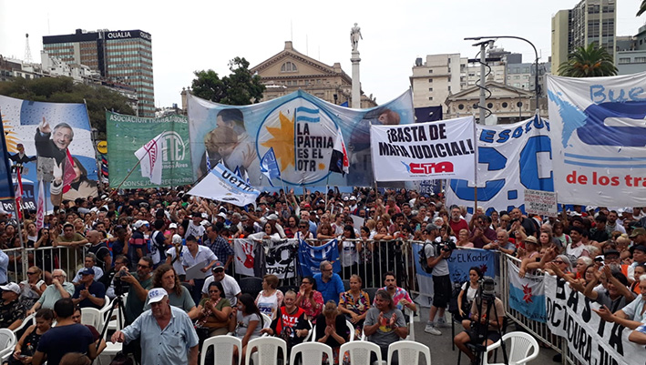在法庭前进行了迫害的大规模谴责 
 司法和刑事犯罪的人犯罪和否认攻击 
 媒体，司法和政治运动以及在 
 对遭受威胁和威胁的同事的团结 
 攻击 

 我们汇合了将该中心置于政治审判中的部门 
 最高法院，并试图禁止克里斯蒂娜副总统 
 费尔南德斯·德·基尔奇纳(Fernándezde Kirchner)。 

 在国歌之后，组织代表讲话 
 现在，包括Taty Almeida de Mothers创始人雨果Yaski De 
 工人的CTA，CCC的Ramiro“ Vasco” Berdesegar，Hugo Cachorro 
 Godoy de CTAAutónoma，Omar Plaini de Canillitas，HéctorAmichetti 
 布宜诺斯艾利斯图形联合会，副胡安·马里诺(Juan Marino)，胡安·玛丽亚(JuanMaría)法官 
 拉莫斯·帕迪拉(Ramos Padilla 
 他声称“一个没有司法黑手党的庄严的家园 
 当他们签署2×1英寸时，他们忽略了人权。 他们是 
 介绍大量领导人和官员，包括三个 
 布宜诺斯艾利斯省政府的部长和部长。 

 ** CCC的Ramiro“ Vasco” Berdesegar的话** 

 Ramiro Berdesegar强调了社会组织的统一， 
 联盟，政策，人类和宗教权利存在，并发送了“ 
 兄弟般的问候，热和班级，给原始同伴 
 农民，学生，向利马游行的工人，从 
 12月7日面临政变和压制。 我们毫无疑问 
 在那些同伴中，图帕克·阿马鲁(Tupac Amaru)的旗帜 
 Micaela Bastidas，Panchito Solano和每个拥有的同伴 
 通过解放这个拉丁美洲的解放而留下了生活。 巨大的掌声 
 对于他们每个人，我们都大声喊叫，实现秘鲁人民的叛乱!” 

 “昨天已知最后一次人口普查的数据：46,044,703 
 从北到南的阿根廷居民。 这是一个 
 自2010年上一次普查以来，我们人口的14.77％的增长。 
 绘制我们人民的活力，成长的活力。 另一个脸 
 想要永远留下的人的静态是四个 
 多年来，“至高无上”只安装了平行的政府 
 捍卫躲在背后的经济团体的利益 
 他们。”伯德斯加说。 

 CCC负责人提供了更多的人口普查数据，并指的是 
 女人指出：“每天都有成千上万的同伴 
 他们在流行的餐厅里搅拌锅，成千上万的保证 
 生产，成千上万的农民，其中许多没有土地， 
 保证每个绿带中的食物 
 他们迈出了大流行中的卫生促进者的一步，没有 
 这些是这个邪恶的最高法院代表的妇女 
 四个不仅从他们的班级角度来看 
 性别观点只有对我们的人民的印刷失败。” 

 伯德斯加尔指出，由于人口普查数据，布宜诺斯艾利斯省是 
 在科尔多巴，圣达菲和 
 第四架Caba，有3,120,000，想知道“这些星系是什么生活 
 “至高无上”施加威胁联邦制和 
 像几个月前一样，合作的参与？” 

 “很明显，当人们读到这个上瘾的正义的每个失败时 
 宏观只找到对阶级利益的辩护 
 这个国家的真正所有者，1823位伟大的土地所有者 
 他们在我们的家园中拥有50％的生产土地，牺牲了数千美元 
 来自土著人的农民从土地和地区流离失所。 
 在这些失败中 
 和食品生产商，这20个大公司，每天 
 他们从我们的孩子那里拿走食物，肉类，牛奶。 

 “但是，在这一正义的每个失败中，深处都被隐藏了 
 阶级讨厌流行部门。 班级讨厌他们留下的表达 
 当他们批准同伴米拉格罗·萨拉(Milagro Sala)的谴责时。 班级讨厌那个 
 法官从2021年11月至去年7月到期 
 尽管没有反对虚假投诉的证据，但他命令我们 
 单击手机以数十个领导者和同伴 
 我们的组织从我们的房屋下令进行身体迫害 
 实时聆听，并没有与他们联系，但订购了23 
 突袭我们同伴的房屋，饭厅，到达 
 生产单位。 我们知道他们想要什么，他们想将我们定为犯罪，
他们永远无法屈服于他的膝盖 
 面对他们，我们将继续在街上。 

 “最后，我想批准统一路径，汇合 
 多部门希望能够生下我们的家园 
 儿女。 同事，没有退后一步。” 

 [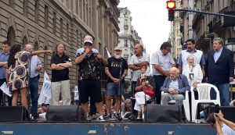](http://pcr.org.ar/nota/basta-de-persecucion-a-las-y-
los-que-luchan/acto-en-la-corte-suprema-1/)

News Source: [https://pcr.org.ar/nota/basta-de-persecucion-a-las-y-los-que-luchan/](https://pcr.org.ar/nota/basta-de-persecucion-a-las-y-los-que-luchan/)

<!--NEWS-->

# 芬兰工人革命成立105周年

作者: lipunkantaja

时间: 2023-02-02T99:00:00

图片: ['[stvk23a.png](https://punalippu.noblogs.org/files/2023/02/stvk23a.png)', '[stvk23b.png](https://punalippu.noblogs.org/files/2023/02/stvk23b.png)', '[stvk23c.png](https://punalippu.noblogs.org/files/2023/02/stvk23c.png)', '[stvk23d.png](https://punalippu.noblogs.org/files/2023/02/stvk23d.png)']

类别: ['Yleinen']

<!--METADATA-->

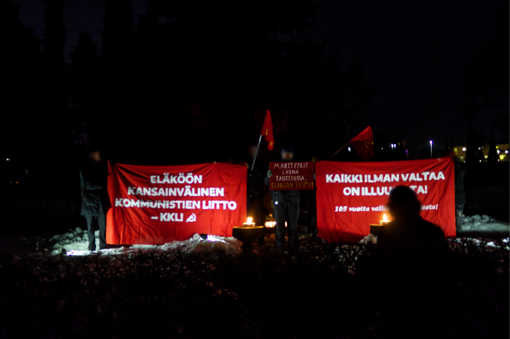1月27日，星期五，芬兰工人的革命庆祝了105。 
 周年纪念日。 为了纪念这一点，与红色坟墓监视器有机会 
 赫尔辛基的马尔米公墓。 在唱歌，诗歌表演和 
 主题演讲结合了对红色阶级英雄牺牲的记忆和 
 他们工作继续在芬兰工作的忠诚度 
 世界革命，作为国际共产主义运动的一部分 
 努力。 这也反映在国际共产党协会的旗帜中 
 Bankerolls和[土耳其同志烈士 
 一个星期](https://demvolkedienen.org/index.php/en/t-international-
en/7439-turkey-action-for-the-foundation-of-the-icl-and-further-activities-in-
memory-of-the-martyrs-of-the-party-and-the-revolution)消息指示 
 “战斗中出现的烈士，直播TKP/ML!” 

 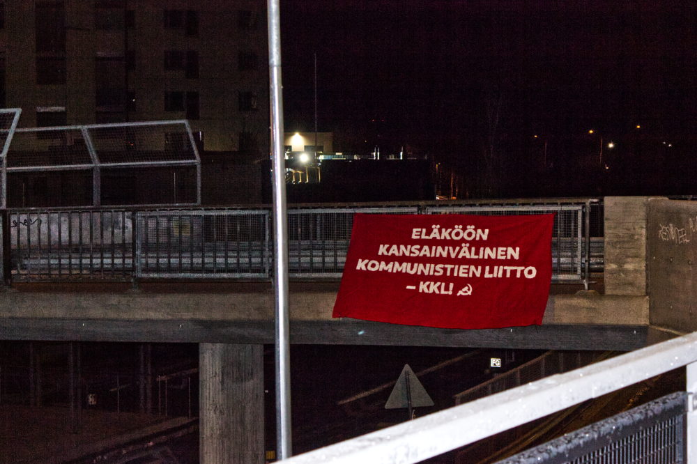_“国际共产主义协会 -  KKL!” _ _ _ 

 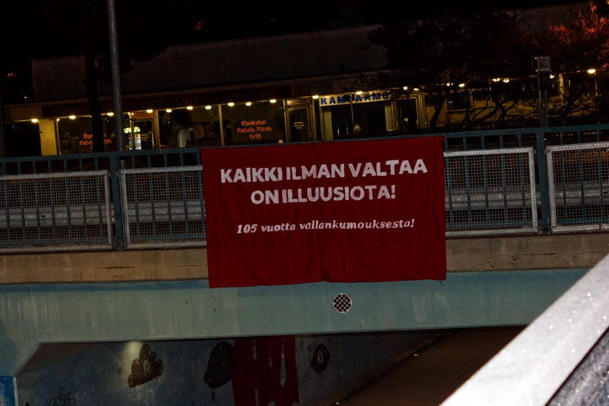_“所有没有权力的都是幻想!革命的105年!” _ _

News Source: [https://punalippu.noblogs.org/post/2023/02/02/suomen-tyovaen-vallankumouksen-105-vuosipaivana/](https://punalippu.noblogs.org/post/2023/02/02/suomen-tyovaen-vallankumouksen-105-vuosipaivana/)

<!--NEWS-->

# 我们否定了刘易斯和他的暴徒的暴力和侵略

作者: carga

时间: 2023-02-02T99:00:00

头部描述: 

描述: 在大规模的多部门游行之后，周二有一千多人，主权动员和塔科菲路的开放五天，周三在我们周二在我们周二在附近的道路入口进行了新的游行第七电话。 但是这次，Al＆Hellip;

图片: ['[Agresiones-de-Lewis-1-de-feb-w.jpg](https://pcr.org.ar/wp-content/uploads/2023/02/Agresiones-de-Lewis-1-de-feb-w.jpg)']

类型: article

<!--METADATA-->

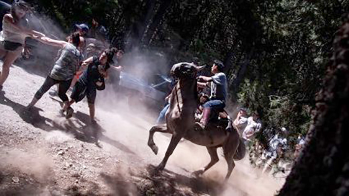在大规模的多部门游行之后，周二有一千多人 
 以及五天的主权动员和路径的开放 
 塔库菲，周三在入口处进行了一次新游行 
 我们星期二在第七次通话中所处的邻里道路。 但是这个 
 时间，当试图超越tranquera时，刘易斯的捍卫者骑马和 
 他们用棍棒，石头和气体袭击了抗议者。 

 我们否认行使的暴力行为，并要求其行动迅速，并且 
 保证受害者的健康和完整性。 

 阿拉贝拉·卡雷拉斯政府不仅违反了宪法，而且还违反了 
 司法失败，现在也释放该区域，并允许这种类型的 
 畸变 

 我们支持几年前的确认：刘易斯在 
 里奥·黑格罗(RíoNegro)共同进行改变，我们在一起是里奥·黑人(RíoNegro)。 

 2023年2月1日

News Source: [https://pcr.org.ar/nota/repudiamos-la-violencia-y-agresiones-de-lewis-y-sus-matones/](https://pcr.org.ar/nota/repudiamos-la-violencia-y-agresiones-de-lewis-y-sus-matones/)

<!--NEWS-->

# 雅典 反战利分的提案：对于31/1会议 - 周五3/2，7.30pm AT的新会议“墙壁”除外 -KKE（M-L）

作者: ΚΚΕ(μ-λ)

时间: 2023-02-02T99:00:00

描述: 组织和学院的会议于2月31/1日星期二在雅典举行。

图片: ['[ap23029343183231.jpg](https://www.kkeml.gr/media/2tzh1e0d/ap23029343183231.jpg)']

类型: article

<!--METADATA-->

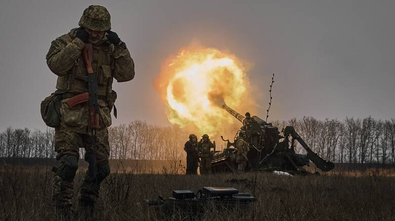组织和组织的会议于周二31/1在雅典举行 
 集体，基于KKE提案(μ-λ)对于“宽大的战争” 
 二月份的共同行动。” 鉴于 
 从乌克兰战争开始就完成了一年， 
 计划访问美国外交大臣，眨眼到希腊 
 以及该地区的国家。 

 会议由NAP，CMA，ARA，LAD，她的代表参加 
 冲突和受欢迎的战线。 在他的位置中(μ-λ)作证 
 他对发展的看法并介绍了提案的内容 
 的要求，需要打破长期的沉默和不活动 
 关于美国北约帝国主义与与之冲突的运动 
 乌克兰的俄罗斯及其喂食的噩梦。 出来 
 其中，拟议动员于2月21日，那天 
 接近战争开始的一年周年纪念日 
 也有传言说，眨眼将访问该国。 提议 
 动员使我们非常关注不公正战争的抱怨 
 帝国主义者主演的帝国主义者的愤怒，当地统治者 
 将该国变成美国老板的基础 
 并在此基础上让人们参与其反动对抗 
 土耳其资产阶级以及对他到来的赛车谴责 
 美国帝国主义的代表。 从此内容得出 
 我们认为应该遵循的示威之路， 
 与大使馆相反，美国和俄罗斯人。 

 在午睡，CMA和比赛的侧面，有特殊的视野 
 当然，每个组织都有关于其内容的一般协议 
 提议。 但是，从不同的起点表达了分歧 
 与示威的拟议路线。 午睡和CMA，参加 
 他们在反战争计划中共同提出了实现 
 在两个大使馆的日期与 
 眨眼的访问。 

 在其余力的位置中，对 
 需要终止战争，并试图将其与 
 眨眼访问，专注于答案 
 给它运动。 事实并没有使我们特别 
 印象，作为一系列组织对 
 问题，从被剥夺的 - 无罪释放的俄罗斯帝国主义移动 
 直到公开接受人们对人民利益的征服 
 他的选择，以反美主义和反法西斯主义的名义。 到 
 出现以下对抗是这种障碍 
 安置在反战动员的组织中，不愿 
 这是ARA和LAD公开承认的。 从 
 ARA的一面与战争有关的唯一提议是 
 一个人抱怨北约的扩张，西方制裁和 
 冲突“和平解决”的模型。 

 鉴于无法终止协议，任命已续签 
 通过设置周五3/2的新会议。 尽管有强烈的 
 政治力量之间的分歧坚持 
 试图找到司空见惯的反帝国主义者 -  
 反战的动员，利用为 
 进行一门反对访问代表的挑战的课程 
 美国在该国。 作为这项努力的一部分，我们声明 
 我们寻求妥协和修改项目的心情 
 我们的建议，但没有意图 
 我们在口号的本质背后做：“人民不需要 
 顾客的一位纵火犯不为所动 
 战争和人民的凶手。

News Source: [https://www.kkeml.gr/αθηνα-προταση-για-αντιπολεμικές-κινητοποιήσεις-για-τη-σύσκεψη-της-31-1-νέα-σύσκεψη-την-παρασκευή-3-2-7-30μμ-στο-εκτός-των-τειχών/](https://www.kkeml.gr/αθηνα-προταση-για-αντιπολεμικές-κινητοποιήσεις-για-τη-σύσκεψη-της-31-1-νέα-σύσκεψη-την-παρασκευή-3-2-7-30μμ-στο-εκτός-των-τειχών/)