# 汉堡：墨西哥瓦哈卡州目前的战斗团结一致的行动

作者: DEM VOLKE DIENEN

时间: 2023-02-03T00:16:00+00:00

图片: ['[HH-solifürMexiko0223-Anzeige.JPG](https://www.demvolkedienen.org/images/HH/2023/HH-solifürMexiko0223-Anzeige.JPG)', '[HH-StooptdenTerrorgegendasMexikanischeVolk0223-1.JPG](https://www.demvolkedienen.org/images/HH/2023/HH-StooptdenTerrorgegendasMexikanischeVolk0223-1.JPG)', '[HH-SolifürMexiko0203-2.JPG](https://www.demvolkedienen.org/images/HH/2023/HH-SolifürMexiko0203-2.JPG)']

标签: None

类别: None

<!--METADATA-->

汉堡在穷人的战斗中使同志们团结一致的音频行动 
 反对Tehuantepec地峡上帝国主义大型项目的农民 
 发达。 所以两个横幅被吊死。 第一个透明 
 在汉堡大学举行，第二次在火车站举行 
 Sternschanze，下周三下午6点举行集会。 
 我们目前分享的图片已发送给我们。 

  呢(Images/HH-StooptdenTerrorgegendasMexikanischeVolk0223-1.JPG)

News Source: [https://www.demvolkedienen.org/index.php/de/t-international/7457-hamburg-aktionen-in-solidaritaet-mit-den-aktuellen-kaempfen-in-oaxaca-mexiko](https://www.demvolkedienen.org/index.php/de/t-international/7457-hamburg-aktionen-in-solidaritaet-mit-den-aktuellen-kaempfen-in-oaxaca-mexiko)

<!--NEWS-->

# CPI（毛主义）小队在卡拉汉迪地区被安全部队逮捕

作者: Alan Warsaw

发布时间: 2023-02-03T05:57:39+00:00

更新时间: 2023-02-04T19:58:55+00:00

图片: ['[Top-cadre-female-Maoist-surrenders-before-police-in-Koraput-district-800x445.jpg](https://www.redspark.nu/wp-content/uploads/2022/03/Top-cadre-female-Maoist-surrenders-before-police-in-Koraput-district-800x445.jpg)']

标签: ['Central Reserve Police Force', 'Civil Police Force', 'CPI (maoist)', 'CPI(maoist)', 'CRPF', 'India', 'Kalahandi District', 'Naxal', 'naxalites', 'naxals', 'Odisha', 'Odisha State', 'police', 'PPW in India']

类别: ['India', "People's War"]

<!--METADATA-->

**卡拉汉迪区，2023年2月3日：**一支属于的武装干部 
 CPI(Maoist)安全后设法逃入茂密的森林 
 部队在萨马哈拉和波尔加尔储备森林下发起了一项行动 
 奥里萨邦卡拉汉迪区的纳拉警察局地区周四。 

 根据奥里萨邦警察局总部的说法，卡拉汉迪(Kalahandi) 
 有关武装CPI移动的可靠信息(Maoist)小队 
 丛林地区，一项反马奥主义者的行动于2023年启动 
 CRPF 64'的部队(Sikerkupa)和民事警察人员。 

 在手术过程中，士兵注意到少数武装CPI的移动(Maoist)穿着武器的黑色制服的干部。 同时CPI(Maoist)干部 
 还注意到该地区存在安全部队，并立即 
 开始逃离警察部队逃避逮捕。 

 行动团队试图逮捕毛派主义者，但他们设法逃离了 
 摆脱丘陵地形和茂密的森林。 

 在彻底搜索该区域后，行动方恢复了一个SBML 
 乡村制造的枪支，九个电力雷管，11胶棒，1个毛主义 
 横幅，1个电动延长板，4炮电池，2个蚊帐，2个水 
 瓶子，1个黑色聚乙烯，1 AX，2个火炬灯，1鞋，1对 
 拖鞋。 

 >资料来源：https：//pragativadi.com/armed-maoists-evade-Arrest-in-kalahandi- 
 >森林/

News Source: [https://www.redspark.nu/en/peoples-war/cpi-maoist-squad-evades-arrest-by-security-forces-in-kalahandi-district/](https://www.redspark.nu/en/peoples-war/cpi-maoist-squad-evades-arrest-by-security-forces-in-kalahandi-district/)

<!--NEWS-->

# PC 2月3日 - 最大利润，最低工资＆＃8230; 提高工资的战斗是正确的，必要的，紧急的＆＃8230; 学习资本有多紧急

作者: prolcompal

时间: 2023-02-03T14:07:00+01:00

图片: ['[cruscotto%20cisl.png](https://blogger.googleusercontent.com/img/b/R29vZ2xl/AVvXsEhMNijb_MLwb26Gfs22wnax35_cHqf1s9-HMcvVUlMl2G3UBS3ksu0QtrKJkqQIu-aAZxuFs1F4ap8h_JguC3vJUMYH3aTt1zVGnxnRkTa38lllt4vN8_GeYIxDYdfeHbQ5Yjdrbr2QN1rhjYDJZA5mrvVpskqh_fnCRrf8Fts_T19qaqCwGWOATJMzJQ/w543-h306/cruscotto%20cisl.png)', '[LOC%20FORMAZIONE%20MARXISTA%206FEB.jpg](https://blogger.googleusercontent.com/img/b/R29vZ2xl/AVvXsEj9Hbc7Zy0nPQDuuXgCMKvh8E4Eih0EM9xELG37X0SVLh1M_EvES1YuJnRS9XC7zn6rQjHQkG61omufujw7ZmTzYWD2NQ6cERSN3DmeWudigkH81HtUchQ_5xy7-0gMC9JvKZ8yaLfjtpu3lY1zZfWjfYB7BxB6V_6c8QfD2MOkjlcKu0e214wH-2ks6g/w284-h411/LOC%20FORMAZIONE%20MARXISTA%206FEB.jpg)']

<!--METADATA-->

这些盒子取自“金属加工的仪表板” 
 他们在1月24日公开发表 
 明确的是大师赚钱，工人失去了 
 这些年来他们的薪水。 

 CISL以一千种方式帮助这种降低工资的帮助 
 拥有协议，合同等的硕士 ETC。 和“仪表板”(su cui torneremo)他们提出的完全充满了这一立场。 最重要的 
 目前：“生产力，**意大利经济的历史疾病**，是 
 在十年内增长了15个百分点。 

 这正是抱怨这种疾病的主人的声音 
 历史”，而CISL则说，尽管存在危机，但 
 生产力提高了，也就是说，工人的工作越来越多 
 强烈!

 这不是新颖性，因为“ **资本家不断尝试 
 将工资降低到其最低物理限制**，并延长 
 我从事它的身体限制Massimo ...”正如马克思在_Salario，Price和 
 利润_添加的位置，以加强“ ** 
 资本主义生产不是要提高平均正常工资，而是 
 减少它**。” 

 这就是为什么需要每天在薪水上及以后的战斗， 
 仍然马克思：“如果工人阶级在他的冲突中屈服于怯ward 
 每天都有资本，它将被剥夺 
 进行任何更大的运动。” 

 在这场战斗中，我们必须支持理论形成!

 

News Source: [https://proletaricomunisti.blogspot.com/2023/02/pc-3-febbraio-profitti-al-massimo-e.html](https://proletaricomunisti.blogspot.com/2023/02/pc-3-febbraio-profitti-al-massimo-e.html)

<!--NEWS-->

# AALBORG：Plackets：“直播国际共产党协会！”

作者: socialistiskrevolution

发布时间: 2023-02-03T15:02:56+00:00

修改时间: 2023-02-03T15:02:56+00:00

描述: 我们收到了斑块的文件，在国际共产党协会建立之际，在无产阶级社区以及无产阶级的奥尔堡中心R…建立了斑块。

图片: ['[1.jpg](https://socialistiskrevolution.files.wordpress.com/2023/02/1.jpg)', '[2.jpg](https://socialistiskrevolution.files.wordpress.com/2023/02/2.jpg)', '[3.jpg](https://socialistiskrevolution.files.wordpress.com/2023/02/3.jpg)', '[4.jpg](https://socialistiskrevolution.files.wordpress.com/2023/02/4.jpg)', '[5.jpg](https://socialistiskrevolution.files.wordpress.com/2023/02/5.jpg)', '[6.jpg](https://socialistiskrevolution.files.wordpress.com/2023/02/6.jpg)', '[7.jpg](https://socialistiskrevolution.files.wordpress.com/2023/02/7.jpg)', '[8.jpg](https://socialistiskrevolution.files.wordpress.com/2023/02/8.jpg)', '[9.jpg](https://socialistiskrevolution.files.wordpress.com/2023/02/9.jpg)']

类型: article

类别: ['Uncategorized']

<!--METADATA-->

我们在那里收到了斑块的文件 
 国际共产党协会已经在两位无产阶级建立 
 社区以及奥尔堡无产阶级革命者中心。 

 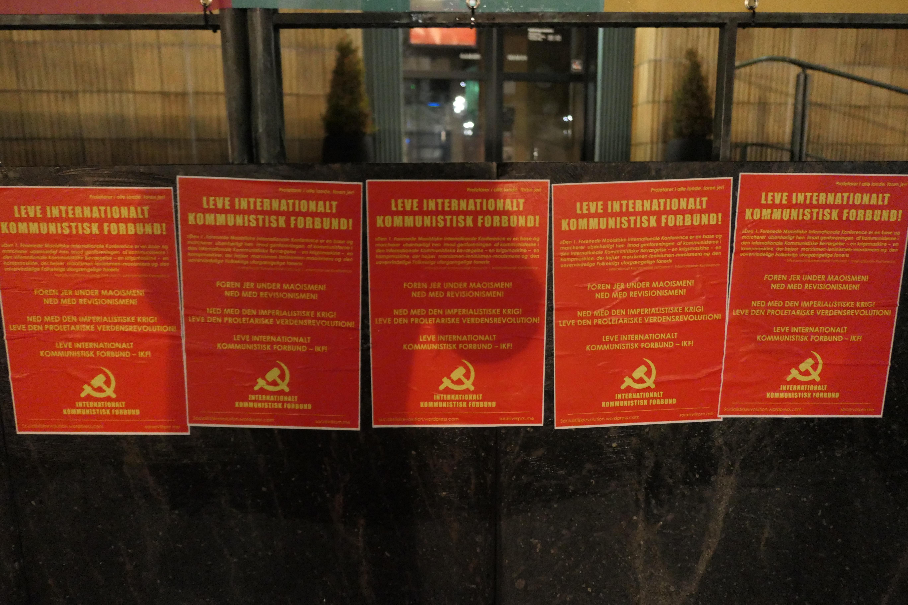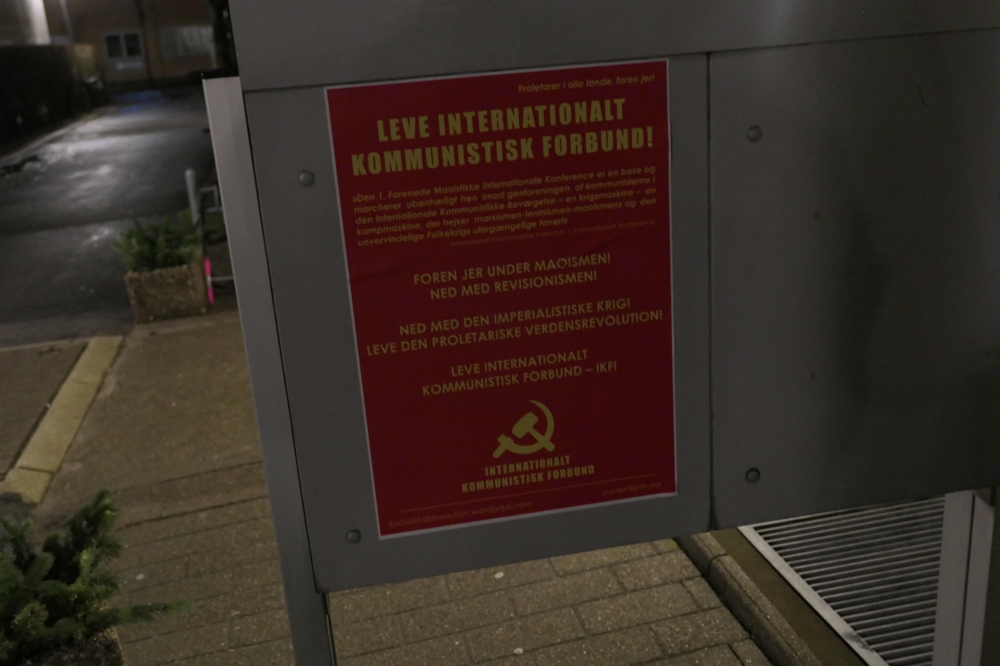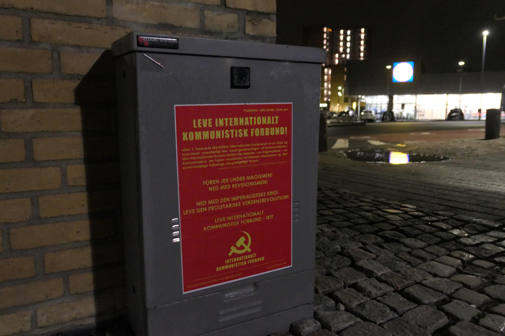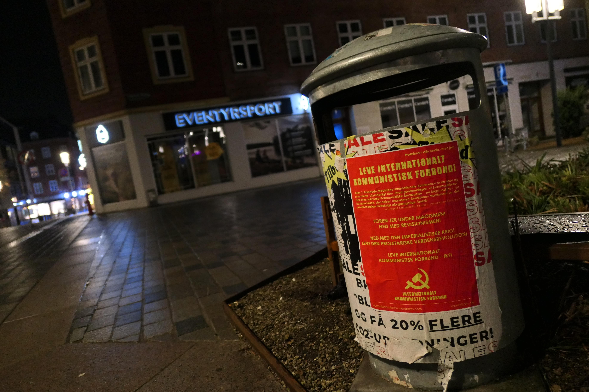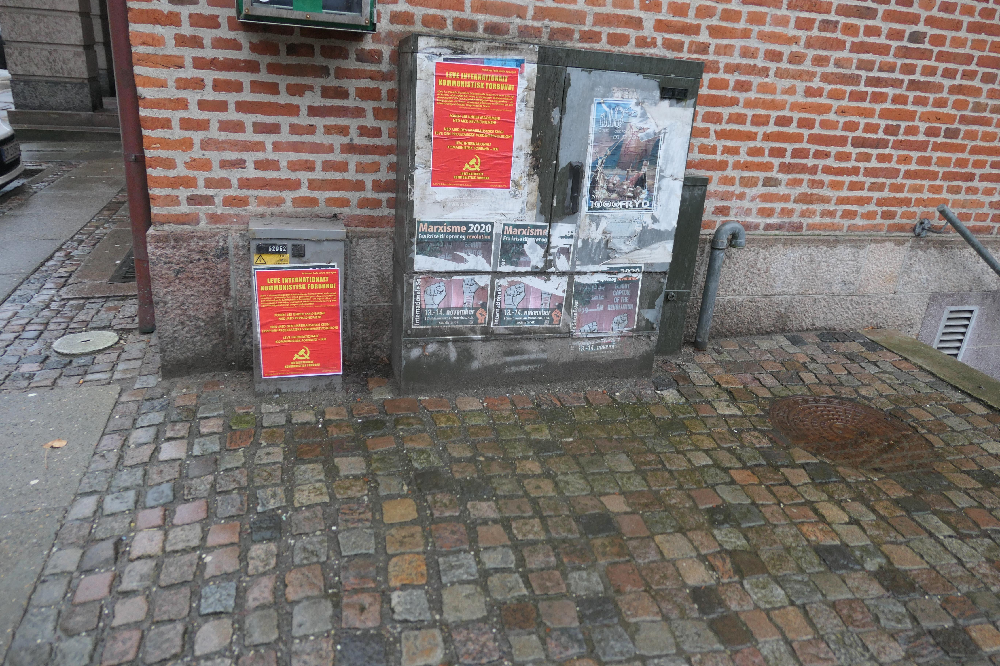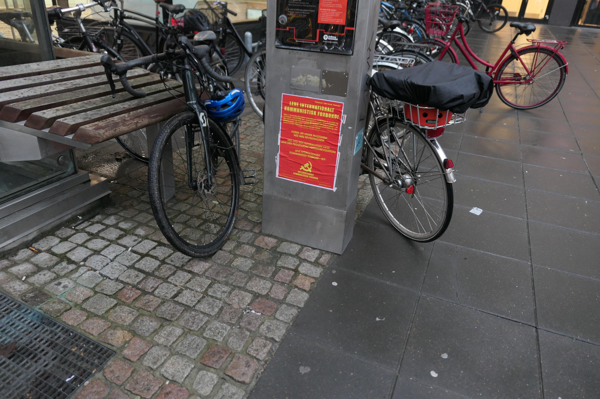

News Source: [https://socialistiskrevolution.wordpress.com/2023/02/03/aalborg-plaketer-leve-internationalt-kommunistisk-forbund/](https://socialistiskrevolution.wordpress.com/2023/02/03/aalborg-plaketer-leve-internationalt-kommunistisk-forbund/)

<!--NEWS-->

# 巴西新民族：每周社论 - 反动民兵之前的投降数学 *[2月3日，2023年2月3日]：2023-02-03T11：50：00-08：00：00：00：00：00：00：00

作者: Verein der Neuen Demokratie

描述: 社论和2023年2月2日，每周社论 - 数学 
 反应性武装分子营的投降...

*[Febrero 03，2023]: 2023-02-03T11:50:00-08:00

时间: 2023-02-03T16:05:00+01:00

图片: ['[Banner_Portal1223.jpg](https://blogger.googleusercontent.com/img/b/R29vZ2xl/AVvXsEggmO0qP53BkJDQ32LmcpPSq0RMHIh08ap3LmKMzeE94EZY4V5J-M3yZOVjAHRdrSgcrBFDuUg1-sYO3J-_BSWLbeIl2bGFprTs18CXhB8VmTGlNBNO3fzMKRlc-5HstCfDHj6zscMvcfZ_xibwfslaESIDp6nT4-yx89sQCmlTK5MgAbBjzShDgld1Jg/w640-h458/Banner_Portal1223.jpg)']

<!--METADATA-->

社论和 

  2023年2月2日 

 每周社论 - 米利特之前的耕作数学 
 试剂 

 [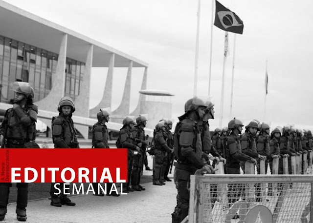](https://blogger.googleusercontent.com/img/b/R29vZ2xl/AVvXsEggmO0qP53BkJDQ32LmcpPSq0RMHIh08ap3LmKMzeE94EZY4V5J-M3yZOVjAHRdrSgcrBFDuUg1-sYO3J-_BSWLbeIl2bGFprTs18CXhB8VmTGlNBNO3fzMKRlc-5HstCfDHj6zscMvcfZ_xibwfslaESIDp6nT4-yx89sQCmlTK5MgAbBjzShDgld1Jg/s900/Banner_Portal1223.jpg)在平面宫前的冲击营。 照片：阿曼达 
 Perobelli/Reuters 

 当路易斯·伊纳西奥(Luiz Inacio)于21日解雇约80名军队时，有很多噪音 
 在平面和当时的陆军指挥官JúlioCésar服役 
 Arruda，用TomásMiguelRibeiro Paiva代替。 有些人惊呆了 
 在对资产阶级民主及其“稳定”的盲目信仰之前 
 在该国饮食机构和洋基帝国主义“不允许 
 政变“宣称现金“卢拉政府” 
 它已经在那里开幕，没有保护武装部队。 路易斯·伊纳西奥(Luiz Inacio) 
 宣布他不信任武装部队，他想担任 
 机构安全(GSI)没有军事装备，与公众一起玩 
 那不会接受军事命令助手(y poco después, tenerlos)，，，， 
 在他不会遭受“军事力量”的阶段，以治疗 
 通过隔离限制将军的操纵边缘 
 公众舆论。 

 在31日，“令人惊讶”的总良心零人 
 政治，路易斯·伊纳西奥(Luiz Inacio)任命了122名士兵参加GSI。 数学是 
 克拉拉：而不是限制民兵的存在，因此 
 在政府的影响力，共和国总统增加了他们!
 媒体立即报道，PT给予了军队的认可 
 防止联邦区总理将于1月8日晚上采取行动 
 在陆军总部对阵营地。 这一集， 
 涉及用武装坦克的演习来阻止PM，这是 
 鉴于将军的压力，由路易斯·伊纳西奥(Luiz Inacio)批准。 众所周知，这个 
 机动进行了，以便活跃和预备役军官及其家人 
 他们可以离开营地而不会被捕。 

 现在这揭示了什么？ 加强路易斯·伊纳西奥(Luiz Inacio)的阶段， 
 发生了什么并与军方经过，持续的少于肥皂，因为 
 归因于政府的所谓力量是嵌合体，一种幻想。 这 
 机会主义和自由主义者并不夸张说对这个民主的辩护 
 腐败和宽松的资产阶级以及各种对人民的暴力行为 
 相反，它使它们移动，引起厌恶，最重要的是 
 不信任和愤怒。 他们假装不知道，但是他们非常清楚，在政治中 
 有效的力量是群众，而不是实体和指控的笔记，无害 
 当他们没有物质支持时。 但是他们想相信这一点，并试图欺骗 
 群众还创造了这个幻想。 

 政府试图通过协议限制政变 
 内阁和宏伟的关于“民主”的声明 -  
 他们日常生活中广泛的群众未知 - 它只会变成 
 无能，而真正的力量越来越多 
 一般的( hoy, las tropas y, ahora, están jugando a ganar a las masas,
principalmente a la pequeña y mediana burguesía y apoyándose en los
evangélicos bolsonaristas entre los pobres)。 政府倾向于 
 投降； 毕竟，如果从 
 2018年大选在常数面前保持沉默 
 军事政变声明？ 不是一个批评，只有 
 app脚!毕竟，联合政府可以做什么 
 反动的资产阶级和土地所有者行使权力 
 帝国主义的仆人？ 如果我有最低礼节，请立即 
 我会把群众召集到街上以捍卫自由 
 民主威胁!

 同时，土著人民被杀害，如在可怕和刑事案件中 
 反对Yanomami，农民在他们的 
 争取地球的公平斗争。 1月28日上午，Bope警察来自 
 隆多尼亚军事警察向农民开枪，他们爬进 
 乘船过河； 军方逮捕了两个年轻人， 
 他们拖了一个分开的地方，遭受了酷刑，甚至开始 
 对其中一个人进行语言，然后用冷血执行它们。 垄断 
 媒体，杰出的政治和正义机构，英雄 
 对这个民主的辩护，完全保持沉默。 这无关 
 与他的民主国家，对吧？ 

 还必须说，陆军下的将军的改变， 
 由路易斯·伊纳西奥(Luiz Inacio)制造，武力的性质没有任何改变 
 他甚至改变了自己的政变意图，这是高处的一致性
情况最终导致军事政变。 只是看到现在的称赞 
 “法律主义者指挥官”，托马斯·米格尔·里贝罗·佩瓦(TomásMiguelRibeiro Paiva)也被认为是同样的 
 主角在撰写Villas-Bôas的恐吓推文中，反对 
 路易斯·伊纳西奥(Luiz Inacio)的HC，2018年 - 一条推文，顺便说一句，ACFA撰写了 
 干预民族政治生活。 这是“合法的将军”， 
 巴西对新闻界的垄断的最大保证 
 机会主义。 多么糟糕的床单覆盖了他们!

 ACFA每天都在计算和重新制定其干预计划 
 军事，寻找合适的时间进行干预，促进少量 
 使用“绿鸡”作为大炮肉和 
 很快，与政府签署了新协议 
 在纸上加固。 节制力量； 同时，寻求赢得 
 他在北方主人的支持，并支持公众舆论尝试 
 当他们用自己的抬起自己的时候，粉碎小镇的举起 
 公平的愤怒。 

 为了停止政变，不可能拥有贵族 
 机会主义的，醉酒了数十年的鸡尾酒，在旧州的宫殿中 
 对更多人的期望。 最低限度是依靠 
 群众每天动员他们的最低践踏权利， 
 通过罢工，射击，大学和学校的职业， 
 革命抗议和斗争的洪流； 没有幻想 
 富人的民主。 

   *[2023年2月3日]：2023-02-03T11：50：00-08：00

News Source: [https://vnd-peru.blogspot.com/2023/02/a-nova-democracia-brasil-editorial.html](https://vnd-peru.blogspot.com/2023/02/a-nova-democracia-brasil-editorial.html)

<!--NEWS-->

# 80年前，斯大林格拉德的胜利

作者: Tjen Folket Media

描述: 我们在共产主义国际（Ci-ic.org）的同志发表了一篇有关红军在1943年赢得希特勒法西斯主义的历史胜利的文章。斯大林格拉德不仅是一个转折点...

发布时间: 2023-02-03T19:00:00+00:00

修改时间: 2023-02-03T13:03:20+00:00

图片: ['[Stalin-17.-partikongress-1.jpg](https://tjen-folket.no/wp-content/uploads/2020/09/Stalin-17.-partikongress-1.jpg)']

标签: None

类别: 'Historie'

<!--METADATA-->

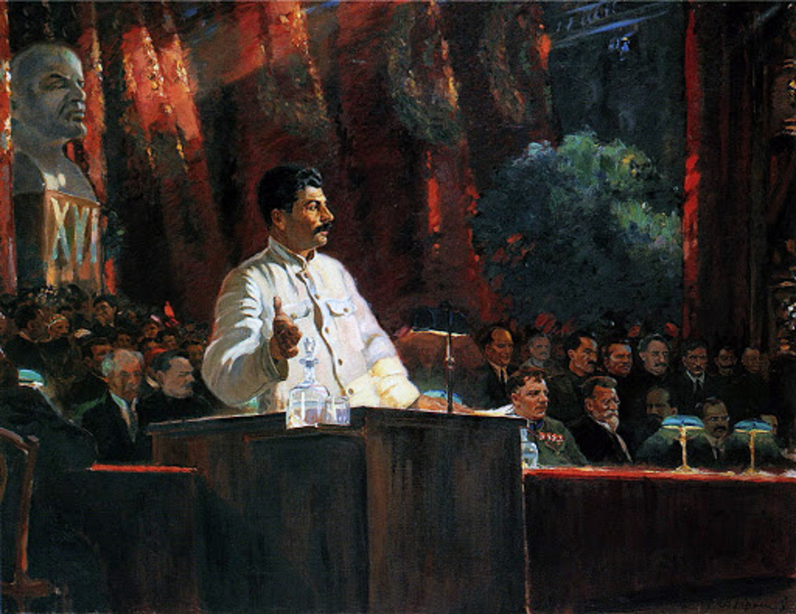* * * 

 由Eart Folket Media的评论员。 

 * * * 

 **我们在共产主义国际的同志(ci-ic.org)已经出版了 
 关于历史胜利的文章，红军赢得了希特勒法西斯主义 
 1943年。斯大林格拉德不仅在战争中，而且是人类的转折点 
 历史。** 

 同志们写道，国际共产主义协会已担任董事长 
 毛主义的立场：斯大林同志是一位伟大的马克思列宁主义者，定义 
 列宁主义并在第二次世界大战中发挥了至关重要的作用，尤其是在基础上 
 共产主义国际第七届国会大会。 同志们看 
 与此职位有关的文章。 

 他们写道，毛主席毛泽东将斯大林格拉德战的定义为 
 苏联与德国之间战争的转折点，或 
 反法西斯主义世界大战，但人类历史上的转折点。 

 在斯大林同志的伟大领导下，苏联领导了 
 公平战争，大规模和英勇的防御 
 地球战术，并以2500万的价格赢得了希特勒法西斯主义 
 苏联生活。 这场伟大的战争对于启发和产生也很重要 
 在第三世界的殖民地中，公平的解放战争。 

 德国Wehrmacht袭击了Stalingrad，于1942年8月23日接管了这座城市。 
 由于这座城市的重要性，它是斯大林的名字。 按照伴侣的顺序 
 斯大林他要求红军的更大努力和牺牲。 在这一点 
 该命令说斯大林同志： 

 «每个指挥官，红军的士兵和政治专员都必须了解 
 我们的手段不是无限的。 苏联国家的领土不是沙漠， 
 但是人 - 工人，农民，情报，我们的父亲，母亲，妻子， 
 兄弟，孩子。 敌人征服或 
 想要征服的是陆军，金属和燃料的面包和其他产品 
 工业，工厂，为军队提供武器和弹药的工作， 
 铁路。(…)进一步的撤退意味着浪费自己和同时浪费自己 
 牺牲我们的祖国。(…)如果我们不停止务虚会，我们将没有面包， 
 没有燃料，无金属，无原材料，没有工厂和工程，没有 
 铁路。 这导致了一个结论，是时候停止撤退了。 
 不一步一步!”(Vår egen oversettelse.)斯大林同志宣布务虚会被视为背叛。 人口 
 Stalingrad被纳入对WEHRMACHT的武装抵抗力。 法西斯主义者 
 6.陆军占领了这座城市，但通过天王星行动在乔治的领导下行动 
 Zjukov和Aleksandr Vasilevsky，在北部和西部有组织部队 
 城市。 红军包围了斯大林格拉德，捕获了近30万 
 敌方部队在那里切割供应线，然后拧紧握把 
 越来越多。 

 同志们写道，斯大林格拉德战役表明，战争是 
 人们，而不是最重要的武器。 战斗不仅从 
 街道到街和房子到房子，但从房间到房间，这是英勇的 
 人类历史上震撼了世界的章节。 

 同志们写道，法西斯对苏联的进攻由 
 纳粹分子以及来自意大利，西班牙，罗马尼亚，匈牙利的法西斯主义者的支持 
 来自乌克兰的班德拉老鼠，扔了数百万部队，我们最好的是 
 他们的空军75％进入入侵，但那个斯大林和苏联 
 被准备并成功抵抗。 原因之一是美妙 
 情报服务，同志写道。 另一个约瑟夫·斯大林的处理 
 外交。 此外，苏联还使用战略辩护 
 烧毁了地球的战术和党派的党派。 他们炸毁了苏联 
 大坝和拆除工厂，以便敌人不应该得到任何东西 
 最好。 德国纳粹无法想象社会主义者 
 祖国将采取这种措施与他们作战。 

 同志们写道，无产阶级的独裁统治处于危险之中，革命站了起来 
 受到威胁，那个人无法停止思考或允许自己留下来 
 以某种方式受到阻碍。 他们写了关于英雄游击队的人，他们被留在后面 
 独自在敌方线后面，用步枪，弹药和伏特加酒等待 
 敌人，德国纳粹平均失去了十个人 
 党派清算时。 

 同志们写道，在考虑时，人们不能忘记斯大林的领导 
 他，以及他如何一直坚持战争士气的重要性， 
 如何将纳粹的征服标签和下巴交叉扔在地上 
 在列宁的陵墓面前。 主要的军事胜利也是道德上的 
 胜利。 他们写道，巴西的同志们说，击败了 
 第二次世界大战中的法西斯主义是其中的主要事件之一 
 无产阶级革命。 三个重要的帝国主义大国，德国， 
 日本和意大利被击败。 必须考虑这一点，强调和庆祝。
反法西斯主义战争显示了社会主义制度的巨大生命力， 
 帝国主义是现代所有战争的根源，人民将占上风 
 帝国主义是纸虎，击败帝国主义者 
 侵略者必须是所有国家的统一人民的革命力量，并形成 
 最宽泛的国际战线，以对抗的主要敌人 
 世界的人民。 

 同志们这样结束了 
 德国被粉碎，社会主义和东部无产阶级的独裁统治 -  
 德国。 共产党和苏联的红色标签挥手 
 无可否认，黑暗而破碎的德国富裕的雄鹿是一个很好的时刻 
 象征整个英雄和光荣的国际无产阶级 
 史诗般的与法西斯主义在捍卫苏联和发展方面的斗争 
 无产阶级革命。 迪米特罗夫同志的声明 
 在纳粹法庭取得重大胜利后，为苏联设定了路线 
 因此，莱比锡得到了实现：“我们将创建苏联德国!” 

 **参考** 
 [在战斗中胜利80周年 
 Stalingrad](https://ci-ic.org/blog/2023/01/31/on-the-80th-anniversary-of-the-
victory-in-the-battle-of-stalingrad/)

News Source: [https://tjen-folket.no/index.php/2023/02/03/80-ar-siden-seieren-i-stalingrad/](https://tjen-folket.no/index.php/2023/02/03/80-ar-siden-seieren-i-stalingrad/)

<!--NEWS-->

# PC 2月3日 - 另外8名在兰佩杜萨（Lampedusa）死亡的移民：政府和议会在这次大屠杀中参谋

作者: prolcomra

时间: 2023-02-03T20:00:00+01:00

图片: ['[lampedusa_morto_bimbo.jpg](https://blogger.googleusercontent.com/img/b/R29vZ2xl/AVvXsEjUIbNRymUE_dIyqm1DkscKZzA3kcQinDsZgspHnfj5YbeCl5HJ1C7YbLAFkkMFnj9B_q0l8EnEHCRhDCZ4Tdj8MTaW0zjCqhuJ89-EEYwZOs0XWLZGaFDA8vki7-oYotmtO5xOLm0Ck88eZh0bcudxdM2obU-BaW1lx8PgRCfXma3a6peuKbvQ_Z3LDQ/w449-h245/lampedusa_morto_bimbo.jpg)', '[Libia-memorandum3.jpg](https://blogger.googleusercontent.com/img/b/R29vZ2xl/AVvXsEjTBVuajCzhDwkeNLXqO2MyyTh-og41DNbrAX0QwfmyapAPM6ZpchtOoEfOqtgWp-ilHqdxMsnimUsfafY8c1_QN_SjL9EUJ2KZm36VF7Mw5TzSZsScOfyC3vNq8NZ-x33-l2zQ7xq_M20_aNq-XUqOr-hqW6cC5VGgythRwm_SKpf5p7oONeXR9rrrCQ/s320/Libia-memorandum3.jpg)', '[Meloni-Daibaba.jpg](https://blogger.googleusercontent.com/img/b/R29vZ2xl/AVvXsEghiVWk_0PDeEc7sOeyBmUZw1TFefjKZ1etwOA4Vl8Zh7QXgHElKd86F44d7PiO2CT2cOq0IWGqCV9XbG0Jl2jREBWxSn-pbuI4RVib8s21jS-MYvHaamp0M1lLLlIKl2f-BJxDgeBurLmCYp-u1hyDkF3Ki7kZnP1xYYQkr38a_1Gc9xGsJSR3wyLs9g/s320/Meloni-Daibaba.jpg)', '[Libia-memorandum2.jpg](https://blogger.googleusercontent.com/img/b/R29vZ2xl/AVvXsEgr1Qe5k8FynjQJ-vzEo1mj_LZ456SEIuzzDlDwHIrtrx8zokYtfhxcW7_CnORmptAUPmataLy4pppPefs1fYB6PvT7Rl0isY4zOnqykUrdpSjwhasy2O-tr_JwLRi_EcV7ZOvKpBmYjt_uNChhSxdnkvA52NdHPC9gWktIFSu_LGHYlRfaaRls3QP7jw/w496-h299/Libia-memorandum2.jpg)', '[Meloni%20in%20Libia-riassunto.jpg](https://blogger.googleusercontent.com/img/b/R29vZ2xl/AVvXsEg9hg21hl23ARUMxJWdpefUL0Yf0x9G8eS4N5ECvkftycQIaj1VQDXfWYnqKrHlfzY7k2x__zCVV-_pM3aklqVYbroIeohEQdyZqRpMJw2PTW8nIUAVnQdTYouselhkQMdaJOacwMBpcFLpQ9BaGH04Cdmk_OQdyRAXixH3PrQV9LAqhaEhxcS58LFkKw/w462-h341/Meloni%20in%20Libia-riassunto.jpg)']

<!--METADATA-->

** Meloni-Pianciosi-Salvini Trimurti负责!反法令e 
 利比亚的备忘录是种族主义政治的两个工具 
 该政府的反迁移** 

 ** 7天在海上遗弃没有任何救援** 

 虽然今天还有其他移民死亡，但其他8名移民 
 塞进了由Sfax开始的船，然后前往Lampedusa，包括一个 
 新生儿，被种族主义帝国主义的言论杀死 
 不规则的“这个政府实际上掩盖了犯罪分子，种族主义者， 
 与以前的政府连续性的拒绝政策。 

  **该政府的“ 2权重和2个措施”的政策**：理事会理事会 
 部长已分配了5500万欧元以实现干预措施 
 关于确保对人口的救援和援助的需求 
 乌克兰在国家领土上的仪表同时又续签了 
 再过三年，意大利与政府之间的国际备忘录 
 利比亚国民协议。 梅洛尼签署了a 
 计划继续并加强拒绝对海洋的契约 
 从利比亚集中营逃离的人。 

 [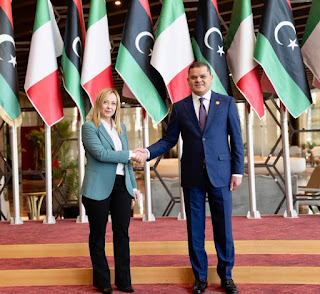](https://blogger.googleusercontent.com/img/b/R29vZ2xl/AVvXsEghiVWk_0PDeEc7sOeyBmUZw1TFefjKZ1etwOA4Vl8Zh7QXgHElKd86F44d7PiO2CT2cOq0IWGqCV9XbG0Jl2jREBWxSn-
pbuI4RVib8s21jS-
MYvHaamp0M1lLLlIKl2f-BJxDgeBurLmCYp-u1hyDkF3Ki7kZnP1xYYQkr38a_1Gc9xGsJSR3wyLs9g/s680/Meloni-
Daibaba.jpg)意大利在欧盟的经济和政治支持下， 
 这些年的注定仅超过1.24亿欧元 
 海军和陆地手段，发动机，卫星仪器，课程 
 训练以及船只的汇款和 
 供应住房模块以创建一个集成系统 
 控制利比亚海事和陆地边界。 

 这是购物天文台进行的下降估计 
 意大利迁徙，大墙，ActionID的户外。 支出 
 难以监视，这两者都为管理方法的复杂性， 
 连续沉默，否认和公共行政部门 
 涉及内政部和事务部 
 外国和国际合作，他们把连续的 
 请求访问与项目有关的详细文档”。 

 [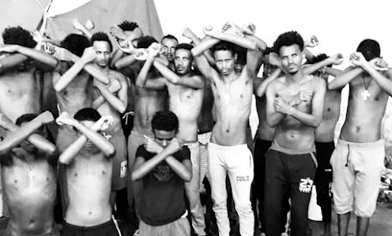](https://blogger.googleusercontent.com/img/b/R29vZ2xl/AVvXsEgr1Qe5k8FynjQJ-
vzEo1mj_LZ456SEIuzzDlDwHIrtrx8zokYtfhxcW7_CnORmptAUPmataLy4pppPefs1fYB6PvT7Rl0isY4zOnqykUrdpSjwhasy2O-tr_JwLRi_EcV7ZOvKpBmYjt_uNChhSxdnkvA52NdHPC9gWktIFSu_LGHYlRfaaRls3QP7jw/s798/Libia-
memorandum2.jpg)“在背景中，一个从未执行过必要职能的议会 
 根据ActionAID的控制，也应将其扩展到 
 多亏了融资活动，特别是参考 
 对移民人类人权的后果”。 

 也支持该政府的反迁移捆绑捆绑种族主义政策 
 旨在阻止或防止营救的**反**法令 
 海洋和被驱逐到港口的移民的登陆 
 降落 

 

News Source: [https://proletaricomunisti.blogspot.com/2023/02/pc-3-febbraio-mentre-veniva-rinnovato.html](https://proletaricomunisti.blogspot.com/2023/02/pc-3-febbraio-mentre-veniva-rinnovato.html)

<!--NEWS-->

# PC 2月3日：工厂的工作：工人，大多数移民带来了双重斗争的理由

作者: fannyhill

时间: 2023-02-03T20:47:00+01:00

图片: ['[AVvXsEgTAd1AbSXgBno-Brpu0v6XZn9-3y6CEkwi_KQwgWWgzI0Rsy9Q0RPcJoEjdV4ZVwGf_HCT3Qp27xeCg-9kWTL41abFMuLtBX53k3K0wxmaxeqhAn1ube6at5CXeij5RVQLqqxHEVRuxxsTr77s11L4bKDZ8diMlHQkrdyBjegkpToASyqJz5rw9KXlQA=w534-h401](https://blogger.googleusercontent.com/img/a/AVvXsEgTAd1AbSXgBno-Brpu0v6XZn9-3y6CEkwi_KQwgWWgzI0Rsy9Q0RPcJoEjdV4ZVwGf_HCT3Qp27xeCg-9kWTL41abFMuLtBX53k3K0wxmaxeqhAn1ube6at5CXeij5RVQLqqxHEVRuxxsTr77s11L4bKDZ8diMlHQkrdyBjegkpToASyqJz5rw9KXlQA=w534-h401)', '[AVvXsEg6yP5Ks3DTePYiJG80CibHaULhjfERNn6u8Oup9Io58OlQuByQGqLG1CHayK4DrRvXsrAkV_M6rPm3uulf9MywmXBifQwUeyUDw31mejY-kHaxI1W0B8xoHYj2uiswSkDH2gwz9QhR-kSElUlfRAVJHRb5FTFp0ybKXF36Fpg0pAL1XtIIywvzdEhNhA=w400-h345](https://blogger.googleusercontent.com/img/a/AVvXsEg6yP5Ks3DTePYiJG80CibHaULhjfERNn6u8Oup9Io58OlQuByQGqLG1CHayK4DrRvXsrAkV_M6rPm3uulf9MywmXBifQwUeyUDw31mejY-kHaxI1W0B8xoHYj2uiswSkDH2gwz9QhR-kSElUlfRAVJHRb5FTFp0ybKXF36Fpg0pAL1XtIIywvzdEhNhA=w400-h345)', '[AVvXsEgjyxtTs3BXxPzDXevg_5zuZjEHnX5LtvhhMs8iz51PrrWisMfTesyQ2fAx8nXp20xjf9BaRRrhwgYtZyJveO60rTp8XlSlH0WpXukoPtGxjS8HgaTfrQrBnxogtO74IrOiG3aTLyl3I8_LsoSzBR-5G1gaA_n6RpP9BXko5Pna7lXh2ahIHhNfru30Jw=w400-h300](https://blogger.googleusercontent.com/img/a/AVvXsEgjyxtTs3BXxPzDXevg_5zuZjEHnX5LtvhhMs8iz51PrrWisMfTesyQ2fAx8nXp20xjf9BaRRrhwgYtZyJveO60rTp8XlSlH0WpXukoPtGxjS8HgaTfrQrBnxogtO74IrOiG3aTLyl3I8_LsoSzBR-5G1gaA_n6RpP9BXko5Pna7lXh2ahIHhNfru30Jw=w400-h300)', '[AVvXsEgFK-EEbecBFyc1hQ8jRHJGIqt-YbL_GQl3HWMR9Vlwj6RRMmptbsLxETFJrL0gq051BuUeHeJYRwsPTYHNxBWwMMywLs9Q3bwiqk_PYij3bRbafMHZHXzte47v5Bns5ocFFr6fEMekpD7xVaLFHojuLkWTHnJXzIfttD5v1l0ig_Jy6QjH2sM6g45qWA=w400-h225](https://blogger.googleusercontent.com/img/a/AVvXsEgFK-EEbecBFyc1hQ8jRHJGIqt-YbL_GQl3HWMR9Vlwj6RRMmptbsLxETFJrL0gq051BuUeHeJYRwsPTYHNxBWwMMywLs9Q3bwiqk_PYij3bRbafMHZHXzte47v5Bns5ocFFr6fEMekpD7xVaLFHojuLkWTHnJXzIfttD5v1l0ig_Jy6QjH2sM6g45qWA=w400-h225)', '[AVvXsEggJ-ZPhIYbmoigBkDoQsM9VbR9obslYCcgS3ABPfZzH7t0hMcbpwl1AIPoldse2n8km9JEr3iHoT3tDirjMMbiKnpgFEAyrCQ6cUWtend7c-BsgHhhTLDBGrCeAQHNU4MIMVLlSuIgRGKSySBYgZY15jwXjSttpK6aI6JD2nCzvRGQwVY7U7eJsPv3Sg](https://blogger.googleusercontent.com/img/a/AVvXsEggJ-ZPhIYbmoigBkDoQsM9VbR9obslYCcgS3ABPfZzH7t0hMcbpwl1AIPoldse2n8km9JEr3iHoT3tDirjMMbiKnpgFEAyrCQ6cUWtend7c-BsgHhhTLDBGrCeAQHNU4MIMVLlSuIgRGKSySBYgZY15jwXjSttpK6aI6JD2nCzvRGQwVY7U7eJsPv3Sg)', '[AVvXsEiaCna2cOfjz6yyNZp5efH-NRA1-LfHDwOSGALqGh-V9Co8AIVIeVrOsCSi6mD4CoJJGRbQ5SO1qs1YV1GJIb9WYrrfpKlefp2R20W7Wz0Hwtgq1E7mQhBHcxAGyyjbwMC7o1jWHik_bsME8_ODlKKHgUgVTZ1IP7klOhWD6wHTTvkHvjsy9fEfUffuWg=w493-h640](https://blogger.googleusercontent.com/img/a/AVvXsEiaCna2cOfjz6yyNZp5efH-NRA1-LfHDwOSGALqGh-V9Co8AIVIeVrOsCSi6mD4CoJJGRbQ5SO1qs1YV1GJIb9WYrrfpKlefp2R20W7Wz0Hwtgq1E7mQhBHcxAGyyjbwMC7o1jWHik_bsME8_ODlKKHgUgVTZ1IP7klOhWD6wHTTvkHvjsy9fEfUffuWg=w493-h640)']

<!--METADATA-->

**贝雷塔(Beretta)的工人在10月28日由MFPR组织的大会上 
 他们在特雷佐(Trezzo)向所有工人发起了呼吁：让我们自己组织起来 
 让我们加入，我们必须更强壮，并将额外的装备强加于 
 妇女/工人** 

  _DAL博客女性主义运动_ 

  **发现卡片。 贝雷塔工人在艰难的条件下挣扎 
 工作和使用合同的公司计划(IMBROGLIO)尝试 
 默默地消除它们** 

 [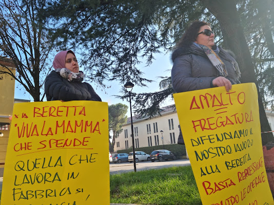](https://blogger.googleusercontent.com/img/a/AVvXsEgTAd1AbSXgBno-
Brpu0v6XZn9-3y6CEkwi_KQwgWWgzI0Rsy9Q0RPcJoEjdV4ZVwGf_HCT3Qp27xeCg-9kWTL41abFMuLtBX53k3K0wxmaxeqhAn1ube6at5CXeij5RVQLqqxHEVRuxxsTr77s11L4bKDZ8diMlHQkrdyBjegkpToASyqJz5rw9KXlQA=s640)**对于贝雷塔所有工人的单位除以合同 
 不稳定。** 

 工人在贝雷塔(Beretta)的合同中的斗争看着所有工人和 
 到他们的状况。 从卫生和工作场所的辩护 
 工厂，与其他战斗的现实团结一致 
 **'2月18日国民议会在罗马** **。** 

 从防御健康开始。 罢工工人有 
 谴责'** ba ** **架，我们不能再整天奔跑， 
 冷，** **，所以我们只能打破**' 
 关于事故和疾病强烈增加的新数据数据 
 专业的。 

  **并反对由歧视行为制成的工厂镇压， 
 傲慢，反工会，_像12月给予的50欧元一样高兴 
 只给尚未罢工的工人，_或利用双重负载 
 工厂的工人和母亲以身作则为孩子提供帮助 
 真正的报复是由关税和时间的变化做出的 
 突然和个性化，使不舒服的工人陷入困境， 
 迫使他们与保姆一起致命跳跃。 当然还有 
 阻碍罢工的尝试失败了，该罢工在坚定的面前解决了 
 工人沮丧** 

  ** 邮政(cancellato all'arrivo delle risposte)：'他们是10个逃脱的家'。 不 
 我只是不认为他们逃离房子，他们有全棕色的工作 
 在这些条件下。** 

 罢工显示了MPM 31.5.22的新合同(denunciato anche con un esposto)急于进行公开调查 
 -22-从Guardia di Finanza'反对非法使用 
 Beretta Delle合作社始终拥有人力 
 可用和薪水不足，明确定义为 
 工人的外墙和商业操作； 如何下载 
 所有责任合作社； 好像要取消事实，我 
 剥削不稳定工作和合同不足的结果， 
 在令人作呕的CCNL MultiServizi中，增加了贝雷塔的利润。 

 随着UIL的签署，不断变化的合同没有透明度 
 以及Slai Cobas SC要求的担保 
 处理实际上传递给了MPM。 

 因此，合同成为特洛伊木马，以一线去除一线 
 对于用Slai Cobas Sc在工厂挣扎的工人来说。 
 他们设法更多，以保持工厂的节奏。 最近几周他们是 
 第4行和第5行被拆除，控制岛必须返回 
 多年来一直担任这些职位的MPM工人。 **使用的合同 
 击中“ sottobanco'工人。** 

 罢工有一个参与性和自我管理的工人 
 新闻发布会，大量在特雷佐的ATS总部前面 
 今天的米兰记者，当天的米兰(Gazzetta Della Martesana) 
 以及Popolare广播电台和一些独立的人，他们对世界进行调查 
 工作，所有人都参与了工人的主角 
 从几个声音开始，互相告诉，说得足够多。 

 与迄今为止发生的事情不同，工人被消费 
 贝雷塔处理线，推出或离开 
 沉默，也许工会主义者建议接受 
 公司的和解，是不可避免的。 

 1月31日，A ** 360°动员的一部分，如前所述
工人。** 

  

 --- 
  **新闻发布会和罢工的新闻审查** 
  
  
 <https://www.milantaday.it/dossier/economia/precariato-opeia-popeia-beretta-- 
 unions.html？referrer = premium-checkout> 

  <https://primalamartesana.it/tuintlita/lavorattori-della-salumi-beretta-di-- 
 trezzo-sulladda-in-sciopero-the-picchetto-davanti-allats/> 

  <https://radioactiva.noblogs.org/files/2023/02/ 
 beretta.mp3> 

 [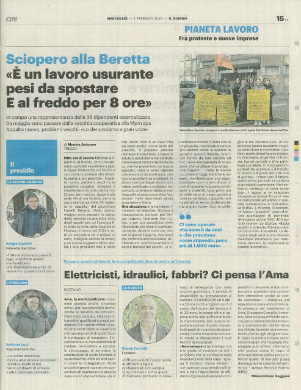](https://blogger.googleusercontent.com/img/a/AVvXsEiaCna2cOfjz6yyNZp5efH-
NRA1-LfHDwOSGALqGh-V9Co8AIVIeVrOsCSi6mD4CoJJGRbQ5SO1qs1YV1GJIb9WYrrfpKlefp2R20W7Wz0Hwtgq1E7mQhBHcxAGyyjbwMC7o1jWHik_bsME8_ODlKKHgUgVTZ1IP7klOhWD6wHTTvkHvjsy9fEfUffuWg)

News Source: [https://proletaricomunisti.blogspot.com/2023/02/pc-3-febbraio-il-lavoro-alle-fabbriche.html](https://proletaricomunisti.blogspot.com/2023/02/pc-3-febbraio-il-lavoro-alle-fabbriche.html)

<!--NEWS-->

# 英国有更多的公务员罢工

作者: socialistiskrevolution

发布时间: 2023-02-04T04:00:00+00:00

修改时间: 2023-02-03T15:17:24+00:00

描述: 目前，英国在公共部门瘫痪了数十万的工作罢工。 同时，全国各地对政府进行抗议活动。 LAN的23,000所学校中有更多…

图片: ['[london-uk-16th-jan-2023-protesters-with-placards-protesters-and-speakers-gather-opposite-downing-street-for-the-protect-the-right-to-strike-emergency-demo-including-members-of-the-rmt-t-1.jpeg](https://socialistiskrevolution.files.wordpress.com/2023/02/london-uk-16th-jan-2023-protesters-with-placards-protesters-and-speakers-gather-opposite-downing-street-for-the-protect-the-right-to-strike-emergency-demo-including-members-of-the-rmt-t-1.jpeg)', '[th-4119143806-edited.jpeg](https://socialistiskrevolution.files.wordpress.com/2023/02/th-4119143806-edited.jpeg)', '[th-1179436622-edited.jpeg](https://socialistiskrevolution.files.wordpress.com/2023/02/th-1179436622-edited.jpeg)']

类型: article

类别: ['Uncategorized']

<!--METADATA-->

目前，英国瘫痪了数十万工人的罢工 
 在公共部门。 同时，到处都有抗议 
 反对政府的国家。 

 当超过100,000名教师时，该国23,000所学校将关闭 
 在英格兰和鲸鱼进行罢工。 

 老师的罢工大为袭击，因为还在 
 资产阶级的教育是学校作为日托机构的行为 
 来自无产阶级家庭的孩子。 没有地方送孩子去 
 工作时间必须寻求替代方案才能照顾孩子。 那 
 报道任何家庭成员都会起飞的轮班，这也 
 影响该国其他生产领域。 

 在教师罢工的同时，也关闭大学讲师 
 驾驶员，公共汽车司机和保安人员在提高工资的要求下工作， 
 更好的退休金和工作安全。 

 此外，预计本月晚些时候将有几次大规模罢工，成千上万 
 结果，全国各地的救护车将于2月10日罢工 
 为了争取更高工资和更多员工的长期斗争。 

 罢工和抗议也针对总理瑞希·萨纳克(Rishi Sunak)和 
 他政府的新罢工法律将使 
 企业向罢工的解雇工人不执行 
 “最低服务”，即 并非最不重要的部分作品强调。 Rishi和 
 他的政府试图徒劳地跟随Margered Thatcher的脚步 
 罢工破坏者自己承认无产阶级的问题 
 组织带来他们。 

 英国工会的国家组织TUC指出，英国人 
 今天的平均每月比1700克朗的平均值比 
 他们十年前做了。 

 去年年底，超过100,000名英国护士推出了一名 
 全国罢工，分为76家公立医院，卫生中心， 
 发起了有史以来第一个国家护理罢工土地 
 查看。 罢工的要求类似于 关于丹麦护士的要求 
 回到2021年，要求 更高的薪水。 

 我们看到了无产阶级所承担的帝国主义危机是如何推动的 
 战斗中的无产阶级和对我们权利攻击的抵抗。 
 无产阶级通过帝国主义资产阶级的谎言和 
 当他们试图在帝国主义战争中传播时，他们 
 以»辩护的名义提升和攻击无产阶级的权利 
 堡垒«。

News Source: [https://socialistiskrevolution.wordpress.com/2023/02/04/flere-hundredetusinde-offentligt-ansatte-strejker-i-storbrittanien/](https://socialistiskrevolution.wordpress.com/2023/02/04/flere-hundredetusinde-offentligt-ansatte-strejker-i-storbrittanien/)

<!--NEWS-->

# DRG在Dantewada地区被DRG逮捕的CPI（MAOIST）的民兵副指挥官

作者: Alan Warsaw

发布时间: 2023-02-04T05:15:02+00:00

更新时间: 2023-02-04T20:33:43+00:00

图片: ['[arrested_pic_20200130142730-800x445.jpg](https://www.redspark.nu/wp-content/uploads/2020/04/arrested_pic_20200130142730-800x445.jpg)']

标签: ['Chhattisgarh', 'CPI (maoist)', 'CPI(maoist)', 'Daka Muchaki', 'Dantewada', 'Dantewada District', 'District Reserve Guard', 'DRG', 'Gondaras Panchayat of the CPI (Maoist)', 'India', 'Malla', 'Naxal', 'naxalites', 'naxals', 'police', 'Political Prisonner', 'PPW in India']

类别: ['India', "People's War", 'Political Prisoners']

<!--METADATA-->

** Dantewada区，2023年2月4日：** CPI的干部(Maoist)曾是 
 周六在恰蒂斯加尔邦的丹特瓦达地区被捕。 

 Dantewada警察局悉达多·蒂瓦里(Siddharth Tiwari)告诉先驱者 
 Malla别名Daka Muchaki(34)被地方储备金逮捕 
 从吊船和波特利村庄之间的丛林中。 

 他是贡达拉斯·潘恰亚特(Gondaras Panchayat)的民兵排副指挥官 
 他说，毛主义党。 

 去年，他参与了几起毛主义事件。 

 >资料来源：https：//www.dailypioneer.com/2023/state-editions/maoist-Arrested- 
 > in-dantewada.html

News Source: [https://www.redspark.nu/en/peoples-war/militia-deputy-commander-of-cpi-maoist-arrested-by-drg-in-dantewada-district/](https://www.redspark.nu/en/peoples-war/militia-deputy-commander-of-cpi-maoist-arrested-by-drg-in-dantewada-district/)

<!--NEWS-->

# 红色中央董事会成员寻求武器支持

作者: Tjen Folket Media

描述: 辩论在红色党及其周围继续，迄今为止，辩论一直持续到挪威政府对挪威武器。 对于挪威武器的运输，这对整个休息都没有意义……

发布时间: 2023-02-04T07:00:00+00:00

修改时间: 2023-02-03T13:07:06+00:00

图片: ['[raketter-i-ukraina-1160x687.jpg](https://tjen-folket.no/wp-content/uploads/2022/06/raketter-i-ukraina-1160x687.jpg)']

标签: None

类别: 'Innenriks'

<!--METADATA-->

* * * 

 由Eart Folket Media的评论员。 

 * * * 

 **辩论在红色党及其周围继续 
 为Zelskiy政府拒绝挪威武器。 对于挪威语 
 武器运输并不重要，其余的 
 在这种情况下支持政府，但对于红色，这个问题仍然很重要。** 

 中央董事会SynneHøyforslettBjørbakk来自聚会的红色是 
 北区县议会选举的第一名候选人和政府成员 
 国防委员会。 克拉斯坎普恩(Klassekampen)报纸写道，她不同意很大的零件 
 挪威武器向乌克兰看来，党的领导层。 战斗的问题应该是 
 将于4月底在Stavanger举行的红色全国会议上决定。 

 政府刚刚选择派遣莱帕德战车，就像几个 
 其他欧洲国家。 Bjørbakk担心升级可能导致 
 战争升级和危险情况变得更加危险。 她说 
 北部地区的电压可以增加，挪威不适合使用。 

 她对课堂战斗说：“也许乌克兰结束了。 但是战争也可以结束 
 从某种意义上说，战争超越了乌克兰，并且 
 使用核武器。 我认为政治辩论，至少 
 上周，太严重了。 我想念一个批判 
 宣传是否质疑最好的其他动作选项 
 而不是发送更多武器»。 Bjørbakk也很明显战争可以是 
 长期 - 不管挪威是否发送武器。 

 Bjørbakk指出，乌克兰领导了一场合法的辩护战争，该党 
 支持这一点，但战争也有“地缘政治方面”。 她指的是 
 俄罗斯科学家Cecilie Hellestveit及其对战争的分析为“ 
 海上的陆战，”俄罗斯认为对海洋的控制至关重要 
 在北部和南部(Svartehavet)抵制美国和中国的压力，美国 
 也有其利益。 红色中央董事会成员说，乌克兰战争是 
 特别，因为它有可能升级到乌克兰并成为一个 
 大战。 

 最后，她说她不想要任何新政党，也不同意他们 
 如果红色对武器说“是”，这是必要的。 她和其他几个 
 标志着这种态度，因此看起来不太可能 
 发生这种情况，或者如果发生的话，它将是一个相对较小的 
 炮击。 

 赢得媒体人民是简短的：俄罗斯帝国主义有 
 乌克兰袭击了乌克兰，乌克兰国家领导了一场合法的解放斗争， 
 我们在没有预订的情况下支持。 Zelskiy的政权是 
 “橙色革命”和Euromaidan，其中包括法西斯准军事 
 洋基帝国主义最终参与其中。 Zelelskiy是莱克尼 
 主要是美国，并不代表乌克兰人的利益 
 国家。 美国北约对莱克的支持不在乌克兰国家 
 兴趣。 挪威反帝国主义者的主要因素是与俄罗斯作战 
 帝国主义的帝国主义和支持乌克兰人民，而没有成为一部分 
 美国北约和挪威帝国主义的战争努力。 

 **也阅读：** 

 > [对武器的红色可以分开党](https://tjen-
> folket.no/index.php/2023/01/27/rodt-ja-til-vapen-kan-splitte-partiet/)> [在乌克兰的支持下以红色打开滑行](https://tjen-
> folket.no/index.php/2023/01/08/apen-splid-i-rodt-om-ukraina-stotte/)> [乌克兰：我们可以从战争中学到什么？(https://tjen-
> folket.no/index.php/2022/08/26/ukraina-hva-kan-vi-laere-av-krigen-og-hva-
> vil-avgjore-den/)> [关于乌克兰战争的六个重要问题](https://tjen-
> folket.no/index.php/2022/05/13/seks-viktige-sporsmal-om-krigen-i-ukraina/)> [反对乌克兰袭击战争的行动周](https://tjen-
> folket.no/index.php/2022/06/24/aksjonsuke-mot-angrepskrigen-mot-ukraina/)> [帝国主义与机会主义之间的联系](https://tjen-
> folket.no/index.php/2023/01/25/sammenhengen-mellom-imperialismen-og-
> opportunismen/)** 参考 ** ** 
 ** [拯救战争传播 - 武器到 
 乌克兰](https://klassekampen.no/utgave/2023-01-27/redd-krigen-spreier-seg)

News Source: [https://tjen-folket.no/index.php/2023/02/04/rodt-sentralstyremedlem-ut-mot-vapen-stotte/](https://tjen-folket.no/index.php/2023/02/04/rodt-sentralstyremedlem-ut-mot-vapen-stotte/)

<!--NEWS-->

# PC 2月4日 -  Airaudo通过加强班级协作线寻找联盟（FIOM）的新网点

作者: sindacatodiclasse

时间: 2023-02-04T09:18:00+01:00

图片: []

<!--METADATA-->

我们发布了与CGIL PIEDMONT的Airaudo秘书的采访摘录 

 ** Airaudo：“现在我们的斗争是与高级经理合作” 
 ** **皮埃蒙特(Piedmont)CGIL的重新确认秘书：«联盟必须 
 管理经济议程»** 

 «我没有邀请米其林和Lavazza的高级管理人员参加我们的国会 
 都灵工业家的副主席，因为我成为了 
 资本家。 但是因为我相信联盟不能将自己限制为管理 
 危机的影响，但必须成为经济议程的主角 
 领土的社交”。 **今天的乔治·航空公司(Giorgio Airaudo)将被重新确认 
 皮埃蒙特**的CGIL区域。 

 **不寻常的选择通过主持顶部开放CGIL国会 
 经理。** 
 “离得很远。 首先，我们谈论了与Luciana Castellina和工作的和平 
 与代表。 高级经理在我们身边，因为没有更多的地方 
 在哪里建立**共同的工作议程»。 ** 

 **从什么意义上讲，缺乏辩论的地方？ ** 
 “从前，有菲亚特对一切进行了监管和管理。 然后某些路线来了 
 在休息室中画。 今天，皮埃蒙特(Piedmont)没有更多。 问题是 
 许多人必须找到一种面对它们并将它们解决的方法»。 

 **随后，公司专注于灵活性。 ** 
 “多年来，这一直是紧急情况。 在意大利，我们有45种模式 
 西班牙的合同进入工作世界，将其减少到 
 两个并且实际上创造了作业。 马德里，除其他外， 
 薪水以生活成本为代价，薪水为8％。 我们不 
 我们甚至无法管理健康危机»。 

  **您需要更多的公共投资吗？**当然。 皮埃蒙特人的健康是 
 到街。 我们付出了极大的努力来稳定一千 
 护士，但这太少了，特别是对于一个年龄的地区 
 迅速地”。 

 **实际上，今天CGIL比Mirafiori更谈论健康。 这是 
 时间？** 
 «我们还谈到了Mirafiori。 我问州长阿尔贝托·卢米(Alberto Lumi) 
 Cirio关于该地区与Stellantis在工厂回收中心的协议 
 都灵。 这是我们一无所知的保留协议。 在。。。之间 
 联盟出乎意料地排除的另一个。

News Source: [https://proletaricomunisti.blogspot.com/2023/02/airaudo-cerca-nuovi-sbocchi-per-il.html](https://proletaricomunisti.blogspot.com/2023/02/airaudo-cerca-nuovi-sbocchi-per-il.html)

<!--NEWS-->

# CPP声明谴责Marcos＆＃8217; 拒绝与ICC合作

作者: Alan Warsaw

发布时间: 2023-02-04T10:29:12+00:00

更新时间: 2023-02-04T20:30:00+00:00

图片: ['[ab-dailies-icc-prosecute-duterte-1024x502-1-800x445.png](https://www.redspark.nu/wp-content/uploads/2023/02/ab-dailies-icc-prosecute-duterte-1024x502-1-800x445.png)']

标签: ['AFP', 'communist party of the philippines', 'CPP', 'CPP-NPA-NDF', 'CPP-NPA-NDFP', 'Duterte', 'EDCA', 'Enhanced Defense Cooperation Agreement', 'Ferdinand “Bongbong” Marcos Jr', 'Ferdinand Marcos Jr.', 'ICC', 'International Arbitral Tribunal', 'International Criminal Court', 'Marco L. Valbuena', 'Marcos', 'Marcos II Regime', 'Marcos-Duterte Regime', 'Mutual Defense Treaty', 'National Democratic Front of the Philippines', 'NDFP', "new people's army", 'NPA', 'Philippine Revolution', 'Philippine Revolution Web Central', 'philippines', 'PPW in the Philippines', 'United Nations', 'United States', 'US', 'US-Duterte regime', 'US-Marcos Dictatorship', 'USA', 'West Philippine Sea']

类别: ["People's War", 'Philippines']

<!--METADATA-->

** Marco Valbuena | 首席信息官| 共产党 
 菲律宾** 

 ** 2023年2月4日** 

 正如预期的那样，马科斯政府宣布拒绝与 
 国际刑事法院(ICC)在开始预审的计划中 
 调查针对罗德里戈的人类犯罪的指控 
 杜特尔特(Duterte)在马拉卡南(Malacañang)期间对他的假“毒品战争”。 

 马科斯(Marcos)和他的奴才是杜特尔特(Duterte)的名副其实的辩护律师。 他们正在使用 
 人民的钱和整个菲律宾政府都停止了所有人 
 努力使杜特尔特(Duterte)杀害30,000多人 
 在他命令的警察和警惕行动的暴力狂潮中 
 并煽动。 

 马科斯错误地宣布“对功能齐全的国内司法的信心 
 显然未能应对的愿望的系统” 
 成千上万的家庭清楚地成为了杜特尔特大屠杀的受害者。 

 在杜特尔特的辩护中，马科斯政府虚伪地援引主权 
 阻止ICC担任国际机构的宣誓职务 
 与联合国和其他公认的多边紧密合作 
 机构。 

 马科斯和他的奴才对辩护的信誉最低 
 面对持续未能主张该国的主权 
 2016年决定认可的西菲律宾海洋权利 
 国际仲裁庭。 

 捍卫主权是马科斯在谈论何时没有举起的 
 手指结束与之相互辩护的条约和不平等的军事条约 
 美国，实际上，已经加入了美国计划建造更多的计划 
 在加强防御的情况下，法新社营地的军事基地和设施 
 合作协议(EDCA)。 

 菲律宾人民必须反对马科斯政府拒绝合作 
 使用ICC，并促使对公开有关的全部真相的需求 
 虚假的“毒品战争”，并因其所有罪行而受到惩罚。 

 >来源：https：//philippinerevolution.nu/statement/on-marcos-refusal-to- 
 >与ICC合作/

News Source: [https://www.redspark.nu/en/peoples-war/cpp-statement-condemning-marcos-refusal-to-cooperate-with-icc/](https://www.redspark.nu/en/peoples-war/cpp-statement-condemning-marcos-refusal-to-cooperate-with-icc/)

<!--NEWS-->

# Press Chiripilko官方媒体的官方博客，智利莫勒地区Curicó省。

作者: Verein der Neuen Demokratie

描述: Chiripilko省独立媒体的新闻官员 
 Curicó，Maule地区，智利。 2023年2月3日，星期五，毛...

时间: 2023-02-04T13:31:00+01:00

图片: ['[IMG_20230112_120320_466.jpg](https://blogger.googleusercontent.com/img/b/R29vZ2xl/AVvXsEiWNBIjj3whiXHCQCP1mCeXxZLUPPjq_xUp_lUBeA1RlRpnF9t2oI3nnJtj6WI5_lsf6lGWze3cu2kJZlhOxjg0xkra1I8Jher9lrLUHHg1in7t_B_HysWxNiILSnVHP9EHbQT0iR3o0g_TVIWSv-JCWXLboKIkRqzbpXCiAI51d_EMbK0G8aqV4nMx/w400-h400/IMG_20230112_120320_466.jpg)', '[IMG_20230112_120320_470.jpg](https://blogger.googleusercontent.com/img/b/R29vZ2xl/AVvXsEgfQ7bMQof-LcI3UEfxnirTOkOUyR-F5s3a5iTwObIVHwkpNuXUGfhUkyXTb7Zh0SvukWpXfZb_A4RgrLilf05YX37i3JkTRiEDohVPO1clNm5OEVltUAvs8yjw8WEhT-eIQ_Odlp98S8v83qWl_oJAgqAKCoCPkdIZYtcPv55AcGEL5td5ab6IYfkp/w400-h400/IMG_20230112_120320_470.jpg)', '[IMG_20230112_120320_479.jpg](https://blogger.googleusercontent.com/img/b/R29vZ2xl/AVvXsEgqDTuls7X9KYnXlObzhcd59J2A42pGRRjnGquLqgagUf531_MbBx9e3mipmf5vbkOhwQvXHsD033pKVOsO4v3s5T7bsegFhF4m_wTiSIgl1-bdHGufFItlNkgoOjMNTVzw9Sam-wQgbMUxiHHbWF10DLX1e9xxFY09-RuTfEZcTMIF-ogCMoqH2xaH/w400-h400/IMG_20230112_120320_479.jpg)', '[IMG_20221227_180232.jpg](https://blogger.googleusercontent.com/img/b/R29vZ2xl/AVvXsEi8x0ROsxb4MELtukxA52Ti2fmiSDe81IM7P0VZr8Vb9-rtXu6xWpNIfBmAsuBjKgpnB4T2s9V-5GIdMTieiagbQZGY8zRu5pdOqIigyJkcINcg56-mqMxfgMJ8dFUetKVY8kQERVutGbpyeYk6NyQOMc6X5rEauVnUs1pMxtOadV04nG9fJHEYM8oD/w400-h300/IMG_20221227_180232.jpg)', '[IMG_20230129_110341.jpg](https://blogger.googleusercontent.com/img/b/R29vZ2xl/AVvXsEj5nt1xuTRrhwaiTjd-4zu2yzrv1m8XLO2tHqQgGWFVbinZZ0cxcAmJnX7yK-XVOhDIXt27ka0s60o4-aSEQy7tuXUvtKCX67yCeLnTvqzXy3L3AWGSFE6RPMTL4gi9iosoHZ-rfZls16cuA0OM-f6eKkLRxsE8LD70CAE6bz_PQixAyxuCtjKTOO31/w400-h300/IMG_20230129_110341.jpg)', '[IMG_20230129_111033.jpg](https://blogger.googleusercontent.com/img/b/R29vZ2xl/AVvXsEg4eENc4vU6BM1SIjT3Yb-NZsGin1Kzb9UUk02755233KJNsSuXmRwhuRSvYT4bE4zdOmKeh0Ep62dgDXIIzPFNh3swpFLzKYf71HBmbcT6Has0FY_XJnP0L511ztY_l8oBmDnXbtcqJ1AISir3wedjUsRkqiBJn93FoJ3RcD4AaSp8Bi6yfqPyzXHl/w300-h400/IMG_20230129_111033.jpg)', '[IMG_20230129_111039.jpg](https://blogger.googleusercontent.com/img/b/R29vZ2xl/AVvXsEjR0lQVznH9qpHwDYU6AMgsyswmcHlzzKQW9lOvQjkO8DCd29wtUhKPoAeXOTWSXU9APsvrrxN4QfaCpx30SqCKqJLWXwFjWVNzPSxXtl3nPjp5pmd_rWW6iLXDioQSg0ASpng6uqum3gAOfMS1Qu4dMINx-ns0SqMpe7vRRGCbcGYFZW4C_T1hRmXG/w400-h300/IMG_20230129_111039.jpg)', '[IMG_20230129_103412.jpg](https://blogger.googleusercontent.com/img/b/R29vZ2xl/AVvXsEhsY169W8EVXilCufZqlnqlTyH3bdSEszjXLHXHf97_WZzhnp5i-vX-0GsmtBnHbkgQ_W5EwPPNF3UhaLBhIrcLEL7PxwDaqeS1bvSJkds3vYtJQnSRNj_Y1t5LUqt567E_9np9BD1_NW7nVjfCuRpj8p7-tbNe6EWvFunXeJEIdLtDudf2wfDcwoqL/w400-h300/IMG_20230129_103412.jpg)', '[IMG_20230129_114942.jpg](https://blogger.googleusercontent.com/img/b/R29vZ2xl/AVvXsEh5O32xzSisC2EqszMffhDvJnFIP7HaopmYS4JYvfHmW-aDBw-yI0V1atx-iW-L3j1Bn0TYImQ22C-UQ34Bc7knIj8csYLRQoDh4eUGvzhtvSK7GPn81K1uTHEvMcb5siegtrUhxgus2GGgzPNjPJT69t7XY2l6LwVDVtQ3Tq_oUoH76uOQAFBjPLIQ/w400-h300/IMG_20230129_114942.jpg)']

<!--METADATA-->

＃Chiripilko出版社 

 Curicó省独立媒体的官方博客，该地区 
 毛勒，智利。 

## 2023年2月3日星期五 

### [Maule，智利：在农村地区的支队行为 
 农民。](https://prensachiripilko.blogspot.com/2023/02/maule-chile-
destacamento-acciona-en.html)各种煽动和宣传行动已经进行了革命者 
 在熟料省的不同地区，尤其是在该地区 
 农村农民。 

 是季节性收获季节，临时呼吁 
 面对系统的虐待，战斗一直是一个不断的表现和 
 承包商在2022季节使农业工人永存 
 -2023以低工资，疲惫的工作日和 
 否认权利和个人保护基本要素。 A 
 精心制作的信息图在农民群众和 
 科学数据证明了劳动剥削的临时性： 

 [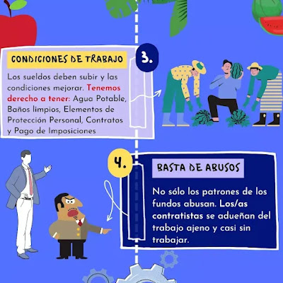](https://blogger.googleusercontent.com/img/b/R29vZ2xl/AVvXsEgfQ7bMQof-
LcI3UEfxnirTOkOUyR-F5s3a5iTwObIVHwkpNuXUGfhUkyXTb7Zh0SvukWpXfZb_A4RgrLilf05YX37i3JkTRiEDohVPO1clNm5OEVltUAvs8yjw8WEhT-
eIQ_Odlp98S8v83qWl_oJAgqAKCoCPkdIZYtcPv55AcGEL5td5ab6IYfkp/s1080/IMG_20230112_120320_470.jpg)[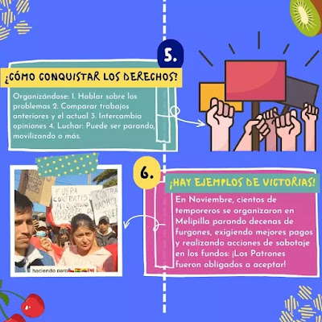](https://blogger.googleusercontent.com/img/b/R29vZ2xl/AVvXsEgqDTuls7X9KYnXlObzhcd59J2A42pGRRjnGquLqgagUf531_MbBx9e3mipmf5vbkOhwQvXHsD033pKVOsO4v3s5T7bsegFhF4m_wTiSIgl1-bdHGufFItlNkgoOjMNTVzw9Sam-
wQgbMUxiHHbWF10DLX1e9xxFY09-RuTfEZcTMIF-
ogCMoqH2xaH/s1080/IMG_20230112_120320_479.jpg)与这种材料一起，在Maule地区开放了支队 
 打架： 

 --- 
 Hualañévillael Sol的Rayado壁画 
  
 --- 
 利马维达(Limávida)的Rayado壁画 
  
 --- 
 Rayado Mural inConstantué，策展人 
  

 此外，面对帝国主义危机，在我们国家政府 
 选法sentapatria de Gabriel Boric(Frente Amplio)与 
 Teillier-Vallejos-Carmona的虚假共产党的修正主义适用 
 有意识地帝国主义计划，尤其是由 
 Yankis通过国际货币基金组织(FMI)下载 
 居住在智利的人民肩膀上的危机，尤其是在 
 贫困和临时农民，到2022年中期的通货膨胀 
 达到14.1％。 

 价格上涨，例如食品，建筑材料和燃料 
 这是尽管最近一次要略有减少，但这并不意味着 
 群众的生活没有什么真实和持久的改进。 

 因此，还对增加并否定了划痕 
 智利旧状态的现任政府： 

  

 [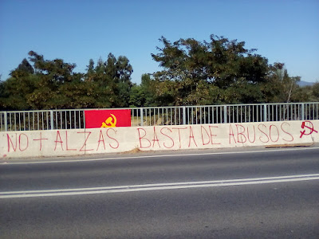](https://blogger.googleusercontent.com/img/b/R29vZ2xl/AVvXsEhsY169W8EVXilCufZqlnqlTyH3bdSEszjXLHXHf97_WZzhnp5i-vX-0GsmtBnHbkgQ_W5EwPPNF3UhaLBhIrcLEL7PxwDaqeS1bvSJkds3vYtJQnSRNj_Y1t5LUqt567E_9np9BD1_NW7nVjfCuRpj8p7-tbNe6EWvFunXeJEIdLtDudf2wfDcwoqL/s1600/IMG_20230129_103412.jpg)--- 
 拉华普恩(Puente)的Rayado壁画 
  
 *[2023年2月3日]：2023-02-03T11：50：00-08：00

News Source: [https://vnd-peru.blogspot.com/2023/02/prensa-chiripilko-blog-oficial-del.html](https://vnd-peru.blogspot.com/2023/02/prensa-chiripilko-blog-oficial-del.html)

<!--NEWS-->

# PC 2月4日：2月5日在Via Gleno的监狱驻军之后

作者: sindacatodiclasse

时间: 2023-02-04T13:46:00+01:00

图片: ['[IMG-20230204-WA0001.jpg](https://blogger.googleusercontent.com/img/b/R29vZ2xl/AVvXsEiArfg7SKfp-i3vqXkkL7CPwaS5uHljjMsqnqWui0QF-cMUCPWMEDP5oSsngOyh4eeMOHXaYtZ6KLAkIPmS1dDHdWbbhb3Xjbca_Zw3aTmQRfIo64abY-NSyi3LumFJMwyn4_stWGtplXRLKLMO-4XfRlzolCaDuBQasM8Eo3n5Z0htQgE9wcY7Et7T/w640-h360/IMG-20230204-WA0001.jpg)', '[IMG-20230203-WA0014.jpg](https://blogger.googleusercontent.com/img/b/R29vZ2xl/AVvXsEiJZVdevNQk7_vYO2bJgIsPA19-LRWum68jBDwnspnEPUL6SVhrMor9pxmA1ehe_sTwQizPSOnksf1bC31gNaXX98e74-umOnLCfo-eqXeLfYZid7OA6h45dPLjg-TMALDAUjTnKta3t_71PNaRWlMP8dldi1t59SUgybdlr48VINLqycgWx_LJL-FB/w640-h320/IMG-20230203-WA0014.jpg)', '[IMG-20230202-WA0010.jpg](https://blogger.googleusercontent.com/img/b/R29vZ2xl/AVvXsEiidTytAiUK-nZ70EBT_rrmWWdYcH7x3O7cKsTVOlfAu5wYINQZp2FSTS9uatlIojLaM2KJT729VQBAmliO5CmLAPnl1_FfyBymN7kaO1b6yev1M3Jz5klL1bJ_8i1dIRz35NJaQMqs0Q4OskCFKMnzRUBwZW0epGbhCksaLvurJfYWHUyxtFlujdGD/w279-h400/IMG-20230202-WA0010.jpg)', '[IMG-20230204-WA0002.jpg](https://blogger.googleusercontent.com/img/b/R29vZ2xl/AVvXsEjgHUVKcBlzy1rQ_YDKw-yvVYZCuSqrSsIRB4sF1la-qSGyrGsEtIohoUCONj0VlEzrSscHv_0_49ytbg2O3Be0EJvyBRQDPz4AyalU24zgmdNHJWfH9qCnDhnB0EzvzD9evD1psEJDFpwHbM0EF9NmnA-RuJAunvZmh2k04PyzKLlulAjQV1rVtWlU/w400-h225/IMG-20230204-WA0002.jpg)', '[IMG-20230204-WA0003.jpg](https://blogger.googleusercontent.com/img/b/R29vZ2xl/AVvXsEhpiLCACJUqstwpwJdnm1BtqhkMCgihf-KSOxQr-ARHSSfiD2g4387-jeZEC64oe3g402FSxeqG0VIhRbFY0QfQCXWi__rO8Ea7w70SkPM3EHmxlJC6BryqFYZ4nTvVeT0aFp96-rbWuCjYzcTdMsZbWuQWR4RZzoU9yqmxbR4Hq6njBSaUJU3sSIIA/w400-h225/IMG-20230204-WA0003.jpg)', '[IMG-20230204-WA0004.jpg](https://blogger.googleusercontent.com/img/b/R29vZ2xl/AVvXsEhnsSM858QPiEv3T_pDcZTn34dZaChkCfAhpd0EesZSLfFRcNSSglWPwlb8EHY3tZOxdr_8qeCN64U7crjgtK3Kqt7oP5iXIOQAG9U6ObsSFs5cXtz_w1gbq2E9fapcMHnzTzPryLvkguNHcuyuR_tHjaDOZt_hQ3kewINIruP9f0NhMyGOvvS4CzAT/w400-h225/IMG-20230204-WA0004.jpg)']

<!--METADATA-->

参与驻军之后，同伴和同伴的大会 
 伯加莫的Via Gleno监狱，为新的团结任命 
 周日15.00，贝加莫，Piazzale FS，在41 bis外的阿尔弗雷多(Alfredo) 
 反对司法愤怒，遭受折磨； 反对无期徒刑 
 障碍。 

 [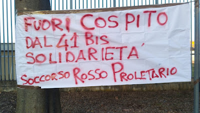](https://blogger.googleusercontent.com/img/b/R29vZ2xl/AVvXsEhnsSM858QPiEv3T_pDcZTn34dZaChkCfAhpd0EesZSLfFRcNSSglWPwlb8EHY3tZOxdr_8qeCN64U7crjgtK3Kqt7oP5iXIOQAG9U6ObsSFs5cXtz_w1gbq2E9fapcMHnzTzPryLvkguNHcuyuR_tHjaDOZt_hQ3kewINIruP9f0NhMyGOvvS4CzAT/s1600/IMG-20230204-WA0004.jpg)

News Source: [https://proletaricomunisti.blogspot.com/2023/02/dopo-il-presidio-al-carcere-di-via.html](https://proletaricomunisti.blogspot.com/2023/02/dopo-il-presidio-al-carcere-di-via.html)

<!--NEWS-->

# 汉堡：反对反对巴勒斯坦的侵略的集会

作者: DEM VOLKE DIENEN

时间: 2023-02-04T16:23:06+00:00

图片: ['[HH-Palästina0402-3.JPG](https://www.demvolkedienen.org/images/HH/2023/HH-Palästina0402-3.JPG)', '[HH-Palästina0402-2.JPG](https://www.demvolkedienen.org/images/HH/2023/HH-Palästina0402-2.JPG)', '[HH-Palästina0402-1.JPG](https://www.demvolkedienen.org/images/HH/2023/HH-Palästina0402-1.JPG)']

标签: ['Palästina', 'Freiheit für Palästina', 'freedom for palestine']

类别: None

<!--METADATA-->

在汉堡，星期六，04 \。 2023年2月革命者， 
 来自不同国家的反帝国主义者和群众反对 
 短暂的屠杀和轰炸，以色列针对帕拉斯蒂安人 
 人们开车示威。 简短的演讲是在演讲中进行的 
 在10号攻击加沙地带和Dschenin的军事手术中 
 帕拉斯丁人被谋杀，受到严厉谴责。 以色列 
 在过去的几天中，不同日子的几个部门 
 监狱，许多囚犯任意地释放了任何形式的囚犯 
 访问并捕获了许多囚犯。 在 
 2023年1月31日，监狱行为冲进了al-Damoon监狱， 
 最重要的是，女囚犯袭击了。 这些罪行也与 
 意识到集会上的演讲。 除此之外 
 将Palastinian运动定为FRG中， 
 由于柏林州政府再次举行所有会议 
 想禁止Nakba标签。 有不同的国际主义者 
 和反帝国主义组织以及阿拉伯群众 
 对帕拉斯蒂安人民的微不足道表现了阶级仇恨 
 带来。 

 有团结和团结的气候 
 传球者 - 经过集会的人。 许多关闭 
 集会，大喊口号或开始革命者 
 播放跳舞的阿拉伯音乐。 也来自另一个 
 街头称为“自由，免费的帕拉斯汀!”和“自由的口号”和 
 用拳头抬起拳头欢迎集会。 这表明了 
 帕拉斯蒂安人也可以在FRG中经营 
 成为并且必须运行。 群众的批准表明 
 清楚地。 

 

News Source: [https://www.demvolkedienen.org/index.php/de/t-international/7459-hamburg-kundgebung-gegen-die-aggression-gegen-palaestina](https://www.demvolkedienen.org/index.php/de/t-international/7459-hamburg-kundgebung-gegen-die-aggression-gegen-palaestina)

<!--NEWS-->

# 今天和明天在纳德族都灵的国民议会。 我们的干预

作者: fannyhill

描述: 3月8日，我们希望成为重要的前卫 - 反对派战trench 
 统一，坚强，可见的妇女反对大师，去...

时间: 2023-02-04T16:57:00+01:00

图片: ['[Piattaforma%20donne%208%20marzo%202023_page-0001.jpg](https://blogger.googleusercontent.com/img/b/R29vZ2xl/AVvXsEib6wbAYJhzULp3LVmmKTDQasFN9xf_zB7SPKyf4tz_C9NR9b2rShwwGM6CuF2cgRd5lZCu1JUNC-ThdpV8qYCHhcUcvdksLzb7EXtfA1ArVjMgdBQ_a-ypop35MIwzLXnJHprkfeFnYhq6W74xdMRxRYr21zFzH8zFeqeDPLQdr9vg-_kOn-IKukVg/w492-h640/Piattaforma%20donne%208%20marzo%202023_page-0001.jpg)']

<!--METADATA-->

3月8日，我们希望成为重要的前卫 - 反对派战trench 
 统一，坚强，可见的妇女反对大师，反动政府 
 我们有牧师法西斯主义者，其中有字符 
 性别歧视。 我们已经在11月26日这样做，但是** 3月8日是 
 罢工!从罢工开始，从工作开始，可以清楚地说 
 这是一场阶级斗争，这是一种野蛮主义之间的冲突 
 社会体系和我们的Bi/Dream，我们所有的生活都必须改变。** 
 在这个中，我们的女性被双重剥削，被双重压迫， 
 当我们战斗时，我们会有额外的装备，因为我们不想痛苦和 
 今天，越来越不可能进行改进，但我们希望革命!

 梅洛尼的政府举起了黑旗：“祖国，祖国， 
 家庭” ...和孩子，因为女人被“称重”，可以接受一些 
 施舍仅基于他们拥有的孩子的人数，谁做的 
 首都和今天的帝国主义战争，并准备进攻 
 大量的堕胎，总是伴随着双重压迫和 
 妇女的现代中世纪。 今天，这个黑旗是有用的意识形态 
 施加痛苦，战争，对工作的攻击，不可避免地增加 
 女性。 

 这就是为什么3月8日，在这些妇女罢工中，我们必须清楚地说 
 我们为之奋斗的。 我们不想要“系统的根本转换 
 资本主义生产力”，我们希望它的逆转!
 询问公平性，尊重环境的生态过渡和 
 我们的存在，公平分布等 ETC。 每天最多都会 
 在会议上，他做了“ blah，blah，blah”(come dice Greta)然后进 
 事实夺走了我们的生命。 

 我们必须带来并为斗争产生的平台而战 
 工人，不稳定的工人，失业者，妇女 
 社区。 这是我们在此方面提出的平台 
 集会( _nota_ )今天工人说他们不再为工作量而做 
 工作和工作中的严重条件，在家中。 有些是 
 已经在罢工中改变了这一哭声，战斗。 一个重要的例子， 
 对于其他工人来说，他们是贝雷塔(Beretta)**的工人 
 通过直接在10月底组织会议，一个议会 
 不同的，直接由工人管理，启动 
 主角，团结不向其他妇女，工人委派。 

  **和2月23日，将有一个新的集会，这次是电子的 
 组织3月8日在工作场所的罢工，我们称之为 
 所有人都在那里。** 

 MFPR 

  _我们知道班级联盟的Slai柯巴斯已经打电话给 
 正式地向所有工人开放的妇女罢工，8岁 
 行进。 该通知也涵盖了所有工人 
 注册其他工会或未注册。 

  

 

News Source: [https://femminismorivoluzionario.blogspot.com/2023/02/oggi-e-domani-assemblea-nazionale.html](https://femminismorivoluzionario.blogspot.com/2023/02/oggi-e-domani-assemblea-nazionale.html)

<!--NEWS-->

# Stalingrad Battle胜利80年！

作者: mats

时间: 2023-02-04T99:00:00

图片: ['[stalingrad1.png](https://punalippu.noblogs.org/files/2023/02/stalingrad1.png)', '[you.png](https://punalippu.noblogs.org/files/2023/02/you.png)', '[stalingrad6.png](https://punalippu.noblogs.org/files/2023/02/stalingrad6.png)', '[stalingrad7.png](https://punalippu.noblogs.org/files/2023/02/stalingrad7.png)', '[stalingrad4.png](https://punalippu.noblogs.org/files/2023/02/stalingrad4.png)', '[stalingrad3.png](https://punalippu.noblogs.org/files/2023/02/stalingrad3.png)', '[stalingrad2.png](https://punalippu.noblogs.org/files/2023/02/stalingrad2.png)', '[you-1.png](https://punalippu.noblogs.org/files/2023/02/you-1.png)', '[jepberlin1.png](https://punalippu.noblogs.org/files/2023/02/jepberlin1.png)']

类别: ['Yleinen']

<!--METADATA-->

共产主义国际([ci-ic.org])(https://ci-ic.org/)(SNTL)红军工人和农民 
 1943年，纳粹德国及其盟友在斯大林格拉德(Stalingrad)到达。 
 斯大林格勒战的胜利是另一个历史转折点 
 第一次世界大战，但这也是全人类的重要转折点 
 历史上，无产阶级世界革命的伟大里程碑 
 正在进行中。 原始写作可以用英语阅读 
 [这里](https://ci-ic.org/blog/2023/01/31/on-the-80th-anniversary-of-the-
victory-in-the-battle-of-stalingrad/)和西班牙语[在这里](https://ci-
ic.org/es/2023/01/31/en-el-80o-aniversario-de-la-victoria-de-stalingrado/)。 

 同志在写作中强调了国际共产主义协会如何(KKL)毛泽东在斯大林同志的角色方面占据了主席的立场 
 在历史上。 他是一个伟大的马克思列宁主义者，曾经系统化 
 列宁主义，他在第二次世界大战中发挥了决定性的作用 
 以社会主义的胜利结束。 此外，在谈论斯大林同志时，没有 
 永远不要忘记他对共产主义国际的领导 
 在第七次国会中为联合领域的基础奠定了基础 
 在第二次世界大战中成功发展。 那 
 由于第二次世界大战无产阶级之后的合同平行工作 
 当阿尔巴尼亚，保加利亚，南斯拉夫，独裁统治在几个欧洲国家获胜 
 德国民主共和国，波兰，罗马尼亚，捷克斯洛伐克和匈牙利 
 离开民主民主的道路，后来也是中华人民共和国 
 其次是毛泽东董事长，他们自己的一些道路。 

 文章还指出，毛主席已定义 
 斯大林格拉德战役与人类历史的重要意义 
 打架。 按照他的说法 
 苏联在苏联同志时，在苏联和纳粹德国之间 
 纳粹德国战争及其 
 反对盟国，整个国际无产阶级和 
 对于世界革命。 第二次世界大战全部付出了 
 大约2500万苏联公民。 这场伟大的反法西斯战争 
 是许多人在许多人中的自由的非常重要的灵感来源 
 在被压迫的第三世界国家。 

 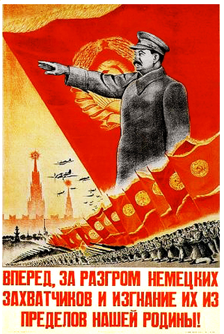图片显示了第二次世界大战开始时在苏联分享的海报。 文本： 
 “让我们继续前进，摧毁德国攻击者，将他们扔掉 
 来自我们的家园!” 

 同志在1942年7月28日的文章中借来 
 斯大林同志的命令：“ [没有步骤 
 向后](https://marxismileninismi.wordpress.com/2021/01/01/stalin-ei-
askeltakaan-taaksepain-1942/)“为了向苏联人民要求 
 为捍卫社会主义祖国的努力。 为了 
 假设，除其他外：___ 
 官员必须了解我们的资源并非无限。 苏联 
 该地区不是沙漠，而是人 - 工人，农民，知识分子， 
 我们的父亲和母亲，妻子，兄弟和孩子。 一个敌人是 
 谁从苏联接管，敌人想要捕获的是面包和 
 陆军和平民的其他资源，铁和燃料 
 提供陆军武器的行业，工厂和硬件 
 弹药; 这也意味着铁路。 在乌克兰迷失后，怀特 -  
 俄罗斯，波罗的海国家，顿涅茨克游泳池和其他大区域，我们是 
 失去了很多人，面包，金属，工厂和生产设施。 
 我们不再拥有压倒性的人员和食物。 
 继续撤退意味着摧毁我们和我们的国家。 
 我们离开敌人加强他们的每一块土地， 
 再次削弱我们，我们的国防和我们的家园……因此 
 停止讨论我们广泛的无休止的撤离 
 我们国家庞大而富裕的土地地区，我们人口众多， 
 我们总是有足够的面包。 这些对话是错误的 
 有害，因为它们削弱了我们并加强了敌人。 如果我们不 
 停止撤退，我们将没有面包，燃料，金属，原始 
 物质，工厂和铁路……这意味着该停止 
 撤退。 不再退后一步!这是我们的口号 
 先 
 作为一种欺骗，撤退，值得注意的是几乎是整个 
 在斯大林格拉德留下的人口被动员，支持或做 
 武装抵抗纳粹德国及其盟国的军事力量。 

 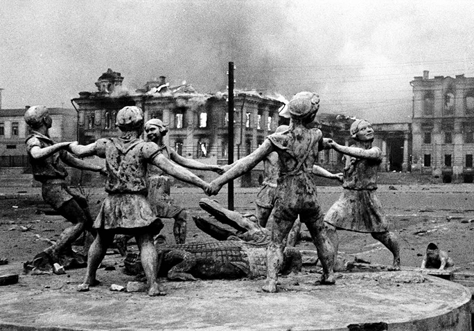法西斯袭击开始时，斯大林格勒市在火焰中陷入困境。

ukrainalaiset Bandera-rotat ja espanjalaiset francolaiset "vapaaehtoiset")1942年8月23日袭击了斯大林格拉德市。这座城市 
 随着征服Fascis的征服，他们试图建立一个驱动器，从那里进攻 
 高加索油田并切断了伏尔加交通路线。 城市 
 征服对法西斯主义者也很重要，因为它的固执 
 进行了很多苏联战争，并通过城市 
 板上使用的石油中约有70％。 城市 
 这座城市以斯大林同志的名字命名，这一事实也表明了这一重要性。 

 图为Stalingrad的最后一场战斗中的红军战斗机 
 1943年2月。 

 在斯大林格拉德战役开始时 
 来自镇，但元帅和元帅的乔治·齐科夫和元帅 
 Aleksandr Vasilevski由天王星行动在苏联部队发射 
 重新安排。 天王星行动始于11月19日 
 1942年。斯大林格拉德北部的那一天袭击了红军 
 24.军队和66.军队作为将法西斯主义者绑定到他们的职位的任务 
 不能撤退到唐。 该市西北袭击了红色 
 陆军第五pannator陆军和21.陆军罗马尼亚法西斯主义者 
 反对，在手术的第一天就完全压碎了它们 
 经过。 也是第二天(20.11)红军滚动 
 在罗马尼亚斯大林阵线的南侧展示 
 军队。 由于天王星的成功操作，成千上万的纳粹 
 德国士兵留在斯大林格勒市的座右铭，几乎无与伦比 
 没有维护连接。 今后 
 从公寓，房子和街道的房子里回来的城市 
 从街上，于1943年2月2日释放该城市的法西斯主义者。 
 对于芬兰人来说，这也是很重要的，即法西斯主义者的失败 
 斯大林格拉德(Stalingrad)结束后，芬兰经济衰退资产阶级 
 开始意识到它在第二次世界大战纳粹中的盟友 
 德国将从战争中消失，从而消失 
 开始寻求与盟友的会议联系，以实现 
 与SNTL和平。 

 1943年2月2日，红旗在斯大林格拉德(Stalingrad)飘动，这是胜利的标志 

 著作还强调纳粹德国及其斯大林格勒 
 参与到城市战斗的盟友的袭击是巨大的 
 法西斯主义者动员。 数百万士兵和 
 例如，Wehrmacht的75％的航班去了Stalingrad 
 从1942年秋天到1943年冬季。 然而，红军 
 这场战斗的获胜者是斯大林同志伟大领导的冠军。 
 根据同志的一篇文章 
 苏联的无限良好的情报工作，另一个是同志 
 斯大林成功的外交工作。 此外，苏联人使用了 
 该国的策略在一个艰难的防御阶段燃烧并组织起来 
 到处都是法西斯主义者后面的党派部队。 与红军撤退 
 烧毁了所有田地，炸毁了工厂和建筑物，然后为法西斯主义者 
 只不过是建筑物和空地的废墟。 
 对于法西斯主义者来说，这完全感到惊讶 
 能够做出这样的努力。 同志在他们的写作中考虑 
 在网站上，斯大林格勒战斗证明是正确的 
 实际上，在战争中，人们决定不是武器。 

 在图片中，那些在法西斯主义者中与红军作战的人 
 士兵。 纳粹德国及其盟友在斯大林格勒战役中输了 
 其中约85万士兵堕落，受伤或监禁 
 40万德国人，200,000罗马尼亚人，130,000名意大利人和120,000 
 匈牙利。 

 同志们写道，苏联人民意识到无产阶级的独裁统治 
 要受到威胁，革命受到威胁。 这 
 集体意识确保法西斯主义者的背很大 
 游击队部队作为步枪，手榴弹和炸药摧毁 
 例如，多个敌人并打扰其战争 
 通过摧毁铁路。 这不是一个简单的选择，因为 
 如果游击队留在法西斯主义者的指甲中，他们总是在等待死亡。 

 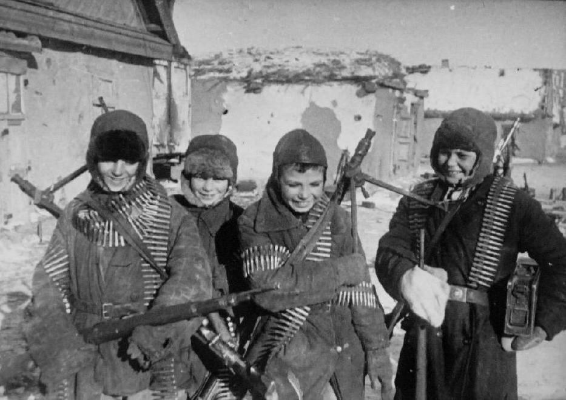在图片中，年轻的苏联公民用武器和弹药行事 
 他们的家乡斯大林格勒(Stalingrad)的载体。 已经获得了武器和弹药 
 法西斯战争。 

 斯大林同志在所有这一切中的伟大领导 
 让我们记住第二次世界大战，因为他是国际无产阶级 
 作为纳粹德国斯瓦斯蒂卡门票的历史时刻的领导者
著作还提到巴西同志们怎么说 
 第二次世界大战中法西斯主义的胜利是一个无产阶级 
 世界革命过程的重大事件。 三个重要 
 德国帝国主义力量，日本和意大利屈膝。 这 
 利润将是所有有意识的无产阶级的政党。 

 在图片中，从拿起纳粹德国斯瓦斯蒂卡门票的那一刻起绘画 
 作为1945年列宁陵墓前面的社会主义胜利的标志 

 在写作结束时，同志们借了一个中国共产党(KKP)和 
 他们估计伟大的反法西斯战争表明 
 社会主义体系的活力，当今的帝国主义是战争 
 资料来源，人民决定，武器和帝国主义是纸虎。 
 克服帝国主义攻击者是人民的革命者 
 部队在所有国家都变得统一，因此形成 
 在世界上最广泛的国际公司的战斗中 
 人民的主要敌人。 写作的同志决定了这些话： 
 “纳粹德国伴随着一支光荣的红军的步枪，社会主义粉碎了 
 无产阶级的独裁统治是在东德建立的。 事实 
 共产党和SNTL的危险信号颤抖了德国的黑暗和 
 毁坏的议会大厦(Reichstag)在屋顶上，无疑是一个美好的时刻 
 对于国际无产阶级。 那一刻象征着整个回忆录 
 英勇而光荣的与法西斯主义的战斗，苏联 
 捍卫和发展无产阶级世界革命。 
 迪米特罗夫同志的话：“我们创建了一个苏联的德国!” 
 在纳粹管辖区面前的莱比锡审判中，充满了大型 
 利润。” 

 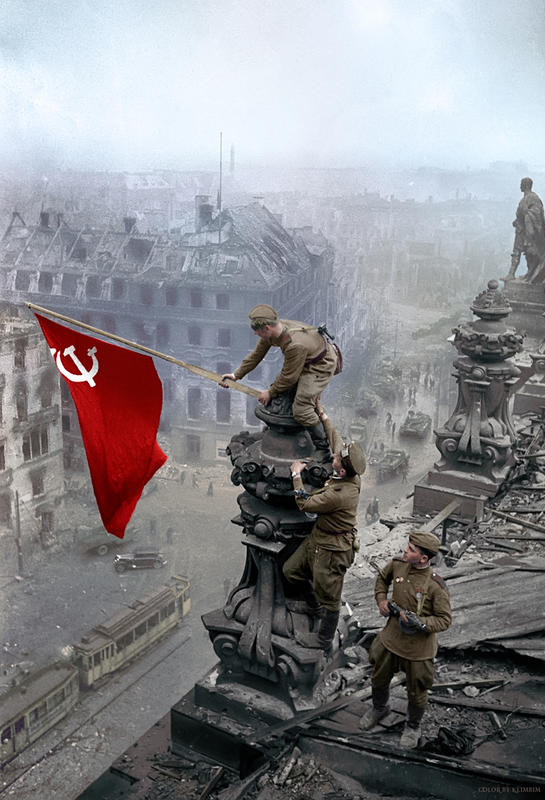1945年5月，红旗在德国议会飞行。

News Source: [https://punalippu.noblogs.org/post/2023/02/04/3890/](https://punalippu.noblogs.org/post/2023/02/04/3890/)

<!--NEWS-->

# 在萨尔塔（Salta），PCR纪念其55周年

作者: carga

时间: 2023-02-04T99:00:00

头部描述: 1月28日（星期六）在气态和相关水工业工人（苏蒂亚加）的工人联盟中表现出色，政党，组织，社会运动，领导人和武装分子纪念了萨尔塔革命共产党55年。

描述: Salta PCR纪念其55号周年纪念日。

图片: ['[Salta-acto-por-55-años-PCR.jpg](https://pcr.org.ar/wp-content/uploads/2023/02/Salta-acto-por-55-años-PCR.jpg)', '[Acto-Salta-por-55-PCR-300x170.jpg](http://pcr.org.ar/wp-content/uploads/2023/02/Acto-Salta-por-55-PCR-300x170.jpg)']

类型: article

<!--METADATA-->

Salta PCR纪念其55号周年纪念日。 
 “熊”，沃尔特·瓦尔，迭戈·阿罗约，菲德尔·帕吉奥尼和社会领导人， 
 联盟和武装分子，有一个伸展的苏蒂亚加，演讲者谴责了 
 穿越全省的危机，权利的进步并同意 
 形成一个实现流行领域的统一性的广阔战线。 这 
 武装要求维罗妮卡·卡利瓦州长，并拒绝了“这三个战线 
 从右边”：JXC，让我们前进和省级裁决。 

 这次会议被染成最近的**héctor“ Pancho”的游戏 
 Quispe **，几天前去世，“一个必不可少的同志 
 对于革命斗争，”在场的人说。 告别 
 他在致敬中引起了情感掌声，使其他同志们的记忆， 
 AS ** OscarMonzón**和** Otto Vargas。** 

 在200多人面前，主桌由 
 PCR政治秘书** AlbertoRexgonzález**； **劳尔·阿尔斯(RaúlArce)**， 
 圣马丁协调员； **纳尔逊·萨拉萨尔(Nelson Salazar)**，山谷协调员 
 LERA，** Rafael Ruiz **和每个人的国家代表 
 工党和人民党主席**verónicaCaliva**。 

 在定义和政治协议的关键日子里，该法是 
 著名领导人在时空上重合的原因。 之间 
 他们出席了维多利亚州和参议员的主席 
 国家，** Sergio“ Bear” Leavy； ** Kolina的总统和 
 社会发展部参考中心协调员 
 **迭戈·阿罗约(Diego Arroyo)**和卡奇(Cachi 
 谁期望对选举策略的定义 
 下一次选举。 **丹尼尔·埃斯科托恩(DanielEscotorín)，**大众团结总裁 
 选举联盟的参考人之一“跳到生活良好”，这是 
 它汇集了其他各方和组织的领导人，尽管没有完成 
 在场，向他的问候。 演讲没有逃脱这种逻辑 
 选举，但他们还描绘了这种情况的危机情景 
 省级，权利的进步，国家管理方面的挑战和 
 将替代项目引导到前面的巧合 
 他们合并。 

 ** __ ** _“我们有巨大的挣扎和挑战，不仅在选举中，而且 
 一年，我们有很多挣扎” _，警告Arce，当前 
 分类主义者和好斗。 领导者暴露了_“调整 
 imf” _，用于“ _a欺诈由Macrismo签约” _ _ _ _详细介绍了情况 
 在省内，以贫困，水危机和 
 电动速率过高的发票。 

 _“权利是针对社会组织” _ _说 
 然后，萨拉萨尔(Salazar)分析了计划增强工作的情况， 
 这是最后一次的并发症。 强调了存在 
 政治领导人，并指出_“埃斯特拉达(Estrada)武装清单要出去 
 正确的”; “我们竞选了两个代表进入 
 国家的; 它背叛了我们，我们不想要更多相同的” _， 
 表达。 

 反过来，妇女论坛总裁艾琳·卡里(Irene Cari)提到 
 妇女和土著人的激进分子说：_“她们正在杀死我们，是时候了 
 停止机器，讨论我们国家想要的政策” _。 
 另一方面，他声称：“ _天文台的逆行空间 
 暴力对妇女的暴力不允许我承担，因为我是黑人，我是 
 Villera，因为我不是律师，因为我不是白人，因为我没有 
 承认我的政治图片” _，他判处 
 他赢得了OVM目录中组织的代表， 
 他仍然无法假设的位置。 

 就他而言，CacheñoWalterWayar提到了选举问题， 
 他敦促部队。 _“受欢迎的领域必须团结一个项目 
 政治，不作为不幸的地方，我们可以得到两个 
 更多的职位，因为这可能解决了经济问题 
 一个家庭，但不是该省的问题” _… 

 科利娜(Kolina)的总统迭戈·阿罗约(Diego Arroyo 
 政治部门； “ _提议，我们有能力管理，思考 
 人们需要什么，我们无法处理事工，但是今天他们是 
 窃取国民政府的所有白银，占预算的80％ 
 他们寄给该省，工作在哪里？” _声称。 他今天庆祝 
 所有人的战线都有国家和省级立法者，并指出 
 那_“右边的那让他感到恐惧。” 

 然后*** fernando“ huaino” corregidor **，** fob的引用， 
 滋养_“无政府主义，毛主义和左派的组织 
 革命性” _，警告右派的前进，在
他批判性地提到了国家管理，并要求自我批评。 ** __ ** _“ PCR 
 他忍受了两个军事独裁统治，这意味着什么以及他们拥有的 
 他们为我们的家人分裂了我们，分配了我们， 
 他们消失了，尽管如此，我们就在这里。 那是一方的价值”，_ 
 共享。 

 然后参议员塞尔吉奥·莱维****重新验证了组织的贡献 
 社交并花了一会儿来指代选举方面 
 随着我们的前进，它们已经被合并，以进行变革和统治 
 省级，三人遥不可及。 _“取得成功的唯一方法是 
 PV总裁说，与战斗和战斗。 他强调他们已经在工作 
 政府计划，批评省级管理。 进步 
 关于PCR和 
 ptp 

 随后，政治秘书阿尔贝托·雷克斯·冈萨雷斯(AlbertoRexgonzález) 
 “老师，”国际和区域场景说 
 构成局势，并巡回该国的历史时刻以了解 
 当前的现实。 _“在这些选举中，我们将面对最大的 
 受欢迎的部门可能广泛，但我们很清楚，只有 
 它没有到达。 我们必须组织，我们必须肯定失败 
 正确的。 领导人说，我们必须使不可能成为可能。 
 _“我们梦dream以求，在逆行寡头管理的跳跃中， 
 Misoginia和Macho，我们渴望有一名州长 
 革命和女权主义者。 但这是一个梦，我们没有施加它， 
 我们只是提出了它。 
 谁要求加利瓦加入州长。 

 应当指出的是，其他参考人和激进分子也存在 
 作为La Merced的议员，** Liliana Vilte **，** Estela Torres ** 
 lule社区，** dignity的** fidel Puggioni **，** MarcelaGutiérrez** 
 人权表和** Petrona Espinoza **，中心主席 
 圣贝尼托社区。 

 **** 

 **“我们必须给我们的人民一个主权，受欢迎，女权主义者和 
 革命” ** 

 国家副副手维诺卡·卡利瓦(VerónicaCaliva)是关闭该法案并反思的人 
 1968年PCR的诞生，当时它与共产党分开 
 阿根廷反对后者的“改良主义者”目光。 自始至终 
 他的讲话是指女权主义，土著运动，工会主义 
 这些演员在萨尔塔的发生率。 

 _“女权主义有辩论，我们必须讨论一些想法。 没有 
 比野餐或受欢迎餐厅中的女人更好的政治图片 
 喂养人，邻居，他们的孩子； 缝制背包和 
 服装是因为还不够。 这些是我们需要的政治绘画 
 领导者强调，他们为我们感到自豪。 

 他还回忆起工会主义的“统一”时代，当时“埃尔·黑人” 
 Monzón和Buenaventura David领导着大型斗争。 还 
 庆祝社会运动的成长和工作，“ _hoy 
 他说，我们的社会组织比另一个更受妥协的社会组织。 

 _“我们是来自革命左派的许多政党， 
 我们将旗帜保存由房屋释放。” _说， 
 国家立法者。 声称佩隆主义为_“阶级兄弟” _和 
 导致Perón和Evita的深刻变化。 此外，卡利瓦回忆起他的 
 19岁时的好战分子，_” 
 '狗'santillán” _ _或_«在莫斯科尼和塔塔加尔战斗贫困和 
 YPF和Menemist十年的交付”，以及激进 
 动员学生去附近的大学。 

 卡利瓦严重地批评省级管理，并提交紧急情况 
 水，电和性别暴力，并指出了错误的承诺 
 矿业。 _“有一个精英和少数群体可以占有一切，没有一个 
 在罗伯托政府之后，人们可以强调的公共政策 
 罗梅罗”，_指出。 

 Caliva保证，近年来每个人的战线都取得了成就 
 _“将面孔更改为权力。” _ _“我们都在2019年进行了战斗 
 NoraGiménez和Lucas Godoy是立法者，在2021年为Pamela 
 Caletti和Emiliano Estrada在同一地方。 但是我们感到 
 他们背叛了，我们想说的是，所以我们有义务 
 讨论” _，他在参考前线时说。 让我们前进，因为政府 
 他说，目前的“ _您不会解决萨尔塔的问题。” 

 他还问_“首都战斗”，“我们不能把它交给 
 是的，如果我们是多数席位，” _说，也警告说，在该省不是 
 你可以赢得_“比萨恩兹的灾难更顽固的权利
团结”，并提到塞尔吉奥·马萨(Sergio Massa)的经济管理，_“ 
 付款和交付，但想删除社交计划_”， 
 声称。 

 最后，应他的同伴要求领导 
 政府的公式说，他从不为职位而雇用，_政治， 
 武装和争取团结的斗争使我成为副手 
 国家，” _表示。 向在场的领导人发出明确的信息， 
 萨尔塔·基尔奇尼斯主义和受欢迎的坎波的参考人士得出结论：_“我是 
 愿意与Sergio Leavy，Diego Arroyo，Walter Wayar，Daniel争论 
 Escotorín和EliaFernández，以及所有尚未定义什么的同伴 
 这样做，以便我们定义谁是最大的承诺 
 负责省级公式和候选人名单 
 省”。_ 

 **通讯员**

News Source: [https://pcr.org.ar/nota/en-salta-el-pcr-conmemoro-su-aniversario-55/](https://pcr.org.ar/nota/en-salta-el-pcr-conmemoro-su-aniversario-55/)