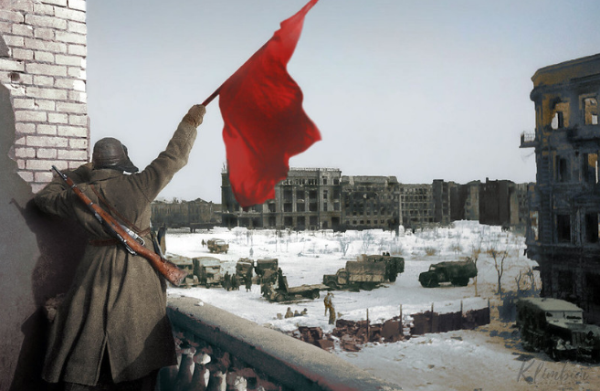

# Flere hundredetusinde offentligt ansatte strejker i Storbritannien

Author: socialistiskrevolution

Publish Time: 2023-02-04T04:00:00+00:00

Modified Time: 2023-02-05T09:15:11+00:00

Description: Storbritannien lammes i øjeblikket af hundredetusinder arbejderes strejke indenfor den offentlige sektor. Samtidig foregår der protester over hele landet imod regeringen. Mere end 23.000 skoler i l…

Images: ['[london-uk-16th-jan-2023-protesters-with-placards-protesters-and-speakers-gather-opposite-downing-street-for-the-protect-the-right-to-strike-emergency-demo-including-members-of-the-rmt-t-1.jpeg](https://socialistiskrevolution.files.wordpress.com/2023/02/london-uk-16th-jan-2023-protesters-with-placards-protesters-and-speakers-gather-opposite-downing-street-for-the-protect-the-right-to-strike-emergency-demo-including-members-of-the-rmt-t-1.jpeg)', '[th-4119143806-edited.jpeg](https://socialistiskrevolution.files.wordpress.com/2023/02/th-4119143806-edited.jpeg)', '[th-1179436622-edited.jpeg](https://socialistiskrevolution.files.wordpress.com/2023/02/th-1179436622-edited.jpeg)']

Type: article

Categories: ['Uncategorized']

<!--METADATA-->

Storbritannien lammes i øjeblikket af hundredetusinder arbejderes strejkeindenfor den offentlige sektor. Samtidig foregår der protester over helelandet imod regeringen.

Mere end 23.000 skoler i landet kommer til at lukke, når mere end 100.000lærere går i strejke i England og Wales.

Lærernes strejker rammer bredt, fordi et andet formål, udover borgerliguddannelse for bourgeoisiet, er at skolerne fungerer som daginstitutioner forbørn fra proletariske familier. Uden et sted at sende børn til iarbejdstimerne, må folk søge alternativer til at få deres børn passet. Detrapporteres at nogen familiemedlemmer vil tage fri på skift, hvilket ogsårammer andre områder af produktionen i landet.

Samtidig med lærernes strejke, nedlægger også universitetslektorer,lokoførere, buschauffører og sikkerhedsvagter arbejdet med krav om højere løn,bedre pension og jobsikkerhed.

Desuden ventes der flere massestrejker senere på måneden, da titusindvis afambulancereddere på tværs af landet går i strejke den 10. februar som resultataf en længerevarrig strid for højere løn og mere personale.

Strejkerne og protesterne finder også sted imod Premierminister Rishi Sunak oghans regeringens nye strejkebryderlov, der skal gøre det muligt forvirksomheder at fyre arbejdere, der under strejke, ikke udfører en»minimumservice«, dvs. ikke mindst delvist arbejder understrejken. Rishi oghans regering prøver forgæves at følge i Margeret Thatcher’s fodspor, somstrejkebrydere, da de selv indrømmer de problemer, som proletariatetsorganisering bringer dem.

De britiske fagforeningers landsorganisation TUC peger på at briterne igennemsnit får, hvad der svarer til 1700 kroner mindre om måneden i dag, endde gjorde for ti år siden.

I slutningen af sidste år lancerede mere end 100.000 britiske sygeplejerskeren landsdækkende strejke, fordelt på 76 offentlige hospitaler, sunhedscentre,hvilket indledte den første nationale sygeplejerskestrejke landet nogensindehar set. Strejkens krav minder bl.a. om kravene hos sygeplejerskerne i Danmarktilbage i 2021, med krav for bl.a. højere løn.

Vi ser, hvordan imperialismens krise, som bæres af proletariatet, skubberproletariatet ud i kamp og modstand mod angrebene på vores rettigheder.Proletariatet ser igennem det imperialistiske bourgeoisis løgne ogfrygtmageri, som de forsøger at sprede om den imperialistiske krig, mens deopruster og angriber proletariatets rettigheder i navnet på »forsvaret afFort-Europa«.

Source: [https://socialistiskrevolution.wordpress.com/2023/02/04/flere-hundredetusinde-offentligt-ansatte-strejker-i-storbrittanien/](https://socialistiskrevolution.wordpress.com/2023/02/04/flere-hundredetusinde-offentligt-ansatte-strejker-i-storbrittanien/)

<!--NEWS-->

# Militia Deputy Commander Of CPI (Maoist) Arrested By DRG In Dantewada District

Author: Alan Warsaw

Publish Time: 2023-02-04T05:15:02+00:00

Update Time: 2023-02-04T20:33:43+00:00

Images: ['[arrested_pic_20200130142730-800x445.jpg](https://www.redspark.nu/wp-content/uploads/2020/04/arrested_pic_20200130142730-800x445.jpg)']

Tags: ['Chhattisgarh', 'CPI (maoist)', 'CPI(maoist)', 'Daka Muchaki', 'Dantewada', 'Dantewada District', 'District Reserve Guard', 'DRG', 'Gondaras Panchayat of the CPI (Maoist)', 'India', 'Malla', 'Naxal', 'naxalites', 'naxals', 'police', 'Political Prisonner', 'PPW in India']

Categories: ['India', "People's War", 'Political Prisoners']

<!--METADATA-->

**Dantewada District, February 4, 2023:** A cadre of the CPI (Maoist) wasarrested on Saturday in Chhattisgarh's Dantewada district.

Dantewada Superintendent of Police Siddharth Tiwari told The Pioneer thatMalla alias Daka Muchaki (34) was apprehended by the District Reserve Guardfrom a jungle between Gondaras and Potli villages.

He was the militia platoon section deputy commander of Gondaras Panchayat ofthe Maoist party, he said.

He was involved in several Maoist incidents last year.

> Source : https://www.dailypioneer.com/2023/state-editions/maoist-arrested-> in-dantewada.html

Source: [https://www.redspark.nu/en/peoples-war/militia-deputy-commander-of-cpi-maoist-arrested-by-drg-in-dantewada-district/](https://www.redspark.nu/en/peoples-war/militia-deputy-commander-of-cpi-maoist-arrested-by-drg-in-dantewada-district/)

<!--NEWS-->

# Rødt-sentralstyremedlem ut mot våpen-støtte

Author: Tjen Folket Media

Description: Debatten fortsetter i og rundt partiet Rødt, som hittil har holdt fast ved sitt nei til norske våpen til Zelenskiy-regjeringen. For norske våpenforsendelser har dette liten betydning, for hele rest…

Publish Time: 2023-02-04T07:00:00+00:00

Modified Time: 2023-02-03T13:07:06+00:00

Images: ['[raketter-i-ukraina-1160x687.jpg](https://tjen-folket.no/wp-content/uploads/2022/06/raketter-i-ukraina-1160x687.jpg)']

Tags: None

Category: 'Innenriks'

<!--METADATA-->

* * *

Av en kommentator for Tjen Folket Media.

* * *

**Debatten fortsetter i og rundt partiet Rødt, som hittil har holdt fast vedsitt nei til norske våpen til Zelenskiy-regjeringen. For norskevåpenforsendelser har dette liten betydning, for hele resten av Stortingetstøtter regjeringa i denne saken, men for Rødt er spørsmålet likevel viktig.**

Sentralstyremedlem Synne Høyforslett Bjørbakk fra partiet Rødt erførstekandidat til fylkestingsvalget i Nordland og medlem av regjeringensforsvarskommisjon. Avisa Klassekampen skriver at hun er uenig med store delerav partiledelsen i synet på norske våpen til Ukraina. Stridsspørsmålet skalavgjøres på Rødt-landsmøtet som holdes i Stavanger i slutten av april.

Regjeringen har nettopp valgt å sende Lepoard-stridsvogner, i likhet med flereandre europeiske land. Bjørbakk er bekymret for at opptrappingen kan føre tileskalering av krigen, og at en farlig situasjon blir enda farligere. Hun sierat spenningen kan øke i nordområdene og at Norge ikke er tjent med det.

Hun sier til Klassekampen: «Kanskje Ukraina lukkast. Men krigen kan også endeveldig dårleg i den forstand at krigen eskalerer utover Ukraina, ogkjernevåpen blir tatt i bruk. Eg syns den politiske debatten, og i alle fallden siste veka, tek for lett på alvoret i situasjonen. Eg saknar ei kritiskoffentlegheit som stiller spørsmål ved om det finst andre handlingsalternativenn å sende meir våpen». Bjørbakk er også tydelig på at krigen kan blilangvarig, uansett om Norge sender våpen eller ikke.

Bjørbakk slår fast at Ukraina fører en legitim forsvarskrig og at partietstøtter denne, men at krigen også har en «geopolitisk side». Hun referer tilrusslandsforsker Cecilie Hellestveit og hennes analyse av krigen som «enlandkrig om sjø», hvor Russland ser det som avgjørende å ha kontroll på haveti nord og i sør (Svartehavet) for å stå imot press fra USA og Kina, og at USAogså har sine interesser. Rødt-sentralstyremedlemmet sier krigen i Ukraina erspesiell, fordi den har potensiale til å eskalere utover Ukraina og bli enstorkrig.

Til sist slår hun fast at hun ikke ønsker noe nytt parti, og er ikke enig i desom sier dette er nødvendig om Rødt sier ja til våpen. Hun og flere andre harsignalisert denne holdningen, og det ser dermed ut som det er lite sannsynligat dette skjer, eller at om det skjer, vil det bli en relativt litenavskalling.

Tjen Folket Medias standpunkt er kort sagt: Den russiske imperialismen harangrepet Ukraina, den ukrainske nasjonen fører en legitim frigjøringskamp, somvi støtter uten forbehold. Zelenskiys regime er et resultat av«oransjerevolusjonen» og Euromaidan, hvor blant annet fascistiske paramilitæreog yankee-imperialismen etterhvert var tungt involvert. Zelenskiy er en lakeifor hovedsakelig USA, og representerer ikke interessene til den ukrainskenasjonen. USA-NATO sin støtte til sin lakei er ikke i den ukrainske nasjonensinteresse. Hovedsaken for antiimperialister i Norge er å bekjempe den russiskeimperialismens angrepskrig og støtte det ukrainske folket, uten å bli en delav USA-NATO og norsk imperialisme sin krigsinnsats.

**Les også:**

> [Rødt-ja til våpen kan splitte partiet](https://tjen-> folket.no/index.php/2023/01/27/rodt-ja-til-vapen-kan-splitte-partiet/)

> [Åpen splid i Rødt om Ukraina-støtte](https://tjen-> folket.no/index.php/2023/01/08/apen-splid-i-rodt-om-ukraina-stotte/)

> [Ukraina: Hva kan vi lære av krigen og hva vil avgjøre den?](https://tjen-> folket.no/index.php/2022/08/26/ukraina-hva-kan-vi-laere-av-krigen-og-hva-> vil-avgjore-den/)

> [Seks viktige spørsmål om krigen i Ukraina](https://tjen-> folket.no/index.php/2022/05/13/seks-viktige-sporsmal-om-krigen-i-ukraina/)

> [Aksjonsuke mot angrepskrigen mot Ukraina](https://tjen-> folket.no/index.php/2022/06/24/aksjonsuke-mot-angrepskrigen-mot-ukraina/)

> [Sammenhengen mellom imperialismen og opportunismen](https://tjen-> folket.no/index.php/2023/01/25/sammenhengen-mellom-imperialismen-og-> opportunismen/)

**Referanse** **  **[Redd krigen spreier seg – Våpen tilukraina](https://klassekampen.no/utgave/2023-01-27/redd-krigen-spreier-seg)

Source: [https://tjen-folket.no/index.php/2023/02/04/rodt-sentralstyremedlem-ut-mot-vapen-stotte/](https://tjen-folket.no/index.php/2023/02/04/rodt-sentralstyremedlem-ut-mot-vapen-stotte/)

<!--NEWS-->

# pc 4 febbraio - Airaudo cerca nuovi sbocchi per il sindacato (FIOM) rafforzando la linea della collaborazione di classe

Author: sindacatodiclasse

Time: 2023-02-04T09:18:00+01:00

Images: []

<!--METADATA-->

Pubblichiamo stralci di un intervista a Airaudo segretario della CGIL Piemonte

**Airaudo: «Ora la nostra lotta è fare squadra anche con i top manager»  ** **Il riconfermato segretario della Cgil del Piemonte: «Il sindacato devegestire l'agenda economica»**

«Non ho invitato al nostro congresso i top manager di Michelin e di Lavazza eil vicepresidente degli industriali torinese perché sono diventatocapitalista. Ma perché credo che il sindacato non può limitarsi a gestire glieffetti delle crisi ma deve diventare protagonista dell'agenda economica esociale di un territorio». **Giorgio Airaudo oggi sarà riconfermato segretarioregionale della Cgil del Piemonte**.

**Una scelta inusuale aprire un congresso della Cgil ospitando i topmanager.**  «Tutt'altro. Prima abbiamo parlato di pace con Luciana Castellina e di lavorocon i delegati. I top manager erano lì con noi perché non ci sono più luoghidove poter stabilire **un 'agenda comune di lavoro». **

**In che senso mancano i luoghi di dibattito?  **  «Un tempo c'era Fiat che regolava e gestiva tutto. Poi certe rotte venivanodisegnate nei salotti. Oggi in Piemonte non c'è più niente. I problemi sonotanti dobbiamo trovare il modo di affrontarli e risolverli assieme».

**Le aziende poi puntano sulla flessibilità.  **  «Questa è un'emergenza da molti anni. In Italia abbiamo 45 modalitàcontrattuali di ingresso nel mondo del lavoro, in Spagna ne hanno ridotte adue e infatti creano posti di lavoro. Madrid, tra l'altro, ha appena adeguatogli stipendi al costo della vita, alzando i salari dell' 8 percento. Noi nonriusciamo neppure a gestire la crisi sanitaria».

**Servono più investimenti pubblici?** «Senz'altro. La sanità piemontese èallo stremo. Siamo riusciti con una fatica estrema a stabilizzare un migliaiodi infermieri ma è troppo poco soprattutto per una regione che invecchiarapidamente».

**Infatti oggi Cgil parla più di sanità che di Mirafiori. È un segno deitempi?**  «Abbiamo parlato anche di Mirafiori. Ho chiesto lumi al governatore AlbertoCirio sull'accordo tra Regione e Stellantis sul Recycling hub della fabbricatorinese. Si tratta di un accordo riservato di cui non sappiamo nulla. E tral'altro da cui il sindacato è stato, inaspettatamente, escluso».

Source: [https://proletaricomunisti.blogspot.com/2023/02/airaudo-cerca-nuovi-sbocchi-per-il.html](https://proletaricomunisti.blogspot.com/2023/02/airaudo-cerca-nuovi-sbocchi-per-il.html)

<!--NEWS-->

# CPP Statement Condemning Marcos&#8217; Refusal To Cooperate With ICC

Author: Alan Warsaw

Publish Time: 2023-02-04T10:29:12+00:00

Update Time: 2023-02-04T20:30:00+00:00

Images: ['[ab-dailies-icc-prosecute-duterte-1024x502-1-800x445.png](https://www.redspark.nu/wp-content/uploads/2023/02/ab-dailies-icc-prosecute-duterte-1024x502-1-800x445.png)']

Tags: ['AFP', 'communist party of the philippines', 'CPP', 'CPP-NPA-NDF', 'CPP-NPA-NDFP', 'Duterte', 'EDCA', 'Enhanced Defense Cooperation Agreement', 'Ferdinand “Bongbong” Marcos Jr', 'Ferdinand Marcos Jr.', 'ICC', 'International Arbitral Tribunal', 'International Criminal Court', 'Marco L. Valbuena', 'Marcos', 'Marcos II Regime', 'Marcos-Duterte Regime', 'Mutual Defense Treaty', 'National Democratic Front of the Philippines', 'NDFP', "new people's army", 'NPA', 'Philippine Revolution', 'Philippine Revolution Web Central', 'philippines', 'PPW in the Philippines', 'United Nations', 'United States', 'US', 'US-Duterte regime', 'US-Marcos Dictatorship', 'USA', 'West Philippine Sea']

Categories: ["People's War", 'Philippines']

<!--METADATA-->

**Marco Valbuena | Chief Information Officer | Communist Party Of ThePhilippines**

**February 4, 2023**

As expected, the Marcos government declared its refusal to cooperate with theInternational Criminal Court (ICC) in its plan to commence pretrialinvestigation into the charges of crimes against humanity against RodrigoDuterte over his sham “war on drugs” during his time in Malacañang.

Marcos and his minions are Duterte’s veritable defense lawyers. They are usingthe people’s money and the entire Philippine government to stop any and alleffort to make Duterte account for the killing of more than 30,000 peopleduring the violent spree of police and vigilante operations which he orderedand incited.

Marcos falsely declares “confidence in the fully functional domestic judicialsystem” which clearly has failed to address the aspirations for justice of thetens of thousands of families clearly who fell victim to Duterte’s carnage.

In Duterte’s defense, the Marcos government hypocritically invokes sovereigntyto stop the ICC from performing its sworn duty as an international body thatclosely works with the United Nations and other widely recognized multilateralagencies.

Marcos and his minions have the least credibility to talk of defendingsovereignty in the face of its continuing failure to assert the country’smaritime rights in the West Philippine Sea as recognized by the 2016 decisionof the International Arbitral Tribunal.

What defending sovereignty is Marcos talking about when he has not lifted afinger to end the Mutual Defense Treaty and unequal military treaties with theUnited States, and in fact, has acceded to the US plan to construct moremilitary bases and facilities in AFP camps under the Enhanced DefenseCooperation Agreement (EDCA).

The Filipino people must oppose the Marcos government’s refusal to cooperatewith the ICC, and push the demand for exposing the entire truth about thebogus “war on drugs,” and for Duterte to be punished for all his crimes.

> Source : https://philippinerevolution.nu/statements/on-marcos-refusal-to-> cooperate-with-icc/

Source: [https://www.redspark.nu/en/peoples-war/cpp-statement-condemning-marcos-refusal-to-cooperate-with-icc/](https://www.redspark.nu/en/peoples-war/cpp-statement-condemning-marcos-refusal-to-cooperate-with-icc/)

<!--NEWS-->

# Prensa Chiripilko Blog oficial del medio independiente de la provincia de Curicó, región del Maule, Chile.

Author: Verein der Neuen Demokratie

Description: Prensa Chiripilko Blog oficial del medio independiente de la provincia de Curicó, región del Maule, Chile. VIERNES, 3 DE FEBRERO DE 2023 Mau...

Time: 2023-02-04T13:31:00+01:00

Images: ['[IMG_20230112_120320_466.jpg](https://blogger.googleusercontent.com/img/b/R29vZ2xl/AVvXsEiWNBIjj3whiXHCQCP1mCeXxZLUPPjq_xUp_lUBeA1RlRpnF9t2oI3nnJtj6WI5_lsf6lGWze3cu2kJZlhOxjg0xkra1I8Jher9lrLUHHg1in7t_B_HysWxNiILSnVHP9EHbQT0iR3o0g_TVIWSv-JCWXLboKIkRqzbpXCiAI51d_EMbK0G8aqV4nMx/w400-h400/IMG_20230112_120320_466.jpg)', '[IMG_20230112_120320_470.jpg](https://blogger.googleusercontent.com/img/b/R29vZ2xl/AVvXsEgfQ7bMQof-LcI3UEfxnirTOkOUyR-F5s3a5iTwObIVHwkpNuXUGfhUkyXTb7Zh0SvukWpXfZb_A4RgrLilf05YX37i3JkTRiEDohVPO1clNm5OEVltUAvs8yjw8WEhT-eIQ_Odlp98S8v83qWl_oJAgqAKCoCPkdIZYtcPv55AcGEL5td5ab6IYfkp/w400-h400/IMG_20230112_120320_470.jpg)', '[IMG_20230112_120320_479.jpg](https://blogger.googleusercontent.com/img/b/R29vZ2xl/AVvXsEgqDTuls7X9KYnXlObzhcd59J2A42pGRRjnGquLqgagUf531_MbBx9e3mipmf5vbkOhwQvXHsD033pKVOsO4v3s5T7bsegFhF4m_wTiSIgl1-bdHGufFItlNkgoOjMNTVzw9Sam-wQgbMUxiHHbWF10DLX1e9xxFY09-RuTfEZcTMIF-ogCMoqH2xaH/w400-h400/IMG_20230112_120320_479.jpg)', '[IMG_20221227_180232.jpg](https://blogger.googleusercontent.com/img/b/R29vZ2xl/AVvXsEi8x0ROsxb4MELtukxA52Ti2fmiSDe81IM7P0VZr8Vb9-rtXu6xWpNIfBmAsuBjKgpnB4T2s9V-5GIdMTieiagbQZGY8zRu5pdOqIigyJkcINcg56-mqMxfgMJ8dFUetKVY8kQERVutGbpyeYk6NyQOMc6X5rEauVnUs1pMxtOadV04nG9fJHEYM8oD/w400-h300/IMG_20221227_180232.jpg)', '[IMG_20230129_110341.jpg](https://blogger.googleusercontent.com/img/b/R29vZ2xl/AVvXsEj5nt1xuTRrhwaiTjd-4zu2yzrv1m8XLO2tHqQgGWFVbinZZ0cxcAmJnX7yK-XVOhDIXt27ka0s60o4-aSEQy7tuXUvtKCX67yCeLnTvqzXy3L3AWGSFE6RPMTL4gi9iosoHZ-rfZls16cuA0OM-f6eKkLRxsE8LD70CAE6bz_PQixAyxuCtjKTOO31/w400-h300/IMG_20230129_110341.jpg)', '[IMG_20230129_111033.jpg](https://blogger.googleusercontent.com/img/b/R29vZ2xl/AVvXsEg4eENc4vU6BM1SIjT3Yb-NZsGin1Kzb9UUk02755233KJNsSuXmRwhuRSvYT4bE4zdOmKeh0Ep62dgDXIIzPFNh3swpFLzKYf71HBmbcT6Has0FY_XJnP0L511ztY_l8oBmDnXbtcqJ1AISir3wedjUsRkqiBJn93FoJ3RcD4AaSp8Bi6yfqPyzXHl/w300-h400/IMG_20230129_111033.jpg)', '[IMG_20230129_111039.jpg](https://blogger.googleusercontent.com/img/b/R29vZ2xl/AVvXsEjR0lQVznH9qpHwDYU6AMgsyswmcHlzzKQW9lOvQjkO8DCd29wtUhKPoAeXOTWSXU9APsvrrxN4QfaCpx30SqCKqJLWXwFjWVNzPSxXtl3nPjp5pmd_rWW6iLXDioQSg0ASpng6uqum3gAOfMS1Qu4dMINx-ns0SqMpe7vRRGCbcGYFZW4C_T1hRmXG/w400-h300/IMG_20230129_111039.jpg)', '[IMG_20230129_103412.jpg](https://blogger.googleusercontent.com/img/b/R29vZ2xl/AVvXsEhsY169W8EVXilCufZqlnqlTyH3bdSEszjXLHXHf97_WZzhnp5i-vX-0GsmtBnHbkgQ_W5EwPPNF3UhaLBhIrcLEL7PxwDaqeS1bvSJkds3vYtJQnSRNj_Y1t5LUqt567E_9np9BD1_NW7nVjfCuRpj8p7-tbNe6EWvFunXeJEIdLtDudf2wfDcwoqL/w400-h300/IMG_20230129_103412.jpg)', '[IMG_20230129_114942.jpg](https://blogger.googleusercontent.com/img/b/R29vZ2xl/AVvXsEh5O32xzSisC2EqszMffhDvJnFIP7HaopmYS4JYvfHmW-aDBw-yI0V1atx-iW-L3j1Bn0TYImQ22C-UQ34Bc7knIj8csYLRQoDh4eUGvzhtvSK7GPn81K1uTHEvMcb5siegtrUhxgus2GGgzPNjPJT69t7XY2l6LwVDVtQ3Tq_oUoH76uOQAFBjPLIQ/w400-h300/IMG_20230129_114942.jpg)']

<!--METADATA-->

## Prensa Chiripilko

Blog oficial del medio independiente de la provincia de Curicó, región delMaule, Chile.

### VIERNES, 3 DE FEBRERO DE 2023

#### [Maule, Chile: Destacamento acciona en zonas ruralescampesinas.](https://prensachiripilko.blogspot.com/2023/02/maule-chile-destacamento-acciona-en.html)

Diversas acciones de agitación y propaganda han realizado revolucionarios/asen distintas partes de la provincia curicana, en especial en las zonascampesinas rurales.

Siendo plena temporada de cosecha de frutas, el llamado a los/as temporeros/asa luchar ha sido una constante ante el abuso sistemático que patrones ycontratistas han perpetuado a trabajadores/as agrícolas en una temporada 2022- 2023 marcada por los bajos salarios, las extenuantes jornadas de trabajo yla negación de derechos y elementos básicos de protección personal. Unainfografía elaborada tuvo buena recepción entre las masas campesinas ytemporeras donde se evidencia con datos científicos la explotación laboral:

Junto con este material, destacamentos han accionado en la región del Maulellamando a luchar:

  ---  Rayado mural en Villa El Sol, Hualañé      ---  Rayado mural en Limávida, Curepto      ---  Rayado mural en Constantué, Curepto

Además, frente a la crisis del imperialismo, en nuestro país el gobiernooportunista vendepatria de Gabriel Boric (Frente Amplio) en colusión con elrevisionismo del falso Partido Comunista de Teillier-Vallejos-Carmona, aplicaconcientemente los planes imperialistas, especialmente los dictados por losyankis quiénes mediante el Fondo Monetario Internacional (FMI) descargan lacrisis en los hombros de los pueblos que viven en Chile, especialmente en elcampesinado pobre y temporeros/as, donde la inflación a mediados de 2022alcanzó un 14,1%.

El alza de precios como alimentos, materiales de construcción y combustiblesque, pese a los últimos tener una leve baja estas semanas, no significa paranada una mejoría real y duradera para la vida de las masas.

Por esa razón, también se realizaron rayados contra las alzas y repudiando alactual gobierno del viejo Estado de Chile:

  ---  Rayado mural en puente, La Huerta      ---  Rayado mural en puente Los Escalones, Licantén

El camino propuesto es el de la organización y la lucha por una NuevaDemocracia, donde el pueblo conquiste sus derechos, en especial la lucha porla tierra que se concretará desarrollando la Revolución Agraria como parte delcamino por acabar con la vieja sociedad semifeudal, semicolonial, donde sedesenvuelve un capitalismo burocrático; justamente las 3 montañas que debemosaniquilar.

---

---          ---

en [febrero 03, 2023](https://prensachiripilko.blogspot.com/2023/02/maule-chile-destacamento-acciona-en.html "permanent link")

*[febrero 03, 2023]: 2023-02-03T11:50:00-08:00

Source: [https://vnd-peru.blogspot.com/2023/02/prensa-chiripilko-blog-oficial-del.html](https://vnd-peru.blogspot.com/2023/02/prensa-chiripilko-blog-oficial-del.html)

<!--NEWS-->

# pc 4 febbraio: DOPO IL PRESIDIO AL CARCERE DI VIA GLENO IL 5 FEBBRAIO IN PIAZZA A BERGAMO PER ALFREDO FUORI DAL 41,BIS

Author: sindacatodiclasse

Time: 2023-02-04T13:46:00+01:00

Images: ['[IMG-20230204-WA0001.jpg](https://blogger.googleusercontent.com/img/b/R29vZ2xl/AVvXsEiArfg7SKfp-i3vqXkkL7CPwaS5uHljjMsqnqWui0QF-cMUCPWMEDP5oSsngOyh4eeMOHXaYtZ6KLAkIPmS1dDHdWbbhb3Xjbca_Zw3aTmQRfIo64abY-NSyi3LumFJMwyn4_stWGtplXRLKLMO-4XfRlzolCaDuBQasM8Eo3n5Z0htQgE9wcY7Et7T/w640-h360/IMG-20230204-WA0001.jpg)', '[IMG-20230203-WA0014.jpg](https://blogger.googleusercontent.com/img/b/R29vZ2xl/AVvXsEiJZVdevNQk7_vYO2bJgIsPA19-LRWum68jBDwnspnEPUL6SVhrMor9pxmA1ehe_sTwQizPSOnksf1bC31gNaXX98e74-umOnLCfo-eqXeLfYZid7OA6h45dPLjg-TMALDAUjTnKta3t_71PNaRWlMP8dldi1t59SUgybdlr48VINLqycgWx_LJL-FB/w640-h320/IMG-20230203-WA0014.jpg)', '[IMG-20230202-WA0010.jpg](https://blogger.googleusercontent.com/img/b/R29vZ2xl/AVvXsEiidTytAiUK-nZ70EBT_rrmWWdYcH7x3O7cKsTVOlfAu5wYINQZp2FSTS9uatlIojLaM2KJT729VQBAmliO5CmLAPnl1_FfyBymN7kaO1b6yev1M3Jz5klL1bJ_8i1dIRz35NJaQMqs0Q4OskCFKMnzRUBwZW0epGbhCksaLvurJfYWHUyxtFlujdGD/w279-h400/IMG-20230202-WA0010.jpg)', '[IMG-20230204-WA0002.jpg](https://blogger.googleusercontent.com/img/b/R29vZ2xl/AVvXsEjgHUVKcBlzy1rQ_YDKw-yvVYZCuSqrSsIRB4sF1la-qSGyrGsEtIohoUCONj0VlEzrSscHv_0_49ytbg2O3Be0EJvyBRQDPz4AyalU24zgmdNHJWfH9qCnDhnB0EzvzD9evD1psEJDFpwHbM0EF9NmnA-RuJAunvZmh2k04PyzKLlulAjQV1rVtWlU/w400-h225/IMG-20230204-WA0002.jpg)', '[IMG-20230204-WA0003.jpg](https://blogger.googleusercontent.com/img/b/R29vZ2xl/AVvXsEhpiLCACJUqstwpwJdnm1BtqhkMCgihf-KSOxQr-ARHSSfiD2g4387-jeZEC64oe3g402FSxeqG0VIhRbFY0QfQCXWi__rO8Ea7w70SkPM3EHmxlJC6BryqFYZ4nTvVeT0aFp96-rbWuCjYzcTdMsZbWuQWR4RZzoU9yqmxbR4Hq6njBSaUJU3sSIIA/w400-h225/IMG-20230204-WA0003.jpg)', '[IMG-20230204-WA0004.jpg](https://blogger.googleusercontent.com/img/b/R29vZ2xl/AVvXsEhnsSM858QPiEv3T_pDcZTn34dZaChkCfAhpd0EesZSLfFRcNSSglWPwlb8EHY3tZOxdr_8qeCN64U7crjgtK3Kqt7oP5iXIOQAG9U6ObsSFs5cXtz_w1gbq2E9fapcMHnzTzPryLvkguNHcuyuR_tHjaDOZt_hQ3kewINIruP9f0NhMyGOvvS4CzAT/w400-h225/IMG-20230204-WA0004.jpg)']

<!--METADATA-->

L'assemblea delle compagne e dei compagni, dopo il partecipato presidio alcarcere di via Gleno a Bergamo, lancia un nuovo appuntamento solidale perdomenica alle ore 15.00, Bergamo, piazzale FS, per Alfredo fuori dal 41 bis,contro l'accanimento giudiziario, una tortura per l'abiura; contro l'ergastoloostativo.

Source: [https://proletaricomunisti.blogspot.com/2023/02/dopo-il-presidio-al-carcere-di-via.html](https://proletaricomunisti.blogspot.com/2023/02/dopo-il-presidio-al-carcere-di-via.html)

<!--NEWS-->

# Hamburg: Kundgebung gegen die Aggression gegen Palästina

Author: DEM VOLKE DIENEN

Time: 2023-02-04T16:23:06+00:00

Images: ['[HH-Palästina0402-3.JPG](https://www.demvolkedienen.org/images/HH/2023/HH-Palästina0402-3.JPG)', '[HH-Palästina0402-2.JPG](https://www.demvolkedienen.org/images/HH/2023/HH-Palästina0402-2.JPG)', '[HH-Palästina0402-1.JPG](https://www.demvolkedienen.org/images/HH/2023/HH-Palästina0402-1.JPG)']

Tags: ['Palästina', 'Freiheit für Palästina', 'freedom for palestine']

Category: None

<!--METADATA-->

In Hamburg versammelten sich am Samstag, den 04\. Februar 2023 Revolutionare,Antiimperialisten und Massen aus unterschiedlichen Landern, um gegen diekurzlichen Massaker und Bombardements, die Israel gegen das palastinensischeVolk durchfuhrte, zu demonstrieren. In Redebeitragen wurden die kurzlichenAngriffe auf den Gazastreifen und die Militaroperation in Dschenin, bei der 10Palastinenser ermordet wurden, scharf verurteilt. Dazu sturmten israelischeStreitkrafte in den vergangenen Tagen mehrere Abteilungen in verschiedenenGefangnissen, verlegten viele Gefangene willkurlich, verhinderten jegliche Artvon Besuchen und sperrten eine große Anzahl von Gefangenen in Einzelhaft. Am31. Januar 2023, sturmte die Gefangnisbehorde das Al-Damoon-Gefangnis undgriff vor allem weibliche Gefangene an. Auch auf diese Verbrechen wurde mitRedebeitragen auf der Kundgebung aufmerksam gemacht. Zudem wurde auch dieKriminalisierung der palastinensischen Bewegung hier in der BRD thematisiert,da die Berliner Landesregierung zum wiederholten Mal alle Versammlungen amNakba-Tag verbieten will. Es sprachen unterschiedliche internationalistischeund antiimperialistische Organisationen, sowie arabische Massen, die ihrenKlassenhass gegen die Unterdruckung des palastinensischen Volkes zum Ausdruckbrachten.

Es herrschte ein Klima der Verbundenheit und der Solidaritat bei denPassanten, die an der Kundgebung vorbeikamen. Viele schlossen sich derKundgebung an, riefen Parolen mit oder begannen zu der revolutionarenarabischen Musik, die gespielt wurde, zu tanzen. Auch von der anderenStraßenseite riefen Vorbeikommende Parolen wie „Free, Free Palastine!" undbegrußten die Kundgebung mit erhobener Faust. Das zeigt, dass der Kampf despalastinensischen Volkes auch hier in der BRD gefuhrt werden kann, gefuhrtwird und auch gefuhrt werden muss. Die Zustimmung der Massen zeigt dasdeutlich.

Source: [https://www.demvolkedienen.org/index.php/de/t-international/7459-hamburg-kundgebung-gegen-die-aggression-gegen-palaestina](https://www.demvolkedienen.org/index.php/de/t-international/7459-hamburg-kundgebung-gegen-die-aggression-gegen-palaestina)

<!--NEWS-->

# Oggi e domani Assemblea nazionale a Torino di Nudm. Il nostro intervento

Author: fannyhill

Description: L'8 marzo vogliamo essere una importante trincea d’avanguardia, di opposizione unitaria, forte, visibile delle donne contro i padroni, il go...

Time: 2023-02-04T16:57:00+01:00

Images: ['[Piattaforma%20donne%208%20marzo%202023_page-0001.jpg](https://blogger.googleusercontent.com/img/b/R29vZ2xl/AVvXsEib6wbAYJhzULp3LVmmKTDQasFN9xf_zB7SPKyf4tz_C9NR9b2rShwwGM6CuF2cgRd5lZCu1JUNC-ThdpV8qYCHhcUcvdksLzb7EXtfA1ArVjMgdBQ_a-ypop35MIwzLXnJHprkfeFnYhq6W74xdMRxRYr21zFzH8zFeqeDPLQdr9vg-_kOn-IKukVg/w492-h640/Piattaforma%20donne%208%20marzo%202023_page-0001.jpg)']

<!--METADATA-->

L'8 marzo vogliamo essere una importante trincea d'avanguardia, di opposizioneunitaria, forte, visibile delle donne contro i padroni, il governo reazionarioche abbiamo, clerico-fascista, con al suo interno personaggi dichiaratamentesessisti. Questo lo abbiamo gia' fatto il 26 novembre, ma **l'8 marzo èsciopero! E con lo sciopero, a partire dai posti di lavoro, diciamo chiaro chesi tratta di una lotta di classe, di uno scontro tra la barbarie di questosistema sociale e il nostro bi/sogno che tutta la nostra vita deve cambiare.**E in questo noi donne, che siamo doppiamente sfruttate, doppiamente oppresse,quando lottiamo abbiamo una marcia in più, perchè vogliamo non dei miseri eoggi sempre più impossibili miglioramenti ma vogliamo la rivoluzione!

Il governo della Meloni ha rialzato la nera bandiera di "Dio, patria,famiglia"... e figli, perchè le donne vanno "pesate" e possono ricevere delleelemosine solo in base al numero di figli che hanno e che fanno per ilcapitale e oggi per la guerra imperialista, e si prepara ad attaccarepesantemente l'aborto, che accompagna sempre la doppia oppressione e ilmoderno medioevo per le donne. Oggi questa nera bandiera è l'ideologia utileper imporre miseria, guerra, attacco al lavoro, con l'inevitabile aumento deifemminicidi.

Per questo questo 8 marzo, in questi sciopero delle donne dobbiamo dire chiaroper cosa lottiamo. Noi non vogliamo una "trasformazione radicale del sistemaproduttivo capitalista", noi vogliamo il suo rovesciamento! Non possiamochiedere equita', transizione ecologica rispettosa dell'ambiente e dellenostre esistenze, equa distribuzione, ecc. ecc. a chi ogni giorno al massimonei convegni, nelle assise fa "bla, bla, bla" (come dice Greta) e poi neifatti ci toglie la vita.

Dobbiamo portare e lottare per una piattaforma che scaturisce dalle lottestesse delle operaie, delle lavoratrici precarie, delle disoccupate, donne deiquartieri. Questa è la piattaforma che noi proponiamo anche in questaassemblea ( _nota_ )

Oggi le lavoratrici dicono che non ce la fanno più per il carico di lavoro, lepesanti condizioni sul lavoro e fuori dal lavoro, nelle case. E alcune stannogia' trasformando questa grido in sciopero, lotta. Un esempio importante,anche per le altre lavoratrici, sono **le operaie della Beretta** , cheorganizzando loro direttamente una assemblea a fine ottobre, un'assembleadiversa, gestita direttamente dalle operaie, lanciano un messaggio diprotagonismo, unita', non delega, verso le altre donne, lavoratrici.

**E il 23 febbraio vi sara' una nuova assemblea, questa volta telematica, perorganizzare sui posti di lavoro lo sciopero dell'8 marzo, a cui chiamiamotutte ad esserci.**

MFPR

_Informiamo che lo Slai cobas per il sindacato di classe ha gia' indettoformalmente lo sciopero delle donne, aperto a tutti i lavoratori, dell'8marzo. Questa indizione copre sindacalmente tutte le lavoratrici, ancheiscritte ad altri sindacati o non iscritte._

Source: [https://femminismorivoluzionario.blogspot.com/2023/02/oggi-e-domani-assemblea-nazionale.html](https://femminismorivoluzionario.blogspot.com/2023/02/oggi-e-domani-assemblea-nazionale.html)

<!--NEWS-->

# Übersetzung:Massaker in Nova Mutum/RO: Neue Berichte denunzieren Folterungen und Rechtsverstoße während des Angriffs der Militärpolizei

Author: DEM VOLKE DIENEN

Time: 2023-02-04T20:04:12+00:00

Images: ['[1.jpg](https://www.demvolkedienen.org/images/Brasilien/AND/Übersetzung_Massaker_in_Nova_MutumRO_Neue_Berichte_denunzieren_Folterungen_und_Verletzungen_der_Rechte_während_des_Angriffs_der_Militärpolizei/1.jpg)', '[2.jpg](https://www.demvolkedienen.org/images/Brasilien/AND/Übersetzung_Massaker_in_Nova_MutumRO_Neue_Berichte_denunzieren_Folterungen_und_Verletzungen_der_Rechte_während_des_Angriffs_der_Militärpolizei/2.jpg)', '[3.jpg](https://www.demvolkedienen.org/images/Brasilien/AND/Übersetzung_Massaker_in_Nova_MutumRO_Neue_Berichte_denunzieren_Folterungen_und_Verletzungen_der_Rechte_während_des_Angriffs_der_Militärpolizei/3.jpg)', '[4.jpg](https://www.demvolkedienen.org/images/Brasilien/AND/Übersetzung_Massaker_in_Nova_MutumRO_Neue_Berichte_denunzieren_Folterungen_und_Verletzungen_der_Rechte_während_des_Angriffs_der_Militärpolizei/4.jpg)', '[5.jpg](https://www.demvolkedienen.org/images/Brasilien/AND/Übersetzung_Massaker_in_Nova_MutumRO_Neue_Berichte_denunzieren_Folterungen_und_Verletzungen_der_Rechte_während_des_Angriffs_der_Militärpolizei/5.jpg)', '[6.jpg](https://www.demvolkedienen.org/images/Brasilien/AND/Übersetzung_Massaker_in_Nova_MutumRO_Neue_Berichte_denunzieren_Folterungen_und_Verletzungen_der_Rechte_während_des_Angriffs_der_Militärpolizei/6.jpg)', '[7.jpg](https://www.demvolkedienen.org/images/Brasilien/AND/Übersetzung_Massaker_in_Nova_MutumRO_Neue_Berichte_denunzieren_Folterungen_und_Verletzungen_der_Rechte_während_des_Angriffs_der_Militärpolizei/7.jpg)', '[8.jpg](https://www.demvolkedienen.org/images/Brasilien/AND/Übersetzung_Massaker_in_Nova_MutumRO_Neue_Berichte_denunzieren_Folterungen_und_Verletzungen_der_Rechte_während_des_Angriffs_der_Militärpolizei/8.jpg)', '[9.jpg](https://www.demvolkedienen.org/images/Brasilien/AND/Übersetzung_Massaker_in_Nova_MutumRO_Neue_Berichte_denunzieren_Folterungen_und_Verletzungen_der_Rechte_während_des_Angriffs_der_Militärpolizei/9.jpg)', '[10.jpg](https://www.demvolkedienen.org/images/Brasilien/AND/Übersetzung_Massaker_in_Nova_MutumRO_Neue_Berichte_denunzieren_Folterungen_und_Verletzungen_der_Rechte_während_des_Angriffs_der_Militärpolizei/10.jpg)', '[11.jpg](https://www.demvolkedienen.org/images/Brasilien/AND/Übersetzung_Massaker_in_Nova_MutumRO_Neue_Berichte_denunzieren_Folterungen_und_Verletzungen_der_Rechte_während_des_Angriffs_der_Militärpolizei/11.jpg)']

Tags: None

Category: 'Lateinamerika'

<!--METADATA-->

_Als Ausdruck des proletarischen Internationalismus, anl asslich der grausamenNeuigkeiten, aus Solidaritat zu dem Kampf des brasilianischen Volkes undinsbesondere der Liga der armen Bauern, die gegen die Großgrundbesitzer, dieRauber des Landes Morder und Folterer des Volkes, kampft, um ihr Recht auf dasLand, welches die Grundlage ihrer Existenz bildet, und welches offentlichesEigentum war und niemandem gehorte, bis die Bauern kamen und es fur sichgewannen in dem sie es bearbeiteten und mit Schweiß und Blut zu ihrem Heimmachten und seit dem sich gegen die Versuche der kriminellen Soldnerbanden(Pistoleiros) und der Militarpolizei sie durch Terror, Mord und Folter zuvertreiben, um das Land dem Landrauber, dem Großgrundbesitzer Antonio Martinsdos Santos (Galo Velho - auf deutsch Alter Hahn) auszuhandigen, zu wehrsetzten, drucken wir unseren Beistand dem Kampf der armen Bauern der ÁreaTiago Campin dos Santos, in Rondonia aus, in dem wir die Übersetzung desfolgenden [Artikels der auf der SeiteANOVADEMOCRACIA](https://anovademocracia.com.br/noticias/18634-chacina-em-nova-mutum-ro-novas-denuncias-apontam-para-torturas-e-privacao-de-direitos-durante-ataque-da-pm) veroffentlicht wurde teilen die uns zugeschickt wurde.Wir denunzieren das niedertrachtige Gemetzel, dass die brasilianische Reaktionin der Área Tiago Campin dos Santos verubt hat, in dem sie auf drei armeBauern geschossen wovon sie zwei aufs grausamste gefoltert und ermordet hat,und den Terror den sie an dem armen Bauern die dort leben verubt haben. Dieseswiderliche, schmutzige und brutale volksfeindliche Verbrechen desbrasilianischen Staates erfullt uns mit tiefstem Klassenhass und kann uns nurin der Entschlossenheit starken unseren Kampf gegen den Imperialismus und dieReaktion zu bekampfen und zu vernichten. Die Toten leben weiter, nicht nur imKampf des brasilianischen Volkes, sondern im Kampf des internationalenProletariats und den Volkern der Welt. _

**Massaker in Nova Mutum/RO: Neue Berichte denunzieren Folterungen undVerletzungen der Rechtewahrend des Angriffs der Militarpolizei**

****

_Raniel Barbosa Laurindo (bekannt als "Mandruv a"), 24 Jahre alt, und RodrigoHawerroth (bekannt als "Estado"), 34 Jahre alt, wurden ermordet, nachdem sievon der Militarpolizei von Rondonia gefoltert worden waren. Foto: AND-Datenbank_

Am Morgen des 28. Januar, mitten am Samstag, ermordete dasSpezialeinsatzbataillon (BOPE) der Militarpolizei (PM) von Rondonia zweiBauern und terrorisierte mehr als 100 Familien (300 Bauern) bei einem neuenAngriff, der einen Teil der Bauern des Gebiets Tiago Campin dos Santos inRondonia betraf. Am 31.01. veroffentlichte die bralisianische Assoziation derAnwalte des Volkes - Gabriel Pimenta (Abrapo) einen Bericht und die Liga derarmen Bauern (LCP) von Westamazonien eine Mitteilung uber das Massaker. In denbeiden Dokumenten werden die feigen und terroristischen Handlungen beimdritten Angriff seit der Besetzung im Jahr 2020 enthullt.

Der brutale Angriff auf die Bauernfamilien ereignete sich wahrend einerBeschlagnahmungsaktion an dem Ort des Bauernhofs in Norbrasil. Drei Batailloneder MP fielen am 28.01. mit Dutzenden von Fahrzeugen und Drohnen ein. Diereaktionaren Militars schossen auf drei Bauern, griffen Hunderte von Bauernkorperlich an und raubten ihnen ihr Hab und Gut. Zwei der Arbeiter starbennach den sie gefoltert wurden. Marcos Rocha, der Gouverneur des Bundesstaates,wird von der LCP denunziert, weil er sich auf die Seite der landruberischenGroßgrundbesitzer stellt. Die Bauernbewegung bestatigt ebenfalls, dass dieOperation dazu diente, die "Privilegien und illegalen Interessen von GaloVelho" zu verteidigen.

Das grauenhafte Massaker, das von der Militarpolizei, dem Auftragsmorder desGouverneurs, Oberst Marcos Rocha, verubt wurde, fand in der Área Tiago Campindos Santos statt, die zu den Farmen Arco-iris und Norbrasil gehort. LautAbrapo ist der angebliche Eigentumer dieser Grundstucke das Unternehmen LemeEmprendimentos, das dem Grundbesitzer Antonio Martins gehort. "Galo Velho",wie er in der Region genannt wird, ist im "Weißbuch des Landraubs" als einerder großten Landrauber des Landes aufgefuhrt, gegen den die Zivil- undBundespolizei zusammen mit dem Ministerium fur offentliche Angelegenheitenermittelt, weil er Bewaffnete in der Region finanziert, die Landraub undVertreibung von Bauern betreiben.

_Bauern und Anw alte prangerten Verbrechen gegen das Volk an. Foto:Vervielfaltigung_

**BESETZUNG DES SITZES DER NORBRASIL FARM**

Am selben Ort hatte es bereits am 22. Januar einen Angriff gegeben. NachAngaben der LCP fuhren bewaffnete Militars aus Galo Velho in einem schwarzenPickup in die Gegend und feuerten Schusse auf unbewaffnete Manner, Frauen undKinder ab.

Am Vortag hatten Hunderte von Familien, insgesamt mehr als 300 Bauern, denSItz des Bauernhofs Norbrasil am Rande der Landstraße BR-364 besetzt. DasInteresse, dieses Grundstuck zu besetzen, wurde nicht nur von diesen 100Familien, sondern von der gesamten Área Tiago Campin dos Santos geteilt, denneine Fahrt von 100 km ist die einzige Alternative um ihre Hauser zu erreichen.Außerdem ist dieses Grundstuck aufgrund seiner Nahe zur Bundesstraße derwichtigste Platz um die Erzeugnisse der Bauern verkaufen zu konnen.

_Rodrigo Hawerroth bei der Arbeit an seinem Werk. Foto: Vervielf altigung_

**EINMARSCH DER POLIZEI: MASSAKER UND RECHTSWIDRIGKEITEN**

Die Polizei kam uber die BR-364 und schoss und warf Betaubungsbomben undTranengas. Andere Gruppen von Polizisten hielten an anderen Stellen Ausschau.Mit ihnen waren auch "Pistoleiros" unterwegs, die nach Berichten derBauernbewegung und der Abrapo Dienste fur Galo Velho leisteten.

Die ermordeten Bauern, Rodrigo Hawerroth (bekannt als "Esticado"), 34, undRaniel Barbosa Laurindo (bekannt als "Mandruva"), 24, gehorten zu der Gruppevon Bauern, die sich von den Bomben zuruckzogen. Die Gruppe beschloss, denFluss Cotia zu uberqueren und mit einem Boot zu fahren. In diesem Momentwurden sie von der Polizei uberfallen. Auf drei Bauern wurde geschossen (nebenRodrigo und Raniel wurde auch Kenedy angeschossen und ins Krankenhaus JoaoPaulo II gebracht).

_Kinder wurden von Gummigeschossen und Tr anengas getroffen. Foto:Vervielfaltigung_

_Die Familien waren den ganzen Tag ohne Essen in der Sonne. Foto: Vervielfaltigung_

_Lastwagen, der Bauern nach Vila Al ipio de Freitas in der Área Tiago Campindos Santos bringt. Foto: Vervielfaltigung_

Die drei Bauern wurden von der Polizei lebendig abgefuhrt, zwei von ihnenwurden jedoch nach schwerer Folter kurzerhand hingerichtet. Im Abrapo-Berichtheißt es: "Die Bauern, die sich ergeben haben, wurden gefoltert, die Spurensind an ihren Korpern zu sehen, wobei Rodrigo Prellungen am Korper und imGesicht von Gewehrkolben, einen Schnitt im Mund, ein ausgestochenes Auge undeine herausgeschnittene Zunge aufweist". Abrapo erklart, es sei nicht sicher,dass diese Informationen in den Leichenbericht aufgenommen werden (einDokument, fur das die Abteilung fur offentliche Sicherheit der Landesregierungvon Rondonia zustandig ist).

Nach diesem Angriff begann die Polizei mit der Belagerung der Familien, die inder Barracao das Maquinas, am Ort der Farm, kampierten. Die anwesendenFamilien versuchten, zum Fluss zuruckzukehren, wurden aber von denreaktionaren Militars daran gehindert. Die Bauern wehrten sich und riefen,dass sich Frauen, darunter auch schwangere Frauen, und Kinder in dem Ortbefanden, was von der Militarpolizei ignoriert wurde, die sofort anfing,"Gummigeschosse zu schießen und Brandbomben zu werfen, wobei Kinder getroffenwurden und Atemnot bekamen", heißt es in dem Bericht.

Die Bauern behaupten, dass die Polizeibeamten alle keinen Ausweis an ihrenUniformen trugen und von "Pistoleiros" der Farm begleitet wurden. DerBefehlshaber der Truppen (Oberstleutnant Pontes) beschimpfte die Bauern alsKriminelle, und die reaktionaren Militars erklarten, dass es darum gehe, "allezu toten". Die Familien wehrten sich gegen den Versuch, sie in einen Bus zusetzen, ohne sie uber ihr Ziel zu informieren, und wurden erneut geschlagen.Es wurden Blendgranaten geworfen und die Familien zogen sich zuruck, diesmalauf die Seite der Straße BR-364 (vor dem Bauernhof). Und sie blieben dort inder sengenden Sonne, ohne Zugang zu Wasser oder Nahrung. Ein Bauer wurde wegeneines Herzinfarkts in dasselbe Krankenhaus eingeliefert. Viele wurden durchGummigeschosse verletzt und hatten durch das Tranengas Atemnot. Frauen fielenin Ohnmacht und Kinder wurden ohne Nahrung zuruckgelassen.

_Rodrigo Hawerroth w ahrend einer kollektiven Aktivitat Foto:Vervielfaltigung_

_Rodrigo Hawerroth w ahrend einer kollektiven Aktivitat Foto:Vervielfaltigung_

Nur einigen wenigen Bauern gelang es, die Erlaubnis zu erhalten, einen Sackmit Kleidung aus der Hutte zu holen. Der Rest der Kleidung, Lebensmittel,Gefriertruhen mit Lebensmitteln, Gasflaschen, Mobiltelefone, Matratzen,Medikamente und andere personliche Gegenstande wurden nicht zugelassen. Diemeisten Habseligkeiten der Bauern blieben in den Hutten, die von der Polizeizerstort wurden. Die Bauern beschwerten sich bei den Anwalten, dass sie sahen,wie die reaktionaren Militars ihr Hab und Gut (Handys und Geld) stahlen.Daruber hinaus vergifteten die Polizisten auch Hunde und verseuchtenWasserbrunnen und fotografierten die Bauern, die sich vor Ort aufhielten.

Um die Bauern einzuschuchtern, fuhr die Polizei mit ihren Autos vorbei indenen sie die Leichen der ermordeten Bauern prasentierten. Mit demselben Zielwurden auch einige Bauern in den Sitz der Farm gebracht und dort bedroht undgeschlagen. Die Familien, die sich am Straßenrand aufhielten, wurden ebenfallsvon der Polizei und den Bewaffneten verprugelt, die sich dort aufhielten undihre defilierten. Einige Bauern wurden angeklagt und gegen sie wurdenStrafbefehle ausgestellt und werden sich wegen Ungehorsams vor demSonderstrafgericht (JEC) verantworten mussen.

Am spaten Nachmittag des 29.01. verließen die Familien den Ort und gingen zurVila Alipio de Freitas, die sich in der Área Tiago Campin dos Santos befindet.Dem Bericht zufolge zeigten sich die Bauern "sehr entrustet uber dieHinrichtungen und die Art und Weise, wie die Militarpolizei zum Schutz desLatifundiums vorging".

Lesen Sie den [Abrapo-Bericht](https://drive.google.com/file/d/1XGrO5QS8FWQilyKSLykrHW2SRLharrNJ/view)und den [Kommentar der LCP](https://resistenciacamponesa.com/luta-camponesa/policia-assassina-camponeses-durante-ataque-contra-familias/).

_(Auch mehr Bildmaterial)_

**ACHTUNG: SENSIBLE BILDER**

_Der Leichnam von Rodrigo Hawerroth mit Folterspuren. Foto: Vervielf altigung_

_Der Leichnam von Rodrigo Hawerroth mit Folterspuren. Foto: Vervielf altigung_

_Folterspuren an den K orpern von Rodrigo und Raniel. Foto: Vervielfaltigung_

Source: [https://www.demvolkedienen.org/index.php/de/42-nachrichten/lateinamerika/7461-uebersetzung-massaker-in-nova-mutum-ro-neue-berichte-denunzieren-folterungen-und-verletzungen-der-rechte-waehrend-des-angriffs-der-militaerpolizeials-ausdruck-des-proletarischen-internationalismus-aus-solidaritaet-zu-dem-kampf-des-brasilianischen-volkes-u](https://www.demvolkedienen.org/index.php/de/42-nachrichten/lateinamerika/7461-uebersetzung-massaker-in-nova-mutum-ro-neue-berichte-denunzieren-folterungen-und-verletzungen-der-rechte-waehrend-des-angriffs-der-militaerpolizeials-ausdruck-des-proletarischen-internationalismus-aus-solidaritaet-zu-dem-kampf-des-brasilianischen-volkes-u)

<!--NEWS-->

# 80 vuotta Stalingradin taistelun voitosta!

Author: mats

Time: 2023-02-04T99:00:00-04:00

Images: ['[stalingrad1.png](https://punalippu.noblogs.org/files/2023/02/stalingrad1.png)', '[you.png](https://punalippu.noblogs.org/files/2023/02/you.png)', '[stalingrad6.png](https://punalippu.noblogs.org/files/2023/02/stalingrad6.png)', '[stalingrad7.png](https://punalippu.noblogs.org/files/2023/02/stalingrad7.png)', '[stalingrad4.png](https://punalippu.noblogs.org/files/2023/02/stalingrad4.png)', '[stalingrad3.png](https://punalippu.noblogs.org/files/2023/02/stalingrad3.png)', '[stalingrad2.png](https://punalippu.noblogs.org/files/2023/02/stalingrad2.png)', '[you-1.png](https://punalippu.noblogs.org/files/2023/02/you-1.png)', '[jepberlin1.png](https://punalippu.noblogs.org/files/2023/02/jepberlin1.png)']

Categories: ['Yleinen']

<!--METADATA-->

Kommunistinen Internationaali ([ci-ic.org])(https://ci-ic.org/)) verkkosivustoon julkaissut kirjoituksen historiallisesta voitosta jonka Sosialististenneuvostotasavaltojen liiton (SNTL) työläisten ja talonpoikien punainen armeijasaavutti natsi-Saksasta ja sen liittolaisista Stalingradissa vuonna 1943.Stalingradin taistelun voitto oli historiallinen käännekohta toisessamaailmansodassa, mutta se oli myös merkittävä käännekohta koko ihmiskunnanhistoriassa, suurena etappina proletaarisen maailmanvallankumouksenprosessissa. Alkuperäinen kirjoitus on luettavissa englanniksi[täällä](https://ci-ic.org/blog/2023/01/31/on-the-80th-anniversary-of-the-victory-in-the-battle-of-stalingrad/) ja espanjaksi [täällä](https://ci-ic.org/es/2023/01/31/en-el-80o-aniversario-de-la-victoria-de-stalingrado/).

Kirjoituksessa toverit korostavat kuinka Kansainvälinen Kommunistien Liitto(KKL) on ottanut puheenjohtaja Maon kannan suhteessa toveri Stalinin rooliinhistoriassa. Hän oli suuri marxisti-leninisti, joka aikoinaan systematisoileninismin ja hänellä oli ratkaiseva rooli siinä, että toinen maailmansotapäättyi sosialismin voittoon. Lisäksi toveri Stalinista puhuttaessa ei voidamilloinkaan unohtaa hänen johtoaan Kommunistisen Internationalinseitsemännessä kongressissa, joka loi pohjan sille, että yhteisrintamatyötäkehitettiin onnistuneesti toisen maailmansodan melskeissä. Tuonyhteisrintamatyön johdosta toisen maailmansodan jälkeen proletariaatindiktatuuri voitti useassa Euroopan maassa, kun Albania, Bulgaria, Jugoslavia,Saksan demokaattinen tasavalta, Puola, Romania, Tšekkoslovakia ja Unkarilähtivät kansandemokratian tielle, myöhemmin myös Kiinan kansantasavaltaseurasi puheenjohtaja Maon johdolla, hieman omia reittejään näiden tietä.

Kirjoituksessa myös todetaan, että puheenjohtaja Mao on määritellytStalingradin taistelun koko ihmiskunnan historian kannalta merkittäväksitaisteluksi. Hänen mukaansa tätä taistelua ei tule nähdä vain taisteluksiNeuvostoliiton ja natsi-Saksan välillä, sillä Neuvostoliitto kävi toveriStalinin suuren johtajuuden alla oikeutettua sotaa natsi-Saksaa ja senliittolaisia vastaan, koko kansainvälisen proletariaatin jamaailmanvallankumouksen puolesta. Kokonaisuudessaan toinen maailmansota maksoinoin 25 miljoonan neuvostokansalaisen hengen. Tämä suuri antifasistinen sotaoli erittäin tärkeä inspiraation lähde oikeutetuille vapaussodille monissasorretuissa kolmannen maailman maissa.

Kuvassa toisen maailmansodan alussa Neuvostoliitossa jaettu juliste. Teksti:"Mennään eteenpäin, tuhotaan saksalaiset hyökkääjät ja heitetään heidät poisisänmaastamme!"

Toverit lainaavat kirjoituksessa vuoden 1942, heinäkuun 28.päivä julkaistuatoveri Stalinin käskyä: "[Ei askeltakaantaaksepäin](https://marxismileninismi.wordpress.com/2021/01/01/stalin-ei-askeltakaan-taaksepain-1942/)". Käskyssä vaaditaan neuvostokansalta yhäkovempia ponnistuksia sosialistisen isänmaan puolustamiseksi. Käskyssäsanotaan muun muassa: ___"_ _Jokaisen komentajan, sotilaan ja poliittisenupseerin on ymmärrettävä, etteivät resurssimme ole rajattomat. Neuvostoliitonalue ei ole autiomaata, vaan ihmisiä – työläisiä, maanviljelijöitä, älymystöä,isiämme ja äitejämme, vaimoja, veljiä ja lapsia. Alue, jonka vihollinen onNeuvostoliitolta vallannut, ja se mitä vihollinen haluaa kaapata, on leipää jamuita resursseja armeijalle ja siviileille, rautaa ja polttoainettateollisuudelle, tehtaita ja laitteistoa jotka toimittavat armeijalle aseita jaammuksia; tämä tarkoittaa myös rautateitä. Menetettyämme Ukrainan, Valko-Venäjän, Baltian, Donetskin altaan ja muita laajoja alueita, olemmemenettäneet paljon ihmisiä, leipää, metalleja, tehtaita ja tuotantolaitoksia.Meillä ei ole enää ylivoimaa henkilöstön ja elintarvikkeiden suhteen.Perääntymisen jatkaminen tarkoittaa meidän ja kotimaamme tuhoutumista.Jokainen pala maata jonka jätämme vihollisen haltuun vahvistaa heitä,heikentää taas meitä, puolustustamme ja isänmaatamme… Tämän takia onlopetettava keskustelu päättymättömästä vetäytymisestä, että meillä on laajatmaa-alueet, että maamme on suuri ja rikas, että meillä on valtava väestö jaettä meillä tulee aina riittämään leipää. Nämä keskustelut ovat valheellisiaja haitallisia, sillä ne heikentävät meitä ja vahvistavat vihollista. Jos emmelopeta perääntymistä, jäämme ilman leipää, polttoainetta, metallia, raaka-aineita, tehtaita ja rautateitä… Tämä tarkoittaa sitä, että on aika lopettaaperääntyminen. Ei enää askeltakaa taaksepäin! Tämä on iskulauseemme tästäeteenpäin._ " Toveri Stalinin käskyä seuraten neuvostokansa alkoi pitämäänperääntymistä petturuutena, ja huomionarvoista on että käytännössä kokoStalingradiin jäänyt väestö saatiin mobilisoitua, tukemaan tai tekemäänaseellista vastarintaa natsi-Saksan ja sen liittolaisten sotavoimia vastaan.

Stalingradin kaupunki liekeissä fasistien hyökkäyksen alussa.

Natsi-Saksan sotavoimat liittolaisineen (Italia, Romania, Unkari sekäukrainalaiset Bandera-rotat ja espanjalaiset francolaiset "vapaaehtoiset")hyökkäsivät Stalingradin kaupunkiin 23.päivä elokuuta vuonna 1942. Kaupunginvalloituksella fasisit pyrkivät rakentamaan aseman, hyökätäkseen sieltä kohtiKaukasuksen öljykenttiä sekä katkaisemaan Volgan liikennereitit. Kaupunginvalloittaminen oli fasistien kannalta tärkeää myös siksi, että sen tahtaissavalmistettiin paljon Neuvostoliiton sotatarvikkeita sekä kaupungin kauttakulki lautoilla noin 70 prosenttia maan käyttämästä öljystä. Kaupungintärkeydestä kertoo sekin, että kaupunki oli nimetty toveri Stalinin mukaan.

Kuvassa Stalingradin viimeisiin taisteluun käyviä puna-armeijan taistelijoitahelmikuussa 1943.

Stalingradin taistelun alussa fasistien 6.armeija valloitti suuren pinta-alankaupungista, mutta toveri Stalinin sekä marsalkoiden Georgi Žukovin jaAleksandr Vasilevskin käynnistämässä operaatio Uranuksessa neuvostojoukotjärjestettiin uudelleen. Operaatio Uranus alkoi 19.päivä marraskuuta vuonna1942. Tuona päivänä Stalingradin pohjoispuolella hyökkäsivät puna-armeijan24.armeija ja 66.armeija tehtävänään sitoa fasistit asemiinsa siten, että neeivät voi vetäytyä Donin yli. Kaupungin luoteispuolella hyökkäsivät puna-armeijan 5.panssariarmeija ja 21.armeija romanialaisia fasistijoukkojavastaan, murskaten ne täydellisesti jo operaation ensimmäisen päivän iltaanmennessä. Samaten heti seuraavana päivänä (20.11) puna-armeija jyräsinäytösluonteisesti romanialaisten Stalingradin rintaman etelän puoleisetjoukot. Menestyksellisen operaatio Uranuksen johdosta satojatuhansia natsi-Saksan sotilaita jäi mottiin Stalingradin kaupunkiin, lähes vaillaminkäänlaisia huoltoyhteyksiä. Tästä eteenpäin neuvostokansa valloittikaupunkia takaisin anastajilta huoneisto huoneistolta, talo talolta ja katukadulta, vapauttaen kaupungin fasisteista 2.päivä helmikuuta vuonna 1943.Suomalaisille on myös historiallisesti merkittävää se, että fasistien tappioonpäättyneen Stalingradin taistelun jälkeen suomalainen taantumusporvaristoalkoi tajuamaan, että sen liittolaisena toisessa maailmansodassa ollut natsi-Saksa tulee häviämään sodan ja näin ollen Suomen eräät johtavat poliitikotalkoivat hakemaan neuvotteluyhteyksiä liittoutuneisiin, saadakseen aikaanrauhan SNTL:n kanssa.

Punainen lippu liehuu Stalingradissa voiton merkiksi 2.2.1943

Kirjoituksessa myös korostetaan sitä, että natsi-Saksan ja sen Stalingradintaisteluun osallistuneiden liittolaisten hyökkäys kaupunkiin oli jättimäinenmobilisaatio fasisteilta. Hyökkäkseen osallistui miljoonia sotilaita jaesimerkiksi 75 prosenttia Wehrmachtin lennoista kulki Stalingradin suunnallesyksystä 1942 vuoden 1943 talveen saakka. Tästä huolimatta puna-armeijaselvisi taistelusta voittajana toveri Stalinin suuren johtajuuden alla.Tovereiden artikkelin mukaan yksi iso tekijä taistelun voiton kannalta oliNeuvostoliiton äärettömän hyvin tehty tiedustelutyö, ja toinen oli toveriStalinin onnistunut diplomaattinen työ. Lisäksi neuvostokansa käyttistrtegisen puolustuksen vaiheessa poltetun maan taktiikkaa sekä organisoikaikkialle fasistien selustaan partisaanijoukkoja. Perääntyessään puna-armeijapoltti kaikki pellot ja räjäytti tehtaat sekä rakennukset, tällöin fasisteilleei jäänyt mitään muuta kuin rakennusten raunioita ja tyhjiä peltoja.Fasisteille oli täysin yllätys, että sosialismin hengen täyttämät joukotpystyivät moisiin ponnistuksiin. Toverit huomioivat kirjoituksessaanverkkosivustolla myös aivan oikein, että Stalingradin taistelu todistaatosiasiaksi sen, että sodassa ihmiset ratkaisevat eivät aseet.

Kuvassa fasistien riveissä taistelleita puna-armeijalle antautuneitasotilaita. Natsi-Saksa ja sen liittolaiset menettivät Stalingradin taistelussaarviolta 850 000 sotilasta kaatuneina, haavoittuneina tai vangittuina, näistä400 000 saksalaisia, 200 000 romanialaisia, 130 000 italialaista ja 120 000unkarilaista.

Toverit kirjoittavat että neuvostokansa tiedosti proletariaatin diktatuurinolevan vaakalaudalla, vallankumouksen olevan vaakalaudalla. Tämäkollektiivinen tietoisuus takasi sen, että fasistien selustaan saatiin suuriapartisaanijoukkoja aseinaan kiväärit, käsikranaatit ja räjähteet tuhoamaanmonilukuista vihollista sekä häiritsemään sen sodankäyntiä esimerkiksituhoamalla rautateitä. Tämä ei ollut mikään yksinkertainen valinta, silläpartisaaneja odotti aina kuolema, jos he jäivät fasistien kynsiin.

Kuvassa nuoria neuvostokansalaisia, jotka toimivat aseiden ja ammustenkantajina kotikaupungissaan Stalingradissa. Aseet ja ammukset on saatusotasaaliina fasisteilta.

Toveri Stalinin suurta johtajuutta tässä kaikessa ei voi olla unohtamatta kunmuistellaan toista maailmansotaa, sillä hän oli kansainvälisen proletariaatinjohtajana sillä historiallisella hetkellä jolloin natsi-Saksan hakaristiliputheitettiin sosialismin voiton merkiksi maahan Leninin mausoleumin eteen.Kirjoituksessa mainitaan myös kuinka brasilialaiset toverit ovat todenneet,että voitto fasismista toisessa maailmansodassa on yksi proletaarisenmaailmanvallankumouksen prosessin suurista tapahtumista. Kolme tärkeätäimperialistista valtaa Saksa, Japani ja Italia lyötiin polvilleen. Tätävoittoa tulisi kaikkien luokkatietoisten proletaarien juhlia.

Kuvassa maalaus hetkestä jolloin natsi-Saksan hakaristiliput heitettiinsosialismin voiton merkiksi maahan Leninin mausoleumin eteen vuonna 1945

Kirjoituksen lopussa toverit lainaavat Kiinan Kommunistista puoluetta (KKP) jaheidän tekemäänsä arviota siitä, että suuri antifasistinen sota osoittaasosialistisen järjestelmän elinvoimaisuuden, imperialismi on nykyään sotienlähde, ihmiset ratkaisevat eikä aseet ja imperialismi on paperitiikeri.Imperialististen hyökkääjien voittamiseksi on kansan vallankumouksellisetjoukot saatava yhtenäisiksi kaikissa maissa ja näin ne muodostavatmahdolisimman laajan kansainvälisen yhteisrintaman taistelussa maailmankansojen päävihollista vataan. Kirjoituksen toverit päättävät näihin sanoihin:"Kunniakkaan Punaisen Armeijan kivääreillä natsi-Saksa murskattiin, sosialismija proletariaatin diktatuuri pystytettiin Itä-Saksassa. Se tosiasia, ettäkommunistisen puolueen ja SNTL:n punainen lippu liehui Saksan pimeän jaraunioituneen Valtiopäivätalon (Reichstag) katolla, on kiistatta suuri hetkikansainväliselle proletariaatille. Tuo hetki symboloi koko ikimuistoistasankarillista ja kunniakasta taistelua fasismia vastaan, Neuvostoliitonpuolustamiseksi ja proletaarisen maailmanvallankumouksen kehittämiseksi.Toveri Dimitrovin sanat: 'Me luomme neuvosto-Saksan!', jotka hän lausuiLeipzigin oikeudenkäynnissä natsien tuomiosistuimen edessä, täyettiin suuressavoitossa."

Punainen lippu liehuu Saksan Valtiopäivätalolla toukokuussa 1945.

Source: [https://punalippu.noblogs.org/post/2023/02/04/3890/](https://punalippu.noblogs.org/post/2023/02/04/3890/)

<!--NEWS-->

# En Salta el PCR conmemoró su aniversario 55

Author: carga

Time: 2023-02-04T99:00:00-04:00

Head Description: Con un gran acto en el Sindicato Unido de Trabajadores de la Industria Aguas Gaseosas y Afines (SUTIAGA) el día sábado 28 de enero partidos políticos, organizaciones, movimientos sociales, dirigentes y militantes, conmemoraron los 55 años del Partido Comunista Revolucionario de Salta.

Description: El PCR salteño conmemoró su aniversario n° 55. Con la presencia de Sergio 

Images: ['[Salta-acto-por-55-años-PCR.jpg](https://pcr.org.ar/wp-content/uploads/2023/02/Salta-acto-por-55-años-PCR.jpg)', '[Acto-Salta-por-55-PCR-300x170.jpg](http://pcr.org.ar/wp-content/uploads/2023/02/Acto-Salta-por-55-PCR-300x170.jpg)']

Type: article

<!--METADATA-->

El PCR salteño conmemoró su aniversario n° 55. Con la presencia de Sergio«Oso» Leavy, Walter Wayar, Diego Arroyo, Fidel Puggioni y dirigentes sociales,sindicales y militantes, con un SUTIAGA colmado, los oradores denunciaron lacrisis que atraviesa la provincia, el avance de la derecha y coincidieron enconformar un amplio frente que logre la unidad del campo popular. Lamilitancia pidió por Veronica Caliva gobernadora y rechazó “los tres frentesde la derecha”: JxC, Avancemos y el oficialismo provincial.

El encuentro estuvo teñido por la reciente partida de **Héctor “Pancho”Quispe** , quien falleció días atrás, “un camarada y compañero imprescindiblepara la lucha revolucionaria”, remarcaron los presentes. La despedida que sellevó un emotivo aplauso en homenaje trajo el recuerdo de otros camaradas,como **Oscar Monzón** y **Otto Vargas.**

Frente a más de 200 personas, la mesa principal estuvo encabezada por elsecretario político del PCR, **Alberto Rex González** ; **Raúl Arce** ,coordinador de San Martín; **Nelson Salazar** , coordinador del Valle deLerma, **Rafael Ruiz** y la diputada nacional por el Frente de Todos ypresidenta del Partido del Trabajo y del Pueblo, **Verónica Caliva**.

Con días cruciales para definiciones y acuerdos políticos, el acto fue elmotivo para que dirigentes de renombre coincidieran en tiempo y espacio. Entreellos estuvo presente el presidente del Partido de la Victoria y senadornacional, **Sergio “Oso” Leavy;** el presidente del partido Kolina ycoordinador del Centro de Referencia del Ministerio de Desarrollo Social**Diego Arroyo** y el senador provincial por Cachi, **Walter Wayar** , dequienes se esperan definiciones sobre la estrategia electoral que asumiránpara los comicios próximos. **Daniel Escotorín,** presidente de Unidad Populary uno de los referentes de la alianza electoral “Salta Para Vivir Bien”, quenuclea a dirigentes de otros partidos y organizaciones, si bien no se hizopresente, hizo llegar su saludo. Los discursos no escaparon de esta lógicaelectoral, pero también retrataron un escenario de crisis sobre la situaciónprovincial, el avance de la derecha, los desafíos sobre la gestión nacional ylas coincidencias en encauzar un proyecto alternativo a los frentes que ya seconsolidan.

**__**_“Tenemos grandes luchas y desafíos, no es solo en lo electoral, esteaño tenemos muchas luchas”_ , advirtió Arce, referente de la CorrienteClasista y Combativa. El dirigente expuso _“el ajuste al que nos obliga elFMI”_ , por “ _una estafa contraída por el macrismo”_ y detalló la situaciónen el interior de la provincia, marcada por la pobreza, la crisis del agua ylas facturas exorbitantes en la tarifa eléctrica.

_“La derecha viene en contra de las organizaciones sociales”_ , aseveróseguidamente Salazar y analizó la situación del programa Potenciar Trabajo,que tuvo complicaciones en este último tiempo. Destacó la presencia de losdirigentes políticos y remarcó que _“Estrada armó una lista para salir porderecha”; “nosotros hicimos campaña para que entren dos diputacionesnacionales; nos traiciona con ese armado y no queremos más de lo mismo”_ ,expresó.

A su turno, **** Irene Cari, presidenta del Foro de Mujeres, se refirió a lamilitancia de mujeres e indígenas y aseguró: _“nos están matando, es tiempo deparar las máquinas y discutir las políticas que quieren nuestras naciones”_.Por otra parte, reclamó: “ _El espacio retrógrado del Observatorio deViolencia contra las Mujeres no me ha permitido asumir porque soy negra, soyvillera, porque no soy abogada, porque no soy blanca, porque no tengo uncuadro político que me reconozca”_ , sentenció, en alusión al concurso queganó para ser la representante de las organizaciones en el directorio del OVM,cargo que aun no pudo asumir.

Por su parte, el cacheño Walter Wayar, se refirió a la cuestión electoral einstó a la unidad. _“El campo popular se tiene que unir detrás de un proyectopolítico y no andar corriendo como desaforados a donde podemos conseguir doscargos más o dos menos, porque eso le resuelve tal vez un problema económico auna familia, pero no los problemas de la provincia”_ …

El presidente de Kolina, Diego Arroyo, advirtió que muchos “subestiman” a estesector político; “ _subestiman que tenemos capacidad de gestionar, de pensarqué necesita la gente, que no podemos manejar un ministerio, pero hoy estánrobando toda la plata del gobierno nacional, el 80% de un presupuesto se lomandan a la provincia, y ¿dónde están las obras?”,_ reclamó. Celebró que hoyel Frente de Todos tiene legisladores nacionales y provinciales y puntualizóque _“eso a la derecha le asusta”._

A continuación **** Fernando “Huaino” Corregidor **,** referente de la FOB,organización que se nutre _“del anarquismo, del maoísmo y de la izquierdarevolucionaria”_ , alertó el avance de la derecha, que se ve _“en la gente denuestro pueblo con ideas reaccionarias, diciendo que lo va votar a Milei”_. Serefirió críticamente a la gestión nacional y pidió autocrítica. **__**_“El PCRsoportó dos dictaduras militares, con lo que eso implica y con lo que le hanhecho a nuestras familias, nos han dividido, nos repartieron y nosdesaparecieron y a pesar de eso, acá estamos. Ese es el valor de un partido”,_compartió.

Luego el senador Sergio Leavy **** revalidó el aporte de las organizacionessociales y aprovechó el momento para referirse a los frentes electorales queya se consolidan, como Avancemos, Juntos por el Cambio y el oficialismoprovincial, y de los tres se distanció. _“La única forma de salir adelante escon lucha y pelea”_ , aseguró el presidente del PV. Remarcó que ya trabajan enun plan de gobierno y se mostró crítico a la gestión provincial. Adelantandola posibilidad de confluir en un frente electoral, afirmó sobre el PCR y elPTP.

Ulteriormente, el secretario político, Alberto Rex González, más conocido como“el profe Tito”, detalló el escenario internacional y regional en el que seenmarca la situación, y recorrió momentos históricos del país para comprenderla realidad actual. _“En estas elecciones vamos a hacer un frente lo másamplio posible con los sectores populares, pero tenemos en claro que eso solono alcanza. Nos tenemos que organizar, tenemos que derrotar definitivamente ala derecha. Tenemos que hacer posible lo imposible”_ , sentenció el dirigente._“Soñamos en grande y en una Salta manejada por la oligarquía retrógrada,misoginia y machista, nosotros aspiramos a tener una gobernadorarevolucionaria y feminista. Pero eso es un sueño y no lo estamos imponiendo,simplemente lo proponemos”_ , sostuvo en medio de aplausos de los presentes,que pedían por Caliva a gobernadora.

Cabe destacar que también estuvieron presentes otros referentes y militantescomo la concejal por La Merced, **Liliana Vilte** , **Estela Torres** de lacomunidad Lule, **Fidel Puggioni** de La Dignidad, **Marcela Gutiérrez** de laMesa por los Derechos Humanos y **Petrona Espinoza** , presidenta del CentroVecinal de San Benito.

****

**“Tenemos que dar a nuestro pueblo una opción soberana, popular, feminista yrevolucionaria”**

La diputada nacional Verónica Caliva fue quien cerró el acto y reflexionósobre el nacimiento del PCR en 1968 cuando se dividió del Partido Comunista deArgentina, en objeción a la mirada “reformista” de este último. A lo largo desu discurso, se refirió al feminismo, al movimiento indígena, al sindicalismoy la incidencia de estos actores en Salta.

_“Hay debates en el feminismo y hay ideas que tenemos que discutir. No haymejor cuadro político que una mujer en un merendero o en un comedor populardándole de comer a la gente, a los vecinos, a sus hijos; que cosen mochilas yropa porque no alcanza. Esos son los cuadros políticos que necesitamos, queson orgullo para nosotros”_ , enfatizó la dirigenta.

Asimismo, recordó los años de “unidad” del sindicalismo, cuando “el Negro”Monzón y Buenaventura David encabezaban grandes columnas de lucha. Tambiéncelebró el crecimiento y el trabajo de los movimientos sociales, “ _hoytenemos una organización social más comprometida que otra”_ , destacó.

_“Somos muchos los partidos que provenimos de la izquierda revolucionaria ymantenemos vigentes las banderas por una patria liberada”_ , aseveró lalegisladora nacional. Reivindicó al peronismo como _“hermanos de clase”_ y losprofundos cambios que encabezaron Perón y Evita. Además, Caliva recordó sumilitancia a los 19 años, _“viajando a Jujuy por los cortes de ruta del‘Perro’ Santillán”_ , o _«en Mosconi y Tartagal luchando contra la pobreza yla entrega de YPF y la década menemista”,_ como así también la militanciauniversitaria que movilizaba a los estudiantes a salir a los barrios.

Severamente, Caliva criticó la gestión provincial y se refirió a la emergenciahídrica, eléctrica y de violencia de género, y señaló las falsas promesas dela minería. _“Hay una élite y minoría que se lleva todo y no hay una solapolítica pública que uno pueda destacar después del gobierno de RobertoRomero”,_ puntualizó.

Caliva aseguró que el Frente de Todos durante los últimos años logró_“cambiarle la cara al poder”._ _“Todos dimos una batalla en el 2019 para queNora Giménez y Lucas Godoy sean legisladores, y en el 2021 para que PamelaCaletti y Emiliano Estrada estén en el mismo lugar. Pero sí nos sentimostraicionados por ellos y queremos decirlo, por eso tenemos la obligación dediscutir”_ , sostuvo en referencia al frente. Avancemos porque el gobiernoactual “ _no va a resolver los problemas de Salta”_ , aseguró.

Asimismo pidió _“dar batalla en la Capital”, “no se la podemos regalar a laderecha, si somos mayoría”,_ dijo y también advirtió que en la provincia nopuede ganar _“una derecha más recalcitrante que la de Sáenz por el desastreque deja o por nuestros errores”._ Pidió dar los debates “en el seno de launidad”, y se refirió a la gestión en Economía de Sergio Massa, _“que siguepagando y entregando, pero nos quiere quitar los programas sociales_ ”,reclamó.

Finalmente, en respuesta al pedido de sus compañeros para que encabece lafórmula a la gobernación, afirmó que nunca militó por un cargo, _“la política,la militancia y la lucha por la unidad me honraron con ser diputadanacional”,_ expresó. Con un claro mensaje a los dirigentes presentes, losreferentes del kirchnerismo salteño y del campo popular, concluyó: _“Estoydispuesta a discutir con Sergio Leavy, Diego Arroyo, Walter Wayar, DanielEscotorín y Elia Fernández, y con todos los compañeros que no han definido quéhacer, para que definamos quiénes son los compañeros con mayor compromiso paraencabezar la fórmula de gobernación y las listas de candidatos en laprovincia”._

**Corresponsal**

Source: [https://pcr.org.ar/nota/en-salta-el-pcr-conmemoro-su-aniversario-55/](https://pcr.org.ar/nota/en-salta-el-pcr-conmemoro-su-aniversario-55/)

<!--NEWS-->

# Aalborg: Plakater imod den imperialistiske krig og regering

Author: socialistiskrevolution

Publish Time: 2023-02-05T04:00:00+00:00

Modified Time: 2023-02-03T15:23:48+00:00

Description: Vi har modtaget dokumentation af plakater, sat op af proletariske revolutionære, i Aalborg midtby og det proletariske nabolag Grønlands Torv. Plakaterne har parolerne »Ned med den imperialistiske k…

Images: ['[10.jpg](https://socialistiskrevolution.files.wordpress.com/2023/02/10.jpg)', '[11.jpg](https://socialistiskrevolution.files.wordpress.com/2023/02/11.jpg)', '[12.jpg](https://socialistiskrevolution.files.wordpress.com/2023/02/12.jpg)', '[13.jpg](https://socialistiskrevolution.files.wordpress.com/2023/02/13.jpg)', '[14.jpg](https://socialistiskrevolution.files.wordpress.com/2023/02/14.jpg)', '[15.jpg](https://socialistiskrevolution.files.wordpress.com/2023/02/15.jpg)', '[16.jpg](https://socialistiskrevolution.files.wordpress.com/2023/02/16.jpg)', '[17.jpg](https://socialistiskrevolution.files.wordpress.com/2023/02/17.jpg)', '[18.jpg](https://socialistiskrevolution.files.wordpress.com/2023/02/18.jpg)']

Type: article

Categories: ['Uncategorized']

<!--METADATA-->

Vi har modtaget dokumentation af plakater, sat op af proletariskerevolutionære, i Aalborg midtby og det proletariske nabolag Grønlands Torv.Plakaterne har parolerne »Ned med den imperialistiske krig! Og denkrigsmageriske regering!«.

Source: [https://socialistiskrevolution.wordpress.com/2023/02/05/aalborg-plakater-imod-den-imperialistiske-krig-og-regering/](https://socialistiskrevolution.wordpress.com/2023/02/05/aalborg-plakater-imod-den-imperialistiske-krig-og-regering/)

<!--NEWS-->

# Official Statement Of CPP On The Recent Visit Of US Defense Secretary Austin To The Philippines

Author: Alan Warsaw

Publish Time: 2023-02-05T05:03:40+00:00

Update Time: 2023-02-05T22:04:11+00:00

Images: ['[bulatlat-online-photo-junk-edca-february-2-2023-1024x683-1-800x445.jpg](https://www.redspark.nu/wp-content/uploads/2023/02/bulatlat-online-photo-junk-edca-february-2-2023-1024x683-1-800x445.jpg)']

Tags: ['AFP', 'Asia', 'China', 'communist party of the philippines', 'CPP', 'CPP-NPA-NDF', 'CPP-NPA-NDFP', 'Dictatorship of Marcos', 'Ferdinand “Bongbong” Marcos Jr', 'Ferdinand Marcos Jr.', 'Luzon', 'Marco L. Valbuena', 'Marcos', 'Marcos II Regime', 'Mindanao', 'National Democratic Front of the Philippines', 'NDFP', "new people's army", 'NPA', 'One China Policy', 'Philippine Revolution', 'Philippine Revolution Web Central', 'philippines', 'PPW in the Philippines', 'South China Sea', 'South Korea', 'Taiwan', 'United States', 'US', 'US-Marcos Dictatorship', 'USA']

Categories: ['Imperialist States', "People's War", 'Philippines', 'USA']

<!--METADATA-->

**Marco Valbuena | Chief Information Officer | Communist Party Of ThePhilippines**

**February 5, 2023**

The recent visit of US Defense Sec. Lloyd Austin served to reinforce themaster-puppet relationship between the US government and the subservientMarcos regime. In exchange for new military hardware contracts and otherpromises, Marcos and his officials gave Austin assurances to allow the US toestablish more military bases and facilities inside AFP military camps andallow “joint maritime patrols” with the US military in the South China Sea.

In doing so, Marcos is more and more allowing the Philippines to be used bythe US as a launching pad for its provocations against China. He ispractically allowing the imperialist US to drag the Philippines into a waragainst its own interest.

By allowing the US to use the country as a base of its operations, Marcos isvirtually turning the Philippines into a target of China’s weapons, whetherfor aggression or counter-aggression.

Austin makes false assurances that the military bases and facilities beingestablished by the US inside the military camps of the AFP are “notpermanent.” The US and its puppets have been using the term “rotationalpresence” to circumvent the prohibition of the 1987 constitution againstforeign military bases.

However, the fact cannot be denied that US military forces have maintainedpermanent presence in the country for more than twenty years now, stationingtroops from Luzon to Mindanao. The US has kept weapons and military equipmentin various military bases. Naval warships of the US have regularly docked inPhilippine ports and other parts of the country’s waters, anytime they wish,with or without permission of the Philippine government.

Austin’s visit to South Korea and the Philippines forms part of the USgovernment’s continuing strategy of preparing the war theater against China.The US geopolitical strategy is to encircle China from all sides and provokeit by undermining the One China policy, inciting subversion in Taiwan, makingnaval passes through the Taiwan strait and patrols in the South China Sea.

The Filipino people, together with peoples of Asia and the world, mustcontinue to demand a stop to imperialist war mongering and an end to warpreparations especially by the US. They must demand the dismantling of all USmilitary bases and call for the removal of US and other foreign militarytroops in the country, as well as the dismantling of Chinese militaryfacilities within its maritime territory.

> Source : https://philippinerevolution.nu/statements/on-the-recent-visit-of-> us-defense-secretary-austin/

Source: [https://www.redspark.nu/en/imperialist-states/official-statement-of-cpp-on-the-recent-visit-of-us-defense-secretary-austin-to-the-philippines/](https://www.redspark.nu/en/imperialist-states/official-statement-of-cpp-on-the-recent-visit-of-us-defense-secretary-austin-to-the-philippines/)

<!--NEWS-->

# pc 5 febbraio - Non abbiamo capito

Author: maoist

Time: 2023-02-05T10:00:00+01:00

Images: []

<!--METADATA-->

**  La signora 5 stelle Appendino può dire impunemente in una trasmissionetelevisiva di 'contatti fra anarchici e mafiosi', partecipando in questa vestecome ventriloqua della Meloni e dei suoi squadristi da istituzione, elamentarsi dell'ovvia reazione, avvenuta peraltro sul web usando foto dialcuni anni fa... Cosa dovrebbe fare la 'galassia anarchica e antagonista'querelarla?**

TORINO OGGI   **Caso Cospito, minacce sul web all 'ex sindaca di Torino, Chiara Appendino**

"Appendi Appendino", "La scorta non ti basta". Chiara Appendino, ex sindaca diTorino e ora parlamentare del Movimento 5 Stelle, torna di attualità nellagalassia anarchica e antagonista: nelle chat e nei siti di area sono statefatte circolare fotografie - risalenti a una manifestazione di alcuni anni fa- con le scritte tracciate sulle mura del Cimitero Monumentale del capoluogopiemontese.

Il motivo sono delle dichiarazioni a lei attribuite nel corso di unatrasmissione tv su "contatti fra anarchici e mafiosi".  Appendino aveva giàricevuto minacce all'epoca in cui era sindaca e per questo le era stataassegnata una scorta.

"Esprimiamo piena solidarietà a Chiara Appendino e alla sua famiglia per leminacce inqualificabili e vergognose ricevute in queste ore da  soggettiappartenenti alla galassia degli anarchici e degli antagonisti - scrivonoSarah Disabato, Capogruppo regionale M5S Piemonte,  Ivano Martinetti,Consigliere regionale M5S Piemonte e  Sean Sacco, Consigliere regionale M5SPiemonte -.   Nella sua esperienza da sindaca di Torino e, oggi, diparlamentare,  Chiara Appendino non si è mai piegata di fronte alleintimidazioni e  alle minacce. Non accadrà neanche questa volta. Noi siamo alsuo fianco"

Source: [https://proletaricomunisti.blogspot.com/2023/02/pc-5-febbraio-non-abbiamo-capito.html](https://proletaricomunisti.blogspot.com/2023/02/pc-5-febbraio-non-abbiamo-capito.html)

<!--NEWS-->

# Baden Württemberg: CDU fordert Bodycams für Rettungskräfte

Author: DEM VOLKE DIENEN

Time: 2023-02-05T10:16:54+00:00

Images: []

Tags: None

Category: None

<!--METADATA-->

Nachdem der Innenminister Baden Wurttembergs, Thomas Strobl (CDU) denletztigen Jahreswechsel als eine „ganz normale Silvesternacht" genannt hatte,hat er seine Position ganz geandert und fordert mit seiner Fraktion starkereRepression und Überwachung gegen das Volk. Unter anderem geht derFraktionsschef  Manuel Hagel sogar soweit Bodycams fur Feuerwehr undmedizinisches Notrettungspersonal zu fordern.

Die Begrundung fur diesen Vorstoß und Angriff auf unsere Rechte ist sehrfadenscheinig. Als offizielle Begrundung nehmen sie die Silvesternacht, beider nicht bedeutend viel passiert ist, was  Strobl ja selbst sagte. SaschaBinder der SPD warf Strobl vor: „Kein einziger Fall darf fur uns normal sein."Die FDP-Abgeordnete Julia Goll sprach von 19 verletzten Rettungskraften.

Dass jemand besoffen in Heidelberg mit Raketen auf Minderjahrige schoss und imSchnellverfahren zu 9 Monaten Haft ohne Bewahrung verurteilt wurde dient jetztals Vorzeigebeispiel, wie man in Zukunft mit Menschen umgehen sollte und dazuzahlen naturlich alle rebellierenden Massen und Revolutionare, die mit denBullen in Auseinandersetzungen geraten. Es solle ein offentliches Interesse anStrafverfolgung geben und das Gewaltmonopol des Staates aufrechterhaltenwerden. Das ist der eigentliche Grund: die Angst vor Kontrollverlust, essollen die Mittel geschaffen werden um effizient Repression auf unsanzuwenden.

Die Grunen lehnen die Bodycams  erst mal ab, da man damit Menschen inNotsituationen und private Raume filmen wurde. Die FDP und SPD denken, dassRettungskrafte keine Kameras wollen. Berechtigterweise! Dadurch, dass mandiese mit Kameras ausrustet, welche zur Strafverfolgung gebraucht werdenkonnen und damit in die privaten Wohnraume eindringt, werden sie zuHilfspolizisten gemacht. Noch wurde nichts abgestimmt, doch mit dieserDramatisierung wird die Diskussion weiter in Richtung mehr Repression gefuhrtund der Boden fur einen weiteren Angriff auf unsere Rechte vorbereitet.

Source: [https://www.demvolkedienen.org/index.php/de/t-brd/7462-baden-wuerttemberg-cdu-fordert-bodycams-fuer-rettungskraefte](https://www.demvolkedienen.org/index.php/de/t-brd/7462-baden-wuerttemberg-cdu-fordert-bodycams-fuer-rettungskraefte)

<!--NEWS-->

# pc 5 febbraio: Mobilitazioni in ogni citta' per Alfredo Cospito: L'AQUILA

Author: fannyhill

Time: 2023-02-05T11:15:00+01:00

Images: ['[IMG_20230204_192830434.jpg](https://blogger.googleusercontent.com/img/b/R29vZ2xl/AVvXsEju4TWxGiuawpNF7UxPbYMuYrCdbJKIn44bsKYopzoqojE-qD6r6ILoBHcJ-9dE9e9f1GaZcZ0BiU7_9DrLhy6t4NqQMY6eoXr3BgAKDGinMMvFsPItDS6mafH9nH-jV6hu6e5pX79Fn63DXjFtrKperqODDQCopaaJ6YmwNoQ_Kh1ija9vdDApUc8uBA/w400-h226/IMG_20230204_192830434.jpg)', '[IMG_20230204_192849946.jpg](https://blogger.googleusercontent.com/img/b/R29vZ2xl/AVvXsEiURRptO9XdLbyNhMtMM0MbsydBXXDGWIH9BdjqmPmImDon4s7xRXuGPn1r0LGBh9dhtnZDGMH4beU9XSo7r3kCP-FSBTACXRdDNnPmJMwnzWX5Hx93GdgzaPRaMRACqsVeyp7wq9gqQpg7SRkhKSCBE-28PFSQ1y7C_RDoo9SFPbOnz-RMXNi47VXgWQ/w400-h330/IMG_20230204_192849946.jpg)']

<!--METADATA-->

**

Al presidio a L'Aquila in una delle piazze più centrali hanno partecipatodecine e decine di compagni. Vi è stata una buona risonanza mediatica (nehanno parlato al tg regionale sia la sera prima che il giorno stesso).

Purtroppo il tempo, tirava un gran vento, non ci aiutato (abbiamo messo 20minuti solo per attaccare lo striscione e una mezz'ora prima della fine ilvento lo ha strappato). si sono susseguiti interventi dei presenti, diSoccorso rosso proletario (vedi il volantino sotto), poi è stata letta ladichiarazione di Cospito di sciopero della fame, e una poesia per lui.

VOLANTINO DEL SOCCORSO ROSSO PROLETARIO**

**  **

**Fuori Alfredo Cospito dal 41 bis, no all'ergastolo ostativo  ** **Salvare la vita di Alfredo e la sua identità politica**

Il prigioniero anarchico Alfredo Cospito è oggi al 108° giorno di scioperodella fame contro il regime di 41 bis e contro l'ergastolo ostativo.

Per i detenuti politici rivoluzionari il 41bis ha una duplice funzione, quelladella vendetta verso coloro che non si pentono e rivendicano la propriamilitanza rivoluzionaria, e quella deterrente delle lotte verso l'esterno.

La premier Meloni lo ha ammesso candidamente: "Cospito finisce al 41 bisperché durante la detenzione mandava messaggi agli anarchici  che erano fuoridicendo "continuate la lotta, organizzatevi".

Nel carcere dell'Aquila, dove c'è il più alto numero di detenuti in 41 bis edè l'unico in Italia ad avere anche una sezione femminile, è detenuta in regimedi carcere duro anche la prigioniera comunista rivoluzionaria Nadia Lioce.Ecco quel che si legge nei provvedimenti che ogni 2 anni vengono emanati perriconfermarle il 41 bis: "Vanno valutate con la massima prudenza le temporaneeeclissi del fenomeno brigatista che suggeriscono di non escludere lapossibilità di una ripresa della lotta armata nel medio/lungo periodo, anchein considerazione di un panorama complessivo di scontri sociali, di un semprecrescente divario di condizioni di vita e di scarse occasioni di lavoro".

Lo Stato borghese, i governi, vogliono imporre dentro e fuori la loro "pacesociale". E questo oggi è ancora più evidente nella fase di crisi e dipartecipazione alla guerra inter-imperialista, con un governo Meloni modernofascista che punta a stravolgere anche i diritti costituzionali, che fa starenel proprio seno personaggi dichiaratamente fascisti, in aperto contrasto conle sue stesse leggi e che ora, con le prossime norme del Min. della giustizia(inserite nel decreto anti rave) vuole continuare a coprire i politicicorrotti, i fascisti, la criminalita' "legale".

La stessa cattura di Messina Denaro viene usata per rafforzare e dare nuovalegittimazione al regime del 41bis e dell'ergastolo ostativo, mettendo sempresullo stesso piano mafia e terrorismo, intendendo chiaramente per "terrorismo"le organizzazioni, le lotte dei rivoluzionari, per rovesciare con tutte learmi necessarie questo sistema capitalista, il suo Stato, ai suoi governi.

La repressione che questo Stato sta portando avanti ed avanza sempre di piùper colpire le lotte sociali e politiche, trova la sua punta di iceberg versoi prigionieri politici; verso chi, in varie maniere, pone di fatto la verità,la necessità della lotta rivoluzionaria contro uno Stato che attacca i dirittidei proletari, delle masse. Da quelli più elementari e quotidiani, il dirittoal lavoro, al salario, alla sanità, alla scuola, a quelli più generali. UnoStato che oggi ci trascina nella guerra.

Ma da un lato questo Stato con la repressione si mostra forte, dall'altro,proprio per questo, mostra di avere paura anche del solo fatto che si alludaad un cambiamento radicale di questa società.

In questo contesto va visto l'accanimento dello Stato contro Alfredo Cospito,che ha già scontato la condanna per aver ferito a Genova il dirigentedell'Ansaldo Nucleare e ora viene accusato, senza prove, di un attentatodimostrativo davanti alla scuola allievi dei carabinieri di Fossano che non hacausato né morti né feriti.  Ma questo viene considerato strage politicacontro lo Stato e per questo lo si vuole segregare a vita. La sua colpa èaggravata dal fatto che continua a lottare con lo sciopero della fame e inquesto senso è un'indicazione vivente a non piegarsi.

Il regime di 41bis è un regime di "tortura bianca", è un isolamento a 360gradi non solo verso l'esterno, ma anche all'interno, dove i gruppi disocialità sono stabiliti dal carcere, dove vige una rigorosa censura anche suilibri, dove è vietato persino il saluto, lo sguardo, la parola, ognicomunicazione tra detenuti che non appartengano allo stesso gruppo disocialità.

Questo è uccidere una persona. E giustamente Cospito, nella sua dichiarazionedi sciopero della fame ha detto: "La vita non ha senso in questa tomba pervivi".

Ma la ferocia di questo Stato borghese va di pari passo con la sua stupidità:mettendo a tacere un anarchico ha sollevato una pietra che gli sta ricadendosui piedi. La vicenda di Alfredo, con il suo indomito sciopero della fame, èdiventata di dominio pubblico e ha suscitato vasta solidarietà, riaprendo undibattito ampio sul carcere tortura/assassino, su uno stato borghese che siauto assolve per le sue stragi (da quelle nelle piazze a quelle sullavoro/alternanza scuola-lavoro, da quelle in mare degli immigrati, a quellenelle carceri dei detenuti) e accusa di strage un anarchico che non ha uccisonessuno.

Oggi questa mobilitazione va continuata, sviluppata ancora di più ed estesa,utilizzando vari mezzi e forme, investendo ogni realtà, da quelle già in lottaai democratici sinceri, e portandola sempre di più tra le masse popolari, ilavoratori. Perchè questa repressione riguarda tutti coloro che si ribellano,che lottano contro lo stato esistente. Perché la repressione dello Statoborghese sui rivoluzionari è parte centrale della guerra di classe traproletari, masse popolari e padroni, Stato, governi al servizio di questosistema di sfruttamento, di mancanza di lavoro, di guerra, di miseria, diattacco ai diritti civili e alla stessa democrazia.

Tutte le solidarieta' sono importanti, ma noi in questa battaglia vogliamosoprattutto la solidarieta' che rispetti quello che ha scritto lo stessoAlfredo Cospito: "fino alla fine contro il 41bis e l'ergastolo ostativo": "miopporró con tutte le forze all'alimentazione forzata. Saranno costretti alegarmi nel letto... Alla loro spietatezza ed accanimento opporró la miaforza, tenacia e la volontá di un anarchico e rivoluzionario cosciente...".

La nostra parola d'ordine è, quindi, "Fuori Alfredo Cospito dal 41 bis, noall'ergastolo ostativo; salvare la vita e la sua identità politica".

Questo è oggi ciò che va conseguito in tutti i modi possibili.  Se vinciamo avremo fatto un passo in avanti per la lotta contro questo statoborghese assassino.

**Soccorso rosso proletario**

L'Aquila, 04/02/23

Source: [https://proletaricomunisti.blogspot.com/2023/02/pc-5-febbraio-mobilitazioni-in-ogni.html](https://proletaricomunisti.blogspot.com/2023/02/pc-5-febbraio-mobilitazioni-in-ogni.html)

<!--NEWS-->

# pc 5 febbraio: Mobilitazioni in ogni citta' per Alfredo Cospito: TARANTO

Author: fannyhill

Time: 2023-02-05T11:29:00+01:00

Images: ['[IMG_20230203_093741.jpg](https://blogger.googleusercontent.com/img/b/R29vZ2xl/AVvXsEiZLdYvKARTKJIQIKPn_JKUcb9PoW6SlPVoe3c8Yey2qCXlteMC_nRIK01y5NROQCJk0rZSPKgzIptt7A8GOyXkr-qdczM27-m2pURhLXDw7Aq7gInFbKYUMfDsmweqtgHn9BCZtyGo4YqIeE06-rJJuhtivB0GxzABwbsIq4aQ9KBeAMbyTp2wmtGV/w640-h288/IMG_20230203_093741.jpg)', '[IMG_20230203_093757.jpg](https://blogger.googleusercontent.com/img/b/R29vZ2xl/AVvXsEibddU1xcu333V0ISMeAjUrd9BzyuReQ6znAIGsoiczYVfAJWJIGh7SxQSK7hMRyi8rHVp0aFpuEda89DQep7IdG7JYpx_TkQawwq-eZbMCY5EHz9-UgN7DXFu0NIDFhsblKxMyZcp3sq5c-7fA02SuXmhAro0fkKu38UEXp-433Y9ZGYO6-m3kQkyl/w640-h288/IMG_20230203_093757.jpg)', '[IMG_20230203_102830.jpg](https://blogger.googleusercontent.com/img/b/R29vZ2xl/AVvXsEhGlkOsyOwLDaBqIT81bE9oxd3lHgDr0RJP82Zby5Gk67YKkW8iKDuthRgwNbIxF9vlUYEak4IgUkPah5WlJpbD5BCTtWOFEZUjn2J32m1T_coup5Hm3HAClGaAd3WVdS_txWV085pnDAqGjK1I8rYCooSZ7ugb9OGBvXlbgSTCj0Bl36Yb6VP4f7c5/w400-h346/IMG_20230203_102830.jpg)', '[PHOTO-2023-02-03-12-02-21.jpg](https://blogger.googleusercontent.com/img/b/R29vZ2xl/AVvXsEiBYuutZrT4nH5aK7PZUYjVsG0jDCZm3ipwbBhkNpX1uQTKabkuINgeYQ8zr2Vqwbgs9wkToMTXbrutnwj7CxNhijZMwTxCiiOxEXiV1xc7CMmsQwiVTm5A-pobxRY66ql6aNIXKHeWKXAQN5tZrygdkXqYOJc2O7qbNL8LYbeKTOIi05lrmtbzeWiA/w300-h400/PHOTO-2023-02-03-12-02-21.jpg)']

<!--METADATA-->

Presidio autoconvocato al Tribunale di Taranto per Alfredo Cospito - presentirappresentanze sindacali, forze politiche, comitati ed associazioni di cittavecchia, singoli lavoratori, donne.

Durante il presidio, dove naturalmente era presente massicciamente Digos,Polizia, Carabinieri, vari interventi al megafono hanno permesso di spiegarebene la questione Cospito, la sua battaglia, il movimento di solidarieta'nazionale, le ragioni per cui è giusto e necessario togliere l'applicazionedel 41bis per lui, così come mettere in discussione questo articolo comeincostituzionale e una forma di tortura; ma anche di alzare il tiro delladenuncia politica verso governo, Ministri, Stato. E la cosa è stata cosi'chiara che ha provocato la reazione stizzita, e arrabbiata di alcuni avvocatidi area meloniana e di personaggi notoriamente reazionari, persone subitozittite.

Buona interlocuzione con gli avvocati in generale che in decine sono venuti albanchetto a firmare l'appello: "Fuori Alfredo Cospito dal 41bis"; e una diloro si è messa a disposizione, per difese legali, gratuitamente.

Anche tante persone, donne, uomini hanno firmato, esprimendo solidarieta' eappoggiando la giustezza dell'iniziativa.

Alla fine del presidio decise due **nuove iniziative: presidio al carcere diTaranto martedì 7 alle 17 - presidio alla prefettura venerdì 10 alle ore 11.**

                                                                                  Per l'assemblea autoconvocata - slai cobas TA Wa 3519575628

Source: [https://proletaricomunisti.blogspot.com/2023/02/pc-5-febbraio-mobilitazioni-in-ogni_5.html](https://proletaricomunisti.blogspot.com/2023/02/pc-5-febbraio-mobilitazioni-in-ogni_5.html)

<!--NEWS-->

# pc 5 febbraio - A La Spezia comandano i padroni di Stato e privati delle armi e della guerra.. anche in Tribunale!

Author: maoist

Time: 2023-02-05T11:51:00+01:00

Images: []

<!--METADATA-->

**Una condanna a 3 mesi commutata in 3.300 euro   ha colpito Alessandro,artista, reo, nel giugno scorso, di aver scritto su di una parete del Camec,"Demilitarizza La Spezia", peraltro nel quadro di una performanceautorizzata...**

**Siamo solidali con   Alessandro e il Collettivo Dada Boom **

Source: [https://proletaricomunisti.blogspot.com/2023/02/pc-5-febbraio-la-spezia-comandono-i.html](https://proletaricomunisti.blogspot.com/2023/02/pc-5-febbraio-la-spezia-comandono-i.html)

<!--NEWS-->

# pc 5  febbraio - Torino - Gli studenti dell&#8217;Einstein in corteo: &#8220;Questo sistema ci fa schifo&#8221;... e hanno ragione!

Author: maoist

Time: 2023-02-05T11:52:00+01:00

Images: []

<!--METADATA-->

## Si scioglie dopo cinque giorni l'occupazione degli studenti. Via Bolognaparalizzata dai ragazzi in corteo

**Si è sciolta con un corteo** per via Bologna l' **occupazione del liceoEinstein**. Sono una **cinquantina gli studenti** che hanno dato vita a una**manifestazione che dalla scuola** di via Bologna **si è snodata fino alliceo di via Pacini**. **  **

**Traffico paralizzato in via Bologna**

Paralizzato il traffico in via Bologna, chiusa ai mezzi privati in entrambe ledirezioni e con i pullman deviati. " _L 'alternanza scuola-lavoro ci faschifo. I morti degli scorsi mesi lo testimoniano: questo sistema non funzionae ci fa schifo_" hanno urlato i ragazzi al megafono.

Gli studenti, che per cinque giorni hanno **[dato vita a laboratori einiziative all'interno dell'istitutooccupato](https://www.torinoggi.it/2023/02/02/leggi-notizia/argomenti/cronaca-11/articolo/il-liceo-einstein-denuncia-gli-occupanti-gruppo-minoritario-e-violento.html)**, hanno percorso a piedi tuttala strada fino all'altra scuola (non occupata) dell'istituto comprensivo.

**Chiusura con un'assemblea al giardino Saragat**

La protesta che si conclude oggi è solo l'ultima in ordine temporale di " _unpercorso di lotta iniziato lo scorso anno_ " quando 10.000 ragazzi scesero inpiazza ed una parte di loro assaltò la sede torinese di Confindustria.

Il corteo si è concluso con un' **assemblea pubblica al giardino Saragat** ,alle spalle dell'edificio di via Pacini.

Source: [https://proletaricomunisti.blogspot.com/2023/02/pc-5-febbraio-torino-gli-studenti.html](https://proletaricomunisti.blogspot.com/2023/02/pc-5-febbraio-torino-gli-studenti.html)

<!--NEWS-->

# pc 5 febbraio - La multinazionale Tenaris si schiera nella contesa della guerra interimperialista. Il nostro lavoro è mobilitare gli operai contro

Author: LuigiLerisVIVE

Time: 2023-02-05T11:53:00+01:00

Images: ['[fullsizeoutput_303.jpeg](https://blogger.googleusercontent.com/img/b/R29vZ2xl/AVvXsEj9NWenbwtUDtTwUNtcSec1T3XrlzMeNv4GgMEbVi0A1D9fDCBJjKYLfSHrRDcV4CGUaGpBuL0Qpbn3Ip2PUuPx16JDh7c0g2f2_ASHVxFgi620W9we3gUDKlcyHsD1pKCmxHys34lFIJ6j-o3oi6DTiFq-3qZmg3k78b35kMU-PIm-25Pyp3N_Im4rJQ/s320/fullsizeoutput_303.jpeg)', '[IMG-20230203-WA0011.jpg](https://blogger.googleusercontent.com/img/b/R29vZ2xl/AVvXsEg4V2uJKG0FmB2g_RvIGhAoBtUtvZSqHhyuCAE8A0EJb47ZWJKK-RfceP7PzPSKmr4CSayTuW5M81nOVwaiSET9YfSQ9anXpAu5TD3rVaVuU5y4k0v-hStLvv_NwBeVyzUAapl3W7ZwHQKXI_eX9n8_nbF1dIJYoewOYrIrxc1Eoo6NjC0sSu_KJTY27w/w400-h225/IMG-20230203-WA0011.jpg)', '[Documento%20(1).jpg](https://blogger.googleusercontent.com/img/b/R29vZ2xl/AVvXsEhZ21ik1FWb5SZmjXCflUOVmOvxnqEz2inucWvBZRk-XXgNDZmwvC7johc9Y_Z9o-MOKk3idRUxmQL2UKzwFS383FzIPwyOfmfYMmoXS3R6jknlhBsmty-HKN0Wk_O-Vey8z1_2hqiD3s3jVoBAkrRinKhHU7lw486CrGB7iH5B9frMj_jVQdJs1zpbNg/w452-h640/Documento%20(1).jpg)']

<!--METADATA-->

****

**Come si vede dalle dichiarazioni di Nigel Worsnop vice marketing President,esperto di domanda e dell'offerta e delle relazioni con i clienti:**

__

__

_"...questo è un evento che cambierà il mondo. Non solo perchè è terribiledal punto di vista umanitario, ma anche perchè mostra un mondo completamentediviso e in collisione in termini di valori tra Oriente e Occidente:autocrazia contro democrazia. E questo, in un certo senso, sta dividendo ilmondo tra le democrazie occidentali di Europa e Stati Uniti da un lato eRussia e Cina dall'altro" aprile 2022_

_"Questa guerra non è solo una guerra tre Russia e Ucraina. Va molto oltreperchè, miracolosamente, gli ucraini non sono rimasti fermi davantiall'assalto dell'orso russo, ma non sarebbero stati in grado di farlo senza ilsupporto di attrezzature militari e rifornimenti dell'Occidente, guidati dagliStati  Uniti, ma anche Europa e Regno Unito... Dobbiamo vedere nei prossimimesi negli Stati Uniti, con l'inflazione in aumento e l'economiapotenzialmente in recessione, se questo supporto continuerà allo stesso modo,ma è probabile che lo farà."  settembre 2022_

#### Gli operai coscienti non sono soldatini nelle mani dei padroni, ma unaclasse internazionale che non ha nulla da perdere se non le catene del lavorosalariato e il compito storico di costruire un nuovo potere nelle mani deglioperai. Per questa prospettiva dobbiamo tornare a lottare contro governoguerra e carovita, contro il peggioramento delle condizioni di lavoro infabbrica (salario, sicurezza, precarietà), costruendo l'organizzazioneautonoma degli operai, il sindacato di classe per resistere e il partitocomunista della rivoluzione per passare all'attacco.

Intervento alla fabbrica per la preparazione dell'Assemblea proletariaanticapitalista di Roma del 18 febbraio e della mobilitazioneinternazionalista nelle giornate del 23-24-25 febbraio dal blog:<http://cobasperilsindacatodiclasse.blogspot.com/2023/02/3-febbraio-tenaris-dalmine-guerra-e.html>

Tenaris ha chiuso il terzo trimestre con utile netto di 608 milioni di dollarie ricavi saliti del 6% a quasi 3 miliardi di dollari (2,97 miliardi didollari).

Per il quarto trimestre il gruppo prevede un'ulteriore crescita delle vendite,favorita dall'aumento delle consegne per i progetti già in corso e da nuovipossibili aumenti dei prezzi, con un'ulteriore recupero del free cash flow.

**"Le condizioni nel settore energetico indicano che possa essere confermatoun aumento del livello di investimenti, con bassi livelli di capacitàinutilizzata e scorte, incertezza sull'impatto di ulteriori sanzioni sulleesportazioni russe e una rinnovata attenzione alla sicurezza energetica intutto il mondo" - spiega Tenaris - secondo cui "l'approvvigionamentoenergetico globale è limitato e saranno necessarie tutte le fonti diapprovvigionamento per soddisfare la crescente domanda".  ** _fonte la Stampa14-11-2022_

**da Lenin il  socialismo e la guerra - ** ** _La guerra attuale è una guerraimperialista_**

_Il capitalismo ha sviluppato a tal punto la concentrazione, che interi ramidell'industria sono nelle mani di sindacati, di trust, di associazioni dicapitalisti miliardari,  _ _e quasi tutto il_

_globo è diviso tra questi "signori del capitale", o in forma di colonie omediante la rete dello sfruttamento finanziario che lega con mille fili ipaesi stranieri. Il libero commercio e la concorrenza sono stati sostituitidalla tendenza al monopolio, dall'usurpazione di terre per impiegarvi deicapitali, per esportare materie prime, ecc. Da liberatore delle nazioni qualeera nella lotta contro il feudalesimo, il capitalismo, nella faseimperialista, è divenuto il maggiore oppressore delle nazioni. Da progressivo,il capitalismo è divenuto reazionario; ha sviluppato a tal punto le forzeproduttive, che l'umanità deve o passare al socialismo o sopportare per anni,e magari per decenni, la lotta armata tra le "grandi" potenze per laconservazione artificiosa del capitalismo mediante le colonie, i monopoli, iprivilegi e le oppressioni nazionali di ogni specie._

#### La mobilitazione della classe operaia è centrale per la lotta contro laguerra interimperialista per i profitti dei padroni.

#### Un tema da approfondire  nell' Assemblea nazionale ProletariaAnticapitalista del 18 febbraio Roma. Contro il governo delle industrie dellaguerra Leonardo/ Fincantieri ecc e a servizio delle multinazionalidell'energia.

###

#### Segue il  **volantino distribuito agli operai della Tenaris Dalmine incritica alla propaganda di padron Rocca che vuol far passare come normale laguerra imperialista di spartizione del mondo di cui invece i padroni dellemultinazionali sono parte attiva e determinante** **.**

**  **

**Contro la POLITICA DEL PADRONE per la POLITICA OPERAIA  **

**Assemblea nazionale proletaria anticapitalista 18 febbraio Roma**

**  **

I padroni hanno bisogno di affermare la loro concezione del mondo tra ilavoratori, per questo Rocca viene in fabbrica a parlare con i dipendenti perlegittimare come normale un sistema capitalista dove chiudere o ristrutturarele fabbriche nel mondo è una necessità per fare profitti e la guerra diventaun 'opportunità/necessita per uscire dalla crisi in cui versa il sistemaimperialista mondiale fondato sui grandi monopoli come la Tenaris.

Padron Rocca vuole festeggiare "insieme" i suoi record miliardari, mentreanche chi ha la fortuna di avere un lavoro è sempre più povero e sfruttato,con i salari tagliati dagli aumenti e con i diritti collettivi trasformati inprivilegi elargiti dall'azienda.

Il capitalista sa benissimo che gli operai o meglio la forza lavoro sononecessari per la produzione (per fare andare le fabbriche), ma dall'altro sonoconsiderati un costo e quindi per i padroni è inevitabile continuare aspremerli per restare sul mercato, è inevitabile che ci siano i morti sullavoro e gli infortuni causati dai ritmi di lavoro.

Questa è l'ideologia che guida le azioni dei padroni, non tanto perché sonocattivi, ma perché è l'unico modo per continuare ad esistere come classeparassita che vive del lavoro salariato degli operai. Per mantenere questopotere politico sulla vita degli operai hanno bisogno di uno stato, ungoverno, di leggi che difendano i propri interessi di classe, facendocicredere che siamo tutti sulla stessa barca.

Così nella crisi pandemia e ora nella guerra i padroni sono sempre più ricchie gli operai sempre più poveri, questa è la legge del sistema del capitale,all'aumento dei profitti corrisponde la diminuzione dei salari, perché ilsistema capitalistico è fondato sugli interessi contrapposti tra padroni eoperai, tra capitale e lavoro, sfruttatori e sfruttati.

I padroni avevano bisogno della guerra per uscire dalla crisi in cui versa ilsistema imperialista mondiale, gli operai invece hanno bisogno di organizzarela loro guerra di classe per farla finita con questo sistema, devono metterein campo la loro politica che oggi è lotta per il lavoro, il salario, idiritti, per un altro governo operaio.

Gli operai coscienti non sono soldatini nelle mani dei padroni, ma una classeinternazionale che non ha nulla da perdere se non le catene del lavorosalariato e il compito storico di costruire un nuovo potere nelle mani deglioperai. Per questa prospettiva dobbiamo tornare a lottare contro governoguerra e carovita, contro il peggioramento delle condizioni di lavoro infabbrica (salario, sicurezza, precarietà), costruendo l'organizzazioneautonoma degli operai, il sindacato di classe per resistere e il partitocomunista della rivoluzione per passare all'attacco.

La seconda Assemblea nazionale proletaria anticapitalista che si terrà il 18febbraio a Roma è lo strumento concreto per collegare ed elevare la lotta, dalparticolare al generale, per mettere al centro la difesa degli interessi dellaclasse operaia, contro il governo che manda le armi e taglia la spesa sociale,lotta nelle fabbriche per aumenti salariali in busta paga a fronte deiprofitti miliardari dei padroni come nel caso Rocca. Gli operai devono unirsiagli altri settori in lotta in un fronte unico di classe, contro il fronte dipadroni e governo, per cambiare i rapporti di forza, e avanzare nellacoscienza comune che è l'intero sistema dei padroni che genera, guerra,miseria e repressione che deve essere superato.

[(1\).jpg)](https://blogger.googleusercontent.com/img/b/R29vZ2xl/AVvXsEhZ21ik1FWb5SZmjXCflUOVmOvxnqEz2inucWvBZRk-XXgNDZmwvC7johc9Y_Z9o-MOKk3idRUxmQL2UKzwFS383FzIPwyOfmfYMmoXS3R6jknlhBsmty-HKN0Wk_O-Vey8z1_2hqiD3s3jVoBAkrRinKhHU7lw486CrGB7iH5B9frMj_jVQdJs1zpbNg/s1754/Documento%20\)(1\).jpg)

** _Slai Cobas per il sindacato di classe Proletari Comunisti_**

** _info e contatti: via Marconi 1 Dalmine sindacato di classe@gmail.com3397313300_**

Source: [https://proletaricomunisti.blogspot.com/2023/02/pc-5-febbraio-la-multinazionale-tenaris.html](https://proletaricomunisti.blogspot.com/2023/02/pc-5-febbraio-la-multinazionale-tenaris.html)

<!--NEWS-->

# pc 5 febbraio - Verso nuove importanti iniziative - verso nuove pubblicazioni - verso l'avanzamento teorico-ideologico- politico- organizzativo dei comunisti marxisti-leninisti maoisti

Author: maoist

Time: 2023-02-05T11:54:00+01:00

Images: []

<!--METADATA-->

Siamo attivi ovunque nella **mobilitazione per Alfredo Cospito** \- lofacciamo nella chiarezza di posizione e distinzione - sviluppando e costruendofronte unito contro lo Stato borghese, il governo reazionario moderno fascistaantioperaio e antipopolare e la sua repressione. **  **

Lavoriamo e sosteniamo **lo Slai cobas per il sindacato di classe** nel lavorodal basso e dall'alto per l **'assemblea proletaria anticapitalistanazionale** che va verso il prossimo **appuntamento a Roma del 18 febbraio,**centrata sull'unità delle lotte, sulla crescita della partecipazione operaia,sul fronte unico di classe contro la guerra imperialista, il governo dellaguerra, l'economia di guerra scaricata sui proletari e le masse popolari,verso tre giornate di mobilitazione 23/24/25 febbraio. 2 giorni dedicati allefabbriche e ai posti di lavoro - dove avanza la **mozione operaia e lapreparazione di iniziative di avanguardia e di massa  **\- e la partecipazionee l'organizzazione dove siamo presenti alle  manifestazioni unitarie chevogliamo quanto più larghe e partecipate.

Si avvicina l'8 marzo e lo sciopero delle donne, che per noi come sempre **èprima di tutto sciopero delle operaie e delle proletarie** , grazie al ruolodell'Assemblea nazionale telematica Donne/Lavoratrici, e la linea e l'azionecombattiva del Movimento femminista proletario rivoluzionario contro ilgoverno della Meloni - espressasi anche in maniera visibile ed eloquente inoccasione della manifestazione nazionale delle donne del 26 novembre scorso.

Nel brodo di coltura delle lotte proletarie e militanti, nel fuoco della lottadi classe, si costruisce il P **artito comunista marxista-leninista maoistacome progetto teorico, ideologico, programmatico e di formazione quadri;**con uscita della rivista teorico-politica **'La Nuova Bandiera"** e di**"Two Lines Struggle** " - edizione italiana della nuova rivistainternazionale marxista-leninista-maoista, **per la resa dei conti sul pianonazionale e internazionale con il revisionismo, l'opportunismo di destra e 'disinistra', foss'anche travestito da 'principalmente maoismo'.**

**proletari comunisti/PCm Italia**

febbraio 2023

Source: [https://proletaricomunisti.blogspot.com/2023/02/pc-5-febbraio-verso-nuove-importanti.html](https://proletaricomunisti.blogspot.com/2023/02/pc-5-febbraio-verso-nuove-importanti.html)

<!--NEWS-->

# pc 5 febbraio - Manifestazione davanti al carcere di Opera: "Fuori Cospito dal 41bis" - info a cura di Soccorso Rosso proletario

Author: maoist

Time: 2023-02-05T12:56:00+01:00

Images: ['[73n1o_hsVO29-N5z.jpg](https://pbs.twimg.com/ext_tw_video_thumb/1621884623297847296/pu/img/73n1o_hsVO29-N5z.jpg)']

<!--METADATA-->

[**https://www.open.online/2023/02/04/manifestazioni-anarchici-cospito-41-bis-roma-milano-4-feb-2023**]( https://www.open.online/2023/02/04/manifestazioni-anarchici-cospito-41-bis-roma-milano-4-feb-2023)

[ 3:54 PM * 4 feb2023](https://twitter.com/localteamtv/status/1621884893759262722?ref_src=twsrc%5Etfw%7Ctwcamp%5Etweetembed%7Ctwterm%5E1621884893759262722%7Ctwgr%5Ed410776a61a503dd47e2c5baa31448296004dde4%7Ctwcon%5Es1_&ref_url=https%3A%2F%2Fwww.open.online%2F2023%2F02%2F04%2Fmanifestazioni-anarchici-cospito-41-bis-roma-milano-4-feb-2023%2F)

/

Source: [https://proletaricomunisti.blogspot.com/2023/02/pc-5-febbraio-manifestazione-davanti-al.html](https://proletaricomunisti.blogspot.com/2023/02/pc-5-febbraio-manifestazione-davanti-al.html)

<!--NEWS-->

# Yankee-imperialismen ekspanderer på Filippinene

Author: Tjen Folket Media

Description: Filippinske myndigheter åpner opp for å la det amerikanske militæret etablere fire nye militærbaser i landet.

Publish Time: 2023-02-05T15:23:14+00:00

Modified Time: 2023-02-05T15:25:00+00:00

Images: ['[USA-og-Filippinene-militaere-baser-avtale-1160x749.png](https://tjen-folket.no/wp-content/uploads/2023/02/USA-og-Filippinene-militaere-baser-avtale-1160x749.png)']

Tags: None

Category: 'Asia'

<!--METADATA-->

* * *

Av en kommentator for Tjen Folket Media.

* * *

**Filippinske myndigheter åpner opp for å la det amerikanske militæretetablere fire nye militærbaser i landet.**

Det ble offentliggjort i forbindelse med den amerikanske forsvarsministerenLloyd Austins besøk på Filippinene tidligere denne uka.

Den nye avtalen innebærer dermed en betydelig utvidelse av den såkalteEnhanced Defense Cooperation Agreement-avtalen (EDCA) som ble inngått mellomlandene i 2014.

De filippinske myndighetene insisterer på at det ikke dreier seg om etableringav baser, men kaller det heller for «steder», for ikke å komme i altforåpenlys strid med egen grunnlov, som forbyr andre staters etablering avmilitære baser i landet.

Målet fra yankee-imperialismens side er imidlertid helt klart, nemlig å trappeopp det militære nærværet i sørkinahavet og intensivere det politiske ogmilitære presset mot den kinesiske imperialismen.

Den nye avtalen har ført til demonstrasjoner i hovedstaden Manila frastudenter og anti-imperialistiske aktivister som krever stopp på den yankee-imperialistiske «militærhjelpen» og at EDCA-avtalen skrotes.

**Referanse:**

[The U.S. and the Philippines agree to a larger American militarypresence](https://www.npr.org/2023/02/02/1153727888/the-us-philippines-american-military-presence) (npr.org)

Source: [https://tjen-folket.no/index.php/2023/02/05/yankee-imperialismen-ekspanderer-pa-filippinene/](https://tjen-folket.no/index.php/2023/02/05/yankee-imperialismen-ekspanderer-pa-filippinene/)

<!--NEWS-->

# Kundgebung in Hamburg [Update]: Stoppt den Terror gegen das mexikanische Volk! Stoppt den Terror gegen die armen Bauern in Brasilien!

Author: DEM VOLKE DIENEN

Time: 2023-02-05T16:39:36+00:00

Images: []

Tags: ['Mexiko', 'Sol Rojo']

Category: None

<!--METADATA-->

_Wir ver offentlichen einen Aufruf zu einer Kundgebung in Hamburg, der unszugeschickt wurde, zusatzlich wurde uns nach den kurzlichen Ereignissen imbrasilianischen Bundesstaat ein Zusatz vom "Bundnis gegen imperialistischeAggression" zugeschickt. Über die Ereignisse in Mexiko und Brasilien haben wirinzwischen Informationen der Genossen vor Ort veroffentlicht:[hier](https://www.demvolkedienen.org/index.php/de/42-nachrichten/lateinamerika/7461-uebersetzung-massaker-in-nova-mutum-ro-neue-berichte-denunzieren-folterungen-und-verletzungen-der-rechte-waehrend-des-angriffs-der-militaerpolizeials-ausdruck-des-proletarischen-internationalismus-aus-solidaritaet-zu-dem-kampf-des-brasilianischen-volkes-u) und[hier](https://www.demvolkedienen.org/index.php/de/42-nachrichten/lateinamerika/7456-mitteilung-nach-der-aggression-gegen-rincon-tagolaba-tehuantepec). _

Aktualisierung:

Inzwischen erreichten uns Nachrichten von einem erneuten Massaker an armenBauern im brasilianischen Bundesstaat Rondonia, wieder einmal angerichtet vonden lokalen Großgrundbesitzern. Die "Liga der armen Bauern" (LCP) kampft seitlanger Zeit in der Region fur ein Stuck Land fur alle armen und landlosenBauern von dem sie sich und ihre Familien versorgen konnen. Immer wieder kommtes zu Massakern durch den brasilianischen Staat, die Großgrundbesitzer undihre Schergen. Wir rufen darum alle Freunde des brasilianischen Volkes und derLCP an der Kundgebung teilzunehmen und diese erneuten Morde zu denunzieren undverurteilen!

Schluss mit der Kriminalisierung des Kampfes um Boden!

**Kundgebung: Mittwoch, 08. Februar 2023 | 18Uhr | S-Bahnhof Sternschanze**

* * *

Im Bundesstaat Oaxaca im Suden Mexikos wehren sich die armen Bauern seitJahren gegen Megaprojekte, die der alte Staat in Kooperation mit denImperialisten errichtet. Den Bauern wird ihr Land geraubt, damit am Isthmusvon Tehuantepec riesige Windparks hochgezogen werden konnen. So werden dieBauern enteignet, die Natur wird zerstort und die Bevolkerung vertrieben.

Der Widerstand, den die Bauern seit Jahren dagegen leisten, wird vom altenmexikanischen Staat und seinen Handlangern mit Repression und Terrorbeantwortet. Um den Kampf der Bauern und der unterschiedlichen Volksbewegungenzu brechen, die sich der Aufgabe angenommen haben, den Widerstand gegen dieimperialistischen Megaprojekte zu entwickeln, hetzt der Staat paramilitarischeMorderbanden auf die Bevolkerung. Diese Situation hat sich in den letztenWochen drastisch verscharft. Mehrere Kampfer des Volkes wurden festgenommenoder verschwanden spurlos. Am 29. Januar 2023 besetzten bewaffneteParamilitars in Auftrag des Großgrundbesitzes die Gemeinde Rincon Tagolababedrohten die Bewohner, zerstorten Anbauflachen und Trinkwasserschlauche undgaben Schusse zur Einschuchterung ab. Die nationale Polizei ruckte zwar an,unternahm aber nichts gegen die schwerbewaffneten Paramilitars.

Der mexikanische Staat setzt mithilfe der Morderbanden, die fur ihn arbeitendie Interessen der Imperialisten auf Kosten des Volkes am Isthmus vonTehuantepec durch und dafur ist ihnen jedes Mittel recht. Unsere Solidaritatgilt den kampfenden armen Bauern und den Volksbewegungen, wie derVolksstromung Rote Sonne (Corriente del Pueblo Sol Rojo), die unermudlich undopferbereit fur die Bedurfnisse und Interessen des Volkes kampft. Wir forderndie Freilassung aller inhaftierten Kampfer des Volkes. Wir fordern diesofortige lebendige Prasentation der Verschwundenen. Wir fordern ein Ende derRepression und des Terrors des alten mexikanischen Staates und seinerHandlanger.

**Kundgebung: Mittwoch, 08. Februar 2023 | 18Uhr | S-Bahnhof Sternschanze**

_B undnis gegen imperialistische Aggression_

_Februar 2023_

Source: [https://www.demvolkedienen.org/index.php/de/t-international/7453-kundgebung-in-hamburg-stoppt-den-terror-gegen-das-mexikanische-volk-stoppt-die-megaprojekte-der-enteignung-und-des-todes](https://www.demvolkedienen.org/index.php/de/t-international/7453-kundgebung-in-hamburg-stoppt-den-terror-gegen-das-mexikanische-volk-stoppt-die-megaprojekte-der-enteignung-und-des-todes)

<!--NEWS-->

# La lotta delle operaie Beretta pone la novita', necessita' delle Assemblee operaie

Author: fannyhill

Description: Il perchè lo ritroviamo in alcuni passi dell'intervento del Mfpr nell'Assemblea delle operaie Beretta che si è tenuta il 28 ottobre a Trezzo...

Time: 2023-02-05T17:04:00+01:00

Images: ['[download.jpg](https://blogger.googleusercontent.com/img/b/R29vZ2xl/AVvXsEiiqtpNlgpFpOnwo5Wss7jo5Sa_pG1gD9QsAJO9VsDJC6rI3Jl4yoTpyS2iGrD3UqP6P6u2Ck4PAJi4ExLHp2_OVCXo9gNuwpSKgHzRdkBmZDvMhGL8vzmqh4SBf7Ois8ZhklltuYna-p-2UW_b8lcle-hNAGhYd59kve5tmpV58RUDPwehKDv9UuBd/s1600/download.jpg)']

<!--METADATA-->

**Il perchè lo ritroviamo in alcuni passi dell'intervento del Mfprnell'Assemblea delle operaie Beretta che si è tenuta il 28 ottobre a Trezzo.**

**===**

  ---   _Si può richiedere in pdf a:  mfpr.naz@gmail.com_  "Un'assemblea importante e necessaria che si può considerare la primaassemblea specificatamente delle operaie che si sono prese la parola; operaieche già sono entrate in azione attraverso le lotte che fanno in fabbrica mache hanno posto con forza attraverso questa assemblea la necessità dirafforzare, estendere queste lotte collegandosi, unendosi ad altre operaie,lavoratrici che lottano o che ancora non lottano ma vorrebbero organizzarsiper farlo, contro gli attacchi che si subiscono da parte di padroni e deigoverni che li rappresentano e che si intrecciano inevitabilmente con lacondizione più generale di vita delle donne. Se lotta una lottano tutte, faredi ogni lotta la lotta di tutte, è questo il messaggio reale e concreto daTrezzo alle altre operaie e lavoratrici.

**Questa assemblea delle operaie, che non delegano, che prendono nelle loromani la loro organizzazione come lavoratrici e come donne, che affermanol'autonomia delle donne perchè sia reale il loro protagonismo diretto,** èdavvero una novità nel panorama sindacale di classe e nel movimento delledonne, una tappa importante di un percorso iniziato da circa due anni con lapositiva esperienza dell'Assemblea donne /lavoratrici.

**(ANNUNCIAMO CHE LA PROSSIMA ASSEMBLEA DONNE/LAVORATRICI NAZIONALE IN FORMATELEMATICA SI TERRA' IL 23 FEBBRAIO ORE 17, ALL'0DG SOPRATTUTTO LAPREPARAZIONE DELL'8 MARZO DELLE DONNE PROLETARIE)**

Oggi questa strada è necessaria a maggior ragione a fronte del nuovo nerogoverno Meloni della destra più reazionaria della borghesia al potere.

La lotta delle operaie della Beretta  _(iniziata da vari mesi, fino a quellapiù recente del 1 febbraio)  _incoraggia altre lavoratrici e riguarda dirittifondamentali delle donne lavoratrici, il diritto alla maternita', allasicurezza, contro le discriminazioni che sfruttano anche la condizione diimmigrate di queste operaie, per imporre peggiori condizioni di lavoro, disalario, lavoratrici di serie A e di serie B, anche se fanno lo stesso lavoro.

L'assemblea operaie pone sul piatto anche la questione della marcia in piùdelle donne proletarie, delle operaie, delle lavoratrici, cioè delle donne chequando si organizzano e lottano, anche se queste lotte partono da aspetti chepossono essere immediati - il salario, le ore, la salute e sicurezza -inevitabilmente si rivestono di tutta la condizione che ci riguarda comedonne, e quindi inevitabilmente c'è un intreccio tra il lavoro che facciamodentro la fabbrica e il lavoro di cura che ci viene scaricato totalmente fuorila fabbrica, in famiglia.

Quindi questa marcia in più è necessaria, in particolare in questa fase, percontrastare il governo dei padroni che si è insediato e che ha in agenda trale diverse questioni, contro le lotte dei lavoratori, contro gli immigrati,nella tendenza generale della borghesia al moderno fascismo, quella diavanzare nell'attacco contro le donne proletarie, le operaie da sfruttaresempre più in fabbrica per il profitto dei padroni capitalisti. Solo per fareun accenno, uno dei ministeri, il Mise, Ministero dello sviluppo economico, èdiventato Ministero delle imprese, cioè dichiaratamente al servizio deipadroni (in senso nazionalista e corporativo); mentre ci sarà il ministerodella famiglia, natalità, pari opportunità. Ma quale famiglia, natalità, pariopportunità, se poi le operaie vengono attaccate in diritti basilari come lamaternità, mentre dall'altro lato si preparano ad attaccare l'aborto/ ildiritto alla libertà di scelta di noi donne?

Noi sole non dobbiamo restare, questo è quello che vogliono i padroni, che perattaccarci e opprimerci tendono sempre a dividerci, isolarci, metterci le unecontro le altre, indebolirci, soffocare le lotte, reprimerle in ogni formaquando mettono in discussione la loro produzione, cioè quella del profitto cheli arricchisce.

Quindi questa assemblea che parte dalla lotta delle operaie della Beretta diTrezzo, non è solo, quindi, di Trezzo, è un'assemblea che ci riguarda tutte.

Source: [https://femminismorivoluzionario.blogspot.com/2023/02/la-lotta-delle-operaie-beretta-pone-la.html](https://femminismorivoluzionario.blogspot.com/2023/02/la-lotta-delle-operaie-beretta-pone-la.html)

<!--NEWS-->

# pc 5 febbraio - Il governo Meloni accentua la militarizzazione della politica estera dell'imperialismo italiano

Author: prolcomra

Time: 2023-02-05T19:44:00+01:00

Images: ['[meloni-tajani-crosetto.JPG](https://blogger.googleusercontent.com/img/b/R29vZ2xl/AVvXsEhfnNbrSVi2jWUgelphofdYnpeAfgicf_cdt8UycR8espAw08kiBxqN5T87nQZIJwJyvGKPl2gMhvCG9VoRkAMi5yNBZmdw4-35WpiBQ9vCxBFYh8qTB_MzEumNCSgVSMjWhJ8n2zRtNx5GobTBonbtQv3EiYPVjo8-vBdJKUGpAXvUBoQKpG891WGzWg/w402-h220/meloni-tajani-crosetto.JPG)']

<!--METADATA-->

Venerdì si è tenuto a Roma il primo Tavolo Esteri-Difesa della XIX legislaturaper " un'azione coordinata e congiunta delle capacità della Difesa e delministero degli Affari esteri e della cooperazione internazionale.....

I principali argomenti oggetto di discussione del tavolo sono stati: ilprossimo vertice Nato di Vilnius, i fianchi Est e Sud della Nato, la difesaeuropea, il supporto a Kiev, l'impegno a sostegno della pace nel continenteeuropeo, la strategia italiana in Africa, la sicurezza del "MediterraneoAllargato" e la "delibera missioni internazionali 2023".

**Crosetto: l'Italia deve _" rafforzare la capacità di influenzare i processidecisionali politico-militari nei consessi internazionali"_.**

**L 'IMPIEGO DELLE FORZE ARMATE**

Le Forze armate italiane, ricorda la nota diffusa dai ministeri, sonoattualmente presenti in 40 operazioni (di cui 37 internazionali in 24 Nazioni)con oltre 11.000 unità impiegate, oltre 6.000 in operazioni internazionali inambito Nato, Nazioni Unite e Unione europea: dai Balcani, all'Iraq, alMediterraneo, al Libano.

Source: [https://proletaricomunisti.blogspot.com/2023/02/pc-5-febbraio-il-governo-meloni.html](https://proletaricomunisti.blogspot.com/2023/02/pc-5-febbraio-il-governo-meloni.html)

<!--NEWS-->

# Την ώρα που η πολιτική που γεννά το φασισμό ζει και βασιλεύει, ο προωθούμενος εκλογικός αποκλεισμός των θραυσμάτων της Χρυσής Αυγής και η &#171;δημοκρατική&#187; σπουδή της κυβέρνησης, βάζει νέες αντιδραστικές &#171;παρακαταθήκες&#187; - ΚΚΕ(μ-λ)

Author: ΚΚΕ(μ-λ)

Time: 2023-02-05T99:00:00-04:00

Description: Η κυβέρνηση της ΝΔ φέρνει για άμεση ψήφιση στη βουλή νομοθετική ρύθμιση (τροπολογία) για τον αποκλεισμό κομμάτων, συνασπισμών κομμάτων και προσώπων που έχουν καταδικαστεί για εγκληματική δράση. Όλο το προηγούμενο διάστημα έχει φουντώσει η συζήτηση γύρω από το εάν μπορεί και με ποιο τρόπο να αποκλειστεί η συμμετοχή από τις εκλογές του νέου κόμματος του ναζιφασίστα Κασιδιάρη.

Images: ['[antifa.jpg](https://www.kkeml.gr/media/jznb0kcf/antifa.jpg)']

Type: article

<!--METADATA-->

Η κυβέρνηση της ΝΔ φέρνει για άμεση ψήφιση στη βουλή νομοθετική ρύθμιση(τροπολογία) για τον αποκλεισμό κομμάτων, συνασπισμών κομμάτων και προσώπωνπου έχουν καταδικαστεί για εγκληματική δράση. Όλο το προηγούμενο διάστημα έχειφουντώσει η συζήτηση γύρω από το εάν μπορεί και με ποιο τρόπο να αποκλειστεί ησυμμετοχή από τις εκλογές του νέου κόμματος του ναζιφασίστα Κασιδιάρη.

Είναι φανερό ότι αυτό για το οποίο πραγματικά κόπτεται η κυβέρνηση είναι τοεκλογικό ποσοστό των διαδόχων της νεοναζιστικής, φασιστικής, τρομοκρατικής κιεγκληματικής οργάνωσης της Χρυσή Αυγής, και όχι για την αντιδραστική,αντεργατική, ρατσιστική κι αντιλαϊκή της ιδεολογία και πρακτική. Άλλωστε,είναι η ίδια η ΝΔ που έχει ενσωματώσει στους κόλπους της σειρά ακροδεξιών,βασιλικών, χουντικών και φασιστικών στελεχών και μελών. Είναι η ίδια πουπροωθεί τη φασιστικοποίηση της δημόσιας και πολιτικής ζωής: χτυπάει ανοιχτά ταδημοκρατικά δικαιώματα και τις πολιτικές ελευθερίες, επιβάλλει καθεστώς άγριαςτρομοκρατίας και καταστολής, σκληραίνει καθημερινά την αντιμετώπιση τωνεργατικών-λαϊκών στρωμάτων και της νεολαίας με απανωτούς νόμους, δικαστικέςαποφάσεις, απαγορεύσεις, αστυνομοκρατία και βούρδουλα. Είναι η ίδια που δίνειβήμα και νομιμοποιεί τις πιο ακραίες και σκοταδιστικές απόψεις.

Καμία αυταπάτη λοιπόν δεν χωράει σχετικά με τα κίνητρα αυτής της νομοθετικήςπρωτοβουλίας. Γιατί κάθε φορά που οι δυνάμεις του συστήματος (και ειδικά στησημερινή συγκυρία) μιλούν για «προστασία της δημοκρατίας», ο λαός πρέπει ναπεριμένει τα χειρότερα. Το γεγονός ότι η προωθούμενη διάταξη είναι με τέτοιοτρόπο γραμμένη ώστε να μπορεί να συμπεριλάβει ένα ευρύ φάσμα πολιτικώνδυνάμεων της Αριστεράς (που θα μπορούσαν να θεωρηθούν εκτός του αστικούλεγόμενου “δημοκρατικού τόξου”), είναι ενδεικτικό των συνολικότερων προθέσεωντου συστήματος. Διότι ένα ζήτημα είναι η αποφυγή του εκλογικού κατακερματισμούτου αστικού πολιτικού μπλοκ σε μια συγκυρία που πρέπει να προωθηθούν χωρίςεμπόδια ακόμη πιο ακραίες, αντιλαϊκές και αντεργατικές πολιτικές, αλλά ακόμησοβαρότερο είναι να περιοριστούν ακόμη περισσότερο εκείνες οι φωνές που έχουναναφορά στους λαϊκούς-εργατικούς αγώνες και στοχεύουν στην ανατροπή αυτής τηςβάρβαρης πολιτικής.

Μέσα λοιπόν και από αυτή τη νομοθετική διάταξη η κυβέρνηση και το σύστημα πουυπηρετεί θέλουν να βάλουν βαθύτερες αντιδημοκρατικές «παρακαταθήκες». Θέλουννα βάλουν εμπόδια στη λειτουργία και την πολιτική δράση των αριστερώνοργανώσεων και ιδιαίτερα εκείνων με κομμουνιστική αναφορά. Θέλουν νααναπαραχθεί η αντιδραστική εξίσωση των φασιστικών κηρυγμάτων με τακομμουνιστικά ιδεώδη. Θέλουν να επαναφέρουν την αντιδραστική θεωρία των “δύοάκρων”. Όπως ακριβώς συμβαίνει σε αρκετές χώρες στον κόσμο, με απαγόρευσηκομμουνιστικών κομμάτων και οργανώσεων νεολαίας και των συμβόλων τους.

Καμιά εμπιστοσύνη δεν μπορεί να υπάρχει σε ΣΥΡΙΖΑ και ΠΑΣΟΚ, με δεδομένη τηνπολιτική που εφάρμοσαν στην κυβερνητική τους θητεία αλλά και την ουσιαστικήστήριξη της κυβέρνησης για το πέρασμα της πολιτικής του ξένου και ντόπιουκεφαλαίου ενάντια στις λαϊκές μάζες. Ανεξάρτητα των χειρισμών που θαακολουθήσουν, η στόχευσή τους βρίσκεται στην κάλπη και όχι στα δικαιώματα τουλαού και της νεολαίας. Βρίσκεται στη προσπάθειά τους να εμφανίσουν ένα πιο“δημοκρατικό” προφίλ, την ώρα που δεν θίγουν στο ελάχιστο τον πυρήνα τηςεπίθεσης του συστήματος.

**Ο φασισμός τσακίζεται στους εργατικούς, λαϊκούς και νεολαιίστικους αγώνες.**Τσακίζεται στους χώρους δουλειάς, στις γειτονιές, στα σχολειά και τις σχολές.Τσακίζεται σε όλη τη σφαίρα της κοινωνικής και πολιτικής ζωής, από τιςπολιτικές και κοινωνικές δυνάμεις που τον αναγνωρίζουν ως μια ακόμη συστημικήεφεδρεία, γέννημα-θρέμμα του σάπιου καπιταλιστικού-ιμπεριαλιστικού συστήματος.Αυτό είναι που πρέπει να χτυπηθεί, ενάντια σ’ αυτό πρέπει και μπορούμε όλοι ναστραφούμε.

Source: [https://www.kkeml.gr/την-ώρα-που-η-πολιτική-που-γεννά-το-φασισμό-ζει-και-βασιλεύει-ο-προωθούμενος-εκλογικός-αποκλεισμός-των-θραυσμάτων-της-χρυσής-αυγής-και-η-δημοκρατική-σπουδή-της-κυβέρνησης-βάζει-νέες-αντιδραστικές-παρακαταθήκες/](https://www.kkeml.gr/την-ώρα-που-η-πολιτική-που-γεννά-το-φασισμό-ζει-και-βασιλεύει-ο-προωθούμενος-εκλογικός-αποκλεισμός-των-θραυσμάτων-της-χρυσής-αυγής-και-η-δημοκρατική-σπουδή-της-κυβέρνησης-βάζει-νέες-αντιδραστικές-παρακαταθήκες/)

<!--NEWS-->

# AND Weekly Editorial &#8211; The mathematics of capitulation to the militaristic reactionaries

Author: COMMUNIST INTERNATIONAL MARXIST-LENINIST-MAOIST ONLINE NEWSPAPER

Time: 2023-02-05T99:00:00-04:00

Images: ['[editorial-mathematics....jpg](https://ci-ic.org/wp-content/uploads/2023/02/editorial-mathematics....jpg)']

Categories: ['Brazil', 'Luminous Struggles']

<!--METADATA-->

The Editorial Staff of AND

02 February 2023

## AND Weekly Editorial - The mathematics of capitulation to the militaristicreactionaries

Much noise was made when Luiz Inácio fired, on the 21st, some 80 militarypersonnel serving at the Planalto and the then Army Commander, Júlio César deArruda, replacing him with Tomás Miguel Ribeiro Paiva. Some, dizzy with theblind belief in the "stability" of bourgeois democracy and the country'srotten institutions, and that Yankee imperialism "will not permit a coup,"went so far as to proclaim that the effective "Lula government" was beinginaugurated, without the tutelage of the Armed Forces. Luiz Inácio proclaimedthat he distrusted the Armed Forces, that he wanted a Cabinet of InstitutionalSecurity (GSI) without military staff, and played games for the audience thathe would not accept military assistants (and soon after, would have them), ina staging that he would not submit to "military power," to try to restrict thegenerals' room for maneuver through isolation in public opinion.

On the 31st, "surprising" a total of zero politically aware people, LuizInácio nominated 122 military personnel to the GSI. The maths is clear:instead of restricting the presence of the militaries and, therefore, theirinfluence in the government, the president of the republic increased it!Meanwhile, the press reports that the PT president gave the army permission toprevent the Military Police of the Federal District from acting, on the nightof January 8, against the encampment, at the Army Headquarters. The episode,which involved manoeuvres with tanks by the armed force to dissuade theMilitary Police, was approved by Luiz Inácio, in the face of pressure from thegenerals. As is well known, this manoeuvre was carried out so that active andreserve officers and their families could leave the camp and not be arrested.

Now, what does this reveal? That the performance of a strengthened LuizInácio, who makes it happen with the military, lasted less than a soap bubble,since the alleged strength attributed to the government is a chimera, anillusion. The opportunists and liberals do not see that the defence of thiscorrupt and permissive bourgeois democracy with all kinds of violence againstthe people does not move them, on the contrary, it provokes in them repulsionand, above all, distrust and anger. They pretend not to know, but they knowvery well that in politics the effective force are the masses, and not thenotes from entities and offices, innocuous when they have no material support.But they want to believe this and try to fool the masses into believing thisfantasy too.

To the extent that the government tries to restrict the coup movement withcabinet agreements and grandiloquent declarations about "democracy" - this,unknown by the great masses in their daily lives - it only makes itself inept,while the real force is increasingly with the generals (today, the troops and,now, they are playing to win over the masses, mainly the small and middlebourgeoisie and counting on the Bolsonarist evangelicals among the poor). Thegovernment is leaning towards capitulation; after all, how could it beotherwise, if since the 2018 elections they have been silent about themilitary's constant coup pronouncements? Not a single criticism, onlyappeasement! After all, what can the government of the reactionary coalition,in which the big bourgeois and landowners, servants of imperialism, exercisepower? If it had a modicum of decency it would have immediately called on themasses to take to the streets in defence of threatened democratic freedoms!

Meanwhile, indigenous people are being killed, as in the horrific and criminalcase against the Yanomami, and peasants are systematically slaughtered intheir just struggle for land. On the morning of 28 January, police from BOPE,the Rondônia Military Police, shot peasants who were climbing into a boat tocross a river; the soldiers arrested two young people, dragged them to adeserted place, tortured them, even cutting out the tongue of one of them, andthen executed them in cold blood. The press monopolies, the illustriouspoliticians and institutions of justice, heroes of the defence of thisdemocracy, are completely silent. This has nothing to do with your democracy,does it?

It must also be said that the change of generals in command of the Army, madeby Luiz Inácio, does not change absolutely nothing of the nature of the force,and even does not alter its coup pretensions, which are unanimous among thehigh officerate, whose only important divergence is when, in which moment andsituation the military coup d'état will culminate. Just see that the nowlauded "legalist commander", Tomás Miguel Ribeiro Paiva, was the same oneconsidered to be the protagonist in the writing of Villas-Bôas' intimidatingtweet, against Luiz Inácio's HC, in 2018 - a tweet that, confessedly, waswritten by the ACFA to intervene in national political life. This is the"legalistic general", the supreme guarantee of democracy in Brazil for thepress monopoly and opportunism. How poorly they are covered!

The ACFA is calculating and reformulating its plans for military interventionevery day, looking for the right time to intervene, encouraging smalldestabilizations using the "green chickens" as a cannon fodder, and soonsigning new agreements with the government in which it is strengthened in therole of the mediative power [ _Poder Moderador_ ] ; meanwhile, it is trying togain support from its Northern master and backing from public opinion to tryto crush the people's uprising the instant it raises its righteous anger.

To stop the coup in motion, it is impossible to count on the opportunistaristocracy, intoxicated by decades of conviviality in palaces of the oldstate and expectations of reigning for many more. The least that can be doneis to support the masses, mobilising them for their minimum rights, trampledon on a daily basis, through strikes, land seizures, occupation ofuniversities and schools, in a torrent of protests and revolutionarystruggles; without a drop of illusion with the democracy of the rich.

Source: [https://ci-ic.org/blog/2023/02/05/and-weekly-editorial-the-mathematics-of-capitulation-to-the-militaristic-reactionaries/](https://ci-ic.org/blog/2023/02/05/and-weekly-editorial-the-mathematics-of-capitulation-to-the-militaristic-reactionaries/)