# 英国有更多的公务员罢工

作者: socialistiskrevolution

发布时间: 2023-02-04T04:00:00+00:00

修改时间: 2023-02-05T09:15:11+00:00

描述: 目前，英国在公共部门瘫痪了数十万的工作罢工。 同时，全国各地对政府进行抗议活动。 L…超过23,000所学校

图片: ['[london-uk-16th-jan-2023-protesters-with-placards-protesters-and-speakers-gather-opposite-downing-street-for-the-protect-the-right-to-strike-emergency-demo-including-members-of-the-rmt-t-1.jpeg](https://socialistiskrevolution.files.wordpress.com/2023/02/london-uk-16th-jan-2023-protesters-with-placards-protesters-and-speakers-gather-opposite-downing-street-for-the-protect-the-right-to-strike-emergency-demo-including-members-of-the-rmt-t-1.jpeg)', '[th-4119143806-edited.jpeg](https://socialistiskrevolution.files.wordpress.com/2023/02/th-4119143806-edited.jpeg)', '[th-1179436622-edited.jpeg](https://socialistiskrevolution.files.wordpress.com/2023/02/th-1179436622-edited.jpeg)']

类型: article

类别: ['Uncategorized']

<!--METADATA-->

目前，英国瘫痪了数十万工人与公共部门的罢工。 同时，抗议活动在整个国家对政府进行。 

 当超过100,000名教师在英格兰和威尔士罢工时，该国有23,000多所学校将关闭。 

 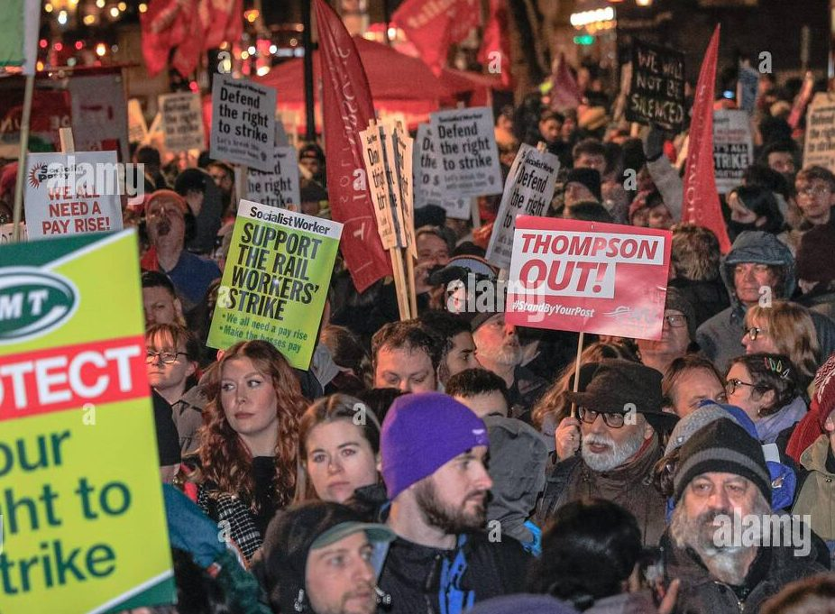教师的罢工次数广泛，因为除了对资产阶级的民用教育之外，另一个目的是，学校是从无产阶级家庭繁殖的日托机构。 如果没有将孩子送到工作时间的地方，人们就必须寻求替代方案来照顾孩子。 据报道，一些家庭成员将休假，该国其他生产领域也证明了这一点。 

 在教师罢工的同时，大学讲师，司机，公共汽车司机和保安人员正在处理更高工资，更好的养老金和工作安全的要求。 

 此外，预计本月晚些时候将有几次大规模罢工，因为全国成千上万的救护车救援人员将于2月10日罢工，这是由于更高工资和更多员工的长期争议。 

 罢工和抗议活动还针对总理瑞希·苏纳克·奥格甘(Rishi Sunak Oghan)政府的新罢工违反法律进行，这应该使得在罢工下不执行“最低服务”的工人，即IE。 并非最不重要的部分作品强调。 里希·奥甘(Rishi Oghan)的政府徒劳地努力跟随马格雷特·撒切尔(Margeret Thatcher)的脚步，就像前锋一样，他们自己承认无产阶级组织带来的问题。 

 英国贸易工会的国家组织TUC指出，英国人与今天甚至十年前的一个月相同。 

 去年年底，超过100,000名英国护士在全国范围内发动了罢工，分为76家公立医院，Sunhedscenters，该医院发起了该国有史以来首次国家护士罢工。 罢工的要求类似于 关于2021年Danmarkkage的护士的要求，以及对其他事项的要求。 更高的薪水。 

 我们看到无产阶级所承担的帝国主义的危机是如何将无产阶级施加在战斗中，反对我们权利的袭击。无产阶级通过帝国主义资产阶级的资产阶级撒谎和恐惧，因为他们试图在帝国主义战争中蔓延，而他们却更深入地散布并以“国防救济欧洲”的名义攻击无产阶级的权利。

News Source: [https://socialistiskrevolution.wordpress.com/2023/02/04/flere-hundredetusinde-offentligt-ansatte-strejker-i-storbrittanien/](https://socialistiskrevolution.wordpress.com/2023/02/04/flere-hundredetusinde-offentligt-ansatte-strejker-i-storbrittanien/)

<!--NEWS-->

# DRG在Dantewada地区被DRG逮捕的CPI（MAOIST）的民兵副指挥官

作者: Alan Warsaw

发布时间: 2023-02-04T05:15:02+00:00

更新时间: 2023-02-04T20:33:43+00:00

图片: ['[arrested_pic_20200130142730-800x445.jpg](https://www.redspark.nu/wp-content/uploads/2020/04/arrested_pic_20200130142730-800x445.jpg)']

标签: ['Chhattisgarh', 'CPI (maoist)', 'CPI(maoist)', 'Daka Muchaki', 'Dantewada', 'Dantewada District', 'District Reserve Guard', 'DRG', 'Gondaras Panchayat of the CPI (Maoist)', 'India', 'Malla', 'Naxal', 'naxalites', 'naxals', 'police', 'Political Prisonner', 'PPW in India']

类别: ['India', "People's War", 'Political Prisoners']

<!--METADATA-->

** Dantewada区，2023年2月4日：** CPI的干部(Maoist)周六在恰蒂斯加尔邦的丹特瓦达地区待了。 

 Dantewada警察局悉达多·蒂瓦里(Siddharth Tiwari)告诉先锋(34)被贡达拉斯和波特利村庄之间的丛林中的丛林逮捕了区。 

 他说，他是毛主义党的贡达拉斯·潘恰亚特(Gondaras Panchayat)的民兵排副指挥官。 

 去年，他参与了几起毛主义事件。 

 >资料来源：https：//www.dailypioneer.com/2023/state-editions/maoist-Arrested-> indantewada.html

News Source: [https://www.redspark.nu/en/peoples-war/militia-deputy-commander-of-cpi-maoist-arrested-by-drg-in-dantewada-district/](https://www.redspark.nu/en/peoples-war/militia-deputy-commander-of-cpi-maoist-arrested-by-drg-in-dantewada-district/)

<!--NEWS-->

# 红色中央董事会成员寻求武器支持

作者: Tjen Folket Media

描述: 辩论在红色党及其周围继续，迄今为止，辩论一直持续到挪威政府对挪威武器。 对于挪威武器的运输，这对整个休息都没有意义……

发布时间: 2023-02-04T07:00:00+00:00

修改时间: 2023-02-03T13:07:06+00:00

图片: ['[raketter-i-ukraina-1160x687.jpg](https://tjen-folket.no/wp-content/uploads/2022/06/raketter-i-ukraina-1160x687.jpg)']

标签: None

类别: 'Innenriks'

<!--METADATA-->

* * * 

 由Eart Folket Media的评论员。 

 * * * 

 **辩论在红色党及其周围继续，到目前为止，诺维格武器对Zelenskiy政府保持了稳定的态度。 对于挪威武器的运输，这并不重要，因为其余的阶级支持政府，但对于Red而言，问题仍然很重要。************** 

 中央董事会SynneHøyforslettBjørbakk来自北区县议会选举的红党候选人和政府国防委员会成员。 克拉斯坎普恩(Klassekampen)报道说，她对乌克兰的挪威武器认为，她不同意党的领导层的大部分领导。 争议问题将在4月下旬在Stavanger举行的红色全国会议上决定。 

 政府刚刚选择像其他几个欧洲国家一样派遣Lephard坦克。 Bjørbakk担心升级可能正在缩减战争，危险情况将更加危险。 她说，北部地区的紧张局势可能会增加，挪威不适合。 

 她对课堂战斗说：“也许乌克兰结束了。 但是，在战争升级以外的意义上，战争也可能非常严重，并且使用了核心武器。 我认为政治辩论，至少在上周，太严重了。 我缺乏关键的官员，质疑其他行动选择是否要发送更多武器。” Bjørbakk也清楚地表明，无论挪威是否发送武器，战争都可以激怒。 

 Bjørbakk指出，乌克兰领导了一场合法的辩护战争，该党支持这一点，但战争也有“地缘政治方面”。 她指的是俄罗斯科学家塞西莉·赫里斯特维特(Cecilie Hellestveit)，她对战争的分析为“海洋战争”，俄罗斯认为对哈维蒂北部和南方的控制至关重要(Svartehavet)抵抗美国和中国的压力，以及美国的利益。 红色中央议会说，乌克兰的战争很特别，因为它有可能升级到乌克兰并成为一场战争。 

 最后，她说她不想要一个新政党，并且不同意Desom说，如果Red对武器说“是”，这是必要的。 她和其他几只野兔标志着这种态度，因此看起来不太可能发生，或者如果发生这种情况，它将是相对较小的果皮。 

 简而言之，媒体人民是：俄罗斯帝国主义har袭击乌克兰，乌克兰国家领导了一场合法的解放斗争，索姆维在没有保留的情况下支持。 Zelelskiy的政权是“橙色革命”和Euromaidan的结果，除其他外，法西斯准军事和洋基帝国主义最终被大量参与其中。 Zelelskiy是主要是美国的骗子，并不代表乌克兰国家的利益。 美国 - 北约对其莱克的支持不符合乌克兰国家的利益。 对于挪威的反帝国主义者来说，主要的事情是打击俄罗斯帝国主义的攻击战争和支持乌克兰人民，而不是成为北约和挪威帝国主义的战争努力。 

 **也阅读：** 

 > [对武器的红色可以分开党](https://tjen-> folket.no/index.php/2023/01/27/rodt-ja-til-vapen-kan-splitte-partiet/)> [在乌克兰的支持下以红色打开滑行](https://tjen-> folket.no/index.php/2023/01/08/apen-splid-i-rodt-om-ukraina-stotte/)> [乌克兰：我们可以从战争中学到什么？(https://tjen-> folket.no/index.php/2022/08/26/ukraina-hva-kan-vi-laere-av-krigen-og-hva-> vil-avgjore-den/)> [关于乌克兰战争的六个重要问题](https://tjen-> folket.no/index.php/2022/05/13/seks-viktige-sporsmal-om-krigen-i-ukraina/)> [反对乌克兰袭击战争的行动周](https://tjen-> folket.no/index.php/2022/06/24/aksjonsuke-mot-angrepskrigen-mot-ukraina/)> [帝国主义与机会主义之间的联系](https://tjen-> folket.no/index.php/2023/01/25/sammenhengen-mellom-imperialismen-og-> opportunismen/)**参考** ** ** [保存战争蔓延 - 武器到乌克兰](https://klassekampen.no/utgave/2023-01-27/redd-krigen-spreier-seg)

News Source: [https://tjen-folket.no/index.php/2023/02/04/rodt-sentralstyremedlem-ut-mot-vapen-stotte/](https://tjen-folket.no/index.php/2023/02/04/rodt-sentralstyremedlem-ut-mot-vapen-stotte/)

<!--NEWS-->

# PC 2月4日 -  Airaudo通过加强班级协作线寻找联盟（FIOM）的新网点

作者: sindacatodiclasse

时间: 2023-02-04T09:18:00+01:00

图片: []

<!--METADATA-->

我们发布了与CGIL PIEDMONT的Airaudo秘书的采访摘录 

 ** Airaudo：“现在我们的斗争也与高级经理合作” ** ** Piedmont CGIL的重新确认秘书：“工会必须是经济议程” ** 

 «我没有邀请米其林和拉瓦扎的高级管理人员，也没有邀请都灵工业家的副总裁参加我们的国会，因为我开始了。 但是，因为我相信联盟不能将自己限制在管理危机上，但必须成为领土外部经济议程的主角”。 **今天的Giorgio Airaudo将重新确认Piedmont的CGIL **。 

 **通过主持Topmanager开设CGIL国会的一个不寻常的选择。**远离它。 首先，我们谈论了与卢西安娜·卡斯特利娜(Luciana Castellina)和拉沃洛康(Laworocon)代表的和平。 最高的经理在我们身边，因为没有更多的luoghidove能够建立一个共同的工作议程»。 ** 

 **从什么意义上讲，缺乏辩论的地方？ **“有一旦有菲亚特(Fiat)进行了监管和管理一切。 然后某些路线到达休息室。 今天，皮埃蒙特(Piedmont)没有更多。 问题是我们必须找到一种面对它们并将它们解决的方法»。 

 **随后，公司专注于灵活性。 **“这已经是紧急多年了。 在意大利，我们有45种进入工作世界的方法，在西班牙，他们减少了Adue，实际上创造了就业机会。 除其他事项外，马德里仅适应了生活成本，提高工资为8％。 我们甚至不设法管理健康危机»。 

 **您需要更多的公共投资吗？**当然。 皮埃蒙特人的健康是严格的。 我们采取了极大的努力来稳定一千名护士，但对于一个老化的地区来说，这太少了。” 

 **实际上，今天CGIL比Mirafiori更谈论健康。 这是Deitempi的标志吗？**«我们还谈到了Mirafiori。 我在Fabbitarinese的回收中心询问了该地区与Stellantis之间的协议。 这是我们一无所知的保留协议。 以及联盟出乎意料地排除的其他»。

News Source: [https://proletaricomunisti.blogspot.com/2023/02/airaudo-cerca-nuovi-sbocchi-per-il.html](https://proletaricomunisti.blogspot.com/2023/02/airaudo-cerca-nuovi-sbocchi-per-il.html)

<!--NEWS-->

# CPP声明谴责Marcos＆＃8217; 拒绝与ICC合作

作者: Alan Warsaw

发布时间: 2023-02-04T10:29:12+00:00

更新时间: 2023-02-04T20:30:00+00:00

图片: ['[ab-dailies-icc-prosecute-duterte-1024x502-1-800x445.png](https://www.redspark.nu/wp-content/uploads/2023/02/ab-dailies-icc-prosecute-duterte-1024x502-1-800x445.png)']

标签: ['AFP', 'communist party of the philippines', 'CPP', 'CPP-NPA-NDF', 'CPP-NPA-NDFP', 'Duterte', 'EDCA', 'Enhanced Defense Cooperation Agreement', 'Ferdinand “Bongbong” Marcos Jr', 'Ferdinand Marcos Jr.', 'ICC', 'International Arbitral Tribunal', 'International Criminal Court', 'Marco L. Valbuena', 'Marcos', 'Marcos II Regime', 'Marcos-Duterte Regime', 'Mutual Defense Treaty', 'National Democratic Front of the Philippines', 'NDFP', "new people's army", 'NPA', 'Philippine Revolution', 'Philippine Revolution Web Central', 'philippines', 'PPW in the Philippines', 'United Nations', 'United States', 'US', 'US-Duterte regime', 'US-Marcos Dictatorship', 'USA', 'West Philippine Sea']

类别: ["People's War", 'Philippines']

<!--METADATA-->

** Marco Valbuena | 首席信息官| 菲律宾共产党** 

 ** 2023年2月4日** 

 正如预期的那样，马科斯政府宣布拒绝与国际刑事法院合作(ICC)在其计划中，对罗德里格杜特(Rodrigoduterte)的犯罪罪名开始，对他在马拉卡南(Malacañang)期间对罗德里格杜特(Rodrigoduterte)的犯罪指控。 

 马科斯(Marcos)和他的奴才是杜特尔特(Duterte)的名副其实的辩护律师。 他们正在利用人民的钱和整个菲律宾政府停止任何人，并为杜特尔特(Duterfort)谋杀了30,000多人杀害他命令并煽动的警察和警惕行动的暴力狂潮。 

 马科斯错误地宣布“对功能齐全的国内司法系统的信心”，这显然未能解决成千上万个家庭正义的愿望，这些家庭清楚地显然是杜特尔特大屠杀的受害者。 

 在杜特尔特(Duterte)的辩护中，马科斯政府虚伪地援引Sovereigntyty，阻止国际刑事法院(ICC)作为国际机构宣誓就职，该机构与联合国和其他公认的多边形合作。 

 马科斯(Marcos)和他的奴才面对不断地断言该国在西菲律宾海洋地区的公务权权利的信誉最低，这是2016年国际仲裁庭决定的认可。 

 捍卫主权的是马科斯在谈论他何时没有举起阿芬格以结束与纽约州的相互辩护条约和不平等的军事条约，实际上，美国计划在增强的国防部队中建造卫生基地和设施的计划。 协议(EDCA)。 

 菲律宾人民必须反对马科斯政府拒绝与国际刑事法院合作，并促使人们对揭露thebogus“毒品战争”的全部真理的需求，并因其所有罪行而受到惩罚。 

 >来源：https：//philippinerevolution.nu/statement/on-marcos-refusal-to-> coperation-with-icc/

News Source: [https://www.redspark.nu/en/peoples-war/cpp-statement-condemning-marcos-refusal-to-cooperate-with-icc/](https://www.redspark.nu/en/peoples-war/cpp-statement-condemning-marcos-refusal-to-cooperate-with-icc/)

<!--NEWS-->

# Press Chiripilko官方媒体的官方博客，智利莫勒地区Curicó省。

作者: Verein der Neuen Demokratie

描述: Press Chiripilko官方媒体的官方博客，智利莫勒地区Curicó省。 2023年2月3日，星期五，毛...

时间: 2023-02-04T13:31:00+01:00

图片: ['[IMG_20230112_120320_466.jpg](https://blogger.googleusercontent.com/img/b/R29vZ2xl/AVvXsEiWNBIjj3whiXHCQCP1mCeXxZLUPPjq_xUp_lUBeA1RlRpnF9t2oI3nnJtj6WI5_lsf6lGWze3cu2kJZlhOxjg0xkra1I8Jher9lrLUHHg1in7t_B_HysWxNiILSnVHP9EHbQT0iR3o0g_TVIWSv-JCWXLboKIkRqzbpXCiAI51d_EMbK0G8aqV4nMx/w400-h400/IMG_20230112_120320_466.jpg)', '[IMG_20230112_120320_470.jpg](https://blogger.googleusercontent.com/img/b/R29vZ2xl/AVvXsEgfQ7bMQof-LcI3UEfxnirTOkOUyR-F5s3a5iTwObIVHwkpNuXUGfhUkyXTb7Zh0SvukWpXfZb_A4RgrLilf05YX37i3JkTRiEDohVPO1clNm5OEVltUAvs8yjw8WEhT-eIQ_Odlp98S8v83qWl_oJAgqAKCoCPkdIZYtcPv55AcGEL5td5ab6IYfkp/w400-h400/IMG_20230112_120320_470.jpg)', '[IMG_20230112_120320_479.jpg](https://blogger.googleusercontent.com/img/b/R29vZ2xl/AVvXsEgqDTuls7X9KYnXlObzhcd59J2A42pGRRjnGquLqgagUf531_MbBx9e3mipmf5vbkOhwQvXHsD033pKVOsO4v3s5T7bsegFhF4m_wTiSIgl1-bdHGufFItlNkgoOjMNTVzw9Sam-wQgbMUxiHHbWF10DLX1e9xxFY09-RuTfEZcTMIF-ogCMoqH2xaH/w400-h400/IMG_20230112_120320_479.jpg)', '[IMG_20221227_180232.jpg](https://blogger.googleusercontent.com/img/b/R29vZ2xl/AVvXsEi8x0ROsxb4MELtukxA52Ti2fmiSDe81IM7P0VZr8Vb9-rtXu6xWpNIfBmAsuBjKgpnB4T2s9V-5GIdMTieiagbQZGY8zRu5pdOqIigyJkcINcg56-mqMxfgMJ8dFUetKVY8kQERVutGbpyeYk6NyQOMc6X5rEauVnUs1pMxtOadV04nG9fJHEYM8oD/w400-h300/IMG_20221227_180232.jpg)', '[IMG_20230129_110341.jpg](https://blogger.googleusercontent.com/img/b/R29vZ2xl/AVvXsEj5nt1xuTRrhwaiTjd-4zu2yzrv1m8XLO2tHqQgGWFVbinZZ0cxcAmJnX7yK-XVOhDIXt27ka0s60o4-aSEQy7tuXUvtKCX67yCeLnTvqzXy3L3AWGSFE6RPMTL4gi9iosoHZ-rfZls16cuA0OM-f6eKkLRxsE8LD70CAE6bz_PQixAyxuCtjKTOO31/w400-h300/IMG_20230129_110341.jpg)', '[IMG_20230129_111033.jpg](https://blogger.googleusercontent.com/img/b/R29vZ2xl/AVvXsEg4eENc4vU6BM1SIjT3Yb-NZsGin1Kzb9UUk02755233KJNsSuXmRwhuRSvYT4bE4zdOmKeh0Ep62dgDXIIzPFNh3swpFLzKYf71HBmbcT6Has0FY_XJnP0L511ztY_l8oBmDnXbtcqJ1AISir3wedjUsRkqiBJn93FoJ3RcD4AaSp8Bi6yfqPyzXHl/w300-h400/IMG_20230129_111033.jpg)', '[IMG_20230129_111039.jpg](https://blogger.googleusercontent.com/img/b/R29vZ2xl/AVvXsEjR0lQVznH9qpHwDYU6AMgsyswmcHlzzKQW9lOvQjkO8DCd29wtUhKPoAeXOTWSXU9APsvrrxN4QfaCpx30SqCKqJLWXwFjWVNzPSxXtl3nPjp5pmd_rWW6iLXDioQSg0ASpng6uqum3gAOfMS1Qu4dMINx-ns0SqMpe7vRRGCbcGYFZW4C_T1hRmXG/w400-h300/IMG_20230129_111039.jpg)', '[IMG_20230129_103412.jpg](https://blogger.googleusercontent.com/img/b/R29vZ2xl/AVvXsEhsY169W8EVXilCufZqlnqlTyH3bdSEszjXLHXHf97_WZzhnp5i-vX-0GsmtBnHbkgQ_W5EwPPNF3UhaLBhIrcLEL7PxwDaqeS1bvSJkds3vYtJQnSRNj_Y1t5LUqt567E_9np9BD1_NW7nVjfCuRpj8p7-tbNe6EWvFunXeJEIdLtDudf2wfDcwoqL/w400-h300/IMG_20230129_103412.jpg)', '[IMG_20230129_114942.jpg](https://blogger.googleusercontent.com/img/b/R29vZ2xl/AVvXsEh5O32xzSisC2EqszMffhDvJnFIP7HaopmYS4JYvfHmW-aDBw-yI0V1atx-iW-L3j1Bn0TYImQ22C-UQ34Bc7knIj8csYLRQoDh4eUGvzhtvSK7GPn81K1uTHEvMcb5siegtrUhxgus2GGgzPNjPJT69t7XY2l6LwVDVtQ3Tq_oUoH76uOQAFBjPLIQ/w400-h300/IMG_20230129_114942.jpg)']

<!--METADATA-->

##按Chiripilko 

 智利Delmaule地区Curicó省独立媒体的官方博客。 

### 2023年2月3日星期五 

#### [Maule，智利：在农村坎皮斯地区的支队行为。](https://prensachiripilko.blogspot.com/2023/02/maule-chile-destacamento-acciona-en.html)各种煽动和宣传行动已经进行了革命者/素食省的不同地区，尤其是在农村角落区。 

 作为季节性收获季节，面对系统的虐待，临时/ASA打架的呼吁一直是一个不变的，即模式和承包商在2022  -  2023年的季节中延续了农业工人，以低薪，艰苦的工作日和拒绝个人保护的权利和基本要素。 精心设计的摄影术在农民和温度质量之间得到了良好的接收，其中有科学数据证明了劳动力的剥削： 

 与这种材料一起，在Maulllamando地区开放了支队来战斗： 

 ---Hualañé别墅的Rayado壁画---利马维达(Limávida)的Rayado壁画，策展人[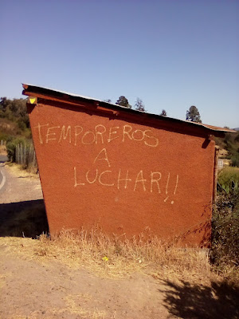](https://blogger.googleusercontent.com/img/b/R29vZ2xl/AVvXsEg4eENc4vU6BM1SIjT3Yb-NZsGin1Kzb9UUk02755233KJNsSuXmRwhuRSvYT4bE4zdOmKeh0Ep62dgDXIIzPFNh3swpFLzKYf71HBmbcT6Has0FY_XJnP0L511ztY_l8oBmDnXbtcqJ1AISir3wedjUsRkqiBJn93FoJ3RcD4AaSp8Bi6yfqPyzXHl/s1600/IMG_20230129_111033.jpg)---constantué的Rayado壁画，策展人 

 此外，面对帝国主义的危机，机会主义政府出售了加布里埃尔·波里奇(Gabriel Boric)的帕特里亚(Frente Amplio)在与Teillier-Vallejos-Carmona的虚假共产党的衰退中勾结，应用了帝国主义计划，尤其是Losyankis的计划，他们通过国际货币基金(FMI)他们在居住在智利的人们的肩膀上，尤其是在贫穷和临时的角落，在-2022年中期的通货膨胀率为14.1％。 

 价格上涨，例如食品，建筑和燃料材料，尽管后者这些几周略低，但并不意味着群众生活的真实和持久的改善。 

 因此，还针对智利旧状态的增加和否定的Alacual政府进行了划痕：
拟议的道路是组织的道路和争取新民主的斗争，在那里人们征服了他们的权利，尤其是将农业革命作为卡米诺(Camino)结束旧半伪造的一部分所规定的土地斗争，半殖民社会，在那里Sedsosenvuelve官僚资本主义； 正是我们必须看到的3座山。 

 --- 

 ------ 

 在[2023年2月3日](https://prensachiripilko.blogspot.com/2023/02/maule-chile-destacamento-acciona-en.html "permanent link")*[2023年2月3日]：2023-02-03T11：50：00-08：00

News Source: [https://vnd-peru.blogspot.com/2023/02/prensa-chiripilko-blog-oficial-del.html](https://vnd-peru.blogspot.com/2023/02/prensa-chiripilko-blog-oficial-del.html)

<!--NEWS-->

# PC 2月4日：2月5日在Via Gleno的监狱驻军之后

作者: sindacatodiclasse

时间: 2023-02-04T13:46:00+01:00

图片: ['[IMG-20230204-WA0001.jpg](https://blogger.googleusercontent.com/img/b/R29vZ2xl/AVvXsEiArfg7SKfp-i3vqXkkL7CPwaS5uHljjMsqnqWui0QF-cMUCPWMEDP5oSsngOyh4eeMOHXaYtZ6KLAkIPmS1dDHdWbbhb3Xjbca_Zw3aTmQRfIo64abY-NSyi3LumFJMwyn4_stWGtplXRLKLMO-4XfRlzolCaDuBQasM8Eo3n5Z0htQgE9wcY7Et7T/w640-h360/IMG-20230204-WA0001.jpg)', '[IMG-20230203-WA0014.jpg](https://blogger.googleusercontent.com/img/b/R29vZ2xl/AVvXsEiJZVdevNQk7_vYO2bJgIsPA19-LRWum68jBDwnspnEPUL6SVhrMor9pxmA1ehe_sTwQizPSOnksf1bC31gNaXX98e74-umOnLCfo-eqXeLfYZid7OA6h45dPLjg-TMALDAUjTnKta3t_71PNaRWlMP8dldi1t59SUgybdlr48VINLqycgWx_LJL-FB/w640-h320/IMG-20230203-WA0014.jpg)', '[IMG-20230202-WA0010.jpg](https://blogger.googleusercontent.com/img/b/R29vZ2xl/AVvXsEiidTytAiUK-nZ70EBT_rrmWWdYcH7x3O7cKsTVOlfAu5wYINQZp2FSTS9uatlIojLaM2KJT729VQBAmliO5CmLAPnl1_FfyBymN7kaO1b6yev1M3Jz5klL1bJ_8i1dIRz35NJaQMqs0Q4OskCFKMnzRUBwZW0epGbhCksaLvurJfYWHUyxtFlujdGD/w279-h400/IMG-20230202-WA0010.jpg)', '[IMG-20230204-WA0002.jpg](https://blogger.googleusercontent.com/img/b/R29vZ2xl/AVvXsEjgHUVKcBlzy1rQ_YDKw-yvVYZCuSqrSsIRB4sF1la-qSGyrGsEtIohoUCONj0VlEzrSscHv_0_49ytbg2O3Be0EJvyBRQDPz4AyalU24zgmdNHJWfH9qCnDhnB0EzvzD9evD1psEJDFpwHbM0EF9NmnA-RuJAunvZmh2k04PyzKLlulAjQV1rVtWlU/w400-h225/IMG-20230204-WA0002.jpg)', '[IMG-20230204-WA0003.jpg](https://blogger.googleusercontent.com/img/b/R29vZ2xl/AVvXsEhpiLCACJUqstwpwJdnm1BtqhkMCgihf-KSOxQr-ARHSSfiD2g4387-jeZEC64oe3g402FSxeqG0VIhRbFY0QfQCXWi__rO8Ea7w70SkPM3EHmxlJC6BryqFYZ4nTvVeT0aFp96-rbWuCjYzcTdMsZbWuQWR4RZzoU9yqmxbR4Hq6njBSaUJU3sSIIA/w400-h225/IMG-20230204-WA0003.jpg)', '[IMG-20230204-WA0004.jpg](https://blogger.googleusercontent.com/img/b/R29vZ2xl/AVvXsEhnsSM858QPiEv3T_pDcZTn34dZaChkCfAhpd0EesZSLfFRcNSSglWPwlb8EHY3tZOxdr_8qeCN64U7crjgtK3Kqt7oP5iXIOQAG9U6ObsSFs5cXtz_w1gbq2E9fapcMHnzTzPryLvkguNHcuyuR_tHjaDOZt_hQ3kewINIruP9f0NhMyGOvvS4CzAT/w400-h225/IMG-20230204-WA0004.jpg)']

<!--METADATA-->

同伴和同伴的大会之后，在伯加莫的Gleno的参与式Alcarce Garrison之后，在15.00处发起了新的围场团结任命，在41 BIS外部为Alfredo FS伯加莫(Bergamo)，在41 BIS外部，反对司法狂暴，违约，折磨于司法狂暴。 反对无期徒刑。 

 [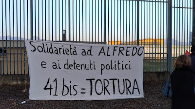](https://blogger.googleusercontent.com/img/b/R29vZ2xl/AVvXsEjgHUVKcBlzy1rQ_YDKw-yvVYZCuSqrSsIRB4sF1la-qSGyrGsEtIohoUCONj0VlEzrSscHv_0_49ytbg2O3Be0EJvyBRQDPz4AyalU24zgmdNHJWfH9qCnDhnB0EzvzD9evD1psEJDFpwHbM0EF9NmnA-RuJAunvZmh2k04PyzKLlulAjQV1rVtWlU/s1600/IMG-20230204-WA0002.jpg)[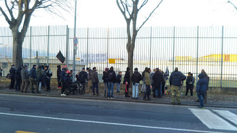](https://blogger.googleusercontent.com/img/b/R29vZ2xl/AVvXsEhpiLCACJUqstwpwJdnm1BtqhkMCgihf-KSOxQr-ARHSSfiD2g4387-jeZEC64oe3g402FSxeqG0VIhRbFY0QfQCXWi__rO8Ea7w70SkPM3EHmxlJC6BryqFYZ4nTvVeT0aFp96-rbWuCjYzcTdMsZbWuQWR4RZzoU9yqmxbR4Hq6njBSaUJU3sSIIA/s1600/IMG-20230204-WA0003.jpg)

News Source: [https://proletaricomunisti.blogspot.com/2023/02/dopo-il-presidio-al-carcere-di-via.html](https://proletaricomunisti.blogspot.com/2023/02/dopo-il-presidio-al-carcere-di-via.html)

<!--NEWS-->

# 汉堡：反对反对巴勒斯坦的侵略的集会

作者: DEM VOLKE DIENEN

时间: 2023-02-04T16:23:06+00:00

图片: ['[HH-Palästina0402-3.JPG](https://www.demvolkedienen.org/images/HH/2023/HH-Palästina0402-3.JPG)', '[HH-Palästina0402-2.JPG](https://www.demvolkedienen.org/images/HH/2023/HH-Palästina0402-2.JPG)', '[HH-Palästina0402-1.JPG](https://www.demvolkedienen.org/images/HH/2023/HH-Palästina0402-1.JPG)']

标签: ['Palästina', 'Freiheit für Palästina', 'freedom for palestine']

类别: None

<!--METADATA-->

在汉堡，星期六，04 \。 2023年2月，来自不同国家的革命者，反帝国主义者和群众表现出反对对以色列轰炸以色列对帕拉斯蒂安主义人民的轰炸。 在讲话中，对加沙地带和德舍宁军事手术的简短袭击受到了严厉谴责。 此外，在过去几天中，不同的监狱中有几个部门，许多囚犯搬迁，阻止了任何探访艺术，并封锁了许多囚犯。 AM31。 2023年1月，监狱行为冲进了al-Damoon监狱和主要的女囚犯。 这一犯罪也被认为是在集会上意识到这一罪行。 此外，在FRG中还讨论了帕拉斯蒂安运动的定罪，因为柏林州政府再次希望禁止安纳克巴的所有会议。 不同的国际主义和反帝国主义组织以及阿拉伯群众表示对帕拉斯蒂尼亚人民无关紧要的阶级仇恨。 

 通过集会的传球者之间存在着联系和团结的气氛。 许多人加入了集会，大喊口号或开始跳舞与演奏的革命音乐。 还从街道的另一侧召唤，例如“自由，自由的帕拉斯汀!”，并用抬高的拳头向集会打招呼。这表明必须在FRG中在这里进行Despalastinensian人民的斗争。显示。 

 

News Source: [https://www.demvolkedienen.org/index.php/de/t-international/7459-hamburg-kundgebung-gegen-die-aggression-gegen-palaestina](https://www.demvolkedienen.org/index.php/de/t-international/7459-hamburg-kundgebung-gegen-die-aggression-gegen-palaestina)

<!--NEWS-->

# 今天和明天在纳德族都灵的国民议会。 我们的干预

作者: fannyhill

描述: 3月8日，我们希望成为一个重要的前卫 -  garde沟，统一，坚强，可见的女性反对大师，

时间: 2023-02-04T16:57:00+01:00

图片: ['[Piattaforma%20donne%208%20marzo%202023_page-0001.jpg](https://blogger.googleusercontent.com/img/b/R29vZ2xl/AVvXsEib6wbAYJhzULp3LVmmKTDQasFN9xf_zB7SPKyf4tz_C9NR9b2rShwwGM6CuF2cgRd5lZCu1JUNC-ThdpV8qYCHhcUcvdksLzb7EXtfA1ArVjMgdBQ_a-ypop35MIwzLXnJHprkfeFnYhq6W74xdMRxRYr21zFzH8zFeqeDPLQdr9vg-_kOn-IKukVg/w492-h640/Piattaforma%20donne%208%20marzo%202023_page-0001.jpg)']

<!--METADATA-->

3月8日，我们希望成为重要的前卫，反对派，强大，可见的，可见的女性反对大师，我们拥有的反动人，文书法西斯主义者，其中的角色宣布为宣布的演员。 我们已经在11月26日这样做了，但是** 3月8日!随着罢工，从工作开始，我们清楚地说，它涉及一场阶级斗争，这种社会追求的野蛮行为与我们一生必须改变的Bi/Dream之间的冲突。谁受到双重剥削，被双重压迫，当我们战斗时，我们会有额外的装备，因为我们不希望对痛苦和越来越不可能的改进，但我们想要革命!

 梅洛尼的政府举起了“上帝，家乡，家庭”和孩子们的黑旗，因为妇女被“称重”，只能根据她们拥有的儿童人数，为伊尔卡皮塔尔(Ilcapitale)和今天的孩子而获得弹性帝国主义战争，并准备进攻堕胎，堕胎总是伴随着双重压迫和中世纪的中世纪。 如今，这个黑旗是施加痛苦，战争，对工作攻击的有用意识形态，而去剥离剂的不可避免的增加。 

 这就是为什么3月8日，在这些妇女罢工中，我们必须说Chiaroper我们的战斗。 我们不希望“对资本主义制度的根本转变”，我们希望它的逆转!不得能够公平，尊重环境和存在的生态过渡，公平分布等。 ETC。 对于每天在Maximon会议上的人来说(come dice Greta)然后从事实中夺走了我们的生命。 

 我们必须带来并为一个平台而战，该平台是由工人，不稳定的工人，失业者，正方形的妇女的挣扎而产生的。 这是我们在这个集会中也提出的平台( _nota_ )今天，工人说，他们不再为工作量，工作中的麻风病和工作中的麻风病。 还有一些雄伟的人在罢工中改变了这一哭声，战斗。 对于其他工人来说，一个重要的例子是**贝雷塔(Beretta)**的工人，通过直接组织他们在10月底直接组织大会，由工人直接管理的集会，启动了Diproagonism的信息，团结不向其他妇女，工人委派。 

 **和2月23日，将有一个新的集会，这次是电子的，以组织3月8日在工作场所进行罢工，我们呼吁在那里。********** 

 MFPR 

 _我们知道，班级联盟的Slai柯巴斯已经独立于8marzo的所有工人开放的妇女罢工。 本通知工会涵盖所有工人，也涵盖其他工会或未注册的工会。 

 

News Source: [https://femminismorivoluzionario.blogspot.com/2023/02/oggi-e-domani-assemblea-nazionale.html](https://femminismorivoluzionario.blogspot.com/2023/02/oggi-e-domani-assemblea-nazionale.html)

<!--NEWS-->

# 翻译：Nova Mutum/RO中的Massaker：新报告谴责官兵警察袭击期间遭受酷刑和违法行为

作者: DEM VOLKE DIENEN

时间: 2023-02-04T20:04:12+00:00

图片: ['[1.jpg](https://www.demvolkedienen.org/images/Brasilien/AND/Übersetzung_Massaker_in_Nova_MutumRO_Neue_Berichte_denunzieren_Folterungen_und_Verletzungen_der_Rechte_während_des_Angriffs_der_Militärpolizei/1.jpg)', '[2.jpg](https://www.demvolkedienen.org/images/Brasilien/AND/Übersetzung_Massaker_in_Nova_MutumRO_Neue_Berichte_denunzieren_Folterungen_und_Verletzungen_der_Rechte_während_des_Angriffs_der_Militärpolizei/2.jpg)', '[3.jpg](https://www.demvolkedienen.org/images/Brasilien/AND/Übersetzung_Massaker_in_Nova_MutumRO_Neue_Berichte_denunzieren_Folterungen_und_Verletzungen_der_Rechte_während_des_Angriffs_der_Militärpolizei/3.jpg)', '[4.jpg](https://www.demvolkedienen.org/images/Brasilien/AND/Übersetzung_Massaker_in_Nova_MutumRO_Neue_Berichte_denunzieren_Folterungen_und_Verletzungen_der_Rechte_während_des_Angriffs_der_Militärpolizei/4.jpg)', '[5.jpg](https://www.demvolkedienen.org/images/Brasilien/AND/Übersetzung_Massaker_in_Nova_MutumRO_Neue_Berichte_denunzieren_Folterungen_und_Verletzungen_der_Rechte_während_des_Angriffs_der_Militärpolizei/5.jpg)', '[6.jpg](https://www.demvolkedienen.org/images/Brasilien/AND/Übersetzung_Massaker_in_Nova_MutumRO_Neue_Berichte_denunzieren_Folterungen_und_Verletzungen_der_Rechte_während_des_Angriffs_der_Militärpolizei/6.jpg)', '[7.jpg](https://www.demvolkedienen.org/images/Brasilien/AND/Übersetzung_Massaker_in_Nova_MutumRO_Neue_Berichte_denunzieren_Folterungen_und_Verletzungen_der_Rechte_während_des_Angriffs_der_Militärpolizei/7.jpg)', '[8.jpg](https://www.demvolkedienen.org/images/Brasilien/AND/Übersetzung_Massaker_in_Nova_MutumRO_Neue_Berichte_denunzieren_Folterungen_und_Verletzungen_der_Rechte_während_des_Angriffs_der_Militärpolizei/8.jpg)', '[9.jpg](https://www.demvolkedienen.org/images/Brasilien/AND/Übersetzung_Massaker_in_Nova_MutumRO_Neue_Berichte_denunzieren_Folterungen_und_Verletzungen_der_Rechte_während_des_Angriffs_der_Militärpolizei/9.jpg)', '[10.jpg](https://www.demvolkedienen.org/images/Brasilien/AND/Übersetzung_Massaker_in_Nova_MutumRO_Neue_Berichte_denunzieren_Folterungen_und_Verletzungen_der_Rechte_während_des_Angriffs_der_Militärpolizei/10.jpg)', '[11.jpg](https://www.demvolkedienen.org/images/Brasilien/AND/Übersetzung_Massaker_in_Nova_MutumRO_Neue_Berichte_denunzieren_Folterungen_und_Verletzungen_der_Rechte_während_des_Angriffs_der_Militärpolizei/11.jpg)']

标签: None

类别: 'Lateinamerika'

<!--METADATA-->

_人的表达无产阶级国际主义，残酷的附录，出于对巴西人民的斗争，尤其是可怜的农民的斗争的团结，他们与大地所有者作斗争，迪拉伯·德尔德·德尔州的谋杀和人民的酷刑，是因为他们的权利为此，它们是其存在形式的基础，是公共财产，直到农民来并获得了他们在其上工作，并以汗水和鲜血为生，从那时起，就不属于任何人犯罪团伙的企图(Pistoleiros)军事警察通过恐怖，谋杀和酷刑将其驱逐到兰德劳伯，大地所有者安东尼奥·马丁斯多斯·桑托斯(Galo Velho - auf deutsch Alter Hahn)为了处理，战斗，我们在第隆尼亚的朗多尼亚打印了协助，在其中我们可以利用Áretiagocampin dos santos的贫穷农民的战斗，在其中我们正在翻译翻译[Pagageanovademocracia上的文章](https://anovademocracia.com.br/noticias/18634-chacina-em-nova-mutum-ro-novas-denuncias-apontam-para-torturas-e-privacao-de-direitos-durante-ataque-da-pm)分享我们被送到了我们。我们谴责低拉尔的屠杀，即巴西对Áreatiago tiago campin dos santos的反应，他们向三名陆军农民开枪，遭受了最残酷的折磨和谋杀他们，她是她的恐怖在那些分裂那里生活的贫穷农民。 巴西国家的这种雄心勃勃，肮脏和残酷的反对罪行使我们充满了最深的阶级仇恨，只能强烈蒸发和破坏我们反对帝国主义和宣布的斗争。 死者不仅在巴西人民的战斗中，而且在国际无产阶级和世界人民的斗争中继续生存。 _ 

 ** Nova Mutum/RO中的Massaker：新报告谴责酷刑和受伤的权利，以纠正军事警察袭击的权利** 

 **** 

 _raniel Barbosa Laurindo(bekannt als "Mandruv a")，24岁和罗德里戈霍沃洛斯(bekannt als "Estado")34岁，在Sieieievon遭到Rondonia军事警察酷刑后被谋杀。 照片：和数据库_ 

 1月28日上午，星期六中旬，特别的努力营被谋杀(BOPE)军事警察(PM)来自朗多尼亚双胞胎农民，恐吓了100多个家庭(300 Bauern)在一场影响Tiago Campin Dos Santos Inrondonia农民的新攻击中。 1月31日。 布拉西斯人协会 - 加布里埃尔·皮门塔(Gabriel Pimenta)(Abrapo)此类农民的报告和联盟(LCP)从西马济亚利亚发出有关大屠杀的信息。 在Beiden文件中，自2020年占领以来，第三次袭击中的无花果和恐怖主义行为已延长。 

 对农民家庭的残酷袭击发生在诺布拉西尔农场地点的一场拟合运动中。 1月28日，三名营领导人倒下。 有数十个车辆和无人机。 士兵对三名农民开枪射击，袭击了数百名农民，并抢走了他们的财产。 两名工人在遭受酷刑后死亡。 国家州长马科斯·罗沙(Marcos Rocha)被LCP谴责，因为他站在兰德鲁贝利亚大型土地所有者的一边。 农民运动还证实，该行动有助于捍卫“加洛韦洛的特权和非法利益”。 

 被警察流离失所的可怕大屠杀，马科斯·罗恰上校的谋杀命令谋杀，属于属于农场Arco-iris和Norbrasil的ÁreaTiago Campindos Santos。 Lautabrapo是这家基本灰泥The Lemeemprendimentos公司的据称所有者，该公司位于土地所有者Antonio Martins。 他在该地区被称为“ Galo Velho”，在“Weißbuchdes Landrubs”中被列为该国的主要大型农场制造商，民事和联邦警察与公开事务有关，因为IT为其提供资金，因为IT为其提供资金。武装在该地区，抢劫和农民流离失所。 

 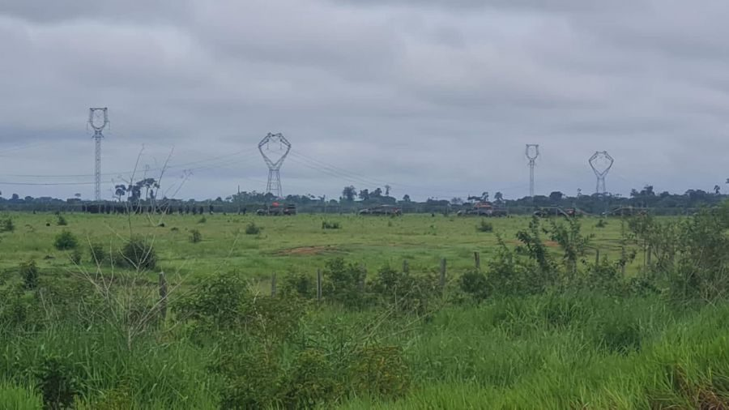_旧农民和法律偶尔谴责对人民的罪行。 照片：乘法_ 

 **诺布拉西尔农场所在地的占领** 

 在同一地方，1月22日发生了袭击。 包括LCP在内，来自Galo Velho的武装民兵以黑色皮卡开车进入该地区，并向没有武装的男子，妇女和儿童开枪。
_rodrigo Hawerroth在工作中工作。 照片：古代警卫 

 **三月游行：大屠杀与非法人** 

 警察越过了BR-364，开枪射击并投掷了顽固的炸弹和射击气体。 据报道，其他一群警察在其他地方望着。据报道，还有“ Pistoleiros”，以及Galo Velho的Abrapo服务。 

 被谋杀的农民罗德里戈·霍沃斯(bekannt als "Esticado")，34，Undraniel Barbosa Laurindo(bekannt als "Mandruva")，24岁，属于从炸弹中看的农民群体。 该小组决定覆盖科蒂亚河，并用船驾驶。 在这一刻，我们从警察那里缓冲。 三名农民被枪杀(nebenRodrigo und Raniel wurde auch Kenedy angeschossen und ins Krankenhaus JoaoPaulo II gebracht)。 

 _孩子被橡胶地板和Tr Anengas击中。 照片：乘法_ 

 _家庭整天都在阳光下没有食物。 照片：乘法_ 

 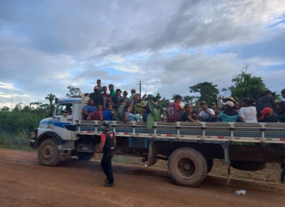_lastwagen，将农民带到Áreatiago Campindos Santos的Vila al Ipio de Freitas。 照片：乘法_ 

 这三个农民被警察活着，但其中两名在严重酷刑后没有进一步的行为处决。 在阿布拉波(Abrapo)的报告中：“投降的农民遭受了折磨，以看到他们的角色痕迹，罗德里戈(Rodrigo)的身体和步枪活塞的脸部露出了瘀伤，嘴里割了，嘴巴，切开的眼睛和切开的舌头”。 Abrapo解释说，此信息在尸体报告中不确定(einDokument, fur das die Abteilung fur offentliche Sicherheit der Landesregierungvon Rondonia zustandig ist)。 

 发生这次袭击后，警察开始了农场地点的家庭围困，在巴劳的马奎纳斯(Maquinas)。 现在的家属试图返回河流，但反动军事阻止了这样做。 农民为自己辩护，并称包括孕妇在内的妇女和该地点的儿童被军事警察忽略了，她们立即开始“射击橡胶子弹并扔火炸弹，孩子们被剥离和短暂的呼吸”，它在报告中说。 

 农民声称，警察的制服都没有身份证，并伴随着农场的“ Pistoleiros”。 部队指挥官(Oberstleutnant Pontes)侮辱了农民，因为罪犯和反动军事解释说，这是关于“所有死亡”的。 这些家庭为自己辩护，试图将他们乘坐公共汽车而不通知他们目标，并再次遭到殴打。(vor dem Bauernhof)。 他们在炎热的阳光下呆在那里，没有水或食物。 由于心脏病发作，一名农民被送往同一家医院。 许多人受伤，由于Tranengas而呼吸急促。 妇女昏倒了，孩子没有食物就舔了舔。 

 _rodrigo hewerroth当集体活动照片：乘法_ 

 _rodrigo hewerroth当集体活动照片：乘法_ 

 只有少数农民能够获得允许的许可，以便从帽子上拿出一个麻袋。 其余的衣物，食物，冰箱配以食物，燃气瓶，手机，床垫，药物和其他个人物品未批准。 农民的所有者仍然留在警察仪式的羊角面包中。 农民向律师抱怨说，他们看到了反动派的武器(Handys und Geld)Stahlen。此外，警察还毒死了狗，并污染了喷泉，并拍摄了现场的农民。
1月29日下午。 根据报告，这些家庭离开了这个地方，去了位于ÁreaTiago Campin Dos Santos的Freitas，农民表明了自己“非常up亵，宪兵保护拉蒂什人的方式”。 

 阅读[Abrapo报告](https://drive.google.com/file/d/1XGrO5QS8FWQilyKSLykrHW2SRLharrNJ/view)和[LCP的评论](https://resistenciacamponesa.com/luta-camponesa/policia-assassina-camponeses-durante-ataque-contra-familias/)。 

 _(Auch mehr Bildmaterial)_ 

 **注意：敏感图片** 

 _ Rodrigo Hawerroth的尸体，带有酷刑痕迹。 照片：古代警卫 

 _ Rodrigo Hawerroth的尸体，带有酷刑痕迹。 照片：古代警卫 

 _罗德里戈(Rodrigo)和兰尼尔(Raniel)的酷刑痕迹。 照片：乘法_

News Source: [https://www.demvolkedienen.org/index.php/de/42-nachrichten/lateinamerika/7461-uebersetzung-massaker-in-nova-mutum-ro-neue-berichte-denunzieren-folterungen-und-verletzungen-der-rechte-waehrend-des-angriffs-der-militaerpolizeials-ausdruck-des-proletarischen-internationalismus-aus-solidaritaet-zu-dem-kampf-des-brasilianischen-volkes-u](https://www.demvolkedienen.org/index.php/de/42-nachrichten/lateinamerika/7461-uebersetzung-massaker-in-nova-mutum-ro-neue-berichte-denunzieren-folterungen-und-verletzungen-der-rechte-waehrend-des-angriffs-der-militaerpolizeials-ausdruck-des-proletarischen-internationalismus-aus-solidaritaet-zu-dem-kampf-des-brasilianischen-volkes-u)

<!--NEWS-->

# Stalingrad Battle胜利80年！

作者: mats

时间: 2023-02-04T99:00:00-04:00

图片: ['[stalingrad1.png](https://punalippu.noblogs.org/files/2023/02/stalingrad1.png)', '[you.png](https://punalippu.noblogs.org/files/2023/02/you.png)', '[stalingrad6.png](https://punalippu.noblogs.org/files/2023/02/stalingrad6.png)', '[stalingrad7.png](https://punalippu.noblogs.org/files/2023/02/stalingrad7.png)', '[stalingrad4.png](https://punalippu.noblogs.org/files/2023/02/stalingrad4.png)', '[stalingrad3.png](https://punalippu.noblogs.org/files/2023/02/stalingrad3.png)', '[stalingrad2.png](https://punalippu.noblogs.org/files/2023/02/stalingrad2.png)', '[you-1.png](https://punalippu.noblogs.org/files/2023/02/you-1.png)', '[jepberlin1.png](https://punalippu.noblogs.org/files/2023/02/jepberlin1.png)']

类别: ['Yleinen']

<!--METADATA-->

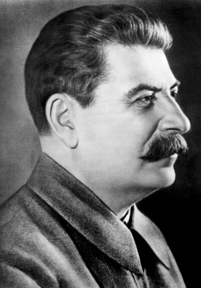共产主义国际([ci-ic.org])(https://ci-ic.org/)(SNTL)1943年，来自纳粹德国及其在斯大林格拉德的盟友的工人和农民的红军于1943年在斯大林格拉德(Stalingrad)。临时世界观过程中的一个主要里程碑。 原始写作可以用英语阅读[在这里](https://ci-ic.org/blog/2023/01/31/on-the-80th-anniversary-of-the-victory-in-the-battle-of-stalingrad/)和西班牙语[在这里](https://ci-ic.org/es/2023/01/31/en-el-80o-aniversario-de-la-victoria-de-stalingrado/)。 

 同志在写作中强调了国际共产主义协会如何(KKL)毛泽东在斯大林同志的角色方面占据了主席的立场。 他是一位伟大的马克思列宁主义者，曾经是系统主义者，并在第二次世界大战中发挥了决定性的作用，以赢得社会主义的胜利。 此外，在斯大林同志方面，他不会忘记他在共产主义国际定居国会的领导，这为在第二次世界大战期间成功发展联合战线的基础奠定了基础。 由于第二次世界大战之后的阵线的工作，无产阶级的统治者在几个欧洲国家获胜，而阿尔巴尼亚，保加利亚，南斯拉夫，德国民主共和国，波兰，罗马尼亚，罗马尼亚，捷克斯洛伐克和匈牙利，后来也在人民总统。 

 文章还指出，毛主席主席是全人类历史上全人类战役的斗争。 据他说，这场战斗不仅应在苏联和纳粹德国之间看到，因为苏联在Toveristalin的伟大领导下赢得了与纳粹德国及其盟友的战争。 第二次世界大战总共支付了2500万苏联公民。 这场伟大的反法西斯战争是第三世界多出国国家的合理自由的非常重要的灵感来源。 

 图片显示了第二次世界大战开始时在苏联分享的海报。 文字：“让我们前进，摧毁德国攻击者并将他们赶出我们的国家!” 

 同志在7月28日出版的关于搬家斯大林诫命的文章中借了“ [不适合步骤 - 步骤](https://marxismileninismi.wordpress.com/2021/01/01/stalin-ei-askeltakaan-taaksepain-1942/)“为了捍卫苏联人民为捍卫社会主义祖国而越来越多的努力。 苏联不是沙漠，而是人 - 工人，农民，知识分子，父亲和母亲，妻子，兄弟和孩子。 一个敌人从家庭联盟中接管的地区，敌人想要劫持的地方是为军队和平民，熨斗和燃料工业，工厂和设备提供武器的果酱面包； 这也意味着铁路。 在乌克兰，白俄罗斯，波罗的海国家，顿涅茨克游泳池和其他大区域迷失后，我们是很多人，面包，金属，工厂和生产设施。我们离开敌人来加强他们，再次削弱我们，削弱我们我们的国防和家园...因此，讨论了一个无休止的戒断，即我们拥有大型国家大而富有的地区，我们有很多人口可以分发。 这些讨论是有害时期，因为它们削弱了我们并加强了敌人。 如果您不退缩，我们将没有面包，燃料，金属，原材料，工厂和铁路……这意味着该停止了。 不再退后一步!这是我们这个种族的口号。 

 

纳粹德国与盟军的军队(Italia, Romania, Unkari sekäukrainalaiset Bandera-rotat ja espanjalaiset francolaiset "vapaaehtoiset")1942年8月23日，袭击了斯大林格勒的城市。在征服城市的情况下，法西斯试图建造一个车站，以攻击外围休闲的油田并削减伏尔加交通路线。 城市征服对法西斯主义者也很重要，因为它由许多苏联军事设备和城市使用的石油中的70％组成。 这座城市以斯大林同志的名字命名的事实也说明了这座城市的矮人。 

 图片显示了1943年的斯大林格拉德战役中红军战斗机。 

 在斯大林格拉德战役开始时，法西斯主义者的第六军队征服了这座城市的大区域，但是斯大林同志和乔治·佐尔基·齐夫·瓦西列夫斯基元帅的行动在苏联部队中重新占领。 天王星行动始于1942年11月19日。 那天，斯大林格拉德北部袭击了红军24。军队和第66军，是将法西斯主义者绑定到他们的位置的任务，以便侄子可以撤退到唐。 在城市的西北，第五军队和罗马尼亚法西斯队的第21军袭击了行动，在行动的傍晚将它们完美地压碎。 也是第二天(20.11)罗马尼亚斯大林阵线南侧的红军溜冰者表演。 由于天王星的成功运作，成千上万的纳粹德国士兵仍留在斯大林格拉德市的座右铭中，几乎是令人讨厌的维护联系。 从现在开始，苏联征服的苏联流浪者小镇从公寓里从公寓里，房子和街街的房子回来，于1943年2月2日解放了城市法西斯主义者。寻求与盟国的谈判联系，以使SNTL安心。 

 1943年2月2日，红旗在斯大林格拉德(Stalingrad)飘动，这是胜利的标志 

 这篇文章还强调，纳粹德国及其参与散落辐射斗争的盟友的袭击是法西斯主义者的巨大动物主义者。 Wehrmacht的75％的航班是数百万士兵参加的，作为Stalingrad跌倒到1942年至1943年的榜样。 尽管如此，红军在斯大林同志的伟大领导下阐明了这场战斗是赢家。 此外，在使用苏联人民和组织党派部队为组织法西斯主义者使用时，该国的策略在苏联人民中燃烧。 当他退缩时，红军烧毁了所有田地并炸毁了工厂和建筑物，因此只有建筑物的废墟和空旷的田地。努力。 同志们在他们的写作网站上还指出，斯大林格勒的战斗是战争中的人们没有决定武器的证据。 

 图片显示了在法西斯主义者中战斗的红军投降。 纳粹德国及其盟友从斯大林格拉德的战斗估计中损失了85万名士兵，受伤或监禁，其中40万德国，20万罗马尼亚人，130,000名意大利人和120,000名。 

 同志们写道，苏联人民意识到独裁统治的无产阶级，革命受到威胁。 这种集体意识确保法西斯主义者的背部用步枪，手榴弹和炸药摧毁敌人，并通过破坏铁路来打扰敌人。 这并不是一个简单的选择，因为游击党人总是在法西斯的指甲中等待死亡。 

 在图片中，在家乡斯大林格勒(Stalingrad)中担任武器和弹药载体的年轻苏联公民。 武器和弹药是法西斯主义者的出现。
在图片中，从纳粹德国斯瓦斯蒂卡门票被扔到列宁陵墓前面的那一刻，这是胜利的标志 

 在写作结束时，同志们借了一个中国共产党(KKP)是的，据估计，伟大的反法西斯战争表明了社会主义制度的观点的活力，帝国主义现在已成为战争，人民和帝国主义的源头，帝国主义不是纸质层次。 写作的同志们决定了这些话：“纳粹德国的辉煌的红军步枪被粉碎了，社会主义无产阶级的独裁统治是在东德建立的。共产党和SNTL的红旗被德国黑暗飘扬的事实Jaraun(Reichstag)在屋顶上，毫无疑问，有一个好时光，暂时中间无产阶级。 那一刻象征着整个令人难忘而光荣的与法西斯主义的斗争，苏联的辩护和无产阶级世界革命的发展。苏联德国的话!” 

 1945年5月，红旗在德国议会飞行。

News Source: [https://punalippu.noblogs.org/post/2023/02/04/3890/](https://punalippu.noblogs.org/post/2023/02/04/3890/)

<!--NEWS-->

# 在萨尔塔（Salta），PCR纪念其55周年

作者: carga

时间: 2023-02-04T99:00:00-04:00

头部描述: 1月28日（星期六）在气态和相关水工业工人（苏蒂亚加）的工人联盟中表现出色，政党，组织，社会运动，领导人和武装分子纪念了萨尔塔革命共产党55年。

描述: Salta PCR纪念其55号周年纪念日。

图片: ['[Salta-acto-por-55-años-PCR.jpg](https://pcr.org.ar/wp-content/uploads/2023/02/Salta-acto-por-55-años-PCR.jpg)', '[Acto-Salta-por-55-PCR-300x170.jpg](http://pcr.org.ar/wp-content/uploads/2023/02/Acto-Salta-por-55-PCR-300x170.jpg)']

类型: article

<!--METADATA-->

PCRSalteño纪念了他的55周年纪念日。在Sergio«Bear»Leavy，Walter Wayar，Diego Arroyo，Fidel Puggioni和社会领袖和社会领导人和激进分子的存在下，演讲者谴责了lacrisis，谴责了lacrisis，谴责了lacrisis lacrisis cross。右派的进步并同意找到一个实现流行领域统一性的广阔战线。 Lamilitancia要求Veronica Caliva州长，并拒绝了“右边的三个前线”：JXC，让我们前进和省级裁决。 

 在几天前去世的**héctor“ Pancho” Quispe **的比赛中，这次会议是染色的。 在致敬中掌握情感掌声的告别带来了其他同志的记忆，例如** OscarMonzón**和** Otto Vargas。** 

 在200多人面前，主桌由PCR政治秘书** AlbertoRexgonzález**领导； **RaúlArce**，圣马丁协调员； **纳尔逊·萨拉萨尔(Nelson Salazar)**，瓦尔·戴尔玛(Valle Dellerma)的协调员，**拉斐尔·鲁伊斯(Rafael Ruiz)**和全民阵线和劳工与人民党主席的国家代理，**verónicaCaliva**。 

 在定义和政治协议的关键日子里，该法案是著名领导人在时空上重合的动机。 其中包括维多利亚州和塞纳塔特政党的总统**塞尔吉奥“熊”莱维； **丹尼尔·埃斯科托恩(DanielEscotorín)，**受欢迎的部门主席，也是选举联盟“萨尔塔(Salta)过得良好”的指称人之一，尽管他没有在场，但他还是有来自其他政党和组织的领导人，但他发送了问候。 演讲并没有逃脱这种选举逻辑，但他们还描绘了对原则情况，权利的进步，民族管理的挑战以及将替代项目引入已经分泌的阵线的巧合。 

 ** __ ** _“我们有巨大的挣扎和挑战，不仅在选举中，而且我们有很多挣扎，”阿尔斯警告说，越野将和好斗的潮流引用。 领导者解释了_“对迫使我们Elfmi的调整” _，因为“ _a由Macrismo签约” _ _ _ _ _，并详细介绍了该省内部的情况，以贫困，水危机和高昂的发票为标志电的 

 _“权利是针对社会组织” _ _萨拉萨尔说，并分析了该计划权力的情况，这是最后一次有并发症。 他强调了政治领导人的存在，并指出_“埃斯特拉达(Estrada)武装了名单以摆脱正确的权利”。 “我们竞选了两个国家代表进入； 它背叛了我们的集会，我们不希望更多。”他说。 

 反过来，妇女论坛总裁艾琳·卡里(Irene Cari)提到了妇女和土著人民的拉米利坦西亚(Lamilitancia)，并保证：_“他们正在杀死我们，现在是时候持有机器并讨论我们国家想要的政策“ _。另一方面，他声称：“反对妇女的天文台的逆行空间不允许我参考Queganó竞赛成为OVM董事会中组织的代表尚未假设。 

 另一方面，沃尔特·韦尔(Walter Wayar)拍打了选举问题，他建立了该部门。 _“受欢迎的领域必须团结一个政治项目，而不是不幸的是，我们可以减少两个或两个，因为这也许可以解决一个家庭的经济问题，而不是该省的问题”。 。 

 科利娜(Kolina)的总统迭戈·阿罗约(Diego Arroyo)警告说，这位政治设计师的许多“低估”。 “ _提议，我们有能力管理，思考我们不能处理事工的人，但是今天它们都是国民政府的银色，预算的80％被排成一排，而这些工程在哪里？”，_声称。 他庆祝霍耶尔(Hoyel)的前沿有国家和省级立法者，并指出_“吓到他了”。
然后，参议员塞尔吉奥·莱维(Sergio Leavy)****对社会组织的贡献进行了重新验证，并利用时间来指代我们晋升的选举阵线，共同促进了变革和法律官员主义，而这三个官员却很遥远。 _ PV总裁说，_“取得领先的唯一途径”。 他强调，他们已经在政府计划中工作，并且批评省级管理。 他谈到PCR和ELPTP时说，在此之前，有可能在选举方面汇聚。 

 随后，政治秘书阿尔贝托·雷克斯·冈萨雷斯(AlbertoRexgonzález)(更名为“教授”)解释了局势被标记的国际和地区场景，并巡回了该国的历史时刻，以了解其现实现实。 _“在这些选举中，我们将在受欢迎的部门尽可能地面对，但我们很清楚Solono可以触及。 我们必须组织，我们必须肯定击败右翼。 我们必须使不可能成为可能的领导者。 但这是一个梦，我们没有强加它，我们只是提出了它。 

 应当指出的是，其他参考人和激进分子也出席了La Merced的议员，** Liliana Vilte **，** lule Lule的Estela Torres ** ** dignity的** Fidel Puggioni ** ** MarcelaGutiérrez** ** *Lamesa的人权和** Petrona Espinoza **，中央圣贝尼托总裁。 

 **** 

 **“我们必须给我们的人民一个主权，受欢迎，女权主义者和革命性选择” ** 

 [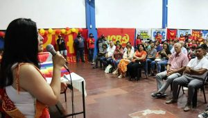](http://pcr.org.ar/nota/en-salta-el-pcr-conmemoro-su-aniversario-55/acto-salta-por-55-pcr/)国家副副手维诺卡·卡利瓦(VerónicaCaliva)是1968年对PCR诞生的反思，当时她将阿根廷共产党分开，反对后者的“改良主义者”目光。 在整个话语中，他提到女权主义，土著运动，工会主义和这些行为者在萨尔塔的发生。 

 _“女权主义有辩论，我们必须讨论一些想法。 没有政治上的照片是，一个女人在野餐或受欢迎的餐厅里吃人，邻居和孩子们。 他们缝制了Yropa背包，因为它还不够。 这些是我们需要的政治绘画，它们为我们感到自豪。” _，领导人强调。 

 他还回忆起工会主义的“统一”时代，当时“ El Negro”Monzón和Buenaventura David领导着巨大的斗争专栏。 他说，他还拥有社会运动的成长和工作，“我们比另一个人更受妥协的社会组织。” 

 _“我们是来自革命左派的许多政党，而曼尼托斯(Mannetos)当前的拉斯·班德拉斯(Las Banderas)是由炸弹铸造的。” 他声称佩隆主义为_“阶级兄弟” _，并带领佩隆和埃维塔(Evita)的拟议变化。 此外，卡利瓦(Caliva)召回了19岁那年，_ _“前往jujuy，前往'santillán'__ _或_“在莫斯科尼(Mosconi)和塔塔加尔(Tartagal大学的激进分子动员了学生前往社区。 

 卡利瓦严重地批评了省级管理，并提到了历史，电和性别暴力，并指出了采矿的错误承诺。 _“有一个精英和少数派，占据了一切，在罗伯洛梅罗政府之后，没有人可以突出公众重叠，” _指出。 

 卡利瓦说，在过去的几年中，每个人的战线都取得了成就。 但是我们确实有他们的感觉，我们想这么说，所以我们有义务奉献。 让我们进步，因为现任政府“ _不会解决萨尔塔的问题”。 

 他还问_“首都的战斗”，“如果我们是多数席位，我们就不能赋予权利。因为灾难或出于我们的错误。”
**通讯员**

News Source: [https://pcr.org.ar/nota/en-salta-el-pcr-conmemoro-su-aniversario-55/](https://pcr.org.ar/nota/en-salta-el-pcr-conmemoro-su-aniversario-55/)

<!--NEWS-->

# 阿尔伯格：反对帝国战争和政府的海报

作者: socialistiskrevolution

发布时间: 2023-02-05T04:00:00+00:00

修改时间: 2023-02-03T15:23:48+00:00

描述: 我们收到了由无产阶级革命者，阿尔堡市中心和无产阶级格陵兰岛的托尔维（Torv）建立的海报的文件。 海报与帝国主义K…一起假释。

图片: ['[10.jpg](https://socialistiskrevolution.files.wordpress.com/2023/02/10.jpg)', '[11.jpg](https://socialistiskrevolution.files.wordpress.com/2023/02/11.jpg)', '[12.jpg](https://socialistiskrevolution.files.wordpress.com/2023/02/12.jpg)', '[13.jpg](https://socialistiskrevolution.files.wordpress.com/2023/02/13.jpg)', '[14.jpg](https://socialistiskrevolution.files.wordpress.com/2023/02/14.jpg)', '[15.jpg](https://socialistiskrevolution.files.wordpress.com/2023/02/15.jpg)', '[16.jpg](https://socialistiskrevolution.files.wordpress.com/2023/02/16.jpg)', '[17.jpg](https://socialistiskrevolution.files.wordpress.com/2023/02/17.jpg)', '[18.jpg](https://socialistiskrevolution.files.wordpress.com/2023/02/18.jpg)']

类型: article

类别: ['Uncategorized']

<!--METADATA-->

我们收到了由无产阶级革命者在奥尔堡·米特比(Aalborg Midtby)和无产阶级格陵兰广场(Greenland Square)建立的海报的文件。 还有保暖者政府!'。 

 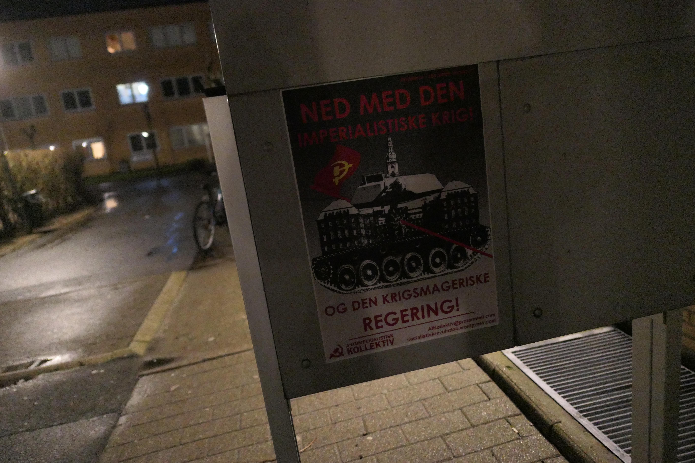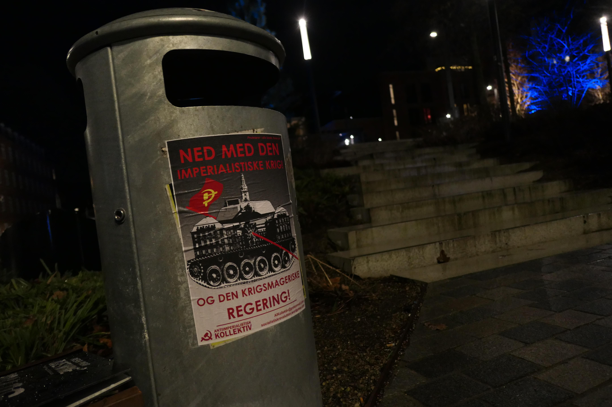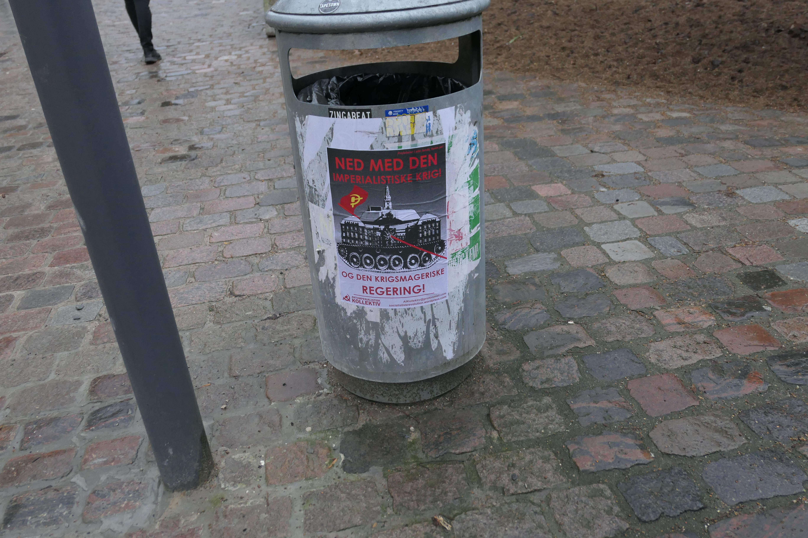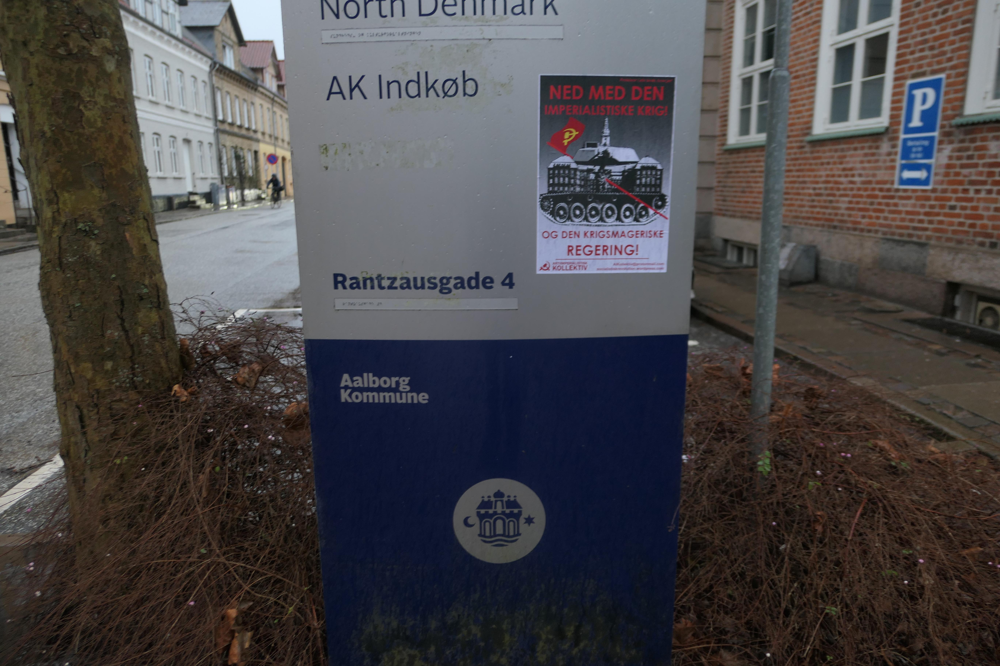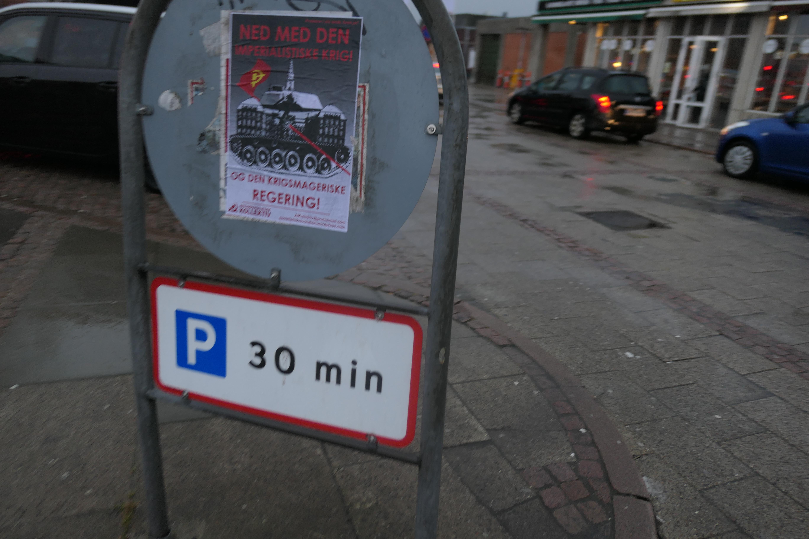

News Source: [https://socialistiskrevolution.wordpress.com/2023/02/05/aalborg-plakater-imod-den-imperialistiske-krig-og-regering/](https://socialistiskrevolution.wordpress.com/2023/02/05/aalborg-plakater-imod-den-imperialistiske-krig-og-regering/)

<!--NEWS-->

# CPP关于美国国防部长奥斯汀最近访问菲律宾的官方声明

作者: Alan Warsaw

发布时间: 2023-02-05T05:03:40+00:00

更新时间: 2023-02-05T22:04:11+00:00

图片: ['[bulatlat-online-photo-junk-edca-february-2-2023-1024x683-1-800x445.jpg](https://www.redspark.nu/wp-content/uploads/2023/02/bulatlat-online-photo-junk-edca-february-2-2023-1024x683-1-800x445.jpg)']

标签: ['AFP', 'Asia', 'China', 'communist party of the philippines', 'CPP', 'CPP-NPA-NDF', 'CPP-NPA-NDFP', 'Dictatorship of Marcos', 'Ferdinand “Bongbong” Marcos Jr', 'Ferdinand Marcos Jr.', 'Luzon', 'Marco L. Valbuena', 'Marcos', 'Marcos II Regime', 'Mindanao', 'National Democratic Front of the Philippines', 'NDFP', "new people's army", 'NPA', 'One China Policy', 'Philippine Revolution', 'Philippine Revolution Web Central', 'philippines', 'PPW in the Philippines', 'South China Sea', 'South Korea', 'Taiwan', 'United States', 'US', 'US-Marcos Dictatorship', 'USA']

类别: ['Imperialist States', "People's War", 'Philippines', 'USA']

<!--METADATA-->

** Marco Valbuena | 首席信息官| 菲律宾共产党** 

 ** 2023年2月5日** 

 美国国防部队最近的访问。 劳埃德·奥斯汀(Lloyd Austin)有助于加强美国政府与亚军政权之间的关系。 为了换取新的军事硬件合同和其他促销，马科斯和他的官员向奥斯汀保证，允许美国在法新社军事营地内提供更多的军事基地和设施，并允许在南中国海的美国军方进行“联合海上巡逻”。 

 这样一来，马科斯越来越允许美国将菲律宾用作挑衅中国的启动垫。 他从事允许帝国主义者将菲律宾拖入其自身的兴趣。 

 通过允许美国利用该国作为其行动的基础，马科斯将菲律宾变成了中国武器的目标，无论是侵略还是反攻击。 

 奥斯汀错误地保证，法新社军事营地内美国建立的军事基地和设施是“诺森特人”。 美国及其木偶一直在使用“旋转冠军”一词来规避1987年宪法对外国军事基地的禁令。 

 但是，这一事实不能否认，美国军事力量已经在该国维持了二十多年，从吕宋岛到棉兰老岛。 美国在各种军事基地中保存了武器和军事设备。 在菲律宾政府的允许下，任何时候，美国的海军军舰定期停靠了任何菲律宾港口和该国水域的其他地区。 

 奥斯汀对韩国和菲律宾的访问构成了USGROVERMENT的持续准备与中国战争剧院的持续战略的一部分。美国的地缘政治战略是通过破坏一项中国政策，煽动台湾的颠覆性，使中国的境界从各方包围，并挑衅。 穿过台湾海峡，并在南中国海巡逻。 

 菲律宾人民与亚洲和世界人民一起必须努力，要求停止帝国主义战争，并结束扭曲的战争，尤其是美国。 他们必须要求拆除所有军事基地，并呼吁撤离该国的我们和其他外国军事行动，以及在其海上领土内拆除中国军事力量。 

 >来源：https：//philippinerevolution.nu/statement/on-the-recent-visit-of-> us-defense-secretary-austin/

News Source: [https://www.redspark.nu/en/imperialist-states/official-statement-of-cpp-on-the-recent-visit-of-us-defense-secretary-austin-to-the-philippines/](https://www.redspark.nu/en/imperialist-states/official-statement-of-cpp-on-the-recent-visit-of-us-defense-secretary-austin-to-the-philippines/)

<!--NEWS-->

# PC 2月5日 - 我们不明白

作者: maoist

时间: 2023-02-05T10:00:00+01:00

图片: []

<!--METADATA-->

** 5个标准女士Appendino可以在“无政府主义者和黑手党之间的接触”传播中说有罪不罚，并参加了Meloni及其机构的小组的这款腹膜，并具有明显的反应，这种反应是在网络上使用Dialcuni Photos在网络上发生的。几年...无政府主义者和对手银河应该做什么？** 

 都灵今天** Cosenza案，在网上威胁到都灵前市长Chiara Appendino ** 

 “ Appendi Appendino”，“护送不足以适合您”。 前市长Ditorino，现在是5星级运动的议会的Chiara Appendino返回到现任无政府主义者和对手：在聊天和区域中，照片已经散发 - 可追溯到几年前 - 与几年前的事件 - 著作追溯到角叶果皮巨人的纪念性公墓的墙壁上。 

 原因是您在电视上解散“无政府主义者与黑手党之间的联系”中归因于您的声明。 Appendino已经已经威胁到他担任市长的时期，因此他一直是护送。 

 “我们对Chiara Appendino及其家人表示完全团结，这些小时内的无弗拉姆和可耻的领导家庭从主题中获得了无政府主义者和反对者的银河系 - 斯克里沃诺萨拉(Scrivonosarah)dissected dissional obs of scrivonosarah dissional group group group M5S Piedmont，Ivano Martinetti，地区议员M5S Piedmont和Sean Sacco。 ，议员区域M5Spiemonte-在他担任都灵市长的经验中，今天，Chiara Appendino从来没有弯腰面对八十岁和威胁。这次这次也不会发生。

News Source: [https://proletaricomunisti.blogspot.com/2023/02/pc-5-febbraio-non-abbiamo-capito.html](https://proletaricomunisti.blogspot.com/2023/02/pc-5-febbraio-non-abbiamo-capito.html)

<!--NEWS-->

# BadenWürttemberg：CDU要求救援人员的车身车

作者: DEM VOLKE DIENEN

时间: 2023-02-05T10:16:54+00:00

图片: []

标签: None

类别: None

<!--METADATA-->

内政部长Baden Wurttemberg之后，托马斯·斯特罗布(Thomas Strobl)(CDU)在今年的最后一回合中，他是“普通新年前夕”，他完全改变了自己的地位，并呼吁对人民进行强烈压迫和监视。 

 这项进步和对我们权利的攻击的分组非常脆弱。 作为官方的理由，他们采取了除夕，这两者都没有发生，斯特罗布说自己。 SPD被指控Strobl的Saschabinder：“对我们来说，没有一个案件可能是正常的。” FDP MP Julia Goll犯了19例伤害。 

 在海德堡(Heidelberg)醉酒的人，火箭弹在未来的枪击中被火箭炸毁，而迅速的程序被判处9个月的监禁，这是Jetztal的主要例子，说明了将来如何与人打交道，并自然而然地支付了所有叛逆的群众和革命者这与Denbulls发生冲突。 应该有正式的兴趣，并维持该州对暴力行为的垄断。 这是真正的原因：害怕失去控制权，食用资金以有效地镇压非特异性。 

 生长首先拒绝身体凸轮，因为它是在创新情况和私人房间中拍摄的。 FDP和SPD认为救援能力不想要相机。 合理!由于可用于执法并因此渗透私人居住空间的摄像机的mandiese creap，因此成为受益人。 尚未投票，但是随着这一戏剧化，讨论继续进行更多的压制，并准备了对我们权利的另一次攻击的土壤。

News Source: [https://www.demvolkedienen.org/index.php/de/t-brd/7462-baden-wuerttemberg-cdu-fordert-bodycams-fuer-rettungskraefte](https://www.demvolkedienen.org/index.php/de/t-brd/7462-baden-wuerttemberg-cdu-fordert-bodycams-fuer-rettungskraefte)

<!--NEWS-->

# PC 2月5日：每个城市的动员Alfredo Cosato：L'Aquila

作者: fannyhill

时间: 2023-02-05T11:15:00+01:00

图片: ['[IMG_20230204_192830434.jpg](https://blogger.googleusercontent.com/img/b/R29vZ2xl/AVvXsEju4TWxGiuawpNF7UxPbYMuYrCdbJKIn44bsKYopzoqojE-qD6r6ILoBHcJ-9dE9e9f1GaZcZ0BiU7_9DrLhy6t4NqQMY6eoXr3BgAKDGinMMvFsPItDS6mafH9nH-jV6hu6e5pX79Fn63DXjFtrKperqODDQCopaaJ6YmwNoQ_Kh1ija9vdDApUc8uBA/w400-h226/IMG_20230204_192830434.jpg)', '[IMG_20230204_192849946.jpg](https://blogger.googleusercontent.com/img/b/R29vZ2xl/AVvXsEiURRptO9XdLbyNhMtMM0MbsydBXXDGWIH9BdjqmPmImDon4s7xRXuGPn1r0LGBh9dhtnZDGMH4beU9XSo7r3kCP-FSBTACXRdDNnPmJMwnzWX5Hx93GdgzaPRaMRACqsVeyp7wq9gqQpg7SRkhKSCBE-28PFSQ1y7C_RDoo9SFPbOnz-RMXNi47VXgWQ/w400-h330/IMG_20230204_192849946.jpg)']

<!--METADATA-->

** 

 在L'Aquila的驻军中，他们参与其中的最中心广场之一和数十个同伴。 有一个很好的媒体共鸣(nehanno parlato al tg regionale sia la sera prima che il giorno stesso)。 

 不幸的是，时间，他拉一风，没有帮助我们(abbiamo messo 20minuti solo per attaccare lo striscione e una mezz'ora prima della fine ilvento lo ha strappato)。 随后对目前的那些干预措施，无产阶级红色探险者(vedi il volantino sotto)，然后是由So称为So -so称呼的绝食罢工的读物，并为他读了一首诗。 

 [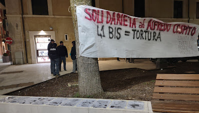](https://blogger.googleusercontent.com/img/b/R29vZ2xl/AVvXsEju4TWxGiuawpNF7UxPbYMuYrCdbJKIn44bsKYopzoqojE-qD6r6ILoBHcJ-9dE9e9f1GaZcZ0BiU7_9DrLhy6t4NqQMY6eoXr3BgAKDGinMMvFsPItDS6mafH9nH-jV6hu6e5pX79Fn63DXjFtrKperqODDQCopaaJ6YmwNoQ_Kh1ija9vdDApUc8uBA/s3781/IMG_20230204_192830434.jpg)无产阶级红救援传单** 

 ** ** 

 **在阿尔弗雷多(Alfredo)以外的41 bis之外，没有障碍生命监禁** **挽救了阿尔弗雷多(Alfredo)及其政治身份的生命** ** 

 无政府主义者的囚犯阿尔弗雷多·科西塔托(Alfredo Cossitato)今天在第108天对41 BIS政权和无期徒刑。 

 对于革命性的政治犯而言，41BI具有双重职能，对那些不后悔和声称革命规定的人的报仇以及对外部的斗争进行清洁。 

 梅洛尼(Meloni)坦率地承认：“因此，在拘留期间被拘留率为41岁，他向无政府主义者发送了消息，这些无政府主义者误导了“继续战斗，组织自己”。 

 在L'Aquila监狱中，有41个BI的囚犯人数最多，并且是意大利唯一拥有女性部门的囚犯，革命性的共产主义囚犯Nadia Lioce也被拘留在雷吉米尼·哈德监狱中。每2年发出每2年的措施，以使他们牢固41个bis：“必须以最大的谨慎态度评估Brigatist现象的临时临时临时，这建议不要排除在中/长期恢复中的武装斗争的束缚，考虑到社会冲突的整体全景，越来越多的生活条件差距和工作机会很少”。 

 资产阶级国家，政府希望在内外强加他们的“祈祷”。 今天，这在危机阶段和帝国间战争中更加明显，与现代的梅洛尼政府一起，旨在改变宪法权利，这使史坦尔成为适当法西斯的人物，与他自己的法律形成鲜明的对比，并与他自己的法律形成鲜明的对比，并且现在，有了下一个司法的规则(inserite nel decreto anti rave)他想继续涵盖法西斯主义者政治上的“法律”犯罪。 

 同样对墨西拿(Messina Denaro)的捕获也被用来加强并再次赋予41BI和障碍生命监禁，始终将同样的黑手党和恐怖主义计划提出，从而“恐怖主义”的组织，革命者的斗争，以推翻革命者的斗争，从而推翻。在所有学习资本主义制度，其国家，其国家都必须有必要。 

 这个国家正在进行的镇压和越来越多地袭击社会和政治斗争，发现了对政治犯的冰山一角。 朝着那些以各种方式置于真理的方式上，需要革命性的斗争与攻击无产阶级直奔群众的国家的斗争。 从最基本和每日的人，法律，工作，薪水，健康，学校，再到更一般的人。 今天将我们拖入战争的aostatato。 

 但是，一方面，由于这个原因，这种状态遭到镇压是强大的，它表明，它害怕仅暗示了这个社会的根本变化。 

 在这种情况下，必须看到针对阿尔弗雷多·科森扎(Alfredo Cosenza)的国家的规定，他已经因核事业经理受伤而被判处该判决福萨诺(Fossano)的卡拉比尼尔(Carabinieri)既不死亡也没有受伤。 但这被认为是国家的政治大屠杀，因此，您想将其逐一隔离。 他的内gui是从他继续与绝食罢工作斗争的事实中，从这个意义上说，这是一个活生生的迹象。
这是杀死一个人。 正确地说，在他的绝食言论中，他说：“生活在这个普遍的坟墓中没有意义”。 

 但是，这种资产阶级国家的残酷性与它的愚蠢息息相关：使无政府主义者保持沉默，这是一块落在他身上的石头。 阿尔弗雷多(Alfredo)的恋情与他的顽强的绝食罢工在公共领域，并引起了广泛的团结，重新开放了关于酷刑/凶手监狱的广泛辩论，该州在一个为其大屠杀而实现的资产阶级州(da quelle nelle piazze a quelle sullavoro/alternanza scuola-lavoro, da quelle in mare degli immigrati, a quellenelle carceri dei detenuti)并指责一名无政府主义者没有被杀。 

 如今，必须继续进行动员，以更多的方式和形状进行更多的发展，更扩展并扩展，投资于已经真诚的民主战斗的人，并将其越来越多地将其带入流行的群众Ilavoratori中。 因为这种镇压涉及所有反叛者，与现有国家作斗争的人。 因为镇压国家对革命者的镇压是阶级战争旅行，大众和大师的中心部分，国家，政府，政府为这种剥削服务，缺乏工作，战争，痛苦，对公民权利和民主本身的影响。 

 所有的团结都很重要，但是我们在这场战斗中希望团结与SO相同的事实：“直到对41Bis和无期徒刑的结束，”：“ Miopterrrre将与所有部队一起强迫营养。他们将被迫被迫。徘徊在床上...他们的残酷和愤怒反对我的脑，坚韧和意识无政府主义者和革命者的意志……”。 

 因此，我们的密码是“在Alfredo以外的41个BI，Noall'orgastolo障碍；挽救生命和他的政治身份”。 

 今天，这就是必须以各种可能的方式实现的目标。 如果我们获胜，我们将迈出与这位凶手Stateborghese战斗的一步。 

 **无产阶级红救援** 

 l'aquila，04/02/23

News Source: [https://proletaricomunisti.blogspot.com/2023/02/pc-5-febbraio-mobilitazioni-in-ogni.html](https://proletaricomunisti.blogspot.com/2023/02/pc-5-febbraio-mobilitazioni-in-ogni.html)

<!--NEWS-->

# PC 2月5日：Alfredo Cossed的每个城市动员：Taranto

作者: fannyhill

时间: 2023-02-05T11:29:00+01:00

图片: ['[IMG_20230203_093741.jpg](https://blogger.googleusercontent.com/img/b/R29vZ2xl/AVvXsEiZLdYvKARTKJIQIKPn_JKUcb9PoW6SlPVoe3c8Yey2qCXlteMC_nRIK01y5NROQCJk0rZSPKgzIptt7A8GOyXkr-qdczM27-m2pURhLXDw7Aq7gInFbKYUMfDsmweqtgHn9BCZtyGo4YqIeE06-rJJuhtivB0GxzABwbsIq4aQ9KBeAMbyTp2wmtGV/w640-h288/IMG_20230203_093741.jpg)', '[IMG_20230203_093757.jpg](https://blogger.googleusercontent.com/img/b/R29vZ2xl/AVvXsEibddU1xcu333V0ISMeAjUrd9BzyuReQ6znAIGsoiczYVfAJWJIGh7SxQSK7hMRyi8rHVp0aFpuEda89DQep7IdG7JYpx_TkQawwq-eZbMCY5EHz9-UgN7DXFu0NIDFhsblKxMyZcp3sq5c-7fA02SuXmhAro0fkKu38UEXp-433Y9ZGYO6-m3kQkyl/w640-h288/IMG_20230203_093757.jpg)', '[IMG_20230203_102830.jpg](https://blogger.googleusercontent.com/img/b/R29vZ2xl/AVvXsEhGlkOsyOwLDaBqIT81bE9oxd3lHgDr0RJP82Zby5Gk67YKkW8iKDuthRgwNbIxF9vlUYEak4IgUkPah5WlJpbD5BCTtWOFEZUjn2J32m1T_coup5Hm3HAClGaAd3WVdS_txWV085pnDAqGjK1I8rYCooSZ7ugb9OGBvXlbgSTCj0Bl36Yb6VP4f7c5/w400-h346/IMG_20230203_102830.jpg)', '[PHOTO-2023-02-03-12-02-21.jpg](https://blogger.googleusercontent.com/img/b/R29vZ2xl/AVvXsEiBYuutZrT4nH5aK7PZUYjVsG0jDCZm3ipwbBhkNpX1uQTKabkuINgeYQ8zr2Vqwbgs9wkToMTXbrutnwj7CxNhijZMwTxCiiOxEXiV1xc7CMmsQwiVTm5A-pobxRY66ql6aNIXKHeWKXAQN5tZrygdkXqYOJc2O7qbNL8LYbeKTOIi05lrmtbzeWiA/w300-h400/PHOTO-2023-02-03-12-02-21.jpg)']

<!--METADATA-->

自我授权驻军塔兰托法院为阿尔弗雷多·科塞多(Alfredo Cossedo) - 现任联盟，政治力量，委员会和塞塔维奇亚协会，个人工人，妇女。 

 在驻军期间，当然是Digos，警察，Carabinieri，对扩音器的各种干预措施，使得有可能解释所谓的问题，他的战斗，Solidarieta'azionale的运动，原因是正确和正确的原因为他删除ApplicationDel 41BI所必需的，并将本文质疑为一种机构和一种酷刑形式； 而且还要向政府，部长，国家提高政治枪击。 这件事是如此的奇拉拉(Chiara)引起了一些律师梅洛尼亚地区和臭名昭著的反动角色的愤怒和愤怒的反应。 

 一般与律师的良好讲话是，数十名阿尔巴切托(Albanchetto)签署了上诉：“在阿尔弗雷多(Alfredo)之外，如41bis”； 并免费提供用于法律辩护的稀释器。 

 甚至许多人，女人，男人都签署了签署，表达了团结和主动权的正确性。 

 在驻军结束时，两项**新举措决定：周二7月17日在Ditaranto监狱的总统 - 主席团在周五上午10点上午11点为县举行。** ** 

 [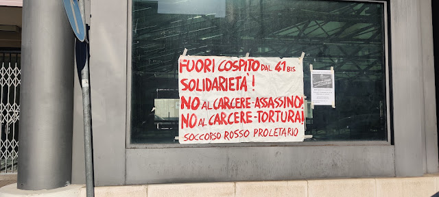](https://blogger.googleusercontent.com/img/b/R29vZ2xl/AVvXsEiZLdYvKARTKJIQIKPn_JKUcb9PoW6SlPVoe3c8Yey2qCXlteMC_nRIK01y5NROQCJk0rZSPKgzIptt7A8GOyXkr-qdczM27-m2pURhLXDw7Aq7gInFbKYUMfDsmweqtgHn9BCZtyGo4YqIeE06-rJJuhtivB0GxzABwbsIq4aQ9KBeAMbyTp2wmtGV/s4000/IMG_20230203_093741.jpg)[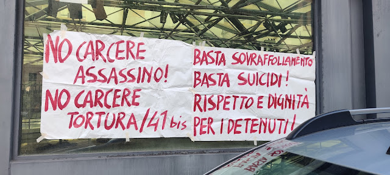](https://blogger.googleusercontent.com/img/b/R29vZ2xl/AVvXsEibddU1xcu333V0ISMeAjUrd9BzyuReQ6znAIGsoiczYVfAJWJIGh7SxQSK7hMRyi8rHVp0aFpuEda89DQep7IdG7JYpx_TkQawwq-eZbMCY5EHz9-UgN7DXFu0NIDFhsblKxMyZcp3sq5c-7fA02SuXmhAro0fkKu38UEXp-433Y9ZGYO6-m3kQkyl/s4000/IMG_20230203_093757.jpg)用于自发组装 -  Slai Cabs TA WA 3519575628

News Source: [https://proletaricomunisti.blogspot.com/2023/02/pc-5-febbraio-mobilitazioni-in-ogni_5.html](https://proletaricomunisti.blogspot.com/2023/02/pc-5-febbraio-mobilitazioni-in-ogni_5.html)

<!--NEWS-->

# PC 2月5日 - 在拉斯佩齐亚，国家的所有者和被剥夺的武器和战争都被指挥。甚至在法庭上！

作者: maoist

时间: 2023-02-05T11:51:00+01:00

图片: []

<!--METADATA-->

**一个三个月的句子被判处3,300欧元的3,300欧元命中，艺术家，有罪，去年6月，他在坎克(Camec)的墙壁上写了“非军事化的拉斯佩兹亚(La Spezia)”，但是在授权的表演框架内。 。** 

 **我们与亚历山德罗和集体达达繁荣相称**

News Source: [https://proletaricomunisti.blogspot.com/2023/02/pc-5-febbraio-la-spezia-comandono-i.html](https://proletaricomunisti.blogspot.com/2023/02/pc-5-febbraio-la-spezia-comandono-i.html)

<!--NEWS-->

# PC 2月5日 - 都灵 - 游行队伍的爱因斯坦学生：＆＃8220;这个系统吸引了我们＆＃8221; ...他们是对的！

作者: maoist

时间: 2023-02-05T11:52:00+01:00

图片: []

<!--METADATA-->

##学生在五天后融化。 通过游行队伍的男孩化的bolognaparalalalation 

 **占领Liceoerstein **的职业被溶解在游行队伍中**。 学生**生了一个**的事件，该事件是从学校里** **在Via Pacini **的Aliceo **中阐明的** **是一个**五十。 ** ** 

 **通过博洛尼亚瘫痪的交通** 

 交通瘫痪在Via Bologna，在列车和转移教练的情况下都不受私人车辆的关闭。 “ _l'我们的学校工作替代爆发。过去几个月的死亡证明：这个系统不起作用，糟透了我们。”男孩们对扩音器大喊。 

 学生已经有五天的学生** [为研究所内部的和内在的讲习班献出生命](https://www.torinoggi.it/2023/02/02/leggi-notizia/argomenti/cronaca-11/articolo/il-liceo-einstein-denuncia-gli-occupanti-gruppo-minoritario-e-violento.html)**，他们徒步旅行直到另一所学校(non occupata)综合研究所。 

 **与萨拉加特花园的一个集会结束** 

 今天结束的抗议只是“ _anpercorso of斗争”的最后一项，当时有10,000名男孩摔倒了，其中一部分袭击了Confindustria的都灵总部。 

 游行队伍以萨拉加特(Saragat)**的萨拉加特(Saragat)花园的公共集会结束，在Via Pacini的建筑物后面。

News Source: [https://proletaricomunisti.blogspot.com/2023/02/pc-5-febbraio-torino-gli-studenti.html](https://proletaricomunisti.blogspot.com/2023/02/pc-5-febbraio-torino-gli-studenti.html)

<!--NEWS-->

# PC 2月5日 - 跨层次主义战争竞赛中的跨国田纳西州方面。 我们的工作是动员工人反对

作者: LuigiLerisVIVE

时间: 2023-02-05T11:53:00+01:00

图片: ['[fullsizeoutput_303.jpeg](https://blogger.googleusercontent.com/img/b/R29vZ2xl/AVvXsEj9NWenbwtUDtTwUNtcSec1T3XrlzMeNv4GgMEbVi0A1D9fDCBJjKYLfSHrRDcV4CGUaGpBuL0Qpbn3Ip2PUuPx16JDh7c0g2f2_ASHVxFgi620W9we3gUDKlcyHsD1pKCmxHys34lFIJ6j-o3oi6DTiFq-3qZmg3k78b35kMU-PIm-25Pyp3N_Im4rJQ/s320/fullsizeoutput_303.jpeg)', '[IMG-20230203-WA0011.jpg](https://blogger.googleusercontent.com/img/b/R29vZ2xl/AVvXsEg4V2uJKG0FmB2g_RvIGhAoBtUtvZSqHhyuCAE8A0EJb47ZWJKK-RfceP7PzPSKmr4CSayTuW5M81nOVwaiSET9YfSQ9anXpAu5TD3rVaVuU5y4k0v-hStLvv_NwBeVyzUAapl3W7ZwHQKXI_eX9n8_nbF1dIJYoewOYrIrxc1Eoo6NjC0sSu_KJTY27w/w400-h225/IMG-20230203-WA0011.jpg)', '[Documento%20(1).jpg](https://blogger.googleusercontent.com/img/b/R29vZ2xl/AVvXsEhZ21ik1FWb5SZmjXCflUOVmOvxnqEz2inucWvBZRk-XXgNDZmwvC7johc9Y_Z9o-MOKk3idRUxmQL2UKzwFS383FzIPwyOfmfYMmoXS3R6jknlhBsmty-HKN0Wk_O-Vey8z1_2hqiD3s3jVoBAkrRinKhHU7lw486CrGB7iH5B9frMj_jVQdJs1zpbNg/w452-h640/Documento%20(1).jpg)']

<!--METADATA-->

**** 

 **可以从奈杰尔·维诺普(Nigel Worsnop)副营销总裁，供求专家以及与客户关系的专家中看出：** 

 __ 

 _ _ 

 _”民主。这，从某种意义上说，这是伊尔蒙多在欧洲和美国的西方民主国家一方面划分的伊利斯和中国。 

 _“这场战争不仅是三场俄罗斯和乌克兰战争。它的发展非常大，因此，奇迹般地，乌克兰人不会被俄罗斯熊的袭击所阻止，而且他们将无法在没有的系统的情况下做到这一点西方人的军事设备和供应是达吉斯蒂联合(Daggistati United)，以及欧洲和英国……如果这种支持将以同样的方式继续下去，我们必须在美国的维奇米斯人中看到通货膨胀和经济的增加，而经济衰退的经济越来越高，但很可能会做出。” 2022年9月 

 ####有意识的工人不是大师掌握的士兵，而是国际不属于的工人，如果不是工作的链条，也没有损失的士兵，也是在歌剧手中建立新力量的历史任务。 就这个观点而言，我们必须返回与政府和卡罗维塔(Carovita)作斗争，以应对Degabbrica工作条件的恶化(salario, sicurezza, precarietà)，建立工人组织，抗拒阶级的联盟以及革命的党派进行袭击。 

 在2月18日的罗马无产阶级资本主义大会上准备工厂的干预，并从博客中从2月23日至25日在23-24-25时动员了整合性的人：<http://cobasperilsindatotodiclasse.blogsse.blogsse.blogspot.com/2023/ 02/3- 2月-Dalmine-guerra-e.html> 

 Tenaris在第三季度以6.08亿美元的收入收入，收入增长了6％，达到近30亿美元(2,97 miliardi didollari)。 

 在第四季度，该集团提供了进一步的销售增长，这是由于已经在正在进行的项目和新价格上涨的项目增长所青睐，并进一步恢复了自由现金流。 

 **“能源部门的条件表明，可以通过投资水平来证实它，技能和股票水平较低，对进一步处罚对俄罗斯出口的影响的不确定性以及对世界能源安全的重新关注” - 解释说明 - 据此，“全球用品受到限制，所有尿布和签名来源都需要满足日益增长的问题”。 ** _fonte Press14-11-2022_ 

 **来自列宁社会主义与战争 -  ** ** _当前的战争是一场温暖的战争_ ** 

 _资本主义已经发展到了一定程度的集中度，整个Ramidell的行业都掌握在工会，信托，亿万富翁DiCapitalist协会的手中，_ _ _ _ _ _ _ _ 

 _globo在这些“资本的绅士”或以遗漏的殖民地形式分开，财务开发网络与一千个外国ipaese线程约束。 自由贸易和竞争已被垄断的趋势所取代，从篡夺土地到使用Deicalitical，到出口原材料等。 作为国家的解放者，就像在反对封建制度的斗争中，在阶段，资本主义已成为国家最大的压迫者。 资本主义从进步中变成反动。 他已经发展了一定程度的力量，即人类必须或经历社会主义或忍受多年，也许几十年来，武装的斗争是通过殖民地，垄断，hiprivilers和民族压迫的“伟大”权力来实现人工资本主义谋杀的权力每个物种 

 ####工人阶级的动员至关重要，这是对抗大师利润的临时主义拉古拉的斗争。 

#### 2月18日罗马的国家无产阶级国民议会中要加深的主题。 反对莱昂纳多/芬卡尼里等工业政府以及跨国化替代的能源。
### 

 ####跟随**传单分发给Tenaris dalmine的工人，向帕德隆·罗卡(Padron Rocca)的宣传增强了，他想通过世界的正常帝国主义拉古拉(Lagura ** **。*** 

 ** ** 

 **违反师父的工人政策政策** 

 ** 2月18日，国家反无产阶级无产阶级议会** 

 ** ** 

 大师们需要肯定他们在Ilavoratori之间对世界的观念，因此，Rocca来工厂与Perlegitty员工交谈是正常的资本主义制度，在这里可以关闭或翻新世界的工厂是必要的，这是赚钱和战争的必要性成为一个机会 /需要摆脱世界薄弱主义者基于Tenaris等大型垄断的危机。 

 帕德隆·罗卡(Padron Rocca)希望庆祝他的亿万富翁唱片“一起”，而即使那些幸运地有工作的人也越来越贫穷和剥削，而工资的增加，集体权利被公司所建立了影响。 

 资本家非常清楚工人或索诺纳萨里的生产工人(per fare andare le fabbriche)，但另一方面，这是一项成本，因此对于大师来说，不可避免地要继续保持市场，这是不可避免的，不可避免的是，空中的死者和工作节奏造成的伤害是不可避免的。 

 这是指导大师的行为的意识形态，而不是因为它们具有声性，而是因为这是继续存在的唯一途径，成为居住在工人工资工作中的班级班级阶级。 为了维持工人的生活，他们需要一个捍卫阶级利益的法律的国家，使我们都在同一条船上。 

 因此，在大流行危机和现在的战争中，大师赛越来越丰富，越来越贫穷的工人，这是资本体系的法律，利润的增加与工资的下降相对应，因为资本主义ILSISTEMA是基于反对利益的基础在大师Eraopei之间，资本和工作之间，剥削者和剥削者之间。 

 大师们需要战争，以摆脱世界帝国主义ILSISTEMA倾注的危机，工人需要组织阶级战争以结束这一制度，他们必须放置自己的政策领域，这是今天的斗争，薪水，薪水，白痴，对于另一个工人政府。 

 有意识的工人不是主人手中的士兵，而是一个优雅的阶级，除了作品的链条和在歌剧手中建立新力量的历史任务外，没有什么可以失去的。 就这个观点而言，我们必须返回与政府和卡罗维塔(Carovita)作斗争，以应对Degabbrica工作条件的恶化(salario, sicurezza, precarietà)，建立工人组织，抗拒阶级的联盟以及革命的党派进行袭击。 

 2月18日在罗马举行的第二个反资本主义国家无产阶级议会是连接和筹集从将军到将军的斗争的具体工具武器并削减了工厂为工资的斗争，薪水增加了对大师大师的主人的薪水，就像罗卡案中一样。 工人必须与其他部门在单一阶级战线上，与迪帕德隆和政府阵线进行战斗，以改变力量的关系，并在整个能力中以共同的态度前进，这是整个大师制度的制造，战争，痛苦和痛苦和必须克服的镇压。 

 [.jpg(https://blogger.googleusercontent.com/img/b/R29vZ2xl/AVvXsEhZ21ik1FWb5SZmjXCflUOVmOvxnqEz2inucWvBZRk-XXgNDZmwvC7johc9Y_Z9o-MOKk3idRUxmQL2UKzwFS383FzIPwyOfmfYMmoXS3R6jknlhBsmty-HKN0Wk_O-Vey8z1_2hqiD3s3jVoBAkrRinKhHU7lw486CrGB7iH5B9frMj_jVQdJs1zpbNg/s1754/Documento%20\(1\).jpg

News Source: [https://proletaricomunisti.blogspot.com/2023/02/pc-5-febbraio-la-multinazionale-tenaris.html](https://proletaricomunisti.blogspot.com/2023/02/pc-5-febbraio-la-multinazionale-tenaris.html)

<!--NEWS-->

# PC 2月5日 - 采取新的重要计划 - 迈向新出版物 - 迈向马克思主义领导者列宁主义者毛主义的理论意识形态政治 - 政治组织的进步

作者: maoist

时间: 2023-02-05T11:54:00+01:00

图片: []

<!--METADATA-->

我们到处都活跃于“动员阿尔弗雷多”(Alfredo)的** \  - 我们的位置和区别的清晰度 - 发展和建立与资产阶级国家，现代反动政府的迷人和反对及其镇压。 ** ** 

 我们在低音工作中及以上的反无产阶级大会上的班级联盟的Slai柯巴斯(Slai Cobas)**在2月18日在罗马举行的下一个**任命，以反无产阶级大会为中心，以**为中心'斗争的单位，关于工人参与的成长，在对阵帝国主义战争的单一阶级阵线上，圭尔拉政府，战争经济下载于无产阶级和受欢迎的群众，直到2月23/24/25。 为期2天的专门放松和工作场所 -  **前卫和大众倡议的工人运动和分类** \  -  \  - 以及我们在统一表现中的组织，我们将为我们加油助威。有多少参与。 

 它即将在3月8日接近，妇女的罢工对我们而言一直是工人和无产阶级的全部罢工**，这要归功于国家电子/工人大会的作用，以及界限和行动 - 委托革命性的无产阶级女权主义运动反对伊尔戈弗诺·德拉·梅洛尼(Ilgoverno Della Meloni) - 也以明显而雄辩的方式表达了11月26日的全国性妇女事件。 

 在无产阶级和激进的斗争的耕种汤中，在阶级斗争中，马克思主义列宁主义共产主义者p **陆军建立了Maoistacome理论，意识形态，程序化和培训项目；杂志**'新标志“ **”和“ **”“两行斗争**”  - 意大利新版本的新马克思列宁主义者杂志，**为钢琴和国际上的帐户的收益，并以修正主义的方式，即使将其掩饰为“主要是毛主义”，它也消失了。** 

 **共产主义无产阶级/PCM Italia ** 

 2023年2月

News Source: [https://proletaricomunisti.blogspot.com/2023/02/pc-5-febbraio-verso-nuove-importanti.html](https://proletaricomunisti.blogspot.com/2023/02/pc-5-febbraio-verso-nuove-importanti.html)

<!--NEWS-->

# PC 2月5日 - 在歌剧监狱的前示威：“ 41Bis之外”  - 无产阶级红救援的信息

作者: maoist

时间: 2023-02-05T12:56:00+01:00

图片: ['[73n1o_hsVO29-N5z.jpg](https://pbs.twimg.com/ext_tw_video_thumb/1621884623297847296/pu/img/73n1o_hsVO29-N5z.jpg)']

<!--METADATA-->

[** https：//www.open.online/2023/02/04/manifestations-anarchici-cospito-41-bis-roma-milano-4-4-2023**]( https://www.open.online/2023/02/04/manifestazioni-anarchici-cospito-41-bis-roma-milano-4-feb-2023)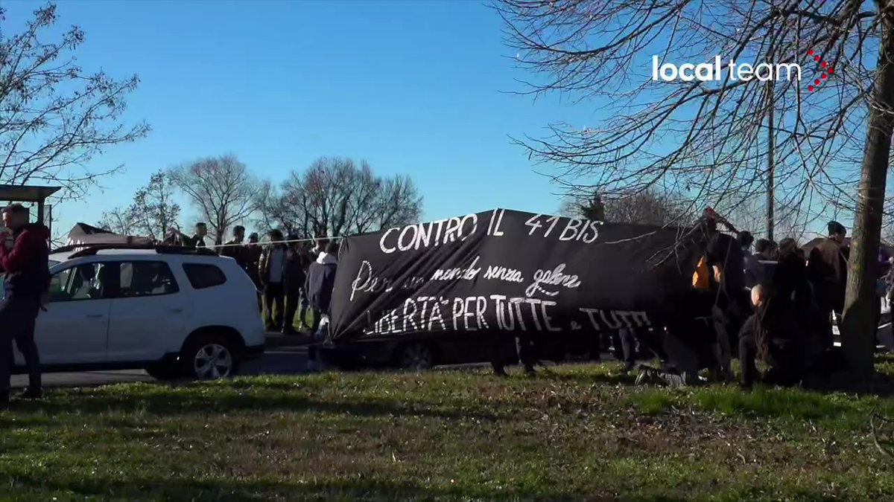[3:54 PM * 4月4日2月4日](https://twitter.com/localteamtv/status/1621884893759262722?ref_src=twsrc%5Etfw%7Ctwcamp%5Etweetembed%7Ctwterm%5E1621884893759262722%7Ctwgr%5Ed410776a61a503dd47e2c5baa31448296004dde4%7Ctwcon%5Es1_&ref_url=https%3A%2F%2Fwww.open.online%2F2023%2F02%2F04%2Fmanifestazioni-anarchici-cospito-41-bis-roma-milano-4-feb-2023%2F)/

News Source: [https://proletaricomunisti.blogspot.com/2023/02/pc-5-febbraio-manifestazione-davanti-al.html](https://proletaricomunisti.blogspot.com/2023/02/pc-5-febbraio-manifestazione-davanti-al.html)

<!--NEWS-->

# 洋基帝国主义在菲律宾扩大

作者: Tjen Folket Media

描述: 菲律宾当局开放，允许美军在该国建立四个新的军事基地。

发布时间: 2023-02-05T15:23:14+00:00

修改时间: 2023-02-05T15:25:00+00:00

图片: ['[USA-og-Filippinene-militaere-baser-avtale-1160x749.png](https://tjen-folket.no/wp-content/uploads/2023/02/USA-og-Filippinene-militaere-baser-avtale-1160x749.png)']

标签: None

类别: 'Asia'

<!--METADATA-->

* * * 

 由Eart Folket Media的评论员。 

 * * * 

 **菲律宾当局开放，允许美军在该国建立四个新的军事基地。** 

 它是与美国国防部长奥斯汀本周早些时候访问菲律宾的访问有关的。 

 因此，新协议需要大量扩展所谓的纽约州国防合作协议协议协议(EDCA)这是由中部国家于2014年进入的。 

 菲律宾当局坚持认为，这与建立基础无关，而是称其为“地方”，以免根据自己的宪法陷入全部启示，这禁止其他州在该国建立了不军事基地。 

 但是，从洋基帝国主义的角度来看，目标是明确的，即逐步踏上南中国海的军事存在，并加剧对中国帝国主义的政治和军事压力。 

 这项新协议导致了首都马尼拉·达斯特(Manila Dast)的学生和反帝国主义活动家的示威游行，要求停止洋基帝国主义的“军事援助”，而埃德卡协议被废弃。 

 **参考：** 

 [美国。 菲律宾同意更大的美国军事意义](https://www.npr.org/2023/02/02/1153727888/the-us-philippines-american-military-presence) (npr.org)

News Source: [https://tjen-folket.no/index.php/2023/02/05/yankee-imperialismen-ekspanderer-pa-filippinene/](https://tjen-folket.no/index.php/2023/02/05/yankee-imperialismen-ekspanderer-pa-filippinene/)

<!--NEWS-->

# 在汉堡举行的集会[更新]：停止对墨西哥人民的恐怖！ 停止对巴西贫穷农民的恐怖！

作者: DEM VOLKE DIENEN

时间: 2023-02-05T16:39:36+00:00

图片: []

标签: ['Mexiko', 'Sol Rojo']

类别: None

<!--METADATA-->

_我们的官员呼吁在汉堡派遣一次集会，并在伊姆布拉西利州的简短事件中，我们加入了“反对帝国主义侵略的联邦政府”。 关于墨西哥和巴西的事件，已在现场发表了信息：[此处](https://www.demvolkedienen.org/index.php/de/42-nachrichten/lateinamerika/7461-uebersetzung-massaker-in-nova-mutum-ro-neue-berichte-denunzieren-folterungen-und-verletzungen-der-rechte-waehrend-des-angriffs-der-militaerpolizeials-ausdruck-des-proletarischen-internationalismus-aus-solidaritaet-zu-dem-kampf-des-brasilianischen-volkes-u)和这里](https://www.demvolkedienen.org/index.php/de/42-nachrichten/lateinamerika/7456-mitteilung-nach-der-aggression-gegen-rincon-tagolaba-tehuantepec)。 _ 

 更新： 

 同时，来自巴西朗多尼亚州的新的贫困农民大屠杀的消息再次由大型土地所有者安排。 “贫穷农民联盟”(LCP)在该地区为灰泥国家争夺所有武器和农村农民，他们可以从中提供自己和家人。 一次又一次地通过巴西国家，大型土地所有者和骗子大屠杀。 因此，我们打电话给巴西人民和德拉克的所有朋友参加集会并重新谋杀这一谋杀案!

 结束将基础斗争定为犯罪!

 **集会：2023年2月8日，星期三| 下午6点| S-Bahn Station Sternschanze ** 

 * * * 

 在墨西哥苏登的瓦哈卡州，贫穷的农民一直在与大型项目作斗争，因为旧州一直与丹帝国主义者合作建立。 农民被抢走了土地，因此可以在地峡冯·德万特佩克(Isthmus von Tehuantepec)上拉出巨大的风电场。 这样，迪鲍尔被征用，大自然被摧毁，人口被出售。 

 农民已经提供了多年的抵抗，以压抑和恐怖分子的身份得到了阿尔滕梅急流国家及其陪同人员的回答。 为了打破农民的斗争以及在发展对死亡的巨型项目的抵抗力的任务上所做的不同流行运动，该州正在急于对人口的准军事帮派。 在过去的几周中，这种情况发生了巨大的变化。 几个人民的樟脑被捕或消失，没有痕迹。 2023年1月29日，武装的帕拉米塔尔人占领了居民林肯·塔戈尔·霍尔滕(Rincon Tagolabedholten)的市政当局，摧毁了附件和饮用水烟雾和礼物以关闭。 国家警察抽搐了一下，但没有针对武装的武装对象。 

 墨西哥国家利用谋杀团伙为他努力，以牺牲人民利益为代价，而牺牲了Vontehuantepec的人民为代价，并且有一切手段。 我们的团结镀金的贫穷农民和流行的运动，例如人民的电红色阳光(Corriente del Pueblo Sol Rojo)那是不朽的，并为人民的必要事物和利益做好了准备。 我们要求释放所有被拘留的人民的樟脑。 我们呼吁消失的dieso -future生命的生动。 我们呼吁结束墨西哥旧国家及其手的镇压和恐怖。 

 **集会：2023年2月8日，星期三| 下午6点| S-Bahn Station Sternschanze ** 

 _b undnis反对帝国主义侵略_ 

 _ febraws 2023_

News Source: [https://www.demvolkedienen.org/index.php/de/t-international/7453-kundgebung-in-hamburg-stoppt-den-terror-gegen-das-mexikanische-volk-stoppt-die-megaprojekte-der-enteignung-und-des-todes](https://www.demvolkedienen.org/index.php/de/t-international/7453-kundgebung-in-hamburg-stoppt-den-terror-gegen-das-mexikanische-volk-stoppt-die-megaprojekte-der-enteignung-und-des-todes)

<!--NEWS-->

# 工人的斗争贝雷塔（Beretta）的新颖性，工人集会的需求

作者: fannyhill

描述: 为什么我们在10月28日在特雷佐举行的贝雷塔工人大会的MFPR干预的某些步骤中找到了这一点。

时间: 2023-02-05T17:04:00+01:00

图片: ['[download.jpg](https://blogger.googleusercontent.com/img/b/R29vZ2xl/AVvXsEiiqtpNlgpFpOnwo5Wss7jo5Sa_pG1gD9QsAJO9VsDJC6rI3Jl4yoTpyS2iGrD3UqP6P6u2Ck4PAJi4ExLHp2_OVCXo9gNuwpSKgHzRdkBmZDvMhGL8vzmqh4SBf7Ois8ZhklltuYna-p-2UW_b8lcle-hNAGhYd59kve5tmpV58RUDPwehKDv9UuBd/s1600/download.jpg)']

<!--METADATA-->

**为什么我们会在10月28日在特雷佐(Trezzo)举行的贝雷塔工人的Mfprresell'assage中找到它。** 

 ** === ** 

 --- _i可以在pdf中请求：mfpr.naz@gmail.com_“一个重要且必要的集会，可以被视为第一个集会，特别是占据了地板的工人；工人已经通过斗争采取了行动，他们使工厂中的马切在这次集会中强烈放置，需要稀薄，通过联系，加入其他工人，战斗或仍然不挣扎但想组织自己的工人来扩大这些斗争，以反对遭受的攻击代表他们并且不可避免地与妇女生活中更普遍的鞋子交织在一起的大师和神灵。 

 **这个不委派的工人集会，他们在洛曼尼(Loromani)将其组织为工人和妇女，她们确认妇女的自主权，以使她们的直接主角是真实的，**是班级联盟景观和中间的新颖性Theonnas的运动是一条重要的道路阶段，始于大约两年，当时妇女 /工人的股东会议的经验。 

 **(ANNUNCIAMO CHE LA PROSSIMA ASSEMBLEA DONNE/LAVORATRICI NAZIONALE IN FORMATELEMATICA SI TERRA' IL 23 FEBBRAIO ORE 17, ALL'0DG SOPRATTUTTO LAPREPARAZIONE DELL'8 MARZO DELLE DONNE PROLETARIE)** 

 如今，面对资产阶级最反动权利的新的Meloni Nerogoverno，这条路更加必要。 

 贝雷塔工人的斗争_(iniziata da vari mesi, fino a quellapiù recente del 1 febbraio)_增加其他工人和关注权利的权利 - 妇女的权利，孕妇权利，所有规模，反对歧视，以利用这些工人的二重迁移状况，以施加更严重的工作条件，如果他们做同样的工作，也是如此。 

 工人的议会还在大多数无产阶级妇女，工人，工人中，即组织自己和战斗的妇女，即使这些斗争始于直接的方面 - 工资，小时，时间，时间，小时，健康和安全 - 它们接近与我们喜剧演员有关的整个状况，因此，我们从事工厂的工作与完全从工厂下载给我们的护理工作之间不可避免地有联系，在家庭中。 

 因此，这种额外的装备是必要的，尤其是在此阶段，要使上任所有者的政府合同，并且在议程上有不同问题，反对工人的斗争，反对移民，以资产阶级的一般趋势与现代法西斯主义的一般趋势，在对无产阶级妇女的袭击中的犹豫，工人要在工厂中得到更多利用，以获取资本主义大师的利润。 仅对于财政部之一而言，经济发展部MISE是在公司部中，也就是在Dedadroni宣布的服务部。(in senso nazionalista e corporativo); 虽然将有一个家庭部，但有机会平等。 但是，如果工人隶属于基本权利(例如lamaternity)，那么哪个家庭，出生率，机会均等，而另一方面，他们准备攻击美国妇女选择自由的堕胎/伊利蒂托？ 

 我们不必保持阳光，这就是大师们想要的，而且压迫我们总是倾向于分裂我们，隔离我们，将其他人置于疲倦，削弱我们，窒息斗争，在任何正式质疑他们的生产的正式中镇压他们，也就是说，Cheli的利润丰富。 

 因此，从贝雷塔·迪特雷佐(Beretta Ditrezzo)的工人的斗争开始的这一集会并不孤单，因此，特雷佐(Trezzo)是一个让我们所有人关注的集会。

News Source: [https://femminismorivoluzionario.blogspot.com/2023/02/la-lotta-delle-operaie-beretta-pone-la.html](https://femminismorivoluzionario.blogspot.com/2023/02/la-lotta-delle-operaie-beretta-pone-la.html)

<!--NEWS-->

# PC 2月5日 - 梅洛尼政府强调了意大利帝国主义外交政策的军事化

作者: prolcomra

时间: 2023-02-05T19:44:00+01:00

图片: ['[meloni-tajani-crosetto.JPG](https://blogger.googleusercontent.com/img/b/R29vZ2xl/AVvXsEhfnNbrSVi2jWUgelphofdYnpeAfgicf_cdt8UycR8espAw08kiBxqN5T87nQZIJwJyvGKPl2gMhvCG9VoRkAMi5yNBZmdw4-35WpiBQ9vCxBFYh8qTB_MzEumNCSgVSMjWhJ8n2zRtNx5GobTBonbtQv3EiYPVjo8-vBdJKUGpAXvUBoQKpG891WGzWg/w402-h220/meloni-tajani-crosetto.JPG)']

<!--METADATA-->

周五，XIX立法机关的第一个外国桌面“在罗马举行了国防和外交事务和国际合作能力的协调和联合行动..... 

 桌子讨论的主要主题是：北约维尔纽斯峰会，北约的东和南方，辩方，对基辅的支持，支持大陆和平的承诺，非洲的意大利战略，安全，在“地中海阿拉尔加托”和“ 2023年决议国际任务”中。 

 ** Crosetto：意大利必须_“增强影响国际收入中政治军事加工处理的能力” _。** 

 **使用武装部队** 

 回忆起各部委发布的票据，有40次行动，这是意大利武装部队(di cui 37 internazionali in 24 Nazioni)北约国际业务，联合国和欧盟有超过11,000个单位，超过6,000个单位：从巴尔干，伊拉克，Almediterraneo到黎巴嫩。

News Source: [https://proletaricomunisti.blogspot.com/2023/02/pc-5-febbraio-il-governo-meloni.html](https://proletaricomunisti.blogspot.com/2023/02/pc-5-febbraio-il-governo-meloni.html)

<!--NEWS-->

# 尽管诞生了法西斯主义生命和统治的政策，但促进了黄金黎明片段的选举排除和民主党＆＃187; 政府的研究提出了新的反动＆＃171;押金＆＃187; -KKE（M-L）

作者: ΚΚΕ(μ-λ)

时间: 2023-02-05T99:00:00-04:00

描述: ND政府将众议院（修正案）带到排除当事方，当事方的联盟和被判犯罪活动罪的人。 关于过去的辩论是关于是否以及如何将其排除在新的纳粹卡西迪亚党选举之外的辩论。

图片: ['[antifa.jpg](https://www.kkeml.gr/media/jznb0kcf/antifa.jpg)']

类型: article

<!--METADATA-->

ND政府将立法带到议会立即投票(τροπολογία)当事方的排除，政党和人的联盟被定罪。 关于是否可以以及如何以及如何将其排除在新的纳粹卡西迪亚党的选举之外的辩论已经消失。 

 很明显，政府真正削减的是新纳粹，法西斯，金色黎明的恐怖主义军队的选修比例，而不是因为其反动，反劳工，种族主义和反流人意识形态和反流人意识形态和反流人意识形态实践。 毕竟，正是ND本身已融入了一系列遥远的，大教堂，政府和法西斯的高管和成员中。 它本身被推向公共和政治生活的法西斯主义：它遇到了开放式的权利和政治自由，施加了野生和压制的政权，每天都在处理表演行动和青年，青年和青年。 这与给予它并合法化最极端和最黑暗的景色。 

 因此，没有幻想可以适应这种立法生活的动机。 因为每当系统的力量(και ειδικά στησημερινή συγκυρία)他们谈论“保护民主”，人民必须是最糟糕的。 晋升布局的事实是这样的医生，以至于它可以包含各种左翼政策(που θα μπορούσαν να θεωρηθούν εκτός του αστικούλεγόμενου “δημοκρατικού τόξου”)，指示更整体预期的系统。 因为一个问题是避免在必须促进资产阶级政治集团的选举碎片化，而不必更极端，反人口主义和反劳动政策，但更是如此，甚至更多地将其进一步限制在那些具有的声音中一直是受欢迎的工人。 

 因此，通过这项立法规定，政府和他们节省的制度希望将更深入的反民主“遗产”提出。 他们希望障碍左翼的功能和政治行动，尤其是那些有共产主义参考的障碍。 他们想通过统一主义理想再现法西斯讲道的反动方程。 他们想恢复“两个房间”的反动理论。 与世界上几个国家一样，禁止共产党和青年组织及其象征。 

 鉴于西里萨(Syriza)和帕索克(Pasok)，对政府的服务以及政府对通过外国和当地人针对大众群众的实质性政策的实质性支持都没有信心。 不管他们将遵循什么操纵，他们的目标都在投票箱中，而不是在图卢和青年的权利中。 他们试图展示更“民主”的形象，而他们并没有最大程度地减少系统攻击的核心。 

 **法西斯主义在工人，受欢迎和青年斗争中陷入困境。我们必须反对它，我们都被喂养。

News Source: [https://www.kkeml.gr/την-ώρα-που-η-πολιτική-που-γεννά-το-φασισμό-ζει-και-βασιλεύει-ο-προωθούμενος-εκλογικός-αποκλεισμός-των-θραυσμάτων-της-χρυσής-αυγής-και-η-δημοκρατική-σπουδή-της-κυβέρνησης-βάζει-νέες-αντιδραστικές-παρακαταθήκες/](https://www.kkeml.gr/την-ώρα-που-η-πολιτική-που-γεννά-το-φασισμό-ζει-και-βασιλεύει-ο-προωθούμενος-εκλογικός-αποκλεισμός-των-θραυσμάτων-της-χρυσής-αυγής-και-η-δημοκρατική-σπουδή-της-κυβέρνησης-βάζει-νέες-αντιδραστικές-παρακαταθήκες/)

<!--NEWS-->

# 和每周社论＆＃8211; 军国主义反动派投产的数学

作者: COMMUNIST INTERNATIONAL MARXIST-LENINIST-MAOIST ONLINE NEWSPAPER

时间: 2023-02-05T99:00:00-04:00

图片: ['[editorial-mathematics....jpg](https://ci-ic.org/wp-content/uploads/2023/02/editorial-mathematics....jpg)']

类别: ['Brazil', 'Luminous Struggles']

<!--METADATA-->

编辑人员和 

 2023年2月2日 

 ##和每周社论 - 军事反应的数学数学 

 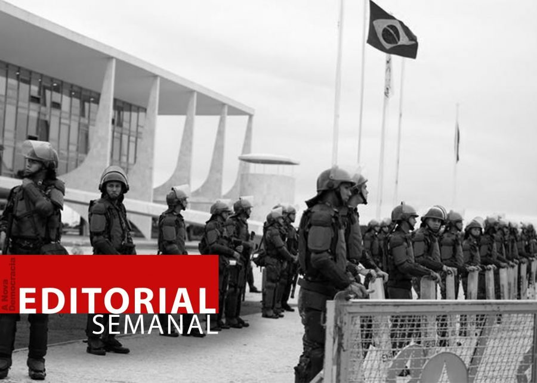当路易斯·伊纳西奥(LuizInácio)于21日开火时发出了很多噪音，在平地上任职约80名军事人员，当时的陆军指挥官JúlioCésardearruda用TomásMiguelRibeiro Paiva取代了他。 有些人对资产阶级民主和国家奴隶制机构的“稳定”的信念令人头晕，而洋基帝国主义”将不允许政变，甚至宣称没有有效的“卢拉政府”在没有的情况下被宣布为 武装部队的指导。 路易斯·伊纳西奥(Luizinácio)宣称他不信任武装部队，他想要一个机构安全的内阁(GSI)没有军事人员，并为观众玩游戏，他们将不接受军事助手(and soon after, would have them)，Ina分阶段说他不会屈服于“军事力量”，试图通过公众舆论隔离来限制TheGenerals的机动空间。 

 在31日，卢齐纳西奥(Luizinácio)总共“令人惊讶”的是零政治意识的人，提名了122名军事人员进入GSI。 数学很明显：共和国总统没有限制军队的存在，因此，他们在政府中的影响力增加了!与此同时，新闻界报道说，PT总统允许陆军允许联邦政府的官方警察批准 从1月8日晚上的夜晚，在陆军总部反对营地的地区。 这一集涉及武装部队的坦克操纵，以劝阻Themital Police，但面对Thegenerals的压力，LuizInácio批准了LuizInácio。 众所周知，这项操作是进行了进行的，以便活跃的安德雷斯官员及其家人可以离开营地而不会被捕。 

 现在，这揭示了什么？ 在军队中实现这一目标的卢齐纳西奥(Luizinácio)的表现持续了少于肥皂泡沫，因为所谓的归因于政府的力量是嵌合体，是嵌合体。 机会主义者和自由主义者并没有看到对这种情况和宽松的资产阶级民主的辩护，以各种暴力对人民的暴力行为并没有使他们动摇，相反，它激发了他们的诉讼，最重要的是不信任和愤怒。 他们假装不知道，但他们非常清楚，在政治上，有效的力量是群众，而不是实体和办公室的群众，当他们没有物质支持时无害。 这也是如此。 

 在一定程度上，政府试图以库班的协议和关于“民主”的宏伟宣言限制政变运动 - 这是日常生活中大群众所不知道的 - 这只会使自己无能(today, the troops and,now, they are playing to win over the masses, mainly the small and middlebourgeoisie and counting on the Bolsonarist evangelicals among the poor)。 政府正倾向于投降； 毕竟，如果自2018年选举以来，他们一直对Themilitary的持续宣布保持沉默，该怎么办？ 没有一个批评，只有批评!毕竟，反动联盟的政府可以做什么，大资产阶级和土地所有者，帝国主义的仆人，行使earkiesepower？ 如果它具有一定的礼节，它将立即呼吁他们走上街头，以捍卫威胁的民主自由!

 同时，土著人民被杀害，就像在针对Yanomami的恐怖和刑事案例中，农民被系统地屠杀了，他们只是为土地而苦苦挣扎。 1月28日上午，来自隆多尼亚军事警察Bope的警察开枪射击了正在爬上船上河流的农民。 士兵们逮捕了两个年轻人，将他们拖到了被批准的地方，折磨了他们，甚至削减了其中一个的舌头，并用冷血处处决了他们。 新闻垄断，杰出的政治家和正义机构，捍卫这种民主的英雄，完全是沉默的。 这与您的民主无关，对吗？
ACFA正在计算和重新制定其对军事干预日的计划，寻找合适的时间进行干预，鼓励使用“绿色鸡”作为大炮饲料，并与政府进行新的协议，并在其上与政府达成新协议，并在其方面加强了新协议。 中介功率[_ PODER MODERADOR_]; 同时，它正在尝试从其北方大师那里获得的支持，并从公众舆论的支持下，试图粉碎人民的起义，使其引起正义的愤怒。 

 为了阻止政变的动议，不可能依靠机会主义者，这是由于数十年来在旧式宫殿中的欢乐而陶醉的，并希望有更多的人在统治下。 至少可以完成支持群众，动员他们的最低权利，每天通过罢工，土地癫痫发作，占领和学校的占领和学校，以抗议和革命行动来进行罢工。 没有对富人民主的幻想。

News Source: [https://ci-ic.org/blog/2023/02/05/and-weekly-editorial-the-mathematics-of-capitulation-to-the-militaristic-reactionaries/](https://ci-ic.org/blog/2023/02/05/and-weekly-editorial-the-mathematics-of-capitulation-to-the-militaristic-reactionaries/)