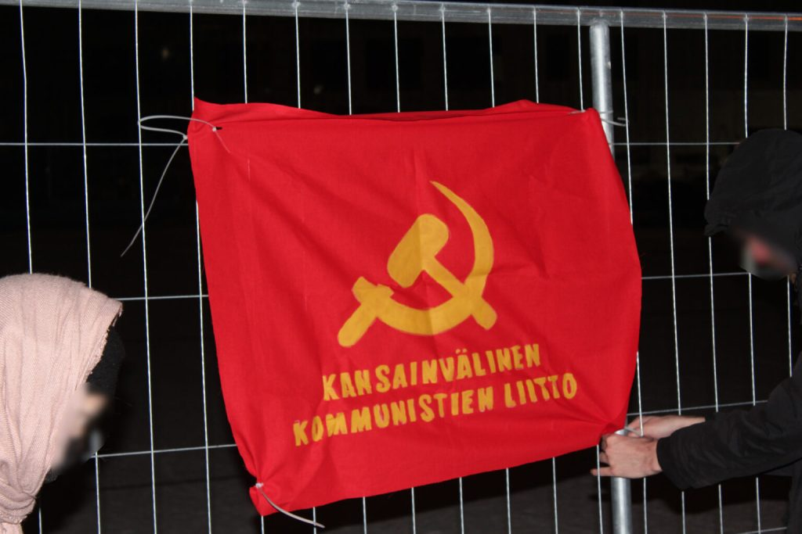
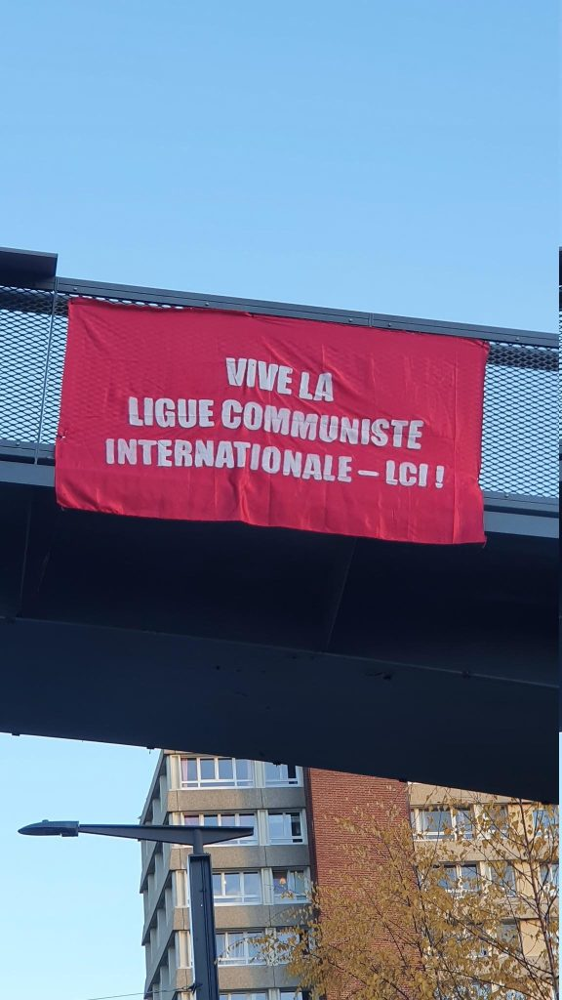
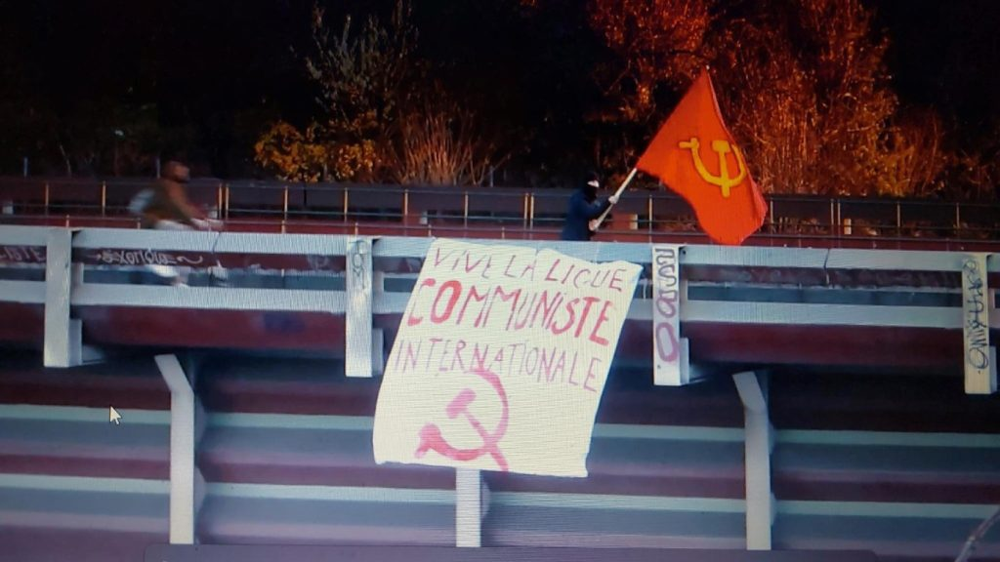
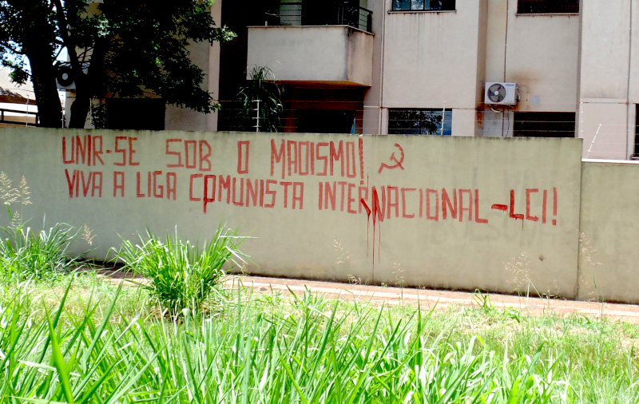
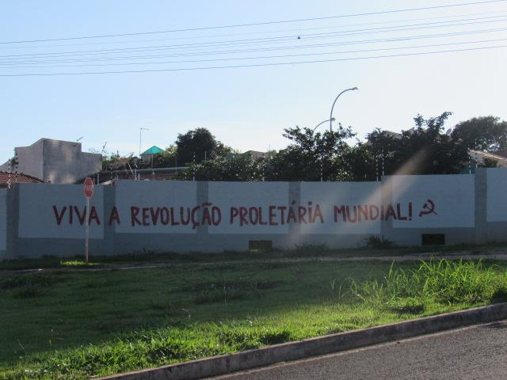
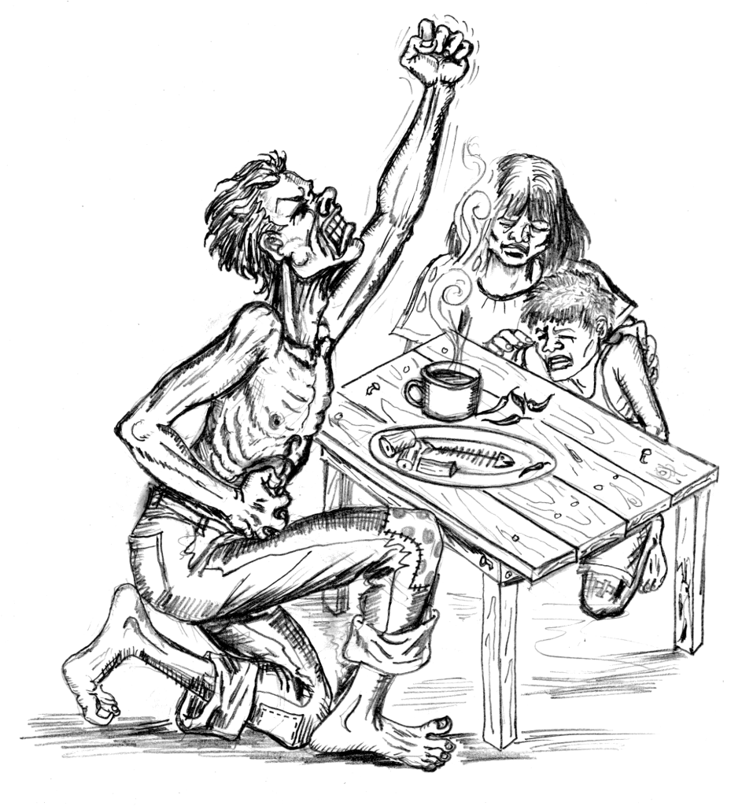

# pc 6 febbraio - Ministro Crosetto al servizio sempre e solo dell'industria bellica

Author: maoist

Time: 2023-02-05T12:28:00+01:00

Images: []

<!--METADATA-->

## Il Ministro della Difesa Crosetto per gli Aerospace & Defence Meeting diTorino

0  Il **presidente Alberto Cirio e il sindaco Stefano Lo Russo** hanno incontratoil **ministro della Difesa Guido Crosetto** per un aggiornamento sul**Distretto Aerospaziale** piemontese e, in particolare, sugli sviluppi legatialla Città dell'Aerospazio, uno dei progetti bandiera del Piemonte sul Pnrr.Entro l'anno in corso Marche partiranno ufficialmente i lavori, con la posadella prima pietra per i laboratori universitari del Politecnico e la Casadelle Imprese, realizzata in sinergia con la Camera di commercio di Torino. Unprogetto di grande potenzialità per un settore strategico, in cui il Piemonterappresenta una eccellenza internazionale.  Lo testimonia il radicamento di una realtà leader come **Leonardo** , che hagià espresso la volontà di confermare e rafforzare la propria presenza aTorino, inserendo la riqualificazione del proprio sito industriale nel quadrodella Città dell'Aerospazio, consolidata con la presenza di un nuovo CentroDirezionale.  L'incontro è stato anche l'occasione per invitare ufficialmente il ministroCrosetto agli **Aerospace & Defence Meeting**s, la più grande conventionitaliana dedicata al settore e tra le più importanti a livello internazionale,che si svolgerà a fine novembre sotto la Mole. Il Ministro ha accettatol'invito a partecipare.

Source: [https://proletaricomunisti.blogspot.com/2023/02/pc-6-febbraio.html](https://proletaricomunisti.blogspot.com/2023/02/pc-6-febbraio.html)

<!--NEWS-->

# La lotta delle operaie Beretta pone la novita', necessita' delle Assemblee operaie

Author: fannyhill

Description: Si può richiedere in pdf a: mfpr.naz@gmail.com "Un’assemblea importante e necessaria che si può considerare la prima assemblea specificatam...

Time: 2023-02-05T17:04:00+01:00

Images: ['[AVvXsEjuRW4RDAsGBwu4p7ZaSVBohVvOFVbTRBbWjBB2v6vp2DBkXEAUQ2P8ne_bRWiEinI4b_WOoVsCHiKv-z8eXiOElEVKmkFss-trN4jxF5AecKsk5FxIa7Q0kFDc7iHvjvzIchdIEKMjou5d0p36WpJRjkA0bVvpUxUNALZYNeL0fN4SV_Fwa8bu6vMQ=w453-h640](https://blogger.googleusercontent.com/img/a/AVvXsEjuRW4RDAsGBwu4p7ZaSVBohVvOFVbTRBbWjBB2v6vp2DBkXEAUQ2P8ne_bRWiEinI4b_WOoVsCHiKv-z8eXiOElEVKmkFss-trN4jxF5AecKsk5FxIa7Q0kFDc7iHvjvzIchdIEKMjou5d0p36WpJRjkA0bVvpUxUNALZYNeL0fN4SV_Fwa8bu6vMQ=w453-h640)']

<!--METADATA-->

_**Si può richiedere in pdfa:[mfpr.naz@gmail.com](mailto:mfpr.naz@gmail.com)**_

"Un'assemblea importante e necessaria che si può considerare la primaassemblea specificatamente delle operaie che si sono prese la parola; operaieche già sono entrate in azione attraverso le lotte che fanno in fabbrica mache hanno posto con forza attraverso questa assemblea la necessità dirafforzare, estendere queste lotte collegandosi, unendosi ad altre operaie,lavoratrici che lottano o che ancora non lottano ma vorrebbero organizzarsiper farlo, contro gli attacchi che si subiscono da parte di padroni e deigoverni che li rappresentano e che si intrecciano inevitabilmente con lacondizione più generale di vita delle donne. Se lotta una lottano tutte, faredi ogni lotta la lotta di tutte, è questo il messaggio reale e concreto daTrezzo alle altre operaie e lavoratrici.

**Questa assemblea delle operaie, che non delegano, che prendono nelle loromani la loro organizzazione come lavoratrici e come donne, che affermanol'autonomia delle donne perchè sia reale il loro protagonismo diretto,  **èdavvero una novità nel panorama sindacale di classe e nel movimento delledonne, una tappa importante di un percorso iniziato da circa due anni con lapositiva esperienza dell'Assemblea donne /lavoratrici.

**(ANNUNCIAMO CHE LA PROSSIMA ASSEMBLEA DONNE/LAVORATRICI NAZIONALE IN FORMATELEMATICA SI TERRA' IL 23 FEBBRAIO ORE 17, ALL'0DG SOPRATTUTTO LAPREPARAZIONE DELL'8 MARZO DELLE DONNE PROLETARIE)**

Oggi questa strada è necessaria a maggior ragione a fronte del nuovo nerogoverno Meloni della destra più reazionaria della borghesia al potere.

La lotta delle operaie della Beretta  _(iniziata da vari mesi, fino a quellapiù recente del 1 febbraio)  _incoraggia altre lavoratrici e riguarda dirittifondamentali delle donne lavoratrici, il diritto alla maternita', allasicurezza, contro le discriminazioni che sfruttano anche la condizione diimmigrate di queste operaie, per imporre peggiori condizioni di lavoro, disalario, lavoratrici di serie A e di serie B, anche se fanno lo stesso lavoro.

L'assemblea operaie pone sul piatto anche la questione della marcia in piùdelle donne proletarie, delle operaie, delle lavoratrici, cioè delle donne chequando si organizzano e lottano, anche se queste lotte partono da aspetti chepossono essere immediati - il salario, le ore, la salute e sicurezza -inevitabilmente si rivestono di tutta la condizione che ci riguarda comedonne, e quindi inevitabilmente c'è un intreccio tra il lavoro che facciamodentro la fabbrica e il lavoro di cura che ci viene scaricato totalmente fuorila fabbrica, in famiglia.

Quindi questa marcia in più è necessaria, in particolare in questa fase, percontrastare il governo dei padroni che si è insediato e che ha in agenda trale diverse questioni, contro le lotte dei lavoratori, contro gli immigrati,nella tendenza generale della borghesia al moderno fascismo, quella diavanzare nell'attacco contro le donne proletarie, le operaie da sfruttaresempre più in fabbrica per il profitto dei padroni capitalisti. Solo per fareun accenno, uno dei ministeri, il Mise, Ministero dello sviluppo economico, èdiventato Ministero delle imprese, cioè dichiaratamente al servizio deipadroni (in senso nazionalista e corporativo); mentre ci sarà il ministerodella famiglia, natalità, pari opportunità. Ma quale famiglia, natalità, pariopportunità, se poi le operaie vengono attaccate in diritti basilari come lamaternità, mentre dall'altro lato si preparano ad attaccare l'aborto/ ildiritto alla libertà di scelta di noi donne?

Noi sole non dobbiamo restare, questo è quello che vogliono i padroni, che perattaccarci e opprimerci tendono sempre a dividerci, isolarci, metterci le unecontro le altre, indebolirci, soffocare le lotte, reprimerle in ogni formaquando mettono in discussione la loro produzione, cioè quella del profitto cheli arricchisce.

Quindi questa assemblea che parte dalla lotta delle operaie della Beretta diTrezzo, non è solo, quindi, di Trezzo, è un'assemblea che ci riguarda tutte.

Source: [https://femminismorivoluzionario.blogspot.com/2023/02/la-lotta-delle-operaie-beretta-pone-la.html](https://femminismorivoluzionario.blogspot.com/2023/02/la-lotta-delle-operaie-beretta-pone-la.html)

<!--NEWS-->

# pc 5 febbraio - Il governo Meloni accentua la militarizzazione della politica estera dell'imperialismo italiano

Author: prolcomra

Time: 2023-02-05T19:44:00+01:00

Images: ['[meloni-tajani-crosetto.JPG](https://blogger.googleusercontent.com/img/b/R29vZ2xl/AVvXsEhfnNbrSVi2jWUgelphofdYnpeAfgicf_cdt8UycR8espAw08kiBxqN5T87nQZIJwJyvGKPl2gMhvCG9VoRkAMi5yNBZmdw4-35WpiBQ9vCxBFYh8qTB_MzEumNCSgVSMjWhJ8n2zRtNx5GobTBonbtQv3EiYPVjo8-vBdJKUGpAXvUBoQKpG891WGzWg/w402-h220/meloni-tajani-crosetto.JPG)']

<!--METADATA-->

Venerdì si è tenuto a Roma il primo Tavolo Esteri-Difesa della XIX legislaturaper "un'azione coordinata e congiunta delle capacità della Difesa e delministero degli Affari esteri e della cooperazione internazionale.....

I principali argomenti oggetto di discussione del tavolo sono stati: ilprossimo vertice Nato di Vilnius, i fianchi Est e Sud della Nato, la difesaeuropea, il supporto a Kiev, l'impegno a sostegno della pace nel continenteeuropeo, la strategia italiana in Africa, la sicurezza del "MediterraneoAllargato" e la "delibera missioni internazionali 2023".

**Crosetto: l'Italia deve _" rafforzare la capacità di influenzare i processidecisionali politico-militari nei consessi internazionali"_.**

**L 'IMPIEGO DELLE FORZE ARMATE**

Le Forze armate italiane, ricorda la nota diffusa dai ministeri, sonoattualmente presenti in 40 operazioni (di cui 37 internazionali in 24 Nazioni)con oltre 11.000 unità impiegate, oltre 6.000 in operazioni internazionali inambito Nato, Nazioni Unite e Unione europea: dai Balcani, all'Iraq, alMediterraneo, al Libano.

Source: [https://proletaricomunisti.blogspot.com/2023/02/pc-5-febbraio-il-governo-meloni.html](https://proletaricomunisti.blogspot.com/2023/02/pc-5-febbraio-il-governo-meloni.html)

<!--NEWS-->

# Celebrate the 50th anniversary of the foundation of the Party and the initiation of Maoist People's War - PBSP/Bangladesh

Author: maoistroad

Description: \-- Central Committee, Proletarian Party of Purbo Bangla (Purbo Banglar Shorbohara Party - PBSP/Bangladesh) (March, 2021) (Republished i...

Time: 2023-02-06T02:13:00-08:00

Images: []

<!--METADATA-->

**  \-- Central Committee,  Proletarian Party of Purbo Bangla (Purbo Banglar Shorbohara Party -PBSP/Bangladesh)  (March, 2021)**  (Republished in revised and extended form by CC, June 2021)

Proletarian Party of Purbo Bangla (Purbo Banglar Shorbohara Party - PBSP) wasfounded 50  years ago, on June 3rd, 1971, with the leadership of the then leader and thefounder of the  party, Comrade Siraj Sikder (SS). That was the period of Liberation War ofEast Bengal  against the national oppressor state of Pakistan. The then main bourgeoisparty Awami League  fled to india, leaving people helpless under the genocide of Pakistanigenocide. Before that, at  the eve of genocide, their main leader Sheikh Mujibur Rahman surrendered tothe Pakistanis.  Other leaders, exploiting the movement, struggle, sacrifice abd self-dedication of the people,  sold the country to India, for their own self-interest of power, while fleeingthere.  At that time, Maoists, as a newly risen force, despite their various politicaland  sujective weaknesses, stuck out for the people in danger. Contrary to fakeIndian-Awami  liberation war, they waged an actual/revolutionary war of liberation invarious parts of the  country. Siraj Sikder, the founder of our party, in a situation of absence ofpower, organizing a  revolutionary army at Peyarabagan area in Barishal, created a short-livedliberated area. There  he founded the "Proletarian Party" on June 3\. Earlier during Pakistani rule,he founded "East  Bengal Workers' Movement" as a preparatory organisation for founding a partyof its kind. He  transformed it into the Shorbohara Party, a proletarian party, in the middleof the sound of  shelling of cannon in 1971.  As we are celebrating 50th anniversary of founding of the party today, we must

remember the consistent heroic struggles under the leadership of the party andthe sacrifice  and self-dedication of numerous leaders, ranks and people, with the leadershipof the party,  during this half a century. We must remember the contributions, teachings,sacrifices and  heroic martyrdom of Comrade SS, the founder of the party. The guiding light ofthese, were  the revolutionary ideological-political and theoretical positions of ourparty. On the other hand,  we must be tremendously conscious about various mistakes and historicallimitations of party's  ideological-political-military line and struggle during the time of it'sfoundation and various  stages later on. In order to become conscious about the positive bases andnegative aspects of  the party, and to continue the Maoist revolutionary struggle in this country,Com. Anowar  Kabir, party leader after SS, had led the party for almost four decades. Herelentlessly  summarized vast experiences of the party, in that process, overcame newlycommited mistakes  also, and step by step, equipped the party with the correctness of Maoistline. The developed  form of which has been primarily contained in the "New Thesis" approved in2011, and in the  report of the Fourth Congress in 2017. In a new perspective of internationalcommunist  movement, these presented a qualitatively higher direction in nationalcommunist movement.  Which paved the way of development of lines and struggles of later period, andestablished  their new foundation.  This direction is teaching us that, we could not see the foundation andstruggle of our  party in the perspective of overall Maoist movement during '70s, and for along time later on  as it's continuity. That is why, Maoist unity could not have been built.During those times,  beside our party, some other Maoist centers worked in this country at thattime. The main parts  of those had revolutionary contributions in the liberation war of 1971 aswell. We must asses  overall Maoist movement including them as well. However Maoist movement beganeven  before that time, including the preparatory measures for founding our party.Although bigparts of the Maoist forces of the movement of that time, laterwere in down-fall due to various  national-international jeopardy, at various periods, including a part of ourparty also.  It is very important to grasp, how in this long adverse period, our partystruggled  against various revisionist and deviationist lines in national andinternational sphere, and how  it corrected it's own mistakes and developed our party line. Because withoutthis, ultimately it  wouldn't be possible to comprehend any revolutionary line or struggle today.Neither is it  possible to give real meaning to the celebration of the anniversary of thefoundation of the  party or Maoist people's war.  In these struggles, there were various aspects of ideological-political-military line and  various complex paths of international line. Where, with the leadership ofComrade Anowar  Kabir, our party played a leading role and made itself actually an almost soleMaoist  revolutionary center in this country. Despite there are still some Maoistcenters and dedicated  Maoists outside our party, but it is beyond doubt that this party of ours isestablished in the  country as a self-assesment oriented, dynamic, creative and revolutionaryMaoist party. The  bases of this, are the teachings of Comrades SS and AK, which have beensynthesized in our  `New Thesis', Report of the 4th Congress and in other documents.  * Similarly, we will celebrate the 50th anniversary of Maoist People's War also. In  reality, our party initiated Maoist people's war in 1970, as well as someother centers. But in  special situations of 1971, maoist people's war greatly appeared as a distinctand special entity  in the political spheres of this country. As it's continuity, in the firsthalf of '70s, people's war  turned into a heroic tumultuous struggle around the country, with theleadership of some  Maoist centers; our party was the foremost among them.  But everybody knows, that upsurge couldn't last long. The reason for it was,on one  hand, brutal suppression by anti-revolutionary enemies of the people, on theother hand,  mistakes of the Maoists themselves (including our party), some of which werevery serious.  Similarly, the later risings of ours and others', specially the struggle ofMadaripur in 80s and  country-wide 2nd armed upsurge a bit later in our party's leadership, hadbecome destroyed.  In addition, there is the serious crises in world revolutionary struggle dueto the disasters in  worldwide Maoist movement, during the last one and a half decade.  In oder to overcome these, our party is working with all the dedicatedrevolutionary and  revolution-aspirant forces over the world for a long time. RIM was founded asthe new center  of Maoists worldwide, and with its impact and leadership, a new revolutionarywave was  being created around the world. But, despite it's significant contributions inreconstruction and  development of world communist movement for two decades, RIM became inactivefor  various reasons, from the end of the first decade of this century. Theimportant reasons among  them are: (1) the appearance of a rightist anti-people's war line in Peru,where a big part of  central leadership of Peru were involved, in some way or another; (2)abandonment of  people's war and betrayal of revolution by Prachanda-revisionism in Nepal; and(3) deviation  from proletarian class outlook, the essence of MLM, by Avakian Leadership with"New  Communism," in America. Besides these, lack of consciousness about thenecessity of forming  RIM, namely an International Center for revolutionary communists, by someimportant Maoist  forces of the world also weakened our international unity and strength.  But dedicated Maoist revolutionaries worldwide, including our party, are re-evaluating  the problems, and trying to create anew an international center/agreement. Ourparty is also  contributing to this initiative.  * Meanwhile, international and national socio-economic and political situations have  changed vastly, which is exerting huge impacts on the strategy & tactics ofpeople's war.  Specially, in most countries like ours, socio-economic situation immenselychanged. Although

3  agriculture basically remained semi-feudal, centering which the huge changesmust be  comprehended.  Due to the above-mentioned things, vast development of communication system,  mobile, IT, military technology, technology in general, and the tremendousstrengthening of  centralised state machinery, has presented the military questions in verydifferent ways than  before; the solution of which is not yet complete. Only through consistent andcumbersome  practice of peoples war in various countries can these problems be overcome.Principle and  strategies of war and struggle must be developed. Carbon copies of previousstruggles would  not work. Although the only way this is possible, is by making country sidesthe base, making  peasants the major force, sticking to the principle of protracted people's war-- not in any  other way.  We must be conscious about the changes in the national and internationalsituation.  Since there is no socialist country any more in the world, there are threebasic contradictions  active worldwide. Among them, the contradiction between imperialism andoppressed nations  and people is the principal one. Inter-imperialist contradiction is showinghints of a bi-polar  world once again. On one hand, there is US-led imperialists and their allies,and on the other,  Chinese social imperialism, Russian imperialism, the the forces led by them.It is exavatating  the crisis in them. As a result, people's struggle against imperialism andtheir various policies  and their war mongerings is rising up in various countries of the world.Imperialists and their  agents are resorting to fascism to avoid the crises. They are immenselyexpanding their  preparations for war. All of these are emphasising the significance of guidingpeople's struggle  according to correct ideology, programs and path. Subjective ability of ourMLM forces are  trailing behind the objective revolutionary situations. We must increase ourefforts manifolds  in order to reduce the difference by developing revolutionary party, struggle,and people's war.  * Our tasks must be clear on the occassion of the 50th anniversary of the foundation of  the party and of people's war. Which are: (1) Forming a single Maoist party ofa new type by  uniting all the dedicated Maoists; (2) building a successful people's war withthe leadership of  this party; (3) organising and uniting huge number of people in various vividorganisations and  fronts; and (4) creating a new 'International' of maoists worldwide. The basisof these tasks  would be a qualitatively higher ideological-political line, and military andinternational line.  Regarding these important tasks, we, all the leaders, ranks, supporters andpeople must  move forward towards greater struggle. And must keep working for materializingthe dream of  all revolutionaries. They must continue doing so until the end, until the lastbreathe. They must  be always prepared for self-dedication, for sacrifice of any kind, for servingthe people. And  for that, they must grasp Marxism-Leninism-Maoism more deeply. They mustentirely  dedicate themselves to the struggle for the liberation of the proletariat andoppressed people all  over the world.

Source: [https://maoistroad.blogspot.com/2023/02/celebrate-50th-anniversary-of.html](https://maoistroad.blogspot.com/2023/02/celebrate-50th-anniversary-of.html)

<!--NEWS-->

# Massive strejker lammer Frankrig

Author: socialistiskrevolution

Publish Time: 2023-02-06T04:00:00+00:00

Modified Time: 2023-02-03T15:28:10+00:00

Description: Frankrig står lammet. Over en halv million mennesker har haft demonstreret i Paris alene, mens protester samtidig foregår i resten af Frankrig mod regeringens planer om at hæve pensionsalderen i la…

Images: ['[th-20783266.jpeg](https://socialistiskrevolution.files.wordpress.com/2023/02/th-20783266.jpeg)', '[th-476018131.jpeg](https://socialistiskrevolution.files.wordpress.com/2023/02/th-476018131.jpeg)']

Type: article

Categories: ['Uncategorized']

<!--METADATA-->

Frankrig står lammet. Over en halv million mennesker har haft demonstreret iParis alene, mens protester samtidig foregår i resten af Frankrig modregeringens planer om at hæve pensionsalderen i landet fra 62 til 64 år.

Skoler er lukkede, gymnasier blokerede og tog står stille. Mere end 300demonstrationer har foregået på tværs af Frankrig til forsvar forproletariatets rettigheder.

Hårde gadekampe har præget mange af protesterne i landet, hvor masserne harkastet brosten mod politi i panser, som bruger tåregas i et desperat, menforgæves, forsøg på at holde massernes eksplosivitet tilbage.

For tre uger siden, da Macrons pensionsreform blev annonceret, gik over 1million på gaden i Frankrig i protest mod dette nye drakoniske udspil.

Advertisement

Source: [https://socialistiskrevolution.wordpress.com/2023/02/06/massive-strejker-lammer-frankrig/](https://socialistiskrevolution.wordpress.com/2023/02/06/massive-strejker-lammer-frankrig/)

<!--NEWS-->

# CPN General Secretary Chand Meets For Talks With PM Dahal

Author: Alan Warsaw

Publish Time: 2023-02-06T05:25:42+00:00

Update Time: 2023-02-06T22:27:28+00:00

Images: ['[PRW-Kathmandu-6F8A7136_20230206091631-800x445.jpg](https://www.redspark.nu/wp-content/uploads/2023/02/PRW-Kathmandu-6F8A7136_20230206091631-800x445.jpg)']

Tags: ['Baluwatar', 'Biplav', 'Communist Party of Nepal', 'CPN', 'CPN (Maoist Centre)', 'Kathmandu', 'Khadga Bahadur Biswakarma', 'maoism', 'Modern revisionism', 'Nepal', 'Netra Bikram Chand', 'Peace talks', 'PPW in Nepal', 'Prachanda', 'Prachandism', 'Pushpa Kamal Dahal', 'Revisionism']

Categories: ['Nepal', "People's War"]

<!--METADATA-->

**Kathmandu, February 6, 2023:** General Secretary of the Communist Party ofNepal (CPN) Netra Bikram Chand and leader Khadga Bahadur Biswakarma have helda meeting with Prime Minister and CPN (Maoist Centre) Chairman Pushpa KamalDahal at the prime minister’s official residence in Baluwatar on Sundayevening.

During the meeting, the two leaders, who are also former colleagues, heldintensive discussions on the national need for a reunion of all Maoist forcesof the country, according to Prime Minister Dahal’s media expert ManahariTimilsina.

The two leaders have agreed to form a common front of socialist forces andensure cooperation to prepare a basis for unity in the future. Timilsina saidthat the leaders have shared the same views on effective implementation of theagendas of the transformation from the unity of Maoist forces.

On the occasion, CPN leaders expressed concerns over the implementation of theagreements signed with the previous governments.

In response, Prime Minister Dahal said the government is committed toimplementing all agreements signed in the past between the government and theCPN.

> Source : https://myrepublica.nagariknetwork.com/news/pm-dahal-ncp-general-> secretary-chand-meet/?categoryId=81

Source: [https://www.redspark.nu/en/peoples-war/cpn-general-secretary-chand-meets-for-talks-with-pm-dahal/](https://www.redspark.nu/en/peoples-war/cpn-general-secretary-chand-meets-for-talks-with-pm-dahal/)

<!--NEWS-->

# pc 6 febbraio - Come la scuola per il reazionario governo Meloni/Valditara deve essere sempre più al servizio della tendenza/marcia della borghesia al potere al moderno fascismo

Author: fight

Time: 2023-02-06T05:30:00+01:00

Images: []

<!--METADATA-->

Una bambina a Palermo giorni fa è stata portata di urgenza in pronto soccorsoin uno stato di grave ipotermia perché molte scuole in questa città così comein tutta la Sicilia e in ben altre regioni del Sud di questo paese non hanno iriscaldamenti funzionanti e i bambini, gli studenti sono costretti a stare inclasse con sciarpe, cappelli, giubbotti a morire dal freddo e in particolarein questi giorni con temperature alquanto basse, ma tante scuole sono inappartamenti assolutamente non adeguati come strutture scolastiche o inedifici cadenti con classi piccole, senza palestre, mense, servizi igienicinon a norma…

Tutto questo continua "normalmente" ad accadere mentre il più che reazionarioMinistro Valditara dalla sua nera poltrona d'oro lancia proclami e annunci sulprogetto/scuola a cui aspira, e non potrebbe fare diversamente proprio perquanto rappresenta ideologicamente e politicamente come parte del governoMeloni:

come servo dei servi del sistema dei padroni/Capitale a cui la scuola deveessere sempre più funzionale, il ministro Valditara ha annunciato "«Allascuola pubblica mancano finanziamenti che potrebbero arrivare dal Privato…",altro che stanziamenti di soldi pubblici per la scuola pubblica, anzi quellisi devono tagliare perchè oggi devono servire ai padroni e alle spese militarie al sostegno/partecipazione sempre più attivi alla guerra interimperialista.Ma qui non si tratta solo di una mera questione economica circoscrittaburocraticamente ai finanziamenti, ma si pone una specifica questioneideologica/politica che rientra nell'ottica di questo governo Meloni che develasciare mano libera ai padroni/aziende di continuare a fare profitto e anchela scuola deve essere allineata in tal senso.

Ecco che Valditara parla di «professionisti aziendali» in classe, di«sponsorizzazioni» per i privati, di «sinergie con il sistema produttivo»,mentre con il dimensionamento scolastico previsto con la Legge di Bilancio2023. nel giro di due anni si rischia la chiusura di circa 700 scuolepubbliche e soprattutto nelle regioni del Sud con il rischio grave di pesantitagli ai posti di lavoro di tutto il personale scolastico e non solo precario,mentre nella manovra si stanziano 70 milioni di euro in più nel 2023 agliistituti privati, rispetto ai 550 già stanziati dal governo Draghi.

Ma non basta!

ll Consiglio dei ministri ha approvato all'unanimità, in via preliminare, ildisegno di legge scritto da Roberto Calderoli/Lega per accelerare verso laregionalizzazione/autonomia differenziata, delineando la cornice entro cui leRegioni potranno ottenere il trasferimento delle funzioni e competenze peralcuni ambiti specifici come la sanità, la scuola, l'ambiente…

La Commissione di giuristi nella relazione presentata a delle Bicamerali delfederalismo fiscale e delle regioni su questo tema ha segnalato "…L'AutonomiaDifferenziata frantumerebbe il sistema unitario di istruzione, minando allaradice diritto e libertà di insegnamento (artt. 3, 33 e 34 Cost.),subordinando la scuola all'indirizzo politico-culturale regionale e **alleesigenze delle imprese locali**. **Anche i percorsi PCTO, l 'istruzione degliadulti e tecnica superiore e gli indicatori per valutare gli studentisarebbero decisi a livello territoriale, con progetti sempre più legati alleesigenze produttive locali** (ndr. e oggi anche alle esigenze della guerraimperialista, vedi in Sicilia ad esempio, ma anche in Puglia ecc, i PCTO chegli Uffici scolastici regionali siglano con l'Esercito per obbligare glistudenti all'alternanza scuola/lavoro nelle caserme e ora anche nelle basicome Sigonella <https://www.universoscuola.it/pcto-base-sigonella-firma-convenzione-polemica.htm>). Vi sarebbero concorsi e ruoli regionali per ilpersonale e più difficili diventerebbero i trasferimenti interregionali…"

Un attacco pesante al Contratto collettivo nazionale con le "moderne" gabbiesalariali differenti tra Nord e Sud, che tanto piacerebbero ai padroni, eaumento della privatizzazione nella scuola, come auspica il fascistaValditara.

E mentre i confederali strillano al pericolo ma nello stesso temo si limitanoa chiedere al governo, vedi la Cisl, " _un coinvolgimento delle forze socialinella discussione … come nostra consuetudine, seguiremo con la massimaattenzione l'iter del percorso legislativo facendoci carico di rappresentare,ove e quando necessario_ (ndr. nel frattempo al governo possono continuare adandare avanti!) l _e giuste ragioni a sostegno dell 'unitarietà nazionale delSistema d'istruzione_…", il fatto reale è che nonostante le contraddizioni inseno alla coalizione del governo attuale tra autonomia differenziata reclamatadalla Lega/Calderoli, su cui la Meloni ha per ora abbassato i toni per tenerein piedi il governo anche alla luce delle prossime elezioni in Lombardia,Friuli Venezia Giulia, Molise e Lazio, e la rivendicazione di Meloni/Fdi "_Vogliamo assicurare coesione e unità nazionale_ " con annessa aspirazione alpresidenzialismo, la borghesia dominante, oggi rappresentata dalla sua ala piùreazionaria, avanza nella tendenza/marcia al moderno fascismo.

Il 18 febbraio a Roma la necessità di portare anche questi temi all'Assembleaproletaria anticapitalista nell'ottica di "… _Unire le lotte contro padroni egoverno per aumenti salariali - difesa del reddito di cittadinanza - salariominimo a 10 euro - riduzione dell 'orario di lavoro a parità di paga noalternanza scuola lavoro/ no alla scuola di classe. No morti sul lavoro/ nomorti da inquinamento Casa reddito documenti per tutti i migranti. Fronteunico di classe" _dal comunicato/invito dell'APA.

Source: [https://proletaricomunisti.blogspot.com/2023/02/pc-6-febbraio-come-la-scuola-per-il.html](https://proletaricomunisti.blogspot.com/2023/02/pc-6-febbraio-come-la-scuola-per-il.html)

<!--NEWS-->

# SP: Comitês de Apoio de Sorocaba e Campinas realizarão em 11/02 comemoração pelos 20 anos de AND

Author: Giovanna Maria

Time: 2023-02-06T10:23:32-03:00

Images: ['[Convite_AND_page-0001_12.jpg](https://anovademocracia.com.br/images/Convite_AND_page-0001_12.jpg)']

<!--METADATA-->

Os Comitês de Apoio de Sorocaba e Campinas realizarão, conjuntamente, umacomemoração dos 20 anos de **AND** em um ato político-cultural na cidade deSorocaba, no dia 11 de fevereiro, às 14h, na rua Francisco Scarpa, 321, naMaloca centro cultural.

Source: [https://anovademocracia.com.br/noticias/18647-sp-comites-de-apoio-de-sorocaba-e-campinas-realizarao-em-11-02-comemoracao-pelos-20-anos-de-and](https://anovademocracia.com.br/noticias/18647-sp-comites-de-apoio-de-sorocaba-e-campinas-realizarao-em-11-02-comemoracao-pelos-20-anos-de-and)

<!--NEWS-->

# PFLP Politburo Member Leila Khaled On US Imperialism And The Palestinian Struggle For National Liberation

Author: Alan Warsaw

Publish Time: 2023-02-06T10:53:01+00:00

Update Time: 2023-02-06T22:53:36+00:00

Images: ['[Leila_Khaled-800x445.jpg](https://www.redspark.nu/wp-content/uploads/2023/02/Leila_Khaled-800x445.jpg)']

Tags: ['Anti-Imperialism', 'Anti-zionism', 'Biden Government', 'imperialism', 'Israel', 'Israeli Occupation Of Palestine', 'Jerusalem', 'Joe Biden', 'Leila Khaled', 'Mahmoud Abbas', 'Palestine', 'Palestinian Authority', 'PFLP', 'Political Bureau of the PFLP', 'Popular Front For The Liberation Of Palestine', 'Ramallah', 'United States', 'US', 'US imperialism', 'US Secretary of State Antony Blinken', 'USA', 'Zionism']

Categories: ['Imperialist States', 'National Liberation Struggle', 'Palestine', 'USA']

<!--METADATA-->

**Palestine, February 6, 2023:** Veteran Palestinian activist Leila Khaledsaid on Sunday that Washington "has become Zionist and has been working toabort Palestinian resistance against Israeli occupation."

The member of the political bureau of the Popular Front for the Liberation ofPalestine (PFLP) told _Al-Resalah_ that, "Betting on the Biden administrationwill not give us more than extra losses." Thirty years of peace talks under USpatronage has been a waste of time, she added. "Washington does not haveallies, it only has people and states which serve its interests."

Khaled made her comments after a meeting between Palestinian Authority leaderMahmoud Abbas and US Secretary of State Antony Blinken in Ramallah, and thedisclosure of an American plan proposed to Abbas that aimed to "abort"Palestinian resistance.

"The US administration will not stop illegal Israeli settlements, will notcancel its recognition of Jerusalem as the capital of the state, will not stopmaintaining Israel's arms superiority in the region and will not stop itsunlimited support for Israel."

The PFLP official reiterated the importance of resuming the internalPalestinian reconciliation process based on the outcomes of the comprehensivenational dialogue led by the secretaries-general of the Palestinian factions,reactivating legitimate resistance and supporting Palestinians everywhere.However, concluded Khaled, Palestinian unity cannot be achieved without a"clear comprehension" of partnership based on democratic rules.

> Source : https://www.middleeastmonitor.com/20230206-leila-khaled-us-only-> wants-people-who-serve-its-interests/

Source: [https://www.redspark.nu/en/imperialist-states/pflp-politburo-member-leila-khaled-on-us-imperialism-and-the-palestinian-struggle-for-national-liberation/](https://www.redspark.nu/en/imperialist-states/pflp-politburo-member-leila-khaled-on-us-imperialism-and-the-palestinian-struggle-for-national-liberation/)

<!--NEWS-->

# pc 6 gennaio - Governo con dentro nazisti come sottosegretari, che si comportano al governo come nazisti

Author: maoist

Time: 2023-02-06T10:55:00+01:00

Images: ['[111645334-3421b4fb-1ee2-474d-bb7f-217b33b1fa89.jpg](https://www.repstatic.it/content/nazionale/img/2023/02/05/111645334-3421b4fb-1ee2-474d-bb7f-217b33b1fa89.jpg)']

<!--METADATA-->

## Quando Delmastro indossava la t-shirt della band nazi-rock che elogiava "ilcapitano" Priebke

_di  Paolo Berizzi _

Sui social la foto che "racconta" le simpatie e i gusti del sottosegretariodalla Giustizia di Fratelli d'Italia, finito nelle polemiche per il casoDonzelli-Cospito

Oggi in giacca e cravatta ministeriale, ieri con la t-shirt della band nazi-rock che esalta il capitano delle SS Erich Priebke e il "sangue e suolo" dellagioventù hitleriana.

Source: [https://proletaricomunisti.blogspot.com/2023/02/pc-6-gennaio-governo-con-dentro-nazisti.html](https://proletaricomunisti.blogspot.com/2023/02/pc-6-gennaio-governo-con-dentro-nazisti.html)

<!--NEWS-->

# pc 6 febbraio: Questa sera alle 17 prima lezione su "Il Capitale" di Marx tenuta dal Prof. Di Marco

Author: fannyhill

Time: 2023-02-06T10:57:00+01:00

Images: ['[loc%206.2_page-0001.jpg](https://blogger.googleusercontent.com/img/b/R29vZ2xl/AVvXsEgEMIVBO_qN9sTt3QEthJdAdOKYYmWsbLyh4oxTYKw6PG0xmVJ2TFNGs6RmV-p0yUh-LVttQl6NNYR4YtcLeVOYAbrcdiMntMhrfoxUNZpR5Kfg3m3PFpFFbDG2iLqdIQo8dQIHwQnqV-TuRkschYqXpRejoss716_w7DLU2V7yD8axG3SzI_cGP4QJ/w442-h640/loc%206.2_page-0001.jpg)']

<!--METADATA-->

Per collegarsi: [meet.google.com/ffg-jmjy-ane](http://meet.google.com/ffg-jmjy-ane)

Source: [https://proletaricomunisti.blogspot.com/2023/02/pc-6-febbraio-questa-sera-alle-17-prima.html](https://proletaricomunisti.blogspot.com/2023/02/pc-6-febbraio-questa-sera-alle-17-prima.html)

<!--NEWS-->

# No Brasil, ações celebram fundação da Liga Comunista Internacional (atualizado 06/02)

Author: Redação de AND

Time: 2023-02-06T11:19:00-03:00

Images: ['[bandeira04.jpg](https://anovademocracia.com.br/images/bandeira04.jpg)', '[bandeira01.jpg](https://anovademocracia.com.br/images/bandeira01.jpg)', '[bandeira03.jpg](https://anovademocracia.com.br/images/bandeira03.jpg)', '[bandeira02_1.jpg](https://anovademocracia.com.br/images/bandeira02_1.jpg)', '[IMG_0320cleaned.jpg](https://anovademocracia.com.br/images/IMG_0320cleaned.jpg)', '[IMG_0324cleaned.jpg](https://anovademocracia.com.br/images/IMG_0324cleaned.jpg)', '[11Guarulhos_1_2.jpg](https://anovademocracia.com.br/images/11Guarulhos_1_2.jpg)', '[7Guarulhos_1_1.jpg](https://anovademocracia.com.br/images/7Guarulhos_1_1.jpg)', '[3Guarulhos_1_1_1.jpg](https://anovademocracia.com.br/images/3Guarulhos_1_1_1.jpg)', '[14Guarulhos_1_1.jpg](https://anovademocracia.com.br/images/14Guarulhos_1_1.jpg)', '[4Guarulhos_1.jpg](https://anovademocracia.com.br/images/4Guarulhos_1.jpg)', '[03SPCapital.jpg](https://anovademocracia.com.br/images/03SPCapital.jpg)', '[02SPCapital_1.jpg](https://anovademocracia.com.br/images/02SPCapital_1.jpg)', '[04_7SPCapital_1.jpg](https://anovademocracia.com.br/images/04_7SPCapital_1.jpg)', '[01SPCapital_copy_2.jpg](https://anovademocracia.com.br/images/01SPCapital_copy_2.jpg)', '[divulgacao1.jpg](https://anovademocracia.com.br/images/divulgacao1.jpg)', '[Pichacao2.jpg](https://anovademocracia.com.br/images/Pichacao2.jpg)', '[Pichao_encontrada_ZO_SP.jpg](https://anovademocracia.com.br/images/Pichao_encontrada_ZO_SP.jpg)', '[Guarulhos_3.jpg](https://anovademocracia.com.br/images/Guarulhos_3.jpg)', '[Guarulhos_1.jpg](https://anovademocracia.com.br/images/Guarulhos_1.jpg)', '[Foto.jpg](https://anovademocracia.com.br/images/Foto.jpg)', '[Bandeiras_LCI_-_SP_Guarulhos_Campinas_3_1.jpg](https://anovademocracia.com.br/images/Bandeiras_LCI_-_SP_Guarulhos_Campinas_3_1.jpg)', '[Bandeiras_LCI_-_SP_Guarulhos_Campinas_2_1.jpg](https://anovademocracia.com.br/images/Bandeiras_LCI_-_SP_Guarulhos_Campinas_2_1.jpg)', '[Bandeiras_LCI_-_SP_Guarulhos_Campinas_1_2.jpg](https://anovademocracia.com.br/images/Bandeiras_LCI_-_SP_Guarulhos_Campinas_1_2.jpg)', '[Trevo_chegada_de_Jaru-03fev2023-1.jpg](https://anovademocracia.com.br/images/Trevo_chegada_de_Jaru-03fev2023-1.jpg)', '[Trevo_chegada_de_Jaru-03fev2023-2_1.jpg](https://anovademocracia.com.br/images/Trevo_chegada_de_Jaru-03fev2023-2_1.jpg)', '[pich_salvador.jpg](https://anovademocracia.com.br/images/pich_salvador.jpg)', '[pichsalvador.jpg](https://anovademocracia.com.br/images/pichsalvador.jpg)', '[centro_parada-2_1_2.jpg](https://anovademocracia.com.br/images/centro_parada-2_1_2.jpg)', '[centro_parada_1.jpg](https://anovademocracia.com.br/images/centro_parada_1.jpg)', '[zl_ufrgs_cv_1.jpg](https://anovademocracia.com.br/images/zl_ufrgs_cv_1.jpg)', '[zn_obs_ufrgs_1.jpg](https://anovademocracia.com.br/images/zn_obs_ufrgs_1.jpg)', '[zn_cast_branc-3_1_1.jpg](https://anovademocracia.com.br/images/zn_cast_branc-3_1_1.jpg)', '[zn_cast_branc-1_1_2.jpg](https://anovademocracia.com.br/images/zn_cast_branc-1_1_2.jpg)', '[zn_aero_pass_1.jpg](https://anovademocracia.com.br/images/zn_aero_pass_1.jpg)', '[zn_aero_1.jpg](https://anovademocracia.com.br/images/zn_aero_1.jpg)', '[ufrgs_campu_centro.jpg](https://anovademocracia.com.br/images/ufrgs_campu_centro.jpg)', '[band_poaaa.jpg](https://anovademocracia.com.br/images/band_poaaa.jpg)', '[zona_leste_ufrgs_2.jpg](https://anovademocracia.com.br/images/zona_leste_ufrgs_2.jpg)', '[consulado_zona_norte.jpg](https://anovademocracia.com.br/images/consulado_zona_norte.jpg)', '[DSC01177_1.jpg](https://anovademocracia.com.br/images/DSC01177_1.jpg)', '[DSC01168_1.jpg](https://anovademocracia.com.br/images/DSC01168_1.jpg)', '[DSC01165_1.jpg](https://anovademocracia.com.br/images/DSC01165_1.jpg)', '[DSC01162_1.jpg](https://anovademocracia.com.br/images/DSC01162_1.jpg)', '[DSC01156_1.jpg](https://anovademocracia.com.br/images/DSC01156_1.jpg)', '[DSC01152_1.jpg](https://anovademocracia.com.br/images/DSC01152_1.jpg)', '[DSC01147_1.jpg](https://anovademocracia.com.br/images/DSC01147_1.jpg)', '[DSC01144_1.jpg](https://anovademocracia.com.br/images/DSC01144_1.jpg)', '[DSC01128_2.jpg](https://anovademocracia.com.br/images/DSC01128_2.jpg)', '[DSC01123_1.jpg](https://anovademocracia.com.br/images/DSC01123_1.jpg)', '[DSC01122_1.jpg](https://anovademocracia.com.br/images/DSC01122_1.jpg)', '[DSC01121_1.jpg](https://anovademocracia.com.br/images/DSC01121_1.jpg)', '[DSC01119_1.jpg](https://anovademocracia.com.br/images/DSC01119_1.jpg)', '[DCS01116_1.jpg](https://anovademocracia.com.br/images/DCS01116_1.jpg)', '[DCS01111_1.jpg](https://anovademocracia.com.br/images/DCS01111_1.jpg)', '[DCS01107_1.jpg](https://anovademocracia.com.br/images/DCS01107_1.jpg)', '[DCS01101_1.jpg](https://anovademocracia.com.br/images/DCS01101_1.jpg)', '[Av_Mandacaru_2.jpg](https://anovademocracia.com.br/images/Av_Mandacaru_2.jpg)', '[Av_mandacaru_4.jpg](https://anovademocracia.com.br/images/Av_mandacaru_4.jpg)', '[Av_Mandacaru_3.jpg](https://anovademocracia.com.br/images/Av_Mandacaru_3.jpg)', '[Av_Mandacaru.jpg](https://anovademocracia.com.br/images/Av_Mandacaru.jpg)', '[Av_Colombo_prxmo_ao_Shopping_Catuai.jpg](https://anovademocracia.com.br/images/Av_Colombo_prxmo_ao_Shopping_Catuai.jpg)', '[Uni_Estadual_de_Maringa.jpg](https://anovademocracia.com.br/images/Uni_Estadual_de_Maringa.jpg)', '[Univ_Estadual_de_Maringa.jpg](https://anovademocracia.com.br/images/Univ_Estadual_de_Maringa.jpg)', '[Universidade_Tecnologica_Federal_do_Parana_1_1_1.jpg](https://anovademocracia.com.br/images/Universidade_Tecnologica_Federal_do_Parana_1_1_1.jpg)', '[Westfallen_com_Av_Iguacu_Centro_de_Curitiba_2JPG_3.jpg](https://anovademocracia.com.br/images/Westfallen_com_Av_Iguacu_Centro_de_Curitiba_2JPG_3.jpg)', '[Praca_Ouvidor_Pardinho_Centro_de_CuritibaJPG_1.jpg](https://anovademocracia.com.br/images/Praca_Ouvidor_Pardinho_Centro_de_CuritibaJPG_1.jpg)', '[Preca_Ouvidor_Pardinho_Centro_de_Curitiba_1.jpg](https://anovademocracia.com.br/images/Preca_Ouvidor_Pardinho_Centro_de_Curitiba_1.jpg)', '[rua_imaculada_conceicao_1.jpg](https://anovademocracia.com.br/images/rua_imaculada_conceicao_1.jpg)', '[estacao_puc_-_linha_verde_2.jpg](https://anovademocracia.com.br/images/estacao_puc_-_linha_verde_2.jpg)', '[col_estadual_Manuel_Ribas_1.jpg](https://anovademocracia.com.br/images/col_estadual_Manuel_Ribas_1.jpg)', '[av_das_torres_1.jpg](https://anovademocracia.com.br/images/av_das_torres_1.jpg)', '[viaduto_av_comendador_franco_com_linha_verde_1.jpg](https://anovademocracia.com.br/images/viaduto_av_comendador_franco_com_linha_verde_1.jpg)', '[01_Bairro_Alto_1.jpg](https://anovademocracia.com.br/images/01_Bairro_Alto_1.jpg)', '[02_Estrada_da_ribeira_atuba_1_1.jpg](https://anovademocracia.com.br/images/02_Estrada_da_ribeira_atuba_1_1.jpg)', '[03_Linha_verde_2.jpg](https://anovademocracia.com.br/images/03_Linha_verde_2.jpg)', '[04_Linha_verde_4.jpg](https://anovademocracia.com.br/images/04_Linha_verde_4.jpg)', '[05_Linha_verde_5.jpg](https://anovademocracia.com.br/images/05_Linha_verde_5.jpg)', '[06_Linha_Verde_1_1.jpg](https://anovademocracia.com.br/images/06_Linha_Verde_1_1.jpg)', '[07_Rgis_bittencourt_atuba.jpg](https://anovademocracia.com.br/images/07_Rgis_bittencourt_atuba.jpg)', '[08_Rgis_bittencourt_atuba_2_1.jpg](https://anovademocracia.com.br/images/08_Rgis_bittencourt_atuba_2_1.jpg)', '[09_Rgis_bittencourt_atuba_4.jpg](https://anovademocracia.com.br/images/09_Rgis_bittencourt_atuba_4.jpg)', '[10_Viaduto_atuba_1.jpg](https://anovademocracia.com.br/images/10_Viaduto_atuba_1.jpg)', '[11_Viaduto_atuba_2.jpg](https://anovademocracia.com.br/images/11_Viaduto_atuba_2.jpg)', '[12_viaduto_bairro_alto_4.jpg](https://anovademocracia.com.br/images/12_viaduto_bairro_alto_4.jpg)', '[13_Viaduto_bairro_alto_3.jpg](https://anovademocracia.com.br/images/13_Viaduto_bairro_alto_3.jpg)', '[14_Viaduto_Bairro_alto_1.jpg](https://anovademocracia.com.br/images/14_Viaduto_Bairro_alto_1.jpg)', '[15_Viaduto_bairro_alto_2.jpg](https://anovademocracia.com.br/images/15_Viaduto_bairro_alto_2.jpg)', '[112_4406cleaned.jpg](https://anovademocracia.com.br/images/112_4406cleaned.jpg)', '[112_4414cleaned.jpg](https://anovademocracia.com.br/images/112_4414cleaned.jpg)', '[112_4420cleaned.jpg](https://anovademocracia.com.br/images/112_4420cleaned.jpg)', '[112_4425cleaned.jpg](https://anovademocracia.com.br/images/112_4425cleaned.jpg)', '[112_4437cleaned.jpg](https://anovademocracia.com.br/images/112_4437cleaned.jpg)', '[112_4451cleaned.jpg](https://anovademocracia.com.br/images/112_4451cleaned.jpg)', '[112_4457cleaned.jpg](https://anovademocracia.com.br/images/112_4457cleaned.jpg)', '[1-18-LCI-Maring-PR-1.jpg](https://anovademocracia.com.br/images/1-18-LCI-Maring-PR-1.jpg)', '[1-18-LCI-Maring-PR-2.jpg](https://anovademocracia.com.br/images/1-18-LCI-Maring-PR-2.jpg)', '[1-18-LCI-Maring-PR-4.jpg](https://anovademocracia.com.br/images/1-18-LCI-Maring-PR-4.jpg)', '[1-18-LCI-Maring-PR-3.jpg](https://anovademocracia.com.br/images/1-18-LCI-Maring-PR-3.jpg)', '[Pinhais_20.jpg](https://anovademocracia.com.br/images/Pinhais_20.jpg)', '[Pinhais_19.jpg](https://anovademocracia.com.br/images/Pinhais_19.jpg)', '[Pinhais_18.jpg](https://anovademocracia.com.br/images/Pinhais_18.jpg)', '[Pinhais_11.jpg](https://anovademocracia.com.br/images/Pinhais_11.jpg)', '[Pinhais_16.jpg](https://anovademocracia.com.br/images/Pinhais_16.jpg)', '[Pinhais_14.jpg](https://anovademocracia.com.br/images/Pinhais_14.jpg)', '[Pinhais_15.jpg](https://anovademocracia.com.br/images/Pinhais_15.jpg)', '[Pinhais_12.jpg](https://anovademocracia.com.br/images/Pinhais_12.jpg)', '[Pinhais_13.jpg](https://anovademocracia.com.br/images/Pinhais_13.jpg)', '[Pinhais_17.jpg](https://anovademocracia.com.br/images/Pinhais_17.jpg)', '[Pinhais_01.jpg](https://anovademocracia.com.br/images/Pinhais_01.jpg)', '[Pinhais_02.jpg](https://anovademocracia.com.br/images/Pinhais_02.jpg)', '[Pinhais_04.jpg](https://anovademocracia.com.br/images/Pinhais_04.jpg)', '[Pinhais_09.jpg](https://anovademocracia.com.br/images/Pinhais_09.jpg)', '[Pinhais_07.jpg](https://anovademocracia.com.br/images/Pinhais_07.jpg)', '[Pinhais_08.jpg](https://anovademocracia.com.br/images/Pinhais_08.jpg)', '[Pinhais_05.jpg](https://anovademocracia.com.br/images/Pinhais_05.jpg)', '[Pinhais_10.jpg](https://anovademocracia.com.br/images/Pinhais_10.jpg)', '[Pinhais_0601.jpg](https://anovademocracia.com.br/images/Pinhais_0601.jpg)', '[Pinhais_03_12.jpg](https://anovademocracia.com.br/images/Pinhais_03_12.jpg)', '[Macei_3_1_1.jpg](https://anovademocracia.com.br/images/Macei_3_1_1.jpg)', '[Macei_2_3.jpg](https://anovademocracia.com.br/images/Macei_2_3.jpg)', '[Macei_1.jpg](https://anovademocracia.com.br/images/Macei_1.jpg)', '[vivalci.jpg](https://anovademocracia.com.br/images/vivalci.jpg)', '[ponte_sobre_o_sf.jpg](https://anovademocracia.com.br/images/ponte_sobre_o_sf.jpg)', '[poonte_sobre_o_sf.jpg](https://anovademocracia.com.br/images/poonte_sobre_o_sf.jpg)', '[Pedras_de_Maria_da_Cruz.jpg](https://anovademocracia.com.br/images/Pedras_de_Maria_da_Cruz.jpg)', '[chapadagaucha.jpg](https://anovademocracia.com.br/images/chapadagaucha.jpg)', '[Januaria_norte_de_minas_1.jpg](https://anovademocracia.com.br/images/Januaria_norte_de_minas_1.jpg)', '[januaria.jpg](https://anovademocracia.com.br/images/januaria.jpg)', '[saida_para_itacarambi.jpg](https://anovademocracia.com.br/images/saida_para_itacarambi.jpg)', '[ponte_dia.jpg](https://anovademocracia.com.br/images/ponte_dia.jpg)', '[84.jpg](https://anovademocracia.com.br/images/84.jpg)', '[82.jpg](https://anovademocracia.com.br/images/82.jpg)', '[88.jpg](https://anovademocracia.com.br/images/88.jpg)', '[74.jpg](https://anovademocracia.com.br/images/74.jpg)', '[76.jpg](https://anovademocracia.com.br/images/76.jpg)', '[73_2.jpg](https://anovademocracia.com.br/images/73_2.jpg)', '[70.jpg](https://anovademocracia.com.br/images/70.jpg)', '[Via_do_Minrio_anel_rodoviario_BH_5.jpg](https://anovademocracia.com.br/images/Via_do_Minrio_anel_rodoviario_BH_5.jpg)', '[Via_do_Minrio_anel_rodoviario_BH_3.jpg](https://anovademocracia.com.br/images/Via_do_Minrio_anel_rodoviario_BH_3.jpg)', '[Shopping_Del_Rey_anel_rodovirio_3_2.jpg](https://anovademocracia.com.br/images/Shopping_Del_Rey_anel_rodovirio_3_2.jpg)', '[Shopping_Del_Rey_anel_rodoviario_BH_2.jpg](https://anovademocracia.com.br/images/Shopping_Del_Rey_anel_rodoviario_BH_2.jpg)', '[Viaduto_sao_francisco_anel_rodoviario_BH_3_2.jpg](https://anovademocracia.com.br/images/Viaduto_sao_francisco_anel_rodoviario_BH_3_2.jpg)', '[Via_do_Minrio_anel_rodoviario_BH_6.jpg](https://anovademocracia.com.br/images/Via_do_Minrio_anel_rodoviario_BH_6.jpg)', '[Viaduto_So_Francisco_anel_rodovirio_BH_5.jpg](https://anovademocracia.com.br/images/Viaduto_So_Francisco_anel_rodovirio_BH_5.jpg)', '[1366x768_10_1.jpg](https://anovademocracia.com.br/images/1366x768_10_1.jpg)', '[1366x768_9_1.jpg](https://anovademocracia.com.br/images/1366x768_9_1.jpg)', '[1366x768_8_1.jpg](https://anovademocracia.com.br/images/1366x768_8_1.jpg)', '[1366x768_7_1.jpg](https://anovademocracia.com.br/images/1366x768_7_1.jpg)', '[6a_2.jpg](https://anovademocracia.com.br/images/6a_2.jpg)', '[1366x768_13_1.jpg](https://anovademocracia.com.br/images/1366x768_13_1.jpg)', '[1366x768_12_1.jpg](https://anovademocracia.com.br/images/1366x768_12_1.jpg)', '[1366x768_11_1.jpg](https://anovademocracia.com.br/images/1366x768_11_1.jpg)', '[anel_rodoviario_1.jpg](https://anovademocracia.com.br/images/anel_rodoviario_1.jpg)', '[vila_oeste_2_1.jpg](https://anovademocracia.com.br/images/vila_oeste_2_1.jpg)', '[vila_oeste_1_2.jpg](https://anovademocracia.com.br/images/vila_oeste_1_2.jpg)', '[Lci_nort_3.jpg](https://anovademocracia.com.br/images/Lci_nort_3.jpg)', '[Lci_nort_1.jpg](https://anovademocracia.com.br/images/Lci_nort_1.jpg)', '[Lci_nort_4.jpg](https://anovademocracia.com.br/images/Lci_nort_4.jpg)', '[Lci_nort_5.jpg](https://anovademocracia.com.br/images/Lci_nort_5.jpg)', '[Lci_nort_2.jpg](https://anovademocracia.com.br/images/Lci_nort_2.jpg)', '[Morro_da_Baiana_Complexo_do_Alemo.jpg](https://anovademocracia.com.br/images/Morro_da_Baiana_Complexo_do_Alemo.jpg)', '[Mirante_do_Complexo_do_Alemo_1.jpg](https://anovademocracia.com.br/images/Mirante_do_Complexo_do_Alemo_1.jpg)', '[Passarela_Inhauma.jpg](https://anovademocracia.com.br/images/Passarela_Inhauma.jpg)', '[Passarela_Olaria_2.jpg](https://anovademocracia.com.br/images/Passarela_Olaria_2.jpg)', '[Metro_Inhauma2_1.jpg](https://anovademocracia.com.br/images/Metro_Inhauma2_1.jpg)', '[Metro_Inhauma1_1.jpg](https://anovademocracia.com.br/images/Metro_Inhauma1_1.jpg)', '[Estao_de_trem_da_Penha_2_1.jpg](https://anovademocracia.com.br/images/Estao_de_trem_da_Penha_2_1.jpg)', '[IMG_20230125_060021108_1.jpg](https://anovademocracia.com.br/images/IMG_20230125_060021108_1.jpg)', '[IMG_20230125_054418073_2.jpg](https://anovademocracia.com.br/images/IMG_20230125_054418073_2.jpg)', '[Avenida_Pastor_Martin_Luther_King_Junior_1.jpg](https://anovademocracia.com.br/images/Avenida_Pastor_Martin_Luther_King_Junior_1.jpg)', '[passarela_trem_SC_Av_Pelcleaned.jpg](https://anovademocracia.com.br/images/passarela_trem_SC_Av_Pelcleaned.jpg)', '[Passarela_metro_SCcleaned.jpg](https://anovademocracia.com.br/images/Passarela_metro_SCcleaned.jpg)', '[Passeio-pblico-Lapa-RJ.jpg](https://anovademocracia.com.br/images/Passeio-pblico-Lapa-RJ.jpg)', '[Passeio-pblico-pontos-de-onibus-RJ.jpg](https://anovademocracia.com.br/images/Passeio-pblico-pontos-de-onibus-RJ.jpg)', '[Passarela-Radial-Oeste-RJ.jpg](https://anovademocracia.com.br/images/Passarela-Radial-Oeste-RJ.jpg)', '[Lapa-proximo-hospital-RJ.jpg](https://anovademocracia.com.br/images/Lapa-proximo-hospital-RJ.jpg)', '[Cinelandia2-RJ.jpg](https://anovademocracia.com.br/images/Cinelandia2-RJ.jpg)', '[Cinelandia1-RJ.jpg](https://anovademocracia.com.br/images/Cinelandia1-RJ.jpg)', '[Estao_de_Metro_Thomz_Coelho_na_entrada_da_Favela_do_Juramento_1.jpg](https://anovademocracia.com.br/images/Estao_de_Metro_Thomz_Coelho_na_entrada_da_Favela_do_Juramento_1.jpg)', '[19-1-LCI-2.jpg](https://anovademocracia.com.br/images/19-1-LCI-2.jpg)', '[19-1-LCI-3.jpg](https://anovademocracia.com.br/images/19-1-LCI-3.jpg)', '[19-1-LCI-Metr-SFX.jpg](https://anovademocracia.com.br/images/19-1-LCI-Metr-SFX.jpg)', '[Favela_do_Jacarezinho.jpg](https://anovademocracia.com.br/images/Favela_do_Jacarezinho.jpg)', '[Passarela_13_Avenida_Brasil.jpg](https://anovademocracia.com.br/images/Passarela_13_Avenida_Brasil.jpg)', '[Passarela_12_Avenida_Brasil.jpg](https://anovademocracia.com.br/images/Passarela_12_Avenida_Brasil.jpg)', '[Passarela_14_Avenida_Brasil.jpg](https://anovademocracia.com.br/images/Passarela_14_Avenida_Brasil.jpg)', '[Estao_do_Mier.jpg](https://anovademocracia.com.br/images/Estao_do_Mier.jpg)', '[Estao_do_Nova_Amrica.jpg](https://anovademocracia.com.br/images/Estao_do_Nova_Amrica.jpg)', '[Metro_de_Maria_da_Graa.jpg](https://anovademocracia.com.br/images/Metro_de_Maria_da_Graa.jpg)', '[Passarela_do_trem_de_Olaria.jpg](https://anovademocracia.com.br/images/Passarela_do_trem_de_Olaria.jpg)', '[Quadra_do_Cefet_de_Maria_da_Graa.jpg](https://anovademocracia.com.br/images/Quadra_do_Cefet_de_Maria_da_Graa.jpg)', '[1IMG_1509_Rua_Joao_Paulo_Primeiro.jpg](https://anovademocracia.com.br/images/1IMG_1509_Rua_Joao_Paulo_Primeiro.jpg)', '[2IMG_1509_Avenida_Paulo_de_Frontin1.jpg](https://anovademocracia.com.br/images/2IMG_1509_Avenida_Paulo_de_Frontin1.jpg)', '[IMG_20230118_090539052.jpg](https://anovademocracia.com.br/images/IMG_20230118_090539052.jpg)', '[IMG_20230118_090500779.jpg](https://anovademocracia.com.br/images/IMG_20230118_090500779.jpg)', '[001MSDOURADOS_1.jpg](https://anovademocracia.com.br/images/001MSDOURADOS_1.jpg)', '[003MSDOURADOS.jpg](https://anovademocracia.com.br/images/003MSDOURADOS.jpg)', '[002MSDOURADOS.jpg](https://anovademocracia.com.br/images/002MSDOURADOS.jpg)', '[2MSDOURADOS_1.jpg](https://anovademocracia.com.br/images/2MSDOURADOS_1.jpg)', '[1MSDOURADOS_1.jpg](https://anovademocracia.com.br/images/1MSDOURADOS_1.jpg)', '[5adwawdawdawd.jpg](https://anovademocracia.com.br/images/5adwawdawdawd.jpg)', '[1-18-Dourados2-LCI.jpg](https://anovademocracia.com.br/images/1-18-Dourados2-LCI.jpg)', '[1-18-Dourados1-LCI.jpg](https://anovademocracia.com.br/images/1-18-Dourados1-LCI.jpg)', '[015_Universidade_Federal_do_Ama.jpg](https://anovademocracia.com.br/images/015_Universidade_Federal_do_Ama.jpg)', '[IMG_8903limpo.jpg](https://anovademocracia.com.br/images/IMG_8903limpo.jpg)', '[009_Universidade_Estadual_do_Am.jpg](https://anovademocracia.com.br/images/009_Universidade_Estadual_do_Am.jpg)', '[006_Colgio_D_Pedro_IIcleaned_1.jpg](https://anovademocracia.com.br/images/006_Colgio_D_Pedro_IIcleaned_1.jpg)', '[007_ifam_1.jpg](https://anovademocracia.com.br/images/007_ifam_1.jpg)', '[002_Carrefour_Av_Djalma_Batist.jpg](https://anovademocracia.com.br/images/002_Carrefour_Av_Djalma_Batist.jpg)', '[003_Praa_da_Matrizcleaned.jpg](https://anovademocracia.com.br/images/003_Praa_da_Matrizcleaned.jpg)', '[019_-_Estdio_Arena_da_Amaznia_1.jpg](https://anovademocracia.com.br/images/019_-_Estdio_Arena_da_Amaznia_1.jpg)', '[Goiania-City-Goias-State-Brazil-coutry.jpg](https://anovademocracia.com.br/images/Goiania-City-Goias-State-Brazil-coutry.jpg)']

<!--METADATA-->

Uma série de imagens retratando ações em celebração pela fundação da LigaComunista Internacional (LCI) no Brasil foram enviadas à redação de **AND**.

As fotos registram içamento de bandeiras da LCI e pichações com as palavras deordem: **Viva a Liga Comunista Internacional!** , **Unir-se sob o maoismo!Abaixo o revisionismo! Abaixo a guerra imperialista! Viva a RevoluçãoProletária Mundial!** , com o símbolo foice e martelo. Segundo informaçõespublicadas pelo jornal [Internacional Comunista](https://ci-ic.org/), a LCIfoi fundada ao término da Conferência Internacional Maoista Unificada.

**SÃO PAULO**

Bandeira içada em passarela de Campinas (SP). Foto: Banco de Dados AND

Bandeira içada em Campinas (SP). Foto: Banco de Dados AND

Bandeira içada sobre avenida movimentada de Campinas (SP). Foto: Banco deDados AND

Bandeira içada em Campinas (SP). Foto: Banco de Dados AND

****

Bandeira içada em São Paulo (SP). Foto: Banco de Dados AND

>> [#Nacional](https://twitter.com/hashtag/Nacional?src=hash&ref_src=twsrc%5Etfw)> | Bandeiras e pichações celebrando a fundação da Liga Comunista> Internacional (LCI) em São Paulo (SP) foram registradas e enviadas à redação> de AND. [pic.twitter.com/ZNKXSqujYl](https://t.co/ZNKXSqujYl)>> — A Nova Democracia (@jornaland) [February 3,> 2023](https://twitter.com/jornaland/status/1621563264231407618?ref_src=twsrc%5Etfw)

****

Bandeira içada em São Paulo (SP). Foto: Banco de Dados AND

****

Bandeira encontrada em Guarulhos (SP). Foto: Banco de Dados AND

****

Bandeira encontrada em Guarulhos (SP). Foto: Banco de Dados AND

****

Bandeira encontrada em Guarulhos (SP). Foto: Banco de Dados AND

****

Bandeira encontrada em Guarulhos (SP). Foto: Banco de Dados AND

****

Bandeira encontrada em Guarulhos (SP). Foto: Banco de Dados AND

****

Bandeiras içadas em São Paulo (SP). Foto: Banco de Dados AND

****

Bandeiras içadas em São Paulo (SP). Foto: Banco de Dados AND

Bandeiras içadas em São Paulo (SP). Foto: Banco de Dados AND

Bandeiras içadas em São Paulo (SP). Foto: Banco de Dados AND

****

Pichação encontrada em periferia de Campinas (SP). Foto: Banco de Dados AND

****

Pichação encontrada na rodovia Anhanguera, em Campinas (SP). Foto: Banco deDados AND

****

Pichação encontrada na Zona Oeste de São Paulo (SP). Foto: Banco de Dados AND

****

Pichação encontrada em Guarulhos (SP). Foto: Banco de Dados AND

****

Pichação encontrada em Guarulhos (SP). Foto: Banco de Dados AND

****

Pichação avistada em Campinas (SP), próxima a uma periferia da cidade, em umaavenida de grande circulação de operários. Foto: Banco de Dados AND

Bandeira içada em Campinas (SP). Foto: Banco de Dados AND

Bandeira içada em Guarulhos (SP). Foto: Banco de Dados AND

Bandeira içada em Guarulhos (SP). Foto: Banco de Dados AND

> Vídeo enviado à redação de AND: na virada do ano, à meia-noite do dia 31/12,> a bandeira da Liga Comunista Internacional foi colocada no Viaduto do Chá,> centro de São Paulo, ao lado da prefeitura.> [pic.twitter.com/Bd4lhm0jzN](https://t.co/Bd4lhm0jzN)>> — A Nova Democracia (@jornaland) [January 9,> 2023](https://twitter.com/jornaland/status/1612522186450866177?ref_src=twsrc%5Etfw)

rondônia

Bandeira içada em um trevo em Jaru (RO). Foto: Banco de Dados AND

Bandeira içada em um trevo em Jaru (RO). Foto: Banco de Dados AND

bahia

Pichação encontrada em Salvador (BA). Foto: Banco de Dados AND

Pichação encontrada em Salvador (BA). Foto: Banco de Dados AND

RIO GRANDE DO SUL

Bandeiras hasteadas em frente a um ponto de ônibus no centro de Porto Alegre(RS). Foto: Banco de Dados AND

Bandeiras hasteadas em frente a um ponto de ônibus no centro de Porto Alegre(RS). Foto: Banco de Dados AND

Bandeiras hasteadas no Campus do Vale, da UFRGS, na zona leste de Porto Alegre(RS). Foto: Banco de Dados AND

Bandeiras hasteadas no Observatório da UFRGS, na zona leste de Porto Alegre(RS). Foto: Banco de Dados AND

Bandeiras hasteadas em frente ao monumento do general fascista e golpistaCastello Branco, no parque Moinhos de Vento, em Porto Alegre (RS). Foto: Bancode Dados AND

Bandeiras hasteadas em frente ao monumento do general fascista e golpistaCastello Branco, no parque Moinhos de Vento, em Porto Alegre (RS). Foto: Bancode Dados AND

Bandeiras encontradas na passarela próxima ao aeroporto de Porto Alegre,sentido Canoas (RS). Foto: Banco de Dados AND

Bandeiras encontradas na passarela próxima ao aeroporto de Porto Alegre,sentido Porto Alegre (RS). Foto: Banco de Dados AND

Bandeiras içadas na Universidade Federal do Rio Grande do Sul, no centro dePorto Alegre (RS). Foto: Banco de Dados AND

Bandeira içada na Zona Sul de Porto Alegre (RS). Foto: Banco de Dados AND

Bandeiras içadas na Universidade Federal do Rio Grande do Sul (UFRGS), na ZonaLeste de Porto Alegre (RS). Foto: Banco de Dados AND

Bandeiras içadas em Porto Alegre (RS). Foto: Banco de Dados AND

**PARANÁ**

Bandeira içada em Curitiba (PR). Foto: Banco de Dados AND

Bandeira içada em Curitiba (PR). Foto: Banco de Dados AND

Bandeira da LCI içada no bairro Hauer em Curitiba (PR). Foto: Banco de DadosAND

Bandeira da LCI içada na Praça 29 de Março em Curitiba (PR). Foto: Banco deDados AND

Bandeira da LCI içada na Praça 29 de Março em Curitiba (PR). Foto: Banco deDados AND

Bandeira da LCI içada na Praça 29 de Março em Curitiba (PR). Foto: Banco deDados AND

Bandeira da LCI içada na Praça 29 de Março em Curitiba (PR). Foto: Banco deDados AND

Bandeira da LCI içada em viaduto próximo ao Largo da Ordem, em direção aobairro Mercês, em Curitiba (PR). Foto: Banco de Dados AND

Bandeira da LCI içada no Largo da Ordem, em Curitiba (PR). Foto: Banco deDados AND

Bandeira da LCI içada no Largo da Ordem, em Curitiba (PR). Foto: Banco deDados AND

Bandeira da LCI içada no Passeio Público, no Centro de Curitiba (PR). Foto:Banco de Dados AND

Bandeira da LCI içada no Passeio Público, no Centro de Curitiba (PR). Foto:Banco de Dados AND

Bandeira içada em Curitiba (PR). Foto: Banco de Dados AND

Bandeira içada em Curitiba (PR). Foto: Banco de Dados AND

Bandeira içada numa passarela em Curitiba (PR). Foto: Banco de Dados AND

Bandeira içada em Curitiba (PR). Foto: Banco de Dados AND

****

Bandeira içada em Curitiba (PR). Foto: Banco de Dados AND

****

Bandeiras içadas na Av. Mandacaru, em Maringá (PR). Foto: Banco de Dados AND

Bandeiras içadas na Av. Mandacaru, em Maringá (PR). Foto: Banco de Dados AND

Bandeiras içadas na Av. Mandacaru, em Maringá (PR). Foto: Banco de Dados AND

Bandeiras içadas na Av. Mandacaru, em Maringá (PR). Foto: Banco de Dados AND

Bandeiras içadas na Av. Colombo, em Maringá (PR). Foto: Banco de Dados AND

Bandeiras içadas na Universidade Estadual de Maringá (UEM) em Maringá (PR).Foto: Banco de Dados AND

Bandeiras içadas na Universidade Estadual de Maringá (UEM) em Maringá (PR).Foto: Banco de Dados AND

****

Bandeiras içadas na Universidade Tecnologica Federal do Paraná (UTFP) nocentro de Curitiba (PR). Foto: Banco de Dados AND

Bandeiras içadas na rua Westfallen, esquina com a Av. Iguaçu, no centro deCuritiba (PR). Foto: Banco de Dados AND

****

Bandeiras içadas na praça Ouvidor Pardinho, no centro de Curitiba (PR). Foto:Banco de Dados AND

****

Bandeiras içadas na praça Ouvidor Pardinho, no centro de Curitiba (PR). Foto:Banco de Dados AND

****

Bandeira içada na rua Imaculada Conceição, em Curitiba (PR). Foto: Banco deDados AND

****

Bandeiras içadas na estação da Pontifícia Universidade Católica (PUC), emCuritiba (PR). Foto: Banco de Dados AND

****

Bandeiras içadas no colégio estadual Manuel Ribas em Curitiba (PR). Foto:Banco de Dados AND

Bandeiras içadas na Avenida das Torres, em Curitiba (PR). Foto: Banco de DadosAND

****

Bandeiras içadas no viaduto da Avenida Comendador Franco, em Curitiba (PR).Foto: Banco de Dados AND

****

Bandeira içada próximo ao Terminal do Bairro Alto, Curitiba (PR). Foto: Bancode Dados AND

Bandeira içada na Estrada da Ribeira, bairro Atuba, Curitiba (PR). Foto: Bancode Dados AND

Bandeira içada próx. à Estação Fagundes Varela, Av. Linha Verde, Curitiba(PR). Foto: Banco de Dados AND

Bandeira içada próx. à Estação Fagundes Varela, Av. Linha Verde, Curitiba(PR). Foto: Banco de Dados AND

Bandeira içada próx. à Estação Fagundes Varela, Av. Linha Verde, Curitiba(PR). Foto: Banco de Dados AND

Bandeira içada próx. à Estação Fagundes Varela, Av. Linha Verde, Curitiba(PR). Foto: Banco de Dados AND

Bandeira içada na Rodovia Régis Bitencourt, Bairro Atuba, Curitiba (PR). Foto:Banco de Dados AND

Bandeira içada na Rodovia Régis Bitencourt, Bairro Atuba, Curitiba (PR). Foto:Banco de Dados AND

Bandeiras içadas na Rodovia Régis Bitencourt, Bairro Atuba, Curitiba (PR).Foto: Banco de Dados AND

Bandeira Içada na Av. Mal. Mascarenhas de Morais sentido Colombo, BairroAtuba, Curitiba (PR). Foto: Banco de Dados AND

Bandeira Içada na Av. Mal. Mascarenhas de Morais sentido Colombo, BairroAtuba, Curitiba (PR). Foto: Banco de Dados AND

Bandeira Içada na Linha Verde, viaduto do Bairro Alto, Bairro Atuba, Curitiba(PR). Foto: Banco de Dados AND

Bandeira Içada na Linha Verde, viaduto do Bairro Alto, Bairro Atuba, Curitiba(PR). Foto: Banco de Dados AND

Bandeira Içada na Av. Monteiro Tourinho, Bairro Atuba, Curitiba (PR). Foto:Banco de Dados AND

Bandeira Içada na Av. Monteiro Tourinho, Bairro Atuba, Curitiba (PR). Foto:Banco de Dados AND

****

Bandeira içada no Viaduto Estaiado, bairro Guabirotuba, em Curitiba. Foto:Banco de Dados AND

Bandeira içada no Centro Politécnico da UFPR, bairro Jardim das Américas, emCuritiba. Foto: Banco de Dados AND

Bandeira içada no Centro Politécnico da UFPR, bairro Jardim das Américas, emCuritiba. Foto: Banco de Dados AND

Bandeira içada no Centro Politécnico da UFPR, bairro Jardim das Américas, emCuritiba. Foto: Banco de Dados AND

Bandeira içada no Centro Politécnico da UFPR, bairro Jardim das Américas, emCuritiba. Foto: Banco de Dados AND

Bandeira içada nas proximidades do Shopping Jardim das Américas, em Curitiba.Foto: Banco de Dados AND

Bandeira içada na trincheira da BR 277 acima da Rua Rodolpho Senff, entre osbairros Cajuru e Jardim das Américas, em Curitiba. Foto: Banco de Dados AND

Pichação em Maringá, município do Paraná. Foto: Banco de Dados AND

Pichação em Maringá, município do Paraná. Foto: Banco de Dados AND

Pichação em Maringá, município do Paraná. Foto: Banco de Dados AND

Pichação em Maringá, município do Paraná. Foto: Banco de Dados AND

Bandeiras içadas na Avenida Leopoldo Jacomel, Centro de Pinhais. Foto: Bancode dados AND

Bandeiras içadas em Rua Jacarezinho, bairro Pineville, cidade de Pinhais.Foto: Banco de dados AND

Bandeiras içadas em Rua Alto Paraná, bairro Emiliano Perneta, em Pinhais.Foto: Banco de dados AND

Bandeiras içadas na Avenida Maringá, bairro Emiliano Perneta, em Pinhais.Foto: Banco de dados AND

Bandeiras içadas na Rua Jacarezinho, bairro Alto Tarumã, em Pinhais. Foto:Banco de dados AND

Bandeiras içadas em Avenida Jacob Macanhan, bairro Centro, em Pinhais. Foto:Banco de dados AND

Bandeiras içadas na Avenida Maringá, bairro Emiliano Perneta, em Pinhais.Foto: Banco de dados AND

Bandeiras içadas na Avenida Maringá, bairro Atuba, em Pinhais. Foto: Banco dedados AND

Bandeiras içadas na Avenida Maringá, esq. com a Avenida Leopoldo Jacomel, emPinhais. Foto: Banco de dados AND

Bandeiras içadas na Avenida Maringá, bairro Emiliano Perneta, em Pinhais.Foto: Banco de dados AND

Bandeiras içadas na Avenida Maringá, bairro Emiliano Perneta, em Pinhais.Foto: Banco de dados AND

Bandeiras içadas Avenida Leopoldo Jacomel, divisa com Curitiba, em Pinhais.Foto: Banco de dados AND

Bandeiras içadas na Rua Jacarezinho, bairro Pineville em Pinhais. Foto: Bancode dados AND

Bandeiras içadas na Rua Floral, bairro Alto Tarumã, em Pinhais. Foto: Banco dedados AND

Bandeiras içadas Rua Jacarezinho, bairro Alto Tarumã, em Pinhais. Foto: Bancode dados AND

Bandeiras içadas no Centro cultural e esportivo Arizona, bairro Alto Tarumã emPinhais. Foto: Banco de dados AND

Bandeiras içadas na Avenida Maringá, bairro Emiliano Perneta em Pinhais. Foto:Banco de dados AND

Bandeiras içadas na Avenida Maringá, bairro Emiliano Perneta, em Pinhais.Foto: Banco de dados AND

Bandeiras içadas no Bosque Municipal Bordignon, bairro Pineville, em Pinhais.Foto: Banco de dados AND

Bandeira içada em Avenida Jacoob Macanhan, bairro Pineville em Pinhais. Foto:Banco de dados AND

ALAGOAS

Bandeiras içadas em Maceió (AL). Foto: Banco de Dados AND

Bandeiras içadas em Maceió (AL). Foto: Banco de Dados AND

Bandeiras içadas em Maceió (AL). Foto: Banco de Dados AND

****

**MINAS GERAIS**

****

Pichação encontrada no Norte de Minas Gerais (MG). Foto: Banco de Dados AND

****

Pichação encontrada no Norte de Minas Gerais (MG). Foto: Banco de Dados AND

****

Pichação encontrada no Norte de Minas Gerais (MG). Foto: Banco de Dados AND

>> [#Nacional](https://twitter.com/hashtag/Nacional?src=hash&ref_src=twsrc%5Etfw)> | Uma pichação celebrando a fundação da Liga Comunista Internacional (LCI)> no norte de Minas Gerais (MG) foi registrada e enviada à redação de AND.> <https://t.co/Lxvsm2uwXs>> [pic.twitter.com/CMxnc65z1N](https://t.co/CMxnc65z1N)>> — A Nova Democracia (@jornaland) [February 3,> 2023](https://twitter.com/jornaland/status/1621557376775065603?ref_src=twsrc%5Etfw)

Bandeira içada em Pedras de Maria da Cruz, no norte de Minas Gerais (MG).Foto: Banco de Dados AND

Bandeira içada na Chapada Gaúcha, no norte de Minas Gerais (MG). Foto: Bancode Dados AND

Bandeira içada em Januária, no norte de Minas Gerais (MG). Foto: Banco deDados AND

Bandeira içada em Januária, no norte de Minas Gerais (MG). Foto: Banco deDados AND

Bandeira içada na saída para Itacarambi, no norte de Minas Gerais (MG). Foto:Banco de Dados AND

Bandeira içada em Pedras de Maria da Cruz, no norte de Minas Gerais (MG).Foto: Banco de Dados AND

****

Banderas içadas no Monumento dos Ribeirinhos, em Montes Claros, norte de MinasGerais (MG). Foto: Banco de Dados AND

****

Banderas içadas no Monumento dos Ribeirinhos, em Montes Claros, norte de MinasGerais (MG). Foto: Banco de Dados AND

****

Pichação encontrada na Avenida José Correia Machado, em Montes Claros, nortede Minas Gerais (MG). Foto: Banco de Dados AND

>> [#Nacional](https://twitter.com/hashtag/Nacional?src=hash&ref_src=twsrc%5Etfw)> | Uma pichação celebrando a fundação da Liga Comunista Internacional (LCI)> em Montes Claros (MG) foi registrada e enviada à redação de AND.> [pic.twitter.com/O8FypRBiz8](https://t.co/O8FypRBiz8)>> — A Nova Democracia (@jornaland) [February 1,> 2023](https://twitter.com/jornaland/status/1620769661901246467?ref_src=twsrc%5Etfw)

****

Banderas içadas na Av. Beira Rio, em Montes Claros, norte de Minas Gerais(MG). Foto: Banco de Dados AND

****

Banderas içadas na Av. Beira Rio, em Montes Claros, norte de Minas Gerais(MG). Foto: Banco de Dados AND

****

Banderas içadas na Av. Beira Rio, em Montes Claros, norte de Minas Gerais(MG). Foto: Banco de Dados AND

****

Banderas içadas na Av. Beira Rio, em Montes Claros, norte de Minas Gerais(MG). Foto: Banco de Dados AND

****

Bandeiras içadas na Via do Minério, no Anel Rodoviário, Belo Horizonte (MG).Foto: Banco de Dados AND

>> [#Nacional](https://twitter.com/hashtag/Nacional?src=hash&ref_src=twsrc%5Etfw)> | Recebemos em nosso correio eletrônico filmagem de bandeiras içadas em> celebração a fundação da Liga Comunista Internacional (LCI). Informações> apontam que o local dos embandeiramentos é Belo Horizonte (MG).> [pic.twitter.com/wRYnjIxwjZ](https://t.co/wRYnjIxwjZ)>> — A Nova Democracia (@jornaland) [January 30,> 2023](https://twitter.com/jornaland/status/1620078629773512704?ref_src=twsrc%5Etfw)

****

****

Bandeiras içadas na Via do Minério, no Anel Rodoviário, Belo Horizonte (MG).Foto: Banco de Dados AND

****

Bandeiras içadas na passarela do Shopping Del Rey, no Anel Rodoviário, BeloHorizonte (MG). Foto: Banco de Dados AND

****

Bandeiras içadas na passarela do Shopping Del Rey, no Anel Rodoviário, BeloHorizonte (MG). Foto: Banco de Dados AND

****

Bandeiras içadas no viaduto São Francisco, no Anel Rodoviário, Belo Horizonte(MG). Foto: Banco de Dados AND

****

Bandeiras içadas na Via do Minério, no Anel Rodoviário, Belo Horizonte (MG).Foto: Banco de Dados AND

****

Bandeiras içadas no viaduto São Francisco, no Anel Rodoviário, Belo Horizonte(MG). Foto: Banco de Dados AND

****

****Bandeira içada em Montes Claros (MG). Foto: Banco de Dados AND

****

Bandeira içada em Montes Claros (MG). Foto: Banco de Dados AND

Bandeira içada em Montes Claros (MG). Foto: Banco de Dados AND

****

****Bandeira içada em Montes Claros (MG). Foto: Banco de Dados AND

****

****Bandeira içada em Montes Claros (MG). Foto: Banco de Dados AND

****

****Bandeira içada em Montes Claros (MG). Foto: Banco de Dados AND

****

Bandeira içada em Montes Claros (MG). Foto: Banco de Dados AND

****

Bandeira içada em Montes Claros (MG). Foto: Banco de Dados AND

****

Pichação encontrada no Anel Rodoviário, em Belo Horizonte (MG). Foto: Banco deDados AND

Pichação encontrada na Vila Oeste, em Belo Horizonte (MG). Foto: Banco deDados AND

Pichação encontrada na Vila Oeste, em Belo Horizonte (MG). Foto: Banco deDados AND

  Bandeira içada em torre elétrica no Norte de Minas. Foto: Banco de Dados AND

  Bandeira içada no Norte de Minas. Foto: Banco de Dados AND

  Bandeira içada em fio urbano, Norte de Minas. Foto: Banco de Dados AND

  Foto içada em ponte no Norte de Minas. Foto: Banco de Dados AND

  Torre elétrica com bandeira içada, Norte de Minas. Foto: Banco de Dados AND

****

RIO DE JANEIRO

Bandeira içada no Morro da Baiana, no Complexo do Alemão, no Rio de Janeiro(RJ). Foto: Banco de Dados AND

Bandeira içada no Mirante do Complexo do Alemão, no Rio de Janeiro (RJ). Foto:Banco de Dados AND

Bandeira içada na passarela do metrô de Inhaúma, no Rio de Janeiro (RJ). Foto:Banco de Dados AND

Bandeira içada na passarela do trem de Olaria, no Rio de Janeiro (RJ). Foto:Banco de Dados AND

Bandeira içada na passarela do metrô de Inhaúma, no Rio de Janeiro (RJ). Foto:Banco de Dados AND

Bandeira içada na passarela do metrô de Inhaúma, no Rio de Janeiro (RJ). Foto:Banco de Dados AND

Bandeira içada na passarela da estação de trem da Penha, no Rio de Janeiro(RJ). Foto: Banco de Dados AND

Pichação avistada no Centro de Niterói (RJ). Foto: Banco de Dados AND

Pichação avistada no Centro de Niterói (RJ). Foto: Banco de Dados AND

Pichação encontrada na Av Martin Luther King, no Rio de Janeiro (RJ). Foto:Banco de Dados AND

>> [#Nacional](https://twitter.com/hashtag/Nacional?src=hash&ref_src=twsrc%5Etfw)> | Bandeiras e pichações celebrando a fundação da Liga Comunista> Internacional (LCI) foram registradas e enviadas à redação de AND. Segundo> informações, o local das filmagens é a Zona Norte do Rio de Janeiro.> [pic.twitter.com/yl0UgULY35](https://t.co/yl0UgULY35)>> — A Nova Democracia (@jornaland) [January 23,> 2023](https://twitter.com/jornaland/status/1617602519261392898?ref_src=twsrc%5Etfw)

Bandeira içada em passarela na Av Pelé, em São Cristóvão, Rio de Janeiro (RJ).Foto: Banco de Dados AND

Bandeira içada em passarela em São Cristóvão, Rio de Janeiro (RJ). Foto: Bancode Dados AND

Bandeira içada no Passeio Público, centro do RIo de Janeiro (RJ). Foto: Bancode Dados AND

Bandeira içada no Passeio Público, centro do RIo de Janeiro (RJ). Foto: Bancode Dados AND

Bandeira içada na Passarela Radial Oeste, no RIo de Janeiro (RJ). Foto: Bancode Dados AND

Bandeira içada na Lapa, centro do RIo de Janeiro (RJ). Foto: Banco de DadosAND

Bandeira içada na Cinelândia, centro do RIo de Janeiro (RJ). Foto: Banco deDados AND

Bandeira içada na Cinelândia, centro do RIo de Janeiro (RJ). Foto: Banco deDados AND

Pichação encontrada na Estação de Metro Thomáz Coelho na entrada da Favela doJuramento, no Rio de Janeiro (RJ). Foto: Banco de Dados AND

Bandeira da Liga Comunista Internacional na zona norte do Rio de Janeiro.Foto: Banco de Dados AND

Bandeira da Liga Comunista Internacional no Rio de Janeiro. Foto: Banco deDados AND

Bandeira da Liga Comunista Internacional em posto do Metrô da São FranciscoXavier. Foto: Banco de Dados AND

Bandeira içada na Favela do Jacarezinho, no Rio de Janeiro. Foto: Banco dedados AND

Bandeira na passarela 13 na AV. Brasil. Foto: Banco de dados AND

Bandeira na Passarela 12 da Avenida Brasil, na capital. Foto: Banco de dadosAND

Bandeira na passarela 14 da Avenida Brasil. Foto: Banco de dados AND

Bandeira içada na Estação do Meier, na Capital. Foto: Banco de dados AND

Estação Nova América, na Capital do estado. Foto: Banco de dados AND

Estação de metro Maria da Graça, na Capital do estado. Foto: Banco de DadosAND

Bandeira na passarela do trem do bairro de Olaria, na Capital. Foto: Banco dedados AND

Quadra do CEFET de Maria da Graça, na Capital. Foto: Banco de dados AND

Pichação na rua João Paulo Primeiro, Estácio, Rio de Janeiro. Foto: Banco deDados AND

Pichação em viaduto próximo ao viaduto Paulo de Frontin, que liga zonas nortee sul do Rio de Janeiro. Foto: Banco de Dados AND

SANTA CATARINA

Bandeiras com a foice e martelo junto da inscrição "Liga ComunistaInternacional" na passarela do terminal Rita Maria, no centro deFlorianópolis. Foto: Banco de Dados AND

Bandeiras com a foice e martelo junto da inscrição "Liga ComunistaInternacional" na passarela do terminal Rita Maria, no centro deFlorianópolis. Foto: Banco de Dados AND

****

****

MATO GROSSO DO SUL

Bandeira da LCI içada em Dourados (MS). Foto: Banco de Dados AND

Pichação em Dourados (MS). Foto: Banco de Dados AND

Bandeira da LCI içada em Dourados (MS). Foto: Banco de Dados AND

Bandeiras da LCI içadas em Dourados (MS). Foto: Banco de Dados AND

Bandeira da LCI içada em Dourados (MS). Foto: Banco de Dados AND

Bandeira da LCI içada em Dourados (MS). Foto: Banco de Dados AND

Pichação em Dourados, Mato Grosso do Sul. Foto: Banco de Dados AND

Pichação em Dourados, Mato Grosso do Sul. Foto: Banco de Dados AND

****

**Amazonas**

Bandeiras colocadas na Universidade Federal do Amazonas. Foto: Banco de dadosAND

Pichação encontrada em Manaus, capital do estado. Foto: Banco de dados AND

Bandeiras na Universidade Estadual do Amazonas. Foto: Banco de dados AND

Bandeiras no Colégio Pedro II, em Manaus. Foto: Banco de dados AND

Bandeiras no Instituto Federal do Amazonas em Manaus. Foto: Banco de dados AND

Bandeiras no mercado Carrefour da Av. Djalma Batista em Manaus. Foto: Banco dedados AND

Bandeiras na Praça da Matriz em Manaus. Foto: Banco de dados AND

Bandeiras no Estádio Arena da Amazônia. Foto: Banco de dados AND

**GoiÁS**

Pichação encontrada na cidade de Goiânia, em Goiás. Foto: Reprodução/ CI-IC

****

Source: [https://anovademocracia.com.br/noticias/18567-acoes-celebram-fundacao-da-lci-no-brasil](https://anovademocracia.com.br/noticias/18567-acoes-celebram-fundacao-da-lci-no-brasil)

<!--NEWS-->

# A invenção do romance brasileiro por Lima Barreto (Por Marconne Oliveira*)

Author: Marconne Oliveira

Time: 2023-02-06T11:49:52-03:00

Images: ['[LimaBarreto-Reproduo.jpg](https://anovademocracia.com.br/images/LimaBarreto-Reproduo.jpg)']

<!--METADATA-->

Lima Barreto. Foto: Reprodução

“E nós também somos brasileiros, e nós também

somos revolucionários, e nós também somos

mártires (https://anovademocracia.com.br...) o sangue dos escravos dos homens é

irmão do sangue dos escravos dos povos, ambos

caem na face dos algozes, ambos clamam

vingança ao braço do futuro” (Castro Alves, Gonzaga ou a revolução de Minas,1867).

Pode-se dizer, sobre a literatura brasileira, e talvez mesmo sobre toda aliteratura latino-americana, que da forma violadora dos senhores nasceu asubstancial contestação dos subalternos. A devassa da Inconfidência Mineirateve significados econômicos e políticos claros, mas, culturalmente, refletiutambém esta realidade. Buscava-se ali arrasar não apenas os fulgoresrevolucionários, mas também a terra fértil de uma intelectualidade nacionalcom aspirações burguesas incipientes, descritas em versos tanto quanto emdiscursos e cartas conspirativas. Esta colocação, porém, não contempla aindafielmente o processo muito mais violento, nos tempos coloniais, imposto contraos povos autóctones e os povos forçosamente transmigrados para asterrasbrasileiras sob o jugo da escravidão. No caso destes, é muito mais exataa exposição fanoniana que define a violência cultural do colonizador como umengessamento e mumificação, desvalorização e exotização das manifestações não-ocidentais de visão de mundo e correspondentes expressões ideológicaseartísticas (FANON, 2018). O indianismo romântico da Iracema de José deAlencar (não à toa considerado por parte da tradição acadêmica como o pai doromance nacional), em nossa história literária, é a culminação destepropósito, por um lado. A figura de Castro Alves, porém, impõe-se, à época ede forma prototípica e emblemática, como a negação interna e externa doprojeto, como a necessária pedra no meio do caminho, que não se desloca docaminho e acaba por se tornar parte dele, mas, ao mesmo tempo, o torna em umproblema a ser considerado por retinas fatigadas – e também, o que é maisimportante, pelas viçosas. Esta condição de problema, muito além dos aspectosteóricos e descritivos, é a própria natureza das transformações ocorridas naliteratura brasileira na modernidade histórica, principalmente.

Não tão surpreendentemente, a incompleta, porém nada episódica, transformaçãoda colônia em nação (a grande nação semicolonial que ainda existe) tem seuponto de viragem mais ou menos próximo à perseguição, por vezes caricata, quepermeia o século XIX e início do século XX, de uma identidade na literatura. Oproblema nacional brasileiro, neste quesito, confunde-se com o problemaliterário no plano filosófico e político. Questionamo-nos de um lado: somos umpovo nacional, mas a forma nação é adequada ao conteúdo colonial/semi-colonialde nossa economia? E de outro: o sistema literário nacional foi consolidado,mas, podemos dizer que seu conteúdo nacional está em acordo com sua forma ou édela, de alguma maneira, o motivo? Igualmente, a forma imposta pela violênciaexploradora e repressora busca anuviar o conteúdo real para suprimir suarevolta, a revolta daqueles que são seus criadores diretos ou seusinterpretes. Dos encômios e hipérboles performáticas e pedantes, no geral, dobarroco e de parte do arcadismo às satíricas e desafiadoras pontuações daprimeira fase do modernismo, há sempre a tentativa de se dizer a terra,existindo, neste sentido, um _continuum_ óbvio que não deve ser esquecido.Porém, há também uma pronunciada contradição, contradição esta que pode serexpressa, de forma diluída, como a contradição entre o idealismo e omaterialismo, mas também entre o deísmo e o subjetivismo e coletivismo (deforma reticente). Desde o primeiro comentário de Pero Vaz de Caminha sobre osindígenas e os autos do padre José de Anchieta à descrição do Frei Franciscodo Rosário, comentada por Antonio Candido (1999), do abacaxi como uma frutaanáloga à vontade divina, evidencia-se o deísmo; o subjetivismo écaracterística clássica do romantismo, como melhor evidencia sua segundageração, emuladora da geração do mal do século; subjetivismo e coletivismo sãoduas forças concorrentes no modernismo, como nos demonstra, do ladosubjetivista, o psicologismo de algumas obras e contos de Lispector e, do ladocoletivista, a transgressão gramatical de Mário de Andrade, a poesia políticade Drummond, a tradução da cultura e da língua como fenômeno regional emGuimarães Rosa, a crítica social e populismo em Jorge Amado etc[1]. Mesmo aobra de Lispector, porém, é necessário pontuar seriamente, traz em si acrítica da condição feminina na sociedade, transcendendo o subjetivismo detipo romântico.

Claro, não há como considerar unilateralmente e apressadamente a produçãoliterária brasileira e as diversas expressões culturais que são englobadasdentro da literatura oficial e não-oficial. É, primeiramente, impossível dizerque a literatura oficial, considerada arte, não foi, em muitas ocorrências,precedida pela cultura espontânea, de sistema próprio ou transgressora, mesmoque apenas na logística, do sistema vigente. Anedótico, neste sentido, é ocomentário de Jorge Luís Borges sobre a obra Martin Fierro e a poesiagauchesca. O escritor argentino considera que a poesia gauchesca difere dapoesia dos gauchos, na medida em que a primeira é a reprodução artificial,própria dos homens cultos, da segunda, música dos payadores (ZINANI, 2015). Damesma forma, considerando-se que a violência cultural contra as terrasbrasileiras era tamanha que não pudemos, até os anos 1808, à época da fuga dafamília real para o Rio de Janeiro, ter acesso à prensa tipográfica, fossecontrolada por censores ou não, é possível dizer que a importância de umGregório de Matos, um dos mais destacados poetas barrocos e críticos, à época,da sociedade colonial, teria sido perdida não fosse sua sobrevivência culturalna memória coletiva e o trabalho do autor e de terceiros para transcreverparte dos seus poemas recitados, os quais só viram a página de livro no séculoXIX. As primeiras academias literárias, no século XVIII e XIX, reconheceriam aimportância deste resgate cultural e confrontar-se-iam, na figura de FelicianoJoaquim de Sousa Nunes, em seus Discursos político- morais (1758), obrapublicada em Lisboa, com a dura realidade da desvalorização e ostracismo doescritor e, mais amplamente (ou mais restritamente, a depender da apreensão doconceito), do intelectual brasileiro. O autor teve sua obra confiscada edestruída, assim como diversos membros das academias literárias, ao longo dosanos, seriam investigados, presos, exilados e tachados de subversivos poradotarem ideologias iluministas (CÂNDIDO, 1999).

O Gigante de Pés de Barro colonialista e imperialista buscou impor suaestética, mas a matéria fonética, a interface semântica, a interpretação, asintaxe, tudo que é humano, social e psíquico, teimou em encarar, em buscar,mesmo que em agonia, a liberdade na literatura, em movimento análogo àsdiversas lutas regionais, motins e revoltas que pululam na história do Brasile de toda a América Latina. Prova disso é a diferenciação linguísticanecessária entre a nossa língua e aquela falada em Portugal. São o mesmo e ooutro, em tantos aspectos quanto quisermos contar. O padre José de Anchietafoi o primeiro a encarar esta alteridade, ainda no século XVI, buscandopromover, no melhor de suas condições, um encontro cultural com o indígena,uma transculturação, de fato, nunca conclusa – invertida por Heitor Villa-Lobos, em suas bachianas, nas quais vê nos movimentos contínuos de nossaexpressão musical uma impressão do europeu (CARPENTIER, 1971) –, produzindouma gramática do tupi, a qual forneceria o material para a formação daprimeira língua brasileira, a Língua Geral, bem como textos em tupi. O“déspota ilustrado” Marquês de Pombal foi responsável pela proibição da LínguaGeral. N’O triste fim de Policarpo Quaresma, vemos a personagem principalencarar a problemática desta língua em meio à arroubos nacionalistaspropositalmente caricatos e frequentemente frustrantes. A própria escrita deLima Barreto, nesta e em outras obras, é um desafio estético, por vezes sob odisfarce de desafio gramatical, das concepções de eruditismo vetustas e aomesmo tempo muito vigentes ainda do parnasianismo e de toda a tradiçãoclássica.

Lima Barreto, um pré-modernista muito mais marginal, muito mais universal, quea grande maioria dos pitorescos escritores da primeira fase desta escola,parece desafiar o leitor a encarar o novo status da nação frente ao mundo e,principalmente, frente a si mesma. Sua escrita é a grande anunciadora de umaépoca tanto quanto de um povo. Apesar de não gostar, em vida, de ter sua obracomparada à de Machado de Assis, há uma coincidência grande entre as obras dosautores, que é também contraditória, e justifica um certo encanto comum doleitor: ambos dão voz à cidade, mais profundamente às transformações ocorridasda metade do século XIX ao início do século XX no cenário geográfico urbanobrasileiro, especificamente no Rio de Janeiro. A importância disto está em sedeixar o todo exótico e ideal do indianismo e ir até às partes concretas dopaís, movimento desenvolvido melhor dentro do naturalismo, de certa forma, masque encontra em Machado sua voz mais reconhecível (ao menos no que concerne aentão capital) e em Lima Barreto, herdeiro desta tradição, sua voz maiscrítica ou mais congruente, até a segunda fase do modernismo. No primeiro,encontramos a exaltação, mesmo que ácida, da vida citadina, uma performanceestética impecável de todos os elementos que compõem a existência cariocadesenvolvendo-se em meio à ação, ao drama e à comédia. No segundo, agenialidade se demonstra de forma sutil, quando se levanta, por exemplo, emuma breve passagem d’O triste fim, a condição de uma senhora, Maria Rita, quedeixara de ser escrava após a abolição, a quem se atribui “saudade” de servir,uma vez que sua vida é uma de alguém que não tem passado, a quem foi negada ahistória de vida própria, e de quem se pede que cante músicas dos tempos deescrava, pedido este feito por um membro da família que a possuía, no bairroBenfica.

Outro ponto chave para a compreensão do olhar de Lima Barreto sobre aurbanização é a ideia fixa de Quaresma de tornar-se camponês e mostrar ariqueza da terra, bem como de transformar a situação agrária do país. OQuixote carioca, que termina seus dias fuzilado na mesma cidade de onde saiu,defendendo a dignidade dos presos da Revolta da Armada e criticando o governoque buscara apoiar em nome da nacionalidade, da pátria em construção, dorepublicanismo “heroico”, é muito lúcido em apontar, em plena ebulição dosprojetos draconianos de organização da miséria nos espaços urbanos, acentralidade da questão da terra e da produção agrária, a condiçãoprofundamente agrária de nosso país. Não muito antes da escrita do livro eexatamente no período em que ele se passa, surgiria, em decorrênciaprincipalmente da crise agrária, a primeira favela, no Morro do Livramento.

Em última instância, podemos considerar O triste fim de Policarpo Quaresmacomo o protótipo final ou o primeiro exemplar do romance verdadeiramentebrasileiro em forma e substância, bem como o sucessor espiritual da poesia deGregório de Matos, no que tange a impressão um pouco picaresca da sociedade e,em menor grau, do anti-herói que se tornaria, por excelência, nosso herói,esta última pressentida por Manuel de Almeida em sua única obra, Memórias deum sargento de milícias, que, porém, está muito mais próxima do Macunaíma,como bem explana Antônio Cândido em seu artigo Dialética da malandragem(1970). O ineditismo de Barreto, assim como sua capacidade sintética, está emusar o que havia de melhor e mais avançado e próprio, do ponto de vistaestético e cultural, na tradição literária e na língua, coisas que não seconfundem, confrontar com isto o contexto histórico e político-militar daRepública, e não se deixar levar nem pelo vernaculismo forçado (que serve aoou aceita parcial ou totalmente o exotismo conservador) nem pelo motivo sempreimpúbere da pura e simples denúncia. O autor encara, de forma desapaixonada, oprocesso “civilizatório”, negando os seus louvores barrocos e não o ignorandoidealisticamente ou egoisticamente como os românticos. Vai além da críticamuito mais remanescente de Balzac que de Dickens do realismo machadiano eeleva, com maestria, a intenção e a intuição naturalistas. O resultado é o quetodos que podem ler sua mais conhecida obra certamente reconhecerão: adestruição de um mito por seu mais franco arremedo, a negação da jornadaheroica republicana e positivista, em curso, pela transformação do (anti)heróiem sua vítima fortuita e corriqueira, vítima também da própria comédia deerros, que lhe torna, por fim, em um desiludido antes de um morto.Interessante, de um ponto de vista histórico, é notar que a Revolta da Armadamarca também uma das primeiras intervenções ianques no território daRepública, primeira política e depois militar. Anunciava-se a épocaimperialista.

Se é impossível negar que, em resposta ao que apontamos no início do textosobre a situação particular da expressão cultural dos povos autóctones ehistoricamente escravizados, Lima Barreto busca desenvolver crítica muito maismordaz em Recordações do escrivão Isaías Caminha, atitude que lhe custa osustento e a reputação, que suas meditações propriamente políticas se fazemmuito mais concretas em suas crônicas e artigos de jornal, devemos, aindaassim, admitir a pujança d’O triste fim. Esta se dá, claro, em parte pelo fatodesta ser sua obra maior, mas, igualmente, e mormente, pela metalinguagem queguarda em si não apenas a história da literatura brasileira, de sua formação,seus caminhos e descaminhos, mas a profecia zombeteira de sua renovação, bemcomo pela universalidade do seu tema. A invenção do romance brasileiro porLima Barreto se dá, outrossim, pela invenção, em nosso país, do romance que senega a ser romance, isto é, que se nega a buscar estar acima das classes, dosconfrontos políticos, das convulsões sociais. Não à toa a catarse de PolicarpoQuaresma se dá no momento em que ele se embate com a crueldade e covardiacontra a gente miserável e miscigenada.

Este grandioso trajeto ainda não encontrou, nem encontrará apenas na puraescrita, seu fim. É um fruto da história do povo, que contorna-se com linhasdistintivas substanciais e formais precisamente quando passamos da condiçãocolonial à semicolonial, quando a exploração e a violência se tornam tantomais claras nas consciências. A literatura brasileira, de forma geral, foiconhecida sensivelmente e atingiu grandes ápices em diversos de nossosautores, antes e principalmente depois de Lima Barreto, porém, resta aindaconstruir sobre a pedra angular de um Castro Alves, sobre o arcabouço dadesilusão primeva de um Quaresma com a pátria, que o torna em um brasileiro,como anunciam as primeiras páginas do livro, sim, mas em um brasileirovitimado pelo próprio sonho de ir além da herança dos escombros coloniais,resta ainda construir, dizemos, uma literatura do povo brasileiro, como arma,preparação ideológica e frente de combate contra a imposição formalista e oengessamento cultural.

* * *

*Marconne Oliveira é formando em Letras, professor de redação, escritor e tradutor.

1 Se quiséssemos traçar paralelos continentais com o coletivismo, poderíamos  ainda nos remeter, por exemplo, à historiografia mágica de Garcia Márquez em  Cem anos de solidão e ao épico sociológico e geográfico de Neruda, em seu  Canto geral. Neruda, de fato, é transgressor máximo do gênero épico, cria uma  mitologia que é de fato uma antropologia, seus heróis são frutos do povo, a  benção que recebem é a história das suas lutas, levantam-se do chão repisado  e recusam-se a desistir na pugna contra a quimera colonialista e imperialista.N’As uvas e o vento, ainda, coloca-se em par com Maiakovski, torna a históriada luta proletária, da Rússia à China, na culminação da história dahumanidade, revelando no sorriso manso de Mao Tsetung a inevitabilidade davitória da revolução

Source: [https://anovademocracia.com.br/noticias/18648-a-invencao-do-romance-brasileiro-por-lima-barreto-por-marcone-oliveira](https://anovademocracia.com.br/noticias/18648-a-invencao-do-romance-brasileiro-por-lima-barreto-por-marcone-oliveira)

<!--NEWS-->

# Breves iniciando semana

Author: SolRojista (Person)

Publisher: Blogger (Organization)

Description: Alemania . Revolucionarios están convocando a una serie de acciones en solidaridad con la Corriente del Pueblo Sol Rojo (CP-Sol Rojo) y la...

Publish Time: 2023-02-06T12:29:00-08:00

Modified Time: 2023-02-06T12:31:47-08:00

Images: ['[alemania%20bien.jpg](https://blogger.googleusercontent.com/img/b/R29vZ2xl/AVvXsEjDlx-zr-te9QUWBl8tO0t0w0zshV9tdA149oRGawiNIkruCXcQqSVMdJdA8Oqm_XjJkmpo5SdySTE_vNkGHHmxiTQjKaiyBfzrmONOOGXzQuRYRZ9QjN6XDGYb3a1rOImf2wdg4ZFn5RI4BAWuH3Xpai3dDGQ3dU_Xo4YIdFBQCbhY8wgmtA42D4v5/w400-h300/alemania%20bien.jpg)', '[israel.jpg](https://blogger.googleusercontent.com/img/b/R29vZ2xl/AVvXsEivUCszprVd0pcNvYSKfXvwYcVws7_AoH2_gfc_rnXR92yuRb_0B6FtTtBFfmfWni_GgpHsvuipIh13Hn6oOSXpdo0ofHOvPF-u4oVFe7ZdBsG9OvS9IWEtAvC1QQG_lTmSjV56cu-ju29xUimrtR-9AAwnNxhqeQcSg-7aiNshb0iGUuYitgk_ZH5q/w400-h266/israel.jpg)', '[brasil%202.jpg](https://blogger.googleusercontent.com/img/b/R29vZ2xl/AVvXsEgC-_qgJ48KOKYWmOGVv5_FOh43y3gZQJBgTY9s4PFYbRGKbbMjBsIaxuz0R93tZfpzXV3Idw0-v8DLgkXvjVF0WQgVMdlL84XLq4KWF6vHRYeoOkACNNUhQeXC2SSQQtTS3k2hvMLlinkCj_3_cp5vJ6kJHfb6QqVzz-z7YUqVlSzCxt_GN99yxc8a/w400-h300/brasil%202.jpg)', '[20230204_221643_0000.png](https://blogger.googleusercontent.com/img/b/R29vZ2xl/AVvXsEi5ENUjtq5esOPpqwIbGX-IJzMWSLKFlPqj6WL2c-HzNQPk6uuLXzcEZMGEtSPzxErqHq_yZ04se08aI-o_YEPSh4a8dEmVHbj51Bc_Z0X-qpGUOnSwSB5ck1nfG5GxqMg1XDNfN2Gt-TTiYG7y9QCVGGB9RrvbvXC_aUUFnK-NUp_shHPwNeerx5kR/s320/20230204_221643_0000.png)', '[asamblea.jpg](https://blogger.googleusercontent.com/img/b/R29vZ2xl/AVvXsEhc_lGlIyZQazZLTMOcou7ChQtR1b9725a8R8aGsaFUo8Grs0ZAy4wQt03H5IaGAPEjaCY2lgQsKxI9tQ_NkUmMqH26eZm3-UDrydId2Puo8Vqib12EG4bIKOeRZT6mwFxYVYjPuq1i7OunQVWhS4W7X-3TairRpjeRYJXfN_eh96RRTDcW7fiiOyxT/w400-h300/asamblea.jpg)']

<!--METADATA-->

****

****

**Alemania**. Revolucionarios están convocando a una serie de acciones ensolidaridad con la Corriente del Pueblo Sol Rojo (CP-Sol Rojo) y lascomunidades agrarias que están bajo ataque en el Istmo de Tehuantepec. En losúltimos días se han colocado mantas con la leyenda ¡Alto a los despojos eimposiciones en Santa Cruz Tagolaba! ¡Alto a las agresiones contra RincónTagolaba!  Una manta apareció en la Universidad de Hamburgo y la segunda en laestación del tren de Sternschanze. Los revolucionarios en alto espírituinternacionalista están convocando un mitin el próximo miércoles a las 18:00horas. Estas son parte de las acciones que promueve a nivel internacional elFrente Antiimperialista del cual CP-Sol Rojo es parte.

****

**   **

**Palestina.** El mes pasado, el nuevo ministro de Defensa de Israel, ItimarBen Gvir, calificó de "héroe" al policía que asesinó al joven Eyad, un autistade 32 años, discapacitado al 100%, quien vivía con sus padres y acudía a unaescuela especial. El heroísmo del cerdo sionista consistió en disparar aquemarropa a este joven discapacitado que huyó aterrorizado, desarmado yherido. El asesino acaba de obtener un aumento salarial y un ascenso en lapolicía israelí.  El viejo Estado reaccionario de Israel ha expresado su apoyoabsoluto a los soldados o policías que han asesinado a palestinos a sangrefría.

****

**   **

**Brasil.** El viejo Estado reaccionario cambia de pelo, pero nunca su ADN.Aunque ahora gobierna Lula Da Silva la reacción sigue atacando a las masasempobrecidas del campo y la ciudad. Reciénteme la Liga de Campesinos Pobres(LCP) ha dado a conocer la noticia sobre el asesinato de dos campesinos enRondonia en manos de la odiosa policía militar. Los hechos ocurrieron elpasado 28 de enero en Nova Mutum Paraná cuando elementos del Batallón deOperaciones Especiales atacaron a los campesinos del campamento Tiago DosSantos. En su comunicado la LCP desmiente la versión de "enfrentamientosarmados" y denuncia la incursión del latifundio y la policía militar paraatacar a las masas campesinas que luchan por la tierra. Los compañeros RodrigoHawerroth _" Esticado"_ y Raniel Barbosa Laurindo _" Mandruvá"_ eran queridosentre las masas. Usted puede consultar el comunicado dando [clicaquí](https://resistenciacamponesa.com/luta-camponesa/policia-assassina-camponeses-durante-ataque-contra-familias/) ¡Los asesinos deben pagar por suscrímenes!

****

**   **

**México.** Los días 4 y 5 de marzo está convocada la Asamblea Nacional delCongreso Nacional Indígena, cuyos trabajos se realizarán en Tehuacán, Puebla.De acuerdo a la convocatoria lanzada por el CNI la temática de discusión serála creciente violencia del narcoestado, la imposición de megaproyectos ycontestarse en lo colectivo ¿qué sigue? A continuación compartimos laconvocatoria, da [clickaquí.](https://www.congresonacionalindigena.org/2023/02/04/convocatoria-asamblea-nacional-del-congreso-nacional-indigena-frente-a-la-creciente-violencia-del-narcoestado-y-la-imposicion-de-megaproyectos-y-para-contestarnos-en-colectivo-que-sigue-4-y-5-d/)

****

**   **

**Oaxaca/México.** El pasado 4 de febrero se llevó a cabo la primera AsambleaDe Autoridades Democráticas, a la que asistieron autoridades de diferentescomunidades así como representantes de diversos núcleos rurales, donde setrataron temas de autodeterminación, autogobierno, tierra, territorio yadministración de recursos, llegando a los siguientes acuerdos: 1) acompañarcolectivamente a las comunidades y autoridades en la defensa de los recursosmunicipales de los ramos 28 y 33 que corresponden a cada una de estas sinviolentar la autonomía y la autodeterminación de los pueblos; 2) respaldar alas comunidades agrarias que tienen conflictos ante el Estado para elreconocimiento de su autonomía y la defensa de su tierra, territorio, recursosnaturales, usos y costumbres, lengua y derechos de los pueblos originarios; 3)en apoyo de las comunidades de Santa Cruz Tagolaba y Rincón Tagolaba que estánen resistencia contra el Corredor Interoceánico del Istmo de Tehuantepec(CIIT) y que viven bajo ataque de Anastasio y Sergio Gutiérrez García; 4)responsabilizamos a los gobiernos municipal, estatal y federal de laintegridad física y emocional delos habitantes de Santa Cruz y Rincón Tagolabaante la ola de ataques armados y amenazas sufridas en estos días; 5)rechazamos las pretensiones oficiales de certificar, absorber o disolver loscuerpos de Topiles que existen en los 417 municipios de la entidad que nosregimos bajo el sistema de usos y costumbres, enfatizamos que la autonomía yla autodeterminación de nuestros pueblos no puede ser regulada bajo losparámetros del derecho positivista burgués; 5) hacemos el llamado a lospueblos y comunidades de Oaxaca a defender sus sistemas normativos internos,exigimos el cumplimiento de los acuerdos de San Andrés Larráinzar, el respetoal artículo 2° constitucional y el 169 de la Organización Internacional DelTrabajo y 6) nuestras comunidades y autoridades rechazamos la militarizaciónde nuestros territorios y su intromisión en estos la consideramos unaocupación ilegal y una agresión flagrantes hacia nuestras autonomías, por loque nos reservamos el derecho de aceptar o no el ingreso de la guardianacional a nuestros territorios.

Source: [http://solrojista.blogspot.com/2023/02/breves-iniciando-semana.html](http://solrojista.blogspot.com/2023/02/breves-iniciando-semana.html)

<!--NEWS-->

# pc 6 febbraio - Solidarietà alle masse turche, curde e siriane colpite da un devastante terremoto! Al momento sono più di 1.300 i morti

Author: prolcomra

Time: 2023-02-06T14:40:00+01:00

Images: ['[Turchia-terremoto3.png](https://blogger.googleusercontent.com/img/b/R29vZ2xl/AVvXsEi_M7dDgoIMXiYPbkAaVxlXaSFzUu2hi3xE-I9kDST2kTaqQMHhUYa7s8D8w1sR8wcGpR2VeqalCVhYbCrzWgrr0rmf9qF8rotuBrxy-DieA6LNHEPUBCqtyxo4OZlVjhd31tUjuAMPpCnKydtnsw5K6u1et0_K3naS-g-z0NSTk0Qhc8jzw9RmZ70pgA/w483-h291/Turchia-terremoto3.png)', '[Turchia-terremoto.png](https://blogger.googleusercontent.com/img/b/R29vZ2xl/AVvXsEhp0hy76XZJkqc23dDZUtstpMSvNsxgHhgvv7yZfGXr9X2cbQyUWw4_NdqJBZC-P6EGbjPM7-6KkXfyYWNsZRiTxSvdLAlcP0YBdHYJaOg72KKbx7o3cGxBoVdoSBEHd7St7mRM43Y46pHBTxHlnI_Gi_F7CvOC7zP_mX52BN3wJuTkNkX2F3pH4WmXYg/w470-h332/Turchia-terremoto.png)', '[Turchia-terremoto2.png](https://blogger.googleusercontent.com/img/b/R29vZ2xl/AVvXsEiiaqej2K5eCsYNF4kjzLm8uyre5jKRxUMRNIes0kLPrFVjQywGOwzTfxRd5T4SGPGnLREeUj4ShOO3iXSu3DPu_bhE_MtQPWv23mSyp7iL1e7NdCkLukn6IX_C_uu-X17owDCllo_cnWIK5UsIY8ENadfe1yVOWU5NfL4k65GzOWPmI6iAJx0rsvyIGA/w471-h265/Turchia-terremoto2.png)']

<!--METADATA-->

**Nelle zone colpite c'è un'alta presenza di rifugiati. I soccorsi ritardano edi questo è responsabile il governo fascio-islamico che destina 19 miliardiall'anno per le spese militari e che attacca le popolazioni curde nelKurdistan siriano**

prime info

da remocontro

**Terremoto devastante tra Turchia e Siria a colpire popolazioni, in granparte curde, eterni bersagli di guerra**

Il sisma è alle 4:17 del mattino (le 2:17 italiane) e ha avuto il suoepicentro nei pressi di Gaziantep, città del sud est della Turchia a unacinquantina di chilometri dal confine siriano. Centinaia gli edifici distruttidal sisma

da ozgurgelecek

terremoto di magnitudo 7,6, il cui epicentro è stato il distretto Elbistan diMaraş.

Non ci sono squadre di ricerca e soccorso in molte regioni dove si èverificato il terremoto

"Siamo in una situazione molto brutta a Hatay. Sono passate 7 ore, nessunfunzionario governativo è qui. I cittadini muoiono dentro i palazzi, sisentono le loro voci...Nessuna ricerca e soccorso; non possiamo in alcun modovedere le autorità accanto agli edifici. Se ne stanno occupando i cittadini".

Source: [https://proletaricomunisti.blogspot.com/2023/02/pc-6-febbraio-solidarieta-alle-masse.html](https://proletaricomunisti.blogspot.com/2023/02/pc-6-febbraio-solidarieta-alle-masse.html)

<!--NEWS-->

# Mexico: Repressionen mod folkemodstanden forstærkes

Author: socialistiskrevolution

Publish Time: 2023-02-06T15:19:03+00:00

Modified Time: 2023-02-06T15:19:03+00:00

Description: Vi dokumenterer en uofficiel oversættelse af en nyhed fra hjemmesiden Sol Rojista om den mexicanske stats og dens lakajeres intensiverede undertrykkelse af den folkelige modstand mod de store imper…

Images: ['[collage_agresiones_istmo.jpeg](https://socialistiskrevolution.files.wordpress.com/2023/02/collage_agresiones_istmo.jpeg)']

Type: article

Categories: ['Uncategorized']

<!--METADATA-->

Vi dokumenterer en uofficiel oversættelse af en nyhed fra hjemmesiden SolRojista om den mexicanske stats og dens lakajeres intensiverede undertrykkelseaf den folkelige modstand mod de store imperialistiske projekter.

Krigen mod folket intensiveres, og den gamle store godsejer-bureaukratiskestats aktiviteter koncentreres om arbejderne og de folk, der gør modstand. Påtrods af alle de selvudråbte »fjerde transformation« efter arrestationen afOvidio Guzmán, retssagen mod Genaro García Luna eller hændelserne i metroen iMexico City, er sandheden, at regimets vigtigste indsats er at omringe,isolere, inddæmme, kriminalisere og ødelægge den folkelige bevægelse, især denantikapitalistiske venstrefløj.

Hvis vi kigger kort på de seneste begivenheder i landet, ud over den nyligemilitarisering af metroen fra nationalgardens side, kan vi få et klarerebillede. I Michoacán er kammeraterne Ricardo Lagunes Gasca og Antonio DíazValencia, førstnævnte en demokratisk advokat og sidstnævnte en samfundsleder,som var synligt i spidsen for modstanden mod mineprojektet »Las Encinas«,forsvundet.

I Tehuantepec-ishmussen blev der registreret flere overgreb på mindre end 15dage; det første var den vilkårlige anholdelse af David Hernández Salazar fraBinniza' de Puente Madera i San Blas Atempa kommune; den 17. januar blev Davidarresteret af efterforskerembedsmænd i Tehuantepec og bragt til Tanivet-fængslet, hvor han blev løsladt få timer senere for at have modsat sigopførelsen af et industriområde i forbindelse med den interoceaniske korridorved Tehuantepec-Isthmus (CIIT). Den anden årsag var chikanen mod ejidatariosog medlemmer af lokalsamfundet i den nordlige del af Isthmus, som blokeredejernbanesporene efter at have bortvist arbejdere fra den virksomhed, derudfører CIIT-byggeriet.

Som gengældelse ankom elementer af den mexicanske flåde den 26. januar for atforsøge at skræmme befolkningen, hvilket førte til nye protester og til, atflere bønder ankom og intensiverede kampen.

I går, den 29. januar, trængte bevæbnede mænd på 10 pickup-biler ind ikommunen Rincón Tagolaba i Tehuantepec, rev adgangskæderne til kommunen,husenes stolper og hegn ned, skød i luften og satte ild til befolkningensejendomme. Lejemorderen »Tacho« Canasta og hans bror Sergio Gutiérrez stod ispidsen for angriberne, som uretmæssigt tilegnede sig titlen »Komissariat« iSanta Cruz Tagolaba; deres mål var at skræmme befolkningen for at overtagekommunens jord og forhandle med CIIT. Mange timer senere ankom en operationfra nationalgarden efter klager fra offentligemenneskerettighedsorganisationer, men angriberne var allerede taget afsted oghavde taget beviserne for det væbnede overfald med sig.

Source: [https://socialistiskrevolution.wordpress.com/2023/02/06/mexico-repressionen-mod-folkemodstanden-forstaerkes/](https://socialistiskrevolution.wordpress.com/2023/02/06/mexico-repressionen-mod-folkemodstanden-forstaerkes/)

<!--NEWS-->

# pc 6 febbraio - Stellantis Melfi, il grido degli operai del Montaggio: &#8220;Andiamo troppo veloce, vicini al collasso&#8221; -

Author: maoist

Time: 2023-02-06T15:33:00+01:00

Images: ['[fca-sata-melfi-27285.660x368.jpg](https://www.basilicata24.it/photogallery_new/images/2017/09/fca-sata-melfi-27285.660x368.jpg)']

<!--METADATA-->

da basilicata. it

Sempre di più i lavoratori che denunciano una situazione insostenibile. "ilmix non funziona, siamo di meno e lavoriamo di più. Quando torni a casa seiuno straccio, devi solo buttarti sul letto"

'Andiamo talmente veloce che dalla Lastratura non ce la fanno a fornirci lescocche che ci servono per lavorare. E così giovedì siamo stati avvisati,poche ore prima, che venerdì non avremmo lavorato perché mancavano icomponenti". Inizia così il lungo e accorato appello di uno dei tanti operaiche al Montaggio denuncia una situazione ormai prossima al "collasso". Ilprimo grande bluff, a sentire voci sempre più forti, consiste nel nuovosistema di lavoro chiamato mix. "Per alleggerirci il compito - spiega unlavoratore - dallo scorso anno dovrebbero passarci macchine in sequenza, 500,Renegade e Compass, ma in realtà mancando spesso pezzi, ti trovi trenini distesse auto in sequenza e devi fare operazioni in più negli stessi tempi diprima".

Questo perché, aggiunge un altro operaio 'stanco morto', "nei domini hannodimezzato il personale sulla linea, ma si producono praticamente le stesseauto con un impostato sempre superiore alle 400 auto a turno". Una specie dibolgia dei dannati, sarebbe diventato il Montaggio. "Ormai hanno spintotalmente tanto la produzione - aggiunge lo stesso lavoratore - che peggio dicosì non si può. Se ti lamenti prendi anche gli avvertimenti, capi Ute eReparto sono anche loro sulla graticola e ti comandano di fare esattamentequello che dice Stellantis, altrimenti rischiano anche loro". Un altro operaioancora, da sempre al Montaggio, alza le spalle: "Non ricordo in passato unasituazione del genere, se sei allenato riesci a stare appena appena dietroalla postazione, ma quando torni a casa non servi a niente, devi solo buttartisul letto. Vedo colleghi che non ce la fanno. Proprio questa settimana hannotolto altri due dove lavoro io, ma la produzione è pressocché invariata".

Per chi non ce la fa, c'è sempre il "Cds", o peggio, lo spettro del"licenziamento". Davanti ad una situazione così "peggiorata", viene dachiedersi dove sia il sindacato. L'opinione diffusa ormai sembra esserequesta: "Ormai sono tutt'uno con l'azienda, quello che essa chiede loroaccettano, firmando, e poi mandano a noi solo i messaggini di routine". Eancora: "Sono del tutto proni alla logica Stellantis per cui bisogna produrredi più con meno operai. Devono spendere di meno". Un vero cerchio dei dannati,dicevamo, sarebbe diventata l'unica linea Stellantis di S. Nicola di Melfi.Una bolgia dove resiste solo chi è più allenato. Forse il tema andrebbeaffrontato seriamente nelle apposite Segreterie.

Source: [https://proletaricomunisti.blogspot.com/2023/02/stellantis-melfi-il-grido-degli-operai.html](https://proletaricomunisti.blogspot.com/2023/02/stellantis-melfi-il-grido-degli-operai.html)

<!--NEWS-->

# Kundgebung in Hamburg [Update]: Stoppt den Terror gegen das mexikanische Volk! Stoppt den Terror gegen die armen Bauern in Brasilien!

Author: Verein der Neuen Demokratie

Description: Wir veröffentlichen einen Aufruf zu einer Kundgebung in Hamburg, der uns zugeschickt wurde, zusätzlich wurde uns nach den kürzlichen Ereig...

Time: 2023-02-06T15:38:00+01:00

Images: []

<!--METADATA-->

_Wir veröffentlichen einen Aufruf zu einer Kundgebung in Hamburg, der unszugeschickt wurde, zusätzlich wurde uns nach den kürzlichen Ereignissen imbrasilianischen Bundesstaat ein Zusatz vom "Bündnis gegen imperialistischeAggression" zugeschickt. Über die Ereignisse in Mexiko und Brasilien haben wirinzwischen Informationen der Genossen vor Ort veröffentlicht:[hier](https://www.demvolkedienen.org/index.php/de/42-nachrichten/lateinamerika/7461-uebersetzung-massaker-in-nova-mutum-ro-neue-berichte-denunzieren-folterungen-und-verletzungen-der-rechte-waehrend-des-angriffs-der-militaerpolizeials-ausdruck-des-proletarischen-internationalismus-aus-solidaritaet-zu-dem-kampf-des-brasilianischen-volkes-u) und[hier](https://www.demvolkedienen.org/index.php/de/42-nachrichten/lateinamerika/7456-mitteilung-nach-der-aggression-gegen-rincon-tagolaba-tehuantepec)._

Aktualisierung:

Inzwischen erreichten uns Nachrichten von einem erneuten Massaker an armenBauern im brasilianischen Bundesstaat Rondonia, wieder einmal angerichtet vonden lokalen Großgrundbesitzern. Die "Liga der armen Bauern" (LCP) kämpft seitlanger Zeit in der Region für ein Stück Land für alle armen und landlosenBauern von dem sie sich und ihre Familien versorgen können. Immer wieder kommtes zu Massakern durch den brasilianischen Staat, die Großgrundbesitzer undihre Schergen. Wir rufen darum alle Freunde des brasilianischen Volkes und derLCP an der Kundgebung teilzunehmen und diese erneuten Morde zu denunzieren undverurteilen!

Schluss mit der Kriminalisierung des Kampfes um Boden!

**Kundgebung: Mittwoch, 08. Februar 2023 | 18Uhr | S-Bahnhof Sternschanze**

* * *

Im Bundesstaat Oaxaca im Süden Mexikos wehren sich die armen Bauern seitJahren gegen Megaprojekte, die der alte Staat in Kooperation mit denImperialisten errichtet. Den Bauern wird ihr Land geraubt, damit am Isthmusvon Tehuantepec riesige Windparks hochgezogen werden können. So werden dieBauern enteignet, die Natur wird zerstört und die Bevölkerung vertrieben.

Der Widerstand, den die Bauern seit Jahren dagegen leisten, wird vom altenmexikanischen Staat und seinen Handlangern mit Repression und Terrorbeantwortet. Um den Kampf der Bauern und der unterschiedlichen Volksbewegungenzu brechen, die sich der Aufgabe angenommen haben, den Widerstand gegen dieimperialistischen Megaprojekte zu entwickeln, hetzt der Staat paramilitärischeMörderbanden auf die Bevölkerung. Diese Situation hat sich in den letztenWochen drastisch verschärft. Mehrere Kämpfer des Volkes wurden festgenommenoder verschwanden spurlos. Am 29. Januar 2023 besetzten bewaffneteParamilitärs in Auftrag des Großgrundbesitzes die Gemeinde Rincon Tagolababedrohten die Bewohner, zerstörten Anbauflächen und Trinkwasserschläuche undgaben Schüsse zur Einschüchterung ab. Die nationale Polizei rückte zwar an,unternahm aber nichts gegen die schwerbewaffneten Paramilitärs.

Der mexikanische Staat setzt mithilfe der Mörderbanden, die für ihn arbeitendie Interessen der Imperialisten auf Kosten des Volkes am Isthmus vonTehuantepec durch und dafür ist ihnen jedes Mittel recht. Unsere Solidaritätgilt den kämpfenden armen Bauern und den Volksbewegungen, wie derVolksströmung Rote Sonne (Corriente del Pueblo Sol Rojo), die unermüdlich undopferbereit für die Bedürfnisse und Interessen des Volkes kämpft. Wir forderndie Freilassung aller inhaftierten Kämpfer des Volkes. Wir fordern diesofortige lebendige Präsentation der Verschwundenen. Wir fordern ein Ende derRepression und des Terrors des alten mexikanischen Staates und seinerHandlanger.

**Kundgebung: Mittwoch, 08. Februar 2023 | 18Uhr | S-Bahnhof Sternschanze**

_Bündnis gegen imperialistische Aggression_

_Februar 2023_

Source: [https://vnd-peru.blogspot.com/2023/02/kundgebung-in-hamburg-update-stoppt-den.html](https://vnd-peru.blogspot.com/2023/02/kundgebung-in-hamburg-update-stoppt-den.html)

<!--NEWS-->

# Chacina em Nova Mutum/RO: Novas denúncias apontam torturas e privação de direitos durante ataque da PM

Author:  Postado por

 Time: 2023-02-06T16:34:00-03:00

Images: ['[AVvXsEhlRpZyQpz-k_E86ygBj3hUURbRHQ193Vw3VaqIlu3N6mfcvPZjYSqbXSZmY__CV-87bSsqw4NZqaLZKo41aEMHLSStl8wyLeho1wSIBlCqzOszTZPpzSzriDVuOsiGrODHd5DCpnl1IfoRqnTRqw1a9hjXrsNgZEQhzwPjXqVMQK5AqvAnO5yFuTEfPA](https://blogger.googleusercontent.com/img/a/AVvXsEhlRpZyQpz-k_E86ygBj3hUURbRHQ193Vw3VaqIlu3N6mfcvPZjYSqbXSZmY__CV-87bSsqw4NZqaLZKo41aEMHLSStl8wyLeho1wSIBlCqzOszTZPpzSzriDVuOsiGrODHd5DCpnl1IfoRqnTRqw1a9hjXrsNgZEQhzwPjXqVMQK5AqvAnO5yFuTEfPA)', '[AVvXsEgAFIClEM0RYCJfBTiaDwMqSMw347bxqShRftkMYtcibwW1Pk8pEQE6MWBY1TrtRA3XIKEscDWnOE6MQXI5NCAzlEaIxs8q9S03Fn8P1cMidyffjVAUKUgkHFOfdFN__kJshWrn-AZYnpc5HvM2PpMGCt_IS1UcMA7P3ruFqppwrqE9kxfjqmMKTO8bjw](https://blogger.googleusercontent.com/img/a/AVvXsEgAFIClEM0RYCJfBTiaDwMqSMw347bxqShRftkMYtcibwW1Pk8pEQE6MWBY1TrtRA3XIKEscDWnOE6MQXI5NCAzlEaIxs8q9S03Fn8P1cMidyffjVAUKUgkHFOfdFN__kJshWrn-AZYnpc5HvM2PpMGCt_IS1UcMA7P3ruFqppwrqE9kxfjqmMKTO8bjw)', '[AVvXsEi-WCd3v4gc5s9T7o7TmbQnBElqVDcqiD6nKlGjI1vILyMSTwgbfI4_JiP3ZumghKSCYZDPaSfsulHk26BISfpE1av1Rj29oFP530nu53vsX1AVugNzZ2FHqVGFW43lg4WylvMzzw1u8nqR1N_QcGGbPBAHA7Mkk5w7Agf2ckT5JTWPqmyZSO5LaCOZZQ](https://blogger.googleusercontent.com/img/a/AVvXsEi-WCd3v4gc5s9T7o7TmbQnBElqVDcqiD6nKlGjI1vILyMSTwgbfI4_JiP3ZumghKSCYZDPaSfsulHk26BISfpE1av1Rj29oFP530nu53vsX1AVugNzZ2FHqVGFW43lg4WylvMzzw1u8nqR1N_QcGGbPBAHA7Mkk5w7Agf2ckT5JTWPqmyZSO5LaCOZZQ)', '[AVvXsEiVqJx88k6IvTkQJxXXonspeq4hHTBVsPpPPf7bmCbP486r4DADCVv-yq9sUG3ENQpBXI5NsAgtFgfyHRsX2NrQGSXliPr2WY-4OC0C88cn9ev-oHZx3PSXfEN_YYOEpqQBskLDMxd2jIHEF9YuFWMy-V0zlPei_wC6Imnelg_0U1HoTs8FHcBkIy1gHw](https://blogger.googleusercontent.com/img/a/AVvXsEiVqJx88k6IvTkQJxXXonspeq4hHTBVsPpPPf7bmCbP486r4DADCVv-yq9sUG3ENQpBXI5NsAgtFgfyHRsX2NrQGSXliPr2WY-4OC0C88cn9ev-oHZx3PSXfEN_YYOEpqQBskLDMxd2jIHEF9YuFWMy-V0zlPei_wC6Imnelg_0U1HoTs8FHcBkIy1gHw)', '[AVvXsEidCY8u07UN7QCnnaTUWpOR08OzMrS4GVP0y2A35u7zaAUyDJqN8qlIBIeSqlXppTQ67bBgVYzIK0jAy8EQ3LF0_hhi7eWolRn8qLwSYEMjfkITPbIMf2r6Z02-yJPd1Aenhhva4-htNcNc5IfcqjXX0XJEtRvjFdJ_lspdUZzihrk2P9pJlsvvpmSqEA](https://blogger.googleusercontent.com/img/a/AVvXsEidCY8u07UN7QCnnaTUWpOR08OzMrS4GVP0y2A35u7zaAUyDJqN8qlIBIeSqlXppTQ67bBgVYzIK0jAy8EQ3LF0_hhi7eWolRn8qLwSYEMjfkITPbIMf2r6Z02-yJPd1Aenhhva4-htNcNc5IfcqjXX0XJEtRvjFdJ_lspdUZzihrk2P9pJlsvvpmSqEA)', '[AVvXsEhEb--sRl5FbVdDMWLEHIA-5_qBBnlmmb9XIDhaa4Q_eecl8fLyDqdv3cauVVUatx6EsjwKRklPXGynosMocndnR4KWURLqeMV1yFjIB0oZ4qprkpXxTh78MAlbLA27psBImitMJEsZUDq3aGc-5yru8_rTyXNF5yVi77-WACkBovHFyJK6jD-IbJhnqQ](https://blogger.googleusercontent.com/img/a/AVvXsEhEb--sRl5FbVdDMWLEHIA-5_qBBnlmmb9XIDhaa4Q_eecl8fLyDqdv3cauVVUatx6EsjwKRklPXGynosMocndnR4KWURLqeMV1yFjIB0oZ4qprkpXxTh78MAlbLA27psBImitMJEsZUDq3aGc-5yru8_rTyXNF5yVi77-WACkBovHFyJK6jD-IbJhnqQ)', '[AVvXsEh3z1o56X228MigKYI9G-rxN8ezIt8ou8HpqL_xe_xHy8WiuOQ8YAzXH5ECWJWAa34LkZeKK_-X4vdZ0cthiGe3KZhpS1jy2qBbCxflwaonEIN7o0T9g6-ykFSYATa9wMKufVmSMzEvl7h_u9St0x3fVgRjxghNPfATN3Bou6qxR4iCHILcEK-vMjYB6w](https://blogger.googleusercontent.com/img/a/AVvXsEh3z1o56X228MigKYI9G-rxN8ezIt8ou8HpqL_xe_xHy8WiuOQ8YAzXH5ECWJWAa34LkZeKK_-X4vdZ0cthiGe3KZhpS1jy2qBbCxflwaonEIN7o0T9g6-ykFSYATa9wMKufVmSMzEvl7h_u9St0x3fVgRjxghNPfATN3Bou6qxR4iCHILcEK-vMjYB6w)']

<!--METADATA-->

Reproduzimos aqui, matéria do Jornal A Nova Democracia sobre a Chacina em NovaMutum/RO.

(Leia na íntegra em: <https://anovademocracia.com.br/noticias/18634-chacina-em-nova-mutum-ro-novas-denuncias-apontam-para-torturas-e-privacao-de-direitos-durante-ataque-da-pm>)

Na manhã do dia 28 de janeiro, em pleno sábado, o Batalhão de OperaçõesEspeciais (Bope) da Polícia Militar (PM) de Rondônia assassinou doiscamponeses e levou terror a mais de 100 famílias (300 camponeses) em um novoataque que atingiu parte dos camponeses da Área Tiago Campin dos Santos, emRôndonia. Em 31/01, a Associação Brasileira dos Advogados do Povo - GabrielPimenta (Abrapo) [divulgou umRelatório](https://drive.google.com/file/d/1XGrO5QS8FWQilyKSLykrHW2SRLharrNJ/view?usp=share_link)e a Liga dos Camponeses Pobres (LCP) da Amazônia Ocidental publicou [umanota](https://resistenciacamponesa.com/luta-camponesa/policia-assassina-camponeses-durante-ataque-contra-familias/) sobre a chacina. Os doisdocumentos expõe a atuação covarde e terrorista neste que é o terceiro ataquedesde a ocupação em 2020.

O ataque brutal contra as famílias camponesas ocorreu durante uma operação dereintegração de posse na sede da fazenda Norbrasil. Três batalhões da PMdeslocaram-se no dia 28/01 com dezenas de viaturas e drones. As tropasmilitares reacionárias balearam três camponeses, agrediram fisicamentecentenas de camponeses e roubaram os pertences individuais dos camponeses.Dois dos trabalhadores morreram após torturas. Marcos Rocha, governador doestado, é denunciado pela LCP por se posicionar ao lado dos latifundiáriosgrileiros de terra. O movimento camponês afirma também que a operação foi paradefender os "privilégios e interesses ilegais do Galo Velho".

A macabra chacina perpetrada pela PM assassina do governador coronel MarcosRocha ocorreu na área da Área Tiago Campin dos Santos, localizado nas FazendasArco-íris e Norbrasil. Segundo a Abrapo, o suposto dono daquelas terras é aempresa Leme Emprendimentos, do latifundiário Antônio Martins. "Galo Velho",como é conhecido na região, é citado no "Livro Branco da Grilagem de Terras"como um dos maiores grileiros do país, está sendo investigado pelas políciasCivil e Federal, em conjunto com o Ministério Público, pelo financiamento depistoleiros na região para a grilagem de terra e expulsão de camponeses.

A OCUPAÇÃO DA SEDE DA FAZENDA NORBRASIL

No mesmo local já havia ocorrido um ataque no dia 22 de janeiro. Segundo aLCP, bandos militares de pistoleiros do Galo Velho foram até a área em umacaminhonete preta e realizaram disparos em direção aos homens, mulheres ecrianças desarmados

No dia anterior, as centenas de famílias, que totalizam mais de 300camponeses, ocuparam a sede da fazenda Norbrasil, que fica na beira da BR-364.O interesse em ocupar aquela parcela de terra era compartilhado não somentepor estas 100 famílias, mas por todos da Área Tiago Campin dos Santos pois aúnica alternativa para se chegar às casas é dando uma volta de mais de 100 km.Além disto, aquela parcela de terra é o principal ponto para escoar a produçãocamponesa, pela proximidade com a  rodovia federal.

INVASÃO POLICIAL: CHACINA E ILEGALIDADES

Os policiais chegaram pela BR-364 atirando e lançando bombas de efeito moral egás lacrimogêneo. Outros grupos de policiais estavam em outros pontos, detocaia. Junto a estes também estavam pistoleiros que prestam serviço ao GaloVelho, segundo as denúncias do movimento camponês e da Abrapo.

Os camponeses assassinados, Rodrigo Hawerroth (conhecido como "Esticado"), de34 anos e Raniel Barbosa Laurindo (conhecido como "Mandruvá") de 24, estavamno grupo de camponeses que se afastou das bombas. O grupo decidiu atravessar oRio Cotia, fazendo a travessia de barco. Neste momento, foram rendidos pelospoliciais. Três camponeses foram baleados (além de Rodrigo e Raniel, Kenedytambém foi alvejado e levado para o hospital João Paulo II).

Os três camponeses atingidos foram levados ainda com vida pelos policiais,porém dois deles foram executados sumariamente após sofrerem severas torturas.O Relatório da Abrapo aponta que "os camponeses rendidos foram torturados, asmarcas estão em seus corpos, tendo o Rodrigo apresentado hematomas no corpo erosto condinzentes com coronhadas de armas, corte na boca, olho furado elíngua cortada". A Abrapo afirma que não há a certeza de que estas informaçõesconstarão no laudo cadavérico (documento que é de responsabilidade daSegurança Pública do governo do estado de Rondônia).

Após este ataque, os policiais iniciaram um cerco às famílias acampadas noBarracão das Máquinas, na sede da fazenda. As famílias presentes tentaramvoltar em direção ao rio, mas foram impedidas pelos militares reacionários. Oscamponeses resistiram, gritando que haviam mulheres, inclusive grávidas, ecrianças no local, o que foi ignorado pela PM, que prontamente começou "aatirar bala de borracha, jogar bomba de efeito moral, onde crianças foramatingidas e apresentaram reação de sufocamento", denuncia o Relatório.

Os camponeses afirmam que os policiais estavam todos sem identificação nosuniformes e eram acompanhados por pistoleiros da fazenda. O responsável pelastropas (tenente-coronel Pontes) insultou os camponeses de criminosos e osmilitares reacionários afirmaram que a orientação era de "matar todo mundo".As famílias resistiram à tentativa de jogá-los em um ônibus sem informar dodestino e  foram novamente agredidas. Bombas de efeito moral foram lançadas eas famílias recuaram, desta vez para a margem da BR-364 (na frente dafazenda). E ficaram ali no sol escaldante, sem acesso a água ou alimentos. Umcamponês foi encaminhado ao mesmo hospital pois teve ataque cardíaco. Muitosficaram feridos por balas de borracha e sufocados pelo gás lacrimogêneo.Mulheres desmaiaram e crianças ficaram sem alimentação.

Somente alguns camponeses conseguiram permissão para retirar uma bolsa deroupa de dentro do barracão. O restante das roupas, comidas, freezer comalimentos, botijões de gás, celulares, colchões, remédios e demais pertencespessoais não foram autorizados. A maior parte dos objetos dos camponesesficaram nos barracões, que foram todos destruídos pelos policiais. Oscamponeses denunciaram aos advogados que viram os militares reacionáriosroubando seus pertences (celulares e dinheiro). Além disso, os policiaistambém envenenaram cães e contaminaram poços de água, além de fotografarem oscamponeses que estavam no local.

A fim de intimidar os camponeses, a polícia passou com os corpos doscamponeses assassinados à mostra nos carros. Também com o mesmo objetivo,alguns camponeses foram levados para a sede da fazenda e ameaçados eagredidos. As famílias que ficaram na beira da estrada também foram fustigadaspela PM e pistoleiros que ficaram no local fazendo rondas ostensivas. Algunscamponeses foram fichados e assinaram um termo circunstancial criminal e vãoresponder por desobediência no Juizado Especial Criminal (JEC).

No fim da tarde do dia 29/01, as famílias deixaram o local e foram para a VilaAlípio de Freitas, localizada dentro da Área Tiago Campin dos Santos. Deacordo com o relatório, os camponeses mostraram "muita indignação com asexecuções e a forma de agir da PM em proteção ao latifúndio.".

[Relatório daABRAPO](https://drive.google.com/file/d/1XGrO5QS8FWQilyKSLykrHW2SRLharrNJ/view)(para visualizar clique aqui)

[Nota LCP](https://resistenciacamponesa.com/luta-camponesa/policia-assassina-camponeses-durante-ataque-contra-familias/) (para visualizar clique aqui)

Source: [https://cebraspo.blogspot.com/2023/02/chacina-em-nova-mutumro-novas-denuncias.html](https://cebraspo.blogspot.com/2023/02/chacina-em-nova-mutumro-novas-denuncias.html)

<!--NEWS-->

# Sosteniamo la lotta delle lavoratrici della IVECO contro i licenziamenti e la guerra e cerchiamo di collegare le lotte. Invitiamo tutte le compagne le donne proletarie a sostenerle.

Author: redstar

Description: Un appello urgente alla solidarietà dalle lavoratrici in sub appalto della Khuene+Nagel del gruppo Iveco, all'assemblea nazionale di NUDM a...

Time: 2023-02-06T16:49:00+01:00

Images: []

<!--METADATA-->

_Un **appello urgente alla solidarietà** dalle lavoratrici in sub appaltodella Khuene+Nagel del gruppo Iveco, all'assemblea nazionale di NUDM a Torino_

_  _

**Intervento della rappresentante sindacale dei Si Cobas di Torino**

Buon pomeriggio a tutte e a tutti. Sono la rappresentante sindacale dei SiCobas di Torino e lavoro tramite una cooperativa in sub appalto dellaKhuene+Nagel del gruppo Iveco.

Ascoltando tutto quello che è stato detto dagli altri tavoli, oltre a quelloche ho sentito, ho partecipato, ho riflettuto su come in fabbrica tutti igiorni c'è un concentrato di tutte queste problematiche. Ho sentito parlare diviolenza in tutte le sue sfumature: discriminazione, sfruttamento, precarietà,disoccupazione. Nel nostro reparto ogni turno è massacrante, oltre ai carichidi lavoro che rovinano la salute anche psicofisica, c'è anche l'oppressionedei capi, che dicono ai lavoratori, anche urlando a volte, di alzare i ritmidella produzione, usando anche parole insultanti per sottomettere la dignitàdelle persone con il ricatto di lettere di richiamo e licenziamento. Spesso unrimprovero verbale non ha alcun fondamento reale, ma serve creare un clima dischiavitù. Questa situazione la viviamo particolarmente molto male noi donnelavoratrici.

Un esempio sarebbe proprio quello di qualche settimana fa, quando i titolarihanno fatto delle assemblee e hanno separato praticamente il reparto maschiledal reparto femminile. Anche perché nella situazione in cui ci troviamo, conquesta procedura di licenziamenti, verranno licenziate 15 donne, quelle conlimitazioni, che, come ripeto, sono anche date dal lavoro duro chehanno/abbiamo svolto, ma anche da qualche malattia molto brutta, che magarihanno superato. I capi hanno questo tipo di atteggiamento anche per dividere ilavoratori, per trovare, in un modo o nell'altro, la strada di non farli uniree quindi scioperare. Comunque hanno fatto questa assemblea dicendo agli uomini"state tranquilli, per voi ci sarà il lavoro" e hanno escluso proprio le donneda questa situazione. Dopo qualche settimana hanno fatto un'altra assemblea,portandoci anche la CGIL e la CISL, comunque non preoccupandosi nemmeno che lamaggioranza dei tesserati è del Si cobas, per convincere le lavoratrici adaccettare il compromesso delle buone uscite e abbandonare la lotta per ilposto di lavoro nel nuovo polo logistico di San Mauro, che portiamo avanti da6 mesi. Anche per queste ragioni abbiamo fatto scioperi, tra cui l'ultimo del26 gennaio, con un presidio di lotta ai cancelli di Iveco, con tutti i nostricolleghi uomini che ci hanno comunque supportato e sono solidali.

Iveco è una grande industria del capitale finanziario, ma è anche una fabbricache produce autocarri, mezzi blindati. Purtroppo ci troviamo in guerra e noinella fabbrica abbiamo anche dei lavoratori che provengono proprio da questipaesi della Russia, Ucraina e i paesi dell'est. Noi stiamo con i lavoratori elavoratrici di tutto il mondo, con le popolazioni dell'Ucraina e Russia. Siamoanche con le donne contrarie alla guerra, le donne, le mamme, le sorelle deisoldati ucraini. Anche per queste ragioni di solidarietà facciamo lo sciopero,non solo per le rivendicazioni economiche su tutto, la difesa del posto dilavoro, del salario, della dignità come persone, del reddito di cittadinanza,del diritto alla casa.

Abbiamo bisogno della vostra solidarietà, organizziamoci insieme per l'8marzo! Perché sarà una grande giornata di lotta anche nelle fabbriche,preparando delle assemblee con le lavoratrici e i lavoratori per fare uscirefuori le dure condizioni di lavoro e di vita e capire come opporsi perottenere dei risultati concreti, con quali pratiche di lotta, a partire dallosciopero; anche quello dell'8 marzo.

Noi lavoratrici ci siamo e aspettiamo anche una vostra mano, perché lavertenza di Iveco è un punto cruciale.

In questo martedì, 7 febbraio, 15 lavoratrici verranno licenziate. Alcunelavoratrici a rischio licenziamento sono lavoratrici mono genitore con figliminori a carico, rischiando di finire in mezzo alla strada con i loro bambini,per l'aumento dei prezzi, soprattutto della casa e spesa.

Per tutte queste ragioni c'è una grande necessità di agire adesso, subito, conun'azione forte, non solo sindacale ma politica, in tante persone che lottanocontro questo Stato di cose per cambiarlo; il posto di lavoro deve esseregarantito a tutte e tutti, rivendichiamo la nostra dignità. Noi ci stiamo,organizziamoci insieme, vi aspettiamo.

Lotta dura senza paura!

Source: [https://femminismorivoluzionario.blogspot.com/2023/02/sosteniamo-la-lotta-delle-lavoratrici.html](https://femminismorivoluzionario.blogspot.com/2023/02/sosteniamo-la-lotta-delle-lavoratrici.html)

<!--NEWS-->

# México: Latifundiários e pistoleiros promovem ataque contra camponeses em Tehuantepec

Author: Ângelo de Carvalho

Time: 2023-02-06T17:15:02-03:00

Images: ['[imagesss.jpg](https://anovademocracia.com.br/images/imagesss.jpg)', '[imagesasasasas.jpg](https://anovademocracia.com.br/images/imagesasasasas.jpg)']

<!--METADATA-->

Marcas de destruição deixadas pelo ataque dos pistoleiros. Foto: PeriódicoMural

No dia 29 de janeiro, dois latifundiários e um grupo de pistoleiros atacaram acomunidade camponesa Rincón Tagolaba, na cidade de Tehuantepec, em Oaxaca. Atentativa de intimidação promovida pelos paramilitares envolveu a destruiçãode estruturas de trabalho e disparos com arma de fogo contra as casas doscamponeses. Apesar das denúncias imediatas dos moradores, a Guarda Nacional sóapareceu na comunidade após a saída dos pistoleiros. A comunidade recebeuapoio de diversas organizações mexicanas e internacionais e prometeu maisorganização e mobilização combativa como resposta.

O ataque foi iniciado quando Sergio Gutiérrez Garcia e Anastacio GutiérrezGarcia, irmãos latifundiários e cabecilhas de bandos paramilitares da região,invadiram a comunidade de Rincón Tagolaba acompanhados por um grupo depistoleiros armados. Durante o assalto, o bando derrubou postes e cercas dasáreas de trabalho e destruiu mangueiras para transporte de água potável eredes de acesso à comunidade. Ainda como parte do ataque reacionário, ogrupelho cercou e alvejou com tiros as casas dos camponeses, principalmente asdos representantes comunitários. No todo, a ação durou em torno de cincohoras.

No momento em que o ataque começou, os camponeses notificaram a Secretaria doGoverno do Estado de Oaxaca, a Procuradoria Geral do Estado de Oaxaca, aDefensoría dos Direitos do Povo de Oaxaca e o Mecanismo Nacional para Proteçãode Pessoas Defensoras e Jornalistas. Apesar do aviso imediato e da duraçãoextensa do ataque dos pistoleiros, não houve nenhuma resposta, durante oassalto, por parte das instituições do velho Estado mexicano.

O primeiro sinal do velho Estado mexicano na região se deu com a chegada demilitares da Guarda Nacional – força comumente usada na repressão aoscamponeses do país – em Rincon Tagolaba. Segundo as testemunhas, a viaturamilitar chegou na região minutos após o fim do ataque e da saída dospistoleiros, que ainda tiveram tempo de coletar as cápsulas dos projéteisdisparados contra as casas dos moradores.

**Velho Estado mexicano foi conivente com sucessivos ataques de pistoleiroscontra camponeses**

O ataque do dia 29/01 não foi o primeiro realizado pelos irmãos García contraa comunidade de Rincon Tagolaba, nem contra os camponeses da região deTehuantepec ou do estado de Oaxaca. Segundo a Corrente do Povo - Sol Vermelho(CP-SV), movimento popular com forte atuação em Oaxaca, os irmãos são chefesdo bando paramilitar conhecido como Cartel do Despejo, grupo que atua naregião sob mando do latifúndio, empresas imperialistas e diferentes níveis dovelho Estado mexicano com o propósito de expulsar comunidades camponesas epequenos proprietários para dar lugar à construção de megaprojetos na região.Em setembro de 2022, o próprio presidente oportunista do México, André ManuelLópez Obrador, acusou os irmãos García de realizarem ataques contra camponesesem Tehuantepec. Apesar disso, Sergio García é, ainda, presidente doComissariado de Bens Comunais da região de Santa Cruz Tagolaba.

No dia 31 de julho de 2022, Sergio Garcia invadiu a comunidade de RincónTagolaba acompanhado de um bando de pistoleiros. Na ocasião, o latifundiáriotinha o objetivo de impor Luís López Zárate, criminoso conhecido na região,como seu substituto no cargo do comissariado. A tentativa foi rechaçada peloscamponeses, que conheciam o histórico de Zárate. Garcia então ameaçou osmoradores afirmando que voltaria à região. O fato foi denunciado àProcuradoria Geral do Estado de Oaxaca, que não tomou providências contraGarcía.

Três meses depois, em Santa Cruz Tagolaba (região em que os irmãos Garcíapossuem quatro processos penais movidos contra eles), dois ativistas da CP-SV,Jesús Martínez e Érick Sánchez, [foram alvejados a tiros de arma de fogo porpistoleiros](https://anovademocracia.com.br/noticias/18328-mexico-dois-ativistas-assassinados-pela-pistolagem). Jesús Martínez foi assassinado no ato, enquanto Èrick Sánchez foihospitalizado. Na ocasião, a CP-SV acusou os irmãos García de terem maquinadoa morte dos dois ativistas como parte de uma “estratégia de contrainsurgênciado velho Estado para impor políticas e governos antipovo, bem comomegaprojetos imperialistas de despejo e morte”.

No dia 17/01, 12 dias antes do recente ataque, elementos desconhecidos foramavistados derrubando árvores na área da comunidade de Rincón Tagolaba. Osindivíduos foram abordados pelos camponeses e admitiram estarem ali a serviçode Sérgio Gutiérrez Garcia, que teria ordenado a liberação de 100 hectares daterra na região. O bando foi expulso da comunidade pelos camponeses e amadeira extraída foi mantida pela comunidade.

Madeiras mantidas pelos camponeses após tentativa de roubo por pistoleiros deSergio Garcia. Foto: Periódico Mural

**Camponeses prometem mais organização e recebem solidariedade internacional**

Todos estes ataques fazem parte do contexto incendiário da luta pela terra emOaxaca, palco de [intensas mobilizações](https://anovademocracia.com.br/noticias/18222-mexico-centenas-protestam-e-resistem-a-despejo-promovido-por-pistoleiros) camponesas contra[os megaprojetos do imperialismo](https://anovademocracia.com.br/noticias/18131-mexico-camponeses-e-indigenas-em-rebeliao-realizam-mais-de-40-bloqueios-em-oaxaca) e pelaRevolução Agrária. Nesse cenário, os camponeses de Tehuantepec afirmaram em um[comunicado](https://solrojista.blogspot.com/2023/02/comunicado-tras-la-agresion-contra.html) que “frente a essas agressões de grupos mercenários eparamilitares, e a cumplicidade do Estado, a resposta dos povos é aorganização e a mobilização combativa”.

Como parte dessa mobilização, os camponeses angariaram, até o dia 1° defevereiro, o apoio de mais de 40 organizações de diferentes lugares do México.Se soma a esse apoio os pronunciamentos e as mobilizações em diferentespaíses. Na Alemanha, revolucionários anunciaram a preparação de umamanifestação em Hamburgo contra o terror contra os camponeses no México e no[Brasil](https://anovademocracia.com.br/noticias/18629-pm-executa-chacina-contra-camponeses-em-nova-mutum-ro-denuncia-a-abrapo). Segundo o comunicado, o protesto deve ocorrer no dia 8de fevereiro.

Source: [https://anovademocracia.com.br/noticias/18651-mexico-latifundiarios-e-pistoleiros-promovem-ataque-contra-camponeses-em-tehuantepec](https://anovademocracia.com.br/noticias/18651-mexico-latifundiarios-e-pistoleiros-promovem-ataque-contra-camponeses-em-tehuantepec)

<!--NEWS-->

# Agitação e propaganda: Brigadas divulgam o AND de Norte à Sul

Author: Redação de AND

Time: 2023-02-06T17:48:15-03:00

Images: ['[GO-1-IMG_0017aaaa.jpg](https://anovademocracia.com.br/images/GO-1-IMG_0017aaaa.jpg)', '[GO-2-IMG_0017.jpg](https://anovademocracia.com.br/images/GO-2-IMG_0017.jpg)', '[GO-3-IMG_0014_3.jpg](https://anovademocracia.com.br/images/GO-3-IMG_0014_3.jpg)', '[RS-Pelotas-brigada_ato_pelotas.jpg](https://anovademocracia.com.br/images/RS-Pelotas-brigada_ato_pelotas.jpg)', '[RS-banquinha.jpg](https://anovademocracia.com.br/images/RS-banquinha.jpg)', '[MA-1-brigada1.jpg](https://anovademocracia.com.br/images/MA-1-brigada1.jpg)', '[MA-4-brigada3_1.jpg](https://anovademocracia.com.br/images/MA-4-brigada3_1.jpg)', '[MA-3-brigadda4_1.jpg](https://anovademocracia.com.br/images/MA-3-brigadda4_1.jpg)', '[MA-2-brigada2_1.jpg](https://anovademocracia.com.br/images/MA-2-brigada2_1.jpg)']

<!--METADATA-->

Na segunda quinzena de janeiro e na primeira semana de fevereiro, os Comitêsde Apoio de todo o país têm prosseguido com atividades de agitação epropaganda em seus estados. Em Goiás, Rio Grande do Sul e Maranhão, osbrigadistas divulgaram o AND para trabalhadores, estudantes e moradores.

**GO: Brigada do AND denuncia ataques contra o povo**

Ativistas realizam brigada em terminal de ônibus. Foto: Banco de Dados AND

No dia 18 de janeiro foi realizada uma brigada de distribuição de diversasedições de **AND** em um terminal de ônibus de grande circulação da capital.Os brigadistas denunciaram os ataques aos direitos do povo e a ofensivacontrarrevolucionária e foram muito bem recebidos pelos passageiros etrabalhadores que se encontravam no local. Muitos pediam para receber o jornale manifestavam satisfação com o conteúdo na medida em que liam e discutiam.

Ativistas realizam brigada em terminal de ônibus. Foto: Banco de Dados AND

A atividade durou cerca de 30 minutos e cumpriu o papel de denunciar acondição de miséria do povo imposto pelas classes dominantes e sua velhapolítica.

Ativistas estendem faixa durante brigada. Foto: Banco de Dados AND

**RS: Através de brigadas semanais e banquinhas, imprensa popular édivulgada**

Em Porto Alegre, as banquinhas realizadas nas universidades despertaram ointeresse de estudantes pela Linha Editorial de **AND**. Os brigadistas tambémorganizaram brigadas semanais em transporte público e a venda da edição emmanifestações do movimento popular.

Ativistas realizam brigada em Pelotas. Foto: Banco de Dados AND

Em Porto Alegre e Pelotas, uma brigada cumpriu o papel fundamental de rechaçara ofensiva contrarrevolucionária e agitar a bandeira da Revolução de NovaDemocracia durante as manifestações do dia 9 de janeiro, contra a bolsonaro.Os ativistas apontaram para a insuficiência do governo oportunista, queapazigua com os generais golpistas visando manter essa velha ordem. Tambémdeixavam claro que a única maneira de garantir os direitos do povo é atravésda luta classista e combativa em defesa de seus direitos e de sua ligação coma luta pela revolução democrática, agrária e anti-imperialista.

O Comitê de Apoio foi muito bem recebido pelos presentes e foi vendida quase acota toda em uma das brigadas. Foi excelente o recebimento da linhademocrática do jornal pelos pelotenses, que agora contam com um Comitê deApoio próprio.

Comitê de Apoio realiza banquinha na UFRGS. Foto: Banco de Dados AND

O Comitê de Apoio ao AND – Porto Alegre convida todos que queiram contribuircom a difusão da imprensa popular e democrática na região, que entrem emcontato pelo e-mail do comitê: Este endereço de email está sendo protegido despambots. Você precisa do JavaScript ativado para vê-lo..

**MA: Brigadas de vendas divulgam o AND**

Em São Luís, capital do Maranhão, o Comitê de Apoio realizou duas brigadas daedição 250 nos dois últimos sábados, 21 e 18 de janeiro. Realizadas nas feirasda Cidade Operária e do bairro Anjo da Guarda, as atividades duraram cerca de1h30m e contaram com a presença de oito a nove brigadistas.

Comitê de Apoio realizou brigada de vendas no Maranhão. Foto: Banco de DadosAND

Comitê de Apoio realizou brigada de vendas no Maranhão. Foto: Banco de DadosAND

Comitê de Apoio realizou brigada de vendas no Maranhão. Foto: Banco de DadosAND

Comitê de Apoio realizou brigada de vendas no Maranhão. Foto: Banco de DadosAND

Conquistando a simpatia e apoio das massas, os apoiadores de **AND**divulgaram a Linha Editorial e venderam dezenas de exemplares da últimaedição.

##### [Leia também: Agitação e Propaganda: Brigadas por todo o país divulgamAND e denunciam a ofensiva contrarrevolucionária](https://anovademocracia.com.br/noticias/18602-agitacao-e-propaganda-brigadas-por-todo-o-pais-divulgam-and-e-denunciam-a-ofensiva-contrarrevolucionaria)

Source: [https://anovademocracia.com.br/noticias/18653-agitacao-e-propaganda-brigadas-divulgam-o-and-de-norte-a-sul-2](https://anovademocracia.com.br/noticias/18653-agitacao-e-propaganda-brigadas-divulgam-o-and-de-norte-a-sul-2)

<!--NEWS-->

# ΞΑΝΘΗ| Να γίνουν ΑΜΕΣΑ προσλήψεις στο νοσοκομείο της πόλης! Η ίση, πλήρης και δωρεάν περίθαλψη είναι δικαίωμά μας! - ΚΚΕ(μ-λ)

Author: ΚΚΕ(μ-λ)

Time: 2023-02-06T97:00:00-04:00

Description: Είναι πλέον γνωστό εδώ και καιρό, ότι εξελίσσεται μεθοδικά η διάλυση της παρεχόμενης περίθαλψης, μέσω της υποστελέχωσης του νοσοκομείου στο νομό της Ξάνθης και στους όμορους νομούς. Αναφέρουμε μερικές μόνο από τις ελλείψεις του νοσοκομείου της πόλης μας για να γίνει αντιληπτό το μέγεθος του προβλήματος.

Images: ['[nosokomio-xanthi.jpg](https://www.kkeml.gr/media/vswhthks/nosokomio-xanthi.jpg)']

Type: article

<!--METADATA-->

Είναι πλέον γνωστό εδώ και καιρό, ότι εξελίσσεται μεθοδικά η διάλυση τηςπαρεχόμενης περίθαλψης, μέσω της υποστελέχωσης του νοσοκομείου στο νομό τηςΞάνθης και στους όμορους νομούς. Αναφέρουμε μερικές μόνο από τις ελλείψεις τουνοσοκομείου της πόλης μας για να γίνει αντιληπτό το μέγεθος του προβλήματος.Εδώ και σχεδόν 2 χρόνια το νοσοκομείο δεν έχει ΜΕΘ (Μονάδα ΕντατικήςΘεραπείας), δεν έχει Ωριλά («απλά» επειδή ο τελευταίος γιατρός πέθανε), έχουνμείνει μόνο τρεις αναισθησιολόγοι, η ουρολογική κλινική εφημερεύει τις μισέςμέρες του μήνα, τα εξωτερικά ιατρεία για πολλές ειδικότητες είτευπολειτουργούν είτε είναι κλειστά, και η λίστα δεν έχει τελειωμό.

Σειρά έχει πάρει η Παθολογική κλινική που βρίσκεται σε οριακή κατάσταση. Οιάκρως εντατικοποιημένοι ρυθμοί εργασίας, η εξοργιστική αδιαφορία της διοίκησηςτου νοσοκομείου για τα προβλήματά που αντιμετώπιζε εδώ και καιρό η μεγαλύτερηκλινική του νοσοκομείου, έχουν οδηγήσει μία σειρά ειδικών γιατρών σεπαραίτηση. Έτσι, έχουν μείνει μόνο δύο ειδικοί παθολόγοι, με ό, τι αυτόσημαίνει για την παρεχόμενη περίθαλψη στο λαό της πόλης. Οι γιατροίεφημερεύουν σχεδόν μέρα παρά μέρα, ενώ περνάνε από τα χέρια τους δεκάδεςασθενείς σε καθημερινή βάση.

Όλα αυτά σημαίνουν ότι στο νομό μας η περίθαλψη των λαϊκών ανθρώπωνκαρκινοβατεί. Τον ασθενή που θα απευθυνθεί στο νοσοκομείο θα τον περιθάλψειένας εξουθενωμένος γιατρός, ένας εξαντλημένος νοσηλευτής (γιατί τα ρεπό και οιάδειες δίνονται με το σταγονόμετρο) και στο τέλος θα αναγκαστεί να απευθυνθείκαι σε ιδιώτη γιατρό, επί πληρωμή, γιατί δεν θα βρει μία σειρά από ειδικότητεςδιαθέσιμες στο νοσοκομείο.

Η κατεύθυνση του χτυπήματος του δικαιώματος στην περίθαλψη δεν αφορά μόνο τοντόπο μας. Αφορά το σύνολο των νοσοκομείων της χώρας (βλ Ιεράπετρα, Ρέθυμνο,Γιαννιτσά κτλ). Έχει ξεκινήσει εδώ και χρόνια από τις προηγούμενεςκυβερνήσεις, συνεχίζεται με τη σημερινή και θα συνεχιστεί με την επόμενη.Είναι η κατεύθυνση της ερημοποίησης των νοσοκομείων με στόχο την κατάργηση τηςπλήρους και δωρεάν περίθαλψης για όλο το λαό. Η επίθεση που δέχεται ο τόποςμας μέσω της υποστελέχωσης του νοσοκομείου και της υποβάθμισης της παρεχόμενηςπερίθαλψης εντάσσεται στη συνολική κατεύθυνση για το λεγόμενο «Νέο ΕΣΥ», μεσυγχωνεύσεις- κλεισίματα νοσοκομείων, ιδιωτικοποιήσεις και ΣΔΙΤ (ΣύμπραξηΔημοσίου και Ιδιωτικού Τομέα). Η δωρεάν περίθαλψη ήταν και είναι ξένο σώμα,περιττό έξοδο για το κράτος από το οποίο προσπαθεί να απαλλαγεί, γι’ αυτό τονοσοκομείο της πόλης μας έχει φτάσει σε αυτή την οριακή κατάσταση.

Είναι επιτακτική ανάγκη να συγκροτήσουμε τις αντιστάσεις μας απέναντι στηνεπίθεση στο δικαίωμά μας στην περίθαλψη. Οι κυβερνώντες και οι κεφαλαιοκράτεςέχουν κρατημένη θέση σε μία πολυτελή ιδιωτική κλινική για ό,τι και αν τουςσυμβεί, έχουν τον προσωπικό τους γιατρό (που δεν τον μοιράζονται με άλλους 10χιλιάδες), έχουν μία φαρμακαποθήκη διαθέσιμη να τους περιμένει αν αρρωστήσουν.Εμείς, οι νέοι, οι εργαζόμενοι, οι συνταξιούχοι, οι άνεργοι δεν έχουμε τίποτααπ’ όλα αυτά. Γι’ αυτό χρειάζεται να βγούμε στους δρόμους και να διεκδικήσουμετο δικαίωμά μας στην ίση, πλήρη και δωρεάν ιατροφαρμακευτική περίθαλψη.

**· Να γίνουν ΤΩΡΑ προσλήψεις ιατρικού και λοιπού προσωπικού**

**· Μονιμοποίηση όλων των συμβασιούχων**

**· Αυξήσεις στους μισθούς που να καλύπτουν το κόστος ζωής**

**· Ίση – Πλήρης - Δωρεάν περίθαλψη για όλους**

Source: [https://www.kkeml.gr/ξανθη-να-γίνουν-αμεσα-προσλήψεις-στο-νοσοκομείο-της-πόλης-η-ίση-πλήρης-και-δωρεάν-περίθαλψη-είναι-δικαίωμά-μας/](https://www.kkeml.gr/ξανθη-να-γίνουν-αμεσα-προσλήψεις-στο-νοσοκομείο-της-πόλης-η-ίση-πλήρης-και-δωρεάν-περίθαλψη-είναι-δικαίωμά-μας/)

<!--NEWS-->

# Ο εκπρόσωπος του αμερικάνικου ιμπεριαλισμού Α. Μπλίνκεν είναι ανεπιθύμητος! - ΚΚΕ(μ-λ)

Author: ΚΚΕ(μ-λ)

Time: 2023-02-06T98:00:00-04:00

Description: Καλούμε το λαό να βγει μαζικά στο δρόμο στις αντιπολεμικές διαδηλώσεις που οργανώνονται πανελλαδικά. Να ορθώσει το ανάστημά του και να υπερασπιστεί τη ζωή και το μέλλον του.

Images: ['[anthony-blinken-nikos-dendias.jpg](https://www.kkeml.gr/media/0jsjjk3a/anthony-blinken-nikos-dendias.jpg)']

Type: article

<!--METADATA-->

**ΕΞΩ ΑΠ’ ΤΗ ΧΩΡΑ ΟΙ ΒΑΣΕΙΣ, ΤΟ ΝΑΤΟ, ΤΑ ΑΕΡΟΠΛΑΝΟΦΟΡΑ, ΤΑ ΠΥΡΗΝΙΚΑ!**

Λίγες μέρες μετά τον ελλιμενισμό του αεροπλανοφόρου «George W. Bush» στονΠειραιά, ο εκπρόσωπος του αμερικανικού ιμπεριαλισμού, ο υπ. Εξωτερικών Α.Μπλίνκεν πρόκειται να πραγματοποιήσει επισκέψεις σε Ελλάδα και Τουρκία. **Οεκπρόσωπος των ΗΠΑ έρχεται για να αναβαθμίσει την αμερικανική παρουσία καιδυνατότητα, δίνοντας κατευθύνσεις στις κυβερνήσεις, «σφραγίζοντας» αμερικανικάτην περιοχή, απέναντι σε ανταγωνιστές ιμπεριαλιστές, πρώτα και κύρια τουςΡώσους.**

Είναι πρόκληση αυτή η επίσκεψη για το λαό! Είναι προπομπός επικίνδυνωνεξελίξεων τη στιγμή που μαίνεται ο πόλεμος στην Ουκρανία και εντείνεται οαντιδραστικός ελληνοτουρκικός ανταγωνισμός.

**Ειδικά τώρα που συμπληρώνεται ένας χρόνος πολέμου στην καρδιά της Ευρώπης.Ενός πολέμου που απειλεί συνολικά τους λαούς του κόσμου** , αφού ο εξοπλισμόςτης Ουκρανίας απ’ τη Δύση απαντάται με κλιμάκωση του πολέμου απ’ τη μεριά τηςΡωσίας και την κλιμάκωση αυτή ακολουθεί ακόμη μεγαλύτερος εξοπλισμός απ’ τηΔύση. **Είναι ένα ανοδικό σπιράλ που παρατείνεται συνεχώς απειλώντας μεγενίκευση.** Ενώ τα πυρηνικά είναι η απειλή που φτιάχνει την εικόνα τουολέθρου. Η σύγκρουση ΗΠΑ - Δύσης με τη Ρωσία έστω και «έμμεσα» με το όχημα τουουκρανικού στρατού έχει προκαλέσει παροξυσμό συνολικά στους ιμπεριαλιστικούςανταγωνισμούς. Ο Ουκρανικός λαός πληρώνει βαρύ φόρο αίματος γιατί έγινε πεδίοαντιπαράθεσης ανάμεσα σε Αμερικάνους και Ρώσους ιμπεριαλιστές για το που θα«ανήκει» γεωπολιτικά.

**Χιλιάδες νεκροί, εκατομμύρια ξεσπιτωμένοι και μια κατεστραμμένη χώρα είναιτο αποτέλεσμα για την Ουκρανία. Ενώ οι υπόλοιποι λαοί άμεσα βίωσαν τηνεξάπλωση της φτώχειας και των ελλείψεων σε βασικά αγαθά.**

Είναι επίσης πρόκληση ο εκθειασμός της εξάρτησης της χώρας μας απ’ τοναμερικανικό ιμπεριαλισμό, και η ανάδειξή της, ως μέτρο αναβάθμισης της χώρας.Αυτή είναι η γραμμή της κυβέρνησης της ΝΔ, του ΣΥΡΙΖΑ, όλων των αστικώνκομμάτων, συνολικά της άρχουσας τάξης. Ποντάρουν για ακόμη μια φορά ότι ηεκδούλευση στους Αμερικάνους θα τους δώσει πόντους απέναντι στην Τούρκικηαστική τάξη. Σύναψαν «αμυντικές» συμφωνίες και αντιδραστικές συμμαχίες μεΙσραήλ και Αίγυπτο, ενισχύσανε τις παλιές βάσεις και σπείρανε νέες σε όλη τηνεπικράτεια, αγοράζουν με πακτωλό χρημάτων εξοπλισμούς, στέλνουν όπλα στηνΟυκρανία, διατυμπανίζουν ότι είμαστε σε πόλεμο με τη Ρωσία. Μετατρέπουν όλη τηχώρα σε αμερικανικό προγεφύρωμα και δένουν το λαό σε πολεμικούς κινδύνους!Σχεδιάζουν μάλιστα και την αποστολή στρατιωτικού προσωπικού της Ελλάδας, στηνΟυκρανία.

**Αποτέλεσμα της ιμπεριαλιστικής σύγκρουσης στην περιοχή μας είναι η όξυνσητων ελληνοτουρκικών.** Τα επεισόδια και οι απειλές ανάμεσα στη ντόπια και στηντούρκικη αστική τάξη είναι καθημερινότητα. Αυτή η αντιδραστική κόντρα φορτώνειτους λαούς των δυο χωρών με επιπλέον κινδύνους. Ενώ παράλληλα δηλητηριάζουντους λαούς με μίσος και εθνικιστικά παραληρήματα.

**Να δυναμώσει η αντιπολεμική αντιιμπεριαλιστική πάλη! Μόνο η πάλη των λαώνμπορεί να φράξει το δρόμο στους ιμπεριαλιστές.**

**Καλούμε το λαό να βγει μαζικά στο δρόμο στις αντιπολεμικές διαδηλώσεις πουοργανώνονται πανελλαδικά. Να ορθώσει το ανάστημά του και να υπερασπιστεί τηζωή και το μέλλον του.**

* **ΝΑ ΣΤΑΜΑΤΗΣΕΙ Η ΕΜΠΛΟΚΗ ΤΗΣ ΧΩΡΑΣ ΣΤΟΝ ΠΟΛΕΜΟ!**  * **ΕΞΩ ΗΠΑ – ΝΑΤΟ - ΒΑΣΕΙΣ!**  * **ΟΙ ΛΑΟΙ ΔΕΝ ΕΧΟΥΝ ΑΝΑΓΚΗ ΑΠΟ ΠΡΟΣΤΑΤΕΣ!**  * **ΕΞΩ ΗΠΑ – ΝΑΤΟ ΡΩΣΙΑ ΑΠΟ ΤΗΝ ΟΥΚΡΑΝΙΑ!**  * **ΟΧΙ ΣΤΟΝ ΠΟΛΕΜΟ! ΟΧΙ ΣΤΟΝ ΙΜΠΕΡΙΑΛΙΣΜΟ!**  * **ΑΛΛΗΛΕΓΓΥΗ - ΕΙΡΗΝΗ - ΦΙΛΙΑ ΤΩΝ ΛΑΩΝ!**

Source: [https://www.kkeml.gr/ο-εκπρόσωπος-του-αμερικάνικου-ιμπεριαλισμού-α-μπλίνκεν-είναι-ανεπιθύμητος/](https://www.kkeml.gr/ο-εκπρόσωπος-του-αμερικάνικου-ιμπεριαλισμού-α-μπλίνκεν-είναι-ανεπιθύμητος/)

<!--NEWS-->

# Teollisuusliiton hallitus petti työläiset

Author: lipunkantaja

Time: 2023-02-06T99:00:00-04:00

Images: ['[riku.jpg](https://punalippu.noblogs.org/files/2023/02/riku.jpg)']

Categories: ['Yleinen']

<!--METADATA-->

Sunnuntaina 5.2. Teollisuusliiton hallitus hyväksyi työehtosopimuksenteknologiateollisuuteen ja kemianteollisuuteen. Palkkaratkaisu on seuraava:teknologiateollisuuden työntekijöiden palkat nousevat 3,5 % vuonna 2023, minkälisäksi maksetaan 400 euron kertakorvaus, ja 2,5 % vuonna 2024, josta 0,5 %jaetaan paikallisesti. Kemianteollisuudessa vastaavat luvut ovat 2,2 % ja 800euroa tänä vuonna ja ensi vuonna 3,5 %, josta paikallisesti jaetaan 0,2 %.

Liitto oli yhdessä muiden SAK:laisten liittojen kanssa ilmoittanuttavoittelevansa Saksan IG Metallin sopimukseen vertautuvia palkankorotuksiaSuomessa, ja tätä vastaavasti SAK:n puheenjohtaja Jarkko Eloranta sanoi viimevuonna eksplisiittisesti, että 3,5 % ei ole riittävä tavoitetaso. IG Metallinsopimuksessa palkat nousevat yhteensä 8,5 %, joista 5,2 % tänä vuonna ja 3,3 %ensi vuonna, minkä lisäksi maksetaan valtion subventoima, veroton 1500 euronkertaerä kumpanakin vuonna. Prosenttien osalta tästä jäätiin siis noin 2,5prosenttiyksikköä ja kertakorvauksen osalta huimat 2600 euroa.Teollisuusliiton hallitus siis perääntyi tavoitteistaan.

Teollisuusliiton johtajat väittivät liiton julkaisemassa Tekijä-lehdessä (n:ro11/2022) puolustavansa työläisiä. Esimerkiksi Teollisuusliiton kemian sektorinsektorijohtaja paalutti: "Tavoitteenamme on neuvotella jäsentemme ostovoimaatukeva ratkaisu ja rakentaa uudella työehtosopimuksella puskuri inflaatiotavastaan." Syntyikö "puskuria"? Viime vuonna inflaatio oli noin 8 % ja tällevuodelle on ennustettu 4–5 prosentin suuruista inflaatiota. Palkankorotuksetjäävät selvästi jälkeen. Myös tältä osin liiton hallitus luopuitavoitteistaan.

Liiton kenttäväki oli nimenomaisesti vaatinut Teollisuusliiton hallitustaolemaan joustamatta, kun liiton valtuusto kokoontui marraskuun lopullaevästämään hallitusta palkkaneuvotteluihin. Tekijä-lehti (n:ro 12/2022)raportoi seuraavanlaisia puheita valtuuston jäseniltä: "Porukka seuraa javertaa Saksan korotuksiin. Vähintään se pitää tulla." – "On duunarin vuorosaada osuutena. Ei voi olla niin, että aina ollaan maksumiehen roolissa." –"Nyt kentällä on mitta täynnä. Työnantajan on syytä katsoa peiliin ja marssianeuvotteluihin erilaisella asenteella." – "Meidän on taisteltava toimeentulonja kenties koko sopimusjärjestelmän puolesta."

Myös osastoissa on vaadittu liiton hallitusta olemaan perääntymättä.Esimerkiksi Metalli 5:n puheenjohtaja on toistuvasti vaatinutpalkankorotuksia, jotka ovat vähintään yhtä suuria kuin inflaatio, ja kyseisenammattiosaston lehden pääkirjoituksessa on puolestaan kritisoitu porvarienpropagandaa, jonka mukaan pieni- ja keskituloisten tulisi hyväksyäostovoimansa heikkeneminen.

Teollisuusliiton hallitus petti siis myös kenttäväen. Teollisuusliitonvaltuusto hyväksyi tämän vuoden erääksi painopisteekseen järjestöllisenvahvuuden kehittämisen, jonka eräänä kohtana on jäsenten osallisuudenkehittäminen. Näinkö sitä rakennetaan, että petetään tuo jäsenistö? Menneinävuosikymmeninä tällaiset päätökset on edes näön vuoksi alistettujäsenäänestykselle.

Lopuksi, koska varsinkin teknologiateollisuuden katsotaan asettavanpalkankorotusten yleisen linjan muille aloille – ja erityisesti koskajulkisten alojen ja hoitajien palkankorotukset on sopimuksessa sidottuteknologiateollisuuden, kemianteollisuuden ja (vielä auki olevan) kuljetusalanpalkankorotuksiin –, Teollisuusliiton hallitus on pettänyt yleensä Suomentyöväenluokan.

Suorastaan irvokasta on lukea Teollisuusliiton työmarkkinajohtajan sanojaTekijä-lehdestä (n:ro 11/2022): "jokaisen työntekijän pitää olla valmispuolustamaan omia työehtojaan". Työläiset olivat, mutta Hakaniemen herratpettivät heidät. Rahaakin olisi ollut maksaa lakkoavustuksia, sillä liitontalousarvion mukaan liiton tämä vuosi tulee olemaan 7,5 miljoonaaylijäämäinen.

Teollisuusliiton hallitus, puheenjohtajanaan sosialidemokraattinenopportunisti Riku Aalto ja 1. varapuheenjohtajanaan vasemmistoliittolainenopportunisti Turja Lehtonen, petti työläiset lähes yksimielisesti.Teknologiateollisuuden sektorijohtokunnassa neuvottelutulos hyväksyttiin äänin16–2, ja Teollisuusliiton hallitus hyväksyi sen ilman äänestystä yhdenjättäessä eriävän mielipiteen.

Miksi Teollisuusliiton hallitus petti työläiset? Lenin on selittänyt: **"Opportunismi on laajojen joukkojen perusetujen uhraamista työläistenmitättömän vähemmistön [työläisaristokratian] väliaikaisten etujen vuoksi elitoisin sanoen työläisten erään osan liittoutumista porvariston kanssaproletariaatin joukkoja vastaan."**

Suomen keltaisten ammattiliittojen tehtävänä on työläisten pasifisoiminenkorporatiivisessa järjestelmässä, minkä vuoksi sen perusolemus on ennemmin taimyöhemmin pettää joukkojen taistelu. Kiitokseksi liittojohtajat saavat nauttiamukavaa palkkaa – kenties 300 000 euroa kuten Riku Aalto, joka on keplotellutitsensä myös Kojamo Oyj:n hallitukseen – ja myöhemmin mukavia eläkevirkoja,kuten Lauri Lyly, josta tuli Tampereen kaupungin pormestari. He pysyvätporvaristolle tarpeellisina, kun he onnistuvat pitämään työläisjoukot kurissa.Joskus se vaatii lakkoja ja niillä uhkaamista ja hiukan normaalia parempiapalkankorotuksia, mutta lopulta he aina uhraavat työläisten edut.

Enempään keltaiset ammattiliitot eivät edes pysty, sillä – Turja Lehtosensanoin – "olemme ensisijaisesti neuvottelujärjestö, mutta tarpeen vaatiessaolemme valmiit puolustamaan jäsentemme etuja kovinkin ottein". Lakko onproletariaatin omin ase, mutta opportunistisille liittopomoille se ontoissijaista, ja siksi he soveltavat porvarillista menettelyäpalkankorotuksista neuvottelemiseen, ja luonnollisesti työläiset kokevattappion kerta toisensa jälkeen.

Lenin on neuvonut: **" Vallankumoukselliseen organisaatioon siirtyminen onvälttämätöntä, sitä vaatii muuttunut historiallinen tilanne, sitä vaatiiproletariaatin vallankumouksellisten toimintojen kausi, – mutta tuosiirtyminen on mahdollista vain sivuuttamalla vanhat johtajat,vallankumousenergian tukahduttajat, sivuuttamalla vanha puolue, murskaamallase."**

Tämä, vallankumouksellisen luokkataistelun tie, on myös ainoa keino saavuttaatodellisia palkankorotuksia tai muita reformeja, sillä kuten Lenin onselittänyt, **" joko vallankumoustaistelu, jonka sivutuotteina, mikälivallankumous ei onnistu täydellisesti, ovat reformit … taikka vain puheitareformeista ja reformien lupailemista eikä muuta"**.

Teollisuusliitto on pettänyt Suomen työläisten laajat joukot, mutta porvarienkorkeat monopolivoitot ja joukkoja nopeasti köyhdyttävä kallis aika korkeineinflaatioineen ja nousevine korkoineen pitää huolen, että ristiriitaproletariaatin ja porvariston välillä jatkaa kärjistymistään lietsoenluokkataistelua.

Source: [https://punalippu.noblogs.org/post/2023/02/06/teollisuusliiton-hallitus-petti-tyolaiset/](https://punalippu.noblogs.org/post/2023/02/06/teollisuusliiton-hallitus-petti-tyolaiset/)

<!--NEWS-->

# ATİK: Deprem Bölgesindeki Halkımızın Yanındayız!

Author: ['muhabirbakis']

Time: 2023-02-06T99:00:00-04:00

Description: ACİL YARDIM ÇAĞRISI! DEPREM BÖLGESİNDEKİ HALKIMIZIN YANINDAYIZ 6 Şubat Pazartesi sabahı, saat 04:2...

Images: ['[Yardim-Kopie-1-620x305.png](https://www.atik-online.net/wp-content/uploads/2023/02/Yardim-Kopie-1-620x305.png)', '[Yardim.png](https://www.atik-online.net/wp-content/uploads/2023/02/Yardim.png)']

Categories: ['Avrupa', 'Bildiriler', 'Haberler', 'Manset']

Type: article

<!--METADATA-->

**ACİL YARDIM ÇAĞRISI!**

**DEPREM BÖLGESİNDEKİ HALKIMIZIN YANINDAYIZ**

6 Şubat Pazartesi sabahı, saat 04:20 sıralarında Maraş'ın Pazarcık ilçesindemeydana gelen 7,7 büyüklüğündeki deprem; Maraş'ın yanı sıra Malatya, Mardin,Bingöl, Elazığ, Siirt, Sivas, Van, Muş, Bitlis, Hakkari, Adana, Osmaniye,Batman, Urfa, Kilis, Diyarbakır, Antep, Hatay başta olmak üzere kuzey Suriye,Rojava illerine kadar birçok alanda hissedildi. Depremde yoğun hasar ve cankaybı meydana geldi. Son resmî açıklamalara göre sadece Türkiye Kürdistanıbölümünde binlerce insan yaşamını yitirirken, 6.000 civarında insanında yaralıolduğu bildirildi. Birçok ev, bina, hastanenin yıkılmasının yanı sıra, havaalanlarının ve yolların da ciddi hasar almasından kaynaklı yaşanan ulaşımzorluğuna, kış koşullarının da eklenmesiyle kurtarma çalışmaları daha dazorlaşmakta. Ayrıca art sarsıntılar devam ederken, yeni depremler deyaşanmakta ve enkaz altında hala çok sayıda insan bulunmakta. Kurtarma veyardım ekipleri hala birçok alana ulaşabilmiş değil, halk kendi gücüylekurtarma çalışmalarını sürdürmekte. Dolayısıyla yaşamlarını yitirenlerin veyaralıların açıklanan resmi rakamlardan çok daha fazla olduğu birgerçekliktir.

Ancak; medyada verilen bilgiler sadece Türkiye sınırları içerisinde kalmakta.Oysa kuzey Suriye ve Rojava bölgesinde de yüzlerce insanın hayatını kaybettiğive binlercesinin de yaralı olduğu söz konusudur… Sınır ötesi ve savaş bölgesiolması, hava koşullarının zorluğu alandaki sorunu daha da büyütmekte…

ATİK, Yeni Kadın ve YDG olarak; öncelikle halkımıza geçmiş olsun dileklerimiziiletirken, acılarını paylaştığımızı, yaşamlarını yitirenlerin yakınlarınabaşsağlığı, yaralı halkımıza acil şifalar diler, yanlarında olduğumuzubildiririz.

Biliyoruz ki; sömürüyü büyüterek kendi çıkarlarına hizmet eden rantpolitikalarıyla doğayı tahrip eden faşist T.C. devletinin bugünkü temsilcisiR.T. Erdoğan ve şürekası AKP + MHP iktidarı, bugün halkımızın yaşadığı felaketkarşısında yine timsah gözyaşları dökerek, acılarının büyük olduğunusöyleyecektirler.

T.C. faşizminin sadece seçim dönemlerinde aklına gelen Türkiye Kürdistan’ındayaşayan halkımız, yıllardır imha ve inkâr politikalarıyla yok sayılıp, savaşpolitikalarıyla yaşamsal kaynakları bilinçli bir şekilde çöküntüyeuğratılmıştır. Türkiye bir deprem bölgesi olmasına rağmen, depreme dayanıklıbinalar inşa etme yerine, iktidar sahiplerinin çıkarlarını hedefleyen “kentseldönüşüm” adı altında sürdürülen imar politikalarıyla, devasa yüksekliktekurulan binalarla felaketlere davetiye çıkartanlar, yaşanan felaketlerinardından timsah gözyaşları dökerek halkın tepkilerini törpülemeyeçalışmaktalar.

Ancak nafile… Doğal afetlerde yaşanan mağduriyetin büyüklüğünün doğalolmadığının, tek sorumlunun devlet yetkilileri ve onların çıkar politikalarıolduğu gerçekliğini gizlemeye artık güçleri yetmemektedir.

**Deprem mağduru halkımızla dayanışmayı büyütelim!**

Avrupa Türkiyeli İşçiler Konfederasyonu (ATİK), Yeni Kadın (YK), YeniDemokratik Gençlik (YDG) olarak; gerek Türkiye Kürdistan’ın da, gerekse deRojava’daki deprem mağduru halkımızla dayanışmada bulunmak ve kampanyayı halkadirek ulaştırmak hedefiyle bir bağış kampanyası başlatmış bulunmaktayız.

Avrupa coğrafyalarında faaliyet sürdüren tüm kurumlarımız başta olmak üzere,tüm halkımızı, yerli ve göçmen demokratik güçleri bu felaket karşısındaseferber olmaya, kampanyaya katılıp, güçlendirmeye çağırıyoruz. Aşağıdayayınladığımız banka hesap numarasına göndereceğiniz bağışlarla, depremdeetkilenen halkımızın yarasını birlikte saralım!

**Deprem Değil, Devlet Politikaları Öldürüyor!**

**Rojava Depremzedeleriyle Dayanışmanın Sağlanabilmesi İçin Sınır KapılarıAçılsın!**

**Bağış Hesabı:**

ATIK

ING BANK N.V. AMSTERDEM

“Spende Erdbeben 2023”

IBAN: NL08 INGB000 6068972

BIC / SWIFT: INGBNL2A

Source: [https://www.atik-online.net/blog/atik-deprem-boelgesindeki-halkimizin-yanindayiz](https://www.atik-online.net/blog/atik-deprem-boelgesindeki-halkimizin-yanindayiz)

<!--NEWS-->

# Αλληλεγγύη στους λαούς της Τουρκίας, της Συρίας και του Κουρδιστάν! - ΚΚΕ(μ-λ)

Author: ΚΚΕ(μ-λ)

Time: 2023-02-06T99:00:00-04:00

Description: Το ΚΚΕ(μ-λ) εκφράζει την αμέριστη συμπαράστασή του στους λαούς της Τουρκίας, της Συρίας και του Κουρδιστάν για την μαζική απώλεια ανθρώπινων ζωών και τις καταστροφές που αντιμετωπίζουν από τους σημερινούς ισχυρούς σεισμούς στην περιοχές του Καχραμανμαράς, της Αλεξανδρέτας, των Αδάνων, του Ντιγιαρμπακίρ, της επαρχίας Ιντλίμπ κ.α

Images: ['[σεισμος_τουρκια.jpg](https://www.kkeml.gr/media/ye4ftko0/σεισμος_τουρκια.jpg)']

Type: article

<!--METADATA-->

Το ΚΚΕ(μ-λ) εκφράζει την αμέριστη συμπαράστασή του στους λαούς της Τουρκίας,της Συρίας και του Κουρδιστάν για την μαζική απώλεια ανθρώπινων ζωών και τιςκαταστροφές που αντιμετωπίζουν από τους σημερινούς ισχυρούς σεισμούς στηνπεριοχές του Καχραμανμαράς, της Αλεξανδρέτας, των Αδάνων, του Ντιγιαρμπακίρ,της επαρχίας Ιντλίμπ κ.α. Εκφράζει την αλληλεγγύη του στους Τούρκουςκομμουνιστές και επαναστάτες, στο αδελφό ΚΚΤουρκίας/Μαρξιστικό Λενινιστικό καισε όλες τις δημοκρατικές και αριστερές δυνάμεις στον αγώνα που δίνουν αυτέςτις δύσκολες ώρες για τη διάσωση της ζωής χιλιάδων ανθρώπων που βρίσκονταιπαγιδευμένοι στα ερείπια και άστεγοι στους δρόμους.

Όπως εύστοχα σημειώνει σε ανακοίνωσή της η Παρτιζάν, ο σεισμός είναι έναφυσικό γεγονός, αλλά η καταστροφή και οι θάνατοι είναι το αποτέλεσμα τωνπολιτικών της εκμετάλλευσης, του κέρδους και της υποβάθμισης των συνθηκώνστέγασης στον καπιταλισμό.

Για μια ακόμη φορά ένας σεισμός έρχεται να μας υπενθυμίσει πως η ανθρώπινη ζωήκαι η αλληλεγγύη ανάμεσα στους λαούς αποτελούν υπέρτατο αγαθό και ανάγκη,ενάντια στους κάθε λογής πολεμοκάπηλους εθνικιστές, τους ιμπεριαλιστές καιτους υποκινητές της έχθρας και του μίσους.

Το ΚΚΕ(μ-λ) καλεί τον ελληνικό λαό, τους εργαζόμενους και την νεολαία ναεκφράσουν με κάθε πρόσφορο μέσο την αλληλεγγύη τους στους δοκιμαζόμενους λαούςτης Τουρκίας, της Συρίας και του Κουρδιστάν και να απαιτήσουν την επείγουσαμαζική αποστολή διεθνούς βοήθειας για την άμεση κάλυψη των αναγκών τωνπληγέντων.

**ΚΚΕ(μ-λ)  6/2/2023**

Source: [https://www.kkeml.gr/αλληλεγγύη-στους-λαούς-της-τουρκίας-της-συρίας-και-του-κουρδιστάν/](https://www.kkeml.gr/αλληλεγγύη-στους-λαούς-της-τουρκίας-της-συρίας-και-του-κουρδιστάν/)

<!--NEWS-->

# Actions carried out worldwide on the occassion of the announcement of the ICL (Update no. 20)

Author: COMMUNIST INTERNATIONAL MARXIST-LENINIST-MAOIST ONLINE NEWSPAPER

Time: 2023-02-06T99:00:00-04:00

Images: ['[26D-Col-2-min-1024x683.jpg](https://ci-ic.org/wp-content/uploads/2023/01/26D-Col-2-min-1024x683.jpg)', '[26D-Col-3-min-1024x683.jpg](https://ci-ic.org/wp-content/uploads/2023/01/26D-Col-3-min-1024x683.jpg)', '[26D-Col-5-min-1024x683.jpg](https://ci-ic.org/wp-content/uploads/2023/01/26D-Col-5-min-1024x683.jpg)', '[26D-Col-6-min-1024x683.jpg](https://ci-ic.org/wp-content/uploads/2023/01/26D-Col-6-min-1024x683.jpg)', '[26D-Col-8-min-1024x683.jpg](https://ci-ic.org/wp-content/uploads/2023/01/26D-Col-8-min-1024x683.jpg)', '[DSCN0466.limpio-1024x768.jpg](https://ci-ic.org/wp-content/uploads/2023/01/DSCN0466.limpio-1024x768.jpg)', '[DSCN0471.limpio-1024x768.jpg](https://ci-ic.org/wp-content/uploads/2023/01/DSCN0471.limpio-1024x768.jpg)', '[LCI-PCE-SR-CAMPANA-1.jpg](https://ci-ic.org/wp-content/uploads/2023/01/LCI-PCE-SR-CAMPANA-1.jpg)', '[LCI-PCE-SR-CAMPANA-3.jpg](https://ci-ic.org/wp-content/uploads/2023/01/LCI-PCE-SR-CAMPANA-3.jpg)', '[LCI-PCE-SR-CAMPANA-4.jpg](https://ci-ic.org/wp-content/uploads/2023/01/LCI-PCE-SR-CAMPANA-4.jpg)', '[LCI-PCE-SR-CAMPANA-5.jpg](https://ci-ic.org/wp-content/uploads/2023/01/LCI-PCE-SR-CAMPANA-5.jpg)', '[LCI-PCE-SR-CAMPANA-9.jpg](https://ci-ic.org/wp-content/uploads/2023/01/LCI-PCE-SR-CAMPANA-9.jpg)', '[LCI-PCE-SR-CAMPANA-10.jpg](https://ci-ic.org/wp-content/uploads/2023/01/LCI-PCE-SR-CAMPANA-10.jpg)', '[LCI-PCE-SR-CAMPANA-12.jpg](https://ci-ic.org/wp-content/uploads/2023/01/LCI-PCE-SR-CAMPANA-12.jpg)', '[chile.jpg](https://ci-ic.org/wp-content/uploads/2023/01/chile.jpg)', '[Chile1-1024x576.jpg](https://ci-ic.org/wp-content/uploads/2023/01/Chile1-1024x576.jpg)', '[2-1024x576.jpg](https://ci-ic.org/wp-content/uploads/2023/01/2-1024x576.jpg)', '[Chile3-1024x576.jpg](https://ci-ic.org/wp-content/uploads/2023/01/Chile3-1024x576.jpg)', '[Chile4-1024x768.jpg](https://ci-ic.org/wp-content/uploads/2023/01/Chile4-1024x768.jpg)', '[Chile5-1024x768.jpg](https://ci-ic.org/wp-content/uploads/2023/01/Chile5-1024x768.jpg)', '[Chile6-1024x768.jpg](https://ci-ic.org/wp-content/uploads/2023/01/Chile6-1024x768.jpg)', '[Chile7-1024x768.jpg](https://ci-ic.org/wp-content/uploads/2023/01/Chile7-1024x768.jpg)', '[Chile8-1024x768.jpg](https://ci-ic.org/wp-content/uploads/2023/01/Chile8-1024x768.jpg)', '[Chile9-1024x768.jpg](https://ci-ic.org/wp-content/uploads/2023/01/Chile9-1024x768.jpg)', '[1.limpio-edited-2.jpg](https://ci-ic.org/wp-content/uploads/2023/01/1.limpio-edited-2.jpg)', '[2.limpio-edited-scaled.jpg](https://ci-ic.org/wp-content/uploads/2023/01/2.limpio-edited-scaled.jpg)', '[ATX_USA_1-1024x683.jpg](https://ci-ic.org/wp-content/uploads/2023/01/ATX_USA_1-1024x683.jpg)', '[ATX_USA_2-1-1024x683.jpg](https://ci-ic.org/wp-content/uploads/2023/01/ATX_USA_2-1-1024x683.jpg)', '[ICL-propaganda-austin-texas-usa-1024x641.jpg](https://ci-ic.org/wp-content/uploads/2023/01/ICL-propaganda-austin-texas-usa-1024x641.jpg)', '[KKL4.png](https://ci-ic.org/wp-content/uploads/2023/01/KKL4.png)', '[KKL3.png](https://ci-ic.org/wp-content/uploads/2023/01/KKL3.png)', '[HKI2-1536x1024-1-1024x683.jpg](https://ci-ic.org/wp-content/uploads/2023/01/HKI2-1536x1024-1-1024x683.jpg)', '[HKI4-1536x1024-1-1024x683.jpg](https://ci-ic.org/wp-content/uploads/2023/01/HKI4-1536x1024-1-1024x683.jpg)', '[HKI9-1536x1024-1-1024x683.jpg](https://ci-ic.org/wp-content/uploads/2023/01/HKI9-1536x1024-1-1024x683.jpg)', '[KKLinternet-1.png](https://ci-ic.org/wp-content/uploads/2023/01/KKLinternet-1.png)', '[KKL1-1024x345.jpg](https://ci-ic.org/wp-content/uploads/2023/01/KKL1-1024x345.jpg)', '[thenetherlands.webp](https://ci-ic.org/wp-content/uploads/2023/01/thenetherlands.webp)', '[trondheim1-1024x768.jpg](https://ci-ic.org/wp-content/uploads/2023/01/trondheim1-1024x768.jpg)', '[Kristiansand1-1024x768.jpg](https://ci-ic.org/wp-content/uploads/2023/01/Kristiansand1-1024x768.jpg)', '[kristiansand2-1024x768.jpg](https://ci-ic.org/wp-content/uploads/2023/01/kristiansand2-1024x768.jpg)', '[tromso-1024x741.jpg](https://ci-ic.org/wp-content/uploads/2023/01/tromso-1024x741.jpg)', '[tromso2-1024x768.jpg](https://ci-ic.org/wp-content/uploads/2023/01/tromso2-1024x768.jpg)', '[tromso3-1024x768.jpg](https://ci-ic.org/wp-content/uploads/2023/01/tromso3-1024x768.jpg)', '[bergen-1024x749.jpg](https://ci-ic.org/wp-content/uploads/2023/01/bergen-1024x749.jpg)', '[essen1-1024x499.jpg](https://ci-ic.org/wp-content/uploads/2023/01/essen1-1024x499.jpg)', '[essen3-1024x651.jpg](https://ci-ic.org/wp-content/uploads/2023/01/essen3-1024x651.jpg)', '[essen4-1024x417.jpg](https://ci-ic.org/wp-content/uploads/2023/01/essen4-1024x417.jpg)', '[bremen1-1024x517.jpg](https://ci-ic.org/wp-content/uploads/2023/01/bremen1-1024x517.jpg)', '[bremen2-1024x676.jpg](https://ci-ic.org/wp-content/uploads/2023/01/bremen2-1024x676.jpg)', '[bremen3-1024x692.jpg](https://ci-ic.org/wp-content/uploads/2023/01/bremen3-1024x692.jpg)', '[freiburg1-1024x683.jpg](https://ci-ic.org/wp-content/uploads/2023/01/freiburg1-1024x683.jpg)', '[freiburg2-1024x683.jpg](https://ci-ic.org/wp-content/uploads/2023/01/freiburg2-1024x683.jpg)', '[freiburg4-1024x683.jpg](https://ci-ic.org/wp-content/uploads/2023/01/freiburg4-1024x683.jpg)', '[freiburg5-1024x683.jpg](https://ci-ic.org/wp-content/uploads/2023/01/freiburg5-1024x683.jpg)', '[1_ICL_FRA-1024x768.jpeg](https://ci-ic.org/wp-content/uploads/2023/01/1_ICL_FRA-1024x768.jpeg)', '[2_ICL_FRA-576x1024.jpg](https://ci-ic.org/wp-content/uploads/2023/01/2_ICL_FRA-576x1024.jpg)', '[3_ICL_FRA-1024x576.jpg](https://ci-ic.org/wp-content/uploads/2023/01/3_ICL_FRA-1024x576.jpg)', '[4_ICL_FRA-1024x576.jpg](https://ci-ic.org/wp-content/uploads/2023/01/4_ICL_FRA-1024x576.jpg)', '[5_ICL_FRA-1024x768.jpeg](https://ci-ic.org/wp-content/uploads/2023/01/5_ICL_FRA-1024x768.jpeg)', '[6_ICL_FRA-1024x768.jpg](https://ci-ic.org/wp-content/uploads/2023/01/6_ICL_FRA-1024x768.jpg)', '[7_ICL_FRA-1024x768.jpg](https://ci-ic.org/wp-content/uploads/2023/01/7_ICL_FRA-1024x768.jpg)', '[8_ICL_FRA-576x1024.jpg](https://ci-ic.org/wp-content/uploads/2023/01/8_ICL_FRA-576x1024.jpg)', '[Brittany1.png](https://ci-ic.org/wp-content/uploads/2023/01/Brittany1.png)', '[Brittany3.png](https://ci-ic.org/wp-content/uploads/2023/01/Brittany3.png)', '[Brittany4.png](https://ci-ic.org/wp-content/uploads/2023/01/Brittany4.png)', '[Brittany6.png](https://ci-ic.org/wp-content/uploads/2023/01/Brittany6.png)', '[Brittany7-1024x654.jpg](https://ci-ic.org/wp-content/uploads/2023/01/Brittany7-1024x654.jpg)', '[Brittany11-1024x683.jpg](https://ci-ic.org/wp-content/uploads/2023/01/Brittany11-1024x683.jpg)', '[Brittany12-1024x683.jpg](https://ci-ic.org/wp-content/uploads/2023/01/Brittany12-1024x683.jpg)', '[Brittany13-1024x683.jpg](https://ci-ic.org/wp-content/uploads/2023/01/Brittany13-1024x683.jpg)', '[Brittany14-1024x683.jpg](https://ci-ic.org/wp-content/uploads/2023/01/Brittany14-1024x683.jpg)', '[1_ICL_ARM-1024x471.jpg](https://ci-ic.org/wp-content/uploads/2023/01/1_ICL_ARM-1024x471.jpg)', '[2_ICL_ARM-677x1024.jpg](https://ci-ic.org/wp-content/uploads/2023/01/2_ICL_ARM-677x1024.jpg)', '[3_ICL_ARM-1024x575.jpg](https://ci-ic.org/wp-content/uploads/2023/01/3_ICL_ARM-1024x575.jpg)', '[2.cleaned.png](https://ci-ic.org/wp-content/uploads/2023/01/2.cleaned.png)', '[73ce62ff1c179496f99f655091bed87703ae2a5a10ff3f1fb3f6b6fbfb66d8ff.cleaned.webp](https://ci-ic.org/wp-content/uploads/2023/01/73ce62ff1c179496f99f655091bed87703ae2a5a10ff3f1fb3f6b6fbfb66d8ff.cleaned.webp)', '[1672260184699.cleaned.webp](https://ci-ic.org/wp-content/uploads/2023/01/1672260184699.cleaned.webp)', '[1672260184718.cleaned.webp](https://ci-ic.org/wp-content/uploads/2023/01/1672260184718.cleaned.webp)', '[a8ad8f3fc8a465c4b040dee32c4ad32209854135aba2f839c6001c466ee0925e.cleaned.webp](https://ci-ic.org/wp-content/uploads/2023/01/a8ad8f3fc8a465c4b040dee32c4ad32209854135aba2f839c6001c466ee0925e.cleaned.webp)', '[ed7d29d3ea4eee7fd0f19be6b115228428b27bdf8649b5704f47f5a1e7176be5.cleaned.webp](https://ci-ic.org/wp-content/uploads/2023/01/ed7d29d3ea4eee7fd0f19be6b115228428b27bdf8649b5704f47f5a1e7176be5.cleaned.webp)', '[fa0976f79043340d08396ee216151eeabac2d2534c00f43ed31dc4a5abc82204.cleaned.webp](https://ci-ic.org/wp-content/uploads/2023/01/fa0976f79043340d08396ee216151eeabac2d2534c00f43ed31dc4a5abc82204.cleaned.webp)', '[santander2.cleaned.webp](https://ci-ic.org/wp-content/uploads/2023/01/santander2.cleaned.webp)', '[4799266cb2ecd8209ac7aa921d5e5c04.png](https://www.dervorbote.at/gallery_gen/4799266cb2ecd8209ac7aa921d5e5c04.png)', '[1.webp](https://ci-ic.org/wp-content/uploads/2023/01/1.webp)', '[Aalborg2-2.webp](https://ci-ic.org/wp-content/uploads/2023/01/Aalborg2-2.webp)', '[0E498907-5896-47BF-9843-7C573C6C260B-576x1024.jpg](https://ci-ic.org/wp-content/uploads/2023/01/0E498907-5896-47BF-9843-7C573C6C260B-576x1024.jpg)', '[69A02A04-819D-4013-A45B-06DA5B2A4912-576x1024.jpg](https://ci-ic.org/wp-content/uploads/2023/01/69A02A04-819D-4013-A45B-06DA5B2A4912-576x1024.jpg)', '[AF4AAB68-E534-4A2F-BFB7-7AA876370B22-576x1024.jpg](https://ci-ic.org/wp-content/uploads/2023/01/AF4AAB68-E534-4A2F-BFB7-7AA876370B22-576x1024.jpg)', '[D61E09FD-D01C-42E0-BD49-4E7CB100F984-576x1024.jpg](https://ci-ic.org/wp-content/uploads/2023/01/D61E09FD-D01C-42E0-BD49-4E7CB100F984-576x1024.jpg)', '[F6FA7948-A9F7-454B-A3E7-D30397AA6BC9-576x1024.jpg](https://ci-ic.org/wp-content/uploads/2023/01/F6FA7948-A9F7-454B-A3E7-D30397AA6BC9-576x1024.jpg)', '[solna.jpg](https://ci-ic.org/wp-content/uploads/2023/01/solna.jpg)', '[solna2-1024x768.jpg](https://ci-ic.org/wp-content/uploads/2023/01/solna2-1024x768.jpg)', '[uppsala-1024x768.jpg](https://ci-ic.org/wp-content/uploads/2023/01/uppsala-1024x768.jpg)', '[Goiania-City-Goias-State-Brazil-coutry.jpg](https://ci-ic.org/wp-content/uploads/2023/01/Goiania-City-Goias-State-Brazil-coutry.jpg)', '[015_Universidade_Federal_do_Ama.jpg](https://ci-ic.org/wp-content/uploads/2023/01/015_Universidade_Federal_do_Ama.jpg)', '[manaus.jpg](https://ci-ic.org/wp-content/uploads/2023/01/manaus.jpg)', '[amazonas.jpg](https://ci-ic.org/wp-content/uploads/2023/01/amazonas.jpg)', '[amazonas2.jpg](https://ci-ic.org/wp-content/uploads/2023/01/amazonas2.jpg)', '[amazonas3.jpg](https://ci-ic.org/wp-content/uploads/2023/01/amazonas3.jpg)', '[manaus2.jpg](https://ci-ic.org/wp-content/uploads/2023/01/manaus2.jpg)', '[parana.jpg](https://ci-ic.org/wp-content/uploads/2023/01/parana.jpg)', '[parana2.jpg](https://ci-ic.org/wp-content/uploads/2023/01/parana2.jpg)', '[parana3.jpg](https://ci-ic.org/wp-content/uploads/2023/01/parana3.jpg)', '[parana4.jpg](https://ci-ic.org/wp-content/uploads/2023/01/parana4.jpg)', '[parana5.jpg](https://ci-ic.org/wp-content/uploads/2023/01/parana5.jpg)', '[parana8.jpg](https://ci-ic.org/wp-content/uploads/2023/01/parana8.jpg)', '[parana6.jpg](https://ci-ic.org/wp-content/uploads/2023/01/parana6.jpg)', '[parana7.jpg](https://ci-ic.org/wp-content/uploads/2023/01/parana7.jpg)', '[parana10.jpg](https://ci-ic.org/wp-content/uploads/2023/01/parana10.jpg)', '[parana9.jpg](https://ci-ic.org/wp-content/uploads/2023/01/parana9.jpg)', '[parana12.jpg](https://ci-ic.org/wp-content/uploads/2023/01/parana12.jpg)', '[parana13.jpg](https://ci-ic.org/wp-content/uploads/2023/01/parana13.jpg)', '[parana16.jpg](https://ci-ic.org/wp-content/uploads/2023/01/parana16.jpg)', '[parana17.jpg](https://ci-ic.org/wp-content/uploads/2023/01/parana17.jpg)', '[Lci_nort_3.jpg](https://ci-ic.org/wp-content/uploads/2023/01/Lci_nort_3.jpg)', '[Lci_nort_1.jpg](https://ci-ic.org/wp-content/uploads/2023/01/Lci_nort_1.jpg)', '[Lci_nort_2.jpg](https://ci-ic.org/wp-content/uploads/2023/01/Lci_nort_2.jpg)', '[Lci_nort_4.jpg](https://ci-ic.org/wp-content/uploads/2023/01/Lci_nort_4.jpg)', '[Lci_nort_5.jpg](https://ci-ic.org/wp-content/uploads/2023/01/Lci_nort_5.jpg)', '[1-18-Dourados1-LCI.jpg](https://ci-ic.org/wp-content/uploads/2023/01/1-18-Dourados1-LCI.jpg)', '[1-18-Dourados2-LCI.jpg](https://ci-ic.org/wp-content/uploads/2023/01/1-18-Dourados2-LCI.jpg)', '[SantaCatarina1.jpg](https://ci-ic.org/wp-content/uploads/2023/01/SantaCatarina1.jpg)', '[1-18-LCI-Maring-PR-1.jpg](https://ci-ic.org/wp-content/uploads/2023/01/1-18-LCI-Maring-PR-1.jpg)', '[1-18-LCI-Maring-PR-2.jpg](https://ci-ic.org/wp-content/uploads/2023/01/1-18-LCI-Maring-PR-2.jpg)', '[1-18-LCI-Maring-PR-3.jpg](https://ci-ic.org/wp-content/uploads/2023/01/1-18-LCI-Maring-PR-3.jpg)', '[1-18-LCI-Maring-PR-4.jpg](https://ci-ic.org/wp-content/uploads/2023/01/1-18-LCI-Maring-PR-4.jpg)', '[1IMG_1509_Rua_Joao_Paulo_Primeiro.jpg](https://ci-ic.org/wp-content/uploads/2023/01/1IMG_1509_Rua_Joao_Paulo_Primeiro.jpg)', '[2IMG_1509_Avenida_Paulo_de_Frontin1.jpg](https://ci-ic.org/wp-content/uploads/2023/01/2IMG_1509_Avenida_Paulo_de_Frontin1.jpg)', '[19-1-LCI-2.jpg](https://ci-ic.org/wp-content/uploads/2023/01/19-1-LCI-2.jpg)', '[19-1-LCI-3.jpg](https://ci-ic.org/wp-content/uploads/2023/01/19-1-LCI-3.jpg)', '[Passarela_12_Avenida_Brasil.jpg](https://ci-ic.org/wp-content/uploads/2023/01/Passarela_12_Avenida_Brasil.jpg)', '[Passarela_13_Avenida_Brasil.jpg](https://ci-ic.org/wp-content/uploads/2023/01/Passarela_13_Avenida_Brasil.jpg)', '[Favela_do_Jacarezinho.jpg](https://ci-ic.org/wp-content/uploads/2023/01/Favela_do_Jacarezinho.jpg)', '[Passarela_do_trem_de_Olaria.jpg](https://ci-ic.org/wp-content/uploads/2023/01/Passarela_do_trem_de_Olaria.jpg)', '[Metro_de_Maria_da_Graa.jpg](https://ci-ic.org/wp-content/uploads/2023/01/Metro_de_Maria_da_Graa.jpg)', '[01_Bairro_Alto_1.jpg](https://ci-ic.org/wp-content/uploads/2023/01/01_Bairro_Alto_1.jpg)', '[02_Estrada_da_ribeira_atuba_1_1.jpg](https://ci-ic.org/wp-content/uploads/2023/01/02_Estrada_da_ribeira_atuba_1_1.jpg)', '[04_Linha_verde_4.jpg](https://ci-ic.org/wp-content/uploads/2023/01/04_Linha_verde_4.jpg)', '[05_Linha_verde_5.jpg](https://ci-ic.org/wp-content/uploads/2023/01/05_Linha_verde_5.jpg)', '[07_Rgis_bittencourt_atuba.jpg](https://ci-ic.org/wp-content/uploads/2023/01/07_Rgis_bittencourt_atuba.jpg)', '[08_Rgis_bittencourt_atuba_2_1.jpg](https://ci-ic.org/wp-content/uploads/2023/01/08_Rgis_bittencourt_atuba_2_1.jpg)', '[09_Rgis_bittencourt_atuba_4.jpg](https://ci-ic.org/wp-content/uploads/2023/01/09_Rgis_bittencourt_atuba_4.jpg)', '[10_Viaduto_atuba_1.jpg](https://ci-ic.org/wp-content/uploads/2023/01/10_Viaduto_atuba_1.jpg)', '[12_viaduto_bairro_alto_4.jpg](https://ci-ic.org/wp-content/uploads/2023/01/12_viaduto_bairro_alto_4.jpg)', '[112_4437cleaned.jpg](https://ci-ic.org/wp-content/uploads/2023/01/112_4437cleaned.jpg)', '[112_4451cleaned.jpg](https://ci-ic.org/wp-content/uploads/2023/01/112_4451cleaned.jpg)', '[Guarulhos_1.jpg](https://ci-ic.org/wp-content/uploads/2023/01/Guarulhos_1.jpg)', '[Guarulhos_1-1.jpg](https://ci-ic.org/wp-content/uploads/2023/01/Guarulhos_1-1.jpg)', '[Guarulhos_3.jpg](https://ci-ic.org/wp-content/uploads/2023/01/Guarulhos_3.jpg)', '[riograndedosul.jpg](https://ci-ic.org/wp-content/uploads/2023/01/riograndedosul.jpg)', '[consulado_zona_norte.jpg](https://ci-ic.org/wp-content/uploads/2023/01/consulado_zona_norte.jpg)', '[zona_leste_ufrgs_2.jpg](https://ci-ic.org/wp-content/uploads/2023/01/zona_leste_ufrgs_2.jpg)', '[zona_sul-edited.jpg](https://ci-ic.org/wp-content/uploads/2023/01/zona_sul-edited.jpg)', '[001MSDOURADOS_1.jpg](https://ci-ic.org/wp-content/uploads/2023/01/001MSDOURADOS_1.jpg)', '[2MSDOURADOS_1.jpg](https://ci-ic.org/wp-content/uploads/2023/01/2MSDOURADOS_1.jpg)', '[003MSDOURADOS.jpg](https://ci-ic.org/wp-content/uploads/2023/01/003MSDOURADOS.jpg)', '[5adwawdawdawd.jpg](https://ci-ic.org/wp-content/uploads/2023/01/5adwawdawdawd.jpg)', '[LLL_Demonstration_2023_Internationaler_Kommunistischer_Bund_-_header.png](https://demvolkedienen.org/images/Berlin/LLL_2023/LLL_Demonstration_2023_Internationaler_Kommunistischer_Bund_-_header.png)', '[LLL_Demonstration_2023_Internationaler_Kommunistischer_Bund_-_1.png](https://demvolkedienen.org/images/Berlin/LLL_2023/LLL_Demonstration_2023_Internationaler_Kommunistischer_Bund_-_1.png)', '[LLL_Demonstration_2023_Internationaler_Kommunistischer_Bund_-_2.png](https://demvolkedienen.org/images/Berlin/LLL_2023/LLL_Demonstration_2023_Internationaler_Kommunistischer_Bund_-_2.png)', '[kristiansand-dazibaos-1024x751.png](https://ci-ic.org/wp-content/uploads/2023/01/kristiansand-dazibaos-1024x751.png)', '[Vennesla-flag-1-1024x768.png](https://ci-ic.org/wp-content/uploads/2023/01/Vennesla-flag-1-1024x768.png)', '[tampere.png](https://ci-ic.org/wp-content/uploads/2023/01/tampere.png)', '[saopaolo.jpg](https://ci-ic.org/wp-content/uploads/2023/01/saopaolo.jpg)', '[saopaolo2.jpg](https://ci-ic.org/wp-content/uploads/2023/01/saopaolo2.jpg)', '[saopaolo3.jpg](https://ci-ic.org/wp-content/uploads/2023/01/saopaolo3.jpg)', '[guarulhos3.jpg](https://ci-ic.org/wp-content/uploads/2023/01/guarulhos3.jpg)', '[riodejaneiro.jpg](https://ci-ic.org/wp-content/uploads/2023/01/riodejaneiro.jpg)', '[rj2.jpg](https://ci-ic.org/wp-content/uploads/2023/01/rj2.jpg)', '[rj4.jpg](https://ci-ic.org/wp-content/uploads/2023/01/rj4.jpg)', '[rj5.jpg](https://ci-ic.org/wp-content/uploads/2023/01/rj5.jpg)', '[TKPML_Istanbul.cleaned-1024x464.png](https://ci-ic.org/wp-content/uploads/2023/02/TKPML_Istanbul.cleaned-1024x464.png)', '[TKPML_Linz.cleaned.jpeg](https://ci-ic.org/wp-content/uploads/2023/02/TKPML_Linz.cleaned.jpeg)', '[TKPML_Basel.cleaned.jpeg](https://ci-ic.org/wp-content/uploads/2023/02/TKPML_Basel.cleaned.jpeg)', '[MG1.jpg](https://ci-ic.org/wp-content/uploads/2023/02/MG1.jpg)', '[MG2.jpg](https://ci-ic.org/wp-content/uploads/2023/02/MG2.jpg)', '[MG3.jpg](https://ci-ic.org/wp-content/uploads/2023/02/MG3.jpg)', '[MG4.jpg](https://ci-ic.org/wp-content/uploads/2023/02/MG4.jpg)', '[MG5.jpg](https://ci-ic.org/wp-content/uploads/2023/02/MG5.jpg)', '[MG6.jpg](https://ci-ic.org/wp-content/uploads/2023/02/MG6.jpg)', '[MG7.jpg](https://ci-ic.org/wp-content/uploads/2023/02/MG7.jpg)', '[Shopping_Del_Rey_anel_rodovirio_3_2.jpg](https://ci-ic.org/wp-content/uploads/2023/02/Shopping_Del_Rey_anel_rodovirio_3_2.jpg)', '[MG8.jpg](https://ci-ic.org/wp-content/uploads/2023/02/MG8.jpg)', '[anel_rodoviario_1.jpg](https://ci-ic.org/wp-content/uploads/2023/02/anel_rodoviario_1.jpg)', '[col_estadual_Manuel_Ribas_1.jpg](https://ci-ic.org/wp-content/uploads/2023/02/col_estadual_Manuel_Ribas_1.jpg)', '[viaduto_av_comendador_franco_com_linha_verde_1.jpg](https://ci-ic.org/wp-content/uploads/2023/02/viaduto_av_comendador_franco_com_linha_verde_1.jpg)', '[RD1.jpg](https://ci-ic.org/wp-content/uploads/2023/02/RD1.jpg)', '[UdeA-3.cleaned-1024x576.jpg](https://ci-ic.org/wp-content/uploads/2023/02/UdeA-3.cleaned-1024x576.jpg)', '[UdeA-4.cleaned-1024x576.jpg](https://ci-ic.org/wp-content/uploads/2023/02/UdeA-4.cleaned-1024x576.jpg)', '[UdeA-7.cleaned-576x1024.jpg](https://ci-ic.org/wp-content/uploads/2023/02/UdeA-7.cleaned-576x1024.jpg)', '[UdeA-9.cleaned-1024x576.jpg](https://ci-ic.org/wp-content/uploads/2023/02/UdeA-9.cleaned-1024x576.jpg)', '[DSC_0015.limpio-1-1024x683.jpg](https://ci-ic.org/wp-content/uploads/2023/02/DSC_0015.limpio-1-1024x683.jpg)', '[DSC_0021.limpio-min-1024x683.jpg](https://ci-ic.org/wp-content/uploads/2023/02/DSC_0021.limpio-min-1024x683.jpg)', '[DSC_0041.limpio-1024x683.jpg](https://ci-ic.org/wp-content/uploads/2023/02/DSC_0041.limpio-1024x683.jpg)', '[DSC_0045.limpio-1024x683.jpg](https://ci-ic.org/wp-content/uploads/2023/02/DSC_0045.limpio-1024x683.jpg)', '[DSC_0026.limpio-min-1024x683.jpg](https://ci-ic.org/wp-content/uploads/2023/02/DSC_0026.limpio-min-1024x683.jpg)', '[DSC_0034.limpio-min-1024x683.jpg](https://ci-ic.org/wp-content/uploads/2023/02/DSC_0034.limpio-min-1024x683.jpg)', '[eugene-action-1024x528.jpeg](https://ci-ic.org/wp-content/uploads/2023/02/eugene-action-1024x528.jpeg)', '[chile-curico.jpg](https://ci-ic.org/wp-content/uploads/2023/02/chile-curico.jpg)', '[curico2.jpg](https://ci-ic.org/wp-content/uploads/2023/02/curico2.jpg)', '[curico3.jpg](https://ci-ic.org/wp-content/uploads/2023/02/curico3.jpg)', '[curico4.jpg](https://ci-ic.org/wp-content/uploads/2023/02/curico4.jpg)', '[curico5.jpg](https://ci-ic.org/wp-content/uploads/2023/02/curico5.jpg)', '[stvk23a.png](https://ci-ic.org/wp-content/uploads/2023/02/stvk23a.png)', '[stvk23b.png](https://ci-ic.org/wp-content/uploads/2023/02/stvk23b.png)', '[stvk23c.png](https://ci-ic.org/wp-content/uploads/2023/02/stvk23c.png)']

Categories: ['Articles']

<!--METADATA-->

_Proletarians of all countries, unite!_

## Actions carried out worldwide on the occassion of the announcement of theICL

All around the world actions have been carried out to mark the historical newsof the foundation of the ICL, under the slogans:

**Unite under Maoism! Down with revisionism!**

**Down with the imperialist war! Long live the World Proletarian Revolution!**

**Long live the International Communist League – ICL!**

_This report will be updated._

#### Columbia

Slogans were painted and banners were put up in distinct places in the city ofMedellin, Columbia.

A banner and a flag was put up in Bogota, Columbia, to celebrate thefoundation of ICL.

#### Ecuador

The campaign of the detachment of members of the Communist Party of Ecuador,Sol-Rojo, ranges from painting graffiti, pasting posters, handing out flyersto the placement of a large banner.

Full report: <https://pukainti.blogspot.com/2022/12/viva-la-liga-comunista-internacional-lci_28.html>

#### Chile

A slogan was painted in Maule, Chile.

Full report: <https://prensachiripilko.blogspot.com/>

In the communities of the city of Chillán and the rural areas of the Ñubleregion, a detachment of revolutionaries deployed an intense agitation andpropaganda campaign for the founding of the Communist League.

Dazibaoin a rural area Flag displayed in a rural areaGraffitiin a rural area Dazibao in the Vicente Perezneighbourhood, Chillán Dazibao in the Vicente Perezneighbourhood, Chillán Graffiti in the Vicente Perezneighbourhood, Chillán Banner displayed in the El Robleneighborhood, Chillán Banner and flags in the Nueva RíoViejo population, Chillán. "To be a Marxist today is to be aMaoist, Long Live Maoism, Long Live Chairman Mao Tsetung!" - Graffiti in thecity centre of Chillán

Action carried out by a detachment in the city of Talca, Maule Region:

#### USA

In Austin, Texas, USA, on the morning of December 26, 2022, 10 flags of thenewly established International Communist League were seen hanging fromoverpasses above highway I-35 in English and Spanish.

A mural in Austin, Texas, was painted with the slogan: “Unite under Maoism!Down with Revisionism!”

#### Finland

Flags of the International Communist League and a banner with the slogans ofthe campaign were put up in Tampere and Helsinki.

Unite under Maoism! Downwith revisionism! - Down with imperialist war! Long live the world proletarianrevolution! - Long live the International Communist League - ICL!

The Political Declaration was published in Finnish:

> [KANSAINVÄLISEN KOMMUNISTIEN LIITON JULKILAUSUMA JA> PERIAATTEET](https://punalippu.noblogs.org/post/2022/12/27/kansainvalisen-> kommunistien-liiton-julkilausuma-ja-periaatteet/)

Posters were distributed in Tampere:

The slogan "Long live the International Communist League - ICL!" was paintedin Tampere.

Full reports in Finnish:

<https://punalippu.noblogs.org/post/2022/12/28/26-joulukuuta-2022-helsinki/>

<https://punalippu.noblogs.org/post/2022/12/28/26-joulukuuta-2022-tampere/>

#### The Netherlands

The slogan ”Unite under maoism! Down with revisionism!” was painted in DenHaag.

[ACTIE BETREFFENDE DE 129e GEBOORTEDAG VAN VOORZITTERMAO](https://communistischehamer.wordpress.com/2022/12/26/actie-betreffende-de-129e-geboortedag-van-voorzitter-mao/)

### Turkey

The declaration was published in Turkish:

> [ENTERNASYONAL KOMÜNİST BİRLİK KURULDU](https://ikk-> online14.net/enternasyonal-komunist-birlik-kuruldu.html)

### Norway

Actions were carried out in Trondheim, Kristiansand, Tromsø, Oslo and Bergen.Banners and flags were put up and slogans were painted.

Longlive the International Communist League!     Long live Maoism! Long liveChairman Gonzalo! 

Full report in Norwegian: [ https://tjen-folket.no/index.php/2022/12/27/aksjoner-for-internasjonalt-kommunistisk-forbund/](http://Full report in Norwegian: https://tjen-folket.no/index.php/2022/12/27/aksjoner-for-internasjonalt-kommunistisk-forbund/)

### Germany

Dazibaos were put up and slogans were painted in the cities of Essen, Freiburgand Bremen.

Uniteunder Maoism! Down with revisionism! Down with imperialist war! Longlive the world proletarian revolution!        

Full reports:

<https://www.demvolkedienen.org/index.php/en/t-brd-en/7374-essen-dazibaos-and-paintings-for-december-26-2022>

<https://www.demvolkedienen.org/index.php/en/t-brd-en/7383-bremen-long-live-the-international-communist-league>

<https://www.demvolkedienen.org/index.php/en/t-brd-en/7378-freiburg-dazibaos-and-graffiti-on-the-occasion-of-december-26th>

### France

Several Banners were deployed in different cities and paintings were carriedout within 24 hours, for the anniversary of the birth of Chairman Mao Tse-tungand the foundation of the ICL on 26th to 27th of December. In Paris, 19thdistrict; in Caen; Lyon; Toulouse; Limoges, on the Bishopry; in St. Etienne;and in Le Havre.

In Brittany actions were done on the evening and days following New Year’sEve, a night of traditional riots and revolt in the suburbs of France.

### Armenia

A banner reading “Long Live the International Communist League” and deployedin the hypercenter of Yerevan on the statue of Stepan Shahoumian erected in1931 by the Soviet government.

### Russia

The documents of the International Communist League were translated intoRussian.

> [Историческая Новость об успешном проведении Объединённой Маоистской> Международной Конференции: Международная Коммунистическая Лига была> основана!](https://mlmkr.ru/%d0%b8%d1%81%d1%82%d0%be%d1%80%d0%b8%d1%87%d0%b5%d1%81%d0%ba%d0%b0%d1%8f-%d0%bd%d0%be%d0%b2%d0%be%d1%81%d1%82%d1%8c-%d0%be%d0%b1-%d1%83%d1%81%d0%bf%d0%b5%d1%88%d0%bd%d0%be%d0%bc-%d0%bf%d1%80%d0%be/)

> [Постановление о классовом поздравительном обращении Народным Войнам всего> мира](https://mlmkr.ru/%d0%bf%d0%be%d1%81%d1%82%d0%b0%d0%bd%d0%be%d0%b2%d0%bb%d0%b5%d0%bd%d0%b8%d0%b5-%d0%be-%d0%ba%d0%bb%d0%b0%d1%81%d1%81%d0%be%d0%b2%d0%be%d0%bc-%d0%bf%d0%be%d0%b7%d0%b4%d1%80%d0%b0%d0%b2%d0%b8%d1%82/)

> [Постановление выражения особой признательности Председателю Гонсало и> КПП](https://mlmkr.ru/%d0%bf%d0%be%d1%81%d1%82%d0%b0%d0%bd%d0%be%d0%b2%d0%bb%d0%b5%d0%bd%d0%b8%d0%b5-%d0%b2%d1%8b%d1%80%d0%b0%d0%b6%d0%b5%d0%bd%d0%b8%d1%8f-%d0%be%d1%81%d0%be%d0%b1%d0%be%d0%b9-%d0%bf%d1%80%d0%b8%d0%b7/)

### Italy

The Political Declaration was translated into Italian:

[NOTIZIA STORICA SULLA RIUSCITA DELLA CONFERENZA INTERNZAIONALE MAOISTAUNIFICATA: FONDATA LA LEGA COMUNISTAINTERNAZIONALE](https://nuovaegemonia.com/2023/01/05/notizia-storica-sulla-riuscita-della-conferenza-internzaionale-maoista-unificata-fondata-la-lega-comunista-internazionale/)

### Spanish State

Paintings, banners and flag-waving actions have been carried out in front ofthe energy monopolies Repsol and Iberdrola, the banks Caixabank and Santander,some diplomatic centers, such as the Brazilian embassy and the Colombianconsulate, and employers' and business organizations in Madrid, València,Elche and Albacete.

Full report:[https://serviralpuebloperiodico.wordpress.com/2022/12/30/acciones-por-la-fundacion-de-la-liga-comunista-internacional-en-el-estado-espanol/](https://serviralpuebloperiodico.wordpress.com/2022/12/30/acciones-por-la-fundacion-de-la-liga-comunista-internacional-en-el-estado-espanol/)

### Austria

There have been first actions in Austria. At the beginning of the new year2023, shortly after midnight, in a busy place in Vienna, a banner was unfurledand a flag held high. "Long live the International Communist League - IKB!"was displayed with the banner in front of the eyes of hundreds of passers-bywho watched the action attentively in the first minutes of the new year.

### Denmark

The documents of the ICL were translated to Danish.

[Historisk nyhed om den succesrige afholdelse af den Forenede MaoistiskeInternationale Konference: Internationalt Kommunistiske Forbund blevgrundlagt!](https://socialistiskrevolution.wordpress.com/2022/12/28/historisk-nyhed-om-den-succesrige-afholdelse-af-den-forenede-maoistiske-internationale-konference-internationalt-kommunistiske-forbund-blev-grundlagt/)

[IKF: Resolution for klassehilsener til Folkekrigene iverden](https://socialistiskrevolution.wordpress.com/2023/01/02/ikb-resolution-for-klassehilsener-til-folkekrigene-i-verden/)

[IKF: Resolution af særlig anerkendelse til Formand Gonzalo ogPKP](https://socialistiskrevolution.wordpress.com/2023/01/04/ikf-resolution-af-saerlig-anerkendelse-til-formand-gonzalo-og-pkp/)

Flyers were distributed in Copenhagen and Aalborg.

 

### Ireland

In Ireland, slogans were painted.

### Sweden

Documents of the ICL were published in Swedish:

<https://kommunisten.nu/?p=14135>

<https://kommunisten.nu/?p=14154>

[https://kommunisten.nu/?p=14149 ](//kommunisten.nu/?p=14154

https://kommunisten.nu/?p=14149)

Actions were made in Solna and Uppsala for the ICL.

"Unite underMaoism!" "Uniteunder Maoism! Down with revisionism!"

### Bra **zil**

Slogans were painted in the metropolitan region of Goiânia, State of Goiás,Brazil.

In the states Amazonas and Paraná, slogans and flags were put up in multipleplaces.

   

       

      

A flag was put up in a visible place in the center of São Paulo as the yearchanged.

> Vídeo enviado à redação de AND: na virada do ano, à meia-noite do dia 31/12,> a bandeira da Liga Comunista Internacional foi colocada no Viaduto do Chá,> centro de São Paulo, ao lado da prefeitura.> [pic.twitter.com/Bd4lhm0jzN](https://t.co/Bd4lhm0jzN)>> -- A Nova Democracia (@jornaland) [January 9,> 2023](https://twitter.com/jornaland/status/1612522186450866177?ref_src=twsrc%5Etfw)

Flags were put up in Norte de Minas Gerais.

Slogans were painted also in Mato Grosso do Sul, Paraná and Rio de Janeiro.Flags were displayed in the center of Florianópolis, Santa Catarina.

 

Flags were hoisted in Rio de Janeiro and in Curitiba, Paraná.

       

More actions were made in Guarulhos and Campinas in the state of São Paolo, inPorto Alegre in Rio Grande do Sul and in Dourados, Mato Grosso do Sul.

Full report: [https://www.anovademocracia.com.br/noticias/18567-acoes-celebram-fundacao-da-lci-no-brasil-atualizado-12-01](https://www.anovademocracia.com.br/noticias/18567-acoes-celebram-fundacao-da-lci-no-brasil-atualizado-12-01)

### GERMANY

### LLL 2023: "Long live the International Communist League!"

This year again the LLL demonstration took place in Berlin in January. Whilethis annual event is primarily a showdown of the various forces of therevolutionist movement in the FRG, this year the Maoists had a differentmessage: the International Communist League - ICL was founded! A manifoldinternational contingent proclaimed this historic message at thedemonstration, fulfilling the demand that had been made in the previous yearsat the same demonstration - also in the struggle: For the new organization ofthe international proletariat!

This message was not only powerfully spread, but also joyfully accepted bymany masses. Several times masses asked for the flags of the ICL, which werecarried on the demonstration in four languages - Spanish, English, Turkish andGerman. Some even wanted to buy them on the spot. An excerpt of the ICL'sPolitical Declaration and Principles was distributed as a leaflet, andPartizan comrades handed out printed brochures with the Declaration in Englishand Turkish. Thus, the radiance that the LLL demonstration has in the FRG andparts of Western Europe was used to celebrate and spread this success of theMaoists.

The participants of the contingent look now full of joy and proletarianoptimism into the future to develop under new, better conditions the work forthe goal of the communists - the communism - and the unification of theInternational Communist Movement to push further.

### Norway

Dazibaos were distributed in Kristiansand and a flag was put up in Vennesla.

 

<https://tjen-folket.no/index.php/2023/01/25/aktiviteter-de-siste-ukene-15/>

### Finland

The slogan ”Unite under Maoism!” was painted in Tampere.

<https://punalippu.noblogs.org/post/2023/01/26/tampere-maolainen-seinamaalaus/>

### Brazil

More actions were made in São Paulo in Campinas, Guarulhos and the West Zoneof São Paulo, in São Cristóvão and Rio de Janeiro, in the state of Rio deJaneiro.

 

  

### Turkey

TKP/ML militants greeted the martyrs of revolution and communism with bannersthey hung in Linz, Austria, and the establishment of the EKB they hung inBasel, Switzerland.

TKP/ML militants greeted the establishment of the International CommunistUnion (EKB). They hung a banner on the road "Avcılar Metrobüs yolu" where theysaluted the establishment of the EKB. TKP / ML militants congratulated all thecomponents in the EKB and called for a tighter embrace of duties andresponsibilities.

  

The full articles:

[TKP/ML militanları Enternasyonal Komünist Birlik’in kuruluşunu selamladı(including party-statement)](https://www.yenidemokrasi32.net/tkp-ml-militanlari-enternasyonal-komunist-birlikin-kurulusunu-selamladi.html)

[TKP/ML militanları Parti şehitlerini ve EKB’yiselamladı](https://www.yenidemokrasi32.net/tkp-ml-militanlari-parti-sehitlerini-ve-ekbyi-selamladi.html)

### Germany

A video was published of this year's LLL-demonstration:

### Brazil

More actions were made in the states of Minas Gerais, Paraná and Rio deJaneiro.

>> [#Nacional](https://twitter.com/hashtag/Nacional?src=hash&ref_src=twsrc%5Etfw)> | Uma pichação celebrando a fundação da Liga Comunista Internacional (LCI)> em Montes Claros (MG) foi registrada e enviada à redação de AND.> [pic.twitter.com/O8FypRBiz8](https://t.co/O8FypRBiz8)>> -- A Nova Democracia (@jornaland) [February 1,> 2023](https://twitter.com/jornaland/status/1620769661901246467?ref_src=twsrc%5Etfw)

    

  

>> [#Nacional](https://twitter.com/hashtag/Nacional?src=hash&ref_src=twsrc%5Etfw)> | Recebemos em nosso correio eletrônico filmagem de bandeiras içadas em> celebração a fundação da Liga Comunista Internacional (LCI). Informações> apontam que o local dos embandeiramentos é Belo Horizonte (MG).> [pic.twitter.com/wRYnjIxwjZ](https://t.co/wRYnjIxwjZ)>> -- A Nova Democracia (@jornaland) [January 30,> 2023](https://twitter.com/jornaland/status/1620078629773512704?ref_src=twsrc%5Etfw)

 

>> [#Nacional](https://twitter.com/hashtag/Nacional?src=hash&ref_src=twsrc%5Etfw)> | Bandeiras e pichações celebrando a fundação da Liga Comunista> Internacional (LCI) foram registradas e enviadas à redação de AND. Segundo> informações, o local das filmagens é a Zona Norte do Rio de Janeiro.> [pic.twitter.com/yl0UgULY35](https://t.co/yl0UgULY35)>> -- A Nova Democracia (@jornaland) [January 23,> 2023](https://twitter.com/jornaland/status/1617602519261392898?ref_src=twsrc%5Etfw)

### Columbia

Actions were made in the city of Medellin, at the University of Antioquia tocelebrate the founding of the ICL, as well as to commemorate comrade Sison andto express greetings to the Communist Party of the Philippines and thepeople's war it leads, and to join the Commemorative Week of the Martyrs ofthe Party and the Revolution called by the TKP/ML.

  

### USA

Revolutionaries in Eugene, Oregon gathered for a presentation and celebrationfor the founding of the ICL,  including speeches and discussion about the significance of the announcement.

### Chile

Actions realised in the province of Curicó, in the peasant areas of the Mauleregion, Chile:

<https://prensachiripilko.blogspot.com/2023/01/maule-chile-embanderamientos-por-la-lci.html>

### Finland

On Friday the 27th the 105th anniversary of the Workers' Revolution of Finlandwas celebrated with an event at the red memorial at the Malmi graveyard inHelsinki. In the songs, poems and speeches the memory of the sacrifice of thered class heroes and the loyality to the tasks continuing their work inFinland in service to the world proletarian revolution as part of the effortsof the international communist movement. This was potrayed by the flags of theInternational Communist League, the slogans of the banners (”Long live theInternational Communist League- ICL!” and ”All without power is illusion! 105years of the revolution!”) and the message for the Martyrs’ Week of theTurkish comrades – ”Martyrs present in struggle, long live TKP/ML!”.

<https://punalippu.noblogs.org/post/2023/02/02/suomen-tyovaen-vallankumouksen-105-vuosipaivana/#more-3886>

Source: [https://ci-ic.org/blog/2023/02/06/actions-carried-out-worldwide-on-the-occassion-of-the-announcement-of-the-icl/](https://ci-ic.org/blog/2023/02/06/actions-carried-out-worldwide-on-the-occassion-of-the-announcement-of-the-icl/)

<!--NEWS-->

# Paglago ng GDP, “malayo sa sikmura”

Author: admin

Publish Time: 2023-02-07T00:16:58+00:00

Modified Time: 2023-02-07T00:55:12+00:00

Description: Hindi ramdam ng mamamayan, laluna ng mahihirap, ang ipinagmamalaki ni Ferdinand Marcos Jr na 7.6% na paglago noong 2022 ng gross domestic product (GDP o lokal na produksyon) ng Pilipinas. Ayon sa grup

Images: ['[2023020_reused-kurot-kahirapan-929x1024.png](https://philippinerevolution.nu/wp-content/uploads/2023/02/2023020_reused-kurot-kahirapan-929x1024.png)']

Categories: ['Ang Bayan', 'Articles']

Type: article

<!--METADATA-->

Hindi ramdam ng mamamayan, laluna ng mahihirap, ang ipinagmamalaki niFerdinand Marcos Jr na 7.6% na paglago noong 2022 ng gross domestic product(GDP o lokal na produksyon) ng Pilipinas. Ayon sa grupong Kadamay, “malayo sasikmura” ng maralitang Pilipino ang ipinagdiriwang na “pag-unlad” ni MarcosJr. Hindi sila umaasang matutugunan ng “byaherong pangulo” ang kanilangkumakalam na tiyan.

Kinutya ng mga maralita ang paghahari ni Marcos Jr bilang “gutom era.” Ayonmismo sa estadistika ng estado, lumaki tungong 20 milyon (nadagdagan ng 2.3milyon) ang mahihirap noong 2022. Pinakamarami ang dumanas ng gutom sa pagitanng Oktubre at Disyembre noong nakaraang taon dulot ng nagtaasang presyo ng mgabilihin.

“Flash in the pan” o isang bagay na mabilis lamang dumaan at di na mauulit angtawag ng Ibon Foundation sa ipinagmamayabang na paglago ng GDP. “Rebound” obwelo lamang ito mula sa matinding pagbagsak ng ekonomya na idinulot ngmahihigpit na lockdown sa panahon ng pandemya. Tiyak na magkakaroon ng matarikna pagbulusok ngayong taon, ayon sa institusyon.

Niloloko lamang ng gubyerno ang publiko kaugnay sa paglago, ayon sa Ibon.Gusto lamang nitong ibida ang kunwa’y “mahusay na pagtitimon” ni Marcos Jr saekonomya. Sa aktwal, hindi ito magtatagal dahil nasagad na ang “paglago” mulasa makasaysayang 9.5% na pagbagsak ng lokal na produksyon noong 2020. “Babalikna ito (ekonomya) sa dating padron ng mabagal na paglago bago magpandemya.”

Katunayan, nagsimula na ang pagbagal sa ikaapat na kwarto ng 2022 kung saanlumago nang 7.2% ang ekonomya, pinakamabagal sa buong 2022. Ang ipinagmalaking“revenge spending” o pagtaas ng paggasta ng mga pamilya (householdconsumption) ay tumumal na mula pa pangalawang kwarto ng taon. Walang bweloang paggasta kahit noong Kapaskuhan.

Samantala, pangatlong taon nang bagsak ang produksyon sa agrikultura. Ayonmismo sa datos ng estado, negatibo o nasa -0.1% ang paglago ng lokal naagrikultura noong 2022. Bago nito, kumitid ang produksyon sa sektor nang -1.7%(2021) at -1.2% (2020). Kahit noong 2019, di signipikante ang paglago ngagrikultura (0.3%). Sa magkasunod na tatlong taon, bagsak ang pananim atpangisda. Bahagyang tumaas ang produksyon ng livestock (1.9%) pero hindi itosapat para batakin pataas ang tantos ng pag-unlad ng buong sektor.

####  Di solusyon sa krisis

Hindi mareresolba ang pangmatalagan krisis sa ekonomya ng Pilipinas sapamamagitan ng Philippine Development Plan (PDP) 2023-2028, ang programa saekonomya ni Ferdinand Marcos Jr. Tinawag ng Ibon ang plano na “lipas na” angbalangkas nito.

Ang PDP na ito, ayon sa instituyon, ay pang-siyam na sa mga “programangpangkaunlaran” mula sa panahon ng diktadurang Marcos. Mula noon hanggang sakasalukuyan, nakatuon ang mga programang ito sa pagpapatupad ng mga repormapara sa “malayang kalakalan.” Ang ibig lamang sabihin nito ay magpapatuloy angnakatuon-sa-eksport na produksyon habang nagkukumahog ang reaksyunaryongestado na makaakit ng dayuhang pamumuhunan.

Inilahad ng Ibon ang datos ng estado na nagsasabing lumaki ang bahagi ngproduksyong pang-eksport mula 16% ng GDP noong dekada 1980 tungong 40% noongdekada 2000. Anim na beses namang lumaki ang dayuhang pamumuhunan mula dekada1980 (5% ng GDP) tungong 29% sa kasalukuyan.

Sa harap nito, pabagsak ang padron ng pagmamanupaktura at agrikultura mula padekada 1950. Gayundin, papaliit ang bilang ng iniempleyo nitong mgamanggagawa.

Lalong ilulugmok ng PDP 2022-2028 ang bansa sa matinding krisis. Ito ay dahilnakabalangkas ang plano sa patakarang globalisasyon na sanhi ng malawakangkawalan ng trabaho, kahirapan at kawalan ng pag-unlad sa nakaraang apat nadekada.

Imbes na paunlarin, patuloy na papatayin ng rehimen ang produktibong mgasektor ng ekonomya, partikular ang agrikultura, sa pamamagitan ng walangsagkang importasyon. Wala itong ibibigay na suporta kahit sa kasalukuyangproduksyon.

Katulad ng mga plano sa ekonomya ng nagdaang mga reaksyunaryong rehimen,walang itong balak na igawad sa mga manggagawa ang nakabubuhay na sahod atprograma para sa reporma sa lupa, pagtataas ng presyo sa pagbili ng mgaproduktong pang-agrikultura ng mga magsasaka at iba pang kinakailangangreporma para iangat ang buhay at kabuhayan ng mayorya ng mga Pilipino.

Source: [https://philippinerevolution.nu/2023/02/07/paglago-ng-gdp-malayo-sa-sikmura/](https://philippinerevolution.nu/2023/02/07/paglago-ng-gdp-malayo-sa-sikmura/)

<!--NEWS-->

# Planong ehersisyong militar ng US at Pilipinas sa Ilocos, binatikos

Author: admin

Publish Time: 2023-02-07T00:17:58+00:00

Modified Time: 2023-02-07T00:51:01+00:00

Description: Kinundena ng National Democratic Front-Ilocos ang planong paglulunsad ng ika-38 Balikatan Exercises ng mga sundalong Pilipino at Amerikano sa Ilocos Norte sa darating na Abril 24-27. Nakatakda itong l

Images: ['[ilocos-norte-municipalities-1024x745.png](https://philippinerevolution.nu/wp-content/uploads/2023/02/ilocos-norte-municipalities-1024x745.png)']

Categories: ['Ang Bayan', 'Articles']

Type: article

<!--METADATA-->

Kinundena ng National Democratic Front-Ilocos ang planong paglulunsad ngika-38 Balikatan Exercises ng mga sundalong Pilipino at Amerikano sa IlocosNorte sa darating na Abril 24-27. Nakatakda itong lahukan ng 16,000 mgasundalo, ayon sa paunang mga balita.

Ayon sa NDF-Ilocos, ikalawang ehersisyong militar na itong ilulunsad sa IlocosNorte. Naunang isinagawa ang pinagsanib na pagsasanay ng Philippine Marines atUS Marines sa Currimao at Laoag City noong Hunyo 2022.

Sa pahayag ni Col. Michael Logico, na mamumuno sa naturang ehersisyongmilitar, itinakda nito ang Barangay Bayog, Burgos bilang "operational area" sagagawing ehersisyo. Ang baybayin ng Bayog ay magagamit bilang coastal airdefense site. Dito rin isasagawa ang live fire exercises upang subukan ang mgabagong kagamitang pandigma ng US.

Paninindigan ng NDF-Ilocos, isasapanganib nito ang mamamayang Ilocano atyuyurak sa soberanya ng Pilipinas. Nagbabala rin sila sa panganib na idudulotng ehersisyo sa kalikasan kabilang ang posibleng pagkasira ng mga coral reefsa karagatan ng lugar. Anito, isasapanganib laluna ng live fire exercises angmga komunidad ng mga mangingisda at magsasaka.

Ang US-RP Balikatan Exercises ay nakabalangkas sa tagibang na Mutual DefenseTreaty at Visiting Forces Agreement. Dagdag sa Ilocos Norte, may mga bahagiitong ilulunsad sa Fuga, Calayan at Batanes.

Source: [https://philippinerevolution.nu/2023/02/07/planong-ehersisyong-militar-ng-us-at-pilipinas-sa-ilocos-binatikos/](https://philippinerevolution.nu/2023/02/07/planong-ehersisyong-militar-ng-us-at-pilipinas-sa-ilocos-binatikos/)

<!--NEWS-->

# Pulis sa Southern Panay, binigwasan ng BHB

Author: admin

Publish Time: 2023-02-07T00:18:01+00:00

Modified Time: 2023-02-07T00:33:16+00:00

Description: Iniulat ng Bagong Hukbong Bayan (BHB)-Southern Panay ang mga armadong aksyong inilunsad nito sa nagdaang mga buwan laban sa salot na mga pwersa ng pulis at militar sa bahaging timog ng isla.Pinapu

Images: ['[northern-samar-armed-action-1024x502.jpeg](https://philippinerevolution.nu/wp-content/uploads/2021/12/northern-samar-armed-action-1024x502.jpeg)']

Categories: ['Ang Bayan', 'Articles']

Type: article

<!--METADATA-->

Iniulat ng Bagong Hukbong Bayan (BHB)-Southern Panay ang mga armadong aksyonginilunsad nito sa nagdaang mga buwan laban sa salot na mga pwersa ng pulis atmilitar sa bahaging timog ng isla.

Pinaputukan ng yunit ng BHB ang detatsment ng 2nd Platoon, 1st Iloilo MobileCompany ng pulis sa Barangay Mayang, Tubungan, Iloilo noong Pebrero 1. Bagonito, pinaputukan ng hukbong bayan ang detatsment ng CAFGU sa BarangayTubudan, San Remegio, Antique noong Enero 28.

Samantala, noong Disyembre 11, 2022, inambus ng BHB ang pinagsanib na pwersang San Remegio Municipal Police Station at Antique Mobile Force na nag-ooperasyon sa Barangay Aningalan, San Remigio, Antique. Dalawang pulis angnasugatan sa ambus.

Sa isla ng Negros, napinsalaan ng BHB-Southwest Negros ang mga sundalo ng 15thIB sa isang engkwentro sa Sityo Malipayon, Barangay San Jose, Sipalay Citynoong Enero 18. Tatlo ang kumpirmadong napaslang sa 15th IB habang pito angnasugatan.

Pinaputukan naman ng BHB-North Negros ang detatsment ng CAFGU sa BarangayBandila, Toboso, Negros Occidental noong Enero 31.

Source: [https://philippinerevolution.nu/2023/02/07/pulis-sa-southern-panay-binigwasan-ng-bhb/](https://philippinerevolution.nu/2023/02/07/pulis-sa-southern-panay-binigwasan-ng-bhb/)

<!--NEWS-->

# Marcos noon at ngayon: papet, pasista at pahirap sa bayan

Author: admin

Publish Time: 2023-02-07T00:19:01+00:00

Modified Time: 2023-02-06T15:59:13+00:00

Description: Malinaw na malinaw sa sambayanang Pilipino na si Ferdinand Marcos Jr, kasalukuyang hepe ng papet na estado, ay walang pinag-iba sa ama niyang noo&#039;y diktador: kapwa sila papet, pasista, korap at pahira

Images: ['[20230207_editorial-cartoon-1024x724.png](https://philippinerevolution.nu/wp-content/uploads/2023/02/20230207_editorial-cartoon-1024x724.png)']

Categories: ['Ang Bayan', 'Articles', 'Editorials']

Type: article

<!--METADATA-->

Malinaw na malinaw sa sambayanang Pilipino na si Ferdinand Marcos Jr,kasalukuyang hepe ng papet na estado, ay walang pinag-iba sa ama niyang noo'ydiktador: kapwa sila papet, pasista, korap at pahirap, at walang malasakit sakapakanan ng bayang gutom at nagdurusa.

Ang mga dahilang ito ang nagbuklod at nagtulak sa taumbayan na mag-alsa saEDSA mahigit tatlo't kalahating dekada na ang lumipas. Ito rin ang nagbubuklodsa kanila ngayon na lumaban para isulong at ipagtanggol ang kanilang mgakarapatan at kagalingan, at ang kanilang hangarin para sa tunay na pambansangkalayaan at demokrasya. Tulad ng amang diktador, gamit ni Marcos Jr angpinakabulok at pinakabuktot na mga paraan ng naghaharing uri sa pagpapatakbosa batbat sa krisis na sistemang malakolonyal at malapyudal sa Pilipinas.

Sunud-sunuran si Marcos Jr sa mga dayuhang kapangyarihan at wala ni katitingna dangal sa ginagawang pagsuko ng kasarinlan at kapakanan ng bansa sa mgadayuhang kapangyarihan, laluna sa US at China.

Mga patakarang neoliberal na sinimulan ng kanyang ama noong dekada 1970, angipinatutupad ngayon ni Marcos Jr. Itinutulak niya ang todo-largangliberalisasyon sa pamumuhunan at importasyon sa ngalan ng "lubos na pagbubukasng pintuan." Ibinibigay lahat ng pabor at pangako sa dayuhang malalakingkapitalista, laluna ang mababang pasahod sa mga manggagawa at hindi pagsingilng buwis. Ibinibigay rin sa mga dayuhang kapitalista ang lubos na kalayaangkamkamin ang lupa ng mga magsasaka at minoryang mamamayan, at dambungin angyaman sa mga bundok, ilog at karagatan.

Ilang dekada nang winawasak ng mga patakarang ito ang kabuhayan ng mamamayan,ang lokal na produksyon at ekonomya ng Pilipinas. Sa ngalan ng liberalisasyonsa importasyon, hinayaang tumambak ang mga dayuhang kalakal sa bansa atdaganan ang lokal na produksyon, laluna sa agrikultura. Hindi na halosmakahinga ang masang magsasaka dahil sa dami ng imported na bigas, iba't ibanggulay, sibuyas, bawang, at maging asin. Sa ngalan ng deregulasyon, binigyang-laya ang mga burges komprador na malalaking komersyante, at importer atismagler (na karaniwa'y parehong mga tao o pamilya lang din) para sobra-sobrang patungan ang presyo ng mga bilihin.

Sa nagdaang halos apat na dekada, tuluy-tuloy na nabulok at lalong umatras angproduksyon sa Pilipinas at lalong nilumpo ang ekonomya ng bansa. Pinalalabasna "kaunlaran" ang dayuhang pamumuhunan sa mga "export processing zone" kahithindi naman ito nagpapaunlad sa lokal na ekonomya. Upang punuan ang pirmengkakulangan ng salapi dahil sa hindi pantay na dayuhang pakikipagkalakalan,lalong sumalalay ang bansa sa dayuhang pangungutang at pagpapadala ng mgamanggagawang Pilipino sa ibayong dagat na tagapag-uwi ng dolyar sa bansa.Taun-taon, aabot sa sangkapat ng badyet ng bansa ang napupunta sa pagbabayad-utang, na hindi naman pinakinabangan ng taumbayan.

Gaya ng baluktot na prayoridad ng kanyang ama at ng mga sumunod nareaksyunaryong gubyerno, kulang na kulang ang inilaang badyet ni Marcos Jr sakalusugan, edukasyon at iba pang serbisyong panlipunan. Sa kabilang panig,palaki naman nang palaki ang pondong winawaldas sa Armed Forces of thePhilippines (AFP) para bumili ng mga helikopter at eroplanong pandigma,gayundin ng mga bomba, bala at iba pang kagamitang pandigma na gagamitin parasupilin, takutin at gupuin ang paglaban ng sambayanan.

Ang deklarasyon ni Marcos Jr na "kaibigan ng lahat" katunaya'y patakaran ngpagpapaalipin sa lahat. Sa kongkreto, sinang-ayunan niya kamakailan ang planong gubyerno at militar ng US na magtayo ng karagdagang lima pang base militarsa loob ng mga kampong militar ng AFP sa Cagayan, Isabela at Palawan. Plano ngUS na gamitin ang mga ito para mag-istasyon ng mga tropa at magpwesto ng mgamisayl na itututok sa China. Pumayag din si Marcos na magkaroon ng diumano'ypinagsanib na pagpapatrulya ang mga barkong pandigma ng US at mga pwersa ngAFP. Ang mga hakbanging ito ay bahagi ng estratehiyang militar ng US nagamitin ang Pilipinas, pati na ang Japan, South Korea, Taiwan, at iba pangbansa, na lunsaran upang magamit sa pang-uupat ng gera sa China, katulad ngginawa nitong paggamit sa Ukraine para gerahin ang Russia.

Samantala, mistulang tuod si Marcos na walang ginagawa sa harap ng patuloy napaggamit ng China sa pitong pasilidad militar na marami'y itinayo nito sa loobng teritoryong pandagat ng Pilipinas. Malala pa, inimbitahan ni Marcos angChinese Construction and Communication Corporation, isang kumpanyang pag-aaring gubyerno ng China na bantog sa panunuhol at korapsyon. Kabilang ito sa mgakumpanyang imbwelto sa malawakang paninira sa karagatan ng Pilipinas.Inanyayahan ni Marcos na palawakin ang operasyon ng kumpanyang ito saPilipinas, kapalit ng dagdag na pautang mula sa China.

Tulad noong panahon ng diktadurang Marcos, nakasusulasok rin ngayon ang bahong korapsyon. Bukod sa pagtanggap ng suhol sa mga dayuhang kumpanya, nabunyagkamakailan na imbwelto rin si Marcos Jr sa malakihang ismagling, na ang iba'ykilalang kamag-anak ng asawang si Liza Araneta. Pinagmamadali rin ni Marcosang pagbubuo ng Maharlika Investment Fund para mapasakamay ang daan-daangbilyong pondo ng gubyerno at ilagay sa mga pinapaburan niyang mga negosyo.

Habang lalong tumitindi ang pagkapapet ni Marcos Jr, ang korapsyon atpagpapahirap sa bayan, lalo ring lumulupit at sumisidhi ang brutalidad ng gerang reaksyunaryong estado laban sa sambayanan. Sa tulak din ng amongimperyalistang US, papalupit ang isinasagawang kampanya ng AFP at PhilippineNational Police (PNP) sa pagsupil sa sambayanan. Sinlupit noong batas militarni Marcos ang pampulitikang panunupil at kontra-insurhensya ngayon. Malawakanat walang pakundangan ang pagyurak sa mga karapatang-tao at internasyunal namakataong batas.

Tulad sa ilalim ni Marcos Sr, subsob sa lusak at hirap ang masang manggagawa,magsasaka at buong sambayanan sa ilalim ni Marcos Jr, habang lumalangoy namansa luho at karangyaan ang mga asendero, malalaking burgesyang komprador atdayuhang malalaking kapitalista. Sa harap ng dinaranas nilang pang-aapi atpagsasamantala, malinaw na walang ibang landas para sa mamamayan kundi anglandas ng rebolusyonaryong paglaban.

Source: [https://philippinerevolution.nu/2023/02/07/marcos-noon-at-ngayon-papet-pasista-at-pahirap-sa-bayan/](https://philippinerevolution.nu/2023/02/07/marcos-noon-at-ngayon-papet-pasista-at-pahirap-sa-bayan/)

<!--NEWS-->

# Pagdiriwang at pagsasanay ng BHB, inilunsad sa Western Samar

Author: admin

Publish Time: 2023-02-07T00:19:51+00:00

Modified Time: 2023-02-07T00:31:21+00:00

Description: Sa kabila ng pasistang mga atake ng Armed Forces of the Philippines (AFP) at nakapokus na operasyong militar sa mga bayan ng Samar, patuloy na nakapagpupunyagi ang mga yunit ng hukbong bayan sa prubin

Images: ['[ablogo.png](https://philippinerevolution.nu/wp-content/themes/prwc/images/ablogo.png)']

Categories: ['Ang Bayan', 'Articles']

Type: article

<!--METADATA-->

Sa kabila ng pasistang mga atake ng Armed Forces of the Philippines (AFP) atnakapokus na operasyong militar sa mga bayan ng Samar, patuloy nanakapagpupunyagi ang mga yunit ng hukbong bayan sa prubinsya. Nakapaglunsadang BHB ng mga pagdiriwang at iba pang aktibidad noong huling kwarto ng 2022.

Noong Disyembre 25, 2022, nagsama-sama ang mga Pulang mandirigma ng BHB at mgakasapi ng rebolusyonaryong organisasyong masa para ipagdiwang ang anibersaryong Partido at parangalan ang mga rebolusyonaryong martir. Naging sentro ngprograma ang pag-alala sa mga dakilang tagumpay ng Partido sa isla sanakalipas na taon.

Kinilala sa pagtitipon ang kabayanihan ng Dolores 22, ni Joel Arceo (KaDivino) at iba pa. Nagsagawa rin ng tahimik na 21-gun salute bilang pagbibigayng pinakamataas na pagpupugay kay Kasamang Jose Maria Sison.

#### Pagsasanay militar

Noong huling linggo ng Oktubre 2022, inilunsad ng BHB-Western Samar parapalakasin ang kakayahan ng mga Pulang mandirigma sa mahigpit na pagsunod sakumand, iba't ibang pormasyon at maniobrang pangkombat at depensa, at iba pa.

Isa sa mga lumahok sa pagsasanay ang bagong rekrut na si Ka Rain, 20 anyos, atkasapi ng Kabataang Makabayan sa kanilang baryo. Itinaas ng pagsasanay angkanyang kumpyansa para humawak ng armas at lumaban sa kaaway.

Naging matagumpay ang pagsasanay sa kabila ng masamang lagay ng panahon. Baonng mga mandirigma ang kanilang mga natutunan sa pagpapatupad ng kanilang mgagawain. Wika ni Ka Pander na siyang punong tagapagsanay, "Dapat tayong mgaPulang mandirigma ay laging uhaw sa mga pag-aaral at pagsasanay dahil ditonahuhubog ang ating mga kakayanan at rebolusyonaryong diwa para sa higit pangpag-aambag sa kilusang magpapalaya sa mamamayang Pilipino."

Source: [https://philippinerevolution.nu/2023/02/07/pagdiriwang-at-pagsasanay-ng-bhb-inilunsad-sa-western-samar/](https://philippinerevolution.nu/2023/02/07/pagdiriwang-at-pagsasanay-ng-bhb-inilunsad-sa-western-samar/)

<!--NEWS-->

# Ang Bayan | February 7, 2023

Author: admin

Publish Time: 2023-02-07T00:20:53+00:00

Modified Time: 2023-02-06T14:34:45+00:00

Description: Ang Bayan (&quot;The People&quot;) is the official publication of the Communist Party of the Philippines, guided by Marxism-Leninism-Maoism. It is published by the Central Committee. AB comes out fortnightly ev

Images: ['[20230207pi-01-669x1024.png](https://philippinerevolution.nu/wp-content/uploads/2023/02/20230207pi-01-669x1024.png)']

Categories: ['Ang Bayan', 'Downloads']

Type: article

<!--METADATA-->

_**Download here**_  Pilipino: [PDF](http://philippinerevolution.nu/wp-content/uploads/2023/02/20230207pi.pdf)

Source: [https://philippinerevolution.nu/2023/02/07/ang-bayan-february-7-2023/](https://philippinerevolution.nu/2023/02/07/ang-bayan-february-7-2023/)